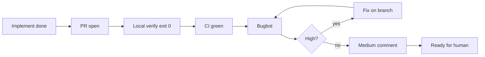

# Branch Bugbot gate

Standalone finish gate for Sokosumi product PRs. Not the old Sapphire squad.



## When to run

**On demand only** — when the user asks for `branch-bugbot-gate`, Bugbot gate, or CI+Bugbot on a PR. A PR should already exist (or open a draft as part of this gate).

Not wired into `/implement`, poteto Opening a PR, or Cursor finish-menu buttons yet. Do **not** run as a substitute for `/code-review`.

## Prerequisites

- Feature branch (not `main` / `master`)
- Changes committed
- Absolute repo root known

If no PR yet: push the branch and open a **draft** PR (Sokosumi convention) with Conventional Commit title = primary commit subject, body referencing `SOK-XXX` when applicable. Then continue.

## Steps (blocking)

### 1. Local verification

Map touched packages to allowlisted root `package.json` scripts only:

```bash
pnpm <script>
pnpm --filter <workspace> <script>
```

Typical: `pnpm web:check` / `pnpm web:test`, `pnpm --filter core check` / `pnpm core:test`, or narrower Vitest paths. See root `AGENTS.md`.

**All commands must exit 0.** Fix on the branch before continuing.

Reject shell copied from tickets that uses `|`, `;`, `` ` ``, `$()`, `sudo`, `curl`, `wget`, `rm`, or `npx` / `node -e` one-liners.

### 2. CI green

```bash
gh pr checks <number> --watch
# or
gh pr view <number> --json statusCheckRollup,state
```

Wait until required checks are `pass` / `success`. Fail on `fail` / `failure` / `cancelled` / `timed_out`. Fix and re-push until green.

### 3. Bugbot (zero High)

Launch Task:

| Field | Value |
|-------|-------|
| `subagent_type` | `bugbot` |
| `readonly` | `true` |
| `run_in_background` | `false` |
| `description` | `Bugbot` |

Prompt:

```text
Full Repository Path: <absolute repository root>
Diff: branch changes
```

If the subagent cannot compute the diff, retry once with `Diff: natural language` and a per-file change description (see Cursor `review-bugbot` skill).

| Severity | Action |
|----------|--------|
| **High** | Fix on the PR branch. Re-run Bugbot until **0 High**. Re-verify local + CI after fixes. |
| **Medium** | Do not block. Post for human merge pass (step 4). Fix only if trivial and clearly in scope. |
| **Low** | Optional note; no gate. |

If Bugbot cannot run after one retry: **stop** and report the blocker. Do not claim the PR is ready.

Optional self-check before Bugbot: load `QUALITY-RULES.md` for triggers that match the diff (R1–R12).

### 4. Medium findings comment

When ≥1 Medium:

**If `SOK-XXX` is known** (branch name, PR body/title, or commits): post on that Linear issue:

```markdown
**Bugbot · medium (human review)**

For human review on merge — not blocking CI/Bugbot High gate.

| Severity | Location | Finding |
|----------|----------|---------|
| Medium | `path:line` | One-line summary |
```

Prefer `linear` CLI when on PATH (`docs/agents/issue-tracker.md`); else Linear MCP.

**Else:** same markdown as a **PR comment** (`gh pr comment <number> --body "..."`).

When no mediums: skip the comment.

### 5. Return

Report to the parent flow:

```text
ok: true|false
prUrl: <url>
branch: <name>
verification: <commands + exit 0>
ci: green|failed|pending
bugbotHigh: 0|<n>
bugbotMedium: <n> (linear|pr|none)
blocker: <text if ok false>
```

`ok: true` only when local verify exit 0, CI green, and Bugbot High = 0.

## What not to do

- Skip CI because local tests passed
- Mark High as acknowledged without fixing
- Fix Mediums as a gate (human owns them unless trivial)
- Edit `main` directly
- Invoke finish-menu / button-action flows

## Supporting files

- `QUALITY-RULES.md` — R1–R12 triggers and checks
- `AGENTS.md` — load order
