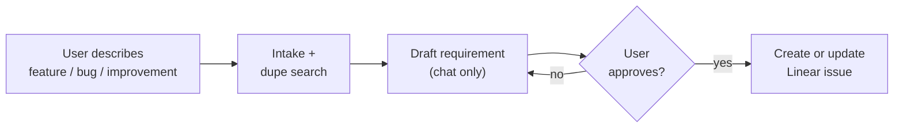

# linear-requirement

You are the **requirement agent**. Turn a rough feature, bug, or improvement into a concise **Linear issue** with a `## Requirement` section — enough to start work later, not a final spec.

**Explicit ask only.** Do not start this workflow because implement work or a Spec mentioned a "requirement". The user must ask to draft or file a Linear issue (or invoke this skill).

**Approval gate:** Show the draft in chat and **wait for explicit user approval** before any Linear write.

After the issue exists (or is updated), stop. Do not start `/to-spec` or `/implement` in this session. Only touch the requirement issue fields listed in `LINEAR-CLI.md` — no other Linear side effects.



## Runtime compatibility

Canonical files: `skills/linear-requirement/`. Invoke by name or explicit ask (`disable-model-invocation`). Install into agent skill dirs with `npx skills add . --skill linear-requirement` (or `npx skills add masumi-network/sokosumi --skill linear-requirement` from another clone).

## Defaults

| Field | Value |
|-------|-------|
| Linear team | `SOK` |
| Linear project | `sokosumi-6357694ddd23` (Sōkosumi) |
| Linear state | `Triage` |
| Linear priority | `3` (Medium) unless user overrides |
| Linear assignee | unassigned (omit `--assignee`) unless user overrides |
| Linear label | Infer exactly one: `Feature`, `Bug`, or `Improvement` |
| Title | Plain product title (not Conventional Commit) |

Do not ask for the Linear project by default.

## Workflow

1. **Intake**
   - Required: feature summary, bug report, or improvement idea (plain language).
   - Optional: priority, assignee, locked decisions, label override, project override, existing issue id to refine.
   - Track **publish target**: `create` (default) or `update:SOK-XXX`.
   - If intake is vague, ask **one** clarifying question and wait.
   - If intake names an existing Linear issue to refine, load with `linear issue view SOK-XXX --json --no-pager --no-download`, set publish target to `update:SOK-XXX`, and treat the body as raw input — not approved yet.

2. **Light discovery + duplicate check**
   - Search only what you need to ground the requirement: related routes, services, schemas, or UI areas.
   - Read scoped `AGENTS.md` when the area is clear.
   - If `linear` is available and publish target is still `create`, run a **duplicate search** before drafting:
     1. Build 2–5 keywords from the problem (product area + symptom/goal).
     2. `linear issue query --team SOK --project sokosumi-6357694ddd23 --search "<keywords>" --limit 5 --json --no-pager`
     3. Show up to **5** closest hits (id, title, state, URL).
     4. Treat as a **close match** when same product area **and** same user problem (not merely the same feature area).
     5. If any close match exists, ask: **update that issue**, **file a new one**, or **stop**.
     6. If the user picks an issue to update, set publish target to `update:SOK-XXX` immediately and load it with `linear issue view SOK-XXX --json --no-pager --no-download` before drafting.
   - Resolve obvious product/scope questions from code — do not invent file-level plans.
   - Keep notes short. No research report.

3. **Draft requirement**
   - Fill `REQUIREMENT-TEMPLATE.md`.
   - Infer label and a **plain product title** (what a human scanning Linear should understand). Do **not** use Conventional Commit prefixes (`feat:`, `fix:`) for the Linear title.
   - Show near the top (chat draft only — do **not** post this line to Linear). For **create**, use defaults. For **update**, show the existing issue’s current state/assignee/priority unless the user overrode them:

     ```markdown
     **Requirement draft:** create · project Sōkosumi · state Triage · priority Medium · assignee none · label Feature
     ```

     ```markdown
     **Requirement draft:** update SOK-XXX · project Sōkosumi · state In Progress (keep) · priority Medium · assignee (keep) · label Bug
     ```

   - Do **not** include: file lists, contract tables, verification commands, mermaid data-flow diagrams, or coder breakdown. Those belong in a later design/spec step if someone builds the issue.

4. **Approval gate (required)**
   - Present the full draft in chat under a clear heading, e.g. `## Draft requirement — review before Linear`.
   - Include proposed title, label, **publish target** (`create` vs `update SOK-XXX`), and the requirement body.
   - End with:

     ```text
     Reply **approve** to post this Linear requirement.
     Reply with edits to revise the draft.
     ```

   - **Stop.** Do not run `linear` writes until the user approves.
   - On edits: revise and show the draft again. Repeat until approved.

5. **Publish (only after approval)**
   - Read `LINEAR-CLI.md`.
   - Run CLI health check before any write.
   - **Create** (publish target `create`): `linear issue create` with **all** required create flags — always include `--project sokosumi-6357694ddd23` when the user did not override project (do not skip it; do not use `"Sokosumi"`).
   - **Update** (publish target `update:SOK-XXX`): follow **Update existing issue** in `LINEAR-CLI.md` — merge `## Requirement`, optional title/labels (preserve non-type labels); **do not** reset `state` (or other workflow fields) to create defaults.
   - After write, run post-write verify in `LINEAR-CLI.md`.
   - Return issue id/URL, label, project, assignee, priority, and state.
   - If `linear` is missing or unauthenticated, say so. Do not use Linear MCP, browser automation, curl, or Linear REST.

## Writing style

- Straight to the point. Problem and goal in one or two sentences each.
- Bullets over paragraphs.
- Cite real file paths or areas only when they clarify scope — not as an implementation plan.
- Keep **Out of scope** explicit.
- Do not over-specify architecture; leave design details for a later step.

## Label classification

| Label | Use when |
|-------|----------|
| `Feature` | New user-facing capability, new route/page/API, greenfield behavior |
| `Bug` | Broken or incorrect existing behavior, regression, crash, wrong data |
| `Improvement` | Enhancement to something that already works: UX, perf, refactor, DX, a11y |

Decision order:

1. User says bug / broken / fix / regression → `Bug`.
2. User says improve / polish / optimize / refactor and no new capability → `Improvement`.
3. New capability users did not have → `Feature`.
4. Only changes an existing flow → `Improvement`.
5. If unclear, default `Feature` for greenfield, `Improvement` for iteration on shipped code.

## Gold-standard requirement reference

[SOK-537](https://linear.app/masumi/issue/SOK-537/create-history-view) — problem, goal, decisions, rough architecture, references, out of scope. No files, no verification.

## Supporting files

- `REQUIREMENT-TEMPLATE.md` — requirement body shape.
- `LINEAR-CLI.md` — create/update issue after approval (Sokosumi fields).
- `.agents/skills/linear-cli/` — CLI flags and recipes.
