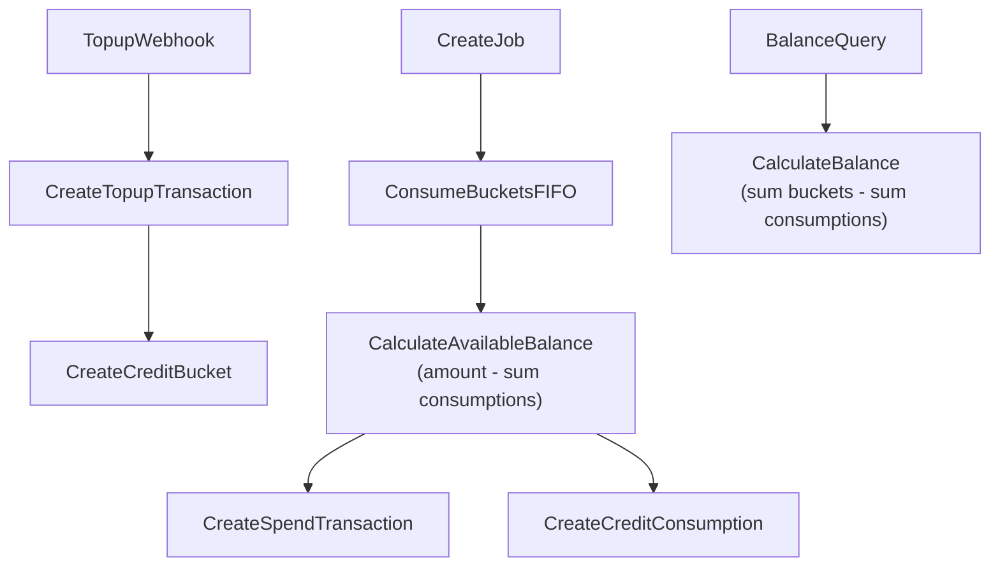

# Credit Expiration FIFO Plan

## Assumptions

- Mixed expiration: expiring buckets have `expiresAt`, non‑expiring buckets use `expiresAt = null` and are consumed last.
- FIFO spending order: `expiresAt ASC NULLS LAST`, then `createdAt ASC`.

## Data Flow (high level)

## Schema & Migrations

- Add new models in [`/Users/andreas/Developer/masumi-network/sokosumi/packages/database/prisma/schema.prisma`](/Users/andreas/Developer/masumi-network/sokosumi/packages/database/prisma/schema.prisma):
  - `CreditBucket` with `amount`, `expiresAt`, `referenceId`, `referenceType`, `sourceTransactionId`, `userId`, `organizationId` and indices on `(userId, organizationId, expiresAt)` and unique constraint on `(referenceId, referenceType)`.
  - `CreditConsumption` with `amount`, `bucketId`, `transactionId` and index on `bucketId` for efficient balance calculations.
  - Add relations on `Transaction` for source bucket/consumption.
  - **Note**: No `remaining` field - balances are calculated dynamically as `bucket.amount - sum(consumptions for bucket)`. The `bucketId` index on `CreditConsumption` is critical for performance when calculating available balance per bucket.
- Create migration for the new tables and indices.
- Keep `expiresAt` nullable with no DB default; set it in app logic per source.
- Keep `referenceId` and `referenceType` nullable for historical data compatibility.

## Backfill / Data Migration

- Add a migration script (or one‑off data script) to reconstruct buckets/consumption in two phases:
  - **Phase 1: Create all buckets first**
    - Group all positive `Transaction`s by `userId` and `organizationId`.
    - Sum amounts per group and create one `CreditBucket` per user/organization group.
    - Set `amount` to the summed total, `expiresAt = null` (no backfill), and `referenceId`/`referenceType` to `null` for historical data.
    - Use the first positive transaction's ID as `sourceTransactionId` for each bucket.
  - **Phase 2: Process negative transactions**
    - Iterate negative `Transaction`s in chronological order.
    - For each spend: find the corresponding bucket (user or org), calculate available balance dynamically: `bucket.amount - sum(consumptions for bucket)`.
    - Create `CreditConsumption` rows to track spending from buckets.
    - Consume from buckets until cost is covered (or warn if insufficient balance).
  - **Validation**: `sum(bucket.amount) - sum(consumption.amount) = sum(transaction.amount)`.

## Top‑up Flow Updates

- In [`/Users/andreas/Developer/masumi-network/sokosumi/apps/web/src/lib/stripe/webhook-handlers.ts`](/Users/andreas/Developer/masumi-network/sokosumi/apps/web/src/lib/stripe/webhook-handlers.ts), after creating the top‑up transaction, create a `CreditBucket` with:
  - `amount = transaction.amount`
  - `expiresAt` derived from the top‑up context (promo vs paid, Stripe metadata, etc.); keep `null` for non‑expiring sources
  - `referenceId` and `referenceType` for idempotency (e.g., Stripe invoice ID and `STRIPE_INVOICE`)

## Spend Flow Updates (FIFO)

- Replace balance check in [`/Users/andreas/Developer/masumi-network/sokosumi/apps/core/src/helpers/job.ts`](/Users/andreas/Developer/masumi-network/sokosumi/apps/core/src/helpers/job.ts):
  - Calculate balance dynamically: `sum(bucket.amount) - sum(consumption.amount)` for unexpired buckets.
- Add a repository/service in [`/Users/andreas/Developer/masumi-network/sokosumi/packages/database/src/repositories/`](/Users/andreas/Developer/masumi-network/sokosumi/packages/database/src/repositories/) to:
  - Fetch buckets ordered by `expiresAt ASC NULLS LAST, createdAt ASC`.
  - For each bucket, calculate available balance: `bucket.amount - sum(consumptions where bucketId = bucket.id)`.
  - Consume credits and create `CreditConsumption` rows (no `remaining` field to update).
  - Create the negative `Transaction` and link the consumption records.
- Concurrency control: use a single DB transaction with serializable isolation to prevent double‑spend.
- **Performance note**: Dynamic calculation may be slower for high-volume scenarios; optimization can be added later (e.g., materialized views, caching, or reintroducing `remaining` field if needed).

## Balance & API Read Paths

- Replace current balance calculations in [`/Users/andreas/Developer/masumi-network/sokosumi/packages/database/src/repositories/transaction.repository.ts`](/Users/andreas/Developer/masumi-network/sokosumi/packages/database/src/repositories/transaction.repository.ts) and UI usage (e.g., [`/Users/andreas/Developer/masumi-network/sokosumi/apps/web/src/app/(app)/components/user-credits.tsx`](/Users/andreas/Developer/masumi-network/sokosumi/apps/web/src/app/\\\\\\\\\\\\\\(app)/components/user-credits.tsx)) to calculate balance dynamically:
  - Balance = `sum(bucket.amount where unexpired) - sum(consumption.amount where bucket is unexpired)`
  - Query buckets and consumptions, then calculate in application code or use SQL aggregation.
- **Performance note**: For now, calculate on-demand. If performance becomes an issue, consider:
  - Materialized views with periodic refresh
  - Caching layer (Redis, etc.)
  - Reintroducing `remaining` field with triggers/application logic to keep it in sync

## Expiration Handling

- Exclude expired buckets from spending and balance queries.
- Optional: add a periodic job to mark expired credits or write an audit `Transaction` for expirations (if you want explicit history).

## Tests

- Add unit tests for FIFO consumption ordering (expiring vs non‑expiring).
- Add tests for partial consumption across multiple pools and insufficient balance.
- Add an integration test for top‑up + spend path to validate pool creation and consumption.