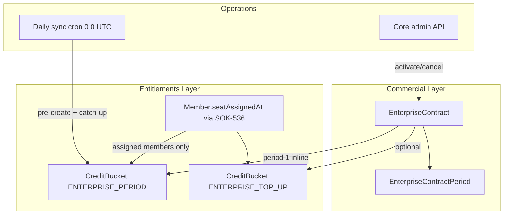
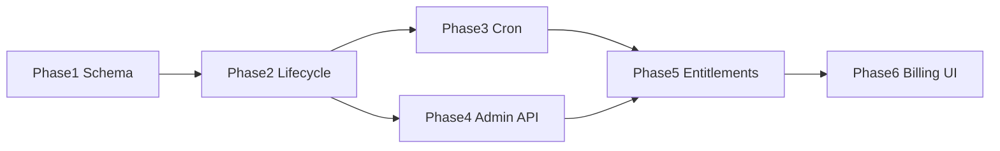

# Enterprise Contracts (SOK-535) — Phased Implementation Plan

## Context

- **Linear:** [SOK-535](https://linear.app/masumi/issue/SOK-535/enterprise-contracts-sokosumi-managed-entitlements) — contract-driven org entitlements, out-of-band payment, shared monthly credit pool, plan exclusivity.
- **Blocker cleared:** [SOK-536](https://linear.app/masumi/issue/SOK-536) (purchased vs assigned seats) is **Done** — reuse `Member.seatAssignedAt`, `[member.repository.ts](packages/database/src/repositories/member.repository.ts)`, and `[organization-seats.ts](packages/database/src/helpers/organization-seats.ts)`.
- **Current state:** Phase 1 complete on feature branch — schema + `[enterprise-contract.ts](packages/database/src/helpers/enterprise-contract.ts)` schedule helpers + 19 unit tests. No lifecycle/API/cron yet. Existing primitives to reuse:
  - `CreditBucket.activatesAt` + `[creditBucketActivatesAtOrBefore()](packages/database/src/helpers/credit.ts)` (spec’s `activeFrom` maps to this field — **do not add a duplicate column**)
  - Per-period pre-create pattern in `[subscription.ts](packages/database/src/helpers/subscription.ts)` and `[free-subscription-sync.service.ts](apps/core/src/services/free-subscription-sync.service.ts)`
  - Admin auth via `[requireAdminAuthContext()](apps/core/src/middleware/auth.ts)` (same as credit-costs routes)
  - Sync/cron wiring via `[apps/core/src/routes/sync/](apps/core/src/routes/sync/)` + `[apps/core/vercel.json](apps/core/vercel.json)`
- **Out of scope (follow-ups):** SOK-542 (Stripe OTC), SOK-543 (auto-cancel on activate), SOK-544 (amendments), internal web admin UI (your choice: **API only**).
- **Naming (explicit non-goal):** Do **not** rename `[free-subscription-sync.service.ts](apps/core/src/services/free-subscription-sync.service.ts)` as part of SOK-535. That service is specific to local *free* tier renewal (`plan = "free"`, no `stripeSubscriptionId`); enterprise contracts get their own `enterprise-contract-sync.service.ts` in Phase 3. A future rename to `local-free-subscription-sync.service.ts` could align with `LOCAL_FREE_`* helpers but is unrelated churn — defer unless tackled separately.

## Architecture (target)

**Key design choices (from spec):**

- One **org-level shared pool** per period (`organizationId` set, `userId` null), full monthly grant every period (no proration). Stored as **`centsPerMonth`** / **`centsToGrant`** in DB; exposed as credits at API boundaries.
- **`periodCount`** — commercial term length (number of full rolling monthly grant periods). **No stored `endDate`**; contract end is derived via `deriveEnterpriseContractEndDate()` or the last materialized period row.
- **`startDate`** (optional) — earliest date the contract may begin. If unset at activation, defaults to `activatedAt` (immediate start). If set (including a future date), entitlements begin no earlier than `startDate`, even when activation/payment happens sooner. **Replaces `billingAnchorDay`**; each period runs **one calendar month** from its `periodStart` (same rolling-month rules as `getNextMonthlyPeriodEnd()` in `subscription.ts` — e.g. Jan 31 + `periodCount: 2` → two full months, not calendar-month boundaries).
- `contract.seats` = purchased capacity for seat assignment (not member-count gate).
- Activation blocked if org/members have paid subs with consumable buckets (list offenders; no auto-cancel until SOK-543).
- Extract `activateEnterpriseContract(contractId, { paymentReference, activatedAt })` as a callable helper for future SOK-542 webhook reuse.

---

## Phase 1 — Database schema and period math ✅

**Goal:** Persist the domain model and validate schedule generation without side effects.

**Delivered** (migration `20260602140000_add_enterprise_contracts`, `[enterprise-contract.ts](packages/database/src/helpers/enterprise-contract.ts)`, unit tests):

1. **Prisma models** in `[schema.prisma](packages/database/prisma/schema.prisma)`:
  - `EnterpriseContract` (org-scoped, status enum, commercial fields, `paymentReference`, `notes`, `externalReference`)
    - **`id`** `@default(uuid(7)) @db.Uuid` — native PostgreSQL UUID (same as `Workspace`, `Conversation`)
    - **`startDate`** `DateTime?` — optional earliest contract start; **must be normalized at activation** (see Phase 2)
    - **`periodCount`** `Int` — commercial term length (number of full rolling monthly grant periods); **no `endDate` column** — contract end is derived from the last materialized period (or `deriveEnterpriseContractEndDate()`)
    - **`centsPerMonth`** `BigInt` — monthly grant size in cents
    - **`oneTimeCents`** `BigInt?` — optional lump-sum org grant on activation (cents)
    - **No `billingAnchorDay` column** — rolling month derived from `startDate` via `getNextMonthlyPeriodEnd()`
    - **No audit/event table** — deferred; contract `status` + timestamps suffice for MVP
    - **No `createdByUserId`** — admin identity not stored on contract row
  - `EnterpriseContractPeriod` (materialized schedule + status enum)
    - **`centsToGrant`** `BigInt` — snapshot copied from `contract.centsPerMonth` (full amount every period; no proration)
  - Partial unique index: at most one `active` contract per `organizationId`
  - Extend `CreditBucketReferenceType` with `ENTERPRISE_PERIOD`, `ENTERPRISE_TOP_UP`
2. **Helpers** (`enterprise-contract.ts`):
  - `resolveContractStartDate(startDate, activatedAt)` — `startDate ?? activatedAt`
  - `buildEnterpriseContractPeriodSchedule({ startDate, periodCount, ... })` — exactly **`periodCount`** full rolling months via `getNextMonthlyPeriodEnd()`
  - `deriveEnterpriseContractEndDate(startDate, periodCount)` — last period end (for consumable window / completion checks)
  - `previewEnterpriseContractPeriods()` — **`activatedAt` required** (no implicit `new Date()`)
  - `isEnterpriseContractActive()` — `status === active` and `now ∈ [startDate, deriveEnterpriseContractEndDate(...)]` using **`periodCount`**
  - `validateMinEnterpriseCreditsPerMonth()` / `validateEnterprisePeriodCount()` — for API boundary
3. **Tests** cover: rolling month (incl. Jan 31), leap year, full grant / no proration, `periodCount: 1`, invalid `periodCount`, future `startDate` preview, consumable window including after last period.

**Suggested PR title:** `feat(database): add enterprise contract schema and period schedule`

### Period schedule rules (authoritative — carry into Phase 2+)

Each period runs **one calendar month from its `periodStart`**, using the same logic as local-free subscriptions (`getNextMonthlyPeriodEnd(periodStart, contractStartDate)`):

- **Not** calendar-month boundaries and **not** “roll to 1st of next month when day missing”.
- **Term length:** `periodCount` full periods — e.g. `startDate = Jan 31`, `periodCount = 2` → Jan 31–Feb 28, then Feb 28–Mar 31 (both full grants).
- **No tail-clamp / partial final period** — every period is a full rolling month; total grants = `periodCount × centsPerMonth`.
- **Contract end** for completion/cron: last row’s `periodEnd`, or `deriveEnterpriseContractEndDate(startDate, periodCount)`.

---

## Phase 2 — Lifecycle: activate, cancel, and credit grants

**Goal:** Callable domain routines that materialize periods and buckets; safe to unit/integration test in isolation.

**New helpers in `packages/database/src/helpers/`:**

| Module                               | Responsibility                                                                                                                                                                          |
| ------------------------------------ | --------------------------------------------------------------------------------------------------------------------------------------------------------------------------------------- |
| `enterprise-contract-grants.ts`      | `createEnterprisePeriodCreditBucket()`, `createEnterpriseTopUpCreditBucket()`, `expireCreditBucketsNow()` — idempotent via `@@unique([referenceId, referenceType])` on `CreditBucket`; reference types `ENTERPRISE_PERIOD`, `ENTERPRISE_TOP_UP` |
| `enterprise-contract-exclusivity.ts` | `findPaidSubscriptionsBlockingEnterpriseActivation()` — org + member paid subs with consumable buckets                                                                                  |
| `enterprise-contract-lifecycle.ts`   | `activateEnterpriseContract()`, `cancelEnterpriseContract()`, `completeEnterpriseContractsAfterLastPeriod()` (or similar), `EnterpriseContractActivationError` with blocking subscription list           |

**Phase 2 must-dos (from Phase 1 review):**

- **`startDate` normalization on activate:** persist `startDate = startDate ?? activatedAt` before materializing periods or grants. All consumable checks use this resolved value — never pass nullable `contract.startDate` into `isEnterpriseContractActive()`.
- **Reuse `buildEnterpriseContractPeriodSchedule()`** for materialization; do not reimplement period boundaries.
- **Period idempotency:** delete draft preview rows on activate, then insert schedule once; grants via stable `referenceId` + bucket unique constraint. Optional hard guard: `@@unique([contractId, periodStart])` on `EnterpriseContractPeriod` (code-first is enough for MVP).
- **Period status:** `scheduled`, `active`, `expired`, `void` only — `skipped` was never added to the enum.
- **No event/audit writes** — activation/cancel update contract + period status only.

**Activation behavior (spec-critical):**

1. Guard → reject with blocking subscriptions if any
2. Stamp `activatedAt`; normalize **`startDate`**: if null, set `startDate = activatedAt`
3. Materialize full schedule via `buildEnterpriseContractPeriodSchedule({ startDate, periodCount, centsPerMonth, purchasedSeats: seats })`; persist periods with `status = scheduled` (period 1 → `active` after bucket created)
4. Create period-1 bucket inline: **`activatesAt = startDate`**, `expiresAt = periodEnd`, flip period → `active` (non-consumable until `startDate` if future)
5. Optional top-up org bucket on activation: **`activatesAt = startDate`**, `ENTERPRISE_TOP_UP`

**Contract start (entitlements + exclusivity):** While status is `active`, the contract is **consumable** only when `isEnterpriseContractActive()` is true (`now >= startDate` and `now <= deriveEnterpriseContractEndDate(startDate, periodCount)`). Plan exclusivity (Phase 5) uses the same window — early activation records payment but does not lock the org or grant credits until `startDate`.

**Cancellation behavior:**

- `expiresAt = now` on current + top-up buckets (reuse existing expiry path)
- Void (`status = void`) all **`scheduled`** periods
- Void future **`active`** periods whose bucket `activatesAt > now` (Phase 3 must always set non-null `activatesAt` on enterprise buckets — see Phase 3 **`activatesAt` requirement**)

**Period status reference:**

| Status | Meaning |
|--------|---------|
| `scheduled` | Future period; bucket not yet created (or pre-created by cron) |
| `active` | Current period; org pool bucket exists |
| `expired` | Period ended normally |
| `void` | Invalidated by cancel — never grants |

**Tests:** Transaction-level tests with Prisma test doubles (mirror `[subscription.test.ts](packages/database/src/helpers/subscription.test.ts)` patterns): activation idempotency, top-up grant idempotency, cancel voids future buckets, activation guard lists blockers, `startDate` persisted on activate when null.

**Deliverable:** Package-level lifecycle fully tested; still no HTTP surface.

**Suggested PR title:** `feat(database): enterprise contract activate and cancel lifecycle`

---

## Phase 3 — Daily scheduler cron

**Goal:** Automated period bucket pre-creation, catch-up, and period close-out.

**New code:**

- `runEnterpriseContractSchedulerPass()` in `enterprise-contract-lifecycle.ts` (or dedicated `enterprise-contract-scheduler.ts`):
  - Complete contracts when all periods are expired and `now` is past the last period’s `periodEnd` (or use `deriveEnterpriseContractEndDate`)
  - Flip `active` → `expired` when bucket `expiresAt <= now`
  - Pre-create: `scheduled` periods with `periodStart ∈ [now, now + 24h]` on `active` contracts
  - Catch-up: `scheduled` + `periodStart <= now` + no bucket → create with `activatesAt = now`

**`activatesAt` requirement (cancel correctness):** Phase 2 cancel voids future **`active`** periods using **bucket `activatesAt > now`** (see Phase 2 cancellation behavior). `CreditBucket.activatesAt` is nullable globally (`null` = immediately active), so **Phase 3 must never create enterprise buckets with a null `activatesAt`**. All scheduler and grant paths must set it explicitly:

| Path | `activatesAt` |
|------|----------------|
| Pre-create (period not yet started) | `periodStart` |
| Catch-up (missed period) | `now` |
| Phase 2 activation (already implemented) | `startDate` |

Flip period → `active` only **after** the bucket row exists with non-null `activatesAt`. Do not add a `periodStart` fallback in cancel for MVP — enforce the invariant at creation instead.

- `[apps/core/src/services/enterprise-contract-sync.service.ts](apps/core/src/services/enterprise-contract-sync.service.ts)` — thin wrapper (mirror free-subscription sync)
- Route: `GET /sync/enterprise-contracts-renewal` mounted in `[routes/sync/index.ts](apps/core/src/routes/sync/index.ts)`
- Cron entry in `[apps/core/vercel.json](apps/core/vercel.json)`: `"schedule": "0 0 * * *"`

**Tests:** Scheduler pass scenarios (pre-create window, catch-up idempotency, expired transition, completed contract). Catch-up uses `activatesAt = now` (not `periodStart`) when period was missed. Assert every created `ENTERPRISE_PERIOD` / `ENTERPRISE_TOP_UP` bucket has non-null `activatesAt` with the expected value for pre-create vs catch-up.

**Note:** No audit/event writes on scheduler pass — only period status + bucket create/expire.

**Deliverable:** Cron runnable locally via sync endpoint; periods 2+ grant automatically.

**Suggested PR title:** `feat(core): enterprise contract daily renewal cron`

---

## Phase 4 — Admin Core API (API-only MVP)

**Goal:** Internal ops can manage contracts end-to-end without Stripe.

**New routes under `apps/core/src/routes/v1/enterprise-contracts/`** (all use `requireAdminAuthContext`):

| Method | Path                                         | Purpose                                                           |
| ------ | -------------------------------------------- | ----------------------------------------------------------------- |
| POST   | `/enterprise-contracts`                      | Create draft (accept optional `startDate`, required `periodCount`; API field may be named `periods`) |
| GET    | `/enterprise-contracts`                      | List/filter by org, status                                        |
| GET    | `/enterprise-contracts/{id}`                 | Detail + periods                                                |
| PATCH  | `/enterprise-contracts/{id}`                 | Edit draft only                                                   |
| POST   | `/enterprise-contracts/{id}/activate`        | Body: `paymentReference`; 409 with blocking subs on guard failure |
| POST   | `/enterprise-contracts/{id}/cancel`          | Cancel active contract                                            |
| GET    | `/enterprise-contracts/{id}/periods/preview` | Preview schedule for draft                                        |

**Validation at API boundary (Zod + `422`):** keep schedule helpers pure; reject bad input before DB writes.

| Field | Rule |
|-------|------|
| `creditsPerMonth` | `validateMinEnterpriseCreditsPerMonth()` (≥ 60_000 credits) |
| `seats` | integer ≥ 1 |
| `periodCount` (API: `periods`) | integer ≥ 1 (`validateEnterprisePeriodCount`) |
| `oneTimeCredits` | optional; if set, ≥ 0 |
| Preview query/body | **`activatedAt` required** when simulating activation without explicit `startDate`; pass explicit timestamp (e.g. hypothetical activation time), never rely on server “now” implicitly |

**Preview endpoint:** call `previewEnterpriseContractPeriods({ activatedAt, startDate?, periodCount, centsPerMonth, purchasedSeats })` — map response `creditsToGrant` from `centsToGrant`; include derived `contractEnd` from `deriveEnterpriseContractEndDate()` in response for display (not stored).

**Product decision (document in PR):** **multiple `draft` contracts per org are allowed** for MVP (iterate on terms before activate). Only one `active` per org (DB partial unique). Revisit one-draft-per-org later if admin UX needs it.

**Supporting files:**

- `[apps/core/src/schemas/enterprise-contract.schema.ts](apps/core/src/schemas/enterprise-contract.schema.ts)` — Zod + OpenAPI; **request/response fields in credits** (`creditsPerMonth`, `oneTimeCredits`, period preview `creditsToGrant`); map to/from DB **`centsPerMonth`**, **`oneTimeCents`**, **`centsToGrant`** at route boundary
- `[apps/core/src/helpers/enterprise-contract-api.ts](apps/core/src/helpers/enterprise-contract-api.ts)` — response mappers (`convertCentsToCredits` on all stored cent fields)
- Mount in `[apps/core/src/routes/v1/index.ts](apps/core/src/routes/v1/index.ts)`
- OpenAPI contract tests (mirror credit-costs / coworkers admin patterns)

**Org-scoped read (non-admin):**

- `GET /organizations/{id}/enterprise-contract` — active or latest contract summary for org admins (reuse org auth patterns from existing org routes)

**Deliverable:** Full admin lifecycle via Core API + OpenAPI; ops can activate real contracts once Phase 5 ships.

**Suggested PR title:** `feat(core): enterprise contract admin API`

---

## Phase 5 — Entitlements, consumption, and plan exclusivity

**Goal:** Make enterprise contracts enforceable in production — this phase must land before activating customer contracts.

### 5a. Plan resolution

New helper: `resolveOrganizationBillingPlan(organizationId)` — check **consumable** `EnterpriseContract` first via `isEnterpriseContractActive()` (`active` + resolved `startDate` + `periodCount`) → `{ plan: 'enterprise', purchasedSeats: contract.seats }`, else fall back to `[subscriptionRepository.resolveActiveSubscriptionByReferenceId](packages/database/src/repositories/subscription.repository.ts)`.

**Important:** load contract with non-null `startDate` (active contracts must have been activated with normalization from Phase 2). Use `isEnterpriseContractActive()` from `[enterprise-contract.ts](packages/database/src/helpers/enterprise-contract.ts)`.

Wire into:

- `[organization-seat.service.ts](apps/web/src/lib/services/organization-seat.service.ts)` — `getSeatSummary`, `assignSeat` use contract seats when enterprise
- `[apps/web/src/app/(app)/billing/page.tsx](apps/web/src/app/(app)/billing/page.tsx)` — `currentPlan = 'enterprise'` when contract is consumable

### 5b. Credit consumption (shared org pool, assigned-only)

Update `[credit-bucket.repository.ts](packages/database/src/repositories/credit-bucket.repository.ts)` scope logic:

- Include `ENTERPRISE_PERIOD` / `ENTERPRISE_TOP_UP` org-level buckets for **assigned** members only
- Exclude enterprise pool buckets for unassigned members and for orgs without active contract

Update `[apps/core/src/helpers/subscription.ts](apps/core/src/helpers/subscription.ts)` credit breakdown to surface enterprise pool balance separately from per-member subscription credits.

### 5c. Suppress conflicting entitlements

While contract is **consumable** (`isEnterpriseContractActive()`):

- **Block** org subscription purchase in `[subscription/action.ts](apps/web/src/lib/actions/subscription/action.ts)` + `[organization-subscription.service.ts](apps/web/src/lib/services/organization-subscription.service.ts)`
- **Block** personal subscription purchase for members of enterprise orgs
- **Skip** local-free / unassigned-member free grants (`[webhook-handlers.ts](apps/web/src/lib/stripe/webhook-handlers.ts)`, `[organization-subscription.service.ts](apps/web/src/lib/services/organization-subscription.service.ts)`) for enterprise orgs
- **Unassigned members:** zero entitlements (no free-tier fallback)

### 5d. Seat assignment capacity

When enterprise active, `memberRepository.assignSeat(..., purchasedSeats)` receives `contract.seats` instead of `subscription.seats`.

**Tests:** Exclusivity guards, assigned-only pool consumption, unassigned member gets zero balance, seat assign respects contract capacity, exclusivity lifts on cancel/complete.

**Deliverable:** Safe to activate production contracts.

**Suggested PR title:** `feat(billing): enterprise contract entitlements and exclusivity`

---

## Phase 6 — Org billing UI summary

**Goal:** Org admins see contract status on the billing page (internal admin remains API-only).

**Changes in `[apps/web](apps/web)`:**

- Fetch active contract via Core client or server-side Prisma/repository (prefer generated Core client if available post Phase 4 OpenAPI regen)
- New component e.g. `enterprise-contract-summary.tsx` in billing section — pool balance, period expiry, next bucket activation
- i18n keys in all locale files per [translations rules](apps/web/.cursor/rules/translations.mdc)
- Update `[organization-subscription-section.tsx](apps/web/src/components/billing/organization-subscription-section.tsx)` to show enterprise state instead of self-serve plan cards when `plan === 'enterprise'`

**Deliverable:** Meets final acceptance criterion for org-admin billing visibility.

**Suggested PR title:** `feat(web): enterprise contract summary on billing page`

---

## Cross-cutting conventions

- **Credits vs cents:** Database stores **cents only** (`centsPerMonth`, `oneTimeCents`, `centsToGrant`, `CreditBucket.amount`). API request/response and validation minimums use **credits**; convert at the boundary with `convertCreditsToCents()` / `convertCentsToCredits()` ([credits-api rule](apps/core/.cursor/rules/credits-api.mdc)). Do not name Prisma columns `creditsPerMonth` — that would contradict `CreditBucket`, `Transaction.amount`, and `CreditCost.centsPerUnit`.
- **Contract term:** `periodCount` is the commercial source of truth (API may expose as `periods`). No stored `endDate` — use `deriveEnterpriseContractEndDate()` or the last materialized `EnterpriseContractPeriod.periodEnd` for completion/cron/display.
- **Contract start:** Optional `startDate` replaces `billingAnchorDay`. Persist **`startDate = startDate ?? activatedAt` on activate**. Early activation before a future `startDate` is allowed; buckets use `activatesAt = startDate`. Entitlements/consumption require resolved `startDate` + `periodCount`.
- **Period schedule:** One calendar month per period via `getNextMonthlyPeriodEnd()` — exactly `periodCount` full periods; see **Period schedule rules** under Phase 1.
- **Audit trail:** No `EnterpriseContractEvent` table in MVP — rely on contract/period status and timestamps; add event log in a follow-up if ops need it.
- **Bucket reference types:** `ENTERPRISE_PERIOD` (monthly pool), `ENTERPRISE_TOP_UP` (optional lump-sum on activation).
- **Errors:** Use Core error helpers (`conflict`, `unprocessableEntity`, etc.) — never raw `c.json`.
- **Transactions:** All activation/cancel/scheduler work inside `prisma.$transaction`.
- **Branch:** Linear suggests `sok-535-enterprise-contracts-sokosumi-managed-entitlements`; one phase ≈ one PR off `main`.
- **Verification per phase:** `pnpm --filter @sokosumi/database test`, `pnpm core:test`, `pnpm web:test` (as applicable), `pnpm check`.

## Deferred / out of scope (track separately)

| Item | Recommendation |
|------|----------------|
| `EnterpriseContractEvent` audit log | Follow-up if ops need history beyond status + timestamps |
| `createdByUserId` | Not in MVP; admin auth is session/API-key only |
| `skipped` period status | Omitted from initial migration; `void` covers cancel |
| `@@unique([contractId, periodStart])` | Optional DB guard; code idempotency sufficient for MVP |
| DB check constraints (`seats > 0`, etc.) | API validation in Phase 4 |
| One draft per org | Allow multiple drafts for MVP |
| SOK-542 / SOK-543 / SOK-544 | Stripe OTC, auto-cancel on activate, amendments |
| Internal web admin UI | Core API only |
| Linear issue copy | Sync enum names, `periodCount` model (no `endDate`), and period rules when closing Phase 1 PR — **done (SOK-535 updated 2026-06-02)** |

## Recommended merge order and checkpoints

| Phase | Merge when                            | Safe to activate real contracts?   |
| ----- | ------------------------------------- | ---------------------------------- |
| 1–2   | Schema + lifecycle tests green        | No (no API/cron)                   |
| 3     | Cron tested locally                   | No (no enforcement)                |
| 4     | Admin API tested via OpenAPI/CLI      | **No** (entitlements not enforced) |
| 5     | Exclusivity + consumption tests green | **Yes**                            |
| 6     | UI verified on billing page           | Yes (full MVP)                     |

## Dependency diagram

Phases 3 and 4 can be developed in parallel after Phase 2; Phase 5 depends on both.