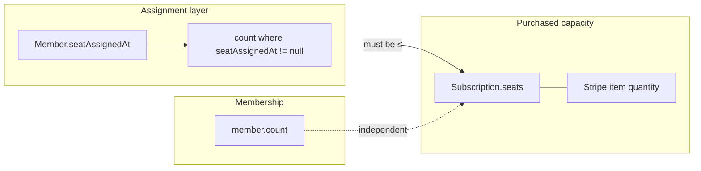

# SOK-536: Organization seat assignment plan

## Goal

Today seats and membership are coupled: paid orgs auto-bump Stripe quantity on invite accept, seat updates require `seats >= memberCount`, and subscription credits split across **all** members. SOK-536 introduces explicit seat assignment so orgs can buy N seats, assign them to a subset of members, and invite members without changing purchased capacity.



## Current touchpoints (what changes)

| Area | File | Current behavior | Target |
|------|------|------------------|--------|
| Seat validation | [`organization-subscription.service.ts`](apps/web/src/lib/services/organization-subscription.service.ts) | `ensureValidSeatCount(seats, memberCount)` | Validate `seats >= assignedCount` (min 1) |
| Invite accept | Same + [`auth.ts`](apps/web/src/lib/auth/auth.ts) `beforeAcceptInvitation` | Auto-bump Stripe to `memberCount + 1` | No-op for seat quantity (keep active-sub check only) |
| Local free sync | Same `syncLocalFreeSeatsAndCreditsForCurrentMembersInternal` | Sets `seats = members.length`, grants all members | Do **not** mutate purchased seats on member add; grant credits to **assigned** members only |
| Stripe credits | [`webhook-handlers.ts`](apps/web/src/lib/stripe/webhook-handlers.ts) | `maxSeatGrantQuantity = all members`; split across all | Cap/split using **assigned** member user IDs |
| Local free helper | [`packages/database/src/helpers/subscription.ts`](packages/database/src/helpers/subscription.ts) `normalizeLocalFreeSubscriptionPeriod` | `seats = memberUserIds.length` | Accept assigned member list; do not derive purchased seats from member count |
| Billing UI min seats | [`organization-seat-settings-fields.tsx`](apps/web/src/components/billing/organization-seat-settings-fields.tsx) | `min = memberCount` | `min = max(1, assignedCount)` |
| Members UI | [`organizations/[organizationSlug]/page.tsx`](apps/web/src/app/(app)/organizations/[organizationSlug]/page.tsx) | No seat info | Seat summary + per-member status/actions |

No seat fields exist on `Member` today ([`schema.prisma`](packages/database/prisma/schema.prisma) lines 252–263). No Core REST routes are required for v1; web server actions + existing Prisma access match current org management patterns.

---

## Phase 1: Data model and migration

### Schema

Add to `Member`:

```prisma
seatAssignedAt DateTime?
```

- **Assigned** = `seatAssignedAt != null`
- Prefer timestamp over boolean for audit trail and stable ordering during backfill

Add index for org queries: `@@index([organizationId, seatAssignedAt])`

### Migration + backfill (same migration or follow-up SQL)

Preserve existing entitlements for live orgs:

1. For each org with an active subscription, read `subscription.seats` (fallback 1).
2. Order members by `createdAt ASC`.
3. Set `seatAssignedAt = now()` on the first `min(memberCount, purchasedSeats)` members.
4. Leave excess members unassigned when `memberCount > purchasedSeats` (should be rare on paid plans today because of auto-bump, but safe).

New members after deploy default to **unassigned** unless admin assigns.

---

## Phase 2: Database layer helpers

Extend [`member.repository.ts`](packages/database/src/repositories/member.repository.ts):

- `getAssignedMemberCount(organizationId)`
- `getAssignedMemberUserIds(organizationId)` — sorted, unique (reuse pattern from webhook)
- `assignSeat(memberId, organizationId)` / `unassignSeat(memberId, organizationId)` — transactional updates with capacity checks
- Optional: `getSeatSummary(organizationId)` → `{ purchasedSeats, assignedCount, unusedSeats, memberCount }`

Add a small shared helper in `packages/database/src/helpers/` (e.g. `organization-seats.ts`) for `assignedCount <= purchasedSeats` validation so SOK-535 enterprise capacity can reuse assignment logic later.

Update [`packages/database/src/types/member.ts`](packages/database/src/types/member.ts) if member-with-user types need `seatAssignedAt`.

---

## Phase 3: Seat assignment service (web)

New [`apps/web/src/lib/services/organization-seat.service.ts`](apps/web/src/lib/services/organization-seat.service.ts):

| Method | Rules |
|--------|-------|
| `getSeatSummary(orgId)` | Load active subscription + counts |
| `assignSeat(userId, orgId, memberId)` | Caller must be owner/admin; member belongs to org; `assignedCount < purchasedSeats`; idempotent if already assigned |
| `unassignSeat(...)` | Owner/admin; clears `seatAssignedAt`; confirm in UI only |

Wire server actions in [`apps/web/src/lib/actions/organization/action.ts`](apps/web/src/lib/actions/organization/action.ts) (or new `seat/action.ts`):

- `assignOrganizationSeat(memberId)`
- `unassignOrganizationSeat(memberId)`
- `getOrganizationSeatSummary(organizationId)` (if needed client-side)

Use existing `withSession` auth pattern from subscription actions.

---

## Phase 4: Refactor subscription service

In [`organization-subscription.service.ts`](apps/web/src/lib/services/organization-subscription.service.ts):

1. **Replace** `ensureValidSeatCount(seats, memberCount)` with `ensureValidPurchasedSeatCount(seats, assignedCount)` — only enforce `seats >= assignedCount` and `seats >= 1`.
2. **`updateOrganizationSeatsImmediately`**: use assigned count instead of member count; block decrease below assigned count with clear error message.
3. **`ensureCanAcceptInvitation`**: remove Stripe auto-bump block (lines 307–314). Keep requirement for active subscription if that remains product policy.
4. **`syncLocalFreeSeatsAndCreditsForCurrentMembersInternal`**:
   - Stop setting `subscription.seats = members.length`
   - Pass **assigned** `memberUserIds` into `ensureLocalFreeSubscriptionPeriod`
   - Do not auto-assign on member add

Remove or repurpose `getRequiredSeatsForNextMember` (only used for auto-bump).

---

## Phase 5: Credit grant scope

### Stripe webhooks — [`webhook-handlers.ts`](apps/web/src/lib/stripe/webhook-handlers.ts)

- When resolving org members for invoice processing, load **assigned** user IDs instead of all members.
- Set `maxSeatGrantQuantity` to `assignedMemberUserIds.length` (not all members).
- `splitCreditsByMember` receives assigned IDs only.
- Update tests in [`webhook-handlers.test.ts`](apps/web/src/lib/stripe/__tests__/webhook-handlers.test.ts): scenarios for unused purchased seats, unseated members, cap behavior.

### Local free — [`subscription.ts`](packages/database/src/helpers/subscription.ts)

- Change `normalizeLocalFreeSubscriptionPeriod` to **not** set `seats` from grant list length (purchased seats live on `Subscription.seats`).
- Callers pass assigned member IDs for grant creation.
- Update [`subscription.test.ts`](packages/database/src/helpers/subscription.test.ts).

### Core read path

No change expected: [`apps/core/src/helpers/subscription.ts`](apps/core/src/helpers/subscription.ts) already scopes org subscription credits by `member:{userId}:` prefix. Unseated members simply won't receive new period buckets.

---

## Phase 6: UI

### Organization overview (primary UX)

[`organizations/[organizationSlug]/page.tsx`](apps/web/src/app/(app)/organizations/[organizationSlug]/page.tsx):

- Fetch seat summary server-side for owner/admin.
- Add **seat summary card** (purchased / assigned / unused) above members table.
- Link to `/billing` for purchasing more seats.

[`members-table`](apps/web/src/components/members-table/):

- Add **Seat** column (badge: assigned vs unassigned).
- Extend [`member-actions-dropdown.tsx`](apps/web/src/components/members-table/member-actions-dropdown.tsx) with assign/unassign actions (owner/admin only).
- Unassign confirmation modal (removes paid subscription-period access going forward).

Update [`MemberRowData`](apps/web/src/components/members-table/types.ts) and [`organization.service.ts`](apps/web/src/lib/services/organization.service.ts) to include `seatAssignedAt`.

### Billing page

[`billing/page.tsx`](apps/web/src/app/(app)/billing/page.tsx) + [`organization-subscription-section.tsx`](apps/web/src/components/billing/organization-subscription-section.tsx):

- Pass `assignedSeatCount` alongside `memberCount`.
- Update [`organization-seat-settings-fields.tsx`](apps/web/src/components/billing/organization-seat-settings-fields.tsx): minimum = `max(1, assignedCount)`; hint text explains purchased vs assigned.
- Show summary: purchased / assigned / unused / members.
- Update [`organization-enterprise-plan-card.tsx`](apps/web/src/components/billing/organization-enterprise-plan-card.tsx) to show assigned + unused (read-only).

Onboarding dialog seat fields: same minimum-seat logic update.

---

## Phase 7: i18n

Add keys under:

- `App.Organizations.OrganizationDetail.Seats` — summary card, errors
- `Components.MembersTable` — seat column, assign/unassign labels, confirm unassign
- `App.Organizations.OrganizationDetail.Subscription` — updated seat hints
- `App.Billing` — summary labels

Sync all locale files per [`translations` rule](apps/web/.cursor/rules/translations.mdc).

---

## Phase 8: Tests

| File | New cases |
|------|-----------|
| [`organization-subscription.service.test.ts`](apps/web/src/lib/services/__tests__/organization-subscription.service.test.ts) | No auto-bump on accept; seat update blocked when `seats < assigned`; free sync uses assigned only |
| New `organization-seat.service.test.ts` | assign/unassign, capacity limit, auth |
| [`webhook-handlers.test.ts`](apps/web/src/lib/stripe/__tests__/webhook-handlers.test.ts) | credits to assigned only; billed > assigned cap |
| [`subscription.test.ts`](packages/database/src/helpers/subscription.test.ts) | local free grants for assigned subset |
| [`organization-subscription-section.test.tsx`](apps/web/src/components/billing/__tests__/organization-subscription-section.test.tsx) | min seats from assigned count |
| Member table component tests (if present) | seat badge + actions |

Run: `pnpm --filter web test`, `pnpm --filter @sokosumi/database test`, targeted Vitest paths.

---

## Out of scope (per issue)

- Enterprise contract admin / OTC invoicing (SOK-535)
- Core REST endpoints for seat assignment (can add later for API clients)
- Auto-assign seat on invite accept (default: **manual** assign; matches separation of membership vs entitlement)

---

## Suggested implementation order

1. Schema + migration/backfill
2. Repository helpers + seat service + tests
3. Subscription service + auth hook + webhook/local-free changes + tests
4. Server actions
5. Org overview UI + billing UI
6. i18n + full test pass + `pnpm check`

## Risk notes

- **Backfill** is critical: without it, existing orgs lose credits until admins re-assign.
- **Mid-period unassign**: unassigning does not claw back current-period `CreditBucket`s (consistent with subscription-period expiry model); document in unassign confirm copy.
- **Free local orgs**: after change, new members get no credits until assigned — intended; backfill covers existing members.
