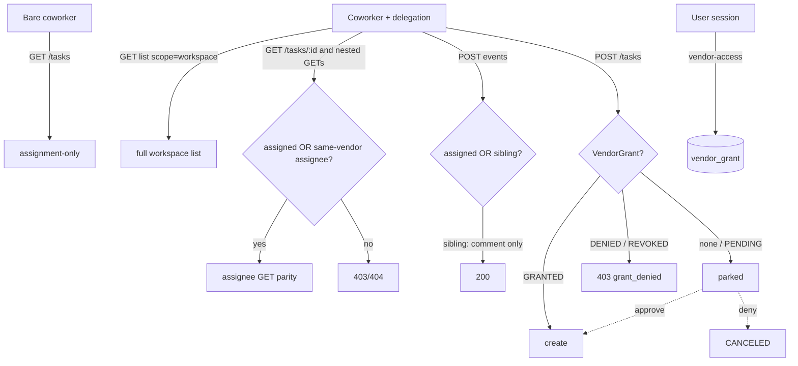

# Vendor coworker permissions

Coworkers group under `Vendor`. Two tiers:

1. **Automatic:** delegated sibling **GET** = assignee parity + **comment**; writes stay assignment-only. Bare = assignment-only.
2. **Grants:** autonomous create needs `VendorGrant` (`VENDOR` | `WORKSPACE`).

## Data flow

## 1. Schema

[`packages/database/prisma/schema.prisma`](packages/database/prisma/schema.prisma)

- `Vendor`: `id`, timestamps, `name`, `slug @unique`, `logo?`
- `Coworker.vendorId` required; drop `company` / `companyLogo`
- `VendorGrant`:
  - `scope`: `VENDOR` | `WORKSPACE` (autonomy boundary; create is the only gated action today)
  - `status`: `PENDING` | `GRANTED` | `DENIED` | `REVOKED`
  - `vendorId`, `userId`, `workspaceId` (required `@db.Uuid`), `resolvedAt?`
  - `@@unique([vendorId, userId, workspaceId, scope])`, index `[userId, status]`
  - `workspaceId` required for both scopes (task always lands in one workspace)
- `Task.pendingVendorGrantId?` → `VendorGrant` (`onDelete: SetNull`) — non-null = parked
- FK: `Coworker.vendorId` `onDelete: Restrict`; `VendorGrant.vendorId` `onDelete: Cascade`
- Migration: insert `Service Plan` (`service-plan`) and `utxo AG` (`utxo-ag`) with fixed ids; seed logos from existing `companyLogo` when present; assign `alex`/`hannah`/`elena`/`jamal`/`maya` → Service Plan, rest → utxo AG; then `vendorId NOT NULL` and drop company fields (`jamal`/`maya` exist in prod, not in seed script)
- Core: direct Prisma only — helpers in [`apps/core/src/helpers/vendor-grants.ts`](apps/core/src/helpers/vendor-grants.ts)
- Helpers:
  - `resolveRequiredGrantScope` — same-vendor assignee → `VENDOR`; else `WORKSPACE`
  - `hasAutonomyGrant` — pure DB: `GRANTED` required scope, or `GRANTED` `WORKSPACE` covers `VENDOR` (not reverse)
  - `isVendorGrantEnabled` / `isTaskParked` / `requireTaskNotParked` (flag and parking live beside grants, not inside `hasAutonomyGrant`)
- Grant lookup at request time: `(vendorId, userId, workspaceId, scope)` with workspace from [workspace middleware](apps/core/src/middleware/workspace.ts). `userId` = context user (approver / grant subject).

## 2. Access control

[`apps/core/src/helpers/access-control.ts`](apps/core/src/helpers/access-control.ts)

Sibling **GET + comment** is **delegated + workspace-bound** only (bare has no workspace → no sibling OR).

| Actor | List | GET detail + nested reads | Comment | Status / job writes / billing |
| --- | --- | --- | --- | --- |
| Bare coworker | Assignment-only | Assignment-only | Assignment-only | Assignment-only |
| Delegated | Unchanged: `scope=owned` owner-filtered; `scope=workspace` = **full workspace** (not sibling-filtered) | Assignee parity if assigned **or** same-vendor sibling (exclude `DRAFT`, parked) | Assigned **or** sibling (**comment-only**) | Assignment-only |
| Session user | Unchanged `scope=owned` / full `scope=workspace`; parked per §3 | Existing; parked per §3 | Existing | Existing |

Rules (single source):

- **List:** do not change `scope=workspace` / `scope=owned` filtering for sibling reasons. Parked visibility is §3 only.
- **Sibling GET = assignee GET:** same read paths as assignee (`GET /tasks/{id}`, nested GETs via `requireTaskReadForRouteVars` including `GET …/jobs`) and same `mapTask` payload (jobs, events, credits). Do not strip fields for siblings.
- **Sibling filter:** active `workspaceId` + assignee exists + `assignee.vendorId = actor.vendorId` + `pendingVendorGrantId IS NULL` + not `DRAFT`.
- **Writes:** `requireTaskCollaboration` / job write mirrors stay assignment-only. Comment uses `requireTaskCommentAccess` (assigned **or** sibling). If sibling (not assignee): allow **`comment` only** — reject `status`, `credits`, `masumiPayment`, `authenticationUrl` even when combined with comment in one body.
- Extend delegated detail / `requireTaskReadForRouteVars` with sibling OR; never widen bare-coworker `where`. Shared `isVendorSiblingInWorkspace` for detail, nested GETs, comment.
- Extend task coworker select/joins in [`apps/core/src/types/task.ts`](apps/core/src/types/task.ts) so sibling checks can read `assignee.vendorId`.

## 3. Create gate + parking

[`apps/core/src/routes/v1/tasks/post.ts`](apps/core/src/routes/v1/tasks/post.ts)

### Flag

- Core env `VENDOR_GRANT_ENABLED` (default `false`) in [`env.ts`](apps/core/src/config/env.ts) + `.env.example`. No Flags SDK, no web flag.
- Check flag **only** at create-gate entry via `isVendorGrantEnabled()`. Keep `hasAutonomyGrant` pure.
- Flag **off:** create as today (no pending/park/`grant_denied`). Vendor entity, sibling access, admin, grant API, Connections UI still ship (UI empty when off).
- Flag **on:** enforce only when `isCoworkerAuthContext && delegation`. Session-user create ungated.

### Decision table (flag on, delegated)

| Grant state | Result |
| --- | --- |
| `GRANTED` (or covering `WORKSPACE`) | Create normally |
| none / `PENDING` | `serializableTransaction`: upsert `PENDING`, create parked (`pendingVendorGrantId`). `201`. OpenAPI `409` concurrency. No notification (Follow-ups) |
| `DENIED` / `REVOKED` | `403` `kind: "grant_denied"`; create never reopens grant |

### OpenAPI

Expose `pendingVendorGrantId` (and/or `parked`) on **both** `taskSchema` and `taskListItemSchema` / `mapTask` + `mapTaskListItem`. Document create `403 grant_denied`. Regen web client after.

### Parked (`pendingVendorGrantId IS NOT NULL`)

| | Rule |
| --- | --- |
| Visible to | **Owner only** (`task.userId === session.userId`) |
| Visible where | **Taskboard only** — owner task list + detail (badge) + owner delete |
| Invisible to | Peers, coworkers, siblings, agents |
| Invisible where | History (`GET /v1/history`), events feed, peer links, and any non-taskboard feed |
| History | **Skip history upsert while parked** (so no row appears). Also filter history reads if any parked rows already exist |
| Mutations | All blocked via `requireTaskNotParked` (events, jobs, links, share, schedule, workspace move, project assign, patch, …) |
| Scheduler | `pendingVendorGrantId: null` on both `processDueTask` and `syncDueTaskSchedules` batch `findMany` |
| Peer visibility | `buildVisiblePeerTaskWhere` → `pendingVendorGrantId: null` |
| Connections | May show parked **counts** per grant only — not a second task list |

Delete parked does not auto-deny the grant.

## 4. Grant API

URL `/v1/users/me/vendor-access` (+ `…/{id}/approve|deny|revoke`).

Implement under [`users/[id]/vendor-access/`](apps/core/src/routes/v1/users/[id]/); mount from [`users/[id]/index.ts`](apps/core/src/routes/v1/users/[id]/index.ts). Do not mount from [`users/index.ts`](apps/core/src/routes/v1/users/index.ts).

- `GET` — own grants + parked counts; filter by status; include vendor + workspace (personal vs org)
- `POST …/approve` — `PENDING`|`DENIED`|`REVOKED` → `GRANTED`; `serializableTransaction` clears `pendingVendorGrantId` on still-parked tasks (does not revive prior cancels). OpenAPI `409`
- `POST …/deny` — `PENDING` → `DENIED`; cancel parked + **clear `pendingVendorGrantId`** in same transaction. OpenAPI `409`
- `POST …/revoke` — `GRANTED` → `REVOKED`
- After approve/deny commit: `publishTaskEventData` per affected task
- **Auth every handler:** `requireUserAuthContext` + `resolvedUserId === session.userId` (path `me` / reject non-self) + `grant.userId === session.userId` on mutations. Reject delegated coworkers and admin cross-user
- No grant notifications this PR

## 5. Admin vendors

`/v1/admin/vendors` under admin router + `requireAdmin`.

- `POST`/`GET`/`PATCH`: `name`, `slug`, `logo`
- `DELETE`: **409** if any coworker references vendor; **409** if any `PENDING` grant; else delete (resolved grants cascade)
- Coworker: `vendorId` required on create, omit from patch (reject if sent). Drop `company`/`companyLogo`; embed `vendor` on responses. Do not touch Hermes `company`

## 6. Web

- `pnpm --filter web generate:core:snapshot` after Core OpenAPI changes (do not hand-edit generated client)
- **company → vendor** (coworker branding only; leave Hermes `company`):
  - [`lib/types/coworker.ts`](apps/web/src/lib/types/coworker.ts), [`coworker-options.ts`](apps/web/src/app/(app)/tasks/utils/coworker-options.ts) (+ tests)
  - Gallery [`coworker-gallery-section.tsx`](apps/web/src/components/agents/coworker-gallery-section.tsx) — group by `vendor.id` / name / slug; remove free-text `COMPANIES` map (description/website/legal out of scope)
  - [`company-mark.tsx`](apps/web/src/components/agents/company-mark.tsx), [`offer-card.tsx`](apps/web/src/components/agents/offer-card.tsx), [`coworker-card.tsx`](apps/web/src/app/(app)/tasks/new/components/coworker-card.tsx), [`agent-spotlight.tsx`](apps/web/src/app/(app)/tasks/new/components/agent-spotlight.tsx); repo-search remaining `coworker.company` / `CompanyMark` call sites
- Connections: Vendor access section (extend `ConnectionsTabs` / page) — list grants, approve/deny/revoke. Always show; empty when flag off
- i18n: Vendor access + parked-badge strings in every `apps/web/messages/*.json`
- Parked badge on owner taskboard → grant decision

## 7. Tests

Cover §2–§5 behaviors (colocated Vitest, no new repos):

- Sibling GET parity (detail + jobs GET + payload); sibling comment OK; sibling status/job write denied; bare no sibling OR; cross-vendor denied
- Flag off: create without park; flag on: scope gate, workspace isolation, pending idempotency, `grant_denied` no reopen
- Park: owner taskboard only; absent from history/feeds; peers/coworkers never see; mutations + scheduler blocked; approve/deny + Ably; deny clears FK; re-approve does not revive cancels
- Admin: CRUD; delete 409 with coworkers/`PENDING`; coworker patch cannot change `vendorId`

## Out of scope / follow-ups

- Held comments branch (siblings comment immediately)
- Hermes `company`; vendor metadata beyond `name`/`slug`/`logo`
- **Grant notifications** — `createNotification` requires job/task `eventId`; fix non-event notifications globally, then emit on first `PENDING`, wire `notification-href` → Connections
- **Header rename** — keep `X-Delegation-*` names this PR; meaning is workspace/grant **context**, not impersonation. Coworker stays actor (`getActorData`). Internal `delegation` naming OK until rename-only follow-up
