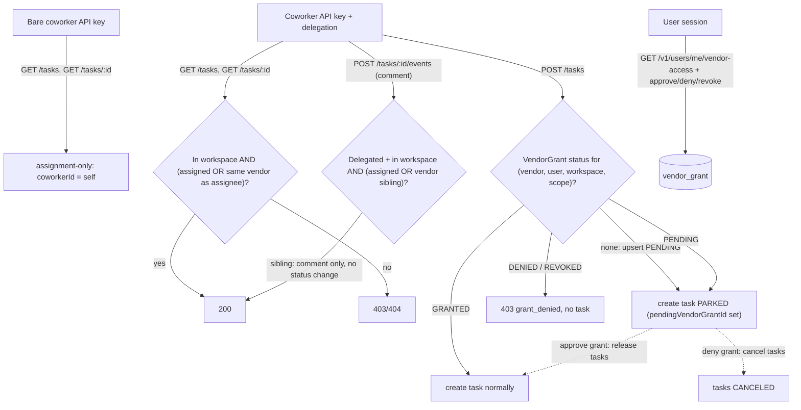

# Vendor-Based Coworker Permission System

Built fresh from `main`. Coworkers (AI agents, `Coworker` model) get grouped under a new `Vendor` entity. Permissions split into two tiers:

- **Automatic (no approval)**: a **delegated** coworker can view and comment on any task in the active workspace that is assigned to a coworker of the same vendor. Bare coworkers (no delegation) stay assignment-only.
- **User-approved grants**: autonomous task creation, in two scopes — tasks assigned within the vendor, or any task in the workspace.

## Data flow

## 1. Schema (`packages/database/prisma/schema.prisma`)

- New `Vendor` model: `id`, `createdAt`, `updatedAt`, `name`, `slug @unique`, `logo?`, relations to `Coworker` and `VendorGrant`. The vendor is the single owner of company branding.
- `Coworker.vendorId String` + relation + index — **required**, every coworker belongs to exactly one vendor.
- **Remove** `Coworker.company` and `Coworker.companyLogo` — vendor `name`/`logo` replace them; no duplicate branding fields left behind.
- New `VendorGrant` model:
  - `scope`: enum `VendorGrantScope { VENDOR, WORKSPACE }` — the scope names the **autonomy boundary**, not a single action: `VENDOR` = the coworker may act autonomously on tasks assigned within its vendor; `WORKSPACE` = it may act autonomously on anything in the workspace. Task creation is the only gated action today; future autonomous capabilities check the same grant.
  - `status`: enum `VendorGrantStatus { PENDING, GRANTED, DENIED, REVOKED }`
  - `vendorId`, `userId`, `workspaceId` (required, `@db.Uuid`, relation to `Workspace`), `resolvedAt?`
  - `@@unique([vendorId, userId, workspaceId, scope])`, index on `[userId, status]`
- `Task.pendingVendorGrantId String?` + relation to `VendorGrant` (`onDelete: SetNull`) + index — non-null means the task is **parked**, waiting for the referenced grant to be approved. No separate boolean; the FK is the single source of truth for parked state and directly identifies which tasks to release or cancel when the grant resolves.
- One migration that also backfills data so `vendorId` can be `NOT NULL` from the start:
  1. Create `vendor` table and insert the two vendors: `Service Plan` (slug `service-plan`) and `utxo AG` (slug `utxo-ag`), with fixed ids generated in the migration SQL. Seed each vendor's `logo` from an existing `coworker.companyLogo` value in its group when one is present.
  2. Add `coworker.vendorId` as nullable, assign coworkers with slug in (`alex`, `hannah`, `elena`, `jamal`, `maya`) to Service Plan, all remaining coworkers to utxo AG. (`jamal` / `maya` exist in production even though they are absent from `packages/database/scripts/seed-coworker-profiles.ts`.)
  3. Alter `vendorId` to `NOT NULL`, then drop `coworker.company` and `coworker.companyLogo`.
- **Data access:** Core uses **direct Prisma** in routes/helpers (`apps/core/.cursor/rules/data-access.mdc`) — do **not** add `vendor.repository.ts` / `coworker.repository.ts`. Put shared grant/parking queries in Core helpers (e.g. `apps/core/src/helpers/vendor-grants.ts`) and call `prisma` from route handlers, matching existing coworker/task routes.
- Coworker creation (admin `POST /v1/coworkers`) requires a `vendorId` going forward; that assignment is **immutable** after create (section 5).

Every grant is bound to one workspace. `workspaceId` is **required for both scopes** (not optional): a task is always created in exactly one workspace, so even the vendor-scoped grant only makes sense per workspace — the scope enum controls the assignee restriction (vendor siblings only vs. any task), while `workspaceId` controls where. This also keeps the unique constraint simple (a nullable column in a Postgres unique index would allow duplicate rows). `userId` stays on the grant as the approver — the delegation target whose behalf the coworker acts on. At request time the workspace is resolved from the delegated user's active context via [apps/core/src/middleware/workspace.ts](apps/core/src/middleware/workspace.ts), and the grant lookup matches `(vendorId, userId, workspaceId, scope)`.

### Shared grant helpers (`apps/core/src/helpers/vendor-grants.ts`)

- `resolveRequiredGrantScope(actorVendorId, assigneeCoworkerId | null)` — same-vendor assignee → `VENDOR`; no assignee or other-vendor assignee → `WORKSPACE`.
- `hasAutonomyGrant(vendorId, userId, workspaceId, requiredScope)` — `GRANTED` for the required scope, **or** a `GRANTED` `WORKSPACE` grant in the same workspace (covers `VENDOR`). Never treats `VENDOR` as covering `WORKSPACE`.

## 2. Core access control ([apps/core/src/helpers/access-control.ts](apps/core/src/helpers/access-control.ts))

Vendor-sibling view/comment is **workspace-bound**. Without that bound, “same vendor as assignee” would return every customer’s tasks assigned to that vendor (cross-tenant leak). Bare coworkers have no workspace (`workspaceContext` is null), so they must not get the sibling OR.

### Actor matrix

| Actor                                                   | Task list / read                                                                                                               | Comment on task                                       | Status / jobs / billing                                           |
| ------------------------------------------------------- | ------------------------------------------------------------------------------------------------------------------------------ | ----------------------------------------------------- | ----------------------------------------------------------------- |
| Bare coworker (API key only, no `X-Delegation-User-Id`) | Assignment-only: `task.coworkerId === self` (unchanged)                                                                        | Assignment-only                                       | Assignment-only                                                   |
| Delegated coworker (delegation + resolved workspace)    | In active workspace: assigned to self **OR** assignee’s `vendorId` equals actor’s `vendorId` (exclude `DRAFT`, exclude parked) | Same bound; siblings may post **comment-only** events | Still assignment-only (existing agent transition table untouched) |
| Session user                                            | Existing workspace / ownership rules                                                                                           | Existing rules                                        | Existing rules                                                    |

### Implementation notes

- Extend the **delegated** branches only of `requireTaskReadForRouteVars`, `GET /v1/tasks`, and `GET /v1/tasks/{id}` (the detail handler has its own `coworkerId` filter today — both list and detail must stay consistent). Do **not** widen the bare-coworker `where` clause with a vendor OR.
- Sibling filter shape: `workspaceId = active workspace` AND assignee coworker exists AND `assignee.vendorId = actor.vendorId` AND `pendingVendorGrantId IS NULL` AND not `DRAFT`.
- Extend comment authorization in [apps/core/src/routes/v1/tasks/[id]/events/post.ts](apps/core/src/routes/v1/tasks/[id]/events/post.ts) with the same delegated + workspace + sibling rule. Status transitions and billing stay restricted to the assigned coworker ([apps/core/src/helpers/task.ts](apps/core/src/helpers/task.ts) untouched).
- **`requireTaskCollaboration` today rejects non-assigned tasks** ([apps/core/src/helpers/access-control.ts](apps/core/src/helpers/access-control.ts)). Sibling comment will fail if left as-is. Extend or split it: e.g. `requireTaskCommentAccess` allows assigned **or** vendor sibling (delegated + workspace); keep `requireTaskCollaboration` (and job collaboration mirrors) assignment-only for status/jobs/billing. Comment route must use the comment helper, not the collaboration helper.
- Prefer shared helpers (e.g. `isVendorSiblingInWorkspace(...)`) so list, detail, and comment auth cannot drift.

## 3. Grant-gated autonomous task creation ([apps/core/src/routes/v1/tasks/post.ts](apps/core/src/routes/v1/tasks/post.ts))

### Feature flag: vendor grant enforcement

Add a Core env flag (validated in [apps/core/src/config/env.ts](apps/core/src/config/env.ts), documented in `.env.example`): `VENDOR_GRANT_ENABLED` (boolean, **default `false`**). No Flags SDK.

| Flag              | Create behavior for delegated coworkers                                                                                                                                                                                                                   |
| ----------------- | --------------------------------------------------------------------------------------------------------------------------------------------------------------------------------------------------------------------------------------------------------- |
| **Off** (`false`) | Treat autonomy as fully granted: create tasks normally. Do **not** upsert `PENDING` grants, do **not** park tasks, do **not** return `grant_denied`. Same effective behavior as today’s temporary open create model. |
| **On** (`true`)   | Enforce the decision table below via `hasAutonomyGrant` / park / deny.                                                                                                                                                                                    |

Implementation: a single helper (e.g. `isVendorGrantEnabled()` reading the env) used at the start of the create-gate path and inside `hasAutonomyGrant` (return `true` when off) **and** skip pending upsert / park when off, so one place cannot drift.

Vendor entity, sibling view/comment, admin vendors, and the grant management API still ship when the flag is off — only **enforcement** (park / deny / require grant) is gated. Connections Vendor access UI always ships; with the flag off it stays empty (no pending grants).

Today any delegated coworker can create tasks (documented "temporary model"). Change for `actor: "coworker"` with delegation **when the flag is on**:

- Resolve the target workspace from the delegated user's context (workspace middleware), then `resolveRequiredGrantScope` + `hasAutonomyGrant` (section 1).
- Decision table for the grant at `(vendorId, userId, workspaceId, scope)`:
  - `**GRANTED**` (or covering `WORKSPACE`) → create the task normally.
  - **No grant** → in a `serializableTransaction` ([apps/core/src/lib/db/transaction.ts](apps/core/src/lib/db/transaction.ts)): idempotently upsert a `PENDING` grant, create the task **parked** (`pendingVendorGrantId` set). Respond `201` with the task flagged as awaiting approval. **No in-app notification in this PR** — user discovers pending grants via Connections / parked-task badge (see Follow-ups).
  - `**PENDING**` → create the task parked, linked to the same grant (same transaction pattern as needed to avoid racing approve). The approval UI shows the accumulated parked tasks.
  - `**DENIED` / `REVOKED**` → reject with `403` and `kind: "grant_denied"` (agents should not retry). **Create must never reopen or flip a denied/revoked grant back to `PENDING`.** Only the user can re-approve via the grant API (section 4).
- **OpenAPI / response surface:** expose parked state on task responses via `pendingVendorGrantId` (and/or derived `parked`) in [apps/core/src/schemas/task.schema.ts](apps/core/src/schemas/task.schema.ts) and [apps/core/src/helpers/task.ts](apps/core/src/helpers/task.ts) `mapTask` / list mapping. Document create-route `403` with `kind: "grant_denied"` in the OpenAPI error schema for `POST /v1/tasks`. Regenerate the web client after schema changes.
- **Parked task semantics — owner list/read (+ delete) only until released:**
  - The task keeps its requested fields and status; `pendingVendorGrantId IS NOT NULL` means parked.
  - **Allowed while parked (session owner only):**
    - **List** and **read**, with an "awaiting your approval" badge.
    - **Delete** (and archive if that path exists) so the owner can discard unwanted parked tasks. Deleting parked tasks does not auto-deny the grant; the pending grant remains until the user resolves it (count of parked tasks on the grant UI updates).
  - **Blocked while parked** (filter `pendingVendorGrantId IS NULL` or reject 403/404 via shared `isTaskParked` / `requireTaskNotParked`):
    - Coworker list/read — agents never see parked tasks
    - Task event create — no comments or status changes
    - Job create / job collaboration on the task
    - Scheduler pickup (`apps/core/src/services/task-schedules-sync.ts`)
    - Coworker events feed (`apps/core/src/routes/v1/coworkers/me/events/get.ts`)
    - Peer-task visibility (`buildVisiblePeerTaskWhere`)
    - Task **link** writes — `POST` / `PATCH` / `DELETE` under [apps/core/src/routes/v1/tasks/[id]/links/](apps/core/src/routes/v1/tasks/[id]/links/) (GET may stay allowed for owner)
    - Owner **patch** of assignee, status, schedule, share, or workspace move — reject while parked (reassign would desync grant scope; approve first, then edit, or delete and recreate)
- Session-user task creation is unchanged. Gate the create decision table only when `isCoworkerAuthContext && delegation`.

## 4. Grant management API (`apps/core/src/routes/v1/users/me/vendor-access/`)

Follows the existing self-scoped `/v1/users/me/*` convention (like `notices`, `subscription`, `uploads`) and the action-route precedent from Hermes confirmations:

- `GET /v1/users/me/vendor-access` — session user only (`requireUserAuthContext`), lists own grants with vendor and workspace info (personal vs. which organization) plus the count of parked tasks per grant, filterable by status.
- `POST /v1/users/me/vendor-access/{id}/approve` — `PENDING` / `DENIED` / `REVOKED` → `GRANTED`, sets `resolvedAt`. **Only this user-facing path may re-approve a denied or revoked grant** (create must not). In a `serializableTransaction`, **releases all still-parked tasks** referencing the grant (clears `pendingVendorGrantId`). Tasks already canceled on a prior deny stay canceled — re-approve unlocks **future** creates and any tasks still parked, it does not revive canceled ones.
- `POST /v1/users/me/vendor-access/{id}/deny` — `PENDING` → `DENIED`, sets `resolvedAt`. In a `serializableTransaction`, **cancels all parked tasks** referencing the grant (`CANCELED` + task event).
- `POST /v1/users/me/vendor-access/{id}/revoke` — `GRANTED` → `REVOKED`, sets `resolvedAt`. Blocks future creates until the user re-approves.
- **Ably after approve/deny:** after the transaction commits, publish task updates for each released or canceled task via existing `publishTaskEventData` (or equivalent in [apps/core/src/lib/ably/publish.ts](apps/core/src/lib/ably/publish.ts)) so the owner UI refreshes without a full reload.
- **Auth:** every mutation asserts `grant.userId === session.userId`. Do not rely on `/users/{id}` admin path access alone — admins manage vendors (section 5), not other users' grants.
- Zod/OpenAPI schemas under the route folder; mount within the users router ([apps/core/src/routes/v1/users/index.ts](apps/core/src/routes/v1/users/index.ts)).
- **No grant notifications in this PR** — see Follow-ups.

## 5. Admin vendor management

- `POST/GET/PATCH/DELETE /v1/admin/vendors` — under the existing admin router ([apps/core/src/routes/v1/admin/index.ts](apps/core/src/routes/v1/admin/index.ts)) with `requireAdmin` middleware. Create/patch fields: `name`, `slug`, `logo` (identity branding only — not coworker reassignment).
- **`DELETE /v1/admin/vendors/{id}`** — allowed, but guarded. Because `Coworker.vendorId` is required and immutable, a vendor must not disappear out from under live agents or in-flight approvals:
  - **409** if any coworker still references the vendor (admin must delete or recreate those coworkers first — there is no reassign).
  - **409** if any `VendorGrant` with status `PENDING` exists for the vendor. Pending grants own parked tasks (`Task.pendingVendorGrantId`); deleting the vendor would cascade/orphan those grants and leave parked tasks without a resolvable approval path. Checking pending grants is the right gate.
  - Resolved grants (`GRANTED` / `DENIED` / `REVOKED`) with no coworkers and no pending grants may be cascade-deleted with the vendor (history cleanup). Prefer `onDelete: Restrict` on `Coworker.vendorId` and `onDelete: Cascade` on `VendorGrant.vendorId`, with the route-level pending + coworker checks as the user-facing errors.
- Update coworker schemas in [apps/core/src/routes/v1/coworkers/schema.ts](apps/core/src/routes/v1/coworkers/schema.ts) and [apps/core/src/schemas/coworker.schema.ts](apps/core/src/schemas/coworker.schema.ts):
  - `vendorId` **required on create only** — **immutable** after create (omit from patch input; reject if sent). Wrong vendor → delete/recreate the coworker, do not reassign.
  - Drop `company`/`companyLogo` from create/patch inputs and responses; responses embed `vendor` (`id`, `name`, `slug`, `logo`).
  - Ripple coworker branding only (coworker schemas/routes/web types). **Do not** change Hermes `company` — that field is user onboarding, not coworker branding.

## 6. Web app

- Regenerate the Core client: `pnpm --filter web generate:core:snapshot`.
- Full `company` → embedded `vendor` sweep: gallery grouping ([coworker-gallery-section.tsx](apps/web/src/components/agents/coworker-gallery-section.tsx)), [company-mark.tsx](apps/web/src/components/agents/company-mark.tsx) (`vendor.logo` with text fallback to `vendor.name`), `CoworkerOption`, offer cards, and related types — not only two files. `Vendor` ships with `name` / `slug` / `logo` only; description/website/legal from the old `COMPANIES` map are out of scope (optional follow-up or temporary UI hardcode for the two known vendors).
- **Connections** page ([apps/web/src/app/(app)/connections/](apps/web/src/app/(app)/connections/)): add a **Vendor access** section listing pending and resolved grants (parked-task counts) with approve / deny / revoke via web server actions. Always show the section; with Core flag off it stays empty.
- **i18n:** add all Vendor access UI copy (section title, grant status labels, approve/deny/revoke actions, parked-task count, empty state) to **every** catalog under `apps/web/messages/*.json` in this PR — follow the translations skill; do not ship English-only keys.
- Parked tasks in the owner's task list: "awaiting your approval" badge linking to that grant decision (locale strings in all catalogs too).

## 7. Tests

- Core route/helper tests (Vitest, colocated — no new database repositories): delegated vendor-sibling read/comment in workspace; bare coworker cannot list siblings across tenants; cross-vendor denied; status change by sibling denied; with `VENDOR_GRANT_ENABLED` **off**, delegated create succeeds without parking/pending/deny; with flag **on**, create gated per scope via `hasAutonomyGrant`; grant in workspace A does not authorize workspace B; pending upsert idempotency; denied/revoked create returns `grant_denied` and does **not** reopen the grant; admin `/v1/admin/vendors` CRUD; coworker patch cannot change `vendorId`; vendor delete **409** when coworkers or `PENDING` grants remain, succeeds when clear.
- Parking lifecycle: no-grant create parks (no notification) under `serializableTransaction`; pending create parks again on same grant; owner list/read/delete allowed; owner patch assignee/status/schedule blocked; task link writes blocked while parked; coworker list/read, events, jobs, scheduler, events feed, peer visibility exclude/reject parked; approve/deny use `serializableTransaction` and publish Ably task updates; approve releases still-parked tasks; deny cancels them; user re-approve from `DENIED`/`REVOKED` unlocks future creates without reviving canceled tasks; create path never re-approves.
- Access helpers: sibling comment succeeds via comment-access helper; `requireTaskCollaboration` still denies sibling for status/jobs; `mapTask` / OpenAPI include parked fields; create `403 grant_denied` documented.

## Out of scope

- Held comments from the unmerged `claude/delegated-task-comments` branch — vendor-sibling comments post immediately (no approval needed). Task parking is in scope (section 3).
- Hermes user-onboarding `company` field.
- Vendor description / website / legal metadata beyond `name` / `slug` / `logo`.
- **Grant-request notifications** — out of this PR; see Follow-ups.
- **Header rename** (`X-Delegation-User-Id` → something like `X-Context-User-Id` / `X-User-Id`, same for organization) — follow-up PR. Keep current header names in this work; see “Coworker context headers” below for the new meaning clients and implementers must use.

## Follow-ups

- **Grant-request notifications (global notification model):** `createNotification` requires `eventId` and documents it as a job/task event id ([apps/core/src/helpers/notifications.ts](apps/core/src/helpers/notifications.ts)). Vendor grants have no such event. Do **not** fake `eventId = grant.id` in this PR. Follow-up should fix non-event notifications in a global way (e.g. optional `eventId`, dedicated kind, or a separate reference model), then emit once on first `PENDING` upsert, wire `notification-href` to Connections Vendor access, and add locale strings. Until then, users rely on Connections + parked-task badges.

## Coworker context headers (meaning change; rename later)

Headers stay named `X-Delegation-User-Id` / `X-Delegation-Organization-Id` for this PR. Their **meaning** under the vendor permission model is no longer “impersonate / act on behalf of this user as if you were them.”

**New meaning:** workspace (and optional org) **context** for the coworker request — which user’s workspace to operate in, and whose grants apply. The coworker remains the actor (comments show the coworker; see `getActorData` + task activity UI). The user id is:

- the **workspace / grant subject** for list, read, sibling comment, and create-gate checks;
- the **task owner** (`task.userId`) when the coworker creates a task in that context.

It is **not** “the user posted this.” A grant may be required for autonomy in that context (`VENDOR` / `WORKSPACE`); sibling view/comment in that workspace does not need a grant.

Internal code may still say `delegation` until the follow-up rename; docs, OpenAPI descriptions, and new comments in this PR should describe **context**, not impersonation, so the follow-up is a rename-only change.