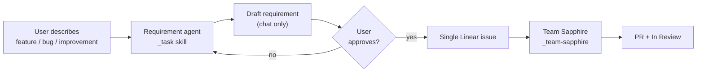

# Requirement → Sapphire Pipeline

Two skills. One Linear issue. Approval gate on `_task` only.

## Agent roles

| Agent | Skill | Output | Approval gate |
|-------|-------|--------|---------------|
| **Requirement** | `_task` | Linear issue with `## Requirement` | **Yes** — user must approve draft |
| **Sapphire squad** | `_team-sapphire` | Investigation, Spec, code, review on **same issue** | No — runs after handoff |

## _task workflow

1. **Intake** — plain-language description or rough Linear issue.
2. **Light discovery** — sharpen problem, goal, scope.
3. **Draft** — `REQUIREMENT-TEMPLATE.md` in chat only.
4. **Wait for approval** — do not touch Linear.
5. **Publish** — create issue per `LINEAR-MCP.md`.
6. **Hand off** — `HANDOFF.md` delegates Team Sapphire on the same issue.

## What belongs on the issue at create time

- `## Requirement` — problem, goal, decisions, out of scope
- After handoff: `## Sapphire status` footer

## What Sapphire adds (same issue)

- `## Investigation` — Investigator
- `## Spec` — Tech Lead
- PR + review comments — Coder and Reviewer

## Handoff

Default: `delegate: "Cursor"` on the **main issue** per `HANDOFF.md` — no child issues.

Disable legacy `feature-spec` Cursor Automations before handoff — see `../_team-sapphire/CURSOR-AUTOMATION.md`.

Manual: `Run _team-sapphire for SOK-XXX`.

Full squad pipeline: `../_team-sapphire/WORKFLOW.md`.

## What not to do

- Do not post to Linear before user approval.
- Do not write `## Spec` in the requirement draft.
- Do not create Write PRD or implementation child issues.
- Do not `@Cursor` and `delegate` on the same issue.
- Do not run Sapphire in the same turn as the initial draft (before approval).
