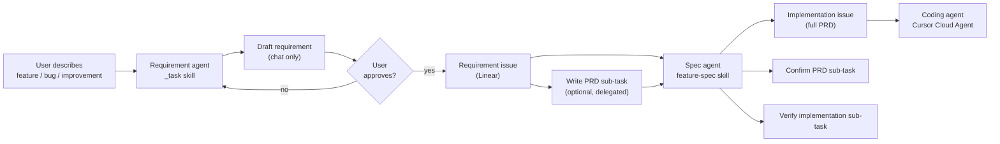

# Requirement → PRD Pipeline

Two agents. **_task has an approval gate.** Spec agent runs after Linear post.

## Agent roles

| Agent | Skill | Output | Approval gate |
|-------|-------|--------|---------------|
| **Requirement** | `_task` | Linear requirement issue (high level) | **Yes** — user must approve draft in chat |
| **Spec** | `feature-spec` | Implementation PRD + sub-tasks + Cursor delegate | No — publishes immediately |

## _task agent workflow

1. **Intake** — plain-language description or rough Linear issue.
2. **Light discovery** — just enough codebase/issue context to sharpen problem, goal, scope.
3. **Draft** — `REQUIREMENT-TEMPLATE.md` shape in chat only.
4. **Wait for approval** — do not touch Linear.
5. **Publish** — create requirement issue per `LINEAR-MCP.md`.
6. **Hand off** — per `HANDOFF.md`, trigger feature-spec on the new issue.

## What belongs on a requirement issue

- Problem, goal, locked decisions
- Rough architecture ideas and open questions for the spec agent
- References and out of scope

## What does not belong (spec agent adds these)

- File add/change lists
- API contract tables
- Verification commands
- Mermaid data-flow diagrams
- Subagent workstream blocks

## Handoff to spec agent

After the requirement is posted:

- Default: create **Write implementation PRD** sub-task, delegate to Cursor, comment with feature-spec instructions (`HANDOFF.md`).
- User can opt out of auto handoff and run `feature-spec` manually with the issue id.

Full spec → code pipeline (implementation issue, confirm, verify, coding agent): `../feature-spec/WORKFLOW.md`.

## What not to do

- Do not post to Linear before user approval.
- Do not write a full PRD in the requirement draft.
- Do not run feature-spec in the same turn as the initial draft.
- Do not delegate the coding agent on the requirement issue — only the PRD sub-task or spec handoff.
