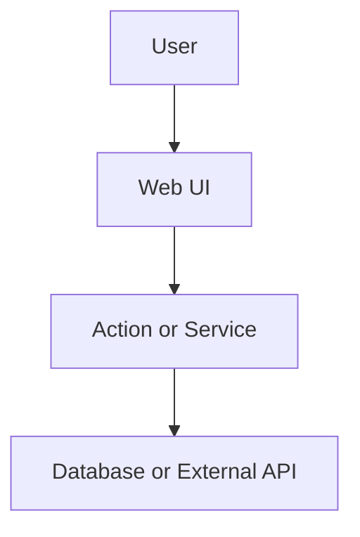
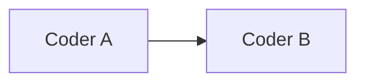

# Spec Template

Tech Lead writes this as the **session Spec** (short summary also goes in the PR body). Delete unused optional sections except **Data flow**. Do **not** post the full Spec to Linear.

````markdown
## Spec

[repo=masumi-network/sokosumi]

**Coders:** 1 (or N — sequential unless Parallel)
**Parallel:** false

**Problem:** One or two sentences.

**Goal:** One or two sentences — user-facing outcome.

**Confirmed decisions:**
- …

## Data flow



## Current state

(Include when SUBAGENT-RUBRIC says so.)

## Target architecture

(Include when SUBAGENT-RUBRIC says so.)

## Contract / behavior

| Area | Spec |
|------|------|
| Input | … |
| Output | … |
| Auth | … |
| Errors | … |

## Key decisions

| Decision | Choice |
|----------|--------|
| … | … |

## Coder breakdown

(Only when rubric score ≥ 2.)

### Coder A — Scope name

**Scope:** One line.

**Deliverables:**
- [`path/to/file.ts`](path/to/file.ts)

**Do not:** Boundary.

## Execution order



## Verification

Scope hints — map to allowlisted `pnpm` scripts in `ROLES.md`. UI: path-only routes; capture per `VISUAL-CAPTURE.md`.

- Scope: `apps/web` — web:check, web:test, web:build

## Out of scope

- Non-goals for v1.
````

## Before handoff

- No YAML plan frontmatter.
- Keep Data flow, Verification, Out of scope.
- Copy appendix sections only when `BUGBOT-LEARNINGS.md` triggers apply.

## Appendix: optional BUGBOT sections

### Mutation order (R1)

| Step | On failure |
|------|------------|
| … | … |

### State machine (R2)

| User action | Target status | Notes |
|-------------|---------------|-------|
| … | … | derived / explicit |

### Time semantics (R4)

- Display TZ: …
- Parse/persist TZ: …

### Auth matrix (R10)

| Caller type | Endpoint | Capability / scope |
|-------------|----------|-------------------|
| … | … | … |

### Ripple checklist (R11)

| Area | Updated in this PR |
|------|-------------------|
| Validators | … |
| UI | … |
| Archive | … |
| Notifications | … |
| Columns | … |
