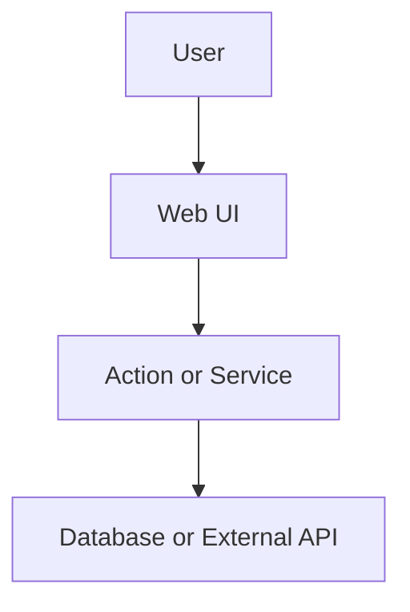

# Spec Template

Tech Lead writes this as the **session spec** (not posted to Linear). Delete sections that do not apply except **Data flow**.

````markdown
## Spec

[repo=masumi-network/sokosumi]

**Problem:** One or two sentences (may mirror Requirement).

**Goal:** One or two sentences — user-facing outcome.

**Linear:** project Sokosumi - label Feature

**Confirmed decisions:**
- Locked decision from Requirement or resolved in spec.

## Data flow



## Current state

(Include when SUBAGENT-RUBRIC says so.)

## Target architecture

(Include when SUBAGENT-RUBRIC says so.)

## Contract / behavior

| Area | Spec |
|------|------|
| Input | … |
| Output | … |
| Auth | … |
| Errors | … |

(Optional — add when `BUGBOT-LEARNINGS.md` triggers apply.)

## Mutation order

| Step | On failure |
|------|------------|
| … | … |

## State machine

| User action | Target status | Notes |
|-------------|---------------|-------|
| … | … | derived / explicit |

## Time semantics

- Display TZ: …
- Parse/persist TZ: …
- Cron / interval meaning vs UI label: …

## Key decisions

| Decision | Choice |
|----------|--------|
| … | … |

## Coder breakdown

(When SUBAGENT-RUBRIC score ≥ 2 — see TECH-LEAD.md.)

### Coder A — Scope name

**Scope:** One line.

**Deliverables:**
- [`path/to/file.ts`](path/to/file.ts)

**Do not:** Boundary.

## Execution order


## Verification

Scope hints only — agents map to allowlisted `pnpm` scripts per `REVIEWER.md`. UI manual checks: path-only local URLs; capture per `VISUAL-CAPTURE.md`.

- Scope: `apps/web` — web:check, web:test, web:build
- Manual: path-only route checks

## Out of scope

- Non-goals for v1.
````

## Before handing to Coder

- No YAML plan frontmatter.
- Remove empty optional sections.
- Keep Data flow, Verification, Out of scope.
- Spec stays in orchestrator session — not written to Linear.
