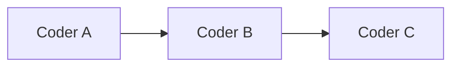

# Subagent Rubric

Tech Lead uses this before adding `Current state`, `Target architecture`, or **Coder breakdown** in the session spec.

## Architecture sections

Always include `Data flow`.

Add `Current state` and `Target architecture` when at least one is true:

- The feature changes data movement across layers, such as new API, new table, new route, new service, or external integration.
- The feature replaces or removes existing UX, endpoints, jobs, cron, or storage.
- The user asked for architecture comparison.
- The implementation has a meaningful before/after shape that prevents confusion.

Skip `Current state` and `Target architecture` for:

- Small copy changes.
- Isolated UI polish.
- Simple bug fixes with an obvious local change.
- Tests-only or docs-only work.

## Coder scoring

Score one point for each signal:

| Signal | Point |
|--------|-------|
| Touches `apps/web` and `apps/core` | +1 |
| Touches `packages/database` schema, migration, or repositories | +1 |
| Touches two or more shared packages (`masumi`, `utils`, `email`, `chat`, `ai-provider`) | +1 |
| Has three or more distinct deliverables with non-overlapping file ownership | +1 |
| Has a dependency chain like schema -> API -> client -> UI | +1 |
| Estimated scope is more than 15 files or more than four layers | +1 |

Decision:

| Score | Output |
|-------|--------|
| 0-1 | Single coder. No **Coder breakdown** section. |
| 2+ | Add **Coder breakdown** with named coders. |

## Coder block format

Each coder block must be paste-ready for `CODER.md`.

```markdown
### Coder A — Short scope

**Scope:** One line.

**Context:**
- Product decision or user requirement.
- Existing file/pattern to reuse.
- Dependency on another coder, if any.

**Deliverables:**
- [`path/to/file.ts`](path/to/file.ts)

**Do not:** Explicit boundaries to avoid overlap.
```

## File ownership table

Add when coders can run in parallel or may conflict:

```markdown
| Coder | Owns | Do not edit |
|-------|------|-------------|
| A | [`path/a.ts`](path/a.ts) | `path/b.ts` |
| B | [`path/b.ts`](path/b.ts) | `path/a.ts` |
```

## Execution order

Add a diagram when any coder depends on another:



## Boundaries

- Do not split work just to look parallel.
- Keep tightly coupled files together.
- Keep generated files with the coder that owns generation.
- Prefer foundations first: schema, contract, service, UI, cleanup.
- If one coder blocks another, say it plainly.
