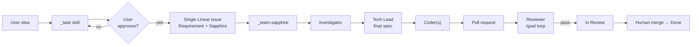

# Sapphire Pipeline

Two skills. One Linear issue. Approval gate only on `_task`.



## Roles

| Role | Output | Blocks next? |
|------|--------|--------------|
| **Investigator** | `## Investigation` — pitfalls, similar code, technical recommendations | No |
| **Tech Lead** | `## Spec` — implementable spec, optional coder breakdown | No |
| **Coder** | Code + PR + `**PR handoff**` | No |
| **Reviewer** | Evidence + issue **In Review** | Yes — human merge waits for Reviewer pass |

## Issue description shape

One growing document on the same issue:

```markdown
## Requirement
(from _task — do not rewrite without human approval)

## Sapphire status
| Phase | Status |
|-------|--------|
| Investigator | pending / done |
| Tech Lead | pending / done |
| Coder | pending / done |
| Reviewer | pending / done |

## Investigation
(Investigator)

## Spec
(Tech Lead — includes [repo=masumi-network/sokosumi])
```

Phase transitions also post structured comments (`**Sapphire · … complete**`) for audit trail.

## Status lifecycle

| State | Set by | When |
|-------|--------|------|
| `In Progress` | `_task` | Issue created; through Investigator, Tech Lead, Coder |
| `In Review` | Reviewer | All `/goal` criteria pass |
| `Done` | Human | After PR merge |

## Handoff from _task

Default: `_task` posts the issue and delegates **Cursor on the same issue** — see `../_task/HANDOFF.md`. No Write PRD sub-task. No implementation child issue.

Manual: `Run _team-sapphire for SOK-XXX` in Cursor.

## What not to do

- Do not create child Linear issues for spec, code, or review.
- Do not run Coder before `## Spec` exists.
- Do not set **In Review** when the PR opens — Reviewer sets it on pass.
- Do not mark **Done** before human merge.
