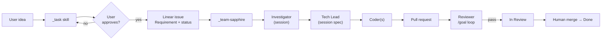

# Sapphire Pipeline

Two skills. One Linear issue. Approval gate only on `_task`.



## Single session rule

The orchestrator runs **Investigator → Tech Lead → Coder → Reviewer** in one agent session. Phase completion comments are audit markers — not handoff to a new run.

Resume: use **artifact-aware resume** in `SKILL.md` — status `done` does not skip a phase when session investigation or spec is missing. Rebuild Investigator → Tech Lead before Coder or Reviewer in a new session; then finish every later phase in the same session.

## Roles

| Role | Output | Where it lives |
|------|--------|----------------|
| **Investigator** | Pitfalls, patterns, recommendations | **Session** → Tech Lead |
| **Tech Lead** | Implementable spec, optional coder breakdown | **Session** → Coder, Reviewer |
| **Coder** | Code + PR + `**PR handoff**` | GitHub + Linear comments |
| **Reviewer** | Evidence + issue **In Review** | Linear state + comments |

## Issue description shape (Linear)

Only requirement and progress on the issue:

```markdown
## Requirement
(from _task — do not rewrite without human approval)

## Sapphire status
| Phase | Status |
|-------|--------|
| Investigator | pending / done |
| Tech Lead | pending / done |
| Coder | pending / done |
| Reviewer | pending / done |
```

Investigation and spec stay in the orchestrator session — not in this document.

Phase transitions post structured **summary** comments (`**Sapphire · … complete**`) for audit trail. These are **blocking gates** — see `PHASE-GATE.md`. Do not defer them to the end of the run.

## Status lifecycle

| State | Set by | When |
|-------|--------|------|
| `In Progress` | `_task` | Issue created; through Investigator, Tech Lead, Coder |
| `In Review` | Reviewer | All `/goal` criteria pass |
| `Done` | Human | After PR merge |

## Handoff from _task

Default: `_task` posts the issue and delegates **Cursor on the same issue** — see `../_task/HANDOFF.md`.

Manual: `Run _team-sapphire for SOK-XXX` in Cursor.

## What not to do

- Do not create child Linear issues for spec, code, or review.
- Do not write `## Investigation` or `## Spec` to the Linear description.
- Do not run Coder before **session spec** exists.
- Do not set **In Review** when the PR opens — Reviewer sets it on pass.
- Do not mark **Done** before human merge.
- Do not batch phase comments or status updates at the end — each phase gate must pass before the next phase (`PHASE-GATE.md`).
