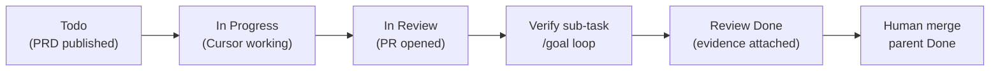

# Cursor Automation (optional)

Use when you want **every new implementation issue** to start a Cloud Agent without manual assign.

This is optional. The spec agent can also delegate in the same MCP call via `delegate: "Cursor"` on `save_issue`.

## Lifecycle



| State | Who sets it | When |
|-------|-------------|------|
| `Todo` | Spec agent | Implementation issue created |
| `In Progress` | Cursor (optional) | Agent starts work |
| `In Review` | **Coding agent (required)** | PR opened — see completion protocol below |
| `Done` | Human | After PR merge **and** verify sub-task is Done |

The implementation issue (PRD task) must land in **In Review** when the coding agent finishes — not Done. Human merge waits for the **Verify implementation** sub-task to reach **Done**.

## Completion protocol (Cursor Cloud Agent)

Every coding run must end with this, whether triggered by delegate, `@Cursor`, or automation:

1. Open PR with verification from the PRD.
2. Linear MCP `save_issue` on the **implementation issue** (the delegated issue):

   ```json
   {
     "id": "SOK-XXX",
     "state": "In Review"
   }
   ```

3. `save_comment` on the same issue with PR URL and short summary.
4. Delegate the **Verify implementation** sub-task to Cursor and post the `/goal` handoff — see `PRD-REVIEWER.md`.
5. Do **not** mark the implementation issue Done or close sub-tasks.

The PRD template includes **Agent completion** and **Reviewer completion** sections so delegated issues carry these instructions in the description.

## Reviewer automation (optional)

Create a second Cursor Automation if you want the reviewer to start without the coding agent posting the handoff comment:

| Field | Value |
|-------|--------|
| Name | SOK verify implementation → reviewer |
| Trigger | Linear — Status changed → `In Review` |
| Filter | Team SOK; issue has child titled `chore(review): verify implementation against PRD` |
| Tools | GitHub, Linear, browser (for screenshots) |
| Instructions | Read parent issue as PRD. Read `PRD-REVIEWER.md` in repo. Run `/goal` until lint, test, build, and visual evidence pass. Fix on PR branch. Mark verify sub-task Done when complete. |

Prefer the coding agent handoff in `PRD-REVIEWER.md` so PR URL and branch are always in the first comment.

## Recommended automation setup

Create one Cursor Automation in the Agents Window:

| Field | Value |
|-------|--------|
| Name | SOK implementation → Cloud Agent |
| Trigger | Linear — Issue created |
| Filter | Team: Sokosumi (SOK). Optional: label is one of Feature, Improvement, Bug |
| Tools | GitHub, Linear |
| Instructions | Read the issue description as the implementation PRD. Follow verification and out-of-scope sections. Open a PR when done. Repo: `[repo=masumi-network/sokosumi]` unless the issue specifies otherwise. **When the PR is open:** set this issue to `In Review`, comment with the PR link, delegate the Verify implementation sub-task with `/goal` per `PRD-REVIEWER.md`, and do not mark Done. |

### Optional: status-changed automation

If you want a separate automation when Cursor updates Linear:

| Field | Value |
|-------|--------|
| Trigger | Linear — Status changed → `In Review` |
| Filter | Team SOK, delegate is Cursor |
| Action | Slack notify / assign human reviewer (team choice) |

This is optional. The required behavior is Cursor setting **In Review** on completion, not a follow-up automation.

## Linear triage rule (alternative)

In Linear project settings → Triage rules:

1. When issue created in SOK with label `Feature` or `Improvement`
2. And description contains `**Linear:**` (implementation PRD marker from spec agent)
3. Assign delegate **Cursor**

Note: Linear triage may require a human assignee on some plans. MCP `delegate: "Cursor"` on create avoids that.

## Repo labels in Linear

So Cloud Agent picks the repo without repeating `[repo=...]` every time:

1. Linear Settings → Labels → New group → name exactly `repo`
2. Add child label `masumi-network/sokosumi`
3. Spec agent adds that label on implementation issues (optional)

## Auth notes

- Cursor admin must connect Linear in [Cursor integrations](https://cursor.com/docs/integrations/linear).
- Cloud Agent needs **Linear MCP** enabled to set `In Review` on completion.
- Bot-created issues (Slack, MCP) should use org-level Linear connection; see Cursor forum updates on automation auth fallback.
- First `@Cursor` mention may prompt account linking.

## Manual fallback

On any implementation issue:

1. Assign **Cursor** as delegate, or
2. Comment:

   ```markdown
   @Cursor implement per the PRD above.

   [repo=masumi-network/sokosumi]

   When the PR is open: set this issue to In Review, comment with the PR link, delegate Verify implementation with `/goal` per PRD-REVIEWER.md. Do not mark Done.
   ```
