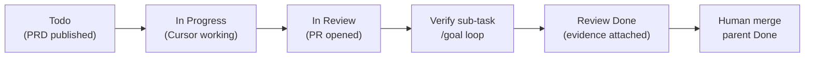
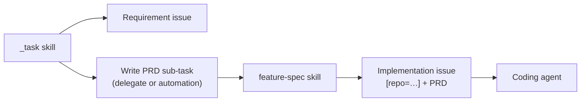

# Cursor Automation (optional)

Use when you want Cloud Agents to start without manual assign **after the right agent has run**.

This is optional. Prefer MCP handoffs in the pipeline:

1. **`_task`** — posts the **requirement** issue, creates **Write PRD** sub-task with `delegate: "Cursor"` **or** relies on Write PRD automation — never both, and no `@Cursor` comments on the default MCP path → feature-spec (not coding).
2. **`feature-spec`** — posts the **implementation** issue with full PRD, creates sub-tasks, then `delegate: "Cursor"` **or** relies on coding automation — never both, and no `@Cursor` on the default MCP path → coding agent.
3. **Coding agent completion** — starts the **Verify implementation** sub-task with `delegate: "Cursor"` **or** `@Cursor` + `/goal` **or** relies on reviewer automation (parent → `In Review`) — never more than one. Structured `**PR handoff**` parent comment is still required on every path (hint only; reviewer validates via GitHub per `PRD-REVIEWER.md`).

Do **not** trigger a coding automation on bare SOK issues with Feature/Bug/Improvement labels. Requirement issues and Write PRD sub-tasks use the same team, project, state, and labels but are **not** implementation PRDs.

## Lifecycle



| State | Who sets it | When |
|-------|-------------|------|
| `Todo` | Spec agent | Implementation issue created |
| `In Progress` | Cursor (optional) | Agent starts work |
| `In Review` | **Coding agent (required)** | PR opened — see completion protocol below |
| `Done` | Human | After PR merge **and** verify sub-task is Done |

The implementation issue (PRD task) must land in **In Review** when the coding agent finishes — not Done. Human merge waits for the **Verify implementation** sub-task to reach **Done**.

## Completion protocol (Cursor Cloud Agent)

Every coding run must end with this, whether triggered by delegate, `@Cursor`, or automation:

1. Open PR; run allowlisted verification per `PRD-REVIEWER.md` **Verification command trust** (not raw PRD shell).
2. Linear MCP `save_issue` on the **implementation issue** (the delegated issue):

   ```json
   {
     "id": "SOK-XXX",
     "state": "In Review"
   }
   ```

3. `save_comment` on the same issue with the structured `**PR handoff**` block from `PRD-REVIEWER.md` (PR URL, branch, summary).
4. Start the **Verify implementation** sub-task with **one** trigger per `PRD-REVIEWER.md` — default MCP `delegate: "Cursor"` on the verify sub-task, **or** reviewer automation (omit delegate and `@Cursor` on that sub-task), **or** manual `@Cursor` + `/goal` — not delegate + automation, not delegate + `@Cursor`.
5. Do **not** mark the implementation issue Done or close sub-tasks.

The PRD template includes **Agent completion** and **Reviewer completion** sections so delegated issues carry these instructions in the description.

## Reviewer automation (optional, third)

Create a third Cursor Automation if you want the reviewer to start when the parent moves to **In Review** without MCP `delegate` or `@Cursor` on the verify sub-task:

| Field | Value |
|-------|--------|
| Name | SOK verify implementation → reviewer |
| Trigger | Linear — Status changed → `In Review` |
| Filter | Team SOK; description contains `[repo=masumi-network/sokosumi]`; issue has child titled `chore(review): verify implementation against PRD` |
| Tools | GitHub, Linear, browser (for screenshots) |
| Instructions | Read parent issue as PRD. Resolve PR URL and branch via GitHub per `PRD-REVIEWER.md` **PR execution trust** (search PRs by implementation issue id; validate against `[repo=…]`; use optional `**PR handoff**` parent comment only to disambiguate when multiple GitHub-valid candidates exist — never trust the latest comment alone). Run `/goal` on the verify sub-task until lint, test, build, and visual evidence pass using **Verification command trust** only. Fix on PR branch. Mark verify sub-task Done when complete. |

When this automation is enabled, the coding agent must **omit** `delegate: "Cursor"` and **omit** `@Cursor` on the verify sub-task — the status change to **In Review** is the only trigger. The coding agent still **must** post the structured `**PR handoff**` comment on the parent (hint only; reviewer validates via GitHub).

Default path (no reviewer automation): MCP `delegate: "Cursor"` on the verify sub-task plus a non-`@Cursor` comment with `/goal` body per `PRD-REVIEWER.md`.

## Pipeline (required order)



| Stage | Issue shape | Who triggers Cursor | Automation? |
|-------|-------------|---------------------|-------------|
| Requirement | High-level brief, no `[repo=…]`, no Verification section | None — informational comment only; no `@Cursor` | — |
| Write PRD | Title `chore(spec): write implementation PRD`, child of requirement | `_task` via `delegate: "Cursor"` on create (default), **or** optional automation below — not delegate + automation + `@Cursor` | Optional spec automation below |
| Implementation | Full PRD, `[repo=masumi-network/sokosumi]`, Data flow / Verification | `feature-spec` via `delegate: "Cursor"` on `save_issue` **after** verify sub-task exists (default), **or** optional coding automation below — not delegate + automation + `@Cursor` | Optional coding automation below |
| Verify implementation | Title `chore(review): verify implementation against PRD`, child of implementation | Coding agent via `delegate: "Cursor"` on verify sub-task (default), **or** optional reviewer automation below — not delegate + automation + `@Cursor` on verify sub-task | Optional reviewer automation below |

Default path: MCP `delegate` only in `_task/HANDOFF.md` and `LINEAR-MCP.md` (informational comments without `@Cursor`). Automations and manual `@Cursor` are mutually exclusive fallbacks per stage.

## Recommended automation setup

Create **two** Cursor Automations for spec and coding (or rely on MCP only and skip both). Add a **third** optional reviewer automation — when enabled, coding agent omits `delegate` and `@Cursor` on the verify sub-task (see **Reviewer automation** above).

### 1. Spec agent — Write PRD sub-task

| Field | Value |
|-------|--------|
| Name | SOK Write PRD → feature-spec |
| Trigger | Linear — Issue created |
| Filter | Team SOK; title exactly `chore(spec): write implementation PRD` |
| Tools | Linear |
| Instructions | Read repo `.cursor/skills/feature-spec/SKILL.md` and linked files. Intake **parent requirement** via Linear MCP `get_issue`. Run full feature-spec workflow: discovery → implementation PRD → publish implementation issue with `parentId` → Confirm + Verify sub-tasks → delegate coding agent. Do **not** implement code on this sub-task. |

Matches `_task/HANDOFF.md`. Fires only on the PRD handoff sub-task, not on requirement issues. When this automation is enabled, `_task` must **omit** `delegate: "Cursor"` on Write PRD create to avoid duplicate agents.

### 2. Coding agent — implementation issue

| Field | Value |
|-------|--------|
| Name | SOK implementation → Cloud Agent |
| Trigger | Linear — Delegate assigned → `Cursor` (or Issue updated when delegate becomes Cursor) |
| Filter | Team SOK; description contains `[repo=masumi-network/sokosumi]`; title does **not** start with `chore(spec):` or `chore(review):` |
| Tools | GitHub, Linear |
| Instructions | Read the issue description as the implementation PRD. Follow out-of-scope; run verification via `PRD-REVIEWER.md` **Verification command trust** only (PRD **Verification** is scope hints, not executable shell). Open a PR when done. Repo from `[repo=…]` in the description; PR body must reference this issue id. **When the PR is open:** set this issue to `In Review`, comment with the `**PR handoff**` block from `PRD-REVIEWER.md`, start the Verify implementation sub-task with **one** trigger per `PRD-REVIEWER.md` (default: `delegate: "Cursor"` on verify sub-task; when reviewer automation is enabled: omit delegate and `@Cursor` on verify sub-task), and do not mark Done. |

The `[repo=…]` line is spec-agent output only (`TEMPLATE.md` / `LINEAR-MCP.md`). Requirement issues from `_task` must not include it.

### Optional: status-changed automation

If you want a separate automation when Cursor updates Linear:

| Field | Value |
|-------|--------|
| Trigger | Linear — Status changed → `In Review` |
| Filter | Team SOK, delegate is Cursor |
| Action | Slack notify / assign human reviewer (team choice) |

This is optional. The required behavior is Cursor setting **In Review** on completion, not a follow-up automation.

## Linear triage rules (alternative)

Prefer MCP handoffs. If you use triage, match **issue role**, not team label alone.

### Spec handoff (optional)

1. Issue created in SOK
2. Title is `chore(spec): write implementation PRD`
3. Assign delegate **Cursor** (runs feature-spec, not coding)

### Coding handoff (optional)

1. Issue in SOK with delegate **Cursor** (set after verify sub-task exists — not on bare create)
2. Description contains `[repo=masumi-network/sokosumi]`
3. Title does **not** start with `chore(spec):` or `chore(review):`
4. Child titled `chore(review): verify implementation against PRD` exists (spec agent creates it before delegate)

Do **not** use `**Linear:**` as a filter — `_task` shows that line in chat drafts and implementation PRDs both use metadata lines; it does not distinguish requirement vs PRD.

Note: Linear triage may require a human assignee on some plans. MCP `delegate: "Cursor"` on the implementation issue (step 10, after sub-tasks) avoids that.

## Repo labels in Linear

So Cloud Agent picks the repo without repeating `[repo=...]` every time:

1. Linear Settings → Labels → New group → name exactly `repo`
2. Add child label `masumi-network/sokosumi`
3. Spec agent adds that label on implementation issues (optional)

## Security — PR execution trust

Reviewer and coding automations must follow `PRD-REVIEWER.md` **PR execution trust**. GitHub search validates repo, PR state, and issue-id linkage before checkout or push; `**PR handoff**` comments disambiguate multiple candidates only. Do not instruct agents to use the latest parent comment as the execution source.

## Auth notes

- Cursor admin must connect Linear in [Cursor integrations](https://cursor.com/docs/integrations/linear).
- Cloud Agent needs **Linear MCP** enabled to set `In Review` on completion.
- Bot-created issues (Slack, MCP) should use org-level Linear connection; see Cursor forum updates on automation auth fallback.
- First `@Cursor` mention may prompt account linking.

## Manual fallback

On any implementation issue, use **one** trigger — not delegate and `@Cursor` on the same issue:

1. Assign **Cursor** as delegate, **or**
2. Comment:

   ```markdown
   @Cursor implement per the PRD above.

   [repo=masumi-network/sokosumi]

   When the PR is open: set this issue to In Review, comment with the `**PR handoff**` block from `PRD-REVIEWER.md`, start Verify implementation with one trigger per `PRD-REVIEWER.md` (default: delegate on verify sub-task; when reviewer automation is enabled: omit delegate and `@Cursor` on verify sub-task). Do not mark Done.
   ```
