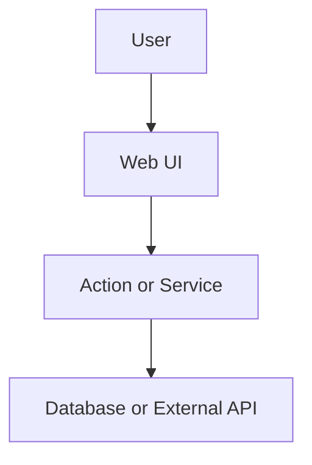
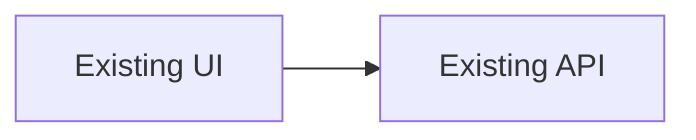
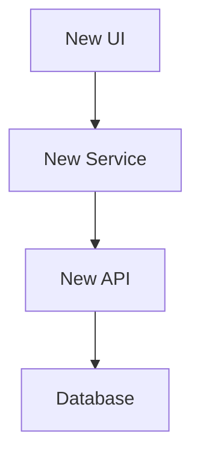
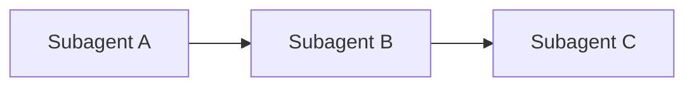

# PRD Template

**Implementation issue** output from the spec agent. Not for human requirement briefs — use `REQUIREMENT-TEMPLATE.md` for those.

Use this skeleton. Delete sections that do not apply, except `Data flow`, which is always required.

````markdown
---
name: SOK-XXX Short Title
overview: One-line outcome.
todos:
  - id: subagent-a
    content: "Subagent A: short scope"
    status: pending
isProject: false
---

# SOK-XXX: Title

[repo=masumi-network/sokosumi]

**Problem:** One or two sentences describing the user pain, product gap, or broken behavior.

**Goal:** One or two sentences describing the user-facing outcome and why it matters.

**Requirement:** SOK-YYY (parent requirement issue, when applicable)

**Linear:** project Sokosumi - state Todo - label Feature

**Confirmed decisions:**
- Decision already locked by the user.
- Another decision if needed.

## Data flow



## Current state



- Current limitation or behavior.
- Existing files or patterns to reuse:
  - [`apps/web/path/to/file.tsx`](apps/web/path/to/file.tsx)

## Target architecture



## Contract / behavior

| Area | Spec |
|------|------|
| Input | Required inputs, params, or form fields |
| Output | Response shape, UI result, side effects |
| Auth | Auth and permission checks |
| Errors | User-facing failure states |

## Key decisions

| Decision | Choice |
|----------|--------|
| Storage | Chosen storage strategy |
| API shape | Chosen endpoint or action shape |
| UI scope | Chosen v1 UI behavior |

## Subagent breakdown

### Subagent A - Scope name

**Scope:** One sentence.

**Context:**
- Relevant product decision.
- Relevant files or existing patterns.

**Deliverables:**
- [`path/to/file.ts`](path/to/file.ts)
- Tests or docs if required.

**Do not:** Explicit boundary.

## Execution order



## Verification

List exact commands the coding and reviewer agents must run. Example:

- `pnpm web:check`
- `pnpm web:test`
- `pnpm web:build`
- Manual: open `/path` and confirm behavior X

## Agent completion

When the PR is ready:

1. Open a PR (default base: `main`).
2. Use Linear MCP `save_issue` on **this issue**: `state: "In Review"`.
3. Comment on this issue with the PR URL and a one-line summary.
4. Start the **Verify implementation** sub-task with **one** trigger — delegate to Cursor via Linear MCP **or** post the `/goal` handoff from `PRD-REVIEWER.md`, not both.
5. Do **not** mark this issue Done — human review follows the PR after reviewer passes.

## Reviewer completion

On the **Verify implementation** sub-task only — see `PRD-REVIEWER.md`:

1. Compare PR to this PRD; loop with `/goal` until lint, test, build, and visual evidence pass.
2. Attach screenshot or screen recording for user-facing changes.
3. Mark the verify sub-task **Done**; comment on this issue with evidence links.
4. Do **not** mark this parent issue Done.

## Out of scope

- Follow-up not included in v1.
- Known non-goal.
````

## Required cleanup before sending

- Remove empty optional sections.
- If there are no subagents, remove frontmatter `todos`.
- Keep `Data flow`.
- Keep `Verification`, `Agent completion`, `Reviewer completion`, and `Out of scope`.
- Keep the Linear line with the inferred label.
