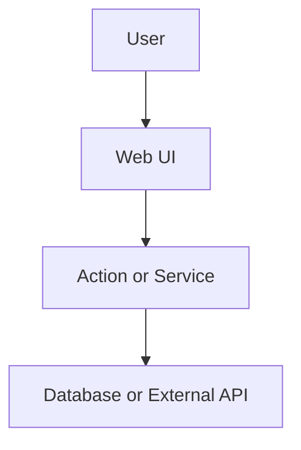
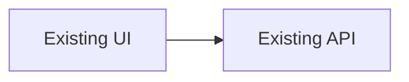
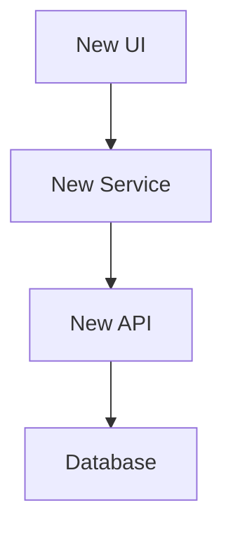
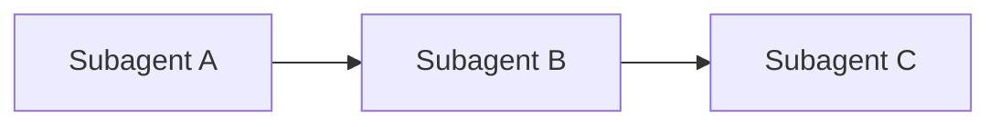

# PRD Template

Use this skeleton. Delete sections that do not apply, except `Data flow`, which is always required.

````markdown
---
name: SOK-XXX Short Title
overview: One-line outcome.
todos:
  - id: subagent-a
    content: "Subagent A: short scope"
    status: pending
isProject: false
---

# SOK-XXX: Title

**Problem:** One or two sentences describing the user pain, product gap, or broken behavior.

**Goal:** One or two sentences describing the user-facing outcome and why it matters.

**Linear:** project Sokosumi - state Todo - label Feature

**Confirmed decisions:**
- Decision already locked by the user.
- Another decision if needed.

## Data flow



## Current state



- Current limitation or behavior.
- Existing files or patterns to reuse:
  - [`apps/web/path/to/file.tsx`](apps/web/path/to/file.tsx)

## Target architecture



## Contract / behavior

| Area | Spec |
|------|------|
| Input | Required inputs, params, or form fields |
| Output | Response shape, UI result, side effects |
| Auth | Auth and permission checks |
| Errors | User-facing failure states |

## Key decisions

| Decision | Choice |
|----------|--------|
| Storage | Chosen storage strategy |
| API shape | Chosen endpoint or action shape |
| UI scope | Chosen v1 UI behavior |

## Subagent breakdown

### Subagent A - Scope name

**Scope:** One sentence.

**Context:**
- Relevant product decision.
- Relevant files or existing patterns.

**Deliverables:**
- [`path/to/file.ts`](path/to/file.ts)
- Tests or docs if required.

**Do not:** Explicit boundary.

## Execution order



## Verification

- Command or manual check.
- Another check.

## Out of scope

- Follow-up not included in v1.
- Known non-goal.
````

## Required cleanup before sending

- Remove empty optional sections.
- If there are no subagents, remove frontmatter `todos`.
- Keep `Data flow`.
- Keep `Verification` and `Out of scope`.
- Keep the Linear line with the inferred label.
