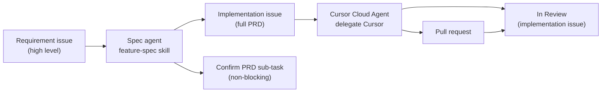

# Spec → Code Pipeline

Two agents. Two Linear issue shapes. One handoff. No blocking PRD approval.

## Issue types

| Type | Who writes it | Purpose | Ready for code? |
|------|---------------|---------|-----------------|
| **Requirement** | Human, PM, or triage | Problem, goal, locked decisions, rough architecture ideas | No |
| **Implementation** | Spec agent (auto) | Full PRD from `TEMPLATE.md` — contracts, files, verification | Yes — Cursor starts immediately |
| **Confirm PRD** | Spec agent (auto sub-task) | Human sanity-check of the PRD against intent | No — does not block coding |

A requirement issue with feature and architectural notes is **input**, not the final plan.

**Examples in SOK:**

- [SOK-537](https://linear.app/masumi/issue/SOK-537/create-history-view) — requirement (history API, unified feed, mock)
- [SOK-549](https://linear.app/masumi/issue/SOK-549/improvesidebar-restore-recent-chats-list) — implementation PRD (files, contracts, verification)

## Spec agent workflow

1. **Intake**
   - User gives a feature summary, **or**
   - User points at a Linear requirement issue (`SOK-XXX`).
   - Load the issue with Linear MCP `get_issue`.
   - Treat description as requirements only. Do not assume it is implementable as written.

2. **Discovery**
   - Search codebase. Read scoped `AGENTS.md` files.
   - Resolve open questions against real files, patterns, and related issues.
   - Link blockers and parent/related issues in the draft.

3. **Draft PRD + publish (one run)**
   - Fill `TEMPLATE.md`.
   - Apply `SUBAGENT-RUBRIC.md`.
   - Follow `LINEAR-MCP.md` immediately — no approval gate.
   - Create **implementation** issue with full PRD.
   - Set `parentId` to the requirement issue when one exists.
   - Add `[repo=masumi-network/sokosumi]` and `delegate: "Cursor"` (unless user opts out).
   - Create **Confirm PRD** sub-task under the implementation issue.
   - Comment on the requirement issue with a link to the implementation issue.

## Confirm PRD sub-task

Non-blocking. Cursor Cloud Agent runs on the implementation issue in parallel.

Human checks:

- PRD matches the requirement intent
- Scope and out-of-scope are correct
- Key decisions look right

If wrong: comment on the implementation issue or stop the Cloud Agent; do not wait for confirm before coding starts.

## Coding agent (Cursor Cloud Agent)

Cursor reads the **implementation** issue only.

### Status lifecycle

| State | Set by | When |
|-------|--------|------|
| `Todo` | Spec agent | Issue created with PRD |
| `In Progress` | Cursor | Optional, when work starts |
| `In Review` | **Cursor (required)** | PR opened |
| `Done` | Human | After PR merge |

On completion, Cursor must set the **implementation issue** to `In Review` via Linear MCP — not Done. See `CURSOR-AUTOMATION.md` and the **Agent completion** section in `TEMPLATE.md`.

Trigger options (pick one per team):

| Method | When to use |
|--------|-------------|
| **MCP delegate on create** | Spec agent sets `delegate: "Cursor"` on `save_issue` (default) |
| **Manual** | Assign issue to Cursor in Linear, or comment `@Cursor implement per PRD` |
| **Linear triage rule** | Auto-delegate when label/state matches |
| **Cursor Automation** | Linear trigger "Issue created" on team SOK — see `CURSOR-AUTOMATION.md` |

Cloud Agent repo resolution (priority order):

1. `[repo=owner/name]` in issue description or `@Cursor` comment
2. Issue label under Linear label group `repo` (e.g. `masumi-network/sokosumi`)
3. Project repo label
4. Default repo in Cursor Dashboard → Cloud Agents

## Requirement issue template

Use `REQUIREMENT-TEMPLATE.md` when creating or reviewing requirement issues by hand.

## What not to do

- Do not send requirement-only text straight to Cursor Cloud Agent.
- Do not block Linear create or Cursor delegate on PRD approval.
- Do not use browser or raw Linear API when MCP is available.
