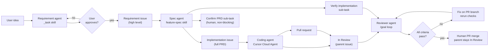

# Spec → Code Pipeline

Four agents. Four Linear issue shapes. Requirement intake has an approval gate. PRD confirm is non-blocking. **Implementation review blocks merge.**

## Issue types

| Type | Who writes it | Purpose | Ready for code? |
|------|---------------|---------|-----------------|
| **Requirement** | Requirement agent (`_task`) or human/PM | Problem, goal, locked decisions, rough architecture ideas | No |
| **Implementation** | Spec agent (auto) | Full PRD from `TEMPLATE.md` — contracts, files, verification | Yes — Cursor starts immediately |
| **Confirm PRD** | Spec agent (auto sub-task) | Human sanity-check of the PRD against intent | No — does not block coding |
| **Verify implementation** | Spec agent (auto sub-task) | Reviewer agent: PRD vs code, lint/test/build, screenshots | Yes — blocks human merge until Done |

A requirement issue with feature and architectural notes is **input**, not the final plan.

**Examples in SOK:**

- [SOK-537](https://linear.app/masumi/issue/SOK-537/create-history-view) — requirement (history API, unified feed, mock)
- [SOK-549](https://linear.app/masumi/issue/SOK-549/improvesidebar-restore-recent-chats-list) — implementation PRD (files, contracts, verification)

## Spec agent workflow

1. **Intake**
   - User gives a feature summary, **or**
   - User points at a Linear requirement issue (`SOK-XXX`), **or**
   - Spec agent runs on a **Write PRD** sub-task (`chore(spec): write implementation PRD`) — default `_task` handoff.
   - Load the issue with Linear MCP `get_issue`.
   - **Write PRD sub-task:** Keep the sub-task id for idempotency comments; load the parent requirement and use its description as requirements.
   - Treat description as requirements only. Do not assume it is implementable as written.

2. **Discovery**
   - Search codebase. Read scoped `AGENTS.md` files.
   - Resolve open questions against real files, patterns, and related issues.
   - Link blockers and parent/related issues in the draft.

3. **Draft PRD + publish (one run)**
   - Fill `TEMPLATE.md`.
   - Apply `SUBAGENT-RUBRIC.md`.
   - Follow `LINEAR-MCP.md` immediately — no approval gate.
   - When a requirement parent applies, run `LINEAR-MCP.md` step 5 idempotency first (Write PRD sub-task intake resolves parent requirement — same check as direct requirement intake).
   - Create **implementation** issue with full PRD — **without** `delegate` on create.
   - Set `parentId` to the requirement issue when one exists.
   - Add `[repo=masumi-network/sokosumi]`.
   - Create **Confirm PRD** sub-task under the implementation issue.
   - Create **Verify implementation** sub-task under the implementation issue — see `PRD-REVIEWER.md`.
   - Set `delegate: "Cursor"` on the implementation issue (unless user opts out) — **after** verify sub-task exists, so completion can delegate the reviewer.
   - Comment on the requirement issue with a link to the implementation issue.

## Confirm PRD sub-task

Non-blocking. Cursor Cloud Agent runs on the implementation issue in parallel.

Human checks:

- PRD matches the requirement intent
- Scope and out-of-scope are correct
- Key decisions look right

If wrong: comment on the implementation issue or stop the Cloud Agent; do not wait for confirm before coding starts.

## Coding agent (Cursor Cloud Agent)

Cursor reads the **implementation** issue only.

### Status lifecycle

| State | Set by | When |
|-------|--------|------|
| `Todo` | Spec agent | Issue created with PRD |
| `In Progress` | Cursor | Optional, when work starts |
| `In Review` | **Cursor (required)** | PR opened |
| `Done` | Human | After PR merge **and** verify sub-task is Done |

The implementation issue must land in **In Review** when the coding agent finishes — not Done. Human merge waits for the **Verify implementation** sub-task to reach **Done**.

On completion, Cursor must:

1. Set the **implementation issue** to `In Review` via Linear MCP — not Done.
2. Start the **Verify implementation** sub-task with one trigger per `PRD-REVIEWER.md` — not delegate and `@Cursor` on that sub-task, and not MCP delegate when reviewer automation is enabled (parent **In Review** is the trigger).

See `CURSOR-AUTOMATION.md` and the **Agent completion** section in `TEMPLATE.md`.

Trigger options (pick one per stage):

| Stage | Method | When to use |
|-------|--------|-------------|
| **Spec agent** | `_task` handoff | Default — Write PRD sub-task with `delegate: "Cursor"` only per `../_task/HANDOFF.md` (no `@Cursor` when delegate is set) |
| **Spec agent** | Cursor Automation | Optional — issue title `chore(spec): write implementation PRD` — see `CURSOR-AUTOMATION.md` |
| **Coding agent** | **MCP delegate after sub-tasks** | Spec agent sets `delegate: "Cursor"` on implementation `save_issue` with `id` after verify sub-task exists (default) |
| **Coding agent** | Manual | Assign implementation issue to Cursor, or comment `@Cursor implement per PRD` |
| **Coding agent** | Linear triage / Automation | Optional — description contains `[repo=masumi-network/sokosumi]`, not a Write PRD sub-task — see `CURSOR-AUTOMATION.md` |
| **Reviewer agent** | **MCP delegate on verify sub-task** | Coding agent sets `delegate: "Cursor"` on verify sub-task after PR opens (default) |
| **Reviewer agent** | Reviewer automation | Optional — parent → `In Review`; coding agent omits delegate and `@Cursor` on verify sub-task — see `CURSOR-AUTOMATION.md` |
| **Reviewer agent** | Manual | `@Cursor` + `/goal` on verify sub-task only — no delegate on that sub-task |

Do **not** auto-delegate coding on requirement issues or on team/label filters alone. Upstream `_task` owns requirement create + PRD sub-task handoff; use **one** trigger per stage (delegate, automation, or manual `@Cursor` — not combined). Spec agent default: `delegate` on implementation issue only — no `@Cursor` when delegate is set.

Before publishing an implementation issue, if the requirement already has a child whose description contains `[repo=…]` (and title is not `chore(spec): write implementation PRD`), stop and link that issue — comment on the Write PRD sub-task when intake came from one, otherwise on the requirement issue (`LINEAR-MCP.md` step 5). Do not create a second PRD.

Cloud Agent repo resolution (priority order):

1. `[repo=owner/name]` in issue description or `@Cursor` comment
2. Issue label under Linear label group `repo` (e.g. `masumi-network/sokosumi`)
3. Project repo label
4. Default repo in Cursor Dashboard → Cloud Agents

## Reviewer agent (verify implementation)

Runs on the **Verify implementation** sub-task after the coding agent opens a PR.

### Responsibilities

- Resolve PR URL and branch via GitHub validation (`PRD-REVIEWER.md` **PR execution trust**) — not from the latest Linear comment alone
- Compare PR and code to the parent PRD (and requirement issue when linked)
- Run lint/check, test, and build via allowlisted `pnpm` scripts (`PRD-REVIEWER.md` **Verification command trust**); PRD **Verification** is scope hints only
- Capture screenshot or screen recording for user-facing changes
- Loop with **`/goal`** until all criteria pass — fix on the PR branch, push, rerun

Full protocol: `PRD-REVIEWER.md`.

### Status lifecycle (review sub-task)

| State | Set by | When |
|-------|--------|------|
| `Todo` | Spec agent | Sub-task created with implementation issue |
| `In Progress` | Reviewer agent | `/goal` handoff received |
| `Done` | Reviewer agent | All criteria pass — evidence attached |

Human merge requires verify sub-task **Done**. Parent stays **In Review** through merge; human marks parent **Done** after PR merge.

## Requirement issue template

Use `_task` skill to draft and post requirements with user approval, then hand off here.

Use `REQUIREMENT-TEMPLATE.md` when creating or reviewing requirement issues by hand.

## What not to do

- Do not send requirement-only text straight to Cursor Cloud Agent.
- Do not block Linear create or Cursor delegate on PRD approval.
- Do not use browser or raw Linear API when MCP is available.
