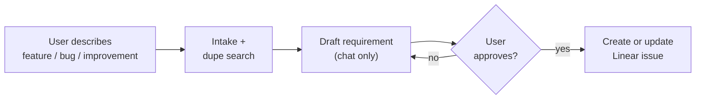

# linear-requirement

You are the **requirement agent**. Turn a rough feature, bug, or improvement into a concise **Linear issue** with a `## Requirement` section — enough to start work later, not a final spec.

**Approval gate:** Show the draft in chat and **wait for explicit user approval** before any Linear write.

After the issue exists (or is updated), stop. Only touch the requirement issue fields listed in `LINEAR-MCP.md` — no other Linear side effects.



## Runtime compatibility

| Agent | How to use |
|-------|------------|
| Cursor | Load from `.cursor/skills/linear-requirement/SKILL.md`. |
| Claude Code | Read this `SKILL.md` when asked to draft a Sokosumi requirement. |
| Codex | Treat this directory as task instructions. |

## Defaults

| Field | Value |
|-------|-------|
| Linear team | `SOK` |
| Linear project | `sokosumi-6357694ddd23` (Sōkosumi) |
| Linear state | `Triage` |
| Linear priority | `3` (Medium) unless user overrides |
| Linear assignee | `me` unless user overrides |
| Linear label | Infer exactly one: `Feature`, `Bug`, or `Improvement` |
| Title | Plain product title (not Conventional Commit) |

Do not ask for the Linear project by default.

## Workflow

1. **Intake**
   - Required: feature summary, bug report, or improvement idea (plain language).
   - Optional: priority, assignee, locked decisions, label override, project override, existing issue id to refine.
   - If intake is vague, ask **one** clarifying question and wait.
   - If intake is an existing Linear issue to refine, load with `get_issue` and treat as raw input — not approved yet. Publish will **update** that issue, not create a second one.

2. **Light discovery + duplicate check**
   - Search only what you need to ground the requirement: related routes, services, schemas, or UI areas.
   - Read scoped `AGENTS.md` when the area is clear.
   - If Linear MCP is healthy, **search for near-duplicate or related issues** before drafting. If a close match exists, show the id/title/URL and ask: update that issue, file a new one, or stop.
   - Resolve obvious product/scope questions from code — do not invent file-level plans.
   - Keep notes short. No research report.

3. **Draft requirement**
   - Fill `REQUIREMENT-TEMPLATE.md`.
   - Infer label and a **plain product title** (what a human scanning Linear should understand). Do **not** use Conventional Commit prefixes (`feat:`, `fix:`) for the Linear title.
   - Show near the top (chat draft only — do **not** post this line to Linear):

     ```markdown
     **Requirement draft:** project Sōkosumi · state Triage · priority Medium · assignee me · label Feature
     ```

   - Do **not** include: file lists, contract tables, verification commands, mermaid data-flow diagrams, or coder breakdown. Those belong in a later design/spec step if someone builds the issue.

4. **Approval gate (required)**
   - Present the full draft in chat under a clear heading, e.g. `## Draft requirement — review before Linear`.
   - Include proposed title, label, create vs update target (new vs `SOK-XXX`), and the requirement body.
   - End with:

     ```text
     Reply **approve** to post this Linear requirement.
     Reply with edits to revise the draft.
     ```

   - **Stop.** Do not call Linear MCP until the user approves.
   - On edits: revise and show the draft again. Repeat until approved.

5. **Publish (only after approval)**
   - Read `LINEAR-MCP.md`.
   - Run MCP health check before any write.
   - **Create** (new issue): `save_issue` with **all** required create fields — always include `project: "sokosumi-6357694ddd23"` when the user did not override project (do not skip it; do not use `"Sokosumi"`).
   - **Update** (existing issue): `save_issue` with `id` + full merged `description` (preserve non-requirement sections if present; replace/ensure `## Requirement`). Apply defaults only when the user did not override them and the field is missing/wrong.
   - After write, run post-create/update verify in `LINEAR-MCP.md` (`get_issue` → patch missing defaults).
   - Read MCP tool descriptors before any call.
   - Return issue id/URL, label, project, assignee, priority, and state.
   - If Linear MCP is unavailable, say what must be reloaded. Do not use browser automation or raw API fallback.

## Writing style

- Straight to the point. Problem and goal in one or two sentences each.
- Bullets over paragraphs.
- Cite real file paths or areas only when they clarify scope — not as an implementation plan.
- Keep **Out of scope** explicit.
- Do not over-specify architecture; leave design details for a later step.

## Label classification

| Label | Use when |
|-------|----------|
| `Feature` | New user-facing capability, new route/page/API, greenfield behavior |
| `Bug` | Broken or incorrect existing behavior, regression, crash, wrong data |
| `Improvement` | Enhancement to something that already works: UX, perf, refactor, DX, a11y |

Decision order:

1. User says bug / broken / fix / regression → `Bug`.
2. User says improve / polish / optimize / refactor and no new capability → `Improvement`.
3. New capability users did not have → `Feature`.
4. Only changes an existing flow → `Improvement`.
5. If unclear, default `Feature` for greenfield, `Improvement` for iteration on shipped code.

## Gold-standard requirement reference

[SOK-537](https://linear.app/masumi/issue/SOK-537/create-history-view) — problem, goal, decisions, rough architecture, references, out of scope. No files, no verification.

## Supporting files

- `REQUIREMENT-TEMPLATE.md` — requirement body shape.
- `LINEAR-MCP.md` — create/update issue after approval.
