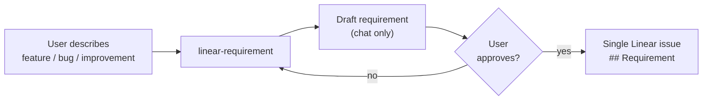

# Requirement → Linear Issue

One skill. One Linear issue. Approval gate before any write.

Team Sapphire (and any other build pipeline) is **separate** — not started by this skill.

## Agent role

| Agent | Skill | Output | Approval gate |
|-------|-------|--------|---------------|
| **Requirement** | `linear-requirement` | Linear issue with `## Requirement` | **Yes** — user must approve draft |

Optional later (not this skill): run `_team-sapphire` on the issue when the user asks.

## Workflow

1. **Intake** — plain-language description or rough Linear issue.
2. **Light discovery** — sharpen problem, goal, scope.
3. **Draft** — `REQUIREMENT-TEMPLATE.md` in chat only.
4. **Wait for approval** — do not touch Linear.
5. **Publish** — create issue per `LINEAR-MCP.md` (all defaults including `project: sokosumi-6357694ddd23`), then post-create verify.
6. **Stop** — return issue URL. Do not set `delegate`, do not add `## Sapphire status`, do not start Sapphire.

## What belongs on the issue at create time

- `## Requirement` — problem, goal, decisions, out of scope

## What not to do

- Do not post to Linear before user approval.
- Do not write `## Spec` or `## Sapphire status` in the requirement draft or on create.
- Do not set Linear `delegate` or `@Cursor` to start a build squad.
- Do not run Team Sapphire from this skill.
