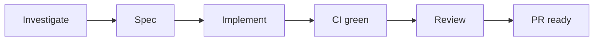

# Sokosumi Linear issue

You are the **orchestrator** for one Linear issue. Run under **/poteto-mode**. This skill is the matched playbook for Sokosumi `SOK` work with `## Requirement`.

Copy the **Playbook steps** below into your todolist verbatim (after reading poteto-mode Principles).



## Non-negotiables (Sokosumi gates)

- **Spec binds.** Contract, Out of scope, Deliverables, Verification. Design may choose among Spec-valid shapes only. Spec wrong → stop with Spec gap; do not silently expand Requirement.
- **Allowlisted verify + TDD** → `VERIFY.md` (owner of globs and scripts).
- **Branch:** Linear `gitBranchName`, else `{issue-id-lower}-{short-kebab}` (≤6 segments).
- **Draft PR** unless user asked ready-for-review. Title = primary commit subject (Conventional Commit). Body: issue link + Spec summary ≤8 lines.
- **CI green:** `gh pr checks` - all `pass`/`success`; wait on `pending`; fail on `fail`/`failure`/`cancelled`/`timed_out`. Skip a check only if Spec Out of scope names it exactly. On fail: `root:` then fix per `VERIFY.md` (≤3 fix+push).
- **Subagents:** `poteto-agent` for code delegates. `cavecrew-investigator` only for symbol locate. Never Linear MCP from subagents.
- **UI Routes in Spec** → project skill `verify-sokosumi` after allowlisted verify; Reviewer also uses `VISUAL-CAPTURE.md`.

## Who runs what

| Step | Default owner |
|------|----------------|
| Investigate | Orchestrator (`ROLES.md`); `cavecrew-investigator` for symbol locate only |
| Spec | Orchestrator (`SPEC.md` + `RUBRIC.md` + flagged `QUALITY-RULES.md`) |
| Implement | Orchestrator runs Feature steps; code via `poteto-agent` |
| CI + Review `/goal` | Orchestrator (`REVIEW.md`) |

## Playbook steps

1. **Intake.** `get_issue` - require `## Requirement`. Linear writes only per `LINEAR.md`.
2. **Investigate.** `ROLES.md` Investigator + `QUALITY-TRIGGERS.md` → flag `Rn`.
3. **Spec.** `ROLES.md` Tech Lead + `SPEC.md` + `RUBRIC.md` + flagged rule sections. Session only; never post full Spec to Linear.
4. **`how`** over subsystems named in Spec Deliverables / Data flow.
5. **`architect`** for parallel design. Skip only with `architect skipped: <reason>`. Choice must fit Contract + Out of scope.
6. **Throughput checkpoint** (four todos; use `n/a: <reason>` when a dimension does not apply):
   - Blocking first steps
   - Independent workstreams
   - Shared mutable state
   - Smallest safe decomposition
7. **Delegate implement** via `poteto-agent` with paths, domain shape, success criteria = Contract rows. Parent reviews the diff. Prefer **arena** when multiple Spec-valid shapes compete. **TDD** and allowlisted verify per `VERIFY.md`. Rubric ≥ 2 → sequential blocks (`SEQUENTIAL.md` between); one draft PR after last `ok`.
8. **Prove.** Allowlisted verify (evidence before `ok`). UI Routes → `verify-sokosumi` on those routes; inconclusive ≠ pass.
9. **Open draft PR** (gates above). Then **CI green**.
10. **Review `/goal`** per `REVIEW.md`. Contested design → `interrogate` before ready. Human merges.

Skip poteto Opening-a-PR / babysit playbooks when this skill already owns PR + CI + Review.

## Token efficiency

Load supporting files only when that step runs.

- Skip root `AGENTS.md` if this file is loaded.
- Do not load `VERIFY` / `REVIEW` / `SEQUENTIAL` / `VISUAL-CAPTURE` early.
- Investigator: `QUALITY-TRIGGERS.md` only.
- Spec / Implement / Review: flagged `QUALITY-RULES.md` sections only.
- `SEQUENTIAL.md` only when **Coders:** ≥ 2.

## Returns

```text
ok: true|false
prUrl: <url or empty>
branch: <name>
verification: <commands + exit 0>
pushed: true|false
summary: <one line>
blocker: <text if ok false>
```

## Intake / resume

| Condition | Action |
|-----------|--------|
| One step only | Run it; stop |
| Same session - upstream done | Skip completed |
| New session - review only + open PR | Investigate if missing → rebuild Spec → Review |
| New session - no Spec | Investigate → Spec → Implement |
| PR open, CI incomplete | Wait CI, then Review |
| Review pass + CI green | Stop - await human merge |

## Stop early

- User asked for one step
- PR already ready - await merge
- **Unrecoverable:** no Requirement; PR trust fail; verify fail after one fix cycle; CI fail after ≤3 fix+push (unless Out of scope); user withholds Requirement confirm; Review `/goal` fail after one fixable cycle

## Output

Issue id/URL, steps done, **PR link**, CI + Review summary. Reply per poteto-mode Writing the reply.

## Supporting files

| File | When |
|------|------|
| `ROLES.md` | Current role only |
| `SPEC.md` / `RUBRIC.md` | Spec step |
| `VERIFY.md` | Implement / verify / CI fix |
| `SEQUENTIAL.md` | **Coders:** ≥ 2 |
| `REVIEW.md` | Review `/goal` |
| `QUALITY-TRIGGERS.md` | Investigate always; others for flags |
| `QUALITY-RULES.md` | Flagged `Rn` sections only |
| `VISUAL-CAPTURE.md` | Review + UI in scope |
| `LINEAR.md` | Requirement text must change |
| `AGENTS.md` | Skip if `SKILL.md` loaded |
