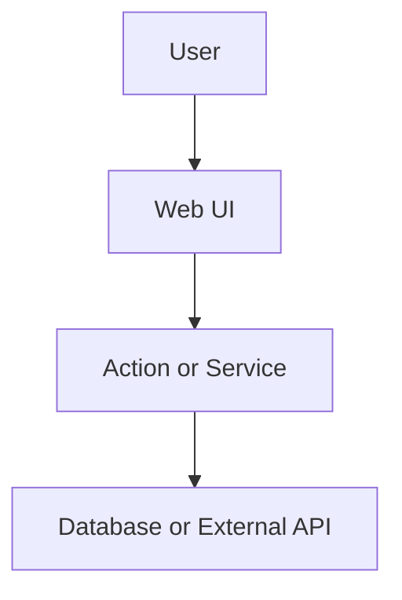
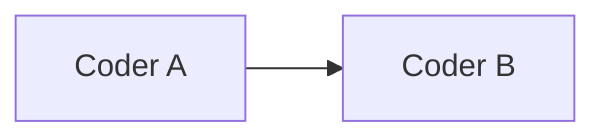

# Spec Template

Session Spec only (PR body gets ≤8-line summary). Delete unused optional sections except **Data flow**. Do **not** post full Spec to Linear.

**Size caps** (`ROLES.md`): Problem/Goal ≤2 sentences each; Confirmed decisions ≤8; Contract ≤8 rows; Key decisions ≤10; Out of scope ≤8; no prose essays outside tables/lists.

````markdown
## Spec

[repo=masumi-network/sokosumi]

**Coders:** 1

**Problem:** One or two sentences.

**Goal:** One or two sentences - user-facing outcome.

**Confirmed decisions:**
- …

## Data flow



## Current state

(Include when RUBRIC says so. Bullets only.)

## Target architecture

(Include when RUBRIC says so. Bullets only - no mermaid.)

## Contract / behavior

| Area | Spec |
|------|------|
| Input | … |
| Output | … |
| Auth | … |
| Errors | … |

## Key decisions

| Decision | Choice |
|----------|--------|
| … | … |

## Coder breakdown

(Only when rubric score ≥ 2 - sequential on one branch.)

### Coder A - Scope name

**Scope:** One line.

**Deliverables:**
- [`path/to/file.ts`](path/to/file.ts)

**Do not:** Boundary.

## Execution order



## Verification

Allowlisted scripts from `VERIFY.md`. **Required:** check + test for the **verify set**. List **build** only when Implement/Review must run it. If TDD required per `VERIFY.md` → list the allowlisted test command that proves the Contract (do not paste TDD globs here). **UI routes:** ≥1 path-only route **iff** Deliverables include `apps/web/src/app/**/page.tsx` or `layout.tsx`, `apps/web/src/components/**`, or `apps/web/messages/**` - else omit Routes.

- Scope: `apps/web` - web:check, web:test
- Routes (UI): `/example-path`

## Out of scope

- Non-goals for v1.
````

## Before handoff

- No YAML plan frontmatter.
- Keep Data flow, Verification, Out of scope.
- Domain-pattern Spec appendix: only for **flagged** `Rn` from `QUALITY-TRIGGERS.md`; formats in matching `QUALITY-RULES.md` sections. **Do not** include empty or untriggered appendix sections.
- Enforce size caps; cut tables first if over.
