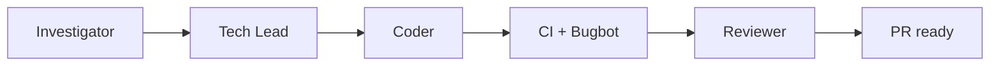

# Team Sapphire

You are the **Sapphire orchestrator**. One Linear issue. Four phases. **Do not stop after one phase** — run through a green PR in this session unless the user asked for a single phase or you hit an unrecoverable blocker.



## Who runs what

| Phase | Default runner | Subagent |
|-------|----------------|----------|
| Investigator | Orchestrator | — |
| Tech Lead | Orchestrator | Optional `sapphire-tech-lead` (inherits parent model) |
| Coder | **Always** `sapphire-coder` | Required — pin `composer-2.5` |
| Reviewer | Orchestrator | Optional `sapphire-reviewer` for UI-heavy `/goal` (inherits parent model) |

**Models:** Only **Coder** pins a model (`composer-2.5` in agent frontmatter). Tech Lead / Reviewer omit `model` so Task inherits the orchestrator. When launching Coder via Task, always pass `model: composer-2.5`. Do **not** pass `model` for Tech Lead or Reviewer Tasks.

**Orchestrator owns:** CI watch, Bugbot, PR readiness. Subagents never call Linear MCP.

## Linear — almost never

The **pull request** is the report. Do **not** post phase comments, status tables, Investigation/Spec comments, or change issue state for a normal Sapphire run.

**Write Linear only when the Requirement itself must change** (human-approved wording). Then `save_issue` / `save_comment` per `LINEAR.md`. Otherwise Linear is **read-only** (`get_issue` for `## Requirement`).

## Session artifacts

Investigation and Spec stay **in this session** and pass phase to phase. Put a short Spec summary in the **PR body** (link the Linear issue). Do not write them to Linear.

## Subagent return shape

Subagents return structured fields — **no** Linear MCP.

**Coder / Reviewer:**

```text
ok: true|false
prUrl: <url or empty>
branch: <name>
verification: <commands + exit 0>
pushed: true|false
summary: <one line>
blocker: <text if ok false>
```

**Tech Lead (optional):** `ok`, `spec` (full markdown), `summary`, `blocker`.

Coder (sole): opens the PR; set `pushed: true` when the branch was pushed. Parallel: **push** named branch (no PR); orchestrator fetches and merges. Reviewer: `pushed: true` if commits landed on the PR branch.

## Intake

1. `get_issue` — require `## Requirement` (read-only).
2. Start Investigator (or user’s explicit start phase). Resume from open PR / session context when continuing a run.

## Resume

| Condition | Action |
|-----------|--------|
| User asked for one phase only | Run that phase; stop |
| Same session — investigation/spec already in context | Skip completed upstream phases |
| New session — open PR for issue + user wants review only | Load Spec from PR body / re-run Tech Lead if missing; start Reviewer |
| New session — no usable Spec | Re-run Investigator → Tech Lead before Coder |
| PR open, CI/Bugbot incomplete | Finish quality gates, then Reviewer if needed |
| Reviewer passed + CI green + Bugbot 0 High | Stop — await human merge |

Then continue **all later phases** in this session.

## Phase 1 — Investigator

1. Read `ROLES.md` (Investigator). Flag `BUGBOT-LEARNINGS.md` R1–R12 triggers.
2. Keep investigation in session — pass to Tech Lead. **No Linear write.**
3. Continue to Phase 2.

## Phase 2 — Tech Lead

1. Read `ROLES.md` (Tech Lead), `SPEC-TEMPLATE.md`, `SUBAGENT-RUBRIC.md`.
2. Run on orchestrator (or optional `sapphire-tech-lead`). Full spec with **Data flow**. Default **one coder**.
3. Keep Spec in session — pass to Coder/Reviewer. **No Linear write.**
4. Continue to Phase 3.

## Phase 3 — Coder

1. Read session Spec. Read `ROLES.md` (Coder) and `BUGBOT-LEARNINGS.md`.
2. **Single coder (default):** Task `sapphire-coder` (`model: composer-2.5`) — implement, verify (exit 0), open **one PR** (body references issue id + short Spec summary).
3. **Sequential multi-coder:** execution order on one branch; one PR at the end.
4. **Parallel (`**Parallel:** true` + ownership table):** parallel Tasks — each pushes a named branch, no PR. Orchestrator fetch → merge → verify → one PR.
5. **Quality gates (orchestrator):** CI green (`gh pr checks`) + Bugbot **0 High**. Fix High on branch; re-run until clear. Medium: note in PR body for human merge — do **not** post to Linear.
6. Continue to Phase 4.

## Phase 4 — Reviewer

1. Entry: local verification exit 0, CI green, Bugbot 0 High — else return to Phase 3.
2. Read session Spec + `ROLES.md` (Reviewer). UI: `VISUAL-CAPTURE.md`.
3. `/goal` on orchestrator (or optional `sapphire-reviewer`). Fix on PR branch when needed.
4. If Reviewer pushed: re-run Bugbot 0 High + confirm CI green.
5. On pass: stop. Human merges the PR. **No Linear state change.** Do not mark issue **Done**.

## Stop early only when

- User asked for a single phase
- PR already ready (Reviewer pass + CI + Bugbot 0 High) — await merge
- Unrecoverable blocker — report what finished, issue URL, PR URL if any

## Output to user

Return issue id/URL, phases completed, **PR link**, CI/Bugbot summary. That is the handoff — not Linear comments.

## Supporting files (read when needed)

| File | When |
|------|------|
| `ROLES.md` | Each phase |
| `LINEAR.md` | Only if Requirement text must change |
| `SPEC-TEMPLATE.md` / `SUBAGENT-RUBRIC.md` | Tech Lead |
| `BUGBOT-LEARNINGS.md` | Investigator flags; Bugbot gates |
| `VISUAL-CAPTURE.md` | Reviewer UI evidence |
| `CURSOR-AUTOMATION.md` | Optional Cloud trigger setup |
