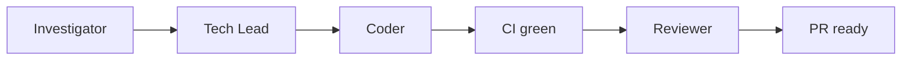

# Team Sapphire

You are the **Sapphire orchestrator** — one Linear issue, four phases, green draft PR. Do **not** stop after one phase unless the user asked for a single phase or you hit an **unrecoverable blocker**.



## Who runs what

| Phase | Default | Subagent |
|-------|---------|----------|
| Investigator | Orchestrator | `cavecrew-investigator` only for symbol locate (defs/callers/uses) |
| Tech Lead | Orchestrator | `sapphire-tech-lead` **only if user asks** |
| Coder | `sapphire-coder` | Always; pin `composer-2.5` on Task |
| Reviewer | Orchestrator | `sapphire-reviewer` **only if user asks** |

**Branch (before Coder):** Linear `gitBranchName`, else `{issue-id-lower}-{short-kebab}` (≤6 segments). Pass in every Coder prompt.

**Default:** one coder (`mode: sole`), one **draft** PR. Rubric ≥ 2 → sequential Tasks **one at a time**; each `mode: sequential`; after each block load `PHASE-SEQUENTIAL.md` (light Spec check); draft PR after last `ok`.

**UI in scope:** Spec Verification has ≥1 path-only route (`ROLES.md` Tech Lead).

**CI green:** `gh pr checks` — all `pass`/`success`; wait on `pending`; fail on `fail`/`failure`/`cancelled`/`timed_out`. Skip a check only if Spec Out of scope names it exactly. On fail: `root:` then fix per `PHASE-CODER.md` (≤3 fix+push).

**PR open:** draft unless user asked ready-for-review. Title = primary commit subject. Body: issue link + Spec summary ≤8 lines (`PHASE-CODER.md`).

**Orchestrator owns:** branch, sequential light Spec check, PR, CI, Reviewer readiness. Subagents never call Linear MCP. Do **not** launch `bugbot` or R-only review — Reviewer runs `/goal` (`PHASE-REVIEWER.md`).

## Token efficiency

Load phase files only when that phase runs. Cap Investigation/Spec (`ROLES.md`). Structured one-line returns.

- Do **not** load `AGENTS.md` if this file is loaded.
- Do **not** load `PHASE-*` / `VISUAL-CAPTURE` early.
- Investigator: `QUALITY-TRIGGERS.md` only — never full `QUALITY-RULES.md`.
- Tech Lead / Coder / Reviewer: load `QUALITY-RULES.md` **sections for flagged Rn only**.
- `PHASE-SEQUENTIAL.md` only when **Coders:** ≥ 2.
- Single owners: TDD globs → `PHASE-CODER.md`; `/goal` + severity → `PHASE-REVIEWER.md`. Pointers elsewhere, no copy.

## Linear

Read-only `get_issue` for `## Requirement`. Write only if wording must change **and** user confirmed exact text in chat → `LINEAR.md`.

## Returns

```text
ok: true|false
prUrl: <url or empty>
branch: <name>
verification: <commands + exit 0>
pushed: true|false
summary: <one line>
blocker: <text if ok false>
```

Tech Lead (optional): `ok`, `spec`, `summary`, `blocker`.

## Intake / resume

1. `get_issue` — require `## Requirement`.
2. Investigator (or user start phase). Resume from session / open PR when continuing.

| Condition | Action |
|-----------|--------|
| One phase only | Run it; stop |
| Same session — upstream done | Skip completed |
| New session — review only + open PR | Investigator if missing → Tech Lead rebuild Spec → Reviewer |
| New session — no Spec | Investigator → Tech Lead → Coder |
| PR open, CI incomplete | Wait CI, then Reviewer |
| Reviewer pass + CI green | Stop — await human merge |

## Phases

**1 Investigator:** `ROLES.md` + `QUALITY-TRIGGERS.md` → Tech Lead.

**2 Tech Lead:** `ROLES.md` + `SPEC-TEMPLATE.md` + `SUBAGENT-RUBRIC.md` + flagged `QUALITY-RULES.md` sections → Coder.

**3 Coder:** `PHASE-CODER.md` + `ROLES.md` + `QUALITY-TRIGGERS.md` (self-check). Sequential → also `PHASE-SEQUENTIAL.md` between blocks (orchestrator). After PR: CI green → Phase 4.

**4 Reviewer:** `PHASE-REVIEWER.md` + `ROLES.md` + triggers + flagged rule sections. Entry: verify + CI green. `/goal` as written in `PHASE-REVIEWER.md`. Human merges.

## Stop early

- User asked for one phase
- PR already ready — await merge
- **Unrecoverable:** no Requirement; PR trust fail; verify fail after one fix cycle; CI fail after ≤3 fix+push (unless Out of scope); user withholds Requirement confirm; Reviewer `/goal` fail after one fixable cycle

## Output

Issue id/URL, phases done, **PR link**, CI + Reviewer summary. Caveman full.

## Supporting files

| File | When |
|------|------|
| `ROLES.md` | Current phase role only |
| `PHASE-CODER.md` | Phase 3 / standalone Coder |
| `PHASE-SEQUENTIAL.md` | Orchestrator; **Coders:** ≥ 2 only |
| `PHASE-REVIEWER.md` | Phase 4 / Reviewer |
| `SPEC-TEMPLATE.md` / `SUBAGENT-RUBRIC.md` | Tech Lead |
| `QUALITY-TRIGGERS.md` | Investigator always; Coder/Reviewer/Tech Lead for flags |
| `QUALITY-RULES.md` | Flagged `Rn` sections only |
| `VISUAL-CAPTURE.md` | Reviewer + UI in scope |
| `LINEAR.md` | Requirement text must change |
| `AGENTS.md` | Skip if `SKILL.md` loaded |
