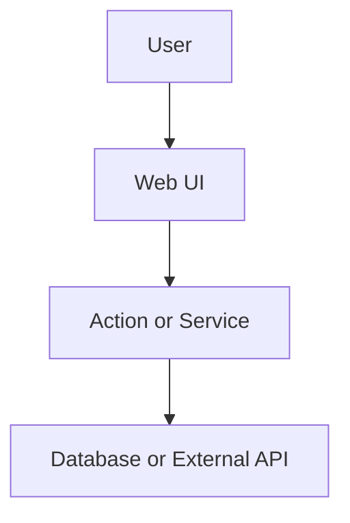
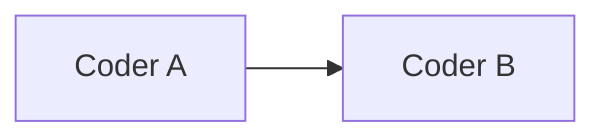

# Spec Template

Session Spec only (PR body gets ≤8-line summary). Delete unused optional sections except **Data flow**. Do **not** post full Spec to Linear.

**Size caps** (`ROLES.md`): Problem/Goal ≤2 sentences each; Confirmed decisions ≤8; Contract ≤8 rows; Key decisions ≤10; Out of scope ≤8; no prose essays outside tables/lists.

````markdown
## Spec

[repo=masumi-network/sokosumi]

**Coders:** 1

**Problem:** One or two sentences.

**Goal:** One or two sentences — user-facing outcome.

**Confirmed decisions:**
- …

## Data flow



## Current state

(Include when SUBAGENT-RUBRIC says so. Bullets only.)

## Target architecture

(Include when SUBAGENT-RUBRIC says so. Bullets or tiny mermaid.)

## Contract / behavior

| Area | Spec |
|------|------|
| Input | … |
| Output | … |
| Auth | … |
| Errors | … |

## Key decisions

| Decision | Choice |
|----------|--------|
| … | … |

## Coder breakdown

(Only when rubric score ≥ 2 — sequential on one branch.)

### Coder A — Scope name

**Scope:** One line.

**Deliverables:**
- [`path/to/file.ts`](path/to/file.ts)

**Do not:** Boundary.

## Execution order



## Verification

Allowlisted scripts from `ROLES.md`. **Required:** check + test for the **verify set** (deliverable package roots ∪ packages edited). List **build** only when you want Coder/Reviewer to run it. **UI routes:** list ≥1 path-only route **iff** Deliverables include `apps/web` page/layout/component files (not only generated client) — else omit Routes and Reviewer skips visuals.

- Scope: `apps/web` — web:check, web:test
- Routes (UI): `/example-path`

## Out of scope

- Non-goals for v1.
````

## Before handoff

- No YAML plan frontmatter.
- Keep Data flow, Verification, Out of scope.
- BUGBOT appendix only when triggers apply.
- Enforce size caps; cut tables first if over.

## Appendix: optional BUGBOT sections

### Mutation order (R1)

| Step | On failure |
|------|------------|
| … | … |

### State machine (R2)

| User action | Target status | Notes |
|-------------|---------------|-------|
| … | … | derived / explicit |

### Time semantics (R4)

- Display TZ: …
- Parse/persist TZ: …

### Auth matrix (R10)

| Caller type | Endpoint | Capability / scope |
|-------------|----------|-------------------|
| … | … | … |

### Ripple checklist (R11)

| Area | Updated in this PR |
|------|-------------------|
| Validators | … |
| UI | … |
| Archive | … |
| Notifications | … |
| Columns | … |
