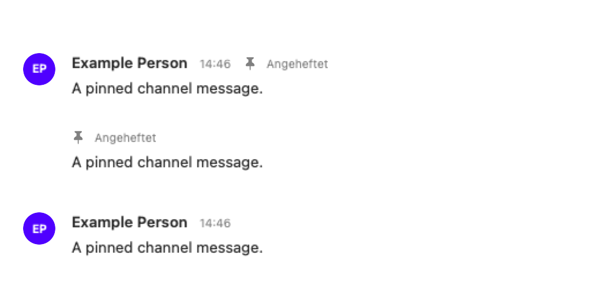
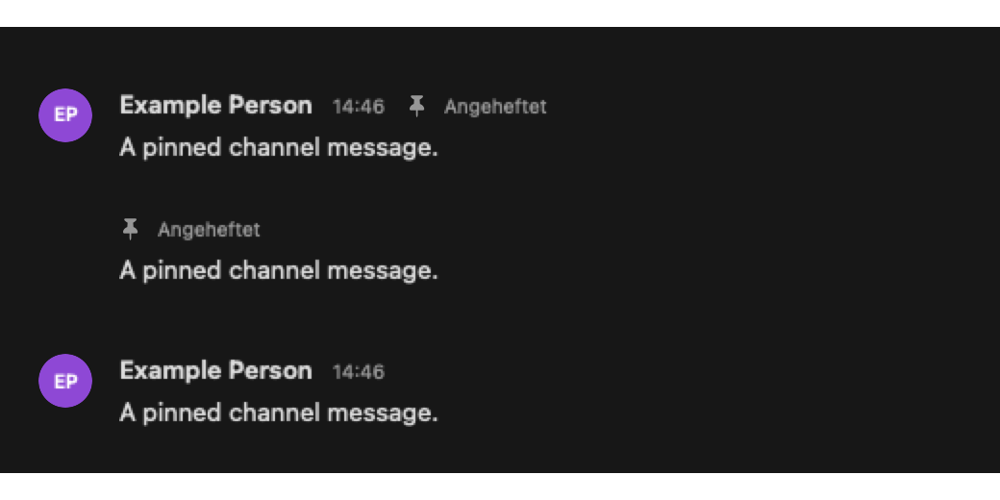
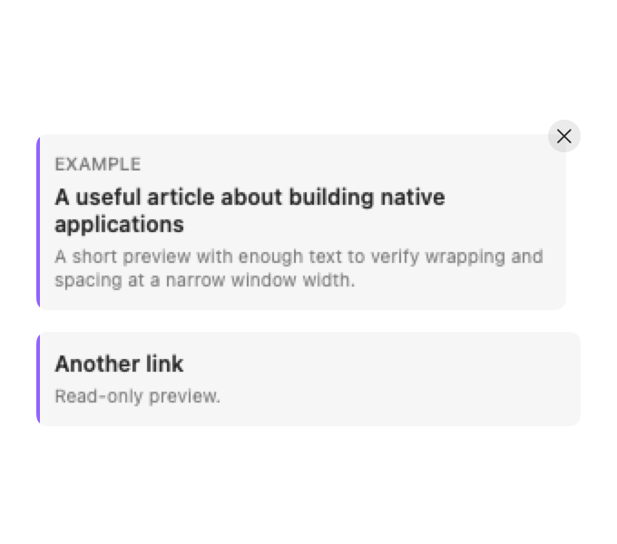
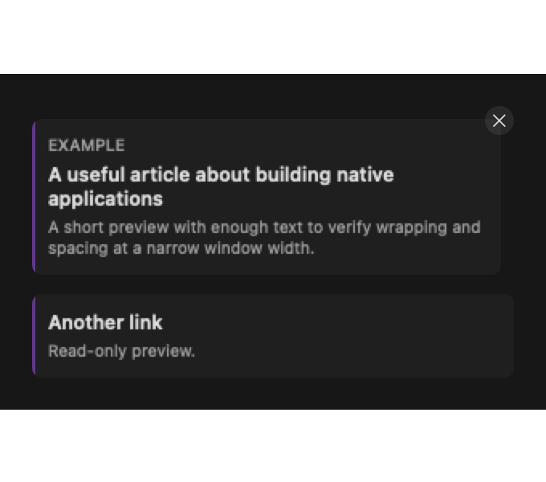
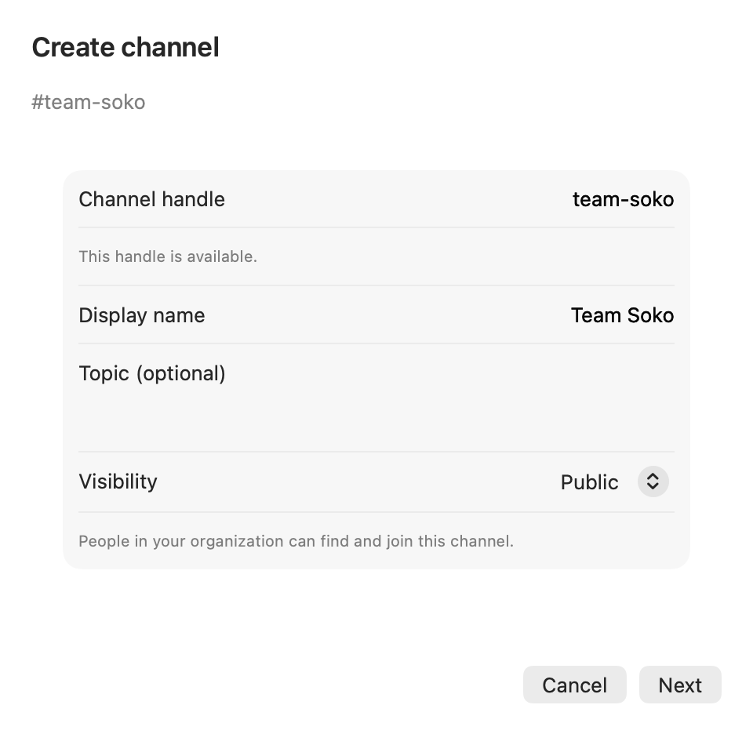
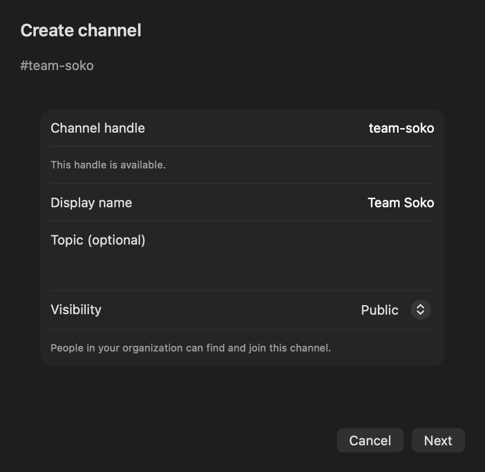
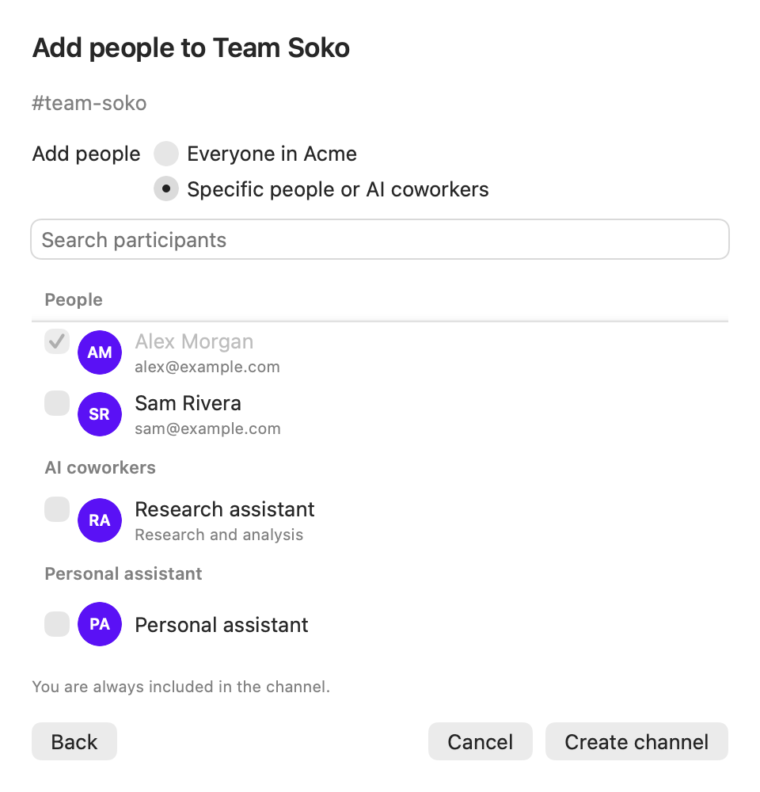
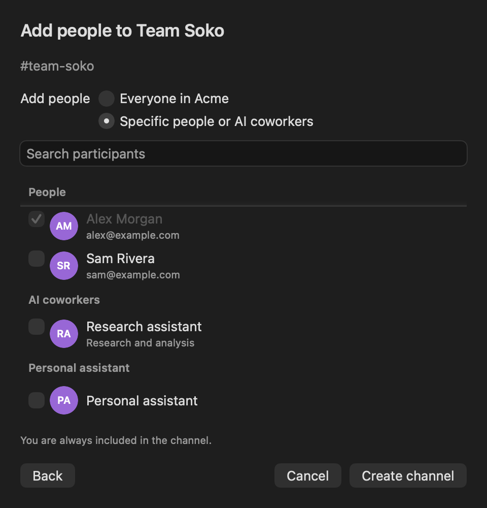

# Apple chat parity

## Parity source of truth

Current web behavior takes precedence when older requirements or this document differ (user decision, 2026-09-16). Inspect the current web implementation, update the affected requirements and source references here, and proceed without asking the user to choose between stale requirements and current web. Preserve the authorized chat scope and native Apple controls, including List. Ask only when current web behavior itself is unclear, a required API is absent, or a change needs separate contract/dependency approval. A requirements update does not establish implementation or verification completion.

## Resume checkpoint

- Room search merged as [#4612](https://github.com/masumi-network/sokosumi/pull/4612). Final CI on `a0c4a223d8034c6ac017a107cf3226b96dc7c6e0` passed: macOS build, app tests, all five Swift package suites, strict lint/format, and repository checks. The user confirmed search works; the subsequent loading-indicator adjustment reserves a trailing column and was visually checked in light/dark at minimum inspector width. Existing signed-app and pagination evidence remains below.
- Shared read-budget cooldown (07b) merged as [#4614](https://github.com/masumi-network/sokosumi/pull/4614). Final CI on `a5c6fb210edb689ec573ce4f0cfbe7721d19fd19` passed: macOS build, app tests, all five Swift package suites, strict lint and format. Review follow-ups fixed full-window jitter, added nonzero-jitter coverage, hoisted the operation allowlist, and corrected this checkpoint.
- Quick reactions (20b) merged as [#4620](https://github.com/masumi-network/sokosumi/pull/4620). Final Apple CI on `69655da539216a68a0fe197bc645c1503101a382` passed build, app tests, all five package suites, and strict lint/format. Review fixed add-only history recording and selected accessibility traits; the toolbar-level popover anchor and unverified physical keyboard/hover checks remain documented.
- Thread-preview parity (24a) merged in [#4629](https://github.com/masumi-network/sokosumi/pull/4629). Final head `b181163ee351606cc20704227cf34f87553fe7cd` passed all CI checks, including macOS build/app tests, all five package suites and strict lint/format. Slice 25 merged in [#4630](https://github.com/masumi-network/sokosumi/pull/4630). Review follow-up `190929829` passed all CI checks; the final merged head was `da4c676c44e22c4b5d0a55195c7075b0db4335e3`. Slice 26 merged in [#4640](https://github.com/masumi-network/sokosumi/pull/4640). Final head `3f7a4f427c23bbe6d16d5dc9794acd429498c2d7` passed all CI checks, including macOS build, app tests, all five package suites and lint/format. External universal links remain deferred by user approval.

- Full source/history audit refreshed on 2026-09-15 against `origin/main` at `808245bf311218a20972a0ccedace602ce5b13c5`. This is a source/history audit, not a fresh visual acceptance or test run. Earlier implementation evidence remains in the linked PRs and Git history. The later thread-overview comparison includes `origin/main` at `29eee6c67ad1891c93af84ea2f1a2b2c44e71da1`, including the device-local time-format preference in #4618; it does not replace the full audit baseline.
- [#4577](https://github.com/masumi-network/sokosumi/pull/4577) merged: automatic older-reply pagination, reading-position corrections and opaque composer padding. The user visually accepted the composer edge fix. The latest report is a console warning without visible stutter; the unresolved [scroll geometry warning](docs/scroll-geometry-warning.md) remains tracked separately.
- [#4602](https://github.com/masumi-network/sokosumi/pull/4602) merged: app and app tests use Swift 6 language mode under Xcode 27 / Swift 6.4. All five package suites (489 tests), app tests, strict SwiftLint, SwiftFormat and CI passed for that change. Targets and dependencies did not change. See [SDK audit](docs/swift6-migration.md).
- Start Direct (27) merged in [#4665](https://github.com/masumi-network/sokosumi/pull/4665). Final head `22698678e04e944cac27b3614964083a71733fde` passed all CI checks, including macOS build/app tests, all five package suites and uncached Swift lint/format. The recipient picker retains native List with compact row insets; search prompts and submission follow-ups are included.
- Xcode recommended settings (27a) merged in [#4668](https://github.com/masumi-network/sokosumi/pull/4668), final head `b91f157e202f7967a2482503d24d8e8a1ac38dec`; all CI checks pass. User-applied stripping, team inheritance and catalog-symbol settings are preserved; local Release build, full app tests, and iOS 17 package build passed.
- Unified toolbar New chat (27b) merged in [#4669](https://github.com/masumi-network/sokosumi/pull/4669), final head `408bbc8905abc11701fedff9891e9b533946d073`; all CI checks pass, including the review follow-up.
- Browse channels (30) merged in [#4677](https://github.com/masumi-network/sokosumi/pull/4677), final head `990dabee3441ac5b0d856e89a430e6f021f82450`; all required CI checks passed, including app tests, five package suites and strict lint/format.
- Room details/roster (31) merged in [#4686](https://github.com/masumi-network/sokosumi/pull/4686). Final head `ace91a38b4cb0bb9536e1743053b9b30c9c924f3` passed all CI checks, including app build/tests, five package suites and strict lint/format (Apple run `35148812199`). Review polish added Close help and removed the duplicate Members heading.
- Channel settings/membership editing (32) merged in [#4699](https://github.com/masumi-network/sokosumi/pull/4699), final head `90843f878c0384976b5010cdf21db1330217572a`; all Apple CI checks passed (Xcode build/app tests, five package suites, Swift lint/format).
- Leave/archive/restore/delete channels (33) merged in [#4712](https://github.com/masumi-network/sokosumi/pull/4712). Final head `2c1857e0b` (merge `43d3e3ade`) passed all 24 CI checks, including macOS build/app tests, five package suites and strict lint/format.
- External chat invitations (34) merged in [#4717](https://github.com/masumi-network/sokosumi/pull/4717). Final head `2a4c44c` (merge `d84cddefe`) passed all 24 CI checks, including macOS build/app tests, five package suites and strict lint/format. Two review follow-ups (Escape closes without declining; "Open channel" re-lists only a missing room) are recorded in the slice 34 notes.
- Room guest access (35) merged in [#4726](https://github.com/masumi-network/sokosumi/pull/4726). Final head `b142274` (merge `132376a62`) passed all 24 CI checks, including macOS build/app tests, five package suites and strict lint/format. The review follow-up asserted guest-link expiry through the middleware and shows the copy notice beside errors.
- Participant presence (36) merged in [#4733](https://github.com/masumi-network/sokosumi/pull/4733). Final head `f9c386914` (merge `29fe3e188`) passed all CI checks, including macOS build/app tests, five package suites and strict lint/format. The review follow-up `f8ca2d678` is recorded in the slice 36 notes.
- Coworker mention execution status (37) merged in [#4741](https://github.com/masumi-network/sokosumi/pull/4741) (squash `a58e7fb1f`, final head `a84b3ecf0` after merging main; last code commit `11b414555`). All CI checks passed, including macOS build/app tests, five package suites and strict lint/format. The review follow-up `11b414555` and the merge with main's send-to-self (`752432daa`) are recorded in the slice 37 notes.
- Soko Bot chat (38) merged in [#4745](https://github.com/masumi-network/sokosumi/pull/4745) (squash `09f7531f6`, final head `b5ce64282` after merging main; last code commit `88db7ecd2`). All CI checks passed (24 passed, 3 skipped), including macOS build/app tests, five package suites and strict lint/format. The review follow-up `88db7ecd2` is recorded in the slice 38 notes. The compiler-warning cleanup merged separately in [#4754](https://github.com/masumi-network/sokosumi/pull/4754); hand-written Apple code builds without warnings.
- Minimal Settings (39) merged in [#4762](https://github.com/masumi-network/sokosumi/pull/4762). Final head `fda06b24a` (merge `8890ecc28`) passed all CI checks, including macOS build/app tests, five package suites and strict lint/format. The review follow-ups `c7f07b894` and `fda06b24a` are recorded in the slice 39 notes.
- Chat notifications while the app runs (40) merged in [#4771](https://github.com/masumi-network/sokosumi/pull/4771). Final head `b6a17ff1f` (branch head `4c45148aa` after merging main, merge `ff56ac42c`) passed all CI checks (24 passed, 3 skipped), including macOS build/app tests, five package suites and strict lint/format. The review follow-ups `ac4eb5445` and `b6a17ff1f` are recorded in the slice 40 notes. External universal links remain deferred (25a).
- Pending reactions (20c) merged in [#4778](https://github.com/masumi-network/sokosumi/pull/4778), squash `0e6cec0a9`, final branch head `abc65365e`; all CI checks passed. Review follow-up `fbe1a957d` makes reaction chips follow the live overlay instead of the last `PreparedTranscript` snapshot, so a tap shows before the markdown prepare and a second tap cannot invert last-tap-wins.
- Pinned sidebar section (26a) merged in [#4785](https://github.com/masumi-network/sokosumi/pull/4785), squash `07dab03dc`, final branch head `46c462fe8`; all CI checks passed (23 passed, 3 skipped). Review follow-up `524a76a56` reworded the #4764 delta entry; the empty reorder-mode context menu and the 401 test scope were kept with reasons on the PR. Live drag through `onMove`, the handle menu by keyboard and VoiceOver, a real failure alert and Core's lenient `PUT` against production remain unverified.
- Web delta audit on 2026-09-18 covered `origin/main` from `29eee6c67ad1891c93af84ea2f1a2b2c44e71da1` to `1769c4ac2dee588fc7d00ba4cbc2ce050bc4b70f` (section "Web delta audit — 2026-09-18"). It added five Todo rows and changed no existing status: 05a (open-room attention), 12c (code block toggles off), 22a (link preview survives a failed image), 24b (mute a thread; needs the two deployed `…/threads/{parentMessageId}/mute` operations selected into the snapshot) and 27c (Message yourself). Row 17a still reads In review although [#4797](https://github.com/masumi-network/sokosumi/pull/4797) merged as `f7cea7fa1`; its status update belongs to that row's own follow-up.
- **Handover, 2026-09-19.** `origin/main` is `e1c9859c3`; `apps/apple` is warning-free in hand-written code, tests run on the `Sokosumi` workspace scheme with coverage on, and no Apple PR is open. The full feature audit above added 20 Todo rows and corrected seven stale records.
- **Work order.** Take the earliest row whose status is exactly `Todo` and whose dependencies are Done or Merged. That order is: **26b**, 13a, 21a, 23a, 12d, 05a, 12c, 22a, 04a, 10c, 18a, 24b, 24c, 09c, 06a, 14a, 15a, 29a, 31a, 32a, 07c, 07d, 27c, 41. The earlier entries are single-file changes; 07c, 24c and 31a are the largest. **19a is `Blocked`** pending the user's decision, so the Todo scan skips it by status.
- **Ground rules for whoever takes this.** One vertical slice per PR: portable model and networking in `Packages/`, native SwiftUI in the app, tests at the transport/state boundary, light and dark fixtures inspected. Current web wins over stale requirement text — update the row and say so in the PR. Never touch `apps/web` or `apps/core`; no Core contract, dependency or pinned-tool change; never hand-edit generated files (select existing operations with `scripts/update-core-api.py` against a fresh `https://api.sokosumi.com/v1/openapi.json` and record the structural diff). Do not file Linear issues. Stop and ask when web is ambiguous, an API or Ably capability is missing, or a project/entitlement change would be needed. Done means: five package suites, app tests (`-enableCodeCoverage NO`), strict SwiftLint/SwiftFormat, the iOS 17 Workspace build and the macOS build all pass; this file updated with evidence and the PR link; one draft PR whose title is the commit subject.
- **Loop command** (self-paced; runs only while that session is open): `/loop follow the Iteration loop in apps/apple/VISION.md. Each tick: fetch main and read apps/apple/PARITY.md. (1) If an Apple parity PR from this loop is open, babysit it: fix CI (re-run a job only when the log shows an infrastructure flake), resolve conflicts by merging main (regenerate openapi.json with scripts/update-core-api.py, never hand-merge it), answer each review once with technical reasoning, push valid fixes, never re-request review. (2) If none is open, dispatch one fresh general-purpose subagent for the earliest row whose status is exactly "Todo" and whose dependencies are Done or Merged, end to end per VISION.md and AGENTS.md; its PR also marks the previous row Done. Tell the subagent not to stop while waiting on its own background commands. (3) If no Todo row remains, open one docs PR marking the last row Done, then stop. Notify me when a PR is up and when its CI is green. Stop and ask if a PR is closed unmerged, web is ambiguous, an API or Ably capability is missing, a project/entitlement/dependency change would be needed, or git signing or fetch fails.`
- **Not closable by source.** Rows Partial (10, 11, 12a), Merged with live acceptance pending (15, 16, 24, 26) and the unverified interactions recorded for 20c, 26a, 36, 37, 38, 39 and 40 all need a person to run the signed app. Deferred by the user: 10b, 25a, 28.
- Preserve unconfirmed acceptance: rich rendering in light appearance/live streaming (10), draft restoration (11), system Emoji & Symbols picker (12a), live upload/send (14), media/export/text preview (15), and Files selection/send (16). Source inspection does not close these gaps. Do not recreate the deleted polling automation or leave agent-launched test apps running.

## Web delta audit — 2026-09-15

Compared chat source and history since the original 2026-09-09 baseline. Existing Done rows retain their merged scope; newly discovered deltas have explicit follow-ups or verification notes below. Web implementation choices such as TanStack Virtual are not native requirements.

| Change / source | Apple disposition |
| --- | --- |
| Search header expansion, Cmd/Ctrl-F, 250 ms debounce, 50 results, two-line previews, keyboard selection and reply-aware jumps: [search panel](<../web/src/app/(app)/chat/components/room-search-panel.tsx>), [jump behavior](<../web/src/app/(app)/chat/utils/room-search-jump.ts>) | Row 23 updated. Current web has neither result pagination nor query-term highlighting. The landed message highlight is still required. |
| Shared read-budget cooldown: [throttle](<../web/src/lib/chat/chat-read-throttle.ts>), [scheduler](<../web/src/components/chat/use-chat-refresh-scheduler.ts>) ([#4552](https://github.com/masumi-network/sokosumi/pull/4552)) | Audit gap closed by 07b, merged in [#4614](https://github.com/masumi-network/sokosumi/pull/4614): shared HTTP read cooldown preserves retry timing while realtime delivery stays live. |
| Frequent/default one-tap toolbar reactions: [resolver](<../web/src/app/(app)/chat/utils/quick-reactions.ts>), [message row](<../web/src/app/(app)/chat/components/room-message-row.tsx>) ([#4593](https://github.com/masumi-network/sokosumi/pull/4593)) | Audit gap closed by 20b, merged in [#4620](https://github.com/masumi-network/sokosumi/pull/4620): toolbar shortcuts reuse the existing reaction action and frequent history. |
| Virtualized room/thread transcripts, 30-row jump windows, explicit history gaps, jump-to-latest and follow behavior during resize: [viewport](<../web/src/app/(app)/chat/components/transcript-viewport.tsx>), [model](<../web/src/app/(app)/chat/utils/transcript-viewport-model.ts>) | Native equivalents exist in RoomTimeline/room and thread views through #4549, #4576 and #4577. Keep the native list architecture. Re-verify initial positioning, older-page insertion, reader position during image growth and latest-follow on each related change; warning remains open. |
| Expansion persistence, pinned note, common hover/deep-link bounds ([#4558](https://github.com/masumi-network/sokosumi/pull/4558), [#4559](https://github.com/masumi-network/sokosumi/pull/4559)) | Already addressed by #4560/#4566; retain user-accepted complete-line clipping and composer boundary details. Do not reopen them solely because web internals changed. |
| Unfurl image aspect ratio under the height cap ([#4599](https://github.com/masumi-network/sokosumi/pull/4599)) | Apple [MessageImageView](Sokosumi/Chat/Rendering/MessageImageView.swift) already uses aspect ratio and scaled-to-fit images within maximum bounds. Row 22 needs tall/wide image visual comparison; no new renderer is justified by this audit. |
| Stable human mention IDs/email subtitles, localized Everyone, notification name resolution and participant-card refinements | Identity migration already merged in #4406. Keep notification presentation in 40 and participant/presence details in 31/36; recheck current web presentation when implementing those rows. |
| Unread thread attention on the room header ([#4441](https://github.com/masumi-network/sokosumi/pull/4441)) | Include in thread overview (24), distinct from already implemented reply thread reading (08). |
| Device-local Auto/12-hour/24-hour time preference merged in [#4618](https://github.com/masumi-network/sokosumi/pull/4618), [time-format.ts](<../web/src/i18n/time-format.ts>) | Implemented in Settings (39) as a per-install `UserDefaults` preference. Web stores browser cookies; this is not an account-synced Core contract. Auto keeps native system formatting. |
| Web's `resolveRoomAttention` no longer suppresses bold/badge/count on the open room since [#4441](https://github.com/masumi-network/sokosumi/pull/4441) (the chrome follows the unread state alone), while the Chat display copy still says "the chat you have open stay quiet" | Apple's `resolveRoomAttention` still takes `isActive` (row 05, ADR 0026), which matches the Settings copy. Row 39 adds the count inside that existing rule and does not change row 05; revisit with row 05 if the open-room chrome should follow web. |
| Soko Bot mention shells: Core mirrors capability labels into the thinking placeholder and keeps a failed shell ([soko-bot-chat.service.ts](../core/src/services/soko-bot-chat.service.ts)), but web's display merge keeps bodiless shells only for coworker senders ([merge-room-messages.ts](<../web/src/app/(app)/chat/utils/merge-room-messages.ts>)) and resolves the Thought view for coworkers only ([room-message-row.tsx](<../web/src/app/(app)/chat/components/room-message-row.tsx>)) | Row 38 follows current web: Apple hides bodiless Soko Bot shells and renders no Thought for the assistant. Whether web should show the assistant's progress and failure is a web decision; nothing is fabricated natively. |
| Pinned sidebar section with reorderable rooms ([#4764](https://github.com/masumi-network/sokosumi/pull/4764), audited 2026-09-18 at `0e6cec0a9`): [partition](<../web/src/components/chat/partition-rooms-for-sidebar.ts>), [pinned sort](<../web/src/components/chat/chat-room-activity-sort.ts>), [list](<../web/src/components/chat/organization-chat-list.client.tsx>) | Closed by slice 26a ([#4785](https://github.com/masumi-network/sokosumi/pull/4785)): Pinned section above Channels, `starredAt`-only order, reorder mode, the selected `PUT /chats/rooms/starred`, and no per-row pin glyph. Before it, [SidebarRooms.swift](Packages/SokosumiChat/Sources/SokosumiChat/SidebarRooms.swift) listed pins inline and ranked public before private ahead of `starredAt`, so a web reorder showed on Apple only within one section and one discoverability rank. Rows 03 and 26 keep their merged scope. |
| Core outage distinguished from logout ([#4365](https://github.com/masumi-network/sokosumi/pull/4365)) — **closed by the 2026-09-19 audit**: `OAuthSession.swift:150-158` clears the Keychain only on `invalid_grant`; network and 5xx keep the tokens and rethrow, and `signOutIfUnauthorized` fires on a Core 401 alone. | Auth uses a different native OAuth boundary. Verify transient Core/refresh failures preserve recoverable session state before closing auth maintenance; this audit does not establish a native defect. |

The GraphQL/LESS prerequisite and native highlighter are merged (#4382/#4384); [grammar provenance](docs/graphql-less-grammars.md) remains authoritative. Detailed slice notes below retain historical implementation evidence; this checkpoint and the delta table take precedence over their dated next-step or pending-CI statements.

## Web delta audit — 2026-09-18

Audited `origin/main` from `29eee6c67ad1891c93af84ea2f1a2b2c44e71da1` (the 2026-09-15 comparison head) to `1769c4ac2dee588fc7d00ba4cbc2ce050bc4b70f`. Candidates came from `git log` over the web chat routes and components, `lib/ably`, `lib/chat`, the account pages, Core's chat and notification routes and `packages/utils`; each user-facing change was read in its PR description and, where unclear, its diff, then checked against the Apple source named in the disposition. This is a source/history audit: no app was run, no test suite was executed, and no existing row changed status. Pure tests, refactors, admin, tasks, calendar, Drive and Soko Bot console work were skipped.

| Change / source | Apple disposition |
| --- | --- |
| Private self-direct notes ([#4711](https://github.com/masumi-network/sokosumi/pull/4711)): Message yourself in the picker, **You** label and own avatar, private-notes empty state, `ChatRoom.isSelfDirect`: [create-direct-dialog.tsx](<../web/src/app/(app)/chat/components/create-direct-dialog.tsx>), [room-helpers.ts](<../web/src/app/(app)/chat/components/room-helpers.ts>) | [ChatRecipientRoster.swift](Packages/SokosumiChat/Sources/SokosumiChat/ChatRecipientRoster.swift) filters the reader out of the picker, [SidebarRooms.swift](Packages/SokosumiChat/Sources/SokosumiChat/SidebarRooms.swift) names the room after the reader and leaves the avatar stack empty, and [RoomTimelineView.swift](Sokosumi/Chat/Timeline/RoomTimelineView.swift) has only the generic empty state. Apple reads `isSelfDirect` only to drop the presence mark ([ConversationSidebarView.swift](Sokosumi/Chat/Sidebar/ConversationSidebarView.swift)) and to hide Send to yourself. New row 27c |
| Send to yourself ([#4735](https://github.com/masumi-network/sokosumi/pull/4735)): message action quoting into the Self Direct, confirmation with Open, cross-room quote card opens the Message link | The Apple half shipped in the same PR and had no PARITY row: [WorkspaceState+SendToSelf.swift](Packages/SokosumiWorkspace/Sources/SokosumiWorkspace/WorkspaceState+SendToSelf.swift) (same eligibility as Copy link, hidden inside the Self Direct, re-lists rooms before Open), [ChatService+SendToSelf.swift](Packages/SokosumiChat/Sources/SokosumiChat/ChatService+SendToSelf.swift), the "Sent to yourself" alert and `quoteSourceURL` routing in [MessageRowView.swift](Sokosumi/Chat/Timeline/MessageRowView.swift); `POST …/send-to-self` is in the snapshot and deployed. Web confirms with a toast, Apple with an alert. Matches |
| Mute a thread ([#4680](https://github.com/masumi-network/sokosumi/pull/4680)): panel toggle, muted glyph in the thread list, Core unread/notification gates: [thread-mute-button.tsx](<../web/src/app/(app)/chat/components/thread-mute-button.tsx>) | No Apple source reads or writes a thread's `mutedAt` (only room mute in [ConversationSidebar.swift](Packages/SokosumiChat/Sources/SokosumiChat/ConversationSidebar.swift)); the snapshot has `ChatRoomThread.mutedAt` but not the two mute operations. Core's unread and notification gates already apply to Apple readers who mute on web. New row 24b |
| Pending reactions and idempotent reaction routes ([#4715](https://github.com/masumi-network/sokosumi/pull/4715)) | Closed by 20c ([#4778](https://github.com/masumi-network/sokosumi/pull/4778)): [PendingReactions.swift](Packages/SokosumiChat/Sources/SokosumiChat/PendingReactions.swift), [WorkspaceState+Reactions.swift](Packages/SokosumiWorkspace/Sources/SokosumiWorkspace/WorkspaceState+Reactions.swift); `PUT`/`DELETE …/reactions/{emoji}` are in the snapshot. Matches |
| Copy message link ([#4721](https://github.com/masumi-network/sokosumi/pull/4721)): `/chat/rooms/{roomId}?message={messageId}` on the web origin, offered on durable messages only: [notification-href.ts](<../web/src/lib/utils/notification-href.ts>), [room-message-row.tsx](<../web/src/app/(app)/chat/components/room-message-row.tsx>) | [ChatLink.swift](Packages/SokosumiChat/Sources/SokosumiChat/ChatLink.swift) `href` builds the same path and `message` query on `CoreSettings.webBaseURL`; `canCopyMessageLink` in [MessageRowView.swift](Sokosumi/Chat/Timeline/MessageRowView.swift) excludes deleted, local outbound, stream-overlay and thinking-shell rows, which is web's `isDurableRoomMessage` (web also excludes the row being edited; Apple edits in the composer, so the row stays durable). Offered in More, the context menu and as an accessibility action; Copy text stays web's touch-sheet-only item. Matches |
| Chat markdown quotes render after send ([#4723](https://github.com/masumi-network/sokosumi/pull/4723)): [sanitizeMarkdown.ts](<../web/src/lib/utils/sanitizeMarkdown.ts>) | The defect was web's HTML sanitizer encoding `>`. Apple parses the stored markdown with swift-markdown ([MessageMarkdown.swift](Packages/SokosumiChat/Sources/SokosumiChat/MessageMarkdown.swift)) and draws a left bar with secondary text in [MessageMarkdownView.swift](Sokosumi/Chat/Rendering/MessageMarkdownView.swift). Row 10 keeps its Partial status. Matches |
| Attachments in coworker Directs ([#4720](https://github.com/masumi-network/sokosumi/pull/4720)) and coworker stream attachments as `file` parts ([#4725](https://github.com/masumi-network/sokosumi/pull/4725)) | Both PRs carried their Apple half: `canAttachFiles` in [WorkspaceState+Attachments.swift](Packages/SokosumiWorkspace/Sources/SokosumiWorkspace/WorkspaceState+Attachments.swift) no longer excludes the stream room and `startDirectStream` in [ChatService+Streaming.swift](Packages/SokosumiChat/Sources/SokosumiChat/ChatService+Streaming.swift) sends the same `file` parts, skipping attachments without a media type; Drive picks stay link-only on both sides (row 16 unchanged). A live coworker answer about an image remains unverified on both platforms. Matches |
| Failed coworker mention shells stay in the transcript ([#4738](https://github.com/masumi-network/sokosumi/pull/4738)) | Closed by 37 ([#4741](https://github.com/masumi-network/sokosumi/pull/4741)): [CoworkerMentionShell.swift](Packages/SokosumiChat/Sources/SokosumiChat/CoworkerMentionShell.swift). Matches |
| Soko Bot thinking and failed shells hidden for bot senders (recorded by slice 38 in the 2026-09-15 table) | Unchanged on web at the audited head ([merge-room-messages.ts](<../web/src/app/(app)/chat/utils/merge-room-messages.ts>)); Apple keeps following web and fabricates nothing. No row. Matches |
| Room row trailing hole only when something is in it ([#4742](https://github.com/masumi-network/sokosumi/pull/4742), with [#4719](https://github.com/masumi-network/sokosumi/pull/4719), [#4734](https://github.com/masumi-network/sokosumi/pull/4734)) and mention badge crossfading with the room menu ([#4781](https://github.com/masumi-network/sokosumi/pull/4781)): [chat-room-sidebar-row.tsx](<../web/src/components/chat/chat-room-sidebar-row.tsx>) | These stop a hover-revealed `…` button from re-truncating the name. Apple's row in [ConversationSidebarView.swift](Sokosumi/Chat/Sidebar/ConversationSidebarView.swift) has no hover-revealed button; actions live in the native context menu, so the name never reflows and the badge never hides. The mention count is the native List `.badge`, which stays in place and is announced by the system. Web-only presentation |
| Pinned sidebar section ([#4764](https://github.com/masumi-network/sokosumi/pull/4764), [#4779](https://github.com/masumi-network/sokosumi/pull/4779)) | Closed by 26a ([#4785](https://github.com/masumi-network/sokosumi/pull/4785)): [SidebarRooms.swift](Packages/SokosumiChat/Sources/SokosumiChat/SidebarRooms.swift), [ConversationSidebar.swift](Packages/SokosumiChat/Sources/SokosumiChat/ConversationSidebar.swift); `PUT /chats/rooms/starred` is in the snapshot. Matches |
| Pasted Message link becomes the pending quote ([#4783](https://github.com/masumi-network/sokosumi/pull/4783), merged `b01ee8fee`) | Apple half merged as [#4797](https://github.com/masumi-network/sokosumi/pull/4797) (`f7cea7fa1`): [MessageLinkQuote.swift](Packages/SokosumiChat/Sources/SokosumiChat/MessageLinkQuote.swift), [WorkspaceState+MessageLinkQuote.swift](Packages/SokosumiWorkspace/Sources/SokosumiWorkspace/WorkspaceState+MessageLinkQuote.swift), paste entry in [MacComposerTextInput.swift](Sokosumi/Chat/Composer/MacComposerTextInput.swift). Row 17a still reads In review; this audit changes no status. Matches |
| Composer code block keeps its text and toggles off ([#4794](https://github.com/masumi-network/sokosumi/pull/4794)): [composer-wysiwyg-code-block.ts](<../web/src/lib/utils/composer-wysiwyg-code-block.ts>) | The lost-text and collapsed-block bugs are contentEditable defects with no Apple counterpart (`codeBlockRetainsLiteralCharacters` covers the fence). The toggle-off is real: [ComposerBlockFormat.swift](Packages/SokosumiChat/Sources/SokosumiChat/ComposerBlockFormat.swift) unwraps Quote and lists but always wraps `.codeBlock`. What the button does inside an existing block at runtime was not exercised. New row 12c |
| Link preview card degrades to text when its image fails; Core snapshots preview images into Blob and adds X oEmbed text ([#4667](https://github.com/masumi-network/sokosumi/pull/4667), with [#4639](https://github.com/masumi-network/sokosumi/pull/4639), [#4676](https://github.com/masumi-network/sokosumi/pull/4676)) | [MessageUnfurlView.swift](Sokosumi/Chat/Rendering/MessageUnfurlView.swift) still hides a card that has no description once its image fails or is absent, web's pre-#4667 rule. The Blob `imageUrl` needs no client change; image alignment and row-height estimates are web layout. New row 22a |
| Open-room attention: `resolveRoomAttention` without the open-room rule ([#4441](https://github.com/masumi-network/sokosumi/pull/4441), recorded by slice 39): [room-attention.ts](<../web/src/components/chat/room-attention.ts>) | Re-verified at the audited head: web's resolver has no `isActive`, Apple's in [SidebarRooms.swift](Packages/SokosumiChat/Sources/SokosumiChat/SidebarRooms.swift) still returns no attention for it, called from [ConversationSidebarView.swift](Sokosumi/Chat/Sidebar/ConversationSidebarView.swift). This is user-visible (leftover thread unread on the open room) and the parity rule says current web wins, so it gets a row now; Mark unread being disabled on the open room already matches. New row 05a |
| Banner replaced by a newer message re-alerts ([#4789](https://github.com/masumi-network/sokosumi/pull/4789), merged `526900352`): `renotify: true` unless the standing banner at that room tag has the same notification id (the push catching up with the page's own banner): [notification-service-worker.ts](<../web/src/lib/utils/notification-service-worker.ts>), [ably-push-sw.js](../web/public/ably-push-sw.js) | [ChatNotificationCenter.swift](Sokosumi/Notifications/ChatNotificationCenter.swift) requests `.alert` only, sets no sound and re-adds the request under the room identifier; slice 40 recorded "banners are silent" as a native adaptation, so there is no first alert sound for a replacement to repeat, and Apple has one banner source, so web's same-id catch-up case cannot occur ([ChatNotificationBanners.swift](Packages/SokosumiChat/Sources/SokosumiChat/ChatNotificationBanners.swift)). `renotify` is a Web Notifications flag. Whether macOS visibly re-presents a same-identifier replacement was not determined from source and stays in slice 40's unverified list. Out of scope (banner sound is a recorded native exclusion; revisit only if the user wants audible banners) |
| Notification Center work: one list with per-row read/unread ([#4651](https://github.com/masumi-network/sokosumi/pull/4651), [#4623](https://github.com/masumi-network/sokosumi/pull/4623), [#4624](https://github.com/masumi-network/sokosumi/pull/4624), [#4627](https://github.com/masumi-network/sokosumi/pull/4627)), Unread and Needs you views ([#4670](https://github.com/masumi-network/sokosumi/pull/4670), [#4687](https://github.com/masumi-network/sokosumi/pull/4687)), remembered view ([#4782](https://github.com/masumi-network/sokosumi/pull/4782)), day-later reminder ([#4628](https://github.com/masumi-network/sokosumi/pull/4628)), read route fold ([#4685](https://github.com/masumi-network/sokosumi/pull/4685)) | PARITY excludes the Notification Center. Checked the one seam that reaches Apple: `PATCH /notifications/{id}/unread` republishes the row with `osBanner: false`, which [ChatNotificationBanners.swift](Packages/SokosumiChat/Sources/SokosumiChat/ChatNotificationBanners.swift) ignores, and Apple's `PATCH /notifications/{id}/read` is still deployed. Out of scope (Notification Center; no inbox on Apple) |
| Brand primary moves from `#6400FF` to `#2B5C78` ([#4673](https://github.com/masumi-network/sokosumi/pull/4673)) and the token/border passes ([#4443](https://github.com/masumi-network/sokosumi/pull/4443), [#4451](https://github.com/masumi-network/sokosumi/pull/4451)) | [AccentColor.colorset](Sokosumi/Assets.xcassets/AccentColor.colorset) still holds the old web purple (`#6400FF` light, `#A164DD` dark). Not a chat behavior and not decided here; raise it with the user if the native accent should follow the brand. Out of scope (brand palette, not chat parity) |
| Core-only changes: blobs deleted on message tombstone ([#4707](https://github.com/masumi-network/sokosumi/pull/4707)), stream POST access check outside a transaction ([#4786](https://github.com/masumi-network/sokosumi/pull/4786)), room mapper reuse ([#4708](https://github.com/masumi-network/sokosumi/pull/4708)), recipient schemas exposed ([#4658](https://github.com/masumi-network/sokosumi/pull/4658), [#4663](https://github.com/masumi-network/sokosumi/pull/4663)) | No DTO or client-visible behavior change; tombstones render as before (row 19). Matches |
| Web chrome, mobile web and virtualization: collapsed rail ([#4714](https://github.com/masumi-network/sokosumi/pull/4714), [#4718](https://github.com/masumi-network/sokosumi/pull/4718), [#4727](https://github.com/masumi-network/sokosumi/pull/4727), [#4736](https://github.com/masumi-network/sokosumi/pull/4736), [#4739](https://github.com/masumi-network/sokosumi/pull/4739), [#4746](https://github.com/masumi-network/sokosumi/pull/4746), [#4757](https://github.com/masumi-network/sokosumi/pull/4757), [#4761](https://github.com/masumi-network/sokosumi/pull/4761), [#4790](https://github.com/masumi-network/sokosumi/pull/4790)), hover action pill ([#4631](https://github.com/masumi-network/sokosumi/pull/4631), [#4773](https://github.com/masumi-network/sokosumi/pull/4773)), mobile keyboard, touch targets and iOS anchoring ([#4666](https://github.com/masumi-network/sokosumi/pull/4666), [#4768](https://github.com/masumi-network/sokosumi/pull/4768), [#4774](https://github.com/masumi-network/sokosumi/pull/4774), [#4775](https://github.com/masumi-network/sokosumi/pull/4775), [#4793](https://github.com/masumi-network/sokosumi/pull/4793)), row-height estimates ([#4758](https://github.com/masumi-network/sokosumi/pull/4758)), Soko Bot console chips ([#4776](https://github.com/masumi-network/sokosumi/pull/4776)) and beta chrome gate ([#4664](https://github.com/masumi-network/sokosumi/pull/4664)) | Native split view, List and context menus replace these; PARITY's Web-only concerns already cover responsive layout, hover gutters and DOM scrolling, and the assistant console is out of scope. Web-only presentation |

Five rows were added: 05a, 12c, 22a, 24b and 27c. Non-Done rows were checked for stale requirement text against current web: 10 (quotes already render natively), 11, 12a, 15, 16 (Drive picks stay link-only in the coworker stream), 26 (the Pinned section lives in 26a), 10b, 25a and 28 had no web change in this range that alters their text; 24 keeps its text and gains the muted-thread follow-up 24b, because a muted thread leaves the unread-first group through Core rather than through client sorting.

Not determined from source: whether macOS re-presents a banner when a request with the same identifier replaces it; what the Apple Code block button does at runtime with the caret inside an existing block (only the missing unwrap path is established); whether the selected List row keeps bold and badge legible once 05a lands; and live behavior of any route named above against production beyond its presence in the deployed OpenAPI document.

## Full feature audit — 2026-09-19

Not a commit delta: six read-only agents compared the **current** web chat implementation with the **current** Apple client feature by feature, at `origin/main` `e1c9859c3`, by area — A sidebar/navigation, B timeline/message row, C composer/sending, D threads/pins/search, E room details/membership/presence, F AI/realtime/notifications/settings. Each mismatch below cites both sides. Nothing was built or run; every finding is from source, and the per-area "not determined" notes are kept with their rows.

The audit deliberately skipped anything this document already records as a native adaptation, an open row, or out of scope. Web implementation choices (virtualization, dnd library, toasts vs alerts, CSS polish, collapsed rail, skeletons, PWA) remain non-requirements.

| Area | Mismatches | New rows |
| --- | --- | --- |
| A — sidebar, workspace, navigation | 3 | 26b, 29a; copy in 41 |
| B — timeline and message row | 11 | 04a, 10c, 15a, 19a; copy in 41 |
| C — composer and sending | 9 | 06a, 12d, 13a, 14a, 18a; copy in 41 |
| D — threads, pins, search | 6 | 21a, 23a, 24c; copy in 41 |
| E — room details, guests, presence | 6 | 31a, 32a; copy in 41 |
| F — AI, realtime, notifications, settings | 4 | 07c, 07d, 09c; copy in 41 |

Seven stale records were corrected in place rather than left to mislead: row 17a was still "In review" after [#4797](https://github.com/masumi-network/sokosumi/pull/4797) merged; row 19 still claims both clients keep tombstones; row 22a's "drop that gate" instruction overshoots what web changed; the slice 18 notes record Apple's Command-Return edit rule as parity when web has saved on Return since [#3966](https://github.com/masumi-network/sokosumi/pull/3966); the slice 30 note calls the sidebar collapse state persisted when neither client persists it; the slice 09a notes and its review-fix line describe a web live-thought rule that changed; and the 2026-09-15 "Core outage" verification is settled by `OAuthSession`, so it is closed. Two further notes are historical rather than wrong and were left alone: the slice 26 note still mentions the per-row pin glyph that 26a removed on both sides, and row 26's requirement text quotes the old "Mark unread" label (row 41 carries the fix).

**Row 19a is `Blocked`** — whether Apple follows current web and drops deleted rows, or web is fixed first. It is the only new row that cannot be started as written.

Area A found the sidebar close to parity: sections, partition, both sort orders, attention resolution, row menu rules, pin/mute exclusivity, the Pinned reorder gate, archived rules, invitations, create-channel validation, browse, the Direct picker and `ChatLink` parsing all match field for field. Areas B, D, E and F likewise verified long lists of matching behavior; those lists live in the per-area reports rather than here.

## Scope and audit baseline

Iteration 0 approved and merged in [PR #4303](https://github.com/masumi-network/sokosumi/pull/4303). Original audit covered web and Apple source at `85d85776deaa128a3d4177bb58b6545684e7c1ac` (2026-09-09). This document is the chat parity boundary for subsequent PRs. It expands the original tracer scope to the chat capabilities below, implementing the goal in [VISION.md](VISION.md) without authorizing unrelated web product screens.

Target macOS 26 now, iOS 17+ later. Use SwiftUI native navigation and controls. All models, networking, view models and persistence belong in platform-agnostic, UI-free packages. Shared packages target macOS 26 and iOS 17, per the baseline update requested after iteration 0. Shared code must remain available on iOS 17; verify this with an iOS 17 build. Newer Mac APIs belong only in Mac-specific views, guarded by platform/availability checks. Isolate unavoidable AppKit behind a Mac adapter. Do not add dependencies or change the shared API contract without a separate PR and explicit approval. Never modify `apps/web`.

“Conversation” includes channels, human/group Directs, coworker Directs and personal-assistant Directs exposed by web chat. “Reply thread” means replies under a parent message, not the whole conversation. Chat guest access and the existing Drive attachment picker are explicitly in scope. Linked non-chat destinations open on web; their native screens are not implied.

## Status and iteration rules

- **In progress**: approved slice is being implemented; verification or delivery remains incomplete. **Partial**: existing Apple implementation covers part of the row; complete parity and current build/test evidence are still required.
- **Merged**: implementation is merged but listed acceptance remains unverified. **Deferred**: explicitly postponed by the user.
- **In review**: implementation and verification recorded below; awaiting PR merge.
- **Todo**: no complete Apple slice found. **Blocked**: record a concrete ambiguity or missing API and ask the user before implementing. **Done**: merged PR, matching behavior, clean build and passing tests with new feature coverage recorded here. **N/A**: web-only concern.
- No capability is marked Done solely by the initial source audit. Existing tests are evidence of intent, not fresh execution results.
- Read in numeric order (09a before 09b); dependency IDs are prerequisites. Pick the earliest unimplemented row whose dependencies are available after rebasing on `main`, using the current checkpoint order for explicit follow-ups. Merged rows with pending manual acceptance do not block independent work; retain their verification gaps. Each row is a proposed feature slice, not a license to omit its sub-capabilities.
- One complete vertical slice (model, networking, view and tests) per PR. If a row contains genuinely independent features, record child IDs and dependencies here before splitting. Size alone is not a reason to split.
- Update the row with PR link, exact verification commands/results and remaining gaps. Describe feature, linked web sources, included/excluded behavior and how to test. Open draft by default.
- Iteration 0 must receive user approval before implementation. Later iterations wait for merge; poll `gh pr view --json state,reviews`, read review comments and address valid findings; do not request a new review in the review response. If closed unmerged, stop and ask. No next slice before merge.

## Dependency-ordered capability inventory

Source links are relative to this file. The shared web service boundary is [chat-room.service.ts](<../web/src/lib/services/chat-room.service.ts>); chat mutations are in [actions.ts](<../web/src/app/(app)/chat/actions.ts>). Check their Core calls before each slice rather than porting web server actions into Swift.

| ID | User-facing capability / acceptance scope | Depends on | Status | Web source files |
| --- | --- | --- | --- | --- |
| 01 | Sign in through system-browser OAuth; cancellation, errors, restore session, refresh/revocation, sign out. Move session state and persistence into portable packages; isolate the presentation adapter. | — | Done — [#4304](https://github.com/masumi-network/sokosumi/pull/4304) | [form.tsx](<../web/src/app/(auth)/signin/components/form.tsx>), [page.tsx](<../web/src/app/auth/callback/signin/page.tsx>) |
| 02 | Workspace access gate, personal/org selection and restoration, unseated chat access, workspace switch with isolated room/draft state. Setup-required state opens web. | 01 | Done — [#4309](https://github.com/masumi-network/sokosumi/pull/4309) | [authenticated-app-frame.tsx](<../web/src/app/(app)/components/authenticated-app-frame.tsx>), [workspace-switcher.tsx](<../web/src/app/(app)/components/user-avatar/workspace-switcher.tsx>), [workspace.service.ts](<../web/src/lib/services/workspace.service.ts>) |
| 03 | Conversation sidebar: all membership-visible pages, Channels/Directs/External groups, names, avatars, participant ordering, selection, activity order, empty/loading/error/retry, collapsed sections. | 02 | Done — [#4312](https://github.com/masumi-network/sokosumi/pull/4312) | [organization-chat-list.client.tsx](<../web/src/components/chat/organization-chat-list.client.tsx>), [partition-rooms-for-sidebar.ts](<../web/src/components/chat/partition-rooms-for-sidebar.ts>), [chat-room-sidebar-row.tsx](<../web/src/components/chat/chat-room-sidebar-row.tsx>), [direct-room-avatar-stack.tsx](<../web/src/components/chat/direct-room-avatar-stack.tsx>) |
| 04 | Room timeline: ordered paginated history, older-page loading without losing position, grouping, sender/avatar/time, local day separators, membership events, deleted/edited labels, empty/error/retry; follow latest without stealing reading position. | 03 | Done — [#4313](https://github.com/masumi-network/sokosumi/pull/4313); native scrolling accepted by user | [rooms-client.tsx](<../web/src/app/(app)/chat/components/rooms-client.tsx>), [room-message-row.tsx](<../web/src/app/(app)/chat/components/room-message-row.tsx>), [../components/transcript-viewport.tsx](<../web/src/app/(app)/chat/components/transcript-viewport.tsx>), [load-room-messages.ts](<../web/src/app/(app)/chat/load-room-messages.ts>) |
| 04a | Transcript history gap row follows web. Current web ([transcript-boundary-row.tsx](<../web/src/app/(app)/chat/components/transcript-boundary-row.tsx>):36-80): a gap row reads "Messages are missing here", loads itself once it scrolls into view, and on failure stays on the row with "Couldn't load messages." plus "Try again"; the row above the oldest range reads "Load older messages" / "Loading older messages…". Apple ([RoomTimelineView.swift](Sokosumi/Chat/Timeline/RoomTimelineView.swift):197-208) shows a bare "Load missing messages" button, never auto-loads a gap, and turns a gap failure into the modal "Couldn't load message" alert. Keep Apple's transcript-load Retry control (web has none there); that extra affordance is accepted. | 04 | Todo | [transcript-boundary-row.tsx](<../web/src/app/(app)/chat/components/transcript-boundary-row.tsx>) |
| 05 | Read/attention state: visible resolved history marks read, failed/hidden loads do not; unread mentions, manual unread and residual thread attention remain accurate. | 04 | Done — [#4322](https://github.com/masumi-network/sokosumi/pull/4322) | [use-room-read-attention.ts](<../web/src/app/(app)/chat/hooks/use-room-read-attention.ts>), [room-attention.ts](<../web/src/components/chat/room-attention.ts>), [room-read-overlay.ts](<../web/src/components/chat/room-read-overlay.ts>) |
| 05a | Open-room attention follows web. Current web (since [#4441](https://github.com/masumi-network/sokosumi/pull/4441)): `resolveRoomAttention` no longer knows which room is open, so the row of the room being read stays bold, keeps its mention badge and, with the count preference on, its `· N` until the room is genuinely read, marked read or muted. Opening a room does not read it (ADR 0026: last-read moves when history resolves on screen), and leftover thread unread keeps the open row bold (ADR 0013). Mark unread stays disabled on the open room and on muted rooms, which Apple already matches. Apple's `resolveRoomAttention` still returns no attention for `isActive`, so an open room holding residual thread unread, or one whose history is hidden or failed to load, shows nothing until another room is selected. Native: remove the `isActive` suppression and its argument from `SidebarRooms.swift` and the one sidebar call site (no second path); keep native List selection with bold, badge and count legible on the selected row in light and dark; muted suppression, the `99+` cap and closed-section attention are unchanged. The Settings caption "Muted chats and the chat you have open stay quiet…" is web's own current copy (`roomUnreadCountDescription`) and is stale on web as well; keep it identical to web rather than rewording it natively. No Core change. | 05, 39 | Todo | [room-attention.ts](<../web/src/components/chat/room-attention.ts>), [chat-room-sidebar-row.tsx](<../web/src/components/chat/chat-room-sidebar-row.tsx>), [ADR 0026](../../docs/adr/0026-room-unread-chrome-follows-history-resolved.md) |
| 06 | Compose and send classic room messages: multiline input, Enter/Shift-Enter and IME behavior, whitespace/length checks, pending/sent/failed feedback, single-flight ordering, duplicate reconciliation, retry/remove. | 04 | Done — [#4325](https://github.com/masumi-network/sokosumi/pull/4325) | [room-message-composer.tsx](<../web/src/components/chat/room-message-composer.tsx>), [composer-wysiwyg-editor.tsx](<../web/src/components/chat/composer-wysiwyg-editor.tsx>), [rooms-client.tsx](<../web/src/app/(app)/chat/components/rooms-client.tsx>), [classic-outbound-queue.ts](<../web/src/app/(app)/chat/utils/classic-outbound-queue.ts>) |
| 06a | Sending during progressive open and provisional mention chips. Current web: Send stays enabled while the room's history is still loading ([rooms-client.tsx](<../web/src/app/(app)/chat/components/rooms-client.tsx>):2944-2947), and a local outbound shell carries PENDING mention rows for a mentioned coworker or assistant ([outbound-room-message.ts](<../web/src/app/(app)/chat/utils/outbound-room-message.ts>):130-136) so the thinking chip appears at once and does not blink when Core's row lands. Apple gates `canSend` on `!transcriptLoading` ([ChatComposerView.swift](Sokosumi/Chat/Composer/ChatComposerView.swift):72) and `OutboundShell` has no mentions, so the chip waits for Core. | 06, 37 | Todo | [rooms-client.tsx](<../web/src/app/(app)/chat/components/rooms-client.tsx>), [outbound-room-message.ts](<../web/src/app/(app)/chat/utils/outbound-room-message.ts>) |
| 07 | Live room updates: full DTO, ID hydration and patches, create/edit/delete/reaction/pin changes, own-send reconciliation, reconnect/poll recovery, membership revocation and capability refresh, workspace/account isolation. Reply routing lands with 08. | 05, 06 | Done — [PR #4327](https://github.com/masumi-network/sokosumi/pull/4327) | [use-chat-room-realtime.tsx](<../web/src/lib/ably/use-chat-room-realtime.tsx>), [apply-chat-room-message-patch.ts](<../web/src/lib/ably/apply-chat-room-message-patch.ts>), [use-chat-control-channel.tsx](<../web/src/lib/ably/use-chat-control-channel.tsx>), [use-chat-refresh-scheduler.ts](<../web/src/components/chat/use-chat-refresh-scheduler.ts>), [use-selected-room-channel-health.ts](<../web/src/lib/ably/use-selected-room-channel-health.ts>) |
| 07b | Honor shared chat read-budget backoff across HTTP recovery readers: retain Retry-After/body delay, coordinate cooldown, bounded fallback and delayed resume; keep realtime events live and isolate account lifetime. | 07, 08 | Done — [#4614](https://github.com/masumi-network/sokosumi/pull/4614) | [chat-read-throttle.ts](<../web/src/lib/chat/chat-read-throttle.ts>), [use-chat-refresh-scheduler.ts](<../web/src/components/chat/use-chat-refresh-scheduler.ts>) |
| 07c | Consume `chat_rooms_changed`. Web subscribes it on `chat_control:user_{id}` ([use-chat-control-channel.tsx](<../web/src/lib/ably/use-chat-control-channel.tsx>):74-85) and refetches exactly the named collections ([use-organization-chat-rooms.ts](<../web/src/components/chat/use-organization-chat-rooms.ts>):228-240). Core publishes it on archive, restore, invitation create/revoke/accept/decline, send-to-self and every message create. Apple resolves only `chat_membership_revoked` on that channel ([RealtimeEvent.swift](Packages/SokosumiRealtime/Sources/SokosumiRealtime/RealtimeEvent.swift):154-176), so the room list, Archived and pending invitations wait for the 60 s sidebar poll. No Core or snapshot change; the event already exists. | 07, 33, 34 | Todo | [use-chat-control-channel.tsx](<../web/src/lib/ably/use-chat-control-channel.tsx>), [use-organization-chat-rooms.ts](<../web/src/components/chat/use-organization-chat-rooms.ts>) |
| 07d | Explicit recovery reads run while the window is not key. Web defers only *timer* reads when the document is hidden or unfocused; an explicit request (id envelope, lost continuity, collection invalidation) runs immediately ([use-chat-refresh-scheduler.ts](<../web/src/components/chat/use-chat-refresh-scheduler.ts>):44-57,127-130). Apple's `requestRefresh` returns whenever `foreground` is false ([ChatRefreshScheduler.swift](Packages/SokosumiChat/Sources/SokosumiChat/ChatRefreshScheduler.swift):86-91), and `foreground` follows `scenePhase == .active`, so a visible but not key macOS window keeps a stale sidebar and envelope until the user clicks back in. Keep the read-budget cooldown (07b) in force for the explicit path. | 07, 07b | Todo | [use-chat-refresh-scheduler.ts](<../web/src/components/chat/use-chat-refresh-scheduler.ts>) |
| 08 | Reply threads: parent preview, open/back/close, paginated replies, independent composer and outbound queue, reply counts/activity, loading/error states, thread read marking and live routing of replies and parent updates between the room and the open thread. | 05, 06, 07 | Done — [PR #4340](https://github.com/masumi-network/sokosumi/pull/4340) | [thread-panel.tsx](<../web/src/app/(app)/chat/components/thread-panel.tsx>), [thread-list-panel.tsx](<../web/src/app/(app)/chat/components/thread-list-panel.tsx>), [chat-room-message-scope.ts](<../web/src/app/(app)/chat/utils/chat-room-message-scope.ts>), [parent-thread-preview.ts](<../web/src/app/(app)/chat/utils/parent-thread-preview.ts>) |
| 09a | Coworker streaming in Directs: initial send, incremental text/reasoning, thinking/error state, active-stream resume on room entry and persisted-message reconciliation without flicker/duplicates; preserve web room eligibility and send lock. | 07 | Done (#4352) | [use-coworker-direct-room-stream.ts](<../web/src/app/(app)/chat/hooks/use-coworker-direct-room-stream.ts>), [coworker-thought-ui.tsx](<../web/src/app/(app)/chat/components/coworker-thought-ui.tsx>), [route.ts](<../web/src/app/api/chat/route.ts>), [route.ts](<../web/src/app/api/chat/[roomId]/stream/route.ts>) |
| 09b | Coworker streaming in reply threads: reuse Direct streaming with parent association, route overlays and persisted replies to the correct thread, resume with the correct parent and preserve the shared send lock. | 08, 09a | Done (#4361) | [use-coworker-direct-room-stream.ts](<../web/src/app/(app)/chat/hooks/use-coworker-direct-room-stream.ts>), [coworker-thought-ui.tsx](<../web/src/app/(app)/chat/components/coworker-thought-ui.tsx>), [route.ts](<../web/src/app/api/chat/route.ts>), [route.ts](<../web/src/app/api/chat/[roomId]/stream/route.ts>) |
| 09c | Live coworker Thinking shows the whole reasoning trace. Web's `resolveCoworkerThoughtViewModel` prefers the joined `thoughtTextFull` over the newest beat ([coworker-thought.ts](<../web/src/app/(app)/chat/utils/coworker-thought.ts>):279-287) and clamps the paragraphs to three lines, so the reader sees the start of the trace. Apple passes `latestThought ?? reasoning` ([RoomTimelineView.swift](Sokosumi/Chat/Timeline/RoomTimelineView.swift):441-446, [ReplyThreadView.swift](Sokosumi/Chat/Threads/ReplyThreadView.swift):286), showing only the newest beat, which swaps as beats arrive. Persisted mention shells (37) already join all beats and stay as they are. | 09a, 09b | Todo | [coworker-thought.ts](<../web/src/app/(app)/chat/utils/coworker-thought.ts>), [coworker-thought-ui.tsx](<../web/src/app/(app)/chat/components/coworker-thought-ui.tsx>) |
| 10 | Rich message text: paragraphs/line breaks, headings, lists/task lists, tables, quotes, emphasis/underline/strike, links, inline/fenced code with highlighting, emoji/emoticons and jumbo emoji, expand/collapse long content, selection/copy. | 04 | Partial | [room-message-row.tsx](<../web/src/app/(app)/chat/components/room-message-row.tsx>), [room-mention-markdown.tsx](<../web/src/app/(app)/chat/components/room-mention-markdown.tsx>), [markdown.tsx](<../web/src/components/markdown.tsx>), [jumbo-emoji.ts](<../web/src/app/(app)/chat/utils/jumbo-emoji.ts>) |
| 10b | Syntax highlighting refinements: remaining web language/dialect coverage, automatic language detection and color/query refinements. Explicitly deferred by the user on 2026-09-10; not a blocker for slice 10. | 10 | Deferred | [markdown.tsx](<../web/src/components/markdown.tsx>) |
| 10c | Message body presentation. Two rules differ: (a) web clamps a long body at 16 lines with Show more / Show less unless the message is a single large image ([room-message-row.tsx](<../web/src/app/(app)/chat/components/room-message-row.tsx>):747), while Apple skips the clamp for *any* attachment ([MessageMarkdownView.swift](Sokosumi/Chat/Rendering/MessageMarkdownView.swift):71), so a long message with a file never offers Show more; (b) web renders a fenced block as a plain `pre` with no language label and no copy button ([markdown.tsx](<../web/src/components/markdown.tsx>):264), while Apple prints the fence's first word above every code block ([MessageCodeBlock.swift](Sokosumi/Chat/Rendering/MessageCodeBlock.swift):19-21). | 10 | Todo | [room-message-row.tsx](<../web/src/app/(app)/chat/components/room-message-row.tsx>), [markdown.tsx](<../web/src/components/markdown.tsx>) |
| 11 | Draft restoration scoped by account/workspace/room/thread, selected mentions and attachments, clear on successful submission; formatting toolbar preference. | 08 | Partial | [use-compose-draft.ts](<../web/src/app/(app)/chat/hooks/use-compose-draft.ts>), [compose-draft-storage.ts](<../web/src/app/(app)/chat/utils/compose-draft-storage.ts>), [format-toolbar-preference-storage.ts](<../web/src/app/(app)/chat/utils/format-toolbar-preference-storage.ts>) |
| 12a | Emoji entry: native searchable character picker, exact shortcode conversion, boundary-triggered emoticons and trailing conversion before sending. Includes partial-shortcode suggestions with native keyboard and pointer selection; independent of rich formatting. | 06 | Partial — merged [#4386](https://github.com/masumi-network/sokosumi/pull/4386); native picker check pending | [composer-wysiwyg-editor.tsx](<../web/src/components/chat/composer-wysiwyg-editor.tsx>), [composer-emoticons.ts](<../web/src/lib/utils/composer-emoticons.ts>), [emoji-shortcodes.ts](<../web/src/lib/utils/emoji-shortcodes.ts>), [emoji-picker.tsx](<../web/src/components/chat/emoji-picker.tsx>) |
| 12b | Rich composing: bold/italic/underline/strike, inline/block code, quote, ordered/unordered lists, insert/edit link, formatting shortcuts and toolbar visibility. Split from 12a because formatting and emoji entry can ship independently. | 06, 10 | Done — [#4388](https://github.com/masumi-network/sokosumi/pull/4388) | [composer-wysiwyg-editor.tsx](<../web/src/components/chat/composer-wysiwyg-editor.tsx>), [composer-format-toolbar.tsx](<../web/src/components/chat/composer-format-toolbar.tsx>), [composer-add-link-dialog.tsx](<../web/src/components/chat/composer-add-link-dialog.tsx>) |
| 12c | Code block toggles off. Current web (after [#4794](https://github.com/masumi-network/sokosumi/pull/4794)): with the caret inside a code block, the Code block format control unwraps that whole block back into plain lines, keeping its newlines, and leaves the caret at the end of the unwrapped text; otherwise it wraps the selection (caret at the end of the code) or opens an empty block that holds the caret, and text typed into a fresh block is sent inside the fence. Apple's `ComposerBlockFormat.applying` unwraps Quote and both list kinds but always wraps for `.codeBlock`, and `MacComposerTextInput.applyBlockFormat` hands it only the selection, so the control has no way back out of a block. Native: add the unwrap branch to the portable `ComposerBlockFormat` (the whole enclosing block, as Quote does), keep the active-state highlight, the existing shortcut and undo grouping, and cover both directions in `ComposerBlockFormatTests` and `MacComposerTextInputTests`. Web's DOM caret placement and empty-`code` repairs are contentEditable details, not native requirements. | 12b | Todo | [composer-wysiwyg-code-block.ts](<../web/src/lib/utils/composer-wysiwyg-code-block.ts>), [composer-wysiwyg-editor.tsx](<../web/src/components/chat/composer-wysiwyg-editor.tsx>) |
| 12d | Typed markdown shortcuts format in the composer. Web turns a just-closed `**…**`, `~~…~~`, `_…_` or `` `…` `` into live formatting at the caret and removes the delimiters ([composer-wysiwyg-input-rules.ts](<../web/src/lib/utils/composer-wysiwyg-input-rules.ts>):66, applied at [composer-wysiwyg-editor.tsx](<../web/src/components/chat/composer-wysiwyg-editor.tsx>):503). Apple has no input-rule path, so the delimiters stay visible while typing. The sent markdown is identical on both sides; this is a draft-preview difference only. | 12b | Todo | [composer-wysiwyg-input-rules.ts](<../web/src/lib/utils/composer-wysiwyg-input-rules.ts>) |
| 13 | Mentions: people/coworker/personal-assistant suggestions and chips, @all, channel suggestions/navigation, mention serialization, profile details and open Direct from participant. | 06, 10 | Done — [#4392](https://github.com/masumi-network/sokosumi/pull/4392), identity follow-up [#4406](https://github.com/masumi-network/sokosumi/pull/4406) | [room-composer.tsx](<../web/src/app/(app)/chat/components/room-composer.tsx>), [composer-suggestions.ts](<../web/src/components/chat/composer-suggestions.ts>), [room-mention-markdown.tsx](<../web/src/app/(app)/chat/components/room-mention-markdown.tsx>), [chat-participant-hover-card.tsx](<../web/src/app/(app)/chat/components/chat-participant-hover-card.tsx>) |
| 13a | The mention button opens the picker without typing into the draft. Web's `openMentions` opens the picker at the caret with an empty query and inserts nothing; dismissing leaves the draft untouched ([composer-wysiwyg-editor.tsx](<../web/src/components/chat/composer-wysiwyg-editor.tsx>):949). Apple's `beginMention` inserts a separator plus "@" ([MacComposerCommands.swift](Sokosumi/Chat/Composer/MacComposerCommands.swift):142), so dismissing the panel leaves stray characters in the message. | 13 | Todo | [composer-wysiwyg-editor.tsx](<../web/src/components/chat/composer-wysiwyg-editor.tsx>) |
| 14 | Attachments: choose/drop/paste files where supported, room-scoped upload grants, type/size validation, upload/error feedback, removable draft chips and markdown serialization, attachment-only send, convert overlong message into text file. Match stream/classic eligibility. | 06, 10, 11 | Done — [#4417](https://github.com/masumi-network/sokosumi/pull/4417) merged; all Apple CI passed; live checks remain unconfirmed | [room-composer.tsx](<../web/src/app/(app)/chat/components/room-composer.tsx>), [room-file-drop-zone.tsx](<../web/src/app/(app)/chat/components/room-file-drop-zone.tsx>), [chat-room-file-upload.client.ts](<../web/src/lib/utils/chat-room-file-upload.client.ts>), [user-file-upload.client.ts](<../web/src/lib/utils/user-file-upload.client.ts>) |
| 14a | Room-wide file drop and image chips. Web wraps the whole room column and the thread pane in a drop zone that also takes file and image *pastes* anywhere in the pane and shows a "Drop files to attach" overlay ([rooms-client.tsx](<../web/src/app/(app)/chat/components/rooms-client.tsx>):2906, [room-file-drop-zone.tsx](<../web/src/app/(app)/chat/components/room-file-drop-zone.tsx>):17,82); composer chips show an image thumbnail ([room-message-composer.tsx](<../web/src/components/chat/room-message-composer.tsx>):148). Apple's `.dropDestination` covers only the composer ([ChatComposerView.swift](Sokosumi/Chat/Composer/ChatComposerView.swift):103), offers no overlay, takes an image paste only with the editor focused, and draws every chip as a `doc` label ([ComposerAttachmentsView.swift](Sokosumi/Chat/Composer/ComposerAttachmentsView.swift):12). | 14 | Todo | [room-file-drop-zone.tsx](<../web/src/app/(app)/chat/components/room-file-drop-zone.tsx>), [room-message-composer.tsx](<../web/src/components/chat/room-message-composer.tsx>) |
| 15 | Attachment rendering: compact file tiles with type icons, image previews opening the viewer, viewer open/download actions, PDF/text/native document previews, inline audio/video and safe links; maintain content order and spacing with text. | 14 | Merged — [#4425](https://github.com/masumi-network/sokosumi/pull/4425), PDF [#4469](https://github.com/masumi-network/sokosumi/pull/4469), text [#4470](https://github.com/masumi-network/sokosumi/pull/4470); manual acceptance pending | [room-message-row.tsx](<../web/src/app/(app)/chat/components/room-message-row.tsx>), [room-message-segments.ts](<../web/src/app/(app)/chat/utils/room-message-segments.ts>), [markdown.tsx](<../web/src/components/markdown.tsx>), [file-chip-mini-preview.tsx](<../web/src/components/ui/file-chip-mini-preview.tsx>) |
| 15a | Adjacent attachments and the image viewer. Web turns a whitespace-separated run of file links into one wrapping tile row of 64 pt squares and renders a large preview only when the run is exactly one image ([room-message-row.tsx](<../web/src/app/(app)/chat/components/room-message-row.tsx>):681-701); Apple stacks every attachment full width at 640×360 ([MessageMarkdownView.swift](Sokosumi/Chat/Rendering/MessageMarkdownView.swift):163-178). Web's image viewer also offers Print, Download, Open in new tab, Copy image and zoom 0.25×–4× ([image-viewer.tsx](<../web/src/components/ui/image-viewer.tsx>):182-283); Apple offers Close, Open in Browser and Save only. | 15 | Todo | [room-message-row.tsx](<../web/src/app/(app)/chat/components/room-message-row.tsx>), [image-viewer.tsx](<../web/src/components/ui/image-viewer.tsx>) |
| 16 | Attach existing Drive file using the chat picker (browse/search/select and availability/errors only). This explicitly includes the attachment picker, not standalone Drive management. | 14 | Merged — [#4440](https://github.com/masumi-network/sokosumi/pull/4440); live acceptance pending | [room-composer.tsx](<../web/src/app/(app)/chat/components/room-composer.tsx>), [drive-file-picker.tsx](<../web/src/components/drive/drive-file-picker.tsx>), [attachment-submenu.tsx](<../web/src/components/drive/attachment-submenu.tsx>) |
| 17 | Quote a message in room/reply composer, preview/dismiss, submit quote reference, expand quoted content and jump to source. | 08, 10 | Done — [#4477](https://github.com/masumi-network/sokosumi/pull/4477) | [room-composer.tsx](<../web/src/app/(app)/chat/components/room-composer.tsx>), [room-message-row.tsx](<../web/src/app/(app)/chat/components/room-message-row.tsx>), [rooms-client.tsx](<../web/src/app/(app)/chat/components/rooms-client.tsx>) |
| 17a | Paste a Message link to quote it. Current web (after [#4783](https://github.com/masumi-network/sokosumi/pull/4783)): a paste that is exactly one Message link on the configured web origin becomes the pending quote at once — no offer row — the pasted URL leaves the draft, and removing the chip puts it back at the caret (with a leading space when the draft is not empty). A same-room link always qualifies; a link from another room qualifies only when the sender can read the message and every user member of the target room is also a member of the source room (the sender's Self Direct passes, because its only reader is the sender), and never in the coworker 1:1 stream, whose send path takes same-room quotes only. Anything else stays plain text, with no conversion and no error. Core re-checks the audience at send time from `quote.roomId` and answers 400 otherwise; the client check only decides whether the paste converts. One quote per message: a paste never replaces a quote chosen from the message menu. A quote may be the whole message, so send is enabled with an empty body — except in the coworker 1:1 stream, which needs words to answer. The thread composer behaves like the room composer. A hand-typed link, or one inside longer pasted text, stays plain. | 17, 25 | Done — [#4797](https://github.com/masumi-network/sokosumi/pull/4797) (merged `f7cea7fa1`); live acceptance pending | [message-link-quote.ts](<../web/src/app/(app)/chat/utils/message-link-quote.ts>), [room-session-composer.tsx](<../web/src/app/(app)/chat/components/room-session-composer.tsx>), [chat-room-quote-audience.ts](../../packages/utils/src/chat-room-quote-audience.ts), [helpers.ts](../core/src/routes/v1/chats/rooms/helpers.ts) |
| 18 | Edit own eligible messages: prefilled composer, save/cancel, validation, edited timestamp and failure rollback. | 10, 12b | Done — [#4491](https://github.com/masumi-network/sokosumi/pull/4491) | [room-message-row.tsx](<../web/src/app/(app)/chat/components/room-message-row.tsx>), [rooms-client.tsx](<../web/src/app/(app)/chat/components/rooms-client.tsx>), [actions.ts](<../web/src/app/(app)/chat/actions.ts>) |
| 18a | Edit composer saves on Return. Web passes `modifierEnterSubmits` so plain Enter saves an edit and Shift+Enter inserts a line ([room-message-row.tsx](<../web/src/app/(app)/chat/components/room-message-row.tsx>):1814, [composer-wysiwyg-editor.tsx](<../web/src/components/chat/composer-wysiwyg-editor.tsx>):1236-1245); its aria copy says so. Apple requires Command/Control-Return and inserts a newline on plain Return ([ComposerTextInput.swift](Sokosumi/Chat/Composer/ComposerTextInput.swift):30, [MacComposerTextInput.swift](Sokosumi/Chat/Composer/MacComposerTextInput.swift):513-514). Web has had the Enter rule since [#3966](https://github.com/masumi-network/sokosumi/pull/3966) (2026-08-26), before slice 18 merged, so the slice 18 note recording Apple's rule as parity was wrong on the day it was written. | 18 | Todo | [room-message-row.tsx](<../web/src/app/(app)/chat/components/room-message-row.tsx>), [composer-wysiwyg-editor.tsx](<../web/src/components/chat/composer-wysiwyg-editor.tsx>) |
| 19 | Delete eligible messages with confirmation; preserve tombstones (**stale — see 19a**: current web drops a deleted row from the transcript entirely), thread context and authorization/error behavior. | 07, 08 | Done — [#4498](https://github.com/masumi-network/sokosumi/pull/4498) | [room-message-row.tsx](<../web/src/app/(app)/chat/components/room-message-row.tsx>), [rooms-client.tsx](<../web/src/app/(app)/chat/components/rooms-client.tsx>), [actions.ts](<../web/src/app/(app)/chat/actions.ts>) |
| 19a | Deleted messages disappear on web, tombstone on Apple. Core blanks the body on delete, and web's `shouldKeepPersistedMessage` keeps a row only when it has content, a quote, membership or is a coworker mention shell ([merge-room-messages.ts](<../web/src/app/(app)/chat/utils/merge-room-messages.ts>):173), so a deleted message is removed from the room transcript and from thread replies; only a deleted *thread parent* still reads "This message was deleted". Apple keeps every tombstone ([MessageRowView.swift](Sokosumi/Chat/Timeline/MessageRowView.swift):250). Web's own delete confirmation still promises "Others will see that it was deleted", so web's behavior may be a regression rather than an intent. Decide whether Apple follows current web (drop the row) or web is fixed first; row 19's "preserve tombstones" text is stale either way. | 19 | Blocked — needs a user decision | [merge-room-messages.ts](<../web/src/app/(app)/chat/utils/merge-room-messages.ts>) |
| 20 | Emoji reactions: picker, add/remove, counts, own selection, participant names and server-confirmed updates. | 07 | Done — [#4530](https://github.com/masumi-network/sokosumi/pull/4530) | [room-message-row.tsx](<../web/src/app/(app)/chat/components/room-message-row.tsx>), [rooms-client.tsx](<../web/src/app/(app)/chat/components/rooms-client.tsx>), [emoji-picker.tsx](<../web/src/components/chat/emoji-picker.tsx>) |
| 20b | One-tap reactions before React in the message toolbar; reuse frequent history with default fallback, stable choices while interacting, existing availability/own-reaction behavior, keyboard labels and hover feedback. | 20 | Done — [#4620](https://github.com/masumi-network/sokosumi/pull/4620) | [quick-reactions.ts](<../web/src/app/(app)/chat/utils/quick-reactions.ts>), [room-message-row.tsx](<../web/src/app/(app)/chat/components/room-message-row.tsx>) |
| 20c | Pending reactions (ADR 0032): a tap shows at once on the message it belongs to (count, own-reaction highlight, and the viewer's name at the end of the reactor list while under Core's cap of 20 listed reactors); every tap flips what is shown and the last tap wins per message/emoji; requests for one message and emoji run one at a time through the idempotent `PUT`/`DELETE …/reactions/{emoji}` routes and only the newest intent is sent (on, off, on costs one request; on, off costs two); confirmed rows are never written before Core answers, so realtime reaction patches and refreshed pages land underneath and the intent is re-applied on top; a response takes only that emoji's entry; a failure drops only that emoji's intent and shows the existing error alert; the request outlives leaving the room. Rooms, thread parents and replies. Controls stay enabled while a request is out. | 20 | Done — [#4778](https://github.com/masumi-network/sokosumi/pull/4778) | [ADR 0032](../../docs/adr/0032-reactions-are-idempotent-and-shown-before-confirm.md), [pending-reactions.ts](<../web/src/app/(app)/chat/utils/pending-reactions.ts>), [pending-reactions.test.ts](<../web/src/app/(app)/chat/utils/pending-reactions.test.ts>), [rooms-client.tsx](<../web/src/app/(app)/chat/components/rooms-client.tsx>), [rooms-client-pending-reactions.test.tsx](<../web/src/app/(app)/chat/components/__tests__/rooms-client-pending-reactions.test.tsx>), [room-message-row.tsx](<../web/src/app/(app)/chat/components/room-message-row.tsx>), [chat-room-reactions.ts](../../packages/utils/src/chat-room-reactions.ts) |
| 21 | Pinned messages: pin/unpin, list, loading/empty/error, jump to message and realtime updates. | 07 | Done — [#4549](https://github.com/masumi-network/sokosumi/pull/4549) | [pinned-messages-panel.tsx](<../web/src/app/(app)/chat/components/pinned-messages-panel.tsx>), [rooms-client.tsx](<../web/src/app/(app)/chat/components/rooms-client.tsx>), [actions.ts](<../web/src/app/(app)/chat/actions.ts>) |
| 21a | A pinned quote-only message shows its quote. Web falls back to the message's quote when the body is blank, printing the quoted author in bold and the snippet in a bordered block ([pinned-messages-panel.tsx](<../web/src/app/(app)/chat/components/pinned-messages-panel.tsx>):234-235,266-281). Apple renders `message.content` unconditionally ([PinnedMessagesView.swift](Sokosumi/Chat/Pins/PinnedMessagesView.swift):122), so such a pin shows sender and time and nothing else. | 21 | Todo | [pinned-messages-panel.tsx](<../web/src/app/(app)/chat/components/pinned-messages-panel.tsx>) |
| 22 | Link unfurls: title/description/image, open link, authorized remove action and errors. | 10 | Done — [#4571](https://github.com/masumi-network/sokosumi/pull/4571) | [room-message-row.tsx](<../web/src/app/(app)/chat/components/room-message-row.tsx>), [actions.ts](<../web/src/app/(app)/chat/actions.ts>) |
| 22a | Link preview survives a failed image. Current web (after [#4667](https://github.com/masumi-network/sokosumi/pull/4667)): every unfurl Core persisted renders; a card whose image fails to load, or that has no image, drops to site name, title and description instead of disappearing, because Core already filters title-only cards and now serves preview images as Blob snapshots (`imageUrl` is unchanged in the DTO). Correction (2026-09-19 audit): web still filters title-only cards through `unfurlCardHasPreviewContent`, so only the *runtime image-load failure* fallback is missing on Apple — do not drop Apple's gate entirely or title-only cards web hides will render. Apple's `MessageUnfurlView` still applies web's old rule: the card renders only while a description or a loadable image exists, so a description-less card vanishes when its image fails. Native: drop that gate, keep the failed-image fallback to text only, the existing open-link and authorized remove actions and the aspect-ratio image bounds; add a render fixture for the text-only card in light and dark. No Core or snapshot change. | 22 | Todo | [room-message-row.tsx](<../web/src/app/(app)/chat/components/room-message-row.tsx>), [chat-room-unfurl-snapshot.ts](../../packages/utils/src/chat-room-unfurl-snapshot.ts) |
| 23 | Room search: expanding header field and Find shortcut; 250 ms debounce, up to 50 results with sender/time, two-line previews and reply badge; keyboard selection, empty/error states, room/thread context loading and landed-message highlight. No load-more or query-term highlighting, matching current web. | 04, 10 | Done — [#4612](https://github.com/masumi-network/sokosumi/pull/4612) | [room-search-panel.tsx](<../web/src/app/(app)/chat/components/room-search-panel.tsx>), [use-room-message-jumps.ts](<../web/src/app/(app)/chat/hooks/use-room-message-jumps.ts>), [room-search-jump.ts](<../web/src/app/(app)/chat/utils/room-search-jump.ts>) |
| 23a | Search keeps the previous results while refining. Web leaves `results` in place until the next response and shows the loading row only when there are none ([room-search-panel.tsx](<../web/src/app/(app)/chat/components/room-search-panel.tsx>):74-107,272-273). Apple calls `reset()` before the 250 ms debounce ([RoomSearch.swift](Packages/SokosumiChat/Sources/SokosumiChat/RoomSearch.swift):36-41) and returns an empty list while pending ([RoomSearchResultsView.swift](Sokosumi/Chat/Search/RoomSearchResultsView.swift):19-21), so every keystroke blanks the list to "Searching…". | 23 | Todo | [room-search-panel.tsx](<../web/src/app/(app)/chat/components/room-search-panel.tsx>) |
| 24 | Thread overview for the selected room: unread-first thread list with older-page loading, header thread-attention indicator honoring the count preference, two-line mention-aware previews, starter/time/reply counts, open thread and back navigation, mark opened thread looked and Mark all read. Opening the overview alone does not mark threads read. | 07, 08 | Merged — preview follow-up 24a; [#4626](https://github.com/masumi-network/sokosumi/pull/4626) | [thread-list-panel.tsx](<../web/src/app/(app)/chat/components/thread-list-panel.tsx>), [unread-threads-panel.tsx](<../web/src/app/(app)/chat/components/unread-threads-panel.tsx>), [thread-overview-unread.ts](<../web/src/app/(app)/chat/utils/thread-overview-unread.ts>), [actions.ts](<../web/src/app/(app)/chat/actions.ts>) |
| 24a | Match web thread-row preview cleanup, mention names/fallbacks, address suppression and grapheme-safe 128-codepoint cap. Replace the earlier Markdown-flattening path; keep processing off the main thread. | 24 | Done — [#4629](https://github.com/masumi-network/sokosumi/pull/4629) | [unread-threads-preview.ts](<../web/src/app/(app)/chat/utils/unread-threads-preview.ts>), [chat-message-preview.ts](../../packages/utils/src/chat-message-preview.ts) |
| 24b | Mute a thread. Current web ([#4680](https://github.com/masumi-network/sokosumi/pull/4680), ADR 0030): the open thread panel header shows a Mute thread / Unmute thread toggle once the parent has at least one reply (a parent without replies is not a thread and offers none); the panel reads the state itself through `GET …/threads/{parentMessageId}` because a thread can be opened from a message row with no overview loaded, re-reads when the first reply lands, answers the click optimistically, is disabled while the request runs and reverts on failure. While muted, for that reader only, Core stops counting the thread's replies toward room unread and the unread-thread count, writes no chat notification for them, and Mark all read skips it; a user mention still breaks through; the thread still lists, opens and reads normally. After a change web re-reads the room's unread-thread count and attention. The thread overview marks a muted thread with a muted glyph labelled "Muted". Core `POST`/`DELETE /chats/rooms/{id}/threads/{parentMessageId}/mute` return the thread as the reader now sees it and 404 for a parent that is not a thread; both are deployed (checked against `https://api.sokosumi.com/v1/openapi.json` on 2026-09-18) and must be selected into the Apple snapshot with `scripts/update-core-api.py`; the snapshot already carries `mutedAt` on `ChatRoomThread`. Native: a toolbar toggle in the thread view (`bell.slash` style SF Symbol, labelled for VoiceOver), the muted glyph in the overview row, refresh of the header thread-attention indicator and sidebar attention after a change, inline failure handling instead of a toast. Core publishes no realtime event for mute, so another device updates on its next fetch, as on web. | 08, 24 | Todo | [thread-mute-button.tsx](<../web/src/app/(app)/chat/components/thread-mute-button.tsx>), [thread-panel.tsx](<../web/src/app/(app)/chat/components/thread-panel.tsx>), [thread-list-panel.tsx](<../web/src/app/(app)/chat/components/thread-list-panel.tsx>), [mute handler.ts](<../core/src/routes/v1/chats/rooms/[id]/threads/[parentMessageId]/mute/handler.ts>), [room-unread.ts](../core/src/routes/v1/chats/rooms/room-unread.ts), [ADR 0030](../../docs/adr/0030-thread-mute-overrides-participant.md) |
| 24c | Thread overview paging and read effects. Three rules differ: (a) web requests `limit: 50` ([chat-room.service.ts](<../web/src/lib/services/chat-room.service.ts>):459-460) while Apple sends no limit and gets Core's default 20 ([ChatService+ThreadOverview.swift](Packages/SokosumiChat/Sources/SokosumiChat/ChatService+ThreadOverview.swift):5); (b) web's "Mark all as read" also posts the room read so the sidebar row's residual thread attention clears ([rooms-client.tsx](<../web/src/app/(app)/chat/components/rooms-client.tsx>):3043-3046), Apple only marks the threads ([RoomThreadOverview.swift](Packages/SokosumiChat/Sources/SokosumiChat/RoomThreadOverview.swift):87-110); (c) every successful web Look re-counts the header Threads trigger ([use-room-read-attention.ts](<../web/src/app/(app)/chat/hooks/use-room-read-attention.ts>):25-31,108-111), while Apple's automatic Look inside `readIfNeeded` never bumps `threadAttentionRevision`, so returning to the window with a thread open leaves a stale count. Both routes are already in the snapshot. | 24 | Todo | [chat-room.service.ts](<../web/src/lib/services/chat-room.service.ts>), [use-room-read-attention.ts](<../web/src/app/(app)/chat/hooks/use-room-read-attention.ts>) |
| 25 | In-app message/thread deep links and quote/search targets: fetch surrounding history, select room/parent, highlight target and handle missing/forbidden targets. | 08, 23 | Done — [#4630](https://github.com/masumi-network/sokosumi/pull/4630), in-app first approved | [use-message-param-jump.ts](<../web/src/app/(app)/chat/hooks/use-message-param-jump.ts>), [use-room-notification-deep-link.ts](<../web/src/app/(app)/chat/hooks/use-room-notification-deep-link.ts>), [use-room-message-jumps.ts](<../web/src/app/(app)/chat/hooks/use-room-message-jumps.ts>) |
| 25a | External HTTPS chat links opening Apple through universal links. Requires app/domain association; deferred until the in-app navigation slice lands, as approved by the user. | 25 | Deferred — website setup requires separate approval | Same chat URL contract as row 25; Apple associated-domain configuration. |
| 26 | Conversation actions: pin/unpin a conversation in the sidebar (web label Pin, Core star routes; message pins are row 21), mute/unmute, mark unread with optimistic rollback and sidebar ordering/attention. | 05, 07 | Merged — [#4640](https://github.com/masumi-network/sokosumi/pull/4640); live menu acceptance pending | [chat-room-sidebar-row.tsx](<../web/src/components/chat/chat-room-sidebar-row.tsx>), [organization-chat-list.actions.ts](<../web/src/components/chat/organization-chat-list.actions.ts>) |
| 26a | Pinned sidebar section. Current web ([#4764](https://github.com/masumi-network/sokosumi/pull/4764)): a **Pinned** section above Channels holds every pinned room of any kind (channel, Direct, external) and is hidden when nothing is pinned; a pinned room leaves the section it would otherwise sit in; order is the reader's own, oldest `starredAt` first with id tie-break, and activity never moves a pinned room; the section collapses like the others and shows closed-section attention. The per-row pin icon is gone (the heading says it); Unpin stays in the row menu, and the pin/mute exclusivity is unchanged (Pin disabled while muted, Mute disabled while pinned), so a pinned room is never muted. With two or more pins and the section open, a toggle on the Pinned heading enters a reorder mode: rows stop navigating, a handle replaces the row menu, and rooms move by drag or Up/Down arrow keys; leaving the mode or dropping below two pins ends it. Reorder is optimistic, the latest reorder wins, and a failure shows an error and reloads the room list from Core. Core `PUT /chats/rooms/starred` with `{ roomIds }` rewrites `starredAt` only on rooms still starred, ignores ids the caller has not starred, keeps unlisted pins after the listed ones, never stars or unstars, and writes nothing when the order already matches; it is deployed and must be selected into the Apple snapshot. Native: keep List with a Pinned section, native row reordering (`onMove`) inside the mode instead of a custom drag layer, and no pin glyph on rows. The handle is a native menu with Move up / Move down (pointer, Full Keyboard Access and VoiceOver) instead of bare Up/Down keys, because a `List` row drags as a whole and the arrow keys already move its selection; only Pinned rows stop navigating, and the context menu is not offered in the mode. Closed-section attention did not exist on Apple; the shared section heading now shows it for every section. | 03, 26 | Done — [#4785](https://github.com/masumi-network/sokosumi/pull/4785) | [partition-rooms-for-sidebar.ts](<../web/src/components/chat/partition-rooms-for-sidebar.ts>), [chat-room-activity-sort.ts](<../web/src/components/chat/chat-room-activity-sort.ts>), [organization-chat-list.client.tsx](<../web/src/components/chat/organization-chat-list.client.tsx>), [chat-room-sidebar-row.tsx](<../web/src/components/chat/chat-room-sidebar-row.tsx>), [pinned-rooms-dnd.tsx](<../web/src/components/chat/pinned-rooms-dnd.tsx>), [organization-chat-list.actions.ts](<../web/src/components/chat/organization-chat-list.actions.ts>) |
| 26b | Sidebar mention badge caps at 99+. Web prints every chat count through `roomCountLabel`, capped at 99 ([room-count-label.ts](<../web/src/components/chat/room-count-label.ts>):8), including the mention badge ([chat-room-sidebar-row.tsx](<../web/src/components/chat/chat-room-sidebar-row.tsx>):246). Apple passes the raw Int to `.badge` ([ConversationSidebarView.swift](Sokosumi/Chat/Sidebar/ConversationSidebarView.swift):428), so 250 unread mentions print as "250"; `roomCountLabel` already exists in Swift and is used by the opt-in count and the Threads trigger. `.badge` also accepts a String. | 26, 39 | Todo | [room-count-label.ts](<../web/src/components/chat/room-count-label.ts>), [chat-room-sidebar-row.tsx](<../web/src/components/chat/chat-room-sidebar-row.tsx>) |
| 27 | Start Direct: search/select recipients, existing Direct reuse, org human groups, one-to-one coworker and personal assistant restrictions, loading/failure, first-message handoff. | 06, 09a | Done — [#4665](https://github.com/masumi-network/sokosumi/pull/4665), final CI green | [create-direct-dialog.tsx](<../web/src/app/(app)/chat/components/create-direct-dialog.tsx>), [open-direct-with-participant.ts](<../web/src/app/(app)/chat/components/open-direct-with-participant.ts>), [use-open-coworker-room.tsx](<../web/src/app/(app)/chat/components/landing/use-open-coworker-room.tsx>), [direct-create-shape.ts](<../web/src/app/(app)/chat/utils/direct-create-shape.ts>) |
| 27a | Xcode recommended settings: dead-code stripping for project/app/tests, project-level development team inheritance, and project-level String Catalog symbol generation. User approved on 2026-09-16. | 27 | Done — [#4668](https://github.com/masumi-network/sokosumi/pull/4668), final CI green | Native maintenance — `Sokosumi.xcodeproj/project.pbxproj`; existing app target already enables String Catalog symbols. |
| 27b | One toolbar New chat action with a native recipient List grouped into AI coworkers first, People, and Personal assistant. Shared search and selection; preserve existing creation/reuse, one-to-one AI and human-group restrictions. No extra sidebar action or Welcome screen. | 27 | Done — [#4669](https://github.com/masumi-network/sokosumi/pull/4669), final CI green | [create-direct-dialog.tsx](<../web/src/app/(app)/chat/components/create-direct-dialog.tsx>); native grouping/order explicitly requested by the user on 2026-09-16. |
| 27c | Message yourself (Self Direct). Current web ([#4711](https://github.com/masumi-network/sokosumi/pull/4711)): the New Direct picker lists **Message yourself** first among People, with the detail "You · {name}" and the reader's avatar; it is exclusive (selecting it disables every other target with "Self-chat cannot include other recipients.", and it is disabled once anyone else is selected), needs no organization, and stays available when the recipient lists fail to load. Submitting creates or reuses the one private Self Direct through the ordinary `POST /chats/rooms` with `kind: direct` and only the caller's user id; it is the same room in every workspace and the one Send to yourself writes into. A room with `isSelfDirect` is named **You** in the sidebar and the room header, shows the reader's own avatar without a presence mark, and its empty transcript says "Message yourself" / "Send yourself notes and to-dos. Only you can see them."; Send to yourself is hidden inside it (Apple already does that). Apple today filters the reader out of the recipient roster (`ChatRecipientRoster.directRecipients`), so the Self Direct can only come into being through Send to yourself ([#4735](https://github.com/masumi-network/sokosumi/pull/4735)); `roomDisplayName` then labels it with the reader's own name, the sidebar row falls back to the generic message glyph because the avatar stack excludes the reader, and the empty state is the generic "No messages yet". Native: add the entry to the existing toolbar New chat picker (native List stays, inside the People group, same exclusivity through the existing selection model; no welcome screen, no extra sidebar action), reuse `DirectConversationSelection`/`ChatService` creation and existing-room reuse, teach `roomDisplayName` and `directRoomAvatarParticipants` the Self Direct, and add the empty-state copy. `isSelfDirect` is already in the Apple snapshot and the route is deployed; no Core or snapshot change. | 03, 27b | Todo | [create-direct-dialog.tsx](<../web/src/app/(app)/chat/components/create-direct-dialog.tsx>), [room-draft-shared.tsx](<../web/src/app/(app)/chat/components/room-draft-shared.tsx>), [room-helpers.ts](<../web/src/app/(app)/chat/components/room-helpers.ts>), [room-header-chrome.tsx](<../web/src/app/(app)/chat/components/room-header-chrome.tsx>), [direct-room-avatar-stack.tsx](<../web/src/components/chat/direct-room-avatar-stack.tsx>), [actions.ts](<../web/src/app/(app)/chat/actions.ts>), [post.ts](../core/src/routes/v1/chats/rooms/post.ts) |
| 28 | Chat start surface: select an available chat coworker, defaulting to the highest priority (slug tie-break), and open or reuse its Direct with duplicate-open protection. Compose the first message after entering the room; conversation navigation stays in the sidebar. Include availability notices. Native empty/start UI replaces the web layout; the landing's task statistics strip and search-agents CTA are excluded (see Out of scope). | 03, 27 | Deferred — user requested removal on 2026-09-16; refine later | [chat-landing.tsx](<../web/src/app/(app)/chat/components/landing/chat-landing.tsx>), [landing-coworker-picker.client.tsx](<../web/src/app/(app)/chat/components/landing/landing-coworker-picker.client.tsx>), [chat-landing-notice.tsx](<../web/src/app/(app)/chat/components/chat-landing-notice.tsx>), [use-open-coworker-room.tsx](<../web/src/app/(app)/chat/components/landing/use-open-coworker-room.tsx>), [landing-content.ts](<../web/src/app/(app)/chat/components/landing/landing-content.ts>) |
| 29 | Create channel: name/slug availability, topic, discoverability, participants, step validation and errors. | 03, 06 | Done — [#4675](https://github.com/masumi-network/sokosumi/pull/4675), final CI green | [create-channel-dialog.tsx](<../web/src/app/(app)/chat/components/create-channel-dialog.tsx>), [create-channel-wizard.ts](<../web/src/app/(app)/chat/components/create-channel-wizard.ts>), [actions.ts](<../web/src/app/(app)/chat/actions.ts>) |
| 29a | Create-channel field guidance. Web shows handle help ("Unique among channels. You cannot change it after creating."), name help, live remaining-character counters for name (80) and topic (200), and names the member count in the participants choice ("Add all {count} members of {organization}") ([create-channel-dialog.tsx](<../web/src/app/(app)/chat/components/create-channel-dialog.tsx>):319-379,465). Apple shows only the slug availability line ([CreateChannelView.swift](Sokosumi/Chat/Sidebar/CreateChannelView.swift):81-122), so a user hits `ChannelDraft`'s silent truncation with no warning. | 29 | Todo | [create-channel-dialog.tsx](<../web/src/app/(app)/chat/components/create-channel-dialog.tsx>) |
| 30 | Browse discoverable channels, search/list/join and open joined room; respect workspace and visibility rules. | 07, 29 | Done — [#4677](https://github.com/masumi-network/sokosumi/pull/4677) | [browse-channels-dialog.tsx](<../web/src/app/(app)/chat/components/browse-channels-dialog.tsx>), [actions.ts](<../web/src/app/(app)/chat/actions.ts>) |
| 31 | Room details/roster: members, coworker/bot/guest roles, profile details, topic, visibility, eligible controls and direct-message action. | 13, 27 | Done — [#4686](https://github.com/masumi-network/sokosumi/pull/4686), final CI green | [room-roster-panel.tsx](<../web/src/app/(app)/chat/components/room-roster-panel.tsx>), [room-header-chrome.tsx](<../web/src/app/(app)/chat/components/room-header-chrome.tsx>), [chat-participant-hover-card.tsx](<../web/src/app/(app)/chat/components/chat-participant-hover-card.tsx>) |
| 31a | Room header identity and the `matched` visibility. Web's channel header permanently shows the discoverability glyph beside the name plus the trimmed topic ([room-header-chrome.tsx](<../web/src/app/(app)/chat/components/room-header-chrome.tsx>):211-226); Apple's header is the room name alone ([ChatRootView.swift](Sokosumi/App/ChatRootView.swift):150), with topic and visibility reachable only through the Members inspector. Separately, web treats `matched` as External everywhere the glyph is drawn ([channel-discoverability-icon.tsx](<../web/src/components/chat/channel-discoverability-icon.tsx>):16-22), while Apple's details line falls through to "Public channel" ([RoomDetailsView.swift](Sokosumi/Chat/Details/RoomDetailsView.swift):74-80) and the archived and browse rows draw `#` ([ArchivedChannelRow.swift](Sokosumi/Chat/Sidebar/ArchivedChannelRow.swift):38, [BrowseChannelsView.swift](Sokosumi/Chat/Sidebar/BrowseChannelsView.swift):69). The live sidebar is already correct. | 31 | Todo | [room-header-chrome.tsx](<../web/src/app/(app)/chat/components/room-header-chrome.tsx>), [channel-discoverability-icon.tsx](<../web/src/components/chat/channel-discoverability-icon.tsx>) |
| 32 | Edit channel name/topic/visibility and membership; permission/seat restrictions and errors remain server-authoritative. | 29, 31 | Done — [#4699](https://github.com/masumi-network/sokosumi/pull/4699) | [edit-channel-dialog.tsx](<../web/src/app/(app)/chat/components/edit-channel-dialog.tsx>), [participant-checkboxes.tsx](<../web/src/app/(app)/chat/components/participant-checkboxes.tsx>), [actions.ts](<../web/src/app/(app)/chat/actions.ts>) |
| 32a | Roster editing survives a member-load failure. Web replaces only the Humans list with a load-failed notice; the coworker and assistant sections still render and toggle, and Save stays enabled ([edit-channel-dialog.tsx](<../web/src/app/(app)/chat/components/edit-channel-dialog.tsx>):340-366, [participant-checkboxes.tsx](<../web/src/app/(app)/chat/components/participant-checkboxes.tsx>):112-115). Apple replaces the whole body with "Couldn't load organization members." and blocks `canSave` ([EditChannelView.swift](Sokosumi/Chat/Details/EditChannelView.swift):40-49, [ChannelEditing.swift](Packages/SokosumiChat/Sources/SokosumiChat/ChannelEditing.swift):81), so a host cannot change a coworker or the assistant while only the member page failed. | 32 | Todo | [edit-channel-dialog.tsx](<../web/src/app/(app)/chat/components/edit-channel-dialog.tsx>), [participant-checkboxes.tsx](<../web/src/app/(app)/chat/components/participant-checkboxes.tsx>) |
| 33 | Leave/archive with confirmation; archived list, restore and delete with role restrictions. Current web: any channel member may leave except a host channel's last host member (guests and matched members always may); organization owners/admins archive; the Archived section (organization workspaces, collapsed, name-sorted) restores without confirmation and offers confirmed permanent delete to owners/admins. Room creator ownership grants nothing. | 26, 32 | Done — [#4712](https://github.com/masumi-network/sokosumi/pull/4712) | [edit-channel-dialog.tsx](<../web/src/app/(app)/chat/components/edit-channel-dialog.tsx>), [organization-chat-list.client.tsx](<../web/src/components/chat/organization-chat-list.client.tsx>), [chat-room-sidebar-row.tsx](<../web/src/components/chat/chat-room-sidebar-row.tsx>), [rooms-client.tsx](<../web/src/app/(app)/chat/components/rooms-client.tsx>), [actions.ts](<../web/src/app/(app)/chat/actions.ts>) |
| 34 | External chat invitations. Current web: pending invitations (invitee email match, unexpired) list at the top of the External section in every workspace with Accept/Decline, one response at a time; accepting re-lists rooms and opens the joined guest room, declining drops the row. The invite page (`/chat/invites/{id}`) shows pending, accepted, declined, revoked, expired and not-found cards; the guest-link page (`/chat/join/{token}`) shows a public preview with Join, or expired/revoked/depleted/not-found. Apple opens both pages as sheets from same-origin links inside the app; external universal links stay deferred (25a) and web's signed-out sign-in/register state has no in-app counterpart because chat is only shown signed in. | 02, 07, 25 | Done — [#4717](https://github.com/masumi-network/sokosumi/pull/4717) | [chat-room-invitation-card.tsx](<../web/src/app/(app)/chat/invites/[id]/components/chat-room-invitation-card.tsx>), [chat-join-card.tsx](<../web/src/app/(app)/chat/join/[token]/components/chat-join-card.tsx>), [organization-chat-list.client.tsx](<../web/src/components/chat/organization-chat-list.client.tsx>) |
| 35 | Manage room guest access. Current web: the "Invite guests" section lives inside the channel settings dialog (not the roster panel) and only renders for host members (`myAccess == member`) of external channels; it refetches pending invitations and non-revoked links on every open, invites by email (validated, lower-cased) and prepends the result, revokes invitations, creates links with expiry presets 1/7/30/90 days or none and max-uses presets unlimited/1/5/10/25/50/100, copies the new link right away, shows each link's URL, expiry date and `used / max` or `used · unlimited` usage, copies/revokes links, and removes guests (`access == guest`) from the room; every row action is single-flight and Core's messages surface on failure. | 31, 34 | Done — [#4726](https://github.com/masumi-network/sokosumi/pull/4726) | [guest-invite-section.tsx](<../web/src/app/(app)/chat/components/guest-invite-section.tsx>), [edit-channel-dialog.tsx](<../web/src/app/(app)/chat/components/edit-channel-dialog.tsx>), [rooms-client.tsx](<../web/src/app/(app)/chat/components/rooms-client.tsx>), [actions.ts](<../web/src/app/(app)/chat/actions.ts>) |
| 36 | Participant presence. Current web: humans enter Ably Presence on `presence:org_{orgId}` for the active organization only (token capability gate, leave-then-enter on switch, none in personal workspaces), publishing `lastActiveAt`/`visible` on activity (~4 min throttle inside the 5 min online window), visibility change, enter and reconnect; readers hydrate with `presence.get`, follow live events, aggregate multi-device members (any online → online, connected → away, absent → offline via the room DTO fallback) and reclassify locally every 30 s. Marks: filled disc / crescent / hollow ring on roster avatars, participant details, sidebar Direct faces (not self Directs) and the account chip's local self-approximation; coworkers and Soko Bots always online; availability text for humans in the details card and for assistive technology elsewhere. No typing indicator exists on web and none is fabricated. | 07, 31 | Done — [#4733](https://github.com/masumi-network/sokosumi/pull/4733) | [presence-dot.tsx](<../web/src/components/chat/presence-dot.tsx>), [live-member-presence-dot.tsx](<../web/src/components/chat/live-member-presence-dot.tsx>), [org-presence-provider.tsx](<../web/src/contexts/org-presence-provider.tsx>), [use-org-presence-map.ts](<../web/src/lib/ably/use-org-presence-map.ts>), [use-org-presence-publisher.ts](<../web/src/lib/ably/use-org-presence-publisher.ts>), [use-self-presence.ts](<../web/src/hooks/use-self-presence.ts>), [chat-presence.ts](../../packages/utils/src/chat-presence.ts) |
| 37 | Coworker mention execution status. Current web (after [#4738](https://github.com/masumi-network/sokosumi/pull/4738)): a coworker @mention in a classic room or reply thread yields a persisted coworker shell delivered over ordinary create/update events, no client streaming: thinking = `metadata.streaming: true` + `mention_id`, empty content, optional `metadata.reasoning[]` beats and `thought_timing_ms.start`; completion fills `content` and `thought_timing_ms.end`; failure = empty content + `mention_failed: true` + `mention_id` + `in_reply_to_message_id`. The source human message's `mentions[]` (`pending`/`sent`/`responded`/`failed`) follows `mention_status` patches but renders nothing on the source row. Row states: shimmer "Thinking..." with a live elapsed clock from `thought_timing_ms.start` (else `createdAt`), the reasoning expanded and clamped to three lines, the completed message with the existing "Thought for Ns" disclosure, and a settled sparkle "Failed to reply" with Retry for the mentioner only (source sender is the current user and the source is loaded in the room or open thread). Retry flips the shell back to thinking optimistically, `POST /chats/rooms/{id}/messages/{messageId}/mentions/{mentionId}/retry` returns the source message with the mention reset to pending while the shell's progress returns over realtime; 403/409/404 surface Core's message and restore the failed shell; a second click during the POST is ignored. Thinking shells expose no hover actions, Copy, copy link or thread button; failed shells keep reactions, quote, pin and copy link but no thread button or Copy. Core does not expose the failure reason, so the label stays generic. | 07, 09a, 09b, 13 | Done — [#4741](https://github.com/masumi-network/sokosumi/pull/4741) | [room-message-row.tsx](<../web/src/app/(app)/chat/components/room-message-row.tsx>), [coworker-thought-ui.tsx](<../web/src/app/(app)/chat/components/coworker-thought-ui.tsx>), [coworker-thought.ts](<../web/src/app/(app)/chat/utils/coworker-thought.ts>), [merge-room-messages.ts](<../web/src/app/(app)/chat/utils/merge-room-messages.ts>), [rooms-client.tsx](<../web/src/app/(app)/chat/components/rooms-client.tsx>), [actions.ts](<../web/src/app/(app)/chat/actions.ts>), [apply-chat-room-message-patch.ts](<../web/src/lib/ably/apply-chat-room-message-patch.ts>) |
| 38 | Soko Bot chat. Current web: the personal-assistant Direct and @mentions are classic sends (Core turns the Direct's every human message into an implicit mention; no client streaming), and Core answers with the same persisted shell as a coworker mention plus `metadata.soko_bot`. Web's transcript drops bodiless shells from a Soko Bot sender (`shouldKeepPersistedMessage` keeps only coworker shells), so nothing renders while the turn runs or after it fails, and the coworker Thought view is coworker-only, so a settled Soko Bot reply shows no reasoning disclosure. Every message with `metadata.soko_bot.turn_id` gets a footer under its unfurls: a chip for `pending_decision_ids` ("N approvals waiting · Review on the assistant page" → `/personal-assistant?turn={turn_id}`), the useful / not useful thumbs (`POST /soko-bots/me/turns/{id}/feedback`, then "Thanks, noted." with the chosen icon; a rejected rating simply re-enables the thumbs), and one "Task" chip per `task_ids` entry (`/tasks/{id}`); both destinations open on web. A message with `metadata.soko_bot_chain` (one assistant answering another) shows a hover badge `depth/max_depth` with a tooltip giving the hop, the room's hourly assistant-message rate and, on the last hop, that it wakes nobody else. The assistant console, the mascot orb avatar and turn polling are excluded. | 07, 13, 27 | Done — [#4745](https://github.com/masumi-network/sokosumi/pull/4745) | [soko-bot-message-footer.tsx](<../web/src/app/(app)/chat/components/soko-bot-message-footer.tsx>), [soko-bot-chain-badge.tsx](<../web/src/app/(app)/chat/components/soko-bot-chain-badge.tsx>), [room-message-row.tsx](<../web/src/app/(app)/chat/components/room-message-row.tsx>), [merge-room-messages.ts](<../web/src/app/(app)/chat/utils/merge-room-messages.ts>), [action.ts](<../web/src/lib/actions/soko-bot/action.ts>), [soko-bot-chat.service.ts](../core/src/services/soko-bot-chat.service.ts) |
| 39 | Minimal Settings. Account identity (name, email) and sign out. Chat display: one account-synced switch "Show unread message counts" (`showRoomUnreadCount`, default off; web writes the same user column through Better Auth `updateUser`, Apple through Core `PATCH /users/me/preferences`), optimistic with rollback and "Could not save that change…" on failure, disabled while saving; when on, a sidebar row appends `· N` (capped `99+`, name truncates first, spoken "N unread messages" / "More than 99 unread messages") in the unread weight, never for muted rooms, separate from the mention badge; the room Threads toolbar shows its number instead of a dot. Time format: device-local Auto / 12-hour / 24-hour (web cookie `sokosumi.timeformat`, never account-synced); Auto names what it resolves to ("Auto (24-hour)") and keeps system formatting, an explicit choice only overrides the hour cycle of every chat clock time. | 01, 05 | Done — [#4762](https://github.com/masumi-network/sokosumi/pull/4762) | [chat-display-preferences.tsx](<../web/src/app/(app)/account/components/chat-display-preferences.tsx>), [room-attention.ts](<../web/src/components/chat/room-attention.ts>), [chat-room-sidebar-row.tsx](<../web/src/components/chat/chat-room-sidebar-row.tsx>), [preferences-section.tsx](<../web/src/app/(app)/account/components/preferences-section.tsx>), [time-format.ts](<../web/src/i18n/time-format.ts>), [account-menu-config.tsx](<../web/src/app/(app)/components/sidebar/components/account-menu-config.tsx>), [patch.ts](<../core/src/routes/v1/users/[id]/preferences/patch.ts>) |
| 40 | Chat notifications while the app runs. Delivery preferences are the Chat group of web's account-wide notification matrix (`GET`/`PATCH /users/me/preferences`, cells `CHAT_ROOM_MESSAGE` / `CHAT_MENTION` / `CHAT_DIRECT_MESSAGE` × `IN_APP` / `OS_BANNER`): the group presets Most / Essential / In app / Off (Custom when the cells match none) and one reach per kind, Off / In app / In app and banner, because a banner always carries the in-app entry (web `withChannel`); optimistic with rollback and "Could not save that change…", disabled while saving. A write that leaves a banner on asks the OS for notification permission (web's moment: the press on a push cell) and records the account-wide `pushOptIn` consent that Core requires before it marks any event `osBanner`; a write that leaves no banner on in any group releases it; a refused prompt still records the choice. Chat-kind `notification_created` events arrive on the user notifications channel named by the token capability; an unread event whose `osBanner` is true raises a local notification only while OS permission is granted and the app is unfocused (web `document.hasFocus()`: natively the app is not frontmost, or no chat window is active), one banner per room (`sokosumi-room:{roomId}`) whose replacement carries the waiting count; opening it attempts `PATCH /notifications/{id}/read`, switches to the notification's workspace when it names another one, and navigates to the room/message/reply even if marking read fails; an already-read event takes that room's banner down before any display gate (reads from another device, web or the room itself). Room and thread mute are applied by Core at fan-out, so a muted room sends no event. No inbox and no closed-app push (see Out of scope). | 07, 25, 26, 39 | Done — [#4771](https://github.com/masumi-network/sokosumi/pull/4771) | [notification-kinds.tsx](<../web/src/app/(app)/account/components/notification-kinds.tsx>), [notification-delivery.ts](<../web/src/app/(app)/account/components/notification-delivery.ts>), [use-notification-delivery.ts](<../web/src/app/(app)/account/components/use-notification-delivery.ts>), [notification-toast-listener.tsx](<../web/src/app/(app)/components/notification-toast-listener.tsx>), [use-open-notification.ts](<../web/src/app/(app)/components/use-open-notification.ts>), [use-notification-realtime.tsx](<../web/src/lib/ably/use-notification-realtime.tsx>), [notification-banner.ts](<../web/src/lib/utils/notification-banner.ts>), [notification-service-worker.ts](<../web/src/lib/utils/notification-service-worker.ts>), [notification-navigation.ts](<../web/src/lib/utils/notification-navigation.ts>), [use-room-notification-deep-link.ts](<../web/src/app/(app)/chat/hooks/use-room-notification-deep-link.ts>), [notification-delivery.ts (Core)](../core/src/helpers/notification-delivery.ts), [subscribe-capability.ts](../core/src/lib/ably/subscribe-capability.ts) |
| 41 | Copy alignment with web strings. Every string below differs from web's catalogue with no recorded reason; take web's wording unless a native control forces otherwise. Timeline: delete confirmation (web "Delete this message? Others will see that it was deleted." — resolve with 19a first), empty transcript description ("Start the channel with a message or mention an AI coworker."), quote expand control ("More"/"Less", distinct from the body's "Show more"/"Show less"), reactor tooltip with no known names ("and {count} more", and no tooltip at all when there is no remainder), edited tooltip ("Edited {when}", not the bare timestamp). Sidebar: "Mark as unread". Composer and Files: "Message #{channel}", "Reply in thread", the "Too long to send as text" hint beside the counter, "Convert to file", "Select from Files" with the "My Files"/organization root crumb and upload dates on rows. Threads, pins and search: "Type to search messages in this chat.", "No messages match your search.", "Thread reply", "Message could not be loaded", "Reply in thread" placeholder. Details: the External visibility help sentence ("…Outsiders join only by email invite as guests — they are not organization members.") and the private "can still find and join it", roster empty "No members to show.", and dropping the "Person" kind line web shows only for AI participants. | — | Todo | [en.json](<../web/messages/en.json>) |

Streaming was split into 09a (Directs) and 09b (reply threads) because Direct streaming can ship independently. Each child has its own status and PR; full streaming parity requires both to be Done.

## Existing Apple implementation and reuse points

| Owner | Existing behavior and remaining audit work |
| --- | --- |
| [CoreAPI](Packages/CoreAPI/Package.swift) | Generated Core client and HTTP transport. Reuse DTOs and generation; never hand-edit generated output. Compare the checked-in snapshot with current Core before each API-dependent slice. |
| [SokosumiAuth](Packages/SokosumiAuth/Package.swift), [AuthState](Packages/SokosumiAuth/Sources/SokosumiAuth/AuthState.swift), [KeychainTokenStore](Packages/SokosumiAuth/Sources/SokosumiAuth/KeychainTokenStore.swift) | OAuth/PKCE, bearer middleware, refresh, observable session state and Keychain persistence live in the existing package. [MacOAuthBrowser](Sokosumi/Authentication/MacOAuthBrowser.swift) isolates AppKit presentation; [app composition](Sokosumi/Authentication/AuthState+App.swift) wires configuration and the Core client. Slice 01 adds cancellation, late-response protection and shared refresh. Browser authentication remains the entry point, including existing sign-in methods and recovery. |
| [SokosumiChat](Packages/SokosumiChat/Package.swift), [WorkspaceState](Packages/SokosumiWorkspace/Sources/SokosumiWorkspace/WorkspaceState.swift) | [WorkspaceSession](Packages/SokosumiChat/Sources/SokosumiChat/WorkspaceSession.swift) owns workspace access, identity, server restoration and selection. `SokosumiWorkspace.WorkspaceState` wires auth/realtime and retains room/transcript state for slices 03–08. Saved room selection and drafts are scoped by account/workspace. |
| [SokosumiRealtime](Packages/SokosumiRealtime/Package.swift) | Existing Ably dependency and transport seam cover focused-room deliveries and membership control. Reuse them; complete patch/recovery/thread/sidebar behavior against the web event contracts. |
| [ChatRootView](Sokosumi/App/ChatRootView.swift), [RoomTimelineView](Sokosumi/Chat/Timeline/RoomTimelineView.swift) | Native split view, sidebar, avatars, room timelines, reply threads, composer and rich rendering are implemented. Feature folders separate these views; avatar networking lives in SokosumiChat. Remaining capabilities and verification are tracked by the rows above. |
| [SokosumiApp](Sokosumi/App/SokosumiApp.swift), [SettingsView](Sokosumi/Settings/SettingsView.swift) | `WindowGroup`, Settings and Sign out command exist. App-level workspace state is shared across windows; independent per-window conversation selection is not established. |
| [App tests](SokosumiTests), package `Tests/` directories | Existing state, transport, auth, presentation and realtime tests are reusable. Extend the relevant suite for each slice and run all suites before claiming Done. |

All five shared packages declare macOS 26 and iOS 17. The app deployment target remains macOS 26. The user explicitly raised the shared macOS baseline to 26 after iteration 0; do not lower it to macOS 14. Verify shared-module iOS compatibility with an iOS 17 build rather than a macOS 14 build. Keep new Mac-only APIs isolated and audit existing view calls such as `onScrollGeometryChange`; do not move those calls into shared code. No dependency additions or dependency version changes are authorized by this inventory.

## Contract checkpoints

These are implementation checks, not findings that APIs are missing. If a required endpoint or behavior is unavailable/ambiguous, mark the affected row Blocked and ask; do not invent a replacement or silently drop the capability.

- Auth: reuse public-client OAuth/PKCE and existing Core workspace access gate. Native credential forms, signup and recovery screens are unnecessary; system-browser flows remain available.
- Classic chat: use Core's room/message/thread/membership endpoints through `CoreAPI`. Preserve role, guest, seat and workspace rules rather than inferring permissions from UI visibility.
- Streaming: web proxies existing Core `/chats/rooms/{id}/stream`, `/stream/active` and `/stream/messages` paths. Verify bearer authorization, the actual streamed event format and Swift snapshot coverage before rows 09a–09b. Web uses an AI SDK stream; existing Ably delivery alone does not implement it. Stop/regenerate controls are not exposed by the audited hook and are not assumed parity requirements.
- Attachments: Core mints a room-scoped upload session; file bytes go to the returned presigned Blob URL and the resulting URL becomes message markdown. This authorized upload destination is part of the existing contract, not a new backend. Do not send the Core bearer token to that URL.
- Drive picker, bot feedback and notification preferences: trace their existing Core endpoints and workspace/auth requirements before their respective slices. Native background push is not authorized by an in-app realtime implementation.
- Notifications: chat kinds arrive as the existing user-channel notification event, including the room-scoped banner count; read state uses the existing Core notification routes. Local notifications while the app is running need no push contract and do not authorize APNs. Checked for row 40: the token grants `subscribe` on the user's notifications channel, and `/notifications/{id}/read` plus `/workspaces/{id}` are in the Apple snapshot.

## macOS-native additions

| ID | Capability | Depends on | Status |
| --- | --- | --- | --- |
| M1 | `NavigationSplitView`, native toolbar/sidebar commands, keyboard traversal, focus restoration, accessible labels and VoiceOver reading order. Respect system appearance, text sizing and reduced motion throughout every slice. | 03, 04 | Partial — split view exists; full keyboard/accessibility verification pending. |
| M2 | Commands for new conversation, find, compose focus, window/sidebar navigation; standard shortcuts and native context menus for message/room actions. Preserve text editing and IME shortcuts. | 06, 23, 27 | Partial — Sign out exists; room Find (Cmd-F) is implemented in slice 23. Other commands remain pending. |
| M3 | Settings scene with account identity, sign out and chat preferences; standard Settings shortcut and native presentation. | 39 | Partial — account, chat display, time format (39) and chat notification delivery (40) exist; signed-build keyboard/VoiceOver verification pending. |
| M4 | Multiple windows with independent selected conversations and drafts, shared authenticated session and consistent cross-window updates; opening links routes to the right room. | 11, 25 | Partial — WindowGroup exists, independent state is not established. |
| M5 | Native file importer/drop handling, preview/open/save actions and permission/error feedback through SwiftUI or isolated platform adapters. | 14, 15 | Partial — implemented with 14–16; live import/export/media acceptance remains pending. |

These additions belong in the related feature PR where cohesive; otherwise give the addition its own PR. They are required completion work, not decorative web layout parity.

## Out of scope

| Excluded web feature | Boundary / representative source |
| --- | --- |
| Billing, plans, credits, payment methods, invoices and subscriptions | No native commerce screens. Existing permission/insufficient-credit errors in chat must still be explained. [Billing](<../web/src/app/(app)/billing>) |
| Administration, organization creation/settings, seat management and vendor/coworker access administration | Chat uses existing workspace access; access management stays on web. [Workspace gate](<../web/src/app/(app)/components/authenticated-app-frame.tsx>), [account coworker access](<../web/src/app/(app)/account/components/account-coworker-access.tsx>) |
| Marketing, agent marketplace/catalog, hiring, agent configuration and ratings | Only chat recipient selection is included. Links to discovery destinations can open web. [Chat discovery CTA](<../web/src/app/(app)/chat/components/landing/search-agents-strip-action.client.tsx>), [agents components](<../web/src/components/agents>) |
| Identity onboarding, signup, organization invitations unrelated to chat and workspace setup wizards | Browser handoff for required setup; chat room invitations are explicitly included in rows 34–35. [Setup](<../web/src/app/(flows)/setup>), [signup](<../web/src/app/(auth)/signup>) |
| Tasks, jobs, calendar, coworker workflows, personal-assistant console configuration/approvals/memory/schedules and the chat landing's task statistics strip | Render chat references and open linked web destinations. Do not build these product screens or the statistics strip. [Tasks](<../web/src/app/(app)/tasks>), [calendar](<../web/src/app/(app)/calendar>), [personal assistant](<../web/src/app/(app)/personal-assistant>), [landing stats](<../web/src/app/(app)/chat/components/landing/chat-landing.tsx>) |
| Standalone Drive/file management and connection/provider setup | Only the existing chat attachment picker is included (row 16). Provider setup can open web. [Drive picker](<../web/src/components/drive/drive-file-picker.tsx>), [connections](<../web/src/app/(app)/connections>) |
| Full account/profile/security management, branding and destructive account/workspace deletion | Identity, session and chat settings only. Browser sign-in preserves existing auth methods; no native password/passkey management. [Account components](<../web/src/app/(app)/account/components>) |
| Closed-app push: APNs registration, background delivery and banners while the app is not running | Require separate explicit scope/contract approval under existing [Apple vision](VISION.md) and [ADR 0023](../../docs/adr/0023-web-owns-push-rendering.md). Local notifications while the app is running but unfocused, chat preferences and banner navigation stay in row 40. [Web push activation](<../web/src/lib/ably/push-activation.client.ts>) |
| Notification center: the header bell panel and the notifications page, one list with per-row mark read and unread and mark-all-read, and non-chat notification kinds (jobs, tasks, vendor and coworker access) | Web delivers in-app chat notifications through this cross-product Notification Center; the native app carries chat attention through sidebar unread/mention state (05, 26) and row 40 banners instead. Add a chat-only list only if reviewers ask. [Notification bell](<../web/src/app/(app)/components/header/header-notification-bell.client.tsx>), [notifications page](<../web/src/app/(app)/notifications/page-content.tsx>) |
| iOS app target/release, Android, Windows and Linux native clients | iOS portability is required now; iOS UI and release work are later. |

### Web-only concerns — N/A

| Concern | Status | Native treatment / web evidence |
| --- | --- | --- |
| SEO, metadata, indexing and server rendering/hydration | N/A | No native equivalent. [Chat layout](<../web/src/app/(app)/chat/layout.tsx>), [chat page](<../web/src/app/(app)/chat/page.tsx>) |
| Cookie banner and browser session-cookie plumbing | N/A | System-browser OAuth and Keychain replace browser cookie storage. [Sign-in](<../web/src/app/(auth)/signin/page.tsx>) |
| Responsive breakpoints, mobile bottom tabs, CSS hover gutters and browser safe-area layout | N/A | Native split view, resizing and commands; retain capabilities and accessibility. [Mobile nav](<../web/src/app/(app)/chat/components/chat-mobile-bottom-nav.tsx>), [room shell](<../web/src/app/(app)/chat/components/room-shell-layout.tsx>) |
| Browser document-title unread badge, DOM scroll anchors, URL query-state implementation, service worker/Web Push machinery | N/A | Preserve unread attention and message navigation behavior through native state; browser infrastructure itself is not ported. [Unread title](<../web/src/hooks/use-chat-unread-document-title.ts>), [message jumps](<../web/src/app/(app)/chat/hooks/use-room-message-jumps.ts>), [push activation](<../web/src/lib/ably/push-activation.client.ts>) |
| GTM/browser marketing analytics | N/A | No tracking implementation implied by chat parity. [Streaming hook](<../web/src/app/(app)/chat/hooks/use-coworker-direct-room-stream.ts>) |

## Verification and approval record

Iteration 0 changed only this Markdown file. Its source links, dependency order and diff boundary were validated; it did not claim Swift build/test results.

For every implementation PR, run from `apps/apple/`:

```sh
mint run swiftformat --lint .
mint run swiftlint lint --strict
xcodebuild -project Sokosumi.xcodeproj -scheme Sokosumi -configuration Debug \
  -destination 'platform=macOS,arch=arm64' \
  -skipPackagePluginValidation DEVELOPMENT_TEAM= CODE_SIGN_IDENTITY=- build
xcodebuild -project Sokosumi.xcodeproj -scheme Sokosumi -configuration Debug \
  -destination 'platform=macOS,arch=arm64' \
  -skipPackagePluginValidation DEVELOPMENT_TEAM= CODE_SIGN_IDENTITY=- \
  test -only-testing:SokosumiTests -enableCodeCoverage NO
swift test --package-path Packages/CoreAPI
swift test --package-path Packages/SokosumiAuth
swift test --package-path Packages/SokosumiChat
swift test --package-path Packages/SokosumiRealtime
swift test --package-path Packages/SokosumiWorkspace
```

Coverage is disabled for app tests to match Apple CI: the existing Ably C dependencies fail to link the profile runtime with coverage enabled.

Add feature tests at the existing transport/state boundary, including failures and stale workspace/session results. Verify the affected behavior against web, exercise native UI and inspect SwiftUI runtime warnings. Shared-module changes also need an iOS 17 availability check; merely building the macOS 26 app is insufficient. Record concrete commands/results and manual evidence in the feature PR. The documentation-only iteration 0 required no new tests; each implementation slice requires feature coverage.

- Iteration 0 approval: **merged**, [PR #4303](https://github.com/masumi-network/sokosumi/pull/4303).
- Completed feature: **01 — portable authenticated session lifecycle**, merged in [PR #4304](https://github.com/masumi-network/sokosumi/pull/4304) on 2026-09-09; all Apple CI checks passed. See verification below.
- Completed feature: **02 — workspace access and selection**, merged in [#4309](https://github.com/masumi-network/sokosumi/pull/4309). Core prerequisite #4306 also merged.
- Completed feature: **03 — conversation sidebar**, merged in [#4312](https://github.com/masumi-network/sokosumi/pull/4312).
- Completed feature: **04 — room timeline**, merged in [#4313](https://github.com/masumi-network/sokosumi/pull/4313); native scrolling accepted by the user.
- Completed feature: **05 — read/attention state**, merged [#4322](https://github.com/masumi-network/sokosumi/pull/4322). Visibility-gated reads, content snapshots, optimistic attention rollback, manual unread, and stale refresh isolation are implemented; local tests and portability checks pass. Thread look writes remain in slice 08; row 26 retains pin/mute actions.

### Slice 01 verification — portable authenticated session lifecycle

- Ownership: `SokosumiAuth` owns observable auth state and Keychain persistence. The app retains configuration/Core wiring and the `#if os(macOS)` system-browser adapter. Existing Keychain service/account, OAuth scopes, callback URI and ephemeral browser behavior are preserved.
- Lifecycle: explicit cancel, visible browser/network/persistence failures, restoration, durable sign-out, late-response invalidation and one refresh for concurrent requests. Regression tests first reproduced token resurrection after sign-out, then passed with the fix.
- Local verification: Xcode 26.6. Auth package: 34 tests; CoreAPI: 1; chat: 80; realtime: 8; app target: 36. SwiftFormat and strict SwiftLint passed. Xcode build and app tests passed with code coverage disabled as in CI.
- iOS portability: `swift build --package-path Packages/SokosumiAuth --triple arm64-apple-ios17.0 --sdk "$(xcrun --sdk iphoneos --show-sdk-path)" --scratch-path /tmp/sokosumi-auth-ios17` passed. Both app and package baselines are macOS 26; no macOS 14 deployment support is required.
- Native smoke check: the built app restored the existing Keychain session and loaded workspace/room history. The system-browser success/cancel/failure transitions are covered through an injected browser in package tests; a fresh interactive login was not performed on the user's active account.
- Runtime inspection: the test host logged a QoS priority-inversion diagnostic; no view-update publication warning was observed in the inspected run. Generated Core schema warnings remain outside this auth slice.
- Out of scope for this PR: workspace state extraction (02), remaining chat features, dependencies and API changes. Row 01 is Done after merge and passing Apple CI.

### Slice 02 contract checkpoint — workspace restoration

Rebased on `main` at `acbb46153` after #4304 merged. [Core prerequisite PR #4306](https://github.com/masumi-network/sokosumi/pull/4306) adds the approved read endpoint; merged on 2026-09-09 before this Apple slice began.

- Web creates sessions using [resolveActiveOrganizationIdForSession](../../apps/core/src/services/preferred-organization.service.ts): valid server preference, otherwise personal workspace, otherwise first organization.
- Core exposes [PUT preferred organization](../core/src/routes/v1/users/[id]/preferred-organization/put.ts), and this PR adds the matching [GET](../core/src/routes/v1/users/[id]/preferred-organization/get.ts) to [the user routes](../core/src/routes/v1/users/[id]/index.ts). [User](../core/src/schemas/user.schema.ts) and workspace-access responses do not expose the preference.
- The obsolete local workspace preference store has been removed. Apple now reads the server selection, including changes made on another client or a fresh installation.
- User approved a separate Core API PR on 2026-09-09 to expose the resolved selection. Implement `GET /users/{id}/preferred-organization` using the existing sign-in resolver; preserve the workspace-access gate and make no preference writes. That prerequisite is merged; this slice consumes it.

Core prerequisite verification (2026-09-09): `pnpm --filter core test` passed (492 test files, 5,164 tests; 3 files / 11 tests skipped). `pnpm exec turbo run typecheck --filter=@sokosumi/core`, `pnpm exec turbo run build --filter=@sokosumi/core`, and Biome checks on changed TypeScript files passed. Route tests cover self/admin access, rejection of another user and agent access, missing users, resolution failure, and the OpenAPI response. Existing resolver tests cover valid/stale preferences and personal/organization fallbacks; added the no-workspace case. No Swift source changed, so Apple builds are recorded under slice 01 rather than rerun for this Core prerequisite. The web client was not regenerated because the explicit instruction forbids changes under `apps/web`; the additive endpoint will be consumed by Apple in slice 02.

### Slice 02 verification — workspace access and selection

- Rebased on main `7d4a1f269`. Shared `WorkspaceSession` owns gate, identity, options, restoration and switch state. The app keeps auth/realtime composition and the existing room/transcript facade; no new dependencies.
- Restoration performs only GETs, including the resolved preference from #4306. Changed membership between reads fails with retry rather than inventing a personal workspace. Organization members are not filtered by seats. Setup gates stop before room loading and offer an Open setup link plus Check again.
- Successful switches clear the old transcript/subscription before retargeting; failed switches keep the previous workspace and restore its preference using the existing service behavior. Account reset invalidates late loads, switches, token mints and outbound errors. Reset/caller cancellation stops late switch rollback writes.
- Room selection is persisted per account and workspace. Existing draft storage and composer identity already isolate account/workspace/room; those are retained. Rich draft features remain row 11.
- CoreAPI input regenerated from the current Core router document into a temporary file, then extracted to existing Apple operations plus the new GET and transitively referenced components. No web files were changed.
- Native smoke check: the built app restored the existing account, displayed its organization workspace and loaded the room list. No messages were sent and no private chat screenshot was published. Setup and switching failure paths are covered with fake transport tests.
- Runtime inspection: existing test-host QoS priority-inversion diagnostics appeared; no view-update publication warning was observed.
- Final verification: Xcode 26.6 build and all 36 app tests passed with the commands above. Package suites passed: CoreAPI 1, auth 34, chat 85, realtime 8 (164 tests total). SwiftFormat lint and strict SwiftLint passed. `swift build --package-path Packages/SokosumiChat --triple arm64-apple-ios17.0 --sdk "$(xcrun --sdk iphoneos --show-sdk-path)" --scratch-path /tmp/sokosumi-chat-ios17` passed. Extracted OpenAPI operations/components were compared with the generated Core document and matched exactly. Reviewer cancellation finding fixed and re-reviewed with no remaining findings.

### Slice 03 verification — conversation sidebar

- Started from main `7f1d9c020` after #4309 merged. `ConversationSidebar` owns room list, selection restoration/persistence, disclosure state and refresh lifecycle in `SokosumiChat`. `WorkspaceState` retains authentication/realtime/transcript composition. Avatar networking and thumbnail decoding also moved into the portable package.
- Reused existing `SidebarRooms` helpers after comparison with web: membership grouping, guest fallback, participant names/avatar order, self-only fallback, three-face limit, pinned/muted/private/activity sorting and stable IDs. Native sections follow Channels / External / Directs; Channels are organization-only. Private channels use a lock; guest rows show host organization. Sections collapse independently without discarding selection.
- Existing Core list pagination and workspace headers remain. Repeated cursors stop before appending a duplicate page, matching web. Refresh preserves the open transcript; errors retain the prior list and expose Retry. Workspace transitions/reset invalidate late refresh results.
- Feature coverage: selection persistence and fallback display order, account isolation, disclosure reset, late refresh invalidation, failed refresh/retry, app transcript preservation, and repeated-cursor pagination. Existing transport tests cover multiple pages and sidebar tests cover grouping/names/avatars/sorting.
- Native smoke check: Apple Development signed build restored the existing session and displayed Channels / External / Directs with disclosure controls, avatars and Refresh conversations. No private chat screenshot was uploaded. No messages were sent. Setup/empty/error paths use transport tests rather than modifying the active account.
- Runtime inspection: existing test-host QoS priority-inversion diagnostics remain; no view-update publication warning observed. Existing Core schema/AppIntents warnings remain.
- Final verification: Xcode build and 39 app tests passed; chat 92, auth 34, CoreAPI 1, realtime 8 tests passed (174 total). SwiftFormat lint and strict SwiftLint passed. Shared iOS 17 compilation passed using the command recorded under slice 02. Interactive build/test used the same Xcode commands above with `-derivedDataPath /tmp/sokosumi-interactive-signing DEVELOPMENT_TEAM=Y3ZJFLUYRB CODE_SIGN_IDENTITY='Apple Development'`. Read-only reviewer found no regressions, including the avatar extraction and pagination fix.
- Out of scope: timeline changes (04), attention correctness (05), live membership/recovery (07), presence, pin/mute actions, invitations, archived browsing and room creation remain their numbered slices. No web files, API contracts or dependencies changed.

### Slice 04 verification — room timeline

- Started from main `0ce3119d7` after #4312 merged. Reuses `ChatService.listMessages`, `mergeRealtimePage`, `MessagePresentation`, and the shared avatar loader. `RoomTimeline` now owns history state, cursor, lifecycle generation and page merging in `SokosumiChat`; the app composes auth, read marking, outbound and realtime work around it.
- Initial/older/latest pages merge by ID and chronological order. Older-page overlaps do not duplicate rows; a repeated cursor ends pagination. Failed pages retain resolved history and the retry cursor. Late pages cannot populate a different room, including same-room reopen after reset. Reset clears older-page loading state.
- Existing sender grouping, local day boundaries, membership rows and deleted/edited labels remain. All sender types now use their available avatar images through the shared loader.
- Mac-specific timeline views are guarded with `#if os(macOS)`. Native scroll-position IDs retain the reading anchor when history is prepended; reader intent follows latest only near the bottom or after the Latest messages action. The near-bottom threshold matches web (200). Automatic older loading requires actual user scrolling and available pages; window resize does not unpin latest. Inline retry targets the failed page rather than always trying older history.
- New transport/state coverage includes overlapping pages, repeated cursors, failed older-page retry, stale room responses and follow-latest intent. Existing presentation tests cover grouping, membership and local date labels; app tests cover initial/older errors, room switching and live/history interactions.
- Automated verification: Xcode build and 41 app tests passed; chat 101, auth 34, CoreAPI 1, realtime 8 passed (185 tests total). Shared iOS 17 compilation and SwiftFormat/strict SwiftLint passed. Review build/tests used macOS arm64, `/tmp/sokosumi-review-tests`, `DEVELOPMENT_TEAM= CODE_SIGN_IDENTITY=-` and `-enableCodeCoverage NO`; iOS compilation used the slice 02 command. Independent review caught a resize/unpin issue; fixed, covered and re-reviewed without remaining findings.
- **Native verification accepted by the user:** the user confirmed scrolling up/down and Latest messages returning to the bottom, then explicitly accepted native scrolling as working. Production GET and signed-app workspace restoration were verified. The agent did not independently complete every native scenario; keep the existing scroll implementation per review and user direction.
- Out of scope: read/attention behavior changes (05), composing (06), realtime recovery (07), reply threads (08), and rich text/attachments. No web changes, shared API changes or dependencies.

- Slice 04 review follow-up: `RoomTimeline.loadPage` now owns loading flags, errors and single-flight admission, with generation-safe cleanup. Room ID, cursor, pagination and loading flags are read-only externally. Tests cover flags, overlapping requests, cancellation and latest-page pagination preservation. App composition tracks queued tasks to preserve realtime refreshes behind older loads; tests await actual task completion, including read marking. Existing scroll code retained as requested.

### Slice 05 verification — read and attention state

- Portable `RoomReadAttention` owns content snapshots, optimistic counters, failure rollback, pending expiry, and refresh revisions. Native scene visibility gates reads; successful history refreshes resynchronize even when content is unchanged after a failed attempt.
- Active and muted rooms suppress unread chrome. The sidebar offers Mark unread for inactive, unmuted rooms through the existing Core endpoint. Core's residual thread counts are retained; thread look writes remain in slice 08.
- The Apple Development signed macOS build passed. Native smoke check: the signed app restored its session; Mark unread was enabled and invoked for an inactive room, and disabled after selecting that room. The original conversation was restored afterward. Runtime logs showed AppKit negative-geometry diagnostics during interaction; their source is not yet established.
- Local verification: 110 chat, 34 auth, 1 CoreAPI, 8 realtime, and 42 app tests passed. Strict SwiftLint passed with zero violations; SwiftFormat passed. The shared chat package builds for `arm64-apple-ios17.0`.
- New coverage includes hidden/unresolved history, same-ID content changes, read failure/retry, manual unread failure/rollback, stale refreshes and settlements, workspace reset, pending expiry, active/muted attention, and a successful refresh retry with unchanged visible content.
- Independent review found a missed refresh-retry read; fixed with app integration coverage. Follow-up review found no remaining actionable issues.
- No Core contract, web source, or dependency changes. The Apple snapshot adds the already-deployed unread operation through a reproducible extraction script.

### Slice 06 verification — compose and send

- Started from main at `69765bb5f` after #4322 and avatar bugfix #4323 merged.
- Reuse `OutboundShell`, reconciliation helpers, `ChatService.createMessage`, and `SavedComposeDraft`. Replace the obsolete single-flight slot with a portable `RoomOutbox` that queues sends while leaving the composer available.
- Match the web's 30-second timeout, stable retry IDs, stale completion isolation, silent workspace teardown, 10,000 UTF-16-unit limit, and counter from 9,500 units.
- A macOS-only AppKit input adapter is isolated behind `ComposerInput`: native testing showed SwiftUI submission also fires on marked-text commit. The adapter preserves marked-text handling, inserts newlines for Shift/Command/Control-Enter, and clears immediately only after an accepted send. Native harness verified marked-text Return does not submit; the following Return does. Control-Return requires intercepting AppKit's contextual-menu shortcut.
- Verification: Xcode build and app test suite passed, including successful/rejected submission and modified-Return selection replacement. Shared suites passed: chat 118, auth 34, CoreAPI 1, realtime 8. Strict SwiftLint: zero violations; SwiftFormat passed. Shared chat builds for iOS 17; Apple Development signed app build passed.
- Native verification used an isolated harness containing the actual input views, without sending production messages: Shift/Command/Control-Return insert newlines; plain Return sends and clears immediately; dead-key marked-text commit does not send. Full language-specific IME coverage remains a manual QA check.
- Independent code review and follow-up keyboard review found no remaining actionable issues.
- Out of scope: reply threads, rich formatting, mentions, attachments, coworker streaming, and durable outbox persistence. No web, shared API contract, or dependency changes. The periodic automation was deleted by user request.

- Slice 06 composer geometry follow-up: measurement now uses separate text storage and finite widths, without mutating the live editor during SwiftUI sizing probes. Actual layout uses the clip view bounds, preserves long-draft scroll position, and includes the trailing blank line. New regression tests cover zero/infinite proposals, unchanged editor frames during measurement, the empty editor hit area, trailing newlines, and scroll preservation. Full app tests, lint/format, and the signed build passed; direct pointer click and typing passed in the horizontal native harness. Separate negative-size diagnostics also reproduced with a plain SwiftUI TextField baseline; the reported infinite/oversized-width path is removed.

- Slice 06 review follow-up: timeout and room switch no longer cancel the in-flight POST (web releases the local queue only; Core may already have the row). Isolation stays on the attempt token. Failed timeout shells show the timeout copy instead of a generic connectivity error. Tests cover uncancelled sends, the timeout copy, and leftover POST stubs after a room switch. Remaining nits: no composer placeholder, no pending/sent chrome, `ChatService()` minted per send.

- Slice 06 review nits addressed: native placeholder uses the selected room's display name and stays hidden during marked-text composition; queued/in-flight rows show Sending after the web's 500 ms delay, and slow confirmations show Sent for 1.6 seconds, including continuation rows and either HTTP/Ably confirmation order. Fast sends skip delivery flashes. The send closure captures the existing stateless service. New tests cover fast/slow confirmation, sent expiry, realtime-before-HTTP deduplication, and reset cleanup. Chat 121 tests, full app tests, iOS 17 compilation, strict lint/format, and signed build passed; native harness verified visible placeholder and sending/sent indicators plus typing/marked-text behavior.


### Slice 07 implementation and verification

- Baseline main `a3b337626`, branch `codex/apple-live-room-updates`; [PR #4327](https://github.com/masumi-network/sokosumi/pull/4327). Slice 06 is merged. Web polling migration #4310 is included in this slice's behavior.
- Reused `RealtimeConnection`/`AblyRealtimeConnection`, `ResolvedRealtimeDelivery`, `RealtimeTranscript`, `RoomTimeline`, `ConversationSidebar`, and `WorkspaceSession`. One socket, one live Core token provider; no prepared-token or parallel app remint path. No web, shared API contract, or registry dependency changes.
- Full DTO and ID-envelope hydration preserve merge/tombstone/own-send behavior. Reaction, unfurl (including null), and mention-status patches update only existing matching top-level messages. Viewer reaction flags derive from reactor IDs, matching `personalize-chat-room-message-event.ts`. Pin events update shared pin overrides and sidebar counts; management UI remains row 21.
- Room recovery runs every 60 seconds while healthy, 3 seconds otherwise; sidebar recovery uses 60/15 seconds. Hidden or unfocused windows defer reads. In-flight requests coalesce into one follow-up and timers re-arm after completion. Generations isolate room/workspace/account changes. Initial native list loads satisfy mount refresh without duplicate GETs.
- SDK channel/connection health detects continuity loss, reattachment, suspension/failure, and reconnection. First connection/attachment is not a gap. Selected-room listeners are separate from membership subscriptions and removed on room change/disconnect.
- Membership channels intersect props with explicit token subscribe capabilities. Local revocations detach immediately; authorization coalesces and retries after 15 seconds or connection recovery. Subscription IDs reject old attachment callbacks. Scope changes invalidate old token mints and authorization results. Foreground return refreshes membership.
- Revocations invalidate pending sidebar responses. The shared workspace model filters destination rooms revoked while a workspace-switch response is pending. Held-response app tests cover both races. Independent follow-up review found no remaining actionable findings after these fixes.
- Verified so far: 27 realtime tests (`/tmp/slice07-realtime26.log`); Xcode build/app tests including destination-switch revocation (`/tmp/slice07-app27.log`); shared chat iOS 17 compile (`/tmp/slice07-ios27.log`). The full chat run exposed an existing Sent-expiry test's 100 ms scheduling tolerance; it now observes expiry within a bounded deadline. The rerun passed all 128 chat tests (`/tmp/slice07-chat28.log`); auth 34 and CoreAPI 1 also passed (`/tmp/slice07-auth28.log`, `/tmp/slice07-core28.log`). The Apple Development signed build passed (`/tmp/slice07-signed28.log`). Strict lint passed (`/tmp/slice07-lint29.log`).
- Remaining gates: CI/human review and merge of PR #4327. Do not start slice 08 before merge. Latest full Xcode build/app tests passed, including continuity-loss/foreground integration (`/tmp/slice07-app29.log`); final format and diff checks passed. Reply threads, reaction/pin management UI, rich rendering and coworker streaming retain their later rows. Do not mark this slice Done before its PR is verified and merged.

- CI follow-up: `changingRoomDropsPendingOutbound` now waits for the paused transport POST to complete before asserting all response stubs were consumed. Room switching intentionally clears the outbox busy flag before that uncancelled request settles, so waiting on the outbox alone was racy. Production behavior is unchanged.

### Slice 08 — reply threads

Draft [PR #4340](https://github.com/masumi-network/sokosumi/pull/4340), branch `codex/apple-reply-threads`, rebased on `9c1157a6f`. Await human review/merge before starting slice 09a.

Implementation:

- Reuse `RoomTimeline`, `RoomOutbox`, `RoomReadAttention`, and the native composer. `ThreadSession` owns the separate parent, paginated reply history, outbound queue, and recovery lifecycle; thread draft keys include parent identity.
- Native detail navigation opens a thread with parent preview, reply count, loading/error/retry states, and independent composer. Reuse message/day/membership rendering. Back/close and room/workspace/account changes invalidate thread work.
- User-requested upper-right hover Reply action replaces the repeated zero-reply link. Keyboard focus, context-menu, and accessibility actions remain available; positive reply counts stay below messages as thread links.
- Existing Core reply-list/read operations are selected through `scripts/update-core-api.py`; sends use the existing message POST with `parentMessageId`. No dependencies, Core contract changes, or web edits. Removed unused thread-root lookup introduced during the audit.
- Initial loading performs thread look, non-optimistic room read, then reply GET. Automatic visible attention includes parent identity and replies, looks before room read, deduplicates unchanged content, and retries failures. Navigation rejects stale completions.
- Full messages, patches, and envelopes route independently to room, parent, and replies. Hard-deleting the parent closes its thread; soft deletion keeps its preview. Recovery initializes pagination after failed initial loading. Accepted own replies restore bottom following; content/viewport growth stays pinned while following. The user's PR #4339 room-bottom fix is preserved, with the same padding convention in threads.

Web sources checked: `components/rooms-client.tsx` (`loadThreadMessages`, `handleLoadOlderThreadMessages`, `refreshFocusedRoomMessages`, realtime routing), `hooks/use-room-read-attention.ts`, `utils/room-read-attention.ts`, `components/thread-panel.tsx`, and `utils/chat-room-message-scope.ts`, under `apps/web/src/app/(app)/chat/`.

Verification:

- Final ad-hoc `xcodebuild build test -only-testing:SokosumiTests` passed (`/tmp/slice08-final-app.log`). New app coverage verifies initial read ordering, independent room/reply data, and pagination recovery.
- Chat 149 tests in 16 suites passed (`/tmp/slice08-final-chat.log`); Auth 34, Realtime 27, CoreAPI 1 passed (`/tmp/slice08-{auth,realtime,core}24.log`). Tests cover scoped history/drafts, send retries, routing/deletion, stale loads, and read-order/navigation races.
- Shared iOS 17 build passed after generated-snapshot cleanup (`/tmp/slice08-ios26.log`). SwiftFormat required no changes; strict SwiftLint found zero violations (`/tmp/slice08-final-{format,lint}.log`).
- Signed Apple Development build including the hover/accessibility controls passed (`/tmp/slice08-signed28.log`); final scroll changes are covered by the final ad-hoc Xcode build.
- Independent review findings for recovery pagination and thread bottom-following were fixed; re-review found no further must-fix issues.
- Native proof: open parent/empty thread, type in composer, navigate back, reopen with restored draft; room draft remains separate. Verification draft cleared without sending. No production messages posted. Manual hover appearance and long-thread scrolling are requested in the draft PR: CUA pointer operations intermittently failed with `noWindowsAvailable`/`elementHasNoFrame`; these are inconclusive automation observations, not diagnosed app defects.

Known parity limitation: parent ID envelopes hydrate from the latest room page, matching current web. A parent outside that page may remain stale until revisited or receiving a full DTO. Existing thread lookup is not a general root-message lookup (zero-reply roots can be absent), so it is not silently substituted.

Coworker streaming (09a), rich rendering, and attachment/reaction/pin UI remain later slices. Poll PR state and reviews; address review feedback before the next slice. Do not recreate the deleted automation.

### Slice 08 hover flicker follow-up (2026-09-10)

- User recording shows flicker while hovering message actions. Hover tracking now surrounds the row and its Reply overlay, using continuous tracking with state writes only on entry/exit. This addresses the suspected tracking-region feedback without changing message layout.
- Signed Apple Development build, app-target tests, SwiftLint and SwiftFormat passed (`/tmp/hover-flicker-build.log`, `/tmp/hover-flicker-tests.log`, `/tmp/hover-flicker-lint.log`, `/tmp/hover-flicker-format.log`). Updated signed app relaunched.
- Visual resolution remains unconfirmed: CUA pointer placement returned `noWindowsAvailable`; retest row-to-toolbar movement and resting over Reply manually.

### Slice 08 Reply hover highlight (2026-09-10)

- The user confirmed hover behavior is much better and requested a separate Reply highlight. The CTA now uses a semantic rounded hover fill across its padded click area. Continuous hover tracking and stable layout remain in place.
- Signed Apple Development build and SwiftLint passed (`/tmp/reply-highlight-build.log`, `/tmp/reply-highlight-lint.log`); SwiftFormat and diff checks passed. Pointer appearance still needs native visual confirmation; no new model or networking behavior was introduced.

### Slice 08 full-width message hover (2026-09-10)

- Moved the room transcript horizontal inset into message content. Hover backgrounds and tracking now span the chat pane; avatars, text and Reply retain their 12pt inset. Reply-count alignment and error/status insets are preserved.
- Signed Apple Development build, SwiftLint, SwiftFormat and diff checks passed (`/tmp/full-width-hover-build.log`, `/tmp/full-width-hover-lint.log`). Native pointer verification remains manual.

### Slice 08 consistent message spacing (2026-09-10)

- Every message now has 4pt vertical padding inside its full-width hover background. The 8pt sender-group gap sits outside that background. Continuation rows retain the avatar column width without imposing an avatar-height minimum.
- Reply counts now live in the message text column and inside the same hover region. The Reply toolbar uses compact vertical padding to fit continuation rows.
- Signed Apple Development build, SwiftLint, SwiftFormat and diff checks passed (`/tmp/message-spacing-build.log`, `/tmp/message-spacing-lint.log`). Native hover appearance remains a manual verification step.

### Slice 08 Reply boundary alignment (2026-09-10)

- Centered Reply vertically on the message highlight top edge using its measured alignment guide, so half sits above the highlight. Uses a compact caption label with a larger outlined text-bubble SF Symbol to follow the supplied Slack reference. Hovering the raised CTA keeps its message highlight and action visible.
- Signed Apple Development build, SwiftLint, SwiftFormat and diff checks passed (`/tmp/reply-boundary-build.log`, `/tmp/reply-boundary-lint.log`). Native pointer and visual confirmation remain manual.

### Slice 08 Reply offset correction (2026-09-10)

- User screenshots showed the alignment-guide implementation left Reply inside the highlight. Replaced it with an explicit upward offset of half the button height; the height scales with the body text size.
- Removed sidebar hover suppression at the user’s request. Sidebar and message hover states remain independent.
- Signed Apple Development build, SwiftLint, SwiftFormat and diff checks passed (`/tmp/reply-offset-final-build.log`, `/tmp/reply-offset-final-lint.log`). Native visual confirmation remains manual.

### Slice 08 review fixes (2026-09-10)

- `RoomOutbox` now reports HTTP success even when a realtime echo already removed the shell, matching web's `drainClassicOutboundQueue`. Previously the own-reply thread count and room reply link stayed stale whenever the echo beat the 201. A send that times out and is confirmed only by its echo still does not count, same as web.
- Reply counts use Foundation inflection (`1 reply`, `2 replies`).
- Chat 150 tests in 16 suites passed, including a new echo-first thread regression that failed before the fix. `xcodebuild test -only-testing:SokosumiTests -enableCodeCoverage NO` passed. SwiftFormat required no changes; strict SwiftLint found zero violations.

### Slice 08 review findings 1–5 (2026-09-10)

- Deleted-message rows retain existing reply-count links but no longer offer hover, context-menu or accessibility Reply actions.
- Parent envelopes request one room refresh. Thread-specific envelopes still refresh the parent preview when the room resolver ignores them.
- Room and thread sends share the participant builder, including the empty-name email fallback. Missing thread clients settle initial loading with a retryable configuration error.
- Room and thread attention use the same resolved-history gate, allowing failed older-page loads while excluding failed initial/latest loads. The separate product question about reading hidden room messages is unchanged.
- Verification: Xcode app-target tests passed (`/tmp/review1-5-app3.log`), including parent-envelope refresh counts, sender name fallback, missing-client loading and all four initial-thread/older-room failure combinations. SwiftLint, SwiftFormat and diff checks passed. The shared package was unchanged; its 150 tests passed immediately before these app-only fixes.

## Slice 09a audit checkpoint

- Web POST `/api/chat` proxies Core POST `/chats/rooms/{id}/stream`; GET `/api/chat?roomId=…` proxies `/stream/messages`; GET `/api/chat/{roomId}/stream` proxies `/stream/active` and preserves 204 for no active stream.
- Core routes already exist in `apps/core/src/routes/v1/chats/rooms/[id]/stream/{post,get,stream-get}.ts`. Next audit must verify bearer coverage and the complete streamed event format; no contract or dependency changes are authorized.
- Reuse candidates: `RoomTimeline` for persisted history, existing composer for drafts/input, CoreAPI client with bearer/org middleware for requests, and `SokosumiChat` for portable streaming state. Ably alone does not supply incremental AI SDK stream content.

### Slice 09a verified behavior and implementation seams

- Eligibility: one human and one coworker in a Direct, no Soko Bot; Core also verifies the human is the authenticated user and enforces write access. `room-helpers.ts` and Core stream POST own these rules.
- Send body: web clears earlier transient turns and sends one user UI message (`id`, `role`, text `parts`) in `messages`, plus room `id`/`roomId`. Core loads context and locks before persistence; concurrent turns return 409, a failed configured lock returns 503. Keep one client send lock for submitted/streaming states; do not use the classic retry queue for these POSTs.
- Resume: the hook reconnects on each room entry; 204 means idle with no thinking flash. An active 200 stream with no messages gets a stable empty coworker shell. Overlay creation times stay stable across chunks. Room/workspace switches must invalidate old tasks.
- Events: Core uses `toUIMessageStreamResponse`. Text and reasoning arrive as JSON start/delta/end events with block IDs, plus message start/finish/error and `[DONE]`. Primary protocol reference: https://ai-sdk.dev/docs/ai-sdk-ui/stream-protocol. Use the installed OpenAPIRuntime `asDecodedServerSentEvents` implementation, not a new framing parser/dependency.
- Reconciliation: web skips full realtime message merges during submitted/streaming; on finish it refreshes persisted history and only clears overlays on successful merge. Failed refresh retains overlays. `merge-room-messages.ts` hides the latest persisted user match once per overlay occurrence, so repeated identical historical messages survive.
- **Stale (2026-09-19 audit): web joins the whole trace, see row 09c.** Thinking/reasoning: `coworker-thought.ts` shows the latest reasoning block before answer text, then exposes combined reasoning as a disclosure; durable timing comes from `metadata.thought_timing_ms`. Keep this presentation distinct from rich message rendering in later slices.
- Next implementation: select existing stream POST/resume operations in the generated snapshot; add a portable event accumulator and stream session using the existing client/SSE decoder, then wire Direct eligibility, composer lock, overlays, thought UI and settlement to WorkspaceState. Test fragmented SSE through the runtime, ordered text/reasoning blocks, errors, 204, cancelled room switches, duplicate reconciliation and failed settlement before PR.

### Slice 09a networking checkpoint (2026-09-10)

- Regenerated the Apple snapshot from deployed Core (`/tmp/slice09-core-openapi.json`) with POST `/chats/rooms/{id}/stream` and GET `/chats/rooms/{id}/stream/active`. Existing operations have no changes; no Core contract or dependency changed.
- `ChatService+Streaming` returns incremental HTTP bodies, sends one user UIMessage with its client ID and workspace context, maps Core errors, and treats resume 204 as idle. `DirectStreamMessage` accumulates text/reasoning parts and rejects out-of-order updates while retaining partial content on errors.
- Verified single-byte SSE framing (including UTF-8), multiple text parts, reasoning, completion, invalid ordering, partial errors, POST payload/context, idle resume, and lock conflicts. CoreAPI build succeeded; all 156 chat tests and strict SwiftLint passed (`/tmp/slice09-core-build.log`, `/tmp/slice09-chat-test.log`, `/tmp/slice09-lint.log`).
- Still incomplete: stream session lifecycle, Direct eligibility/composer locking, overlay reconciliation, thinking/reasoning views, cancellation and resume integration, app tests/build and iOS check. These changes remain on the same slice branch; no PR until the vertical slice is complete.

### Slice 09a lifecycle checkpoint (2026-09-10)

- Added UI-free `DirectStreamSession`: eligible one-human/one-coworker Directs only; scoped local task cancellation; idle resume without a shell; send locking through settlement; text/reasoning overlays; partial-content errors; no automatic POST retry. Successful history refresh clears overlays, failed refresh preserves them. A generation guard rejects old-room updates and settlement completions.
- Overlay reconciliation hides only the newest persisted user occurrence matching the active user turn; older repeated messages remain. Sender comes from the room member, as in the web hook.
- All 162 chat tests passed, including lifecycle/settlement/eligibility/repeated-message tests; strict SwiftLint passed; shared package builds for iOS 17 (`/tmp/slice09-session-all-tests.log`, `/tmp/slice09-session-lint.log`, `/tmp/slice09-session-ios.log`).
- Next: wire the session into WorkspaceState and the Direct composer/transcript, coordinate realtime refreshes, add thinking/reasoning presentation, then app tests and Xcode build. No PR yet; lifecycle code is not connected to the running app.

### Slice 09a app integration checkpoint (2026-09-10)

- WorkspaceState now owns/observes the shared stream session, resumes eligible Directs on open, cancels local consumption on clear/switch, sends through SSE instead of the classic outbox, and settles overlays through the existing latest-history refresh. Active streams suppress competing room full-event/envelope refreshes.
- Composer sends are locked while the Direct stream is busy; stream overlays do not offer Reply. Transcript shows stream errors, a thinking indicator, and a reasoning disclosure. This is initial presentation; exact thought timing/live-beat/persisted reasoning parity still needs verification and completion.
- Added an app test for stream routing, concurrent-send rejection, realtime echo suppression and persisted settlement. `xcodebuild test -only-testing:SokosumiTests -enableCodeCoverage NO` and strict SwiftLint passed (`/tmp/slice09-app-tests2.log`, `/tmp/slice09-ui-lint.log`).
- Remaining before PR: complete thought presentation against web, review resume/error/realtime edge cases, finish feature verification and native visual inspection where possible. No new API/dependency and no web edits.

### Slice 09a thought and error parity checkpoint (2026-09-10)

- Replaced the separate spinner/disclosure with a native expandable Thinking header and live elapsed timer, then a Thought disclosure after answer text. Persisted Core reasoning and `thought_timing_ms` now survive overlay settlement, with the same reasoning-only allowlist and seconds/minutes labels as web. Numeric-string and integer timestamps are covered by tests.
- Verified the installed AI SDK `src/ui/chat.ts`: its finish callback also runs after an active-stream error. Native now refreshes persisted history on that path too, retaining partial overlays only if refresh fails; the error remains visible.
- All 165 chat tests passed, strict lint/format passed, and Xcode app tests passed (`/tmp/slice09-thought-tests.log`, `/tmp/slice09-thought-lint.log`, `/tmp/slice09-thought-format.log`, `/tmp/slice09-thought-app-final2.log`).
- Remaining: final review of resume/realtime coordination, native visual inspection, final package checks, and one draft PR. An unrelated local Xcode project entry reorder appeared during this turn; it is left uncommitted, outside this feature's staged files.

### Slice 09a pre-PR verification (2026-09-10)

- Independent review found delete/thread envelopes suppressed while streaming. Fixed by forwarding thread events first and always applying deletions; an app regression verifies tombstones survive successful stream settlement. Re-review found no remaining important issues.
- Verification: 165 Chat tests, CoreAPI 1, Auth 34, Realtime 27; Xcode app tests; iOS 17 shared build; Apple Development signed build; lint and format. Logs: `/tmp/slice09-review-app.log`, `/tmp/slice09-final-{core,auth,realtime,ios,signed}.log`, `/tmp/slice09-thought-{tests,lint,format}.log`.
- Native CUA inspection: signed app launched, opened existing Hannah Direct, observed `Thought for 2m 44s`, expanded disclosure and verified its text and answer layout. Idle room showed no Thinking shell. No production message sent; incremental send/resume/error behavior is verified by fake transport tests, not a live provider round-trip.
- Out of this PR: thread streaming (09b), new Direct creation (10), rich message rendering, attachments, and mention execution. No web/Core/dependency changes. Existing local Xcode entry reorder remains unstaged.

### Slice 09a review fixes (2026-09-10)

- Pre-stream POST failures (409/503/network) clear the optimistic user overlay and restore the composer draft. They no longer look delivered. 409 still surfaces Core’s lock error; room re-entry already attaches via `/stream/active`.
- Settlement succeeds only when latest history actually applied. Older pages stay blocked while the Direct stream is busy. Overlay merge hides the newest matching persisted coworker row, so mark-read cannot flash a duplicate assistant bubble.
- Parent-root envelopes still request a room refresh while streaming when a thread is open. Competing room full merges stay skipped.
- (**Stale (2026-09-19 audit): web joins the whole trace — see row 09c.**) Live Thinking shows the latest reasoning beat expanded (clamped) before answer text. The 10 Hz elapsed clock is hidden from VoiceOver.

### Slice 09a minor review follow-up (2026-09-10)

- Stream errors show status text without the unrelated history Retry action. Bot-member eligibility and a 200 resume before its first event now have regression coverage.
- Failed-send restoration retains newly typed composer text after the restored message, separated by a blank line, and persists both.
- Verification: 169 Chat tests, Xcode app tests, iOS 17 package build, strict SwiftLint, SwiftFormat and diff checks passed. Logs: `/tmp/review4352-followup-{tests,app,ios,lint,format}.log`. PR #4352 remains ready for review; the follow-up commit requires fresh CI and human merge.

## Slice 09b audit checkpoint (2026-09-10)

- Existing web hook associates a streamed turn with `parentMessageId`, stores the active parent in sessionStorage for room re-entry, and clears that association on error or successful settlement. The Core resume endpoint does not return parent association.
- `rooms-client.tsx` filters stream overlays between top-level history and the matching thread, and reopens the active thread when its parent is present in loaded room history. Preserve the same single room send lock for top-level and thread submissions.
- Reuse candidates: `DirectStreamSession` for the one active stream and cancellation generation; `ChatService+Streaming` for existing POST/GET operations; `ThreadSession`/`RoomTimeline` for reply reconciliation; `SavedComposeDraft` for failed-send restoration scoped to the correct composer. Extend these seams instead of adding another streaming engine.
- Remaining audit: settlement refresh ordering, thread closure/re-entry, reply counts, deletion and error routing, and session-scoped parent retention across room switches. Then implement model/networking/views/tests together. No API or dependency change is planned.
- Swift Concurrency plugin applied: app target uses Swift 5 mode with MainActor default isolation and approachable concurrency; shared streaming session has explicit MainActor isolation. Preserve iOS 17 API compatibility. The unrelated Xcode project entry reorder remains unstaged.

### Slice 09b transport/session checkpoint

- Extended the existing POST with optional `parentMessageId`; generated Core contract already supports it. Both user and coworker overlays carry the parent. Overlay merging filters by the requested thread, preserving the shared room send lock.
- Added request-body and session routing/concurrent-send regression tests. All 171 Chat tests and strict SwiftLint passed (`/tmp/slice09b-session.log`, `/tmp/slice09b-lint.log`).
- Remaining: scoped parent retention on room re-entry, thread composer/error/restored-draft routing, thread thinking rendering, room/thread settlement and parent reply-count refresh, resume auto-opening, app integration tests, full build and verification. No PR yet; this checkpoint is not a completed slice.

### Slice 09b app wiring checkpoint

- Thread composer sends through the shared streaming session; both composers respect its busy state. Thread rows render stream text/thinking, errors and restored drafts route to the matching composer, and older reply pagination is blocked during a stream.
- Session retains parents in memory by account/workspace/room for re-entry, clearing them after errors, idle resume or successful settlement. Tests cover scope isolation and resume settlement; 172 Chat tests passed (`/tmp/slice09b-retention.log`). App tests passed before the retention addition (`/tmp/slice09b-app.log`); strict lint passed after extracting parent cleanup.
- Still incomplete: auto-opening resumed thread, settlement when the thread closes/switches, race/deletion/app integration coverage and final full verification. Current settlement only refreshes replies when the active parent remains open; finish that behavior before opening a PR.

### Slice 09b final review checkpoint

- Resumed/active thread streams reopen their parent when available in loaded room history. Settlement refreshes room history and the active thread, including reopening a closed thread; overlays clear only after successful reconciliation for the same generation.
- Added app integration coverage for the shared send lock, no classic outbox POST, parent-specific overlay display, and persisted settlement with both an open and closed thread. Independent review found a failed draft missed by an unmounted composer; initial observation now restores it when that composer returns, guarded by room and parent.
- Verification: 172 Chat tests and iOS 17 shared compilation passed; Final Xcode app tests passed, including the initial-observation fix (`/tmp/slice09b-final-app.log`). Lint/format checks passed. No production messages were sent; live thread-provider UI interaction remains a manual PR test.

- Published [PR #4361](https://github.com/masumi-network/sokosumi/pull/4361). CoreAPI 1, Auth 34 and Realtime 27 tests also passed (`/tmp/slice09b-{CoreAPI,SokosumiAuth,SokosumiRealtime}.log`). Wait for CI/review/merge; no next slice before merge.

### Slice 09b review follow-up (2026-09-10)

- `ThreadSession.open` is a no-op for the same parent. Settlement succeeds if the room refresh applied even when the thread was closed or reopened during the wait, so overlays cannot stick after an idle stream.
- Auto-open in `ChatRootView` hops `@Published` writes off the view update. Failed thread drafts restore only when room and parent match the composer.
- App tests cover close-during-settle overlay clear and re-entry resume auto-open. Chat 174 tests passed. `xcodebuild test -only-testing:SokosumiTests -enableCodeCoverage NO` passed. Strict SwiftLint and SwiftFormat passed.

### Maintenance architecture update

The user approved extracting the coordinator into `SokosumiWorkspace` during the maintenance cleanup. This UI-free package owns cross-package lifecycle coordination and its integration tests; the app supplies the authenticated client provider and realtime factory. No Core contract or new third-party library is introduced. See `README.md` for the dependency map.

Maintenance verification: Xcode app tests passed before and after extraction; the new workspace package passes 54 tests, Chat 236 and Auth 34, with CoreAPI/realtime suites also run. SwiftLint and SwiftFormat pass. iOS compilation remains unverified: the installed Xcode lacks the required iOS platform.

### Renderer verification after maintenance (2026-09-10)

- Signed build from `e71173878` passed (`/tmp/apple-renderer-verification-build.log`) and launched from `/tmp/sokosumi-interactive-signing/Build/Products/Debug/Sokosumi.app`. Accessibility identifies `ChatRootView` and `SokosumiWorkspace.WorkspaceState`; session restoration and room history were visible.
- Computer control can read/capture the window but native pointer drags fail with `noWindowsAvailable`, including after raising it. Selection/copy and resizing were subsequently confirmed by the user (2026-09-10). This confirmation supplies the interaction evidence that the accessibility tree and build success could not establish.

- User confirmation: selection, copy and resizing work (2026-09-10). All 12 `MessageMarkdownTests` pass, including incomplete emphasis, code fences and links (`/tmp/apple-renderer-incremental-check.log`). This proves parser handling, not live rendering smoothness.

### Slice 12a implementation checkpoint — 2026-09-10

- Revalidated branch against fetched `origin/main`: no commits behind; no open PR. Split independent emoji entry from rich formatting as 12a/12b above.
- `ComposerEmoji` reuses bundled renderer data for UTF-16 caret-local shortcode/emoticon edits, keeps closing punctuation/whitespace, and flushes only the trailing emoticon before send. Existing Markdown parser protects code literals. No dependency or API changes; web untouched.
- `MacComposerTextInput` performs replacements through native text insertion; SwiftUI Emoji button requests the system character picker. `ChatComposerView` applies trailing conversion to both room and reply sends. Existing scoped draft ownership remains intact.
- Chat package: 240 tests passed, including four emoji conversion tests. Final Xcode build/app tests passed (`/tmp/apple-emoji-xcode.log`); strict SwiftLint and SwiftFormat checks passed.
- Native IME test passes. Undo/redo regression test exposed duplicate whitespace on redo; the fix separates native undo coalescing around the replacement and suppresses conversion during replay. The final Xcode app test run passed (`/tmp/apple-emoji-xcode.log`), including undo/redo and IME tests. Native picker button focuses the composer, but the separate system panel is not observable through computer control and still needs a manual check. Draft [PR #4386](https://github.com/masumi-network/sokosumi/pull/4386) is open. Do not treat 12a as Done before manual picker verification and merge.

- User requested partial-shortcode autocomplete in this PR. Moved it from 12b into 12a. Native text completion starts at two query characters (e.g. `:sm`), ranks prefixes before substring matches, caps results at 20, and inserts the accepted emoji without duplicating existing whitespace. Code and marked text are excluded. Native completion owns navigation and cancellation; draft preview/cancel and final insertion are covered by app tests.
- Autocomplete verification: 241 Chat tests passed, Xcode app tests passed, signed build passed, strict lint and format passed. Computer control did not enter the test draft reliably, so visual menu/keyboard interaction still needs user verification. No message was sent.

- User screenshot confirms the native shortcode completion menu appears. Added emoji previews beside each shortcode at the user's request. The native adapter strips the display preview before insertion; the app test checks the displayed option and verifies only one emoji is inserted. Xcode build/app tests, five ComposerEmoji tests and strict lint passed after this change.

- Fixed premature emoji acceptance while continuing `:sm` → `:smi`: native completion `isFinal` also signals dismissal, so insertion now requires Return, Tab or a mouse selection. Regression tests cover final callbacks for continued typing, cursor movement and cancellation; Xcode build/app tests and strict lint passed. Interactive confirmation of this correction remains pending.

- User requires retaining the built-in completion component. AppKit exposes candidates and insertion callbacks but no public placement or row-layout control. Removed the uncommitted custom-popover experiment; retain native placement and row geometry.
- Verified review commit `9437ef8`: accepted sends clear native undo history; rejected sends preserve it. Combined app tests passed. Addressed minor review findings with shortcode/non-ASCII code-protection cases, a consistent converted-content counter/validation source, and clearer flush documentation. Kept the previously approved Xcode ordering edit; no detached-view logging or speculative API hardening added.

- Completed recommended review follow-ups: ungrouped native undo/redo regression test (observed undo result `:D`, redo `😄 `); shared ASCII shortcode-character validation with invalid/valid alias coverage; `composer.emojiPicker` accessibility identifier. Re-reviewed autocomplete range handling, preview stripping, explicit acceptance, IME guards and undo behavior; no additional code findings. Xcode build/app tests, six ComposerEmoji tests and strict lint passed. The separate system picker panel still needs human verification; existing screenshots confirm only the shortcode menu.

### Post-4386 checkpoint

- Verified merge `04ae93319b24d20b70329d5625d2406d902157a4` on GitHub; clean checkout advanced to a new branch based directly on fetched main.
- Final Apple CI run `34525271885` for `da68eda63` is pending; do not infer CI success from merge. Local native tests remain the recorded evidence.
- Row 10 still needs light-appearance/live-render verification; row 12a still needs the separate system picker confirmation. Rich formatting (12b) remains the next planned implementation and must retain native IME handling and the user’s requirement to use the built-in completion menu.

### Slice 12b — native rich composing

Implementation covers bold, italic, underline, strikethrough, inline/block code, quotes, ordered/unordered lists, link insertion/editing, Cmd-B/I/U/K, active format feedback, and persisted toolbar visibility. The SwiftUI composer has a three-line minimum and eight-line maximum, aligned hoverable toolbar controls, and a native Send button.

Portable `ComposerDocument`, semantic attributed-text transforms, link validation, paste sanitization and preferences live in `SokosumiChat`. Existing Mac text input remains isolated for IME, native emoji completion, selection and undo. Existing room/thread draft persistence and send paths carry the serialized Markdown. Unsupported restored structures preserve their raw source. No API or dependency changes; no web edits.

Web references: `composer-wysiwyg-editor.tsx`, `composer-format-toolbar.tsx`, `composer-add-link-dialog.tsx`, `composer-markdown-dom.ts`, `composer-active-formats.ts`, `composer-wysiwyg-blockquote.ts`, and `composer-paste-sanitize.ts`. Modified Return inserts a line break within the current list item; an empty final quote line exits the quote. Earlier inferred list-continuation work was removed from the checklist after verifying the web source.

Verification on 2026-09-10:

- Full Chat package suite: 269 tests in 37 suites passed (`/tmp/apple-composer-source-suite.log`).
- Xcode app build/tests and strict SwiftLint passed (`/tmp/apple-composer-source-xcode.log`, `/tmp/apple-composer-source-lint.log`).
- Shared Chat target compiled for arm64 iOS 17 (`/tmp/apple-composer-ios17.log`).
- Apple Development signed Mac build passed (`/tmp/apple-composer-signed-build.log`).
- Native interaction verified immediate Bold activation before typing, visible bold text, link sheet/validation/insertion, and undo. Formatted room and thread drafts survived navigation independently. Verification drafts were cleared; no messages were sent.
- Tests cover serialization, nested/mixed formats, boundary whitespace, multiline code, quote exit and undo, selected-text commands, paste sanitization, native layout, Return/IME and existing send clearing.

Live production sending was not exercised during this slice; existing send tests cover that boundary. Human review should exercise formatting in a room and thread, send a formatted message, and verify the result on web. Current main was revalidated at `04ae93319` before PR preparation.

### Slice 13 — mentions and participant navigation

- Branch: `codex/apple-chat-mentions`, rebased onto main `5f2476074`. Draft [PR #4392](https://github.com/masumi-network/sokosumi/pull/4392) is open.
- Shared models provide roster eligibility, @all, human/coworker/personal-assistant tokens, channel membership matching, atomic reference semantics, and Markdown reference resolution. Room and thread sends snapshot mention recipient IDs into retries. Drafts and plain-text copy retain wire tokens.
- The isolated native composer uses the existing completion menu for @/# queries and explicit acceptance. A SwiftUI @ toolbar action focuses the editor and starts a query. Native attachment images render chips; text-only attachment cells proved invisible during live verification and were replaced.
- Author names, avatars and rendered mentions open the same native participant popover. Eligible Message actions use the existing Core POST `/chats/rooms` operation, with busy, stale-workspace and navigation guards. Channel links revalidate membership before selecting a room.
- API snapshot regeneration adds only the existing POST operation and required schemas. No Core contract, web source or dependency changes.
- Native adaptations: mentions use a SwiftUI panel above the composer, grouped into People and Agents with avatars and secondary @username labels. Arrow keys navigate; Tab/Return or a click explicitly accepts; Escape dismisses. Channel and emoji suggestions share this panel; participant details use click/keyboard popovers. Code and existing links retain their literal content rather than becoming references. Presence remains the roster snapshot; live presence belongs to its later slice.
- Verification: Final Chat 287 and Workspace 55 tests pass; Auth 34, Realtime 27 and CoreAPI 1 passed earlier in the slice. All three Direct lifecycle cases pass. Full native tests pass, including the @ shortcut and chip editing. Signed app build passed; shared Chat and dependencies compiled for arm64 iOS 17. Final formatting and strict lint checks pass.
- Live verification: @ query remained text until Tab; accepted @Sandro and #Sokosumi chips were visible; existing transcript mentions displayed names; author activation exposed a details popover. Test drafts were cleared without sending messages.
- Final diff review covered composer editing/serialization, room/thread metadata, profile eligibility, stale-response navigation, and internal link handling. User instruction: do not request another review or invoke review bots in review responses.

- Mention presentation follow-up: signed-app verification confirmed the grouped avatar panel above the composer, filtering without premature insertion, mouse acceptance and Tab acceptance. Original draft restored without sending. Rebased onto main `a3eae47d1`, preserving linked-inline-code destinations from #4391 alongside atomic mention decoding. Full app tests, 289 Chat tests, pinned formatting and strict lint passed after the rebase.

- Emoji picker follow-up: shortcode completion now shares the SwiftUI composer suggestions panel with mentions, including emoji previews, hover/arrow selection, explicit Tab/Return/click acceptance and Escape dismissal. The native Emoji & Symbols button remains available. Removed the redundant transcript/composer divider in room and thread views. Full Xcode app tests, signed build, pinned format/lint and live `:smi` → Tab verification passed; no test message was sent.

- Unified completion follow-up: channel references now use the same SwiftUI picker and keyboard routing as mentions and emoji. Rows use 38-point height and 26-point icon/avatar columns. Removed the old AppKit completion overrides, native-menu state and channel label cache. Native app tests cover explicit channel acceptance and token round trips; complete app tests and pinned format/lint passed.

- Review checkpoint: pulled `f51002fd9`. Verified identity-based chip acceptance uses current roster values, hover and channel navigation defer publication, and skipped Direct operations return false without dismissing the participant popover. Remaining review notes: empty human-name slug fallback, mention-recipient retry assertions, and rich pasteboard reference export. Section counting via two Boolean categories matches the two rendered sections and is a readability note, not a behavior defect. The intermittent bold/toolbar mismatch is not reproduced; a fresh room composer clears it. Captured geometry faults all originated in macOS `NSThemeFrame._positionSharingIndicator`, not app view sizing.
- Review verification: complete Xcode app tests and 55 Workspace tests passed on `f51002fd9`; pinned SwiftFormat and strict SwiftLint passed. PR #4392 remains open; do not start the next feature until merge.

### Slice 14 — room and thread attachments (2026-09-11)

- Reused the deployed room-scoped upload grant, regenerated the selected Apple OpenAPI snapshot with `scripts/update-core-api.py`, and kept the Core bearer token out of the Blob PUT. No API or dependency changes.
- Added native file selection, file URL drops/paste and clipboard image paste, portable upload/error/cancellation state, and removable completed-upload chips. The signed sandbox includes read-only access to user-selected files. Raw files and presigned grants are not persisted; completed public attachment metadata uses the existing account/workspace/room/thread draft key.
- Attachment links join message text at submission and use the existing room/thread outbox, including file-only messages and failed-send retry. The combined content observes the existing UTF-16 limit. The explicit Markdown-file recovery action clears the source text only after upload and only if the user has not edited it meanwhile. Coworker streaming rooms accept attachments like every other room: the links join the streamed text and Core persists it verbatim (#4720); the stream request also carries each upload as a `file` part so the coworker model can read it.
- Tests: Chat 298, Workspace 55, Auth 34, Realtime 27 and CoreAPI 1 passed. Native app tests passed, including file/image paste routing; Apple Development signed build, strict SwiftLint, SwiftFormat and shared Workspace compilation for iOS 17 passed. Xcode tests use CI's `-enableCodeCoverage NO`; enabling coverage exposes the existing C grammar profile-runtime linker issue. After cross-compiling SwiftPM, explicitly select the macOS SDK/triple for native package tests to avoid a cached iOS test-runner planning error.
- Interactive evidence: the signed app displayed the paperclip control; the native file chooser opened after the required sandbox entitlement was added. Cancel preserved the existing `@` draft. Automation could not reliably confirm a file in the chooser, so no file was uploaded and no room message was sent. Real upload/send, drag-and-drop, draft reopening and removal remain manual PR checks. Attachment rendering and Drive selection remain rows 15 and 16.

## Slice 15 — native attachment rendering

Reuses the existing Markdown AST and inline attributes rather than introducing another parser. File links render in source order with text, including lists, quotes, headings, and table cells. File classification follows the web filename allowlist and `/deliverables/` rule; explicit HTML/Markdown image and media nodes retain their kind even without a filename extension. Unsafe schemes remain excluded. Code samples stay text.

SwiftUI renders image thumbnails and a larger sheet, AVKit supplies inline audio/video playback without autoplay, and each attachment retains filename/host metadata plus Open and Save actions. Save downloads without Core credentials into an owned temporary file and presents the native file exporter. The sandbox grants read/write access only to user-selected files, required for saving. Failed image decoding retains Open/Save; unsupported native codecs and SVG decoding can use Open in the default handler. No remote document renderer or webview is added.

Verification: 305 Chat tests passed, including seven new parsing/download tests; Xcode app tests passed; pinned Swift lint/format and the shared Workspace build targeting iOS 17 passed. Apple Development signing also built successfully. Signed native inspection verified inline image order, opening/closing the image sheet, and opening/canceling the Save dialog without changing the draft. Actual export writes, playback, light appearance, and resize/scroll acceptance remain manual. Manual checks before merge: view interleaved text/images/files in room and reply threads, open a larger image, play/pause media, save and cancel a file export, and resize/scroll in both appearances.

Image presentation refinement: inline images have no metadata/action bar. Clicking opens a larger native viewer with filename, Close, Open in Browser, and Save controls. Export state belongs to the Save control so the native save dialog is presented from the viewer.

Review follow-up: pulled `6e58e97af` (attachment expansion, extension-first media classification, on-demand playback, owned export data). Restored URL-based attachment view identity: editing a message to point at a different URL must discard the old player and export state. All 308 Chat tests and pinned Swift lint/format pass.

Delivery-status placement (#4427): Xcode app tests, pinned Swift lint/format and repository check/typecheck pass. Room and thread rows use the same status component. Live send/slow-connection placement remains manual.

## Drive attachment picker (16)

- Native paperclip menu offers local upload or From Drive. The sheet browses folders, searches the current folder, navigates breadcrumbs, and displays loading/empty/error states with retry. One file selection uses existing removable attachment chips and saved draft persistence; duplicate URLs are ignored. Rooms and reply threads share the composer integration.
- Networking uses existing GET `/v1/drive/files` with the selected personal/organization scope and paginates like the web picker. Request generation/cancellation prevents stale results; workspace coordination retains authorization handling. No dependencies, Core changes, or web edits in this slice.
- Web references: `apps/web/src/components/drive/drive-file-picker.tsx`, `apps/web/src/lib/utils/drive-file-list.client.ts`, and `apps/web/src/app/(app)/chat/components/room-composer.tsx`. Standalone Drive management remains out of scope.
- Verification logs: `/tmp/drive-final-tests.log`, `/tmp/drive-fixed-xcode.log`, `/tmp/drive-fixed-signed.log`, `/tmp/drive-fixed-ios.log`. Manual acceptance: From Drive → browse/search → select file → verify chip → remove/reopen; repeat in a thread and personal workspace. Live sending requires a deliberate test message.

### File viewing follow-up (15): compact document tiles and PDF preview

User-requested split after #4440: match web document tiles and move document Open/Save actions into the viewer. Web references: `apps/web/src/components/ui/file-chip-mini-preview.tsx` and `apps/web/src/components/ui/document-viewer.tsx`. PDFs use PDFKit in an isolated platform view, with macOS and iOS adapters. Existing attachment downloading and export are reused. No external dependency or API change. Other document types show an explicit unavailable preview with Open/Save; Office preview parity remains incomplete; text viewing is addressed by #4470.

Verification: signed macOS build and full Xcode app tests passed, including a two-page PDF hosting/resize regression test. Pinned lint/format passed. The user's existing PDF loaded in the native sheet with its filename and Open/Save toolbar visible. Live PDF scrolling and the native Save dialog were verified; export was canceled without writing. Actual export and light-mode acceptance remain pending. No messages sent.

Tile refinement: 64-point document tiles use native macOS file-type artwork. Attachment-boundary newlines no longer add an extra blank line above the tile, and files have eight points of bottom spacing. Internal text paragraphs and inline spaces are preserved. All 316 Chat tests, Xcode app tests, and pinned lint/format pass. Final visual acceptance of the refined spacing remains pending.


## Text-file viewing follow-up

The web text preview accepts `.txt`, `.md`, and `.markdown` and renders their UTF-8 content as Markdown (`apps/web/src/components/ui/document-viewer.tsx`, `document-text-preview.tsx`, and `apps/web/src/lib/utils/file-preview.ts`). The native sheet now reuses `MarkdownBlocksView` without message height clamping, with selectable text and the existing Close/Open/Save toolbar. Recognition falls back to the filename; `.markdown` links now become attachment tiles. HTTP failures retain the viewer fallback. Downloads clean up their temporary files; UTF-8 decoding matches browser replacement/BOM behavior. Closing the viewer cancels loading and prevents late results from publishing.

Office files and MIME-only classification remain separate gaps. No web or Core changes, external packages, or custom text renderer were introduced. Local validation: 318 Chat tests, Xcode app tests, shared Chat iOS 17 compilation, and pinned lint/format pass. Live text-viewer acceptance remains pending.

Review follow-up: previewed file links stay inline without attachment segmentation, preserving sentence spacing and attributes. Download and transport/read errors use file-specific copy. Recognized URL document types take precedence over filename hints, including unsupported Office URLs. Regression tests cover inline links, conflicting extensions, and `.markdown`/`.MARKDOWN` parsing. All 321 Chat tests, Xcode app tests, and pinned lint/format pass. `.markdown` tiles intentionally expose the web viewer's supported format even though web's chat-file allowlist omits that suffix.


## Native Office-file viewing follow-up

Office attachments (`doc`, `docx`, `ppt`, `pptx`, `xls`, `xlsx`) now download into a temporary file with the recognized extension and open in the existing document sheet through native Quick Look. Web uses an external Microsoft viewer for these formats (`apps/web/src/components/ui/document-viewer.tsx`, `apps/web/src/lib/utils/file-preview.ts`); Apple uses its system renderer without an external service or package. Open/Save remain in the existing toolbar. PDF/text rendering is unchanged.

The UI-free `AttachmentPreviewFile` retains the downloaded file until the native preview releases it, then removes it. The Mac adapter closes its Quick Look view on dismantle. The isolated iOS adapter uses QLPreviewController; the shared package stays iOS 17-compatible. URL precedence and filename fallback use the existing document classification. Failed downloads show file-specific errors; unsupported/corrupt/password-protected Office content follows the system renderer's fallback with Open/Save still available.

Validation: 323 Chat tests cover formats, precedence, download errors, extension retention and cleanup on release. Xcode app tests and pinned lint/format pass. A generated DOCX sample rendered correctly through macOS Quick Look thumbnail generation; this is system-renderer evidence, not a live in-chat test. Live Office viewer acceptance (Word/Excel/PowerPoint, scrolling, resizing, close/reopen, and Save) remains pending.

- Office review follow-up (#4473): standardized the Quick Look initialization fallback with ContentUnavailableView and corrected the checkpoint after the main merge. No Critical/Important findings or reviewer-pushed fixes. Native Office hosting/resize coverage and live Word/Excel/PowerPoint acceptance remain pending; the iOS Quick Look adapter is not compiled by the macOS app target (shared-package iOS compilation does not cover it).

### Message quotes (17)

Room and thread rows expose Quote beside Reply and in the native context menu. Quoting focuses the matching composer and shows a removable author/snippet/attachment preview. Classic and streamed sends transmit only `quote.messageId`; Core remains the snapshot authority. Pending shells retain the preview across classic retries; pre-stream failures restore the quote with the draft. Deleted and local pending/stream rows cannot be quoted. Switching rooms/threads clears the pending quote.

Received quotes render their author, expandable four-line snippet and first attachment cue. Clicking the author scrolls to the source when loaded in that transcript, matching web's loaded-DOM jump. Loading missing sources and cross-thread deep-link routing remain in row 25. Quote-only drafts required message text or an attachment until row 17a, which lets a quote be the whole message outside the coworker 1:1 stream, matching web.

Verification: all 446 package tests pass (Chat 329, Workspace 55, Auth 34, Realtime 27, CoreAPI 1); Xcode app tests, pinned SwiftFormat/strict SwiftLint and the Workspace iOS 17 cross-build pass. Xcode still emits the existing AppIntents metadata and cmark module-map build warnings. A native fixture preview was rendered and inspected; it is not a live send/scroll test. Package tests cover request bodies in room/thread classic and streaming sends, source eligibility, preview attachment choice, retry retention and streamed failure restoration. No live messages were sent during verification.


Review follow-ups for #4477: verified the distinct Quote/Reply focus targets and deferred composer focus. Each quote click now requests focus independently of the source ID. Quote snippets refresh when participant/channel catalogs change; accessibility labels describe source navigation; decorative icons are hidden. Quote images scale with text and reuse the shared ImageIO thumbnail loader. macOS app tests, all 329 SokosumiChat tests, strict lint/format, and the shared Workspace iOS 17 cross-build pass. Live keyboard-focus and VoiceOver acceptance remain pending.

Quote height follow-up (#4477): the shared expandable body now applies an exact collapsed height only when content overflows. Short quotes retain their natural text height in the composer and transcript. A native tall-container regression test failed before the fix (45pt extra for one line, 30pt for two) and passes afterward; all macOS app tests and pinned lint/format pass.

### Paste a Message link to quote it (17a)

`MacComposerTextInput.pasteText(from:)` is still the one plain-text paste entry point; it now reports the inserted text
as a `ComposerTextPaste` that carries the editor's own `removeLastText`, so the swap happens in the text view and the
words and caret around the link stay as typed. `ChatComposerView` resolves the paste through
`WorkspaceState.messageLinkQuote`, which parses it with `pastedMessageLink` (the existing `ChatLink`, restricted to a
whole link with a `message` query), reads the message with the existing `ChatService.getMessage`, and applies
`canQuoteIntoRoom` against the rosters the app already holds. It commits only when the resolve wins its own paste
generation, no quote was chosen meanwhile, the room is still open and the link is still in the draft; removing the chip
re-inserts that text at the caret. `DirectStreamSession.supports` already marks the coworker 1:1, so that room neither
offers a cross-room quote nor allows a bodiless send.

`ComposerContent.canSend(quoted:)` and the `WorkspaceState`/`ThreadSession` guards accept an empty body when a quote is
set, and `ChatService.createMessage` now takes the whole quote so a cross-room send carries `quote.roomId`. The
`CoreAPI` snapshot was refreshed with `scripts/update-core-api.py` from the current Core specification; the only
contract delta is SOK-1106's (`quote.roomId`, and `content` no longer `minLength: 1`).

Every paste menu item routes through `pasteText(from:)`: Paste and Match Style previously reached `NSTextView` directly,
skipping the composer's plain-text normalization, its file and image attaching and now the quote swap.

Tests: `MessageLinkQuoteTests` covers the accepted paste shapes, the audience rule, same-room and cross-room quotes, an
unlisted source room, a same-room-only send path, an unreadable message and a deleted one; `MessageQuoteTests` covers
the cross-room POST body with an empty content; `ComposerContentTests` covers the quote-only draft and the length limit;
`MacComposerTextInputTests` covers the paste swap leaving a blank draft and the caret insertion; `WorkspaceStateTests`
covers the end-to-end paste, read and send with real rosters, a target room holding a reader outside the source room,
and that plain text reads nothing.

Not covered: after a failed coworker-stream send, the restored draft brings its quote chip back but not the link text it
replaced, so removing that chip inserts nothing. Web's equivalent fix is still unmerged on the SOK-1106 branch.

### Edit own messages (18)

**Stale (2026-09-19 audit): the commit rule below is not web's.** Web saves an edit on plain Return and has since [#3966](https://github.com/masumi-network/sokosumi/pull/3966) (2026-08-26); see row 18a. Own persisted human messages expose Edit in the room, thread parent, and reply row toolbar/context menu. The inline editor reuses the native rich composer, formatting, mention/channel/emoji suggestions and Markdown round trips. The normal composer draft stays untouched. Save or Command/Control-Return commits; Return/Shift-Return inserts a line, Escape cancels, and blurring an unchanged draft cancels. Empty/unchanged commits cancel; the Save button requires changed, nonempty content within the existing trimmed 10,000 UTF-16-unit limit. Failed saves retain the draft and show an error; successful responses update the room/thread through the existing realtime merge. Edited labels expose the server timestamp. Room/account changes invalidate pending edit responses.

Core already exposes PATCH `/chats/rooms/{id}/messages/{messageId}`; the Apple snapshot now includes that method. The snapshot selector accepts `path#method` to avoid generating unrelated delete/get operations. No Core or web contract/code changes, new packages, or dependency updates.

Validation: 334 Chat tests, 56 Workspace tests, macOS app tests, strict SwiftLint/SwiftFormat, and the shared Workspace iOS 17 cross-build pass. Coverage includes ownership/deleted/local eligibility, trimmed UTF-16 validation, room/reply PATCH bodies and scope, failed save/retry, late-response isolation, room/thread reconciliation and native Return/Command-Return/Escape. A native editor fixture was rendered and inspected; live saving against Core remains manual. Existing Xcode cmark/AppIntents build warnings remain.


Editing performance follow-up (#4491): draft changes no longer forward through WorkspaceState to the entire conversation. The coordinator observes only editor source identity; the inline editor retains its direct draft/save/error observation. A regression test measured 26 conversation invalidations for 26 characters before the fix and zero afterward, while all 26 editor updates remained. All 57 Workspace tests pass. Live typing fluidity on the reported conversation still needs confirmation.

Scrolling performance follow-up (#4491): room and reply transcripts use LazyVStack with the existing stable, unary message rows. A live CPU sample showed heavy SwiftUI layout work. A 100-message rich-text fixture took about 3.5 seconds for 30 native scroll events with the eager stack versus 0.57–0.61 seconds with the lazy stack (including 0.48 seconds of scheduled event spacing). Reducing scroll callbacks alone did not improve the measurement and was discarded. Native room/thread regression tests cover initial bottom anchoring and scrolling into older history; the room fixture was visually checked for the previous blank-bottom regression. All app tests and pinned lint/format pass. The measured improvement is local fixture evidence. User verified live scrolling on 2026-09-12: much smoother and acceptable for now; further tuning is deferred. Temporary profiling counters and capture code were removed.


## Slice 19 — deleting own messages

Native message actions and the context menu offer deletion only for the signed-in human's persisted, non-membership, non-deleted messages. A destructive confirmation alert precedes the existing Core DELETE request. Cancel sends nothing; failures keep the message and any edit draft, with a retryable error alert. Successful deletion applies the server tombstone to room and thread state, resets editing of the deleted message, and preserves the parent/reply context. Parent reply counts follow web's guarded decrement so an earlier realtime parent update is not counted twice. Responses from a previous room generation are ignored.

The shared edit/delete eligibility policy is named canModifyOwnMessage. The OpenAPI extraction script now adds a selected method without discarding another method on the same path; its regression preserves PATCH and the edit schema when adding DELETE. Core and web contracts are unchanged. No dependencies added.

Verification: 338 Chat, 60 Workspace, 34 Auth, 27 Realtime and 1 CoreAPI tests pass; the macOS app test suite and iOS 17 Workspace cross-build pass. Tests cover endpoint/workspace selection, error statuses, tombstones, retained editing on failure, late room responses and realtime reply-count ordering. Independent review found no actionable issues. The Realtime package initially used a stale build manifest referring to a removed file; disabling manifest caching rebuilt successfully. Existing cmark/OpenAPI/AppIntents tooling warnings remain.

[Deleted-message fixture](docs/screenshots/message-deletion.png) verifies the tombstone and retained replies link. Temporary screenshot capture code was removed. No live messages were deleted. Human acceptance: delete an own test message in a room and thread, cancel a confirmation, and verify a deleted parent retains access to its replies.


Deletion UI acceptance follow-up (#4498): user confirmed deletion works, but the new menu compressed the Edit label onto two lines. The existing toolbar and action labels now keep their intrinsic size, with single-line labels. A native [toolbar fixture](docs/screenshots/message-actions.png) verifies the full action row and half-above-highlight positioning. Temporary forced-hover and capture code were removed.

Reaction behavior decision (2026-09-14, superseded 2026-09-17 by [ADR 0032](../../docs/adr/0032-reactions-are-idempotent-and-shown-before-confirm.md)): web now shows a Pending reaction at once and rolls back on failure. Apple calls the idempotent `PUT`/`DELETE …/reactions/{emoji}` routes and, since slice 20c, shows the tap before Core confirms. The slice 20 paragraph above describing duplicate-request blocking, update-after-success and the one-read reconciliation is historical; see the slice 20c notes.


## Slice 20 — emoji reactions

Room messages, thread parents and replies show reaction counts, the current user's selection and participant-name tooltips. A native searchable SwiftUI popover opens from message actions, context menus and accessibility actions. Selecting an emoji or clicking an existing reaction toggles through Core. Deleted, membership, outbound and streaming placeholder messages cannot be reacted to.

The shared coordinator blocks duplicate message/emoji requests, updates after server success and ignores responses from previous room generations. Failures preserve displayed messages and show an error. HTTP responses merge only the requested emoji, preserving newer content and unrelated reactions. If the same emoji changes while a request is pending, one read of the existing message endpoint reconciles it; intervening updates during that read remain intact. Existing realtime reaction updates continue to synchronize room and thread views.

No Core contract or dependency changes. Selected the existing POST reaction and GET message operations into the generated Apple client. Search keywords reuse the approved emojilib 2.4.0 data; shortcode and emoticon data are unchanged. No web files changed.

Verification: 342 Chat tests, 63 Workspace tests, 34 Auth tests, 27 Realtime tests, 1 CoreAPI test, the macOS app suite and iOS 17 Workspace cross-build pass. Pinned lint and format checks pass. Reversed responses, same-emoji reconciliation, failure preservation, duplicate clicks and generation guards have regression coverage. Native [reaction fixture](docs/screenshots/message-reactions.png) verifies counts, selection and the picker. Temporary capture code was removed; no live reactions were sent. Independent review found two response-ordering bugs, both fixed and re-reviewed without remaining findings. Existing cmark/OpenAPI/AppIntents tooling warnings remain.

Manual acceptance: add and remove a reaction in a room and reply thread, search the picker, hover a count to see participants, and verify a failed request preserves the message. Wait for human merge before slice 21.


## Message pin-status follow-up (SOK-1066)

Channel transcript rows now read pin status from Core's nullable `ChatRoomMessage.pinnedAt`, with the existing room-scoped realtime overrides taking precedence. Loading the pins panel or its older pages is no longer required for a message's pin label or Pin/Unpin action. Deleted messages hide the note; Directs and thread rows retain their existing exclusion. A group-start note sits beside sender/time; a continuation note sits above the body. The `ChatPins` string catalog uses the web's English, German and Spanish wording.

Web references: `apps/web/src/app/(app)/chat/components/room-message-row.tsx`, `rooms-client.tsx`, and `apps/web/messages/{en,de,es}.json`. The Apple snapshot was regenerated with the existing selector from current Core source. Current read endpoints also gained documented 429 cases; the four affected service switches preserve their existing status/message error behavior. No web/Core source changes, dependencies, or new API contracts.

Verification: macOS app tests (including localization and rendered row fixtures), Workspace first-load/realtime-override/deleted/reset coverage, all five package suites, and pinned lint/format pass. Light/dark German fixtures were rendered and inspected. No live messages or pins were changed. Shared Workspace iOS 17 build also passes.




Deep-link highlighting now uses the same inner message-row background as hover, excluding sender-group spacing and day separators. The macOS app suite and Swift lint/format pass after this alignment fix.


## Slice 22 — link unfurls: verified scope

Web `room-message-row.tsx` renders previews only when description or image content exists. Cards show optional site name, a two-line title and description, and an image; an image failure hides the image and removes an otherwise empty card. Clicking opens the original URL. Only the current human author's persisted, nondeleted, nonstreaming messages expose removal. Removal keeps the URL in the message body, applies after server success, and displays errors without removing the preview.

Existing Core POST `/chats/rooms/{id}/messages/{messageId}/unfurls/remove` accepts the URL, enforces write access/authorship, serializes concurrent removals, returns the message and publishes an unfurl event. No new contract or dependency is needed. Select this existing operation using `scripts/update-core-api.py`; do not hand-edit generated output.

Reuse candidates: `ChatRoomMessageUnfurl` already exists in CoreAPI; `RealtimeMessagePatch.unfurls` already applies live preview changes. `MessageRowView` is shared by room and thread rendering, so one card view belongs there. Existing attachment `AsyncImage` usage fits preview image loading; do not add an image library. Coordinator mutation patterns provide account/room generation guards and auth error handling. Preserve newer unrelated message fields when applying removal results, and cover failed/concurrent removals, room switches, deleted messages, and room/thread consistency.

Implemented the existing endpoint selection, Chat service operation, coordinator mutation and shared SwiftUI cards for room messages, thread parents and replies. Removal updates only the chosen URL after success, preserving newer content and unrelated previews; failed requests leave previews intact and stale room responses are ignored. Native Links open previews and a small corner button removes them, with a native error alert.

Verification: Xcode build/full app tests and targeted final fixture tests pass; 352 Chat, 70 Workspace, 34 Auth, 27 Realtime and 1 CoreAPI tests pass. Workspace coverage exercises pending state, failure preservation, thread-parent consistency, unchanged message content and room switches. iOS 17 Workspace compilation passes. Light/dark narrow-layout fixtures were rendered and inspected. Live remote image loading, external-link opening and removal against a real message remain manual; no live messages were modified.




Review follow-up: verified friendly removal errors, trimmed image URLs, matched macOS hover/focus visibility (touch platforms retain visibility), and kept pending remove buttons hit-testable with duplicate actions ignored. The request body now has an exact URL assertion. Full app tests, 70 Workspace tests, the friendly-error regression, and Swift lint pass; resting fixtures refreshed. Live hover/focus and pending-click interaction remain manual checks.

### Scrolling performance follow-up — 2026-09-14

Manual scrolling CPU sample (`/tmp/sokosumi-scroll-active.sample`) showed main-thread layout work and substantial background Markdown channel resolution. Channel matching compiled every catalog entry's regex for every block, including text without `#`. Skip that impossible-match path. Compute the room/channel catalog once per room or thread transcript body, *outside* `LazyVStack` — extra `let`s inside that stack wrap `ForEach` and force every rich row to layout, which broke sticky-bottom + scroll-up in `TranscriptScrollingTests`. Existing channel matching semantics remain unchanged.

Regression command: `swift test --package-path Packages/SokosumiChat --filter ScrollParsingPerformanceTests`. A 100-message/80-channel parsing fixture failed before the fix at 19.208 seconds and passed afterward at 0.027 seconds (one-second regression budget). All 353 Chat tests, macOS app tests, and strict SwiftLint passed. This measures parsing throughput, not frame rate; user verification after the fix still reports poor scrolling (recording `Bildschirmaufnahme 2026-09-14 um 16.57.53.mov`). Image loading/layout behavior is unchanged. The parsing benchmark does not establish a scrolling fix.


## Image loading follow-up

Attachment and link-preview images share `MessageImageView`. The existing Chat thumbnail loader downloads once, decodes display-sized raster images on its serial utility queue, and retains source bytes only when ImageIO cannot decode the format. The native app handles those formats (including macOS SVG); avatars and quote thumbnails retain their existing raster-only behavior. Cancelled work cannot publish images or failures. The full image viewer requests a larger thumbnail than the transcript.

A bounded in-memory cache remembers only aspect ratios, matching web's `useRememberedImageSize`. Loading reserves the existing maximum image-height budget; known images reserve their actual proportions when lazy rows remount. Loaded images preserve their proportions without cropping. The API supplies no dimensions, so the first successful load can still shrink the reserved area; this is not a claim of zero layout movement. Failed attachment images use the compact unavailable label. A failed unfurl hides its image; replacing its image URL can load again.

Verification: 64 app tests (including room/thread scrolling and content-growth cases), all 357 Chat tests, pinned SwiftFormat and strict SwiftLint pass. The deterministic fixture reproduces the old 100-point attachment spinner growing to 213–360 points and losing its size on remount. New coverage checks attachment/unfurl layouts at 320/700 points, portrait/wide/SVG proportions, cancellation and failed-image URL replacement. Live scrolling acceptance remains separate from fixture evidence.

Rendered fixture views (synthetic image, no live messages changed):


## Slice 23 — room search

Matches current web search: 250 ms debounce, up to 50 results, sender and relative time, two-line raw-content previews and a reply label. There is no result pagination or query-term highlighting. Cmd-F reveals a native toolbar field; Up/Down move selection, Return opens it, and Escape clears the query before closing an empty search. Search and pins share one inspector. This native inspector replaces the web popover without adding a new navigation framework.

`RoomSearch` lives in SokosumiChat; `WorkspaceState+Search` owns client/auth coordination and reply navigation. Views contain no HTTP or session handling. Query cancellation and generation checks reject stale results. Closing search cancels its jump request; room/account changes clear search state. Search reuses the existing room `q` and thread `around` parameters without changing contracts or generated files.

Room hits reuse the existing visible-target jump. Reply hits resolve their parent, reuse the normal thread opening/initial load, and request a 30-row surrounding window only when needed. Thread history retains the live head, exposes gaps and preserves older cursors; unavailable targets expose a retryable error. A prepared reply receives the same row highlight used by room jumps. Native navigation shows the parent above its replies rather than keeping two side-by-side web transcripts visible.

Local checks: full SokosumiChat and SokosumiWorkspace suites; remaining CoreAPI/Auth/Realtime package suites; Xcode app suite, including search panel renders at 280-point inspector width in both appearances and a native scroll test for selecting an older reply. Signed-app keyboard, real room/reply search jumps and highlights, the final macOS build, and iOS 17 compilation are verified. Package counts: Chat 364, Workspace 73, Auth 34, Realtime 27, CoreAPI 1. Missing-client error coverage verifies the submitted query stays associated with its failure. The existing loading-row removal jump also reproduced before search changes; moving pagination controls into the persistent reply-count header fixes it without custom scroll compensation. Ten repetitions of the pagination/search-jump suite and the full app suite pass. UI-free packages retain iOS 17 availability; no dependency is added.

Out of this slice: global search, query highlighting, result pagination, notification/URL routing (25), thread overview (24), and shared HTTP read-budget cooldown (07b).


## Slice 07b — shared chat read cooldown

Matches the shared deadline and positive delay parsing in web's [chat-read-throttle.ts](<../web/src/lib/chat/chat-read-throttle.ts>) and response handling in [fetch-background-json.ts](<../web/src/components/chat/fetch-background-json.ts>). The existing generated-client middleware seam was reused; no generated sources, Core contract, dependencies, or web files changed.

`ChatReadCooldown` and `ChatReadCooldownMiddleware` live in the portable `SokosumiChat` package. One cooldown is shared by all clients created by the app's workspace coordinator. It honors a valid `Retry-After` header first, then the response body's `retryAfterSeconds`, with a five-second fallback for missing or invalid timing. A subsequent 429 extends the deadline. Waits add one-sided jitter, recheck deadline extensions, and support task cancellation. The failed request is returned to existing error handling, not automatically replayed.

The middleware covers room lists, room messages (including search/context reads), thread messages, individual messages, and pins. Writes, non-chat requests, active-stream lookup and realtime event delivery bypass it. Existing recovery schedulers still coalesce refresh requests; stopping a scheduler now cancels its active task as well as its timer. The middleware waits before bearer-token resolution. OAuth's existing monotonic generation isolates login lifetimes without resetting backoff during token refresh; old responses cannot impose a delay on a newer session.

Verification: all five package suites passed (Chat 374 before the two additional race tests; Auth 35, Workspace 73, CoreAPI 1, Realtime 27). All 11 cooldown tests also passed after the race additions, including generated-client room-to-thread sharing, header/body precedence, malformed fallback, monotonic extension, new-session isolation, cancellation before transport, and write/stream bypass. The full app test suite, macOS build, iOS 17 Workspace build, and strict lint/format passed. No test-host apps remain running. No live account was deliberately rate-limited; timing and race behavior are verified using controlled clocks and fake HTTP transport.


## Slice 20b — quick reactions

Matches the three desktop shortcuts in web's [room-message-row.tsx](<../web/src/app/(app)/chat/components/room-message-row.tsx>) and defaults/deduplication in [quick-reactions.ts](<../web/src/app/(app)/chat/utils/quick-reactions.ts>). Reuses `ReactionEmojiHistory`, the existing coordinator reaction action, picker, and message-action styling. No API, dependency, generated-file, or web changes.

Three frequent emoji appear before React, with 👍 / ❤️ / 😂 filling unused slots. Choices stay fixed while the toolbar is hovered, keyboard-focused, or showing its picker. Existing own-reaction highlighting, pending-action protection, error handling and removal behavior apply. Narrow panes use native icon-only controls with accessibility labels; larger panes retain labels. Hover scales only the emoji and respects Reduce Motion. History remains device-local, as with the existing picker.

Verification: all five package suites (Chat 378, Auth 35, Workspace 73, CoreAPI 1, Realtime 27), the full app test suite, macOS compilation, iOS 17 Workspace build, strict SwiftLint and SwiftFormat passed. Added regression coverage for defaults, ranking, deduplication and persisted history. A temporary local fixture using the production row verified adding/removing a reaction, selected state, stable choices during interaction, history on re-entry, and picker presentation in wide and narrow layouts. [Light screenshot](docs/screenshots/quick-reactions-light.png), [compact dark screenshot](docs/screenshots/quick-reactions-compact-dark.png). The fixture was removed and all task-launched apps closed. Physical Tab/Space navigation and pointer hover animation were not verified because native automation could not deliver those inputs to the fixture; accessibility button actions were verified.

How to test: hover a room or thread message, toggle a shortcut twice, choose a different emoji in React, leave and re-enter the row, and resize the thread pane. Check keyboard focus, hover feedback and light/dark appearance. Out of scope: account-synced reaction preferences, custom emoji and mobile-specific toolbar design.


## Slice 24 — room thread overview

Current web `thread-list-panel.tsx` lists threads for one room, paginates older items, shows two-line mention-aware previews, starter, last-reply time and reply/unread counts, and offers Mark all read. Opening a thread uses the existing thread panel and provides Back to threads. `unread-threads-panel.tsx` is the room-header trigger, not a workspace list. Opening the overview does not mark threads read; opening a thread marks that thread looked. Unread attention uses Core's participant-gated `unreadReplyCount`, independent of room mark-read.

Existing Core routes cover room thread listing, unread count, single-thread read and room Mark all read. Apple already imported the single-thread read operation; the existing snapshot generator has now added list/count/mark-all operations locally. Reuse the native inspector pattern, existing thread coordinator, request generation/cancellation guards, read cooldown and message preview utilities. No new API or dependency is needed for current room-scoped web behavior. The user approved matching current web on 2026-09-15. Workspace-wide unread threads are excluded from this slice; the old row wording was stale. There is no standalone per-row Mark read button in current web: opening a thread marks it looked, and the overview offers Mark all read.


Local implementation reuses the room tools inspector and thread coordinator. `ChatService+ThreadOverview` and `RoomThreadOverview` live in SokosumiChat; `WorkspaceState+ThreadOverview` coordinates authenticated requests. Thread list reads join the existing read cooldown. Implementation merged in [#4626](https://github.com/masumi-network/sokosumi/pull/4626); its final head `4f388ca5a2af265f948df4e7b55d48464cd0c434` passed CI. The remaining preview differences are addressed by slice 24a below.

Verification recorded so far: CoreAPI, SokosumiChat and SokosumiWorkspace builds pass; the macOS app build passes (`/tmp/thread-overview-app-build.log`). `swift test --package-path Packages/SokosumiChat --filter RoomThreadOverviewTests` passes nine tests, including parameterized display-preference and stale-response cases. Coverage includes duplicate parents, replacement of obsolete previews, older-page failure/retry, mention preservation after Mark all read, and read failure without losing unread state. A subsequent guard prevents external overview loads while Mark all read is pending; all five package suites pass with that addition. Strict SwiftLint passes. The macOS app rebuild also passes after the inspector-binding extraction and empty-preview fallback. These checks do not establish complete feature or visual parity.

Preview regression examples cover link/file labels, bare-link suppression, code blocks and the 128-codepoint cap without splitting graphemes. The original #4626 previews flattened `MessageMarkdown` plus bare-URL stripping and that cap, leaving differences from the shared web thread-row/banner helper. Slice 24a below supersedes that implementation and covers HTML comments, non-text tags, empty-mention suppression and name-seam URLs. Full app tests, 387 Chat tests, 73 Workspace tests and strict SwiftLint pass; the Workspace package builds for iOS 17. Native rendering checks pass at 280-point inspector width in light/dark, with compact relative times and singular/plural reply labels. A temporary native fixture verified the Threads trigger, opening a row, and restoring the inspector with native Back. It used a text-only destination, so it proves navigation state rather than actual reply-view sizing; existing reply-view app tests remain the layout evidence. The fixture was removed and its test-host app exited. `RoomToolsModifierTests` now cover the inspector/Back predicate (hide while a parent is open, keep Threads requested) and the toolbar spoken label (zero unread, exact count, `99+`). Final source review also corrected a rapid-reopen race: first-page loads supersede old requests, with regression coverage. GitHub CI passed on `322e167d3d10aebc31a7185b797f3b5f687ca98f`, including macOS build/app tests, all five package suites and strict lint/format. Grok review follow-up matches VoiceOver to the visible unread cap. Retain existing manual acceptance gaps for earlier slices.


Thread overview rendering fixtures: [light](docs/screenshots/room-thread-overview-light.png), [dark](docs/screenshots/room-thread-overview-dark.png). These prove layout only; the separate native fixture verified open/back navigation.


### Thread overview review follow-up — 2026-09-15

Verified the reviewer’s VoiceOver count fix and inspector-state regression coverage in `b7a85e1ca`; the inspector predicate extraction preserves existing behavior. CI passed on that commit. Follow-up UI changes expose Expanded/Collapsed to accessibility, match web’s “Mark all as read” copy, and pad the error/retry group consistently with other states.

Retain the loading guard on Mark all as read: the native model serializes list replacement with the mutation so an older response cannot restore unread state. The unread-count endpoint remains outside the history-read cooldown because Core does not apply that budget to its count-only route. This is distinct from the budgeted thread-list endpoint.

Review of #4626 identified a preview parity gap: web’s `formatUnreadThreadsPreview` delegates to `buildChatMessagePreview`, so that helper is not banner-only. Slice 24a below resolves the documented sanitizer differences and supersedes this historical finding; #4629 is merged.

Verification for these UI follow-ups: targeted `RoomToolsModifierTests` and `RoomThreadOverviewViewTests` pass with `-enableCodeCoverage NO`; strict SwiftLint and SwiftFormat pass. The longer button copy fits the 280-point inspector in inspected light/dark renders. The first coverage-enabled test build failed linking TreeSitterYAML’s `___llvm_profile_runtime`; the coverage-disabled retry passed. The task’s test host exited; the separate Xcode-debugged app was left running.


## Slice 24a — thread-preview parity

PR #4626 merged before the sanitizer gap was resolved. This follow-up replaces `RoomThreadOverview`’s private Markdown-flattening function with one portable `ChatMessagePreview` implementation matching web’s ordered text cleanup. It reuses `MessageMentions` for room names, preserves localized Everyone and resolves canonical UUID spellings without changing case-sensitive auth IDs. Names are substituted after Markdown cleanup; empty/ID-only names and addresses formed across name boundaries are removed using the web rules. Existing detached preview preparation stays off the main thread.

Regression corpus: 177 representable calls captured from `packages/utils/src/chat-message-preview.test.ts` against its compiled formatter at `05b622d79`. The original web assertions were executed while capturing expected results. One input with a lone UTF-16 surrogate cannot be represented by Swift String and is excluded; separate Swift coverage exercises the other invisible characters and preserves emoji joiners/keycaps. The corpus matches, including HTML/comments, non-text elements, malformed markup, link definitions, mention fallback/canonicalization, name-boundary addresses and grapheme-safe truncation. All five package suites pass (Chat 389, Workspace 73, Auth 35, Realtime 27, CoreAPI 1), as do the full Xcode app suite, strict SwiftLint and SwiftFormat. Workspace compilation for iOS 17 passes. The final roster-hoisting cleanup has targeted formatter/overview coverage; no view layout changes were made. The test host exited. The dedicated macOS build also passes. [#4629](https://github.com/masumi-network/sokosumi/pull/4629) passed CI on `440c066aafb428cf035c0bafd7979125e5a5440d` and subsequently passed all CI on final review-fix head `b181163ee351606cc20704227cf34f87553fe7cd`; the PR is merged.

Verification commands (from `apps/apple`): `swift test --package-path Packages/SokosumiChat` and the corresponding commands for Workspace, Auth, Realtime and CoreAPI; `xcodebuild -project Sokosumi.xcodeproj -scheme Sokosumi -configuration Debug -destination 'platform=macOS,arch=arm64' -skipPackagePluginValidation DEVELOPMENT_TEAM= CODE_SIGN_IDENTITY=- test -enableCodeCoverage NO -only-testing:SokosumiTests`; `swift build --package-path Packages/SokosumiWorkspace --triple arm64-apple-ios17.0 --sdk "$(xcrun --sdk iphoneos --show-sdk-path)" --scratch-path /tmp/sokosumi-workspace-ios17`; `mint run swiftformat --lint .`; `mint run swiftlint lint --strict`.

Review follow-up: clarified that the corpus exercises `buildChatMessagePreview`, not the distinct `buildNamedChatMessagePreview` API, and marked the old slice 24 preview notes as historical. Removed the unreachable triple-backtick cleanup after backtick-run normalization; behavioral parity is covered by the corpus rather than retaining a dead web step.

After this cleanup, all 11 formatter/overview tests pass (including the 177-case corpus), as do pinned SwiftFormat and strict SwiftLint. No UI or public API changed.

## Slice 25 — message/thread deep-link investigation

Web notification links use `/chat/rooms/{roomId}?message={messageId}`. `use-room-notification-deep-link.ts` resolves the message to choose the room or reply thread, consumes the URL target once, and guards superseded requests. Apple already has `WorkspaceState.jumpToMessage` for room context and `openSearchReply` for parent/reply context. Extend these existing paths rather than introduce another history loader.

Apple currently has no `onOpenURL` chat handler or associated-domain entitlement. External HTTPS links opening the native app require domain association outside the current Apple-only scope. The user approved in-app links first. This slice handles same-origin chat URLs clicked inside Apple and quote/search targets through the existing context loaders. External HTTPS-to-app routing remains a separate follow-up requiring website configuration; no custom URL scheme or website change is introduced. Notification delivery itself remains slice 40 and will reuse the navigation path.

### Slice 25 implementation

In-app same-origin `/chat/rooms/{id}?message={id}` links use a portable parser and the existing workspace coordinator. Room-only links select the membership-visible room; message links resolve room versus reply targets and reuse context-page loading. Quotes and search share the reply navigator. Unloaded parents use the existing Core thread-summary endpoint, including its deleted/empty-thread rules; the snapshot was regenerated from Core OpenAPI rather than edited by hand. The endpoint participates in the existing read cooldown. Newer requests and room/thread changes invalidate late navigation. No new dependency or Core contract was introduced.

The room view consumes each navigation request once and waits for prepared Markdown before scrolling. A native window test opens an older target before view preparation and captures its centered highlight; its snapshot was visually inspected. This fixture verifies positioning, not a physical click through the signed app. Existing transcript/layout tests pass. External links remain with the system, and notification delivery remains row 40.

Verification: all five Swift package suites pass (Chat 391, Workspace 81, Auth 35, Realtime 27, CoreAPI 1). The updated cooldown test passes for both pinned-message and thread-summary reads (12 tests in that suite). Full Xcode app tests pass, including the new early-navigation native fixture and existing scrolling/content-growth checks. Strict pinned SwiftLint and SwiftFormat pass. The workspace package compiles for iOS 17. The dedicated macOS build passes; the final fallback-only refinement is covered by the Workspace suite. Task-launched test hosts exited; the user's Xcode session was left untouched. Physical clicking through a signed live session remains manual acceptance, rather than being inferred from the fixture.

### Slice 25 review follow-up

Verified the reviewer's `MessageNavigationResult` fix: superseded requests do not produce missing-target alerts, and unavailable quotes surface recoverable errors. Regression coverage includes both 403 and 404. Same-origin links now accept case-insensitive hosts and one trailing slash; foreign origins, extra path components and repeated trailing slashes remain external. Thread-summary 400/422 responses already flow through the shared undocumented-response parser; tests now verify status and message preservation alongside documented 403/404/429/500 responses. No generated contract changes were needed.

The native fixture asserts scroll position; the captured highlight was visually verified, not automatically asserted. This limitation remains explicit. Review follow-up validation: Chat 393 tests, Workspace 82 tests, strict SwiftLint (zero violations), and SwiftFormat pass. The prior head passed Xcode build and app tests; its lint job failed before checking code because the GitHub runner could not resolve `github.com` while bootstrapping Mint. The follow-up push reruns CI without changing workflow policy for a transient DNS failure.

## Slice 26 — conversation actions

Current web source at `519f6c8eb` presents Mark unread, Pin/Unpin, and Mute/Unmute in that order. Mark unread is disabled for the active or muted room; pin is disabled while muted, and mute while pinned. All actions are disabled during an outstanding action for that row. Pinning uses Core's existing star routes. Leave/archive belong to later slices and are not added here.

Reuse `ConversationSidebar` for pending action state and field-specific optimistic updates, existing `SidebarRooms` for sorting, and `RoomReadAttention` for unread rollback/attention overlays. Preserve the active selection during reordering. Extend the native context menu and show a small trailing pin or mute indicator. Core error text must be recoverable; stale completions after workspace changes must not affect the new workspace. Refreshes must not overwrite pending optimistic flags, and rollbacks must not restore an old whole-room DTO over newer unread counts or membership data.

The Core OpenAPI snapshot was regenerated with existing `/chats/rooms/{id}/star` and `/chats/rooms/{id}/mute` operations. No shared API change or new dependency is needed. Implementation adds the native context menu in web order, a trailing pin/mute indicator, dimmed muted titles, and a small pending-action indicator. The coordinator has one sidebar action path. In-flight list fetches still invalidate on switch or membership revoke. Pending pin/mute survive a failed workspace switch and a revoke of a different room; a successful switch drops their tokens so completions cannot patch the new list. Membership revoke rolls back pending work only for the revoked room. Only the changed timestamp is committed or rolled back. The sidebar now applies the existing unread overlay before partitioning, so Mark unread updates its visible row immediately.

Verification: 405 Chat tests, 82 Workspace tests, 35 Auth tests, 27 Realtime tests and one CoreAPI test pass. New tests cover all four star/mute routes and organization scope, availability, pending-action exclusion, refresh during/after an action, field-specific rollback for 401/403/404/422/500, workspace resets, failed-switch and other-room revoke keeping in-flight pin, optimistic pin/mute reorder, removed rooms, and shared unread rollback. Strict SwiftLint/SwiftFormat, macOS build/app tests and an iOS 17 Workspace package build pass. Native 260-point sidebar fixtures were inspected in light/dark, including long-name truncation and indicator alignment: [light](docs/screenshots/sidebar-actions-light.png), [dark](docs/screenshots/sidebar-actions-dark.png). The temporary fixture was removed and its test host exited. Live authenticated context-menu interaction remains a manual acceptance check; screenshots prove row appearance, while HTTP/state tests prove action behavior. PR: [#4640](https://github.com/masumi-network/sokosumi/pull/4640). CI and review completed; merged in #4640. Live authenticated menu acceptance remains pending.


### Slice 26 review follow-up

Verified `fc68c8452`: list invalidation no longer rolls back unrelated pending actions, and successful workspace switches still discard their tokens. Its optimistic reorder and pinned-room Mark unread assertions pass. A further regression exposed action settlement clearing the workspace-switch loading flag; the sidebar now tracks whether loading belongs to an actual list refresh before clearing it. The new test fails on the reviewed commit and passes with the fix.

All four star/mute operations now test both organization headers and omission of that header for personal workspaces. Pin/Mute tasks use explicit `@MainActor` for consistency; their inherited view actor context already provided isolation. The pin/mute indicator now centers beside the complete label, aligning with the native mention badge on two-line rows. A temporary 220-point native fixture with a long pinned title and 100 mentions was inspected in [light](docs/screenshots/sidebar-badge-light.png) and [dark](docs/screenshots/sidebar-badge-dark.png); no overlap occurs. The fixture was removed after verification. Live authenticated menu acceptance remains open.

Review validation: 405 Chat tests and 82 Workspace tests pass, strict SwiftLint/SwiftFormat pass, and the Workspace package builds for iOS 17. The macOS app build and full app test suite pass. The temporary visual fixture passed and its test host exited.


## Slice 27 — Start Direct investigation

The web recipient dialog loads organization members, available chat coworkers, and the current user's personal assistant. Personal workspaces have no organization-member picker. Humans appear first, the current user is excluded, and search matches name/detail/slug while hiding selected recipients. Selecting another coworker or personal assistant replaces the previous selection of that kind. Human/AI kinds cannot mix; human groups require an organization. Partial member-load failure keeps AI recipients usable with a retry notice.

The existing Core room-create route creates or reuses Directs. Extend `ChatService` with these existing operations and keep selection/async state in SokosumiChat; dispatch authenticated loading/creation through SokosumiWorkspace. Reuse `ParticipantAvatar`, native sheets/lists, sidebar insertion, room selection and the existing composer for first-message handoff. Do not add a parallel sender or history loader. Slice 28 covers the landing page; its confirmed current-web scope composes only after opening the room.

### Slice 27 implementation

The separately approved Core prerequisite [#4658](https://github.com/masumi-network/sokosumi/pull/4658) is merged. It documents existing workspace headers and makes the nullable personal-assistant response usable by both generated clients. The Apple snapshot was regenerated after merge; a structural comparison confirms that all previously selected paths and schemas remain unchanged. No generated Swift was hand-edited, no web files changed, and no dependencies were added.

The sidebar's Start Direct toolbar action opens a native sheet with recipient search, avatars, email/caption subtitles, selected-recipient chips, loading/error/retry states and duplicate-submit protection. The shared picker owns selection and async state; the existing room-create service handles both existing Direct reuse and new rooms. The coordinator inserts the returned room and opens the existing composer. Starting or resetting a workspace invalidates pending roster/create results, including a failed workspace switch. Navigating to another room while creation is pending does not pull the user back.

The recipient roster follows current web filtering: organization humans first (excluding self), available chat coworkers with usable endpoints, then the optional personal assistant. It preserves the web's partial member-load failure behavior and same-kind AI replacement rules. One-to-one participant-card actions reuse the same coordinator path. Slice 28 covers the landing page; its confirmed current-web scope composes only after opening the room.

Verification: all five portable suites pass (Chat 414, Workspace 83, Auth 35, Realtime 27, CoreAPI 1), including roster scope/filtering, partial failures, selection restrictions, group payloads, reuse, duplicate submits, retry, stale fetches and navigation/workspace changes. Strict SwiftLint reports zero violations and SwiftFormat passes. The macOS build, full app suite and iOS 17 Workspace package build pass. An initial test command omitted CI's existing coverage-disable flag and hit the known dependency profile-runtime linker failure; the retry uses the same coverage policy as CI.

A native preview exposed a macOS List row crash; wrapping each custom recipient row in a unary HStack fixed it. A retained native-window test verifies that the sheet loads its roster once and renders the recipient list without crashing at its 420-point minimum width. The [light](docs/screenshots/start-direct-light.png) and [dark](docs/screenshots/start-direct-dark.png) snapshots were visually inspected: names/subtitles, avatars and controls fit without clipping. This visual evidence is separate from the state assertions. Xcode’s later preview snapshots remained in the loading state, so the app-host fixture is the final rendering evidence. Authenticated live creation is not yet manually verified; transport/state tests and native rendering are separate evidence.

Verification commands use the existing Apple workflow: `swift test --package-path Packages/<package>` for all five packages; pinned `mint run swiftformat --lint .` and `mint run swiftlint lint --strict`; `xcodebuild ... build`; `xcodebuild ... test -enableCodeCoverage NO -only-testing:SokosumiTests`; and `swift build --package-path Packages/SokosumiWorkspace --triple arm64-apple-ios17.0 --sdk "$(xcrun --sdk iphoneos --show-sdk-path)" --scratch-path /tmp/sokosumi-workspace-ios17`. The new native-window fixture also passes independently. Agent-launched preview/test hosts exited.

Slice 27 delivery: [#4665](https://github.com/masumi-network/sokosumi/pull/4665). Repository Biome and all typecheck tasks passed through the commit hook. Do not start slice 27a until human merge; keep its approved Xcode recommendations separate from this feature.


### Slice 27 review follow-up

Addressed review #4665's search-copy and submission notes: prompts now match web selection state, search submission and the default button share the guarded creation action, and selection changes reset roster scrolling. The original keyboard failure was not reproduced; physical Return-key interaction remains unverified. Failed workspace switches deliberately invalidate pending creation results, preserving the existing stale-context safety contract and its regression test.

The recipient roster retains native List at the user's request. Explicit row insets and removal of redundant button padding reduce the indentation while preserving native list behavior. Minimum-width light/dark rendering is checked with the existing native-window fixture. Hover interaction itself is not covered by the static fixture.


The user applied Xcode's recommended settings locally. Those project/scheme changes remain separate for approved slice 27a after #4665 merges.

CI caught an indentation error after the spacing follow-up that cached local SwiftFormat checks missed. Restored the selected-recipient chip’s original padding and verified all 275 Swift files using `mint run swiftformat --lint --cache ignore .` and `mint run swiftlint lint --strict --no-cache`; both pass.


## Slice 27a — Xcode recommended project settings

The user applied Xcode 27's recommended settings, now isolated after #4665 merged. The project and both targets enable dead-code stripping; app/test targets inherit the existing development team from the project. Project-level String Catalog symbol generation is enabled, and Xcode's upgrade markers advance to 27. No package, dependency, deployment-target, API, or web changes are included.

Resolved Debug/Release app settings and Debug test settings retain team Y3ZJFLUYRB, dead-code stripping and String Catalog symbols. Release test settings with CI overrides retain empty development team and ad-hoc identity. The full macOS app test suite and iOS 17 Workspace package build pass; the test host exited. The universal Release app build passes with ad-hoc signing. Project structure validation confirms all six configurations enable dead-code stripping and only the project configurations declare the development team.


## Slice 27b — unified toolbar New chat picker

User decision (2026-09-16): keep one New chat action in the toolbar. Its existing recipient picker includes coworkers, people and the personal assistant; present these in distinct sections with coworkers first. Keep the native List. The separate sidebar action and Welcome screen are removed for now; Welcome refinement remains deferred in row 28. This explicit native scope choice supersedes the earlier welcome implementation, while current web remains the default source of truth for other requirements.

The shared recipient model groups filtered candidates and omits empty sections. Filtered candidate order matches the displayed sections; search and selection reset scrolling to the first section header so its category title stays visible. Existing recipient availability, selection restrictions, room creation/reuse, errors and duplicate-open guards are reused. No additional networking, navigation state or loading path is introduced. Obsolete welcome views, model fields, navigation flags, fixtures and screenshots are removed.

Verification: Chat (415 tests), Workspace (83 tests), focused recipient tests, strict uncached SwiftLint and uncached SwiftFormat pass. The iOS 17 Workspace package build passes. The full app suite initially failed one existing transcript initial-position assertion (7 points from bottom versus a 1-point tolerance); the complete native-window suite passed on a targeted rerun without changing timeline code or relaxing the assertion. This remains a transient local failure, not evidence of a diagnosed root cause. The refreshed [light](docs/screenshots/start-direct-light.png) and [dark](docs/screenshots/start-direct-dark.png) fixtures show the section order and aligned native List rows. Test hosts exited. Live authenticated creation, physical keyboard navigation and hover remain manual acceptance checks. Revised-head CI is pending.

Delivery: [#4669](https://github.com/masumi-network/sokosumi/pull/4669). After CI and human merge, proceed to slice 29; row 28 is deferred by the user.


### Slice 27b review follow-up

Review #4669 identified two useful minor fixes: search/selection scroll resets now target the category header itself, and recipient tests include a unique email query proving that only the People section remains. Single-section headers are retained as part of the requested native grouped List. Observable migration and Welcome/ranking remain outside this slice. The prior head passed all CI; follow-up verification uses focused recipient tests, the native light/dark fixture and uncached lint/format. The static fixture does not verify physical search/selection scrolling.


## Slice 29 — Create channel

Current web uses two steps: details (slug with debounced availability, automatically derived display name until edited, optional topic, public/private/external visibility) and participants (all organization members by default, or selected humans/coworkers/personal assistant). The creator is always included. Member-load failures block advancing and creation; external visibility is offered only to organization owners/admins. Slug conflicts return to details; other failures preserve the draft. Personal workspaces cannot create channels.

Reuse candidates: `DirectRecipientRoster` already loads organization people, chat-capable coworkers and the optional assistant, but its public API and self-filter are Direct-specific. Share the existing roster loader at the chat-composition layer rather than copying its networking. `ParticipantDirect` already uses the generated room-create operation; channels use its existing channel request variant with different participant rules. `WorkspaceState` supplies context invalidation and sidebar/open-room integration; reuse that lifecycle rather than adding a parallel navigation path.

Core already exposes `/chats/rooms/channel-slug-availability` with the organization header and `/chats/rooms` channel creation. Apple has the room-create variant but must select the existing slug-check operation through the snapshot generator. Permission data is available through organization membership. Both existing operations are selected through the snapshot generator. No Core contract, web, or dependency changes are included.

Implementation: a native toolbar action opens a two-step sheet. Portable `ChannelDraft` and `ChannelCreation` own validation, participant selection, availability and submission state. The existing roster is now `ChatRecipientRoster`, shared with Direct; the existing room-create transport and coordinator room acceptance are reused. Workspace changes invalidate pending work, duplicate submissions are blocked, and a completed request cannot navigate away from a subsequently selected room.

Verification: macOS build and the full app suite pass; Chat 423 tests and Workspace 84 tests pass, covering payloads, role gating, availability, mixed participants, conflicts, retries and stale workspace completion. The shared Workspace package builds for iOS 17. Strict uncached SwiftLint and SwiftFormat pass. Native fixtures render both steps in light/dark appearance; screenshots are recorded below. Fixture rendering and transport tests do not prove a live Core channel creation, physical keyboard navigation or VoiceOver acceptance; those remain unverified. Test-host apps exited.






Review follow-up: focus now runs with the mounted handle field after loading, including returning from participants. Load/create transport failures use the existing network-specific messages. Chat 424 tests, four native sheet cases, and strict uncached lint/format pass. The native modal sheets remain mutually blocking; Form/List retain scrolling viewports. Large-type clipping was not reproduced by the existing fixtures and remains unverified rather than claimed fixed.


### Slice 30 — Browse channels (merged)

Audited current web `browse-channels-dialog.tsx`, `chat/actions.ts`, `chat-room.service.ts`, and `core.shared.ts` at `cab2b95c8`. The organization-only dialog searches with a 200 ms debounce, lists channel names, up-to-two-line topics and member counts, and joins then opens the returned room. The service follows up to 50 pages of 100 channels; there is no load-more UI. Core excludes existing memberships and owns public/external/private visibility and join permissions.

Reuse: existing `ChatService` page limits and generated client; `WorkspaceState.channelOperation` for organization/session guards; `acceptCreatedRoom` for sidebar membership and room navigation; native `List` and sheet conventions for presentation. Added a small portable `ChannelBrowser` model for stale-result protection, loading/error/retry, and duplicate-join prevention. No dependency or API contract changes. Regenerated the selected Core snapshot with the existing discoverable GET and self-membership POST endpoints; existing paths and schemas are unchanged.

Verification: macOS build and full app tests pass; Chat 429, Workspace 84 (including stay/leave/reset cases for create and join), Auth 35, Realtime 27, and CoreAPI 1 tests pass. The shared Workspace package builds for iOS 17. Strict SwiftLint and SwiftFormat pass. Light/dark native fixtures pass and their captures were visually inspected: [light](docs/screenshots/browse-channels-light.png), [dark](docs/screenshots/browse-channels-dark.png). The task-owned test host exited. Live keyboard/VoiceOver and large Dynamic Type remain unverified. Initial app test invocation omitted the documented `-enableCodeCoverage NO` and hit TreeSitter `___llvm_profile_runtime` linker errors; rerunning with the documented flag. Live web inspection reached sign-in, so authenticated browser interaction and live membership mutation remain unverified. No production channel was joined.

Sidebar placement follow-up: Browse channels now sits beside the Channels section heading, matching web `organization-chat-list.client.tsx`. The native section remains available with no joined rooms; the duplicate toolbar action is removed. Existing sheet, join guards, and section collapse behavior are retained. Physical hover/keyboard and live sidebar rendering remain unverified.

Channels header refinement: collapse chevron sits directly after the title; Browse occupies the trailing room-status column instead of sharing it with the native disclosure indicator. Keeps native List and the existing collapse state (2026-09-19 audit: that state is per-launch `@Published` only, never written to defaults — web is per-mount too, so the behavior matches and only the word "persisted" was wrong).

Alignment correction: macOS section headers ignore the row inset used by channel rows. Channels controls now occupy a non-selectable native List row with the same explicit insets as room rows; Browse and room status use 20-point centered slots. A standalone native List fixture reproduced the offset and visually verified the corrected icon centerline; live workspace interaction remains unverified. The fixture app exited after capture.

Section consistency follow-up: Channels, External, and Directs now share the same non-selectable header row, title inset, typography, and adjacent disclosure button. Removed the obsolete native-section expansion binding. Rendered all three sections together in a native List fixture and verified matching title edges plus Browse/pin alignment; macOS build and strict lint pass.

### Slice 31 — room details and roster (merged)

Current web `room-roster-panel.tsx` renders members from the room DTO, with human email, coworker @slug and assistant caption; copyable captions, presence, role labels, and eligible direct-message actions. `should-show-room-roster-control.ts` exposes roster controls for channels and group Directs (human plus coworker count greater than two), not one-to-one Directs. `room-header-chrome.tsx` shows a trimmed channel topic and visibility icon; editing controls remain slice 32 and lifecycle controls slice 33.

Reuse candidates: `ChatParticipantProfile` already resolves room-member DTOs and profile details; its coworker detail prefers caption, so roster subtitles must explicitly match web's slug. `ParticipantDetailsView` supplies profile presentation; `WorkspaceState.canOpenDirect` and `openParticipantDirect` supply eligibility and guarded navigation. Extend the existing `RoomToolsModifier` inspector shared by search, pins and threads rather than adding a competing inspector. Member data already exists in `ChatRoom`; no new endpoint or dependency is indicated by this audit. The implementation and verification below supersede the initial audit. Authenticated web interaction remains unverified.

Implementation: portable `RoomRoster` maps and sorts the existing room members, preserving email/slug/caption subtitles and web roster availability. The native Members inspector shares the existing inspector with search, pins and threads, closes on room changes, and yields while a reply thread is open. It shows channel information, snapshot presence, profile popovers and eligible direct-message controls. `CopyTextButton` isolates AppKit/UIKit clipboard access; shared packages remain UI-free. Editing and lifecycle controls remain slices 32/33, live presence remains 36. Web's roster does not display a separate guest badge; no additional role is inferred.

Verification: macOS build and full app tests pass, including inspector regression coverage and native layout captures at 280-point width in light/dark. All five package suites pass (Chat 431, Workspace 84, Auth 35, Realtime 27, CoreAPI 1). Strict SwiftLint and SwiftFormat pass. Visually inspected [light](docs/screenshots/room-details-light.png) and [dark](docs/screenshots/room-details-dark.png): long topic wraps and member rows fit without clipping. The task-owned app test host exited. The shared Workspace package builds for iOS 17 Simulator. Authenticated Message actions, physical keyboard/VoiceOver, clipboard feedback, and large Dynamic Type remain unverified; the render fixture uses an unauthenticated coordinator and does not exercise Message buttons. Existing coordinator tests cover direct creation/navigation guards. No production messages or memberships were changed.

### Slice 32 — channel settings and membership editing (merged)

Web `edit-channel-dialog.tsx` resets the form from the room, shows name/topic/visibility only to organization owners/admins and the participant picker to any host member; guests (`access == "guest"`) are excluded from `memberUserIds` and survive the PATCH server-side; the current user is always included; the roster lists are sent on every save and the settings fields only when the caller may manage them. `rooms-client.tsx` gates editing: Directs, guests and matched channels cannot edit; only owner/admin can change settings; the role comes from the organization membership, never from room creator. Core `PATCH /v1/chats/rooms/{id}` (`UpdateChatRoomRequest`) rejects slug changes, enforces the same split, blocks leaving `external` while guests/invites/links exist, and validates ids; there is no seat check on this endpoint. Web opens the dialog from the room header title and from the sidebar row menu.

Implementation: `ChannelEditPermissions` and `ChannelEditDraft` (portable, `SokosumiChat`) mirror the web gates and seeding; `ChannelEditing` reuses the creation model's load/single-flight/error pattern and `ChannelRoster` (renamed `isOwnerOrAdmin`, previously `canCreateExternal`) so the role request is shared with creation. `ChannelEditDraft.updateRequest` builds the roster-or-settings body; `ChatService.updateChannel` selects the existing Core PATCH operation via `scripts/update-core-api.py` (no contract change). `WorkspaceState.updateChannel` keeps the composition-context/cancellation guards, is mutually exclusive with create/join/direct, and replaces the room DTO in place without navigating. Native `EditChannelView` (sheet) reuses the extracted `RecipientSelectionList` shared with channel creation; entry points are the sidebar row context menu and the Members inspector's Channel section, both gated by `ChannelEditPermissions.isEditable`. Leave/archive stay slice 33; guest invitations stay slice 35. Explicit preferences retained: no welcome screen, toolbar New chat unchanged.

Verification: `swift test` for all five packages passes (Chat 436, Workspace 85, Auth 35, Realtime 27, CoreAPI 1) including new `ChannelEditingTests`, a PATCH body/403 service test and a coordinator test proving in-place reconciliation without navigation. macOS build and full app tests pass (79 tests) including light/dark render fixtures for manager and member variants: [manager light](docs/screenshots/edit-channel-manager-light.png), [manager dark](docs/screenshots/edit-channel-manager-dark.png), [member light](docs/screenshots/edit-channel-member-light.png), [member dark](docs/screenshots/edit-channel-member-dark.png); inspected for clipping, alignment and the locked current-user row. Strict SwiftLint and SwiftFormat pass. The shared Workspace package builds for iOS 17. Captures were produced by a one-off run with entitlements stripped because the sandboxed test host's temporary directory is not readable from the agent shell; the committed test writes to the host temporary directory like the existing fixtures. Task-owned test hosts exited. Authenticated save against Core, realtime room-update propagation after a save, keyboard/VoiceOver and large Dynamic Type remain unverified.

Review follow-up: the edit sheet shows an explicit unavailable state with Close when the room leaves the list while open; `RecipientSelectionList` owns its 12-point vertical spacing; the sidebar New chat / Create channel buttons also disable while a channel update is in flight; the role flag in `channelRoster` is named `isOwnerOrAdmin` throughout.

### Slice 33 — leave, archive, restore and delete channels (merged)

Audited current web at `d1405ae93`: `edit-channel-dialog.tsx` adds a "Manage channel" block with Leave (outline) and owner/admin Archive, each behind an alert with the channel name; while the request runs the confirm stays open with a spinner, success closes the dialog and routes away because the room is gone for this user. Guests and matched members, who cannot edit, get the same dialog reduced to Leave. `rooms-client.tsx` and `chat-room-sidebar-row.tsx` gate Leave to channels where the caller is a guest, the channel is matched, or more than one `member`-access user remains; Archive equals the owner/admin settings gate. The sidebar row menu adds Leave with the same confirmation. `organization-chat-list.client.tsx` renders Archived after External (organization workspaces only, collapsed by default, name-sorted, hidden when empty): Restore runs without confirmation and opens the restored room; owners/admins get an overflow menu with confirmed "Delete permanently". Core enforces the same rules (`archive`/`restore`/`DELETE /chats/rooms/{id}` owner/admin only and never guests; `status=archived` lists nothing for plain members; leave rejects the last host member and a last host with guests or pending invites). Row 33's "ownership" wording was stale: only organization role matters.

Reuse: `ChannelEditPermissions` (slice 32) gains `canLeave`/`canArchive`; the organization role lookup was extracted from `channelRoster` and shared with the archived list; `ChatService.listRooms` now takes the existing `kind`/`status` query instead of a second list walker; `channelOperation` now delegates to a context-guarded `workspaceOperation` so personal-workspace guest/matched rooms can be left without an organization. Leave and archive reuse `applyMembershipRevoked` (drops the room, clears an open transcript, refreshes realtime membership); restore reuses `acceptCreatedRoom` (inserts and opens unless the user navigated meanwhile). The selected Core snapshot added the existing `POST /chats/rooms/{id}/archive`, `POST /chats/rooms/{id}/restore`, `DELETE /chats/rooms/{id}` and `DELETE /chats/rooms/{id}/members/me` via `scripts/update-core-api.py` (source: the deployed Core `/v1/openapi.json`, whose four operations match `apps/core` at `d1405ae93`); a structural comparison shows every previously selected operation and schema unchanged, with `ArchivedChatRoom` and `LeftChatRoom` added. No Core, web or dependency changes.

Implementation: portable `ArchivedChannels` owns the name-sorted list and delete flag, fails soft and ignores a load that finishes after a local archive/restore/delete. `WorkspaceState` adds `leaveChannel`/`archiveChannel`/`restoreChannel`/`deleteChannel` behind one `channelLifecycle` request, mutually exclusive with create/join/update/Direct through `channelMutationInFlight`; workspace switches and resets clear it and the archived list. Native `ChannelLifecycleConfirmation` presents web's alert copy, runs restore directly and shows Core's rejection text in an alert. Entry points: the Channel settings sheet's Manage channel section (dismisses on success), the sidebar row context menu Leave, the Members inspector Leave for guests/matched members, and the new Archived sidebar section with a trailing Restore button plus Restore/Delete context menu. The sidebar reloads the archived list per workspace and whenever a room refresh settles.

Native adaptations: SwiftUI alerts dismiss on tap, so the pending state moves to the sidebar row/archived row progress indicator and the disabled settings sheet instead of an in-alert spinner. Web success toasts are not reproduced; the room leaving or appearing is the feedback. Archived rows use a context menu instead of a hover overflow button. Excluded: Core's `chat.rooms.changed` realtime event is still not consumed by Apple (pre-existing, not part of this row), so another member's archive reaches this client on the next sidebar recovery refresh or manual refresh; the leaver's own revoke event already arrives live. Guest invitations remain row 35.

Verification (all from `apps/apple`):
- `swift test --package-path Packages/SokosumiChat` — 440 tests passed (new `ChannelLifecycleTests`, lifecycle/archived-list `ChatServiceTests`, updated section-collapse test).
- `swift test --package-path Packages/SokosumiWorkspace` — 87 passed (new `channelLifecycleMovesRoomsBetweenSidebarAndArchive`, `channelLifecycleWaitsForOtherChannelMutations`); `SokosumiAuth` 35, `SokosumiRealtime` 27, `CoreAPI` 1 passed.
- `mint run swiftformat --lint --cache ignore .` — 0/304 files require formatting; `mint run swiftlint lint --strict --no-cache` — 0 violations.
- `xcodebuild -project Sokosumi.xcodeproj -scheme Sokosumi -configuration Debug -destination 'platform=macOS,arch=arm64' -skipPackagePluginValidation DEVELOPMENT_TEAM= CODE_SIGN_IDENTITY=- build` — succeeded.
- `xcodebuild … test -enableCodeCoverage NO -only-testing:SokosumiTests` — succeeded on rerun. The first run failed only the known transient `TranscriptScrollingTests/richHistoryStartsAtBottomAndScrollsUp` case (one of four arguments; see slice 27b), with no timeline changes in this slice.
- `swift build --package-path Packages/SokosumiWorkspace --triple arm64-apple-ios17.0 --sdk "$(xcrun --sdk iphoneos --show-sdk-path)"` — succeeded.
- Native fixtures (`EditChannelViewTests`, new `ArchivedChannelRowTests`) were captured through a one-off unsandboxed run (`CODE_SIGN_ENTITLEMENTS= ENABLE_APP_SANDBOX=NO`) and inspected: Manage channel section for manager (Leave + Archive) and member (Leave only), archived rows with truncation, dimmed icons, restore button and pending indicator. [Archived light](docs/screenshots/archived-channels-light.png), [archived dark](docs/screenshots/archived-channels-dark.png), [manager light](docs/screenshots/edit-channel-manager-light.png), [manager dark](docs/screenshots/edit-channel-manager-dark.png), [member light](docs/screenshots/edit-channel-member-light.png), [member dark](docs/screenshots/edit-channel-member-dark.png). Task-owned test hosts exited.

Unverified: authenticated leave/archive/restore/delete against a live Core, alert presentation and keyboard focus inside the settings sheet, the live sidebar Archived section with real data, cross-client archive propagation timing, VoiceOver and large Dynamic Type. The running web UI was not exercised; the audit is source-based. No production channel was changed.

### Slice 34 — external chat invitations (merged)

Audited current web at `43d3e3ade`: `organization-chat-list.client.tsx` renders pending invitations above joined external rooms inside the External section (the section shows when either exists) and, through `use-organization-chat-rooms.ts`, refreshes the `invitations` collection on mount, on realtime recovery and on a fallback interval in every workspace — the chat page passes no server-side list. One `respondingInvitation` disables every row's buttons; the pressed button reads "Loading..."; accept re-lists rooms then navigates to the room, decline drops the row, failures toast Core's message. `chat/invites/[id]/page.tsx` + `chat-room-invitation-card.tsx` map `getInvitation` 403/404 to a not-found error card, `expired` to an expired error card, and render pending (inviter, `#room`, host organization, guest note, Decline/Accept), accepted (Open channel) and declined/revoked cards. `chat/join/[token]/page.tsx` + `chat-join-card.tsx` + `chat-join-actions.tsx` resolve the public link, offer Join (kept on "Joining…" until navigation, re-enabled only on failure) or sign-in/register when signed out, and an unavailable card for expired/revoked/depleted/not-found. Core: `GET /chats/invitations?status=pending`, `GET/POST /chats/invitations/{id}[/accept|/decline]`, public `GET /chat-room-invite-links/{token}`, `POST /chat-room-invite-links/{token}/accept`; invitee matching, expiry, link usage, host-membership and organization rules are all server-side. Web treats a failed link resolve as not-found; Apple keeps its retryable load error instead of mislabeling a network failure. Row 34's wording was refreshed to this behavior. Web #4711 (private self-direct notes) does not touch these sources.

Reuse: `ChatLink` (slice 25) now parses `/chat/invites/{id}` and `/chat/join/{token}` beside rooms, so the existing `openURL` handler in `ChatRootView` routes all three; `WorkspaceState+MessageNavigation.openRoomLink` keeps the room path. `workspaceOperation` (slice 33) became module-internal so the invitation coordinator shares its context/switch/sign-out guards, and the repeated create/join/Direct guard was extracted into `canStartMutation`; `channelMutationInFlight` now includes the invitation response so accept/join stay mutually exclusive with channel mutations. The sidebar loads pending invitations with the Archived list per workspace and after each room refresh. Accept and link join re-use `refreshRooms` then `selectRoom` (guest rooms are listed in every workspace), waiting for any list refresh that started before the membership existed. The six existing Core operations were selected via `scripts/update-core-api.py` from the deployed `/v1/openapi.json`; the regeneration also carried `ChatRoom.isSelfDirect` (#4711) into the snapshot, so every Swift/JSON room fixture gained that field. No Core, web or dependency changes.

Implementation: portable `ChatService+Invitations` (six calls, optional organization header, Core messages preserved), `PendingInvitations` (fail-soft list, local accept/decline wins over an older response), `InvitationDetail` (web page states incl. 403/404 → not found, one response at a time, failure keeps the card and shows Core's message) and `GuestJoin` (public preview, join stays busy after success like web) in `SokosumiChat`; `WorkspaceState+Invitations` for load/accept/decline/resolve/join behind the composition-context guards. Native `PendingInvitationRow` in the External section (globe, name, host organization, small Accept/Decline; "Loading…" on the pressed button, both disabled while any response runs; failure alert), `ChatInviteView` and `ChatJoinView` sheets (480 pt, Escape/Return bound, pending buttons disabled and dismissal blocked while responding) presented by `InviteLinkSheet`, which closes on workspace change.

Native adaptations: the invite and join pages are sheets over the chat window instead of routes; web's success toasts are not reproduced — the row leaving the list and the room opening are the feedback; a fresh accept from the sheet opens the room directly rather than showing web's accepted card, which still renders for an already-accepted invitation link. Sign-in/register buttons are not shown because links can only be clicked inside the signed-in app. Realtime `chat.rooms.changed` is still not consumed by Apple (pre-existing), so a revoke or another device's accept reaches the list on the next sidebar recovery refresh.

Verification (all from `apps/apple`):
- `swift test --package-path Packages/SokosumiChat` — 447 tests passed (new `ChatInvitationsTests`, invitation `ChatServiceTests`, extended `ChatLinkTests`).
- `swift test --package-path Packages/SokosumiWorkspace` — 92 passed (new accept/decline/navigation/mutual-exclusion/guest-link cases and `invitationOpenChannelReListsMissingRoom`); `SokosumiAuth` 35, `SokosumiRealtime` 27, `CoreAPI` 1 passed.
- `mint run swiftformat --lint --cache ignore .` — 0/315 files require formatting; `mint run swiftlint lint --strict --no-cache` — 0 violations.
- `xcodebuild … build` (macOS arm64, ad-hoc) — succeeded; `xcodebuild … test -enableCodeCoverage NO -only-testing:SokosumiTests` — succeeded, 153 test cases, 0 failures.
- `swift build --package-path Packages/SokosumiWorkspace --triple arm64-apple-ios17.0 --sdk "$(xcrun --sdk iphoneos --show-sdk-path)"` — succeeded.
- Native fixtures (`PendingInvitationRowTests`, `ChatInviteViewTests`, `ChatJoinViewTests`) captured through a one-off unsandboxed run (`CODE_SIGN_ENTITLEMENTS= ENABLE_APP_SANDBOX=NO`) and inspected in light/dark: sidebar rows truncate long names/organizations, the busy row shows "Loading…" with both buttons disabled and the globe/title columns align with a room row; the pending card, join preview, not-found and expired cards render without clipping. [Sidebar light](docs/screenshots/pending-invitations-light.png), [sidebar dark](docs/screenshots/pending-invitations-dark.png), [invite light](docs/screenshots/chat-invite-pending-light.png), [invite dark](docs/screenshots/chat-invite-pending-dark.png), [join light](docs/screenshots/chat-join-valid-light.png), [join dark](docs/screenshots/chat-join-valid-dark.png). Task-owned test hosts exited.

Unverified: authenticated accept/decline/join against a live Core, clicking a real invite or join link inside a message, the live External section with real invitations, sheet keyboard focus, VoiceOver and large Dynamic Type. The running web UI was not exercised; the audit is source-based. No production invitation was changed.

Review follow-ups: Escape/Close on the pending invite sheet dismisses without declining (Decline is click-only, Accept stays Return). The accepted card's "Open channel" goes through `WorkspaceState.openInvitedRoom`, which re-lists rooms only when the room is missing locally (an invitation accepted on another device) and then selects it; a stale composition context sends nothing. Pending-invite fixtures were recaptured after the Close button landed. Verified on the follow-up: Workspace 92, macOS app tests, strict lint/format and the iOS 17 Workspace build pass.


### Slice 35 — room guest access (merged)

Audited current web at `d84cddefe`: row 35 listed `room-roster-panel.tsx`, but that panel has no guest UI; `GuestInviteSection` is mounted by `edit-channel-dialog.tsx` while the dialog is open (keyed by room so every open refetches), below the participant picker and above "Manage channel", when `rooms-client.tsx`'s `canInviteGuests` holds: a channel, `myAccess == "member"`, `discoverability == "external"` (guests, Directs and other visibilities never see it; no organization role is required). The section loads pending invitations and links together (either failure shows "Could not load invitations." with Retry and empties both), keeps only `status == pending` invitations and links without `revokedAt` (expired/depleted stay listed for audit), validates the address with zod's email rule and toasts "Enter a valid email address.", lower-cases and trims it, prepends the created invitation, revokes with a per-row spinner, creates links from Expires (1/7/30/90 days, No expiry; default 7) and Max uses (Unlimited, 1/5/10/25/50/100; default unlimited), prepends the link and copies its URL ("Invite link created and copied." / "Invite link created." when the clipboard refuses), lists each link's URL in monospace with a copy and a revoke button and a meta line `Expires {medium date}` or `No expiry` · `{used} / {max} uses` or `{used} uses · unlimited`, and lists guests (name plus `(email)`, or the email) with Remove, dropping the row locally and refreshing the room. Core: `GET/POST /chats/rooms/{id}/invitations`, `DELETE …/invitations/{invitationId}` (204), `GET/POST …/invite-links` (`expiresInDays` integer 1–90 or explicit `null` for no expiry, omitted = 7; `maxUses` 1–10000 or null), `DELETE …/invite-links/{token}`, `DELETE …/members/{userId}` (guests only; 400 for host members, 403 for guest callers); all require a host-org member of an external channel and answer 409/429 for duplicate or rate-limited invites and 429 beyond 20 active links or 10 creates per hour. Row 35's sources were corrected accordingly; no behavior was ambiguous.

Reuse: the section joins the existing `EditChannelView` sheet (slice 32) at web's position, so its entry points (sidebar row menu, Members inspector Channel section) and `EditChannelSheet`'s composition-context binding are unchanged; `ChannelEditPermissions.canInviteGuests` sits beside `canLeave`/`isEditable`. Requests go through the existing organization-bound `channelOperation` (now module-internal like `workspaceOperation` became in slice 34), and `removeGuest` reuses `canStartMutation` plus the existing `updatingChannel` flag so it is mutually exclusive with create/join/update/lifecycle/invitation mutations and reconciles the room DTO in place (`userMembers` minus the guest) without navigating, like `updateChannel`. `PlatformPasteboard` extracts the AppKit/UIKit clipboard call that `CopyTextButton` (slice 31) already isolated so the link copy buttons share it; packages stay UI-free. The five Core operations were selected via `scripts/update-core-api.py` from the deployed `/v1/openapi.json`; a structural comparison against `main` shows every previously selected path, parameter and schema unchanged, with `ChatRoomGuestInviteLink`, `CreateChatRoomGuestInviteLinkRequest`, `CreateChatRoomInvitationRequest` and `RevokeChatRoomGuestInviteLinkResult` added. No Core, web or dependency changes.

Implementation: portable `GuestAccess` (`SokosumiChat`) owns the per-open state — guests seeded from the room DTO, pending/live lists, the email draft, `GuestInviteLinkOptions` (presets and defaults), one busy flag per action kind, a generation guard so a local edit beats an older load, and Core's message (or the refusal text) in `errorMessage`; `isValidGuestEmail` ports zod's rule and `usageSummary` web's meta copy. `ChatService+GuestAccess` maps the seven routes (201/204/409/429 included). swift-openapi-generator drops Core's `anyOf [integer, null]` `expiresInDays` from the generated request body, so `GuestInviteLinkExpiryMiddleware` (registered in the app client next to the preferred-organization null rewrite) writes the day count or explicit `null` into that one operation's JSON and restamps Content-Length; `ChatService.createGuestInviteLink` binds the value task-locally around the call. `WorkspaceState+GuestAccess` exposes load/invite/revoke/create/revoke-link/remove. Native `GuestAccessSection` (`Chat/Details/`) renders web's three blocks with GroupBoxes, a verbatim email prompt, `Picker`s for the presets, monospaced middle-truncated URLs with copy/revoke icon buttons, spinner-in-place trash buttons, uppercase captions and an inline error or copy notice; `EditChannelView` now scrolls its content inside a 760-point maximum with Cancel/Save fixed below, matching web's scrolling dialog, and shows the section only when `canInviteGuests` holds.

Native adaptations: Core's failure messages and the copy confirmations appear inline under the section instead of toasts; success toasts for invite/revoke/remove are not reproduced (the row changing is the feedback). The Create link button sits under the two pickers rather than beside them so neither preset truncates at sheet width. Dates use the device locale like web's formatter. Excluded: no realtime consumption of `chat.rooms.changed` (pre-existing), so a guest joining through a link while the sheet is open appears after the sheet is reopened or the room list refreshes; the invitee-side flows remain slice 34.

Verification (all from `apps/apple`):
- `swift test --package-path Packages/SokosumiChat` — 457 tests passed (new `GuestAccessTests`, `guestInvitationOperationsUseCoreRoutesAndMessages`, `guestInviteLinkOperationsCarryExpiryThroughMiddleware` asserting the rewritten bodies and Content-Length).
- `swift test --package-path Packages/SokosumiWorkspace` — 93 passed (new `guestAccessOperationsUseOrganizationAndRemoveGuestInPlace`); `SokosumiAuth` 35, `SokosumiRealtime` 27, `CoreAPI` 1 passed.
- `mint run swiftformat --lint --cache ignore .` — 0/323 files require formatting; `mint run swiftlint lint --strict --no-cache` — 0 violations.
- `xcodebuild … build` (macOS arm64, ad-hoc) — succeeded; `xcodebuild … test -enableCodeCoverage NO -only-testing:SokosumiTests` — succeeded, 85 tests, 0 failures (xcresult summary).
- `swift build --package-path Packages/SokosumiWorkspace --triple arm64-apple-ios17.0 --sdk "$(xcrun --sdk iphoneos --show-sdk-path)"` — succeeded.
- Native fixtures (`GuestAccessSectionTests`, updated `EditChannelViewTests`) captured through a one-off unsandboxed run (`CODE_SIGN_ENTITLEMENTS= ENABLE_APP_SANDBOX=NO`) and inspected in light/dark: the external channel sheet clamps at 480×760 with the guest section scrolled below the roster and Cancel/Save fixed; the loaded section shows a long pending address, a long link URL truncated in the middle with its expiry/usage meta line, a no-expiry link, and a named guest with email, without clipping. [Sheet light](docs/screenshots/edit-channel-guests-light.png), [sheet dark](docs/screenshots/edit-channel-guests-dark.png), [section light](docs/screenshots/guest-access-section-light.png), [section dark](docs/screenshots/guest-access-section-dark.png). Task-owned test hosts exited.

Unverified: authenticated invite/revoke/link/remove against a live Core (including the invitation email and the 409/429 paths), the real clipboard from a signed app, sheet scrolling with a trackpad over the nested participant list, keyboard focus order inside the sheet, VoiceOver and large Dynamic Type. The running web UI was not exercised; the audit is source-based. No production invitation, link or membership was changed.

### Slice 36 — participant presence (merged)

Audited current web at `132376a62`: `OrgPresenceProvider` (app frame) mounts one publisher and one map on the shared Ably connection for the session's active organization. The publisher authorizes, reads the token capability, enters `presence:org_{orgId}` only when that channel is granted `presence` (never a bare attach), leaves the previous organization before entering the next, publishes `{ lastActiveAt, visible }` immediately on enter/reconnect/visibility change and otherwise refreshes `lastActiveAt` from `pointerdown`/`keydown`/`wheel`/`touchstart`/`focus` on a 4 min throttle (5 min online window minus 60 s), rechecks every 30 s without emitting unchanged data, and leaves plus detaches on unmount. The map authorizes the same way, subscribes to enter/update/present/leave/absent, replaces its member set from `presence.get()` on every `connected`, aggregates `{userId}:{instanceId}` members (any device online → online; any connected → afk; absent → the room DTO fallback), rejects malformed client ids and payloads, and reclassifies every 30 s. `LiveMemberPresenceDot` overlays that map on Core's snapshot value and pins coworkers/Soko Bots online; `PresenceDot` draws a filled success disc, a warning crescent or a hollow ring inside a 1 px ground halo (10 px default, 8 px on sidebar faces, 12 px on the hover card). Surfaces: roster rows (dot plus screen-reader-only text), the participant hover card (dot plus visible text for humans only), sidebar Direct faces (dot per face, hidden text only for 1:1 rows, none for self Directs), the room-header avatar stack and the account chip's `useSelfPresence` local approximation (online/idle/hidden/`navigator.onLine`). No typing indicator exists. Core's `POST /v1/realtime/ably-token` already grants `presence` + `subscribe` on every membership organization for any client instance, so no contract or snapshot change was needed; the row text and sources were updated to this behavior.

Reuse: the existing `AblyRealtimeConnection` socket, `RealtimeTokenSource`, capability parsing pattern (`roomIdsFromCapability`), `ResolvedRealtimeDelivery` stream and `WorkspaceState` lifecycle (`startRealtimeIfNeeded`, `switchRooms`, `stopRealtime`, `setWindowVisible`) carry presence; `ChatParticipantProfile`, `RoomRoster`, `directRoomAvatarParticipants`, `ParticipantAvatar` and the existing inspector/popover/sidebar views render it. The Apple room header keeps its toolbar Members button (no avatar stack), so the header dot has no native counterpart.

Implementation: portable `ChatPresence` (`SokosumiChat`) ports the wire contract — channel names, client-id/user-id parsing, capability grant parsing, `ChatPresenceMemberData` decode/encode with web's typeof rules, `aggregateChatPresence`, and `OrgPresencePublisherState` (activity, visibility, throttle, forced publishes, self-approximation); `OrgPresence` is the observable map/publisher owner (drops the roster on organization change, ignores rosters for another organization, reclassifies on a clock, exposes `selfPresence`). `SokosumiRealtime` adds `OrgPresenceScope` (authorization coalescing, stale-result rejection on organization change) and `OrgPresenceChannel` (authorize → capability gate → subscribe + `presence.get` → `update` with `enter` fallback, local mirror of the own member because this socket does not echo, re-sync on every `connected`, 15 s retry after a failed mint, leave/unsubscribe/detach on switch and stop); `RealtimeConnection` gains `setPresenceOrganization`/`publishPresence` and the stream gains `.presenceRoster`. `WorkspaceState+Presence` syncs the organization when the socket starts and on workspace switch, publishes forced on visibility change and throttled on activity, runs the 30 s tick, resolves `presence(for:)` with the DTO fallback and pins AI members online, and `prepareForTermination` leaves through `stopRealtime`. Native `PresenceDot` (`Shared/`) draws the three silhouettes with `.background` as the halo/bite/hollow ground; `presenceBadge` pins it two points outside an avatar. Roster rows show the dot on the 32 pt avatar with web's Coworker/Personal assistant badge beside the name and the availability as the avatar button's accessibility value; `ParticipantDetailsView` shows the 12 pt dot and the visible label for humans; sidebar Direct faces show 8 pt dots (none on self Directs) and 1:1 rows expose the label as their accessibility value; the Me section shows the self-approximation. `PresenceActivityMonitor` (`App/`, macOS) is a local `NSEvent` monitor for mouse-down, key-down and scroll events feeding `recordPresenceActivity`; `PresenceLifecycleModifier` installs it and leaves presence on `NSApplication.willTerminateNotification`.

Native adaptations: the self dot reads offline from the Ably connection health (after the socket was up once) instead of `navigator.onLine`; window activation counts as activity through the existing `scenePhase` → `setWindowVisible` path instead of `focus`; success/failure of a publish is not awaited before marking it published — the transport keeps the latest payload and re-sends it after every (re)authorization, which covers the same reconnect cases web handles by forced publishes. Excluded: the room-header avatar stack (native toolbar button instead), any typing indicator (none on web).

Verification (all from `apps/apple`):
- `swift test --package-path Packages/SokosumiChat` — 469 tests passed (new `ChatPresenceTests`: channel names, client-id parsing, capability grants, wire decode/encode, multi-device aggregation, publish throttle, self-approximation; new `OrgPresenceTests`: active-organization roster scoping and local aging, switch drops/forces, activity/visibility/reachability).
- `swift test --package-path Packages/SokosumiRealtime` — 30 passed (new `OrgPresenceScopeTests`: personal never authorizes, grant follows the capability, organization switch rejects in-flight results and coalesces requests).
- `swift test --package-path Packages/SokosumiWorkspace` — 95 passed (new `orgPresenceFollowsTheActiveOrganization`: personal publishes nothing and falls back to the DTO, org switch enters and force-publishes, rosters for another organization are ignored, AI members pin online, switching back to personal leaves and empties the map; new `presencePublishesOnVisibilityAndThrottlesActivity`: activity does not repeat a publish, hidden/visible force one each, a second hidden window changes nothing, self reads offline only after the socket was up once, `reset` disconnects and clears). `SokosumiAuth` 35 and `CoreAPI` 1 passed.
- `mint run swiftformat --lint --cache ignore .` — 0/335 files require formatting; `mint run swiftlint lint --strict --no-cache` — 0 violations.
- `xcodebuild … build` (macOS arm64, ad-hoc) — succeeded; `xcodebuild … test -enableCodeCoverage NO -only-testing:SokosumiTests` — succeeded, 163 tests, 0 failures (xcresult summary), including the new `PresenceDotTests` (labels plus every state at 20/32/48 pt faces) and `DirectRoomAvatarStackTests` (live override, snapshot fallback, AI pinned online, 1:1 offline peer, self Direct without a mark).
- `swift build --package-path Packages/SokosumiWorkspace --triple arm64-apple-ios17.0 --sdk "$(xcrun --sdk iphoneos --show-sdk-path)"` — succeeded.
- Native fixtures captured through a one-off unsandboxed run (`CODE_SIGN_ENTITLEMENTS= ENABLE_APP_SANDBOX=NO`, separate derived data, deleted afterwards) and inspected in light/dark: the three silhouettes read apart at every size with the halo intact, the crescent bite is painted in the ground, the roster shows the away human, the online coworker badge and the assistant pinned online despite its offline snapshot, and the sidebar stack keeps the first face's mark on top. [Dots light](docs/screenshots/presence-dots-light.png), [dots dark](docs/screenshots/presence-dots-dark.png), [sidebar light](docs/screenshots/sidebar-presence-light.png), [sidebar dark](docs/screenshots/sidebar-presence-dark.png), [roster light](docs/screenshots/room-details-light.png), [roster dark](docs/screenshots/room-details-dark.png). Task-owned test hosts exited.

Review follow-up (`f8ca2d678`): `AblyRealtimeConnection.disconnect` now issues the presence leave synchronously on the channel's serial queue before `ARTRealtime.close`, so sign-out and termination leave the org set instead of relying on Ably's disconnect grace; a failed `enter` (after the `update` fallback) is retried after 15 s while the channel stays active, and a later successful mirror cancels that retry.

Unverified: live Ably presence against production (enter/update/leave on the real `presence:org_*` channel, a teammate's dot changing, reconnect re-hydration, the 15 s retry after a failed mint), the local `NSEvent` monitor and `willTerminate` leave from a signed interactive build, the self dot's Ably-health offline transition on a real network loss, the sidebar halo against the translucent sidebar material (fixtures use `.background`, as the existing face rings do), VoiceOver reading of the new accessibility values and large Dynamic Type. The running web UI was not exercised; the audit is source-based. No production presence or membership was changed.

### Slice 37 — coworker mention execution status (merged)

Branch `claude/apple-mention-status` on `origin/main` `5fd2ec9f7`; merged in [#4741](https://github.com/masumi-network/sokosumi/pull/4741).

Audited current web at `5fd2ec9f7`, after [#4738](https://github.com/masumi-network/sokosumi/pull/4738) fixed `mergeMessagesWithStreamOverlay` dropping failed shells while a Direct stream overlay was active; before that fix a failed mention rendered nothing on web, so #3923's failed shell + Retry only became observable at this head. Web learns execution state from persisted messages alone: Core (`chat-room-mention-stream.ts`) creates the coworker shell with `{ in_reply_to_message_id, mention_id, streaming: true, reasoning: [], thought_timing_ms: { start } }`, updates it with reasoning beats, fills `content` on completion (streaming removed, `thought_timing_ms.end`) and rewrites the metadata to `{ in_reply_to_message_id, mention_id, mention_failed: true }` on failure. The source message's `mentions[]` follows `mention_status` patches; no web surface renders it. `resolveCoworkerThoughtViewModel` shows the working sparkle "Thinking..." with a 10 Hz elapsed clock (`thought_timing_ms.start`, else `createdAt`), the joined reasoning expanded and `line-clamp-3`, then the ordinary message with the settled "Thought for Ns" disclosure; `isFailedMentionThoughtShell` renders `CoworkerFailedThoughtSparkle` ("Failed to reply") plus `FailedMentionActions` (Retry) only when `isCurrentUserMentionerOfFailedShell` finds the source in the loaded room/thread rows with the current user as sender. `handleRetryMention` guards a double click with `pendingMentionRetriesRef`, merges `withMentionShellRetrying` (drop `mention_failed`, `streaming: true`, `thought_timing_ms.start = now`), calls `retryRoomMentionAction` → Core `POST …/mentions/{mentionId}/retry` (source message with the mention reset to pending; 403 not the author, 404 unknown mention, 409 not failed), toasts Core's message and restores the failed shell on error. `showActions`/`isDurableRoomMessage` exclude only thinking rows, `shouldShowChatRoomThreadButton` excludes both shell states, and Copy needs content. Row 37's requirement text was updated to this behavior; the earlier audit note that failed shells hide every hover action was corrected from the source (only the thread button and Copy go away).

Apple starting point: the transcript never filtered persisted shells, so a thinking or failed shell rendered as an empty coworker row with the full action set; `mention_status` patches were already applied (`RealtimeMessagePatch.mentions`, `applyRealtimePatch`, `ThreadSession.apply`).

Reuse: `CoworkerThought` + `CoworkerThoughtView` (live header, elapsed clock, three-line clamp, settled disclosure) render the shell; the failed-outbound Retry block style in `MessageRowView` and the reaction/deletion coordinator pattern (`WorkspaceState+Reactions`, generation guard, `signOutIfUnauthorized`, `friendlyMessage`) carry the retry; `ChatService` error mapping; realtime create/update already merges the shell's progress.

Implementation: portable `CoworkerMentionShell` (`SokosumiChat`) classifies coworker rows as `.thinking(startedAt:)` (streaming + `mention_id`, empty body, clock from `CoworkerThought.startedAt(metadata:)`) or `.failed(mentionId:sourceMessageId:)` (`mention_failed` wins over `streaming`), with `canRetry` (mentioner-only, source loaded) and `retrying` (web `withMentionShellRetrying`); `canQuoteMessage`/`canReactToMessage` (and therefore pins) return false for thinking shells. `ChatService.retryMention` selects the existing Core operation into the Apple snapshot (`scripts/update-core-api.py` against a fresh `https://api.sokosumi.com/v1/openapi.json`; the diff adds only `POST /chats/rooms/{id}/messages/{messageId}/mentions/{mentionId}/retry`, no existing operation or schema changed). `WorkspaceState+Mentions` exposes `canRetryMention` (source in the room, thread parent or thread replies) and `retryMention`: a `pendingMentionRetries` guard per shell and timeline generation, optimistic flip in the room or open thread, POST, update-only merge of the returned source (room row and thread parent), restore of the failed shell and rethrow on error (401 signs out as everywhere else). `MessageRowView` renders `CoworkerThoughtView(working:)` for thinking shells with the persisted start, `CoworkerMentionFailedView` ("Failed to reply" + borderless Retry, alert with `friendlyMessage` such as "Core rejected the request (409): Mention is not failed") for failed shells, skips the Markdown body and unfurls for both, hides all action chrome and the copy link while thinking; `RoomTimelineView`/`ReplyThreadView` pass `mentionRetryAction(for:)` and hide Reply in thread for shells.

Native adaptations: no shimmer (the existing native Thinking header is reused); the retry rejection is a row alert instead of a toast; VoiceOver reads "Failed to reply" and the Retry button separately. Excluded: nothing rendered from the source row's `mentions[]` (web renders nothing either), Soko Bot shells (row 38), Core's failure reason (not in the DTO).

Verification (all from `apps/apple`):
- `swift test --package-path Packages/SokosumiChat` — 480 tests passed (new `CoworkerMentionShellTests`: shell classification incl. answered/deleted/human/Soko Bot rows, failed-wins-over-streaming, retrying metadata, mentioner-only `canRetry`, action gates, `thought_timing_ms.start` parsing; new `MentionRetryServiceTests`: POST path/method/org header/empty body and 400/401/403/404/409/422/500 mapping). `SokosumiWorkspace` — 99 passed (new: room and thread retry flips the shell then merges the pending source and ignores a second click during the POST; a 409 restores the failed shell with `Core rejected the request (409): Mention is not failed`; a result after a room change is dropped; non-mentioners and orphan shells never POST). `SokosumiAuth` 35, `SokosumiRealtime` 30, `CoreAPI` 1 passed.
- `mint run swiftformat --lint --cache ignore .` — 0/340 files require formatting; `mint run swiftlint lint --strict --no-cache` — 0 violations in 340 files.
- `xcodebuild … build` (macOS arm64, ad-hoc) — BUILD SUCCEEDED; `xcodebuild … test -only-testing:SokosumiTests -enableCodeCoverage NO` — TEST SUCCEEDED, 90 tests, 0 failures (xcresult summary), including the new `CoworkerMentionShellRowTests` (DTO classification through the generated metadata container and the four-row light/dark fixture).
- `swift build --package-path Packages/SokosumiWorkspace --triple arm64-apple-ios17.0 --sdk "$(xcrun --sdk iphoneos --show-sdk-path)"` — succeeded.
- Fixtures captured through a one-off unsandboxed test run (`CODE_SIGN_ENTITLEMENTS= ENABLE_APP_SANDBOX=NO`, separate derived data, deleted afterwards) and inspected in light/dark: the bare Thinking header with its clock, the beats clamped to three lines with a trailing ellipsis, "Failed to reply" with the caption Retry for the mentioner and without it for others, the settled sparkle dimmer than the working one. [Light](docs/screenshots/mention-shells-light.png), [dark](docs/screenshots/mention-shells-dark.png). No test host remained running.

Unverified: a live mention against production (a real coworker shell arriving over Ably, its completion, a real Core failure and the retry round trip; incremental behavior is covered by fake-transport tests), the elapsed clock and alert from a signed interactive build, VoiceOver reading and large Dynamic Type of the new row. The running web UI was not exercised; the audit is source-based at `5fd2ec9f7`. No production message or mention was sent.

Review follow-up (`11b414555`): the row owns the retry POST and its alert (`retryMention` on `MessageRowView`, `CoworkerMentionFailedView` only renders the label and button), because the optimistic flip to thinking unmounts the failed view and a child-owned alert died with it; 403/409/404 now survive the flip and show Core's message. Unfurls are skipped on both shell states. Merged with main's send-to-self ([#4735](https://github.com/masumi-network/sokosumi/pull/4735)) in `752432daa`, then with main again in `a84b3ecf0`; squash-merged as `a58e7fb1f` with all CI checks green.

### Slice 38 — Soko Bot chat

Branch `claude/apple-soko-bot-chat` on `origin/main` `a58e7fb1f`; merged in [#4745](https://github.com/masumi-network/sokosumi/pull/4745).

Audited current web at `a58e7fb1f`. A personal-assistant Direct and a Soko Bot @mention are ordinary classic sends: Core's message POST turns every human message in a one-bot Direct into an implicit mention (`directSokoBotIds`) and never takes the coworker stream shortcut, so Apple's existing classic path (`DirectStreamSession.supports` already excludes rooms with `sokoBotMembers`) and the row 13 mention chips are the whole input side. Core (`soko-bot-chat.service.ts`) answers with the same persisted shell shape as a coworker mention — `streaming` + `mention_id` + capability-label `reasoning` beats while the turn runs, `mention_failed` after a failure, and on success `content` plus `reasoning`/`thought_timing_ms` and `soko_bot: { turn_id, pending_decision_ids, task_ids }`; turns the bot starts itself post into the owner's Direct with `soko_bot: { turn_id, source }`; bot-to-bot hops carry `soko_bot_chain: { depth, max_depth, room_messages_this_hour, room_messages_per_hour }`. Web renders only part of that: `mergeMessagesWithStreamOverlay` → `shouldKeepPersistedMessage` keeps a bodiless row only when it is a membership row, has a quote, or is a *coworker* mention shell, so a Soko Bot's thinking and failed shells never reach the transcript (the row appears once the answer fills `content`; a failed assistant turn shows nothing, and no Retry is offered even though Core's retry route dispatches Soko Bot mentions); `resolveCoworkerThoughtViewModel` is only computed for `sender.type === "coworker"`, so a settled assistant reply shows no "Thought for Ns" disclosure. `SokoBotMessageFooter` renders for every row with `metadata.soko_bot.turn_id` (turn id must be a string; ids arrays keep only strings) after the unfurls: an accented chip "N approvals waiting · Review on the assistant page ↗" → `/personal-assistant?turn={turn_id}` when `pending_decision_ids` is non-empty, then "Useful?" with thumbs up/down (`sendSokoBotTurnFeedbackAction` → Core `POST /soko-bots/me/turns/{id}/feedback` `{ useful }`, user-scoped, 200 `{ useful }`, 404 when the turn is not the caller's; success swaps the thumbs for "Thanks, noted." with the chosen icon; failure re-enables the thumbs and shows nothing), then one "• Task ↗" chip per `task_ids` entry → `/tasks/{id}`. `SokoBotChainBadge` sits at the head of the hover action pill when all four chain numbers are present: a repeat icon with `depth/max_depth` (tabular digits) and a tooltip "Assistant-to-assistant reply D of M. A person writing here resets the count." / "C of R assistant messages in this room this hour." / on the last hop "This is the last hop — it will not wake anyone else.". The mascot `AuroraOrb` for a bot without an image, turn polling and the assistant console stay out of scope. Row 38's requirement text was rewritten to this behavior; the web gap (Core's progress beats and failed shell that web never shows for the assistant) is recorded in the delta table for a web decision.

Reuse: the classic send path, mention chips, `sokoBotMembers` roster and `ParticipantAvatar` (13/27/31/36) carry the Direct and mentions unchanged; `displayedTranscript` (room and thread) takes the web keep-filter; `CoworkerThought` metadata parsing patterns (`OpenAPIValueContainer` nested records) shape the new readers; `ChatService` error mapping and `unprocessableError`; the `WorkspaceState` reaction/mention-retry pattern (`resolveClient`, pending set, `compositionContext` guard, `signOutIfUnauthorized`); `MessageRowView`'s hover pill and the `ChatRootView` `openURL` handler, which returns `.systemAction` for non-chat web URLs so both chips open in the default browser.

Implementation: portable `SokoBotTurnMetadata` and `SokoBotChainMetadata` (`SokosumiChat/SokoBotMessageMetadata.swift`) read the two records with web's type rules, build the assistant/task URLs from the configured web origin (task ids percent-encoded like `encodeURIComponent`) and carry the badge/tooltip strings; `isHiddenSokoBotMentionShell` ports the web filter for the one sender it affects and `displayedTranscript` applies it for rooms and threads (`ThreadSession.displayedReplies`), so a hidden shell still lives in `RoomTimeline.messages` and reappears when its realtime update fills `content`. `ChatService.sendSokoBotTurnFeedback` selects the existing Core operation into the Apple snapshot (`scripts/update-core-api.py` against a fresh `https://api.sokosumi.com/v1/openapi.json`; the structural diff adds only `POST /soko-bots/me/turns/{id}/feedback` and `SokoBotTurnFeedbackRequest`, no existing operation or schema changed). `WorkspaceState+SokoBot` keeps `sokoBotFeedback[turnId]` and `pendingSokoBotFeedback` (published, cleared on `reset`), sends once per turn, ignores a second tap during the POST or after a rating stuck, drops a result that lands after sign-out, signs out on 401 and rethrows otherwise. `SokoBotMessageFooterView` (`Chat/Rendering`) reads the coordinator and renders `SokoBotMessageFooterContent`: a wrapping row (`Layout`) of bordered chips — the accented approvals chip, the "Useful?" thumbs (borderless, disabled while sending, `help`/accessibility labels "Useful"/"Not useful") or "Thanks, noted.", and the Task chips — under the unfurls of any non-deleted row with `soko_bot.turn_id`; `SokoBotChainBadge` leads `MessageRowView`'s action pill (the pill now also shows for a chain message without other actions) with the summary as tooltip and accessibility label.

Native adaptations: the rating is remembered per turn in the coordinator instead of the row, so it survives scrolling and room switches until sign-out; chips are native `Button`s with `help` tooltips; `.help` replaces the Radix tooltip on the badge. Excluded (matching web): any thinking/failed presentation or Retry for the assistant, a Thought disclosure on assistant replies, the mascot orb avatar, turn polling and the assistant console.

Verification (all from `apps/apple`):
- `swift test --package-path Packages/SokosumiChat` — 491 tests passed (new `SokoBotTurnMetadataTests`: record shape, string-only ids, rejections, assistant/task URL building incl. base path and percent-encoding; `SokoBotChainMetadataTests`: four required numbers, string/null rejection, last hop and tooltip text; `HiddenSokoBotMentionShellTests`: thinking/failed assistant shells dropped, coworker shells/answers/tombstones/human rows kept, `displayedTranscript` hides the shell until the answer arrives; `SokoBotFeedbackServiceTests`: POST path, JSON body, no organization header, 200 true/false, 401/404/500 mapping). `SokosumiWorkspace` — 105 passed (new: rating sent once per turn with a second tap ignored during the POST and after the rating stuck, `reset` clears it; a 404 leaves the turn unrated and a retry succeeds; a result after sign-out is dropped). `SokosumiAuth` 35, `SokosumiRealtime` 30, `CoreAPI` 1 passed.
- `mint run swiftformat --lint --cache ignore .` — 0/348 files require formatting; `mint run swiftlint lint --strict --no-cache` — 0 violations in 348 files.
- `xcodebuild … build` (macOS arm64, ad-hoc) — BUILD SUCCEEDED; `xcodebuild … test -only-testing:SokosumiTests -enableCodeCoverage NO` — TEST SUCCEEDED, 92 tests, 0 failures (xcresult summary), including the new `SokoBotMessageRowTests` (turn/chain/hidden-shell classification through the generated metadata container and the light/dark fixture).
- `swift build --package-path Packages/SokosumiWorkspace --triple arm64-apple-ios17.0 --sdk "$(xcrun --sdk iphoneos --show-sdk-path)"` — Build complete.
- Fixtures captured through a one-off unsandboxed run of the row test (`CODE_SIGN_ENTITLEMENTS= ENABLE_APP_SANDBOX=NO`, separate derived data, deleted afterwards) and inspected in light/dark: the accented approvals chip with shield and arrow, "Useful?" with both thumbs, the Task chip wrapping to a second line at 520 pt, "Thanks, noted." with the thumbs-up, and the `3/3` badge beside its three-line tooltip text; nothing clips and the chip borders read in both appearances. The first capture showed "2 approval waiting" (automatic grammar inflection did not pluralize in the test host), so the label is now an explicit singular/plural. [Light](docs/screenshots/soko-bot-footer-light.png), [dark](docs/screenshots/soko-bot-footer-dark.png). No test host remained running.

Unverified: a live assistant turn against production (the hidden shell over Ably, the answer's footer arriving, a real feedback round trip, opening the assistant page and a Task in the browser from a signed interactive build), hover reveal of the chain badge and chip hover tint, VoiceOver reading of the chips and large Dynamic Type of the wrapping row. The running web UI was not exercised; the audit is source-based at `a58e7fb1f`. No production message, mention or rating was sent.

Review follow-up (`88db7ecd2`): the approvals and Task chip SF Symbols are hidden from accessibility like web's `aria-hidden` icons; `WrappingRow` places its rows against the granted bounds width instead of the proposal; the task dot and the thumbs' hit target are `@ScaledMetric`, so they grow with Dynamic Type; the test transport's pause predicate was extracted. Merged with main twice (`f8af6cefb`, `bf8f3b178`/`b5ce64282`) and squash-merged as `09f7531f6` with all CI checks green.

### Slice 39 — minimal Settings (merged)

Branch `claude/apple-settings` on `origin/main` `382c3129d`; merged as [#4762](https://github.com/masumi-network/sokosumi/pull/4762) (final head `fda06b24a`, merge `8890ecc28`, all CI green).

Audited current web at `382c3129d`. **Chat display** ([#4207](https://github.com/masumi-network/sokosumi/pull/4207)) is one switch, "Show unread message counts", nested in Account → Notifications. `showRoomUnreadCount` is a Better Auth additional user field (default false): web reads it from the session (`useShowRoomUnreadCount`; an unloaded session reads as off) and writes it with `authClient.updateUser`, optimistically, single-flight (the switch is disabled while saving), rolling the value back and toasting "Could not save that change. Check your connection and try again." on failure. Core exposes the same column through `GET`/`PATCH /users/{id}/preferences` (`showRoomUnreadCount`, at least one field required; 400/401/403/404), which is the path a Core-only client uses. The effect is `resolveRoomAttention(... showUnreadCount)` → `unreadTextCount` (0 when off or muted) rendered by `RoomUnreadCount` after the room name: `· N`, semibold, tabular digits, capped at `99+` (`ROOM_COUNT_CAP`), the name truncating first, screen-reader text "N unread message(s)" / "More than 99 unread messages"; it never replaces the mention badge. The room Threads icon uses the same preference for number-versus-dot. **Time format** ([#4618](https://github.com/masumi-network/sokosumi/pull/4618)) is a Select in Account → Preferences: "Auto (12-hour|24-hour)", "12-hour", "24-hour"; the choice lives in the `sokosumi.timeformat` cookie (deleted for Auto) and only sets next-intl's `hourCycle` (`h12`/`h23`) on every named clock format. **Account menu**: Account, Notifications, organization/billing entries, help/legal links and sign out; only identity and sign out are in the authorized chat scope.

Apple starting point (Partial): `SettingsView` already showed name/email, the Core base URL and Sign out; the sidebar "Me" menu opens Settings and signs out; the app menu has Sign out (⇧⌘Q). `RoomThreadOverview` already read `showRoomUnreadCount` on every room open for the Threads toolbar, and `/users/{id}/preferences` (GET and PATCH) was already in the Apple snapshot from row 24, so **no snapshot change** was needed (`openapi.json` is untouched; production `https://api.sokosumi.com/v1/openapi.json` was checked on 2026-09-18 and serves both operations with `showRoomUnreadCount`). Message clocks used a fixed `DateFormatter(timeStyle: .short)` and two `formatted(date:time:)` "Edited" tooltips; pins, search and the thread overview show relative times and day separators show day names, so none of them renders a clock.

Reuse and single path: the existing GET moved from `ChatService+ThreadOverview` to `ChatService+DisplayPreferences` beside the new PATCH; `RoomThreadOverview.showsUnreadCount`/`refreshDisplayPreference` and the `.displayPreference` coordinator action were removed in favor of one owner, portable `ChatDisplayPreferences` (`WorkspaceState.chatDisplay`), which the sidebar, the Threads toolbar and Settings all read. It keeps the per-room-open refresh (so a change made on web arrives), now surviving room switches instead of resetting to off on each one, and is cleared on sign-out. `ComposerPreferences` was the model for a device-global `UserDefaults` key; `resolveRoomAttention`/`RoomAttention` gained `showUnreadCount`/`unreadTextCount`; the soko-bot coordinator pattern (`resolveClient`, `signOutIfUnauthorized`, rethrow) carries the write.

Implementation: `ChatDisplayPreferences.setShowsRoomUnreadCount` flips at once, ignores a second change while saving and an unchanged value, stores Core's answer, restores the previous value and rethrows on failure, drops results that outlive `reset`, and bumps a refresh generation so a read answering during the write cannot undo the optimistic value. `WorkspaceState+DisplayPreferences` adds `refreshChatDisplayPreferences` (a failed read keeps the last value) and `setShowsRoomUnreadCount` (401 signs out, other errors rethrow); the preference is user-scoped, so no organization header is sent and a workspace switch does not invalidate it. `TimeFormatPreference` (`auto`/`12h`/`24h`, web's cookie values, key `sokosumi.time-format.v1`) is the one formatting decision: `locale(_:)` returns the system locale untouched for Auto and otherwise only overrides `Locale.Components.hourCycle` (`oneToTwelve` / `zeroToTwentyThree`, iOS 16+), and `time(_:)`/`dateTime(_:)` format through `Date.FormatStyle`; `detected(locale:)` names Auto's resolution from `Locale.current.hourCycle`, which carries the system 24-hour override. App: `SokosumiApp` holds the single `@AppStorage` and injects `\.timeFormat` (`@Entry`) into every window so rows do not each observe `UserDefaults`; `MessageRowView`'s header clock and both "Edited" tooltips use it and the private `messageTimeFormatter` is gone. `SettingsView` gained a native "Chat" section (`ChatSettingsSection`: `Toggle` with description and inline red failure text, menu `Picker` with description), refreshes on open and disables the switch while saving or signed out. `ConversationSidebarView` appends `RoomUnreadCountLabel` to the room name; `RoomToolsModifier` reads `chatDisplay` and `roomCountLabel`.

Native adaptations: both web pages become one Settings section; the save failure is inline text instead of a toast and there are no loading/success toasts (the switch itself shows the state); the time format applies immediately instead of after a page reload; "Auto follows your system settings. Saved on this device." replaces the browser wording. Excluded: theme and language preferences, notification preferences (row 40), marketing/job email opt-ins, the rest of the account menu (account page, organization, billing, help and legal links). The open room still shows no attention chrome on Apple (row 05 `isActive`), see the delta table.

Verification (all from `apps/apple`):
- `swift test --package-path Packages/SokosumiChat` — 503 tests passed (new `ChatDisplayPreferencesTests`: GET `/users/me/preferences` without organization header and reset; PATCH body is exactly `{"showRoomUnreadCount":true}`; unchanged value sends nothing; optimistic value while the PATCH is paused, a second toggle sends nothing, a read during the write cannot undo it; 400/401/403/404/500 roll back and map to `ChatServiceError`; a result after `reset` is dropped. New `TimeFormatPreferenceTests`: cookie raw values, Auto leaves the locale untouched, 12h/24h force the clock in en_US/de_DE/en_GB/ja_JP, the date-time tooltip carries the same clock, Auto's resolved title. `SidebarRoomsTests`: count is opt-in, zero for muted/open rooms and forced-unread rooms, `99+` cap and spoken labels. `RoomThreadOverviewTests` lost the moved preference cases). `SokosumiWorkspace` — 108 passed (new: refresh → write → refresh through the coordinator with the PATCH body asserted and `reset` clearing; a 403 rolls back and rethrows Core's message; a failed read keeps the last value). `SokosumiAuth` 35, `SokosumiRealtime` 30, `CoreAPI` 1 passed.
- `mint run swiftformat --lint --cache ignore .` — 0/356 files require formatting; `mint run swiftlint lint --strict --no-cache` — 0 violations in 356 files.
- `xcodebuild … build` (macOS arm64, ad-hoc) — BUILD SUCCEEDED, no warnings outside generated CoreAPI sources; `xcodebuild … test -only-testing:SokosumiTests -enableCodeCoverage NO` — TEST SUCCEEDED, 94 tests, 0 failures (xcresult summary), including the new `ChatSettingsTests` (environment default and the light/dark fixture).
- `swift build --package-path Packages/SokosumiWorkspace --triple arm64-apple-ios17.0 --sdk "$(xcrun --sdk iphoneos --show-sdk-path)"` — Build complete.
- Fixtures captured through a one-off unsandboxed run of `ChatSettingsTests` (`CODE_SIGN_ENTITLEMENTS= ENABLE_APP_SANDBOX=NO`, separate derived data, deleted afterwards) and inspected in light/dark: the grouped Chat section with the switch on and its two-line description, the 24-hour and "Auto (24-hour)" menu pickers, the red failure line under the description, `general · 3` and a truncated long name keeping `· 99+`, and the same message stamped `23:13`, `11:13 PM`, `23:13` for Auto (this Mac is 24-hour), 12-hour and 24-hour; nothing clips in either appearance. [Light](docs/screenshots/chat-settings-light.png), [dark](docs/screenshots/chat-settings-dark.png). No task-owned test host remained running.

Unverified: a live round trip against production (reading the account's value, the PATCH, a real failure rolling the switch back, the change arriving from web on the next room open), the Settings window from a signed interactive build (Form layout at the real 400 pt width, the picker changing open transcripts live, VoiceOver on the switch, its failure text and the sidebar count, large Dynamic Type), Auto following a system 12/24-hour change while the app runs, and the count beside the mention badge in a real `List` sidebar row (the fixture renders the label pair outside a `List`). The running web UI was not exercised; the audit is source-based at `382c3129d`. No production preference was changed.

Review follow-ups: `c7f07b894` — finishing a write (success or failure) also bumps `refreshGeneration`, so a `GET` that started while the write was in flight and answers after it cannot revert a successful `PATCH` (new `writeCompletionDropsARefreshThatStartedDuringTheWrite`). `fda06b24a` — Settings keeps the tapped value in view-local state (`pendingRoomUnreadCount`) until the coordinator's optimistic flip lands, so the switch never snaps back for a frame between the tap and the hop onto the model.

### Slice 40 — chat notifications while the app runs

Branch `claude/apple-chat-notifications` on `origin/main` `72b4aa071`; merged in [#4771](https://github.com/masumi-network/sokosumi/pull/4771) (merge `ff56ac42c`).

Audited current web and Core at `8890ecc28`. **Preferences.** The linked `notification-preferences.tsx` only owns the two email switches; chat delivery lives in `NotificationKinds` → `useNotificationDelivery` over Core's resolved matrix (`GET /users/me/preferences` → `notificationPreferences[]`, `pushOptIn`). The Chat group holds `CHAT_ROOM_MESSAGE`, `CHAT_MENTION` and `CHAT_DIRECT_MESSAGE`, each with `IN_APP` and `OS_BANNER` cells (no `EMAIL` cell), and the presets Most (room in app, mention and direct pushed), Essential (room off, mention and direct pushed), In app (room off, the others in app) and Off; a preset is named only while every cell matches it, otherwise Custom, and a group Core answers only part of offers none. `withChannel` pairs the cells: a push turns the in-app entry on, and turning the entry off turns the push off. `setDeliveries` writes every changed category in one `PATCH`, optimistically after the consent step, rolls back only the written cells and toasts "Could not save that change. Check your connection and try again."; the rows are busy while saving. A write that leaves any `OS_BANNER` cell on runs `activatePushIfNeeded` (browser permission prompt, account consent `pushOptIn: true`, a refusal still records the preference); once no cell of any group is on the banner, `releasePushIfSilent` writes `pushOptIn: false`. Core's `resolveNotificationDelivery` sets `osBanner = pushOptIn && OS_BANNER cell`, so the realtime flag is already the reader's choice plus the consent. **Events.** `useNotificationRealtime` subscribes `notification_created` on `makeUserNotificationsChannelName` (`notifications:all:user_{id}`, a branch-scoped name on previews) and zod-parses the row (`inApp`/`osBanner`/`created` default true, `groupCount` optional int ≥ 1). `NotificationToastListener`: a row that arrives read calls `closeNotificationGroup` first (tag `sokosumi-room:{roomId}` for chat; closes a banner whose row id matches or whose `createdAt` is before the event's `readAt`) and returns; otherwise the banner needs `osBanner`, `Notification.permission === "granted"` and `!document.hasFocus()`. `buildNotificationBannerContent` with `count = groupCount`: more than one waiting → title "Sokosumi", body "{count} messages in channel|group {room}" / "{count} messages from {author}"; one → title author (direct, a mention in a room of two, or no room name), "{author} mentioned you in {room}" or "{author} in channel|group {room}", body the stored preview with `@all` localized; no author or a follow-up key → "Sokosumi" plus the row's own sentence. `showNotification` reuses the tag, so each arrival replaces the room's banner. **Opening** (`useOpenNotification`): fire-and-forget `PATCH /notifications/{id}/read` (failure ignored), then `handleNotificationNavigation`: `metadata.workspaceId` → `GET /workspaces/{id}` → switch workspace when it differs (a failed lookup navigates without switching, a failed switch does not navigate) → `/chat/rooms/{roomId}?message={messageId}`, where `useRoomNotificationDeepLink` reads the message and jumps in the room or opens the reply's thread. **Mute** is server-side: `chat-notification-fanout` drops readers who muted the room or the thread before writing a row, and web has no client gate. **Capability**: `buildAblyClientCapability` grants `subscribe` (plus `push-subscribe`) on the user's notifications channel for every token minted by `POST /v1/realtime/ably-token`, independent of workspace; `PATCH /notifications/{id}/read` requires only the owning human user (`requireOwnerUserContext`). No API or capability is missing.

Snapshot: `python3 scripts/update-core-api.py <fresh https://api.sokosumi.com/v1/openapi.json, 2026-09-18> '/notifications/{id}/read#patch' '/workspaces/{id}#get'`. Structural diff vs `main`: paths added `/notifications/{id}/read` (patch) and `/workspaces/{id}` (get); schemas added `NotificationItem`, `NotificationKind`, `WorkspaceOrganization`; nothing removed or changed (711 insertions). `/users/{id}/preferences` already carried `pushOptIn` and `notificationPreferences`.

Reuse: `ChatDisplayPreferences` is the template for `ChatNotificationPreferences` (optimistic write, rollback, single flight, write/refresh generations, `reset`); the `WorkspaceState+DisplayPreferences` coordinator pattern carries the read and write; the capability-parsing pattern from presence names the channel; the existing socket, `ResolvedRealtimeDelivery` stream and `forward` path carry the event; `openRoomLink` → `openMessage` → `navigateReply` (25/34) does the room/message/reply jump; `switchRooms` does the workspace switch; `readAttention.isVisible` (scenePhase, 05) is the chat-window half of the focus rule; `prepareForTermination` and `reset` take banners down. The test-only `GatedPreferencesTransport` is now shared by both preference suites.

Implementation: `SokosumiChat` — `ChatNotificationEvent` (web schema rules incl. strict JSON booleans and defaults, chat kind only, banner identifier, banner content, `ChatNotificationTarget` with a property-list `userInfo` round trip) and `userNotificationsChannelName(grantedSubscribeIn:userId:)`; `ChatNotificationBanners`, the pure decision (read row → dismiss before the gates with web's id/`createdAt < readAt` rule, else `osBanner` ∧ authorized ∧ unfocused → show, one standing target per room) plus the `ChatNotificationPresenting` protocol; `ChatNotificationPreferences` (kinds Core returned, `reach(for:)`, `preset`, `wantsBanner`, `changes(for:)`, `setReach`); `ChatService+Notifications` (matrix read/write, mark read, workspace lookup). `SokosumiRealtime` — `.notification` delivery, `resolveRealtimeDelivery` accepts `notification_created` only on a `notifications:` channel, and `AblyRealtimeConnection` subscribes that channel on every `connected` once `auth.tokenDetails.capability` grants it (never a bare attach), unsubscribing and detaching on disconnect. `SokosumiWorkspace` — `WorkspaceState+Notifications`: `refreshNotificationPreferences`, `setNotificationPreset`/`setNotificationReach` (401 signs out, others rethrow), `applyRealtimeNotification` (focused = presenter's `isAppActive` ∧ a chat window active) and `openNotification` (mark read, workspace switch, re-list a missing room once, `openRoomLink`). App — `Notifications/ChatNotificationCenter` wraps `UNUserNotificationCenter` (authorization cache refreshed at start, on app activation and after a request; `requestAuthorization(options: [.alert])` only when undetermined; `add` with the room identifier replaces the standing banner; `removeDelivered…` dismisses; `willPresent` returns banner+list because the coordinator already applied the focus rule; the default action routes the `userInfo` target) and `ChatNotificationLifecycleModifier` on `ChatRootView` wires it and shows "Couldn’t open notification" on failure. Settings gained `NotificationSettingsSection`: preset menu with the preset's sentence, one menu per kind with web's hints, a "Banners are turned off for Sokosumi" row with "Open System Settings" while a banner is wanted but the OS denies it, inline red load/save failure text, and a footer saying banners need the app running and that the choices are account-wide.

Native adaptations: web's two paired cells per kind become one three-state reach menu (a stored banner-without-entry pairing reads as "In app and banner" and as Custom for the group; the next write stores the pair); one single-flight flag for the chat section instead of per-category busy rows; the consent rides in the same `PATCH` as the cells (one transaction, one rollback) instead of web's separate consent write before and release after; success/loading toasts are dropped and failures are inline; "push" is worded "banner" because nothing arrives while the app is closed; mark-read is awaited (result ignored) before navigating rather than detached, so requests keep one order; the workspace switch shows no "switched" toast (the sidebar header changes); banners are removed on sign-out, quit and launch, so none outlives its process; banners are silent. Excluded: job/task/system/follow-up rows and the email and marketing switches, the `FOLLOW_UP` preference row (a chat follow-up event still raises its banner when Core marks it `osBanner`), the pending-access toasts, the Notification Center list, APNs/closed-app push and any entitlement or project-setting change (none was needed).

Verification (all from `apps/apple`):
- `swift test --package-path Packages/SokosumiChat` — 520 tests passed (new `ChatNotificationEventTests`: channel name from production/preview capabilities and the refusals; schema defaults, read rows, other kinds and malformed payloads; every banner title/body incl. grouped counts, direct pairs, `@all`, follow-ups; target round trip. `ChatNotificationBannersTests`: the three gates, one identifier per room with the count, read-before-gates, an old read keeping a newer arrival, forget/removeAll. `ChatNotificationPreferencesTests`: GET without organization header, preset naming and Custom, a preset as one PATCH with exactly the six chat cells plus `pushOptIn: true` and one OS ask, a quiet write that neither asks nor resends consent, the last banner off releasing consent, unloaded/unchanged writes sending nothing, 400/401/403/404/500 rolling back cells and consent while a second write and a read are shielded, a result after `reset` dropped, and the read/workspace routes). `SokosumiRealtime` — 31 passed (new `chatNotificationResolvesOnlyOnTheNotificationsChannel`). `SokosumiWorkspace` — 111 passed (new: banners follow focus/permission/reads through a fake presenter incl. the socket stream path and `reset`; opening navigates although mark-read answered 500; opening switches to the notification's workspace after the read and the lookup). `SokosumiAuth` 35, `CoreAPI` 1 passed.
- `mint run swiftformat --lint --cache ignore .` — 0/365 files require formatting; `mint run swiftlint lint --strict --no-cache` — 0 violations.
- `xcodebuild … build` (macOS arm64, ad-hoc) — BUILD SUCCEEDED, no warnings outside generated CoreAPI sources and third-party packages; `xcodebuild … test -only-testing:SokosumiTests -enableCodeCoverage NO` — TEST SUCCEEDED, 95 tests, 0 failures (xcresult summary), including the new `notificationSettingsFixtureRenders`.
- `swift build --package-path Packages/SokosumiWorkspace --triple arm64-apple-ios17.0 --sdk "$(xcrun --sdk iphoneos --show-sdk-path)"` — Build complete.
- Fixtures captured through a one-off unsandboxed run of `ChatSettingsTests` (`CODE_SIGN_ENTITLEMENTS= ENABLE_APP_SANDBOX=NO`, separate derived data, deleted afterwards) and inspected in light/dark: the Essential preset with its sentence and the three kind menus, and the Custom state with the blocked-banners row, its System Settings link and the red failure line; descriptions wrap without clipping and the footer reads in both appearances. [Light](docs/screenshots/notification-settings-light.png), [dark](docs/screenshots/notification-settings-dark.png). No task-owned test host remained running; task-owned derived data was deleted.

Unverified: everything that needs a live account and the OS — the production token's capability string as ably-cocoa exposes it on `auth.tokenDetails` and the resulting attach to `notifications:all:user_{id}`, a real event raising, replacing (count) and clearing a banner, the macOS permission prompt from the Settings menu and the denied state's System Settings link, a banner shown while Settings is key (`willPresent`), clicking a banner (activation, mark read, workspace switch, reply-thread jump), read events from web or another device, the `pushOptIn` write and release against production, and scenePhase reporting an inactive chat window the way the focus rule assumes. VoiceOver and large Dynamic Type on the new section were not checked. The running web UI was not exercised; the audit is source-based at `8890ecc28`. No production preference or notification was changed.

Review follow-ups: `ac4eb5445` — clicking a banner forgot the in-memory row but never removed the delivered notification, so a later read event could not take it down; the banner is now closed on the click and in `openNotification`, matching web's `notificationclick` close. `b6a17ff1f` — Settings re-reads the OS notification permission whenever its scene becomes active (`scenePhase == .active`), so the banners-blocked row updates on return from System Settings without reopening the window.

### Slice 20c — pending reactions

Branch `claude/apple-pending-reactions` on `origin/main` `421648458`; draft [#4778](https://github.com/masumi-network/sokosumi/pull/4778). Requested explicitly by the user; the row's former status "Open" is outside the vocabulary and was treated as Todo.

Audited current web at `421648458` against [ADR 0032](../../docs/adr/0032-reactions-are-idempotent-and-shown-before-confirm.md); they agree, nothing is ambiguous and no API is missing. `rooms-client.tsx` keeps `pendingReactions` (a map keyed `messageId:emoji`, insertion-ordered) beside an `inFlightReactionsRef` set. `handleToggleReaction` flips the displayed row (overlay included), stores that as the newest intent and returns when a request for the key is already running; otherwise one loop sends the intent with `setMessageReactionAction` (`PUT`/`DELETE`), merges only that emoji's entry from the response into the room rows, thread rows and thread parent (`mergeConfirmedReaction`, only while the room is still selected), then sends the newer intent if it differs from what was sent, else stops; `finally` clears the in-flight mark and the intent. A failure toasts the error and returns: rollback is dropping the overlay because the rows underneath were never written. Display is `overlayPendingReactions` over the top-level rows, the thread rows and the thread parent; the state is keyed by message id and not cleared on leaving the room. `applyPendingReaction` is idempotent (an entry that already matches the intent is returned unchanged), adds the viewer with count + 1 and the viewer's name last while the list is under `MAX_LISTED_CHAT_REACTION_REACTORS` (20) and a name is known (room member name, else organization member name, else none), and removes with count − 1, dropping the entry at zero. Realtime `reaction` patches replace the confirmed list, so the overlay is re-applied by construction. The row (`room-message-row.tsx`) records an emoji use at tap time when the displayed row lacks the viewer's reaction, once per emoji until the confirmed reactions change.

Before this slice Apple (`WorkspaceState+Reactions`, slice 20) held `pendingReactions: Set<ReactionRequest>` keyed by timeline generation, refused a second tap on the same message/emoji, disabled the chip and quick-reaction button through `pendingReactionEmoji(for:)`, wrote the rows only after Core answered, dropped the response when the room generation changed, and reconciled a same-emoji realtime change with one `GET` of the message. All of that is deleted; there is one path.

Implementation: `SokosumiChat/PendingReactions.swift` is the portable model — `PendingReaction`, `PendingReactionViewer`, `applyingPendingReaction` (web's add/remove/idempotence/cap rules on the generated DTO) and the `PendingReactions` value: tap-ordered intents, `tap` (flips an existing intent and answers nil because the running request will send it, else records `!confirmed` and answers the intent to send), `intent(…after:)` (the newer intent to send next, nil when the last tap is confirmed), `settle`, and `overlaying` for one message or a list. `WorkspaceState.toggleReaction` is the single request loop per message/emoji: it reads the confirmed entry from the coordinator's own rows, loops `addReaction`/`removeReaction` until the newest intent is confirmed, merges each response with the existing `applyingReactionResponse` (matched by message and room id, so a room left meanwhile is untouched and a room re-entered mid-request is updated), settles in `defer`, signs out on 401 and rethrows. It no longer has generation guards: the request outlives leaving the room as the ADR requires, and `reset()` clears the intents. `displayedTranscript`, `displayedThreadReplies` and the new `displayedThreadParent` apply the overlay; `RoomTimelineView` and `ReplyThreadView` paint those live DTOs onto the last `PreparedTranscript` snapshot so chips do not wait for markdown prepare; confirmed `timeline.messages`/`thread` state is only ever written by Core responses, pages and realtime. The viewer's listed name is the open room's member name, else the account name, else none. `MessageRowView`/`MessageReactionsView` lost `pendingReactionEmoji`/`pendingEmoji` and their `.disabled` states, because every tap must register; the row's appearance is otherwise unchanged, so no new fixtures. `onToggleReaction` now answers whether the requests this tap started left the viewer's reaction on the message.

Native adaptations: quick-reaction history (20b) is still recorded after Core confirms rather than at tap time — once per request chain that ends with the reaction on the message; taps absorbed by a running request record nothing, so on/off/on counts once as on web, a failed add teaches nothing, and removing still does not record. Web merges a response only while the room is selected; Apple matches by message and room id, which is the same set of rows. The error surface stays the row's existing alert instead of a toast; if the row was scrolled out of the lazy stack or the room was left before the failure, the alert has no host and only the rollback is visible (web's toast is global). Selected accessibility traits and values on the quick-reaction buttons and chips are unchanged and now follow the overlaid state.

No Core contract, dependency, snapshot, generated-file, project-setting or web change; the `PUT`/`DELETE` reaction operations were already selected.

Verification (all from `apps/apple`):
- `swift test --package-path Packages/SokosumiChat` — 530 tests passed (new `PendingReactionsTests`, a port of web's `pending-reactions.test.ts` cases plus the intent queue: new entry, joining at the end of the reactor list, the 20-reactor cap, idempotence, removal to zero, removal from a shared entry and beyond the listed reactors, unknown viewer name, per-message overlay in tap order, last tap wins while one request runs, the intent staying on top of a replaced confirmed list and the per-emoji rollback). `swift test --package-path Packages/SokosumiWorkspace` — 115 passed; the three slice 20 coordinator tests are replaced by seven at the transport/state boundary with paused `PUT`/`DELETE`: the tap shows in room, reply and thread-parent rows before Core answers while confirmed rows stay untouched and newer content survives the response; on/off/on/off during one paused `PUT` sends exactly one `PUT` then one `DELETE` and the row keeps showing the newest intent after the `PUT` is confirmed underneath; on/off/on sends one request; a realtime reaction patch arriving mid-flight lands underneath two pending emoji on one message, the failing 👍 rolls back alone while the 🎉 removal stays shown and then confirms; the request outlives leaving and re-entering the room over a refreshed page; a failure after leaving still throws and clears. The test transport's pause became a FIFO so two emoji can wait at once. `SokosumiAuth` 35, `SokosumiRealtime` 31, `CoreAPI` 1 passed.
- `mint run swiftformat --lint --cache ignore .` — 0/367 files require formatting; `mint run swiftlint lint --strict --no-cache` — 0 violations in 367 files.
- `xcodebuild -project Sokosumi.xcodeproj -scheme Sokosumi -configuration Debug -destination 'platform=macOS,arch=arm64' -skipPackagePluginValidation DEVELOPMENT_TEAM= CODE_SIGN_IDENTITY=- build` — BUILD SUCCEEDED, no warnings in hand-written sources; the same invocation with `test -only-testing:SokosumiTests -enableCodeCoverage NO` — TEST SUCCEEDED, 95 tests, 0 failures (xcresult summary).
- `swift build --package-path Packages/SokosumiWorkspace --triple arm64-apple-ios17.0 --sdk "$(xcrun --sdk iphoneos --show-sdk-path)"` — Build complete.
- No task-owned test host remained running; task-owned derived data was deleted.

Unverified: no live reaction was sent and the app was not launched, so perceived tap latency in the running app (rows paint the live overlay; markdown still reuses the last `PreparedTranscript`), rapid physical clicks and keyboard activation on a chip that disappears at count zero, the alert after a real Core failure, Core's own realtime echo arriving before the `PUT` response, and VoiceOver announcing the changed value were not exercised. The running web UI was not exercised; the audit is source-based. No new light/dark fixture was captured because the row draws the same views from the same DTO.

How to test: in a room and in a reply thread (parent and reply), click a quick reaction or a chip and see count and highlight change at once; click it several times quickly and confirm the last click is what remains and what Core holds after a reload; react from web on the same message while a native request is slow and confirm the native tap does not flicker; go offline, tap, and confirm only that emoji snaps back with the error alert; add an emoji and check it moves up in the quick reactions, remove one and check it does not.

### Slice 26a — Pinned sidebar section

Branch `claude/apple-pinned-section` on `origin/main` `dec2d46ca`; draft [#4785](https://github.com/masumi-network/sokosumi/pull/4785).

Audited current web at `dec2d46ca` (web [#4764](https://github.com/masumi-network/sokosumi/pull/4764), plus the empty-section test [#4779](https://github.com/masumi-network/sokosumi/pull/4779)); it matches row 26a, nothing is ambiguous and no API is missing. `partitionRoomsForSidebar` takes every room with `starredAt` into `pinned` before any other rule and sorts it with `comparePinnedChatRooms` (oldest `starredAt`, id tie-break); `compareChatRoomsByRecentActivity` lost its pinned and `starredAt` branches. `organization-chat-list.client.tsx` renders the section only while `pinned.length > 0`, in every workspace kind, above Channels; `canReorderPinned = pinnedOpen && pinned.length > 1`, and the stored mode flag is cleared as soon as that is false so it cannot return unasked. `handleReorderPinned` bumps `reorderRequestRef`, writes local sort keys one millisecond apart ending now (`applyPinnedOrder`, which also drops a list fetch already in flight and skips rooms unpinned meanwhile), sends `PUT /chats/rooms/starred`, ignores the response on success, and on failure of the latest request only toasts `actionFailed` and replaces the list from Core. The row (`chat-room-sidebar-row.tsx`) has no pin glyph, stops being a link and swaps its menu for the handle in the mode; `pinned-rooms-dnd.tsx` moves by handle drag or Up/Down on the focused handle. Core's route is lenient exactly as the row says.

One audit correction: the hand-off assumed Apple already showed closed-section attention on its other sections. It did not; web's `resolveSectionAttention`/`closedAttention` ([#4761](https://github.com/masumi-network/sokosumi/pull/4761)) had no Apple counterpart. Because the four headings share one `sectionHeader`, the slice adds it there for every section instead of special-casing Pinned: a closed heading turns primary and bold when a room under it is unread, and its accessibility value says "Collapsed, unread" or "Collapsed, mentions you"; a pending invitation counts as a mention for External, as on web. Web's rail pill belongs to the collapsed icon rail, which Apple does not have.

Implementation:
- `SokosumiChat/SidebarRooms.swift`: `PartitionedSidebarRooms.pinned`, `comparePinnedRooms`, `sidebarRoomKind` (the one place that decides channel/external/direct, used by the partition and by a pinned row's leading mark), `resolveSectionAttention`/`SectionAttention`, and `movingPinnedRoom` for one-slot moves. `compareRoomsByRecentActivity` no longer knows about pins: unmuted, public before private, newest activity, id. The inline pinned-first path is deleted, not kept beside the section.
- `ConversationSidebar`: `Section.pinned`, `canReorderPinned`, `pinnedReorderMode` with `setPinnedReorderMode`; the mode ends from `rooms.didSet` and `setExpanded` the moment fewer than two pins remain or the section closes, and on a successful workspace switch or reset. `reorderPinned(_:client:organizationSlug:)` is the single owner: it bumps a request counter, writes web's local sort keys onto rooms that are still pinned and have no pin/unpin in flight, invalidates a list response already in flight, and keeps the keys as `pendingPinnedOrder` so a list read that starts while Core has not written yet re-applies them (web has a gap here; Apple follows its own pending pin/mute pattern). On success of the latest request it applies Core's returned `starredAt` values instead of keeping client-clock keys (web ignores the body; the order is identical) and invalidates a list read that may predate the write. A superseded request returns silently. A failure of the latest request clears the pending keys, sets `actionError` and throws; nothing local is put back. `dropPendingActions`/`invalidateRequests`/`reset` bump the counter, so a completion after a workspace change touches nothing and reports nothing. `restoredSelection` falls back to the first Pinned room first, since that is now the first row.
- `ChatService.reorderPinnedRooms` calls the generated `putChatsRoomsStarred` with the organization header rules of the other sidebar actions. `WorkspaceState.reorderPinnedRooms` follows `performSidebarAction`: 401 signs out and clears the alert; any other failure waits for a list read already running and then calls `refreshRooms`, so the reload is never skipped.
- `ConversationSidebarView`: the Pinned `Section` above Channels in every workspace, hidden when empty, with the shared collapsible heading; each row keeps the leading mark of the section it left (lock/number, globe, Direct avatars with presence). The heading's trailing 20-point slot holds the toggle ("Reorder pinned chats" `arrow.up.arrow.down` / "Done reordering" `checkmark`, selected trait while on) only while `canReorderPinned`. In the mode `ForEach.onMove` is enabled (nil otherwise), the `List` selection setter ignores Pinned rows so they do not navigate while the open room stays highlighted, the context menu is empty, and the status slot shows a `line.3.horizontal` menu with Move up / Move down, disabled at the ends. Drops and menu moves hop through `Task { @MainActor in … }` before publishing. The per-row `pin` glyph is deleted; muted and pending indicators stay. Failures use the existing "Couldn’t update conversation" alert.

Core snapshot: fetched `https://api.sokosumi.com/v1/openapi.json` on 2026-09-18 and ran `python3 scripts/update-core-api.py <spec> /chats/rooms/starred`. Structural diff against `main`'s snapshot (flattened JSON paths): 149 added, 0 removed, 1 changed — added `/paths/~chats~rooms~starred/put` (131 leaves) and the schemas `ReorderStarredChatRoomsRequest` (8) and `StarredChatRoomOrder` (10); the one change is Core's new description text on `ChatRoom.starredAt` ("A sort key, not the time of starring…"). No selected operation changed shape. No Core contract, dependency, pinned-tool, project-setting, workflow or web change.

Verification (all from `apps/apple`):
- `swift test --package-path Packages/SokosumiChat` — 539 tests passed. `SidebarRoomsTests`: pins of every kind leave their section and order by `starredAt` alone (a private pin above a public one, a busy pin below a quiet one, id tie-break), the activity sort without pins, one-slot moves stopping at the ends, closed-section attention (muted silent, unread, marked unread, mention wins, pending invitation), and the Pinned-first selection fallback. New `PinnedRoomsReorderTests` with a FIFO-paused `PUT`: the order shows before Core answers, the body is `{ roomIds }`, the organization header is sent or omitted, a list read during the request keeps the order, and Core's keys land afterwards; the latest reorder wins over an earlier request that fails after it (no error, no throw); a failure of the latest sets the error and throws and the following reload shows Core's order; a completion after a workspace switch or reset is a no-op; a room unpinned meanwhile stays unpinned through both the pending keys and Core's answer; the mode needs an open section with two pins, ends on close, on dropping below two pins through a real unpin, on workspace change, and does not return by itself. `ConversationActionsTests` now expects an optimistic pin to move the room into Pinned.
- `swift test --package-path Packages/SokosumiWorkspace` — 116 passed, including `pinnedReorderShowsAtOnceAndAFailureReloadsFromCore` (paused `PUT`; success sends no reload, 500 shows the error and ends with `put/chats/rooms/starred`, `get/chats/rooms` and Core's order, 401 shows no alert and sends no reload; selection is untouched). `SokosumiAuth` 35, `SokosumiRealtime` 31, `CoreAPI` 1 passed.
- `mint run swiftformat --lint --cache ignore .` — 0/369 files require formatting; `mint run swiftlint lint --strict --no-cache` — 0 violations in 369 files.
- `xcodebuild -project Sokosumi.xcodeproj -scheme Sokosumi -configuration Debug -destination 'platform=macOS,arch=arm64' -skipPackagePluginValidation DEVELOPMENT_TEAM= CODE_SIGN_IDENTITY=- build` — BUILD SUCCEEDED, no warnings in hand-written sources; the same invocation with `test -only-testing:SokosumiTests -enableCodeCoverage NO` — TEST SUCCEEDED, 96 tests, 0 failures (xcresult summary), including the new `PinnedSidebarSectionTests`.
- `swift build --package-path Packages/SokosumiWorkspace --triple arm64-apple-ios17.0 --sdk "$(xcrun --sdk iphoneos --show-sdk-path)"` — Build complete.
- Fixtures: `PinnedSidebarSectionTests` renders the real `ConversationSidebarView` over a scripted `WorkspaceState` at 260 points, captured through a one-off unsandboxed run (`CODE_SIGN_ENTITLEMENTS= ENABLE_APP_SANDBOX=NO`, separate derived data, deleted afterwards) and inspected: open [light](docs/screenshots/sidebar-pinned-open-light.png) / [dark](docs/screenshots/sidebar-pinned-open-dark.png) — Pinned above Directs, the toggle in the heading's trailing slot, lock, Direct avatar with presence, globe with its mention badge and a truncated long name, no pin glyph; reorder mode [light](docs/screenshots/sidebar-pinned-reorder-light.png) / [dark](docs/screenshots/sidebar-pinned-reorder-dark.png) — checkmark toggle, a handle on every Pinned row left of the badge, none on the Direct below, the long name truncating earlier instead of overlapping; closed with attention [light](docs/screenshots/sidebar-pinned-closed-light.png) / [dark](docs/screenshots/sidebar-pinned-closed-dark.png) — bold primary heading, no toggle. The selected row paints solid black and the account strip white in these offscreen captures (selection material and the missing window background); that is the capture, not the app.
- No task-owned test host remained running; task-owned derived data was deleted.

Unverified: the app was not launched and no live reorder was sent. Not exercised: a real pointer drag through `onMove` inside `List(selection:)` (drop indicator, dragging the selected row, dragging across the heading or into another section being refused), the one-tick delay between the drop and the optimistic order, clicking a Pinned row in the mode leaving the open room highlighted, the handle menu opening by click, Full Keyboard Access focus and VoiceOver on the handle and toggle, the alert after a real Core failure, Core's lenient semantics against production (ids no longer starred, unlisted pins kept after the listed ones), the order arriving on web and on a second device, and the 260-point layout with a 99+ badge next to the handle. There is no bare Up/Down key path as on web: arrow keys keep moving the `List` selection, and keyboard users reach Move up / Move down through the handle menu. A reorder that fails while a workspace switch is loading skips its reload, because `readRooms` does not run during a switch; a failed switch then keeps the optimistic order until the next list refresh. A whole-room replacement (channel settings save) during an in-flight reorder rewrites that room's `starredAt` from Core, as `replaceRoom` does on web. The running web UI was not exercised; the audit is source-based.

How to test: pin a channel, a private channel, a Direct and an external room from their context menus and see each leave its section for Pinned, in pin order, without a pin glyph; send messages in a lower pin and confirm it does not move; collapse Pinned with an unread room inside and see the heading turn bold; click the heading's arrows, drag rows and use a handle's Move up / Move down, confirm clicking a Pinned row does not open it and right-click offers nothing, then click the checkmark; unpin down to one room while in the mode and see the mode end and the toggle disappear; reload web and confirm the same order; go offline, reorder, and confirm the alert and the list returning to Core's order once the reload succeeds.
