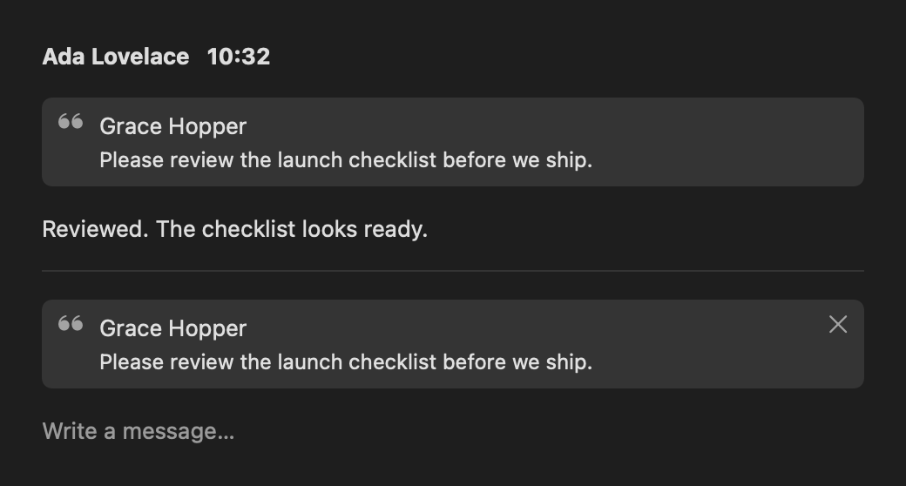
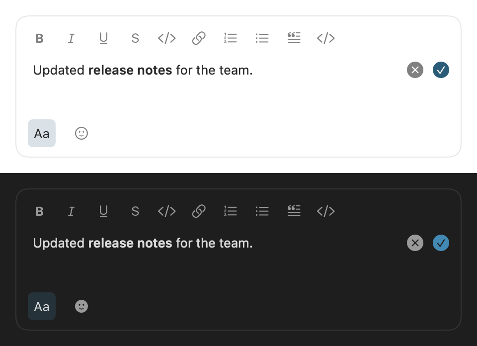

# Apple chat parity

## Parity source of truth

Current web behavior takes precedence when older requirements or this document differ (user decision, 2026-09-16). Inspect the current web implementation, update the affected requirements and source references here, and proceed without asking the user to choose between stale requirements and current web. Preserve the authorized chat scope and native Apple controls, including List. Ask only when current web behavior itself is unclear, a required API is absent, or a change needs separate contract/dependency approval. A requirements update does not establish implementation or verification completion.

## Resume checkpoint

- **Portable domain fence (SOK-1128), 2026-09-20:** draft [#4883](https://github.com/masumi-network/sokosumi/pull/4883), outside the parity rows. Keychain storage moved into the app's Authentication adapter behind the existing `TokenStore`; service/account identifiers and serialized tokens are unchanged. Realtime already delivers domain events without exposing Ably SDK types to Chat/Workspace. Added nine bundled golden cases for send/failure/retry, acknowledgement deduplication, thread scope and unread settlement/rollback. Local verification: full `Sokosumi` workspace test run passed (834 tests, 1,091 parameterized executions; Auth 35, Chat 550, Realtime 31, Workspace 119 and CoreAPI 1), strict SwiftLint/SwiftFormat and repository commit hooks passed. Standards/spec review has no remaining findings. The iOS 17 `SokosumiWorkspace` build passed. Live Keychain sign-in was not exercised. No parity row or existing interactive acceptance changed. Review follow-up: corrected the current ownership table and Authentication navigation; the send golden now uses `RoomOutbox.enqueue`, and a tenth case accepts a peer reply while retaining the pending local send. All 550 Chat tests and strict SwiftLint/SwiftFormat passed again.

- Room search merged as [#4612](https://github.com/masumi-network/sokosumi/pull/4612). Final CI on `a0c4a223d8034c6ac017a107cf3226b96dc7c6e0` passed: macOS build, app tests, all five Swift package suites, strict lint/format, and repository checks. The user confirmed search works; the subsequent loading-indicator adjustment reserves a trailing column and was visually checked in light/dark at minimum inspector width. Existing signed-app and pagination evidence remains below.
- Shared read-budget cooldown (07b) merged as [#4614](https://github.com/masumi-network/sokosumi/pull/4614). Final CI on `a5c6fb210edb689ec573ce4f0cfbe7721d19fd19` passed: macOS build, app tests, all five Swift package suites, strict lint and format. Review follow-ups fixed full-window jitter, added nonzero-jitter coverage, hoisted the operation allowlist, and corrected this checkpoint.
- Quick reactions (20b) merged as [#4620](https://github.com/masumi-network/sokosumi/pull/4620). Final Apple CI on `69655da539216a68a0fe197bc645c1503101a382` passed build, app tests, all five package suites, and strict lint/format. Review fixed add-only history recording and selected accessibility traits; the toolbar-level popover anchor and unverified physical keyboard/hover checks remain documented.
- Thread-preview parity (24a) merged in [#4629](https://github.com/masumi-network/sokosumi/pull/4629). Final head `b181163ee351606cc20704227cf34f87553fe7cd` passed all CI checks, including macOS build/app tests, all five package suites and strict lint/format. Slice 25 merged in [#4630](https://github.com/masumi-network/sokosumi/pull/4630). Review follow-up `190929829` passed all CI checks; the final merged head was `da4c676c44e22c4b5d0a55195c7075b0db4335e3`. Slice 26 merged in [#4640](https://github.com/masumi-network/sokosumi/pull/4640). Final head `3f7a4f427c23bbe6d16d5dc9794acd429498c2d7` passed all CI checks, including macOS build, app tests, all five package suites and lint/format. External universal links remain deferred by user approval.

- Full source/history audit refreshed on 2026-09-15 against `origin/main` at `808245bf311218a20972a0ccedace602ce5b13c5`. This is a source/history audit, not a fresh visual acceptance or test run. Earlier implementation evidence remains in the linked PRs and Git history. The later thread-overview comparison includes `origin/main` at `29eee6c67ad1891c93af84ea2f1a2b2c44e71da1`, including the device-local time-format preference in #4618; it does not replace the full audit baseline.
- [#4577](https://github.com/masumi-network/sokosumi/pull/4577) merged: automatic older-reply pagination, reading-position corrections and opaque composer padding. The user visually accepted the composer edge fix. The latest report is a console warning without visible stutter; the unresolved [scroll geometry warning](docs/scroll-geometry-warning.md) remains tracked separately.
- [#4602](https://github.com/masumi-network/sokosumi/pull/4602) merged: app and app tests use Swift 6 language mode under Xcode 27 / Swift 6.4. All five package suites (489 tests), app tests, strict SwiftLint, SwiftFormat and CI passed for that change. Targets and dependencies did not change.
- Start Direct (27) merged in [#4665](https://github.com/masumi-network/sokosumi/pull/4665). Final head `22698678e04e944cac27b3614964083a71733fde` passed all CI checks, including macOS build/app tests, all five package suites and uncached Swift lint/format. The recipient picker retains native List with compact row insets; search prompts and submission follow-ups are included.
- Xcode recommended settings (27a) merged in [#4668](https://github.com/masumi-network/sokosumi/pull/4668), final head `b91f157e202f7967a2482503d24d8e8a1ac38dec`; all CI checks pass. User-applied stripping, team inheritance and catalog-symbol settings are preserved; local Release build, full app tests, and iOS 17 package build passed.
- Unified toolbar New chat (27b) merged in [#4669](https://github.com/masumi-network/sokosumi/pull/4669), final head `408bbc8905abc11701fedff9891e9b533946d073`; all CI checks pass, including the review follow-up.
- Browse channels (30) merged in [#4677](https://github.com/masumi-network/sokosumi/pull/4677), final head `990dabee3441ac5b0d856e89a430e6f021f82450`; all required CI checks passed, including app tests, five package suites and strict lint/format.
- Room details/roster (31) merged in [#4686](https://github.com/masumi-network/sokosumi/pull/4686). Final head `ace91a38b4cb0bb9536e1743053b9b30c9c924f3` passed all CI checks, including app build/tests, five package suites and strict lint/format (Apple run `35148812199`). Review polish added Close help and removed the duplicate Members heading.
- Channel settings/membership editing (32) merged in [#4699](https://github.com/masumi-network/sokosumi/pull/4699), final head `90843f878c0384976b5010cdf21db1330217572a`; all Apple CI checks passed (Xcode build/app tests, five package suites, Swift lint/format).
- Leave/archive/restore/delete channels (33) merged in [#4712](https://github.com/masumi-network/sokosumi/pull/4712). Final head `2c1857e0b` (merge `43d3e3ade`) passed all 24 CI checks, including macOS build/app tests, five package suites and strict lint/format.
- External chat invitations (34) merged in [#4717](https://github.com/masumi-network/sokosumi/pull/4717). Final head `2a4c44c` (merge `d84cddefe`) passed all 24 CI checks, including macOS build/app tests, five package suites and strict lint/format. Two review follow-ups (Escape closes without declining; "Open channel" re-lists only a missing room) are recorded in the slice 34 notes.
- Room guest access (35) merged in [#4726](https://github.com/masumi-network/sokosumi/pull/4726). Final head `b142274` (merge `132376a62`) passed all 24 CI checks, including macOS build/app tests, five package suites and strict lint/format. The review follow-up asserted guest-link expiry through the middleware and shows the copy notice beside errors.
- Participant presence (36) merged in [#4733](https://github.com/masumi-network/sokosumi/pull/4733). Final head `f9c386914` (merge `29fe3e188`) passed all CI checks, including macOS build/app tests, five package suites and strict lint/format. The review follow-up `f8ca2d678` is recorded in the slice 36 notes.
- Coworker mention execution status (37) merged in [#4741](https://github.com/masumi-network/sokosumi/pull/4741) (squash `a58e7fb1f`, final head `a84b3ecf0` after merging main; last code commit `11b414555`). All CI checks passed, including macOS build/app tests, five package suites and strict lint/format. The review follow-up `11b414555` and the merge with main's send-to-self (`752432daa`) are recorded in the slice 37 notes.
- Soko Bot chat (38) merged in [#4745](https://github.com/masumi-network/sokosumi/pull/4745) (squash `09f7531f6`, final head `b5ce64282` after merging main; last code commit `88db7ecd2`). All CI checks passed (24 passed, 3 skipped), including macOS build/app tests, five package suites and strict lint/format. The review follow-up `88db7ecd2` is recorded in the slice 38 notes. The compiler-warning cleanup merged separately in [#4754](https://github.com/masumi-network/sokosumi/pull/4754); hand-written Apple code builds without warnings.
- Minimal Settings (39) merged in [#4762](https://github.com/masumi-network/sokosumi/pull/4762). Final head `fda06b24a` (merge `8890ecc28`) passed all CI checks, including macOS build/app tests, five package suites and strict lint/format. The review follow-ups `c7f07b894` and `fda06b24a` are recorded in the slice 39 notes.
- Chat notifications while the app runs (40) merged in [#4771](https://github.com/masumi-network/sokosumi/pull/4771). Final head `b6a17ff1f` (branch head `4c45148aa` after merging main, merge `ff56ac42c`) passed all CI checks (24 passed, 3 skipped), including macOS build/app tests, five package suites and strict lint/format. The review follow-ups `ac4eb5445` and `b6a17ff1f` are recorded in the slice 40 notes. External universal links remain deferred (25a).
- Pending reactions (20c) merged in [#4778](https://github.com/masumi-network/sokosumi/pull/4778), squash `0e6cec0a9`, final branch head `abc65365e`; all CI checks passed. Review follow-up `fbe1a957d` makes reaction chips follow the live overlay instead of the last `PreparedTranscript` snapshot, so a tap shows before the markdown prepare and a second tap cannot invert last-tap-wins.
- Pinned sidebar section (26a) merged in [#4785](https://github.com/masumi-network/sokosumi/pull/4785), squash `07dab03dc`, final branch head `46c462fe8`; all CI checks passed (23 passed, 3 skipped). Review follow-up `524a76a56` reworded the #4764 delta entry; the empty reorder-mode context menu and the 401 test scope were kept with reasons on the PR. Live drag through `onMove`, the handle menu by keyboard and VoiceOver, a real failure alert and Core's lenient `PUT` against production remain unverified.
- Web delta audit on 2026-09-18 covered `origin/main` from `29eee6c67ad1891c93af84ea2f1a2b2c44e71da1` to `1769c4ac2dee588fc7d00ba4cbc2ce050bc4b70f` (section "Web delta audit — 2026-09-18"). It added five Todo rows and changed no existing status: 05a (open-room attention), 12c (code block toggles off), 22a (link preview survives a failed image), 24b (mute a thread; needs the two deployed `…/threads/{parentMessageId}/mute` operations selected into the snapshot) and 27c (Message yourself). Row 17a is Done: Apple half merged as [#4797](https://github.com/masumi-network/sokosumi/pull/4797) (`f7cea7fa1`).
- **Handover, 2026-09-24.** The self-paced `/loop` ran rows 18a through 24g2 on 2026-09-23/24 and is retired; each row now runs in its own fresh session via `/apple-parity-next` (see Per-row session below). Why: one long session accumulated context across a dozen rows and side fixes, and when the SSH agent locked the loop stalled for about eight hours overnight. What the loop learned, now in the skill's brief: (1) audit web and Core as numbered questions at the current `main` SHA, never as claims; row text is a snapshot and was stale in most slices. (2) Native Mac affordances win over copying web markup — keep clickable controls and native toolbar items (e.g. 18b's compact ✕/✓ edit controls) and record each deviation. (3) Split a row into child rows only when the audit shows independent features (24f, 24g). (4) Render fixtures host the view over the window background with an opaque-footer guard; a transparent footer reads as white in a viewer (24g1). (5) Merge `main` into an open branch, never rebase or force-push; the user often merges `main` into open PRs, so fetch before every follow-up push. (6) On an SSH or signing failure, stop and report once. Claude Code Projects can't carry these rows today: their threads are Anthropic-hosted Ubuntu cloud sessions without Xcode, and a local session can't join a project.
- **Handover, 2026-09-23.** `origin/main` is `3df3392ae` (the 10c merge) and no Apple PR is open. Between 2026-09-21 and 2026-09-23 the loop merged eleven rows in work order — 26b [#4946](https://github.com/masumi-network/sokosumi/pull/4946), 19a [#4959](https://github.com/masumi-network/sokosumi/pull/4959), 13a [#4965](https://github.com/masumi-network/sokosumi/pull/4965), 21a [#4977](https://github.com/masumi-network/sokosumi/pull/4977), 23a [#4995](https://github.com/masumi-network/sokosumi/pull/4995), 12d [#5006](https://github.com/masumi-network/sokosumi/pull/5006), 05a [#5011](https://github.com/masumi-network/sokosumi/pull/5011), 12c [#5014](https://github.com/masumi-network/sokosumi/pull/5014), 22a [#5081](https://github.com/masumi-network/sokosumi/pull/5081), 04a [#5086](https://github.com/masumi-network/sokosumi/pull/5086) and 10c [#5090](https://github.com/masumi-network/sokosumi/pull/5090) — each with a slice section below and each merged by the user after a Grok review. Fourteen rows stay `Todo`; the next is **18a**. What the next session should know beyond the rows: (1) Row text is a snapshot of web on the day it was written and was stale in most slices (the 12c label, the 22a gate wording, the 04a copy, the 10c "plain `pre`"); re-audit the linked web sources at the current main SHA before implementing, and correct the row in the same PR. (2) A brief that asserts web behaviour is a liability: two slices (12d input rules on paste, 12c input rules after an unwrap) first shipped a deviation because the brief guessed that web only reacts to typed input; let the implementer read `handleInput` and its call sites, and treat the brief's behaviour claims as questions. (3) The GitHub macOS runner cannot run Vision text recognition; render tests that OCR a bitmap skip their text assertions there (`recognizedLines` returns nil) and keep their height and pixel checks, so a fixture's text claims are proven locally only. (4) Tests known to fail under load and pass on rerun, none tied to a slice: `TranscriptContentGrowthTests/growingMessagePreservesReadingPosition`, `TranscriptScrollingTests/richHistoryStartsAtBottomAndScrollsUp` and the 12c `CodeBlockFixtureTests` fixture with its fixed 200 ms sleep (new fixtures use the readiness helpers from [#5076](https://github.com/masumi-network/sokosumi/pull/5076)). (5) The user merges `main` into open PR branches and marks them ready; a follow-up push must fetch first and merge, never rebase, and a PR number written into this file before the first push can be taken in the meantime — re-check it right before committing. (6) The SwiftUI test host builds no accessibility tree, so VoiceOver and control lookups by label are not testable there; every slice lists what the running app did not exercise. The user's own stack ([#5078](https://github.com/masumi-network/sokosumi/pull/5078), unread count on by default) touches this file and `Settings/SettingsView.swift`; keep parity edits away from both until it lands.
- **Handover, 2026-09-19.** `origin/main` is `e1c9859c3`; `apps/apple` is warning-free in hand-written code, tests run on the `Sokosumi` workspace scheme with coverage off (`-enableCodeCoverage NO`; SOK-976), and no Apple PR is open. The full feature audit above added 20 Todo rows and corrected seven stale records.
- Mention badge cap (26b) merged as [#4946](https://github.com/masumi-network/sokosumi/pull/4946) on 2026-09-21 (squash `e0cf0a511`). Evidence is under "Slice 26b — sidebar mention badge cap"; the VoiceOver reading of the badge remains unverified.
- **Deleted messages leave the transcript (19a), 2026-09-21:** [#4959](https://github.com/masumi-network/sokosumi/pull/4959), merged on 2026-09-21 (squash `70bfbe2e5`). Evidence is under "Slice 19a — deleted messages leave the transcript"; live deletion in the running app remains unverified.
- **Mention button opens the picker without typing (13a), 2026-09-21:** [#4965](https://github.com/masumi-network/sokosumi/pull/4965), merged on 2026-09-21 (squash `bf8afac93`). Evidence is under "Slice 13a — the mention button types nothing"; the button, click-outside and Send with the list open remain unverified in the running app.
- **Pinned quote-only message shows its quote (21a), 2026-09-21:** [#4977](https://github.com/masumi-network/sokosumi/pull/4977), merged on 2026-09-21 (squash `c98435376`). Evidence is under "Slice 21a — a pinned quote-only message shows its quote"; a real quote-only pin, the jump from it and the VoiceOver reading remain unverified in the running app.
- **Search keeps its results while refining (23a), 2026-09-21:** [#4995](https://github.com/masumi-network/sokosumi/pull/4995), branch `claude/apple-parity-23a-search-keeps-results`, merged on 2026-09-21 (squash `1891a397e`). Evidence is under "Slice 23a — search keeps its results while refining"; typing against a live room, Return on a stale hit and the room switch remain unverified in the running app.
- **Typed markdown shortcuts format in the composer (12d), 2026-09-21:** [#5006](https://github.com/masumi-network/sokosumi/pull/5006), branch `claude/apple-parity-12d-markdown-input-rules`, merged on 2026-09-21 (squash `7f99f169e`). Evidence is under "Slice 12d — typed markdown shortcuts format in the composer"; typing, pasting and undoing the shortcuts, dead-key delimiters and an input method remain unverified in the running app.
- **Open-room attention follows web (05a), 2026-09-21:** [#5011](https://github.com/masumi-network/sokosumi/pull/5011), branch `claude/apple-parity-05a-open-room-attention`, merged on 2026-09-21 (squash `9aca29a8e`). Evidence is under "Slice 05a — open-room attention follows web"; a live open room with residual thread unread, the accent highlight in a focused window and VoiceOver on the selected row remain unverified in the running app.
- **Code block control toggles a block back off (12c), 2026-09-21:** [#5014](https://github.com/masumi-network/sokosumi/pull/5014), branch `claude/apple-parity-12c-code-block-toggle`, merged on 2026-09-22 (squash `ae83bf159`). Evidence is under "Slice 12c — the Code block control toggles a block back off"; pressing the control in a real room, ⌘Z after a toggle, the highlight while clicking around and sending a toggled draft remain unverified in the running app.
- **Link preview survives a failed image (22a), 2026-09-22:** [#5081](https://github.com/masumi-network/sokosumi/pull/5081), branch `claude/apple-parity-22a-unfurl-text-fallback`, merged on 2026-09-22 (squash `bebe6a0db`). Evidence is under "Slice 22a — a link preview survives a failed image"; a real hotlink-refused image, the remove button and the click on a text-only card in a live room remain unverified.
- **History gap row follows web (04a), 2026-09-22:** [#5086](https://github.com/masumi-network/sokosumi/pull/5086), branch `claude/apple-parity-04a-history-gap-row`, merged on 2026-09-22 (squash `aedb86379`). Evidence is under "Slice 04a — the history gap row follows web"; a live jump, a real failed page and the row under VoiceOver remain unverified in the running app.
- **Message body presentation follows web (10c), 2026-09-22:** [#5090](https://github.com/masumi-network/sokosumi/pull/5090), branch `claude/apple-parity-10c-body-presentation`, merged on 2026-09-23 (squash `3df3392ae`); the row was marked Done in [#5105](https://github.com/masumi-network/sokosumi/pull/5105). Evidence is under "Slice 10c — message body presentation follows web".
- **Edit composer saves on Return (18a), 2026-09-23:** [#5112](https://github.com/masumi-network/sokosumi/pull/5112), branch `claude/apple-parity-18a-edit-saves-on-return`, merged on 2026-09-23 (squash `b201fef2f`). Evidence is under "Slice 18a — the edit composer saves on Return"; typing into a live edit, an input method and the VoiceOver reading remain unverified in the running app. Marked Done in [#5118](https://github.com/masumi-network/sokosumi/pull/5118).
- **Compact controls replace the edit Save and Cancel buttons (18b), 2026-09-23:** [#5118](https://github.com/masumi-network/sokosumi/pull/5118), branch `claude/apple-parity-18b-edit-no-buttons`, opened as a draft on `origin/main` `9ebafac40`, merged on 2026-09-23 (squash `4e6dfa16f`); marked Done in [#5126](https://github.com/masumi-network/sokosumi/pull/5126). The user first decided the buttons go, as on web, then on review that a native Mac app keeps a pointer path: compact ✕/✓ controls at the field's trailing edge, a recorded deviation from web. Evidence is under "Slice 18b — compact controls replace the edit Save and Cancel buttons"; saving and cancelling a live edit with the keys and the controls, and VoiceOver and Switch Control on them, remain unverified in the running app.
- **Mute a thread (24b), 2026-09-23:** [#5126](https://github.com/masumi-network/sokosumi/pull/5126), branch `claude/apple-parity-24b-mute-thread`, opened as a draft on `origin/main` `e665ad268` (#5120), merged on 2026-09-23 (squash `ca25794db`) after Grok's review follow-up `2f3cbd9e4` (the mute read keys on stored replies); marked Done in [#5128](https://github.com/masumi-network/sokosumi/pull/5128). Evidence is under "Slice 24b — mute a thread"; muting a live thread against Core, the refreshed counts in a running app, VoiceOver on the toggle and the marker, and a real failure remain unverified.
- **Thread overview paging and read effects (24c), 2026-09-23:** [#5128](https://github.com/masumi-network/sokosumi/pull/5128), branch `claude/apple-parity-24c-overview-paging-reads`, opened as a draft on `origin/main` `ca25794db` (#5126), merged on 2026-09-23 (squash `641021125`); marked Done in [#5135](https://github.com/masumi-network/sokosumi/pull/5135). All three rules were still open; (c) only for the automatic Look, since 24b had already made the explicit one bump the revision. The audit found a separate gap, the overview's Unread and Earlier headings, recorded as row 24d. Evidence is under "Slice 24c — thread overview paging and read effects"; Mark all, the Threads count and the sidebar row in a running app against Core remain unverified.
- **Thread overview groups rows under Unread and Earlier (24d), 2026-09-23:** [#5135](https://github.com/masumi-network/sokosumi/pull/5135), branch `claude/apple-parity-24d-overview-groups`, started on `origin/main` `641021125` (#5128) and fast-forwarded to `59e173dd9` (through #5119, which reworked web's thread rows mid-slice), merged on 2026-09-23 (squash `462be692b`, including the row-hover follow-up `886856dcd`). The portable `RoomThreadOverviewGroups` splits the loaded rows by `unreadReplyCount > 0`; the overview renders them as native `Section`s under "Unread" (with its count, or "All caught up." when nothing is unread) and "Earlier", with web's row lines, the accent on unread rows and a tinted thread mark. The audit recorded the panel's remaining differences (web's self-loading paging row and its inline failure, the first-page failure, loading and error copy) without changing them; they are row 24e. #5119's cross-room Threads and All unreads views are row 24f. Marked Done in [#5144](https://github.com/masumi-network/sokosumi/pull/5144). Evidence is under "Slice 24d — the thread overview groups rows under Unread and Earlier"; the groups in a running app against Core, a row moving after Back or Mark all live, and VoiceOver on the headings remain unverified.
- **Thread overview paging and failure states follow web (24e), 2026-09-23:** [#5144](https://github.com/masumi-network/sokosumi/pull/5144), branch `claude/apple-parity-24e-overview-paging-states`, started on `origin/main` `1d2c25c37` (after #5133), merged forward to `6ed3a0baa` before the push, opened as a draft, merged on 2026-09-23 (squash `b5d40fcc3`, including the review follow-up `f381fe1c9`, which disables the paging row while the first page or Mark all runs); marked Done in [#5157](https://github.com/masumi-network/sokosumi/pull/5157). The portable `RoomThreadOverview` now keeps the first page (`isLoading`, `failureMessage`) apart from the paging row (`olderPageStatus`, `loadsOlderAutomatically`); a failed first page clears the list, a failed Mark all keeps it, a failed older page stays on the paging row. The overview's paging row is the transcript's boundary row, renamed `PageBoundaryRow` (with `PageBoundaryStatus`) and moved to `Shared/`, and loads when it scrolls into view. Evidence is under "Slice 24e — thread overview paging and failure states follow web"; paging against Core in a running app, a real failed page and VoiceOver on the row remain unverified.
- **Chat-level Threads view (24f1), 2026-09-23:** [#5157](https://github.com/masumi-network/sokosumi/pull/5157), branch `claude/apple-parity-24f-cross-room-threads` on `origin/main` `b61f92a2a` (#5150), fast-forwarded to `91a005760` (through #5145, #5156 and #5148) before the first commit, opened as a draft. The audit split row 24f: the Threads view (24f1) needs two new Core reads and nothing of the sidebar's attention rules, while the Unreads filter (24f2, web's former All unreads) is a filter of the room list whose rooms must agree with the rows' bold, which on Apple still predates ADR 0037. Both `GET /chats/threads/unread` and `/earlier` are deployed and were selected into the snapshot. A Threads row heads the sidebar; the view stands in the detail column, the portable `CrossRoomThreads` holds both lists, and a row opens its thread through `openRoomLink`. Merged on 2026-09-23 (squash `2cfc9b1d7`), including the review follow-up `91a9fe591` (cross-room thread text dropped on a session change); marked Done in [#5166](https://github.com/masumi-network/sokosumi/pull/5166). Evidence is under "Slice 24f1 — the chat-level Threads view"; the view against Core in a running app, a row opening a thread in another room live, and VoiceOver remain unverified.
- **Sidebar room rows follow ADR 0037 (24g1), 2026-09-23:** [#5166](https://github.com/masumi-network/sokosumi/pull/5166), branch `claude/apple-parity-24g-adr-0037-sidebar` on `origin/main` `2cfc9b1d7` (#5157), opened as a draft. The audit split row 24g: the bold, number and mention rule (24g1, this slice) reads `channelUnreadCount`, `unreadMentionCount` and `markedUnread`, while the inset unread Thread rows (24g2, Todo) read `unreadThreads` and `unreadThreadCount` and have their own click path; neither needs the other, and 24f2 needs only 24g1. `resolveRoomAttention` now bolds on the channel half plus the badge and the mark, draws one number, and draws a Direct of two's count instead of a badge; `RoomReadAttention` paints web's `roomAttentionAfterRead` and its overlay carries both halves and the room's Thread list, so a read, a Look, a thread mute and Mark all settle the row on Core's halves. The row's count moved to the trailing edge. Rows 05a and its slice section were corrected: leftover Thread unread no longer keeps the open row bold. Merged on 2026-09-24 (squash `2b92e2e37`), including the follow-ups `10f6d8c37` (the sidebar pixel checks' measured noise floor) and `4f0c31b19` (the 24f1 Threads-row fixture over the window background); marked Done in [#5179](https://github.com/masumi-network/sokosumi/pull/5179). Evidence is under "Slice 24g1 — sidebar room rows follow ADR 0037"; the rows against Core in a running app, the live settle paths and VoiceOver remain unverified.
- **Inset unread Thread rows under a room (24g2), 2026-09-24:** [#5179](https://github.com/masumi-network/sokosumi/pull/5179), branch `claude/apple-parity-24g2-inset-thread-rows` on `origin/main` `2b92e2e37` (#5166), opened as a draft. The re-audit found web's row files unchanged since `2cfc9b1d7`; the row text was corrected (pinned rooms list Threads outside reorder mode, archived rows never do, the number ignores the count preference, the overflow row puts an open thread away). The portable `sidebarRoomListItems` flattens each sidebar section into a room, its Thread rows and the overflow row; the sidebar renders them as plain, unselectable rows on the room label column, a row opens its Thread through the chat notification link and the overflow row opens the room's overview through `openThreadOverview` and a `ThreadOverviewRequest` the room's tools take. The rows settle on the room list the 24g1 overlay keeps. Evidence is under "Slice 24g2 — inset unread Thread rows under a room"; the rows against Core in a running app, the clicks live, the arrow keys and VoiceOver remain unverified.
- **Work order.** Take the earliest row whose status is exactly `Todo` and whose dependencies are Done or Merged. That order is: **24f2**, 24h, 09c, 06a, 14a, 15a, 29a, 31a, 32a, 07c, 07d, 27c, 41. 24e and 24f were added after 24d by the user's decision on 2026-09-23 and go first; 24f was split into 24f1 (Done) and 24f2. The user added 24g (ADR 0037 sidebar rows, which 24f2 needs) and 24h (the thread reply bar) on 2026-09-23; 24g was split into 24g1 (the bold rule, Done) and 24g2 (inset unread Thread rows, in review). 24f2 needs only 24g1; 24g2 went first by the user's instruction for a split, since with 24g1 a room holding only Thread unread goes quiet and its inset rows give it back a place in the sidebar. 24f2 is next. The earlier entries are single-file changes; 07c and 31a are the largest. 19a was unblocked by the user's decision on 2026-09-21; no row is `Blocked`.
- **Ground rules for whoever takes this.** One vertical slice per PR: portable model and networking in `Packages/`, native SwiftUI in the app, tests at the transport/state boundary, light and dark fixtures inspected. Current web wins over stale requirement text — update the row and say so in the PR. Never touch `apps/web` or `apps/core`; no Core contract, dependency or pinned-tool change; never hand-edit generated files (select existing operations with `scripts/update-core-api.py` against a fresh `https://api.sokosumi.com/v1/openapi.json` and record the structural diff). Do not file Linear issues. Stop and ask when web is ambiguous, an API or Ably capability is missing, or a project/entitlement change would be needed. Done means: five package suites, app tests (`-enableCodeCoverage NO`), strict SwiftLint/SwiftFormat, the iOS 17 Workspace build and the macOS build all pass; this file updated with evidence and the PR link; one draft PR whose title is the commit subject.
- **Per-row session** (replaces the self-paced `/loop`, 2026-09-24): start a fresh Claude Code session in this repository and type `/apple-parity-next` ([skill](../../.agents/skills/apple-parity-next/SKILL.md)). It resumes an open `claude/apple-parity-*` PR or takes the next row of the Work order, dispatches one subagent with the brief the skill carries, and shepherds the PR until it merges. One row per session; the stop-and-ask conditions and the brief live in the skill, the Work order and row state here.
- **Outside the parity rows.** Scrolling performance is tracked as **M6** under macOS-native additions, not in the capability inventory: PARITY records that web's virtualizer is not a native requirement, so this is a native performance defect rather than a parity gap. It is unscheduled — take it when the user asks, not from the Todo scan.
- **Not closable by source.** Rows Partial (10, 11, 12a), Merged with live acceptance pending (15, 16, 24, 26) and the unverified interactions recorded for 20c, 26a, 36, 37, 38, 39 and 40 all need a person to run the signed app. Deferred by the user: 10b, 25a, 28.
- Preserve unconfirmed acceptance: rich rendering in light appearance/live streaming (10), draft restoration (11), system Emoji & Symbols picker (12a), live upload/send (14), media/export/text preview (15), and Files selection/send (16). Source inspection does not close these gaps. Do not recreate the deleted polling automation or leave agent-launched test apps running.

## Web delta audit — 2026-09-15

Compared chat source and history since the original 2026-09-09 baseline. Existing Done rows retain their merged scope; newly discovered deltas have explicit follow-ups or verification notes below. Web implementation choices such as TanStack Virtual are not native requirements.

| Change / source | Apple disposition |
| --- | --- |
| Search header expansion, Cmd/Ctrl-F, 250 ms debounce, 50 results, two-line previews, keyboard selection and reply-aware jumps: [search panel](<../web/src/app/(app)/chat/components/room-search-panel.tsx>), [jump behavior](<../web/src/app/(app)/chat/utils/room-search-jump.ts>) | Row 23 updated. Current web has neither result pagination nor query-term highlighting. The landed message highlight is still required. |
| Shared read-budget cooldown: [throttle](<../web/src/lib/chat/chat-read-throttle.ts>), [scheduler](<../web/src/components/chat/use-chat-refresh-scheduler.ts>) ([#4552](https://github.com/masumi-network/sokosumi/pull/4552)) | Audit gap closed by 07b, merged in [#4614](https://github.com/masumi-network/sokosumi/pull/4614): shared HTTP read cooldown preserves retry timing while realtime delivery stays live. |
| Frequent/default one-tap toolbar reactions: [resolver](<../web/src/app/(app)/chat/utils/quick-reactions.ts>), [message row](<../web/src/app/(app)/chat/components/room-message-row.tsx>) ([#4593](https://github.com/masumi-network/sokosumi/pull/4593)) | Audit gap closed by 20b, merged in [#4620](https://github.com/masumi-network/sokosumi/pull/4620): toolbar shortcuts reuse the existing reaction action and frequent history. |
| Virtualized room/thread transcripts, 30-row jump windows, explicit history gaps, jump-to-latest and follow behavior during resize: [viewport](<../web/src/app/(app)/chat/components/transcript-viewport.tsx>), [model](<../web/src/app/(app)/chat/utils/transcript-viewport-model.ts>) | Native equivalents exist in RoomTimeline/room and thread views through #4549, #4576 and #4577. Keep the native list architecture. Re-verify initial positioning, older-page insertion, reader position during image growth and latest-follow on each related change; warning remains open. |
| Expansion persistence, pinned note, common hover/deep-link bounds ([#4558](https://github.com/masumi-network/sokosumi/pull/4558), [#4559](https://github.com/masumi-network/sokosumi/pull/4559)) | Already addressed by #4560/#4566; retain user-accepted complete-line clipping and composer boundary details. Do not reopen them solely because web internals changed. |
| Unfurl image aspect ratio under the height cap ([#4599](https://github.com/masumi-network/sokosumi/pull/4599)) | Apple [MessageImageView](Sokosumi/Chat/Rendering/MessageImageView.swift) already uses aspect ratio and scaled-to-fit images within maximum bounds. Row 22 needs tall/wide image visual comparison; no new renderer is justified by this audit. |
| Stable human mention IDs/email subtitles, localized Everyone, notification name resolution and participant-card refinements | Identity migration already merged in #4406. Keep notification presentation in 40 and participant/presence details in 31/36; recheck current web presentation when implementing those rows. |
| Unread thread attention on the room header ([#4441](https://github.com/masumi-network/sokosumi/pull/4441)) | Include in thread overview (24), distinct from already implemented reply thread reading (08). |
| Device-local Auto/12-hour/24-hour time preference merged in [#4618](https://github.com/masumi-network/sokosumi/pull/4618), [time-format.ts](<../web/src/i18n/time-format.ts>) | Implemented in Settings (39) as a per-install `UserDefaults` preference. Web stores browser cookies; this is not an account-synced Core contract. Auto keeps native system formatting. |
| Web's `resolveRoomAttention` no longer suppresses bold/badge/count on the open room since [#4441](https://github.com/masumi-network/sokosumi/pull/4441) (the chrome follows the unread state alone), while the Chat display copy still says "the chat you have open stay quiet" | Apple's `resolveRoomAttention` still takes `isActive` (row 05, ADR 0026), which matches the Settings copy. Row 39 adds the count inside that existing rule and does not change row 05; revisit with row 05 if the open-room chrome should follow web. |
| Soko Bot mention shells: Core mirrors capability labels into the thinking placeholder and keeps a failed shell ([soko-bot-chat.service.ts](../core/src/services/soko-bot-chat.service.ts)), but web's display merge keeps bodiless shells only for coworker senders ([merge-room-messages.ts](<../web/src/app/(app)/chat/utils/merge-room-messages.ts>)) and resolves the Thought view for coworkers only ([room-message-row.tsx](<../web/src/app/(app)/chat/components/room-message-row.tsx>)) | Row 38 follows current web: Apple hides bodiless Soko Bot shells and renders no Thought for the assistant. Whether web should show the assistant's progress and failure is a web decision; nothing is fabricated natively. |
| Pinned sidebar section with reorderable rooms ([#4764](https://github.com/masumi-network/sokosumi/pull/4764), audited 2026-09-18 at `0e6cec0a9`): [partition](<../web/src/components/chat/partition-rooms-for-sidebar.ts>), [pinned sort](<../web/src/components/chat/chat-room-activity-sort.ts>), [list](<../web/src/components/chat/organization-chat-list.client.tsx>) | Closed by slice 26a ([#4785](https://github.com/masumi-network/sokosumi/pull/4785)): Pinned section above Channels, `starredAt`-only order, reorder mode, the selected `PUT /chats/rooms/starred`, and no per-row pin glyph. Before it, [SidebarRooms.swift](Packages/SokosumiChat/Sources/SokosumiChat/SidebarRooms.swift) listed pins inline and ranked public before private ahead of `starredAt`, so a web reorder showed on Apple only within one section and one discoverability rank. Rows 03 and 26 keep their merged scope. |
| Core outage distinguished from logout ([#4365](https://github.com/masumi-network/sokosumi/pull/4365)) — **closed by the 2026-09-19 audit**: `OAuthSession.swift:150-158` clears the Keychain only on `invalid_grant`; network and 5xx keep the tokens and rethrow, and `signOutIfUnauthorized` fires on a Core 401 alone. | Auth uses a different native OAuth boundary. Verify transient Core/refresh failures preserve recoverable session state before closing auth maintenance; this audit does not establish a native defect. |

The GraphQL/LESS prerequisite and native highlighter are merged (#4382/#4384); [grammar provenance](docs/graphql-less-grammars.md) remains authoritative. Detailed slice notes below retain historical implementation evidence; this checkpoint and the delta table take precedence over their dated next-step or pending-CI statements.

## Web delta audit — 2026-09-18

Audited `origin/main` from `29eee6c67ad1891c93af84ea2f1a2b2c44e71da1` (the 2026-09-15 comparison head) to `1769c4ac2dee588fc7d00ba4cbc2ce050bc4b70f`. Candidates came from `git log` over the web chat routes and components, `lib/ably`, `lib/chat`, the account pages, Core's chat and notification routes and `packages/utils`; each user-facing change was read in its PR description and, where unclear, its diff, then checked against the Apple source named in the disposition. This is a source/history audit: no app was run, no test suite was executed, and no existing row changed status. Pure tests, refactors, admin, tasks, calendar, Drive and Soko Bot console work were skipped.

| Change / source | Apple disposition |
| --- | --- |
| Private self-direct notes ([#4711](https://github.com/masumi-network/sokosumi/pull/4711)): Message yourself in the picker, **You** label and own avatar, private-notes empty state, `ChatRoom.isSelfDirect`: [create-direct-dialog.tsx](<../web/src/app/(app)/chat/components/create-direct-dialog.tsx>), [room-helpers.ts](<../web/src/app/(app)/chat/components/room-helpers.ts>) | [ChatRecipientRoster.swift](Packages/SokosumiChat/Sources/SokosumiChat/ChatRecipientRoster.swift) filters the reader out of the picker, [SidebarRooms.swift](Packages/SokosumiChat/Sources/SokosumiChat/SidebarRooms.swift) names the room after the reader and leaves the avatar stack empty, and [RoomTimelineView.swift](Sokosumi/Chat/Timeline/RoomTimelineView.swift) has only the generic empty state. Apple reads `isSelfDirect` only to drop the presence mark ([ConversationSidebarView.swift](Sokosumi/Chat/Sidebar/ConversationSidebarView.swift)) and to hide Send to yourself. New row 27c |
| Send to yourself ([#4735](https://github.com/masumi-network/sokosumi/pull/4735)): message action quoting into the Self Direct, confirmation with Open, cross-room quote card opens the Message link | The Apple half shipped in the same PR and had no PARITY row: [WorkspaceState+SendToSelf.swift](Packages/SokosumiWorkspace/Sources/SokosumiWorkspace/WorkspaceState+SendToSelf.swift) (same eligibility as Copy link, hidden inside the Self Direct, re-lists rooms before Open), [ChatService+SendToSelf.swift](Packages/SokosumiChat/Sources/SokosumiChat/ChatService+SendToSelf.swift), the "Sent to yourself" alert and `quoteSourceURL` routing in [MessageRowView.swift](Sokosumi/Chat/Timeline/MessageRowView.swift); `POST …/send-to-self` is in the snapshot and deployed. Web confirms with a toast, Apple with an alert. Matches |
| Mute a thread ([#4680](https://github.com/masumi-network/sokosumi/pull/4680)): panel toggle, muted glyph in the thread list, Core unread/notification gates: [thread-mute-button.tsx](<../web/src/app/(app)/chat/components/thread-mute-button.tsx>) | No Apple source reads or writes a thread's `mutedAt` (only room mute in [ConversationSidebar.swift](Packages/SokosumiChat/Sources/SokosumiChat/ConversationSidebar.swift)); the snapshot has `ChatRoomThread.mutedAt` but not the two mute operations. Core's unread and notification gates already apply to Apple readers who mute on web. New row 24b |
| Pending reactions and idempotent reaction routes ([#4715](https://github.com/masumi-network/sokosumi/pull/4715)) | Closed by 20c ([#4778](https://github.com/masumi-network/sokosumi/pull/4778)): [PendingReactions.swift](Packages/SokosumiChat/Sources/SokosumiChat/PendingReactions.swift), [WorkspaceState+Reactions.swift](Packages/SokosumiWorkspace/Sources/SokosumiWorkspace/WorkspaceState+Reactions.swift); `PUT`/`DELETE …/reactions/{emoji}` are in the snapshot. Matches |
| Copy message link ([#4721](https://github.com/masumi-network/sokosumi/pull/4721)): `/chat/rooms/{roomId}?message={messageId}` on the web origin, offered on durable messages only: [notification-href.ts](<../web/src/lib/utils/notification-href.ts>), [room-message-row.tsx](<../web/src/app/(app)/chat/components/room-message-row.tsx>) | [ChatLink.swift](Packages/SokosumiChat/Sources/SokosumiChat/ChatLink.swift) `href` builds the same path and `message` query on `CoreSettings.webBaseURL`; `canCopyMessageLink` in [MessageRowView.swift](Sokosumi/Chat/Timeline/MessageRowView.swift) excludes deleted, local outbound, stream-overlay and thinking-shell rows, which is web's `isDurableRoomMessage` (web also excludes the row being edited; Apple edits in the composer, so the row stays durable). Offered in More, the context menu and as an accessibility action; Copy text stays web's touch-sheet-only item. Matches |
| Chat markdown quotes render after send ([#4723](https://github.com/masumi-network/sokosumi/pull/4723)): [sanitizeMarkdown.ts](<../web/src/lib/utils/sanitizeMarkdown.ts>) | The defect was web's HTML sanitizer encoding `>`. Apple parses the stored markdown with swift-markdown ([MessageMarkdown.swift](Packages/SokosumiChat/Sources/SokosumiChat/MessageMarkdown.swift)) and draws a left bar with secondary text in [MessageMarkdownView.swift](Sokosumi/Chat/Rendering/MessageMarkdownView.swift). Row 10 keeps its Partial status. Matches |
| Attachments in coworker Directs ([#4720](https://github.com/masumi-network/sokosumi/pull/4720)) and coworker stream attachments as `file` parts ([#4725](https://github.com/masumi-network/sokosumi/pull/4725)) | Both PRs carried their Apple half: `canAttachFiles` in [WorkspaceState+Attachments.swift](Packages/SokosumiWorkspace/Sources/SokosumiWorkspace/WorkspaceState+Attachments.swift) no longer excludes the stream room and `startDirectStream` in [ChatService+Streaming.swift](Packages/SokosumiChat/Sources/SokosumiChat/ChatService+Streaming.swift) sends the same `file` parts, skipping attachments without a media type; Drive picks stay link-only on both sides (row 16 unchanged). A live coworker answer about an image remains unverified on both platforms. Matches |
| Failed coworker mention shells stay in the transcript ([#4738](https://github.com/masumi-network/sokosumi/pull/4738)) | Closed by 37 ([#4741](https://github.com/masumi-network/sokosumi/pull/4741)): [CoworkerMentionShell.swift](Packages/SokosumiChat/Sources/SokosumiChat/CoworkerMentionShell.swift). Matches |
| Soko Bot thinking and failed shells hidden for bot senders (recorded by slice 38 in the 2026-09-15 table) | Unchanged on web at the audited head ([merge-room-messages.ts](<../web/src/app/(app)/chat/utils/merge-room-messages.ts>)); Apple keeps following web and fabricates nothing. No row. Matches |
| Room row trailing hole only when something is in it ([#4742](https://github.com/masumi-network/sokosumi/pull/4742), with [#4719](https://github.com/masumi-network/sokosumi/pull/4719), [#4734](https://github.com/masumi-network/sokosumi/pull/4734)) and mention badge crossfading with the room menu ([#4781](https://github.com/masumi-network/sokosumi/pull/4781)): [chat-room-sidebar-row.tsx](<../web/src/components/chat/chat-room-sidebar-row.tsx>) | These stop a hover-revealed `…` button from re-truncating the name. Apple's row in [ConversationSidebarView.swift](Sokosumi/Chat/Sidebar/ConversationSidebarView.swift) has no hover-revealed button; actions live in the native context menu, so the name never reflows and the badge never hides. The mention count is the native List `.badge`, which stays in place and is announced by the system. Web-only presentation |
| Pinned sidebar section ([#4764](https://github.com/masumi-network/sokosumi/pull/4764), [#4779](https://github.com/masumi-network/sokosumi/pull/4779)) | Closed by 26a ([#4785](https://github.com/masumi-network/sokosumi/pull/4785)): [SidebarRooms.swift](Packages/SokosumiChat/Sources/SokosumiChat/SidebarRooms.swift), [ConversationSidebar.swift](Packages/SokosumiChat/Sources/SokosumiChat/ConversationSidebar.swift); `PUT /chats/rooms/starred` is in the snapshot. Matches |
| Pasted Message link becomes the pending quote ([#4783](https://github.com/masumi-network/sokosumi/pull/4783), merged `b01ee8fee`) | Apple half merged as [#4797](https://github.com/masumi-network/sokosumi/pull/4797) (`f7cea7fa1`): [MessageLinkQuote.swift](Packages/SokosumiChat/Sources/SokosumiChat/MessageLinkQuote.swift), [WorkspaceState+MessageLinkQuote.swift](Packages/SokosumiWorkspace/Sources/SokosumiWorkspace/WorkspaceState+MessageLinkQuote.swift), paste entry in [MacComposerTextInput.swift](Sokosumi/Chat/Composer/MacComposerTextInput.swift). Row 17a is Done. Matches |
| Composer code block keeps its text and toggles off ([#4794](https://github.com/masumi-network/sokosumi/pull/4794)): [composer-wysiwyg-code-block.ts](<../web/src/lib/utils/composer-wysiwyg-code-block.ts>) | The lost-text and collapsed-block bugs are contentEditable defects with no Apple counterpart (`codeBlockRetainsLiteralCharacters` covers the fence). The toggle-off is real: [ComposerBlockFormat.swift](Packages/SokosumiChat/Sources/SokosumiChat/ComposerBlockFormat.swift) unwraps Quote and lists but always wraps `.codeBlock`. What the button does inside an existing block at runtime was not exercised. New row 12c |
| Link preview card degrades to text when its image fails; Core snapshots preview images into Blob and adds X oEmbed text ([#4667](https://github.com/masumi-network/sokosumi/pull/4667), with [#4639](https://github.com/masumi-network/sokosumi/pull/4639), [#4676](https://github.com/masumi-network/sokosumi/pull/4676)) | [MessageUnfurlView.swift](Sokosumi/Chat/Rendering/MessageUnfurlView.swift) still hides a card that has no description once its image fails or is absent, web's pre-#4667 rule. The Blob `imageUrl` needs no client change; image alignment and row-height estimates are web layout. New row 22a |
| Open-room attention: `resolveRoomAttention` without the open-room rule ([#4441](https://github.com/masumi-network/sokosumi/pull/4441), recorded by slice 39): [room-attention.ts](<../web/src/components/chat/room-attention.ts>) | Re-verified at the audited head: web's resolver has no `isActive`, Apple's in [SidebarRooms.swift](Packages/SokosumiChat/Sources/SokosumiChat/SidebarRooms.swift) still returns no attention for it, called from [ConversationSidebarView.swift](Sokosumi/Chat/Sidebar/ConversationSidebarView.swift). This is user-visible (leftover thread unread on the open room) and the parity rule says current web wins, so it gets a row now; Mark unread being disabled on the open room already matches. New row 05a |
| Banner replaced by a newer message re-alerts ([#4789](https://github.com/masumi-network/sokosumi/pull/4789), merged `526900352`): `renotify: true` unless the standing banner at that room tag has the same notification id (the push catching up with the page's own banner): [notification-service-worker.ts](<../web/src/lib/utils/notification-service-worker.ts>), [ably-push-sw.js](../web/public/ably-push-sw.js) | [ChatNotificationCenter.swift](Sokosumi/Notifications/ChatNotificationCenter.swift) requests `.alert` only, sets no sound and re-adds the request under the room identifier; slice 40 recorded "banners are silent" as a native adaptation, so there is no first alert sound for a replacement to repeat, and Apple has one banner source, so web's same-id catch-up case cannot occur ([ChatNotificationBanners.swift](Packages/SokosumiChat/Sources/SokosumiChat/ChatNotificationBanners.swift)). `renotify` is a Web Notifications flag. Whether macOS visibly re-presents a same-identifier replacement was not determined from source and stays in slice 40's unverified list. Out of scope (banner sound is a recorded native exclusion; revisit only if the user wants audible banners) |
| Notification Center work: one list with per-row read/unread ([#4651](https://github.com/masumi-network/sokosumi/pull/4651), [#4623](https://github.com/masumi-network/sokosumi/pull/4623), [#4624](https://github.com/masumi-network/sokosumi/pull/4624), [#4627](https://github.com/masumi-network/sokosumi/pull/4627)), Unread and Needs you views ([#4670](https://github.com/masumi-network/sokosumi/pull/4670), [#4687](https://github.com/masumi-network/sokosumi/pull/4687)), remembered view ([#4782](https://github.com/masumi-network/sokosumi/pull/4782)), day-later reminder ([#4628](https://github.com/masumi-network/sokosumi/pull/4628)), read route fold ([#4685](https://github.com/masumi-network/sokosumi/pull/4685)) | PARITY excludes the Notification Center. Checked the one seam that reaches Apple: `PATCH /notifications/{id}/unread` republishes the row with `osBanner: false`, which [ChatNotificationBanners.swift](Packages/SokosumiChat/Sources/SokosumiChat/ChatNotificationBanners.swift) ignores, and Apple's `PATCH /notifications/{id}/read` is still deployed. Out of scope (Notification Center; no inbox on Apple) |
| Brand primary moves from `#6400FF` to `#2B5C78` ([#4673](https://github.com/masumi-network/sokosumi/pull/4673)) and the token/border passes ([#4443](https://github.com/masumi-network/sokosumi/pull/4443), [#4451](https://github.com/masumi-network/sokosumi/pull/4451)) | [AccentColor.colorset](Sokosumi/Assets.xcassets/AccentColor.colorset) still holds the old web purple (`#6400FF` light, `#A164DD` dark). Not a chat behavior and not decided here; raise it with the user if the native accent should follow the brand. Out of scope (brand palette, not chat parity) |
| Core-only changes: blobs deleted on message tombstone ([#4707](https://github.com/masumi-network/sokosumi/pull/4707)), stream POST access check outside a transaction ([#4786](https://github.com/masumi-network/sokosumi/pull/4786)), room mapper reuse ([#4708](https://github.com/masumi-network/sokosumi/pull/4708)), recipient schemas exposed ([#4658](https://github.com/masumi-network/sokosumi/pull/4658), [#4663](https://github.com/masumi-network/sokosumi/pull/4663)) | No DTO or client-visible behavior change; tombstones render as before (row 19). Matches |
| Web chrome, mobile web and virtualization: collapsed rail ([#4714](https://github.com/masumi-network/sokosumi/pull/4714), [#4718](https://github.com/masumi-network/sokosumi/pull/4718), [#4727](https://github.com/masumi-network/sokosumi/pull/4727), [#4736](https://github.com/masumi-network/sokosumi/pull/4736), [#4739](https://github.com/masumi-network/sokosumi/pull/4739), [#4746](https://github.com/masumi-network/sokosumi/pull/4746), [#4757](https://github.com/masumi-network/sokosumi/pull/4757), [#4761](https://github.com/masumi-network/sokosumi/pull/4761), [#4790](https://github.com/masumi-network/sokosumi/pull/4790)), hover action pill ([#4631](https://github.com/masumi-network/sokosumi/pull/4631), [#4773](https://github.com/masumi-network/sokosumi/pull/4773)), mobile keyboard, touch targets and iOS anchoring ([#4666](https://github.com/masumi-network/sokosumi/pull/4666), [#4768](https://github.com/masumi-network/sokosumi/pull/4768), [#4774](https://github.com/masumi-network/sokosumi/pull/4774), [#4775](https://github.com/masumi-network/sokosumi/pull/4775), [#4793](https://github.com/masumi-network/sokosumi/pull/4793)), row-height estimates ([#4758](https://github.com/masumi-network/sokosumi/pull/4758)), Soko Bot console chips ([#4776](https://github.com/masumi-network/sokosumi/pull/4776)) and beta chrome gate ([#4664](https://github.com/masumi-network/sokosumi/pull/4664)) | Native split view, List and context menus replace these; PARITY's Web-only concerns already cover responsive layout, hover gutters and DOM scrolling, and the assistant console is out of scope. Web-only presentation |

Five rows were added: 05a, 12c, 22a, 24b and 27c. Non-Done rows were checked for stale requirement text against current web: 10 (quotes already render natively), 11, 12a, 15, 16 (Drive picks stay link-only in the coworker stream), 26 (the Pinned section lives in 26a), 10b, 25a and 28 had no web change in this range that alters their text; 24 keeps its text and gains the muted-thread follow-up 24b, because a muted thread leaves the unread-first group through Core rather than through client sorting.

Not determined from source: whether macOS re-presents a banner when a request with the same identifier replaces it; what the Apple Code block button does at runtime with the caret inside an existing block (only the missing unwrap path was established then; slice 12c since showed through the real text view that it wrapped again, see "Slice 12c"); (the selected List row under 05a was since determined from window captures, see "Slice 05a"); and live behavior of any route named above against production beyond its presence in the deployed OpenAPI document.

## Full feature audit — 2026-09-19

Not a commit delta: six read-only agents compared the **current** web chat implementation with the **current** Apple client feature by feature, at `origin/main` `e1c9859c3`, by area — A sidebar/navigation, B timeline/message row, C composer/sending, D threads/pins/search, E room details/membership/presence, F AI/realtime/notifications/settings. Each mismatch below cites both sides. Nothing was built or run; every finding is from source, and the per-area "not determined" notes are kept with their rows.

The audit deliberately skipped anything this document already records as a native adaptation, an open row, or out of scope. Web implementation choices (virtualization, dnd library, toasts vs alerts, CSS polish, collapsed rail, skeletons, PWA) remain non-requirements.

| Area | Mismatches | New rows |
| --- | --- | --- |
| A — sidebar, workspace, navigation | 3 | 26b, 29a; copy in 41 |
| B — timeline and message row | 11 | 04a, 10c, 15a, 19a; copy in 41 |
| C — composer and sending | 9 | 06a, 12d, 13a, 14a, 18a; copy in 41 |
| D — threads, pins, search | 6 | 21a, 23a, 24c; copy in 41 |
| E — room details, guests, presence | 6 | 31a, 32a; copy in 41 |
| F — AI, realtime, notifications, settings | 4 | 07c, 07d, 09c; copy in 41 |

Seven stale records were corrected in place rather than left to mislead: row 17a was still "In review" after [#4797](https://github.com/masumi-network/sokosumi/pull/4797) merged; row 19 still claims both clients keep tombstones; row 22a's "drop that gate" instruction overshoots what web changed; the slice 18 notes record Apple's Command-Return edit rule as parity when web has saved on Return since [#3966](https://github.com/masumi-network/sokosumi/pull/3966); the slice 30 note calls the sidebar collapse state persisted when neither client persists it; the slice 09a notes and its review-fix line describe a web live-thought rule that changed; and the 2026-09-15 "Core outage" verification is settled by `OAuthSession`, so it is closed. Two further notes are historical rather than wrong and were left alone: the slice 26 note still mentions the per-row pin glyph that 26a removed on both sides, and row 26's requirement text quotes the old "Mark unread" label (row 41 carries the fix).

**Row 19a was `Blocked`** — whether Apple follows current web and drops deleted rows, or web is fixed first. The user decided on 2026-09-21 that **Apple follows current web**, so 19a is now `Todo` and every new row can be started as written.

Area A found the sidebar close to parity: sections, partition, both sort orders, attention resolution, row menu rules, pin/mute exclusivity, the Pinned reorder gate, archived rules, invitations, create-channel validation, browse, the Direct picker and `ChatLink` parsing all match field for field. Areas B, D, E and F likewise verified long lists of matching behavior; those lists live in the per-area reports rather than here.

## Scope and audit baseline

Iteration 0 approved and merged in [PR #4303](https://github.com/masumi-network/sokosumi/pull/4303). Original audit covered web and Apple source at `85d85776deaa128a3d4177bb58b6545684e7c1ac` (2026-09-09). This document is the chat parity boundary for subsequent PRs. It expands the original tracer scope to the chat capabilities below, implementing the goal in [VISION.md](VISION.md) without authorizing unrelated web product screens.

Target macOS 26 now, iOS 17+ later. Use SwiftUI native navigation and controls. All models, networking, view models and persistence belong in platform-agnostic, UI-free packages. Shared packages target macOS 26 and iOS 17, per the baseline update requested after iteration 0. Shared code must remain available on iOS 17; verify this with an iOS 17 build. Newer Mac APIs belong only in Mac-specific views, guarded by platform/availability checks. Isolate unavoidable AppKit behind a Mac adapter. Do not add dependencies or change the shared API contract without a separate PR and explicit approval. Never modify `apps/web`.

“Conversation” includes channels, human/group Directs, coworker Directs and personal-assistant Directs exposed by web chat. “Reply thread” means replies under a parent message, not the whole conversation. Chat guest access and the existing Drive attachment picker are explicitly in scope. Linked non-chat destinations open on web; their native screens are not implied.

## Status and iteration rules

- **In progress**: approved slice is being implemented; verification or delivery remains incomplete. **Partial**: existing Apple implementation covers part of the row; complete parity and current build/test evidence are still required.
- **Merged**: implementation is merged but listed acceptance remains unverified. **Deferred**: explicitly postponed by the user.
- **In review**: implementation and verification recorded below; awaiting PR merge.
- **Todo**: no complete Apple slice found. **Blocked**: record a concrete ambiguity or missing API and ask the user before implementing. **Done**: merged PR, matching behavior, clean build and passing tests with new feature coverage recorded here. **N/A**: web-only concern.
- No capability is marked Done solely by the initial source audit. Existing tests are evidence of intent, not fresh execution results.
- Read in numeric order (09a before 09b); dependency IDs are prerequisites. Pick the earliest unimplemented row whose dependencies are available after rebasing on `main`, using the current checkpoint order for explicit follow-ups. Merged rows with pending manual acceptance do not block independent work; retain their verification gaps. Each row is a proposed feature slice, not a license to omit its sub-capabilities.
- One complete vertical slice (model, networking, view and tests) per PR. If a row contains genuinely independent features, record child IDs and dependencies here before splitting. Size alone is not a reason to split.
- Update the row with PR link, exact verification commands/results and remaining gaps. Describe feature, linked web sources, included/excluded behavior and how to test. Open draft by default.
- Iteration 0 must receive user approval before implementation. Later iterations wait for merge; poll `gh pr view --json state,reviews`, read review comments and address valid findings; do not request a new review in the review response. If closed unmerged, stop and ask. No next slice before merge.

## Dependency-ordered capability inventory

Source links are relative to this file. The shared web service boundary is [chat-room.service.ts](<../web/src/lib/services/chat-room.service.ts>); chat mutations are in [actions.ts](<../web/src/app/(app)/chat/actions.ts>). Check their Core calls before each slice rather than porting web server actions into Swift.

| ID | User-facing capability / acceptance scope | Depends on | Status | Web source files |
| --- | --- | --- | --- | --- |
| 01 | Sign in through system-browser OAuth; cancellation, errors, restore session, refresh/revocation, sign out. Move session state and persistence into portable packages; isolate the presentation adapter. | — | Done — [#4304](https://github.com/masumi-network/sokosumi/pull/4304) | [form.tsx](<../web/src/app/(auth)/signin/components/form.tsx>), [page.tsx](<../web/src/app/auth/callback/signin/page.tsx>) |
| 02 | Workspace access gate, personal/org selection and restoration, unseated chat access, workspace switch with isolated room/draft state. Setup-required state opens web. | 01 | Done — [#4309](https://github.com/masumi-network/sokosumi/pull/4309) | [authenticated-app-frame.tsx](<../web/src/app/(app)/components/authenticated-app-frame.tsx>), [workspace-switcher.tsx](<../web/src/app/(app)/components/user-avatar/workspace-switcher.tsx>), [workspace.service.ts](<../web/src/lib/services/workspace.service.ts>) |
| 03 | Conversation sidebar: all membership-visible pages, Channels/Directs/External groups, names, avatars, participant ordering, selection, activity order, empty/loading/error/retry, collapsed sections. | 02 | Done — [#4312](https://github.com/masumi-network/sokosumi/pull/4312) | [organization-chat-list.client.tsx](<../web/src/components/chat/organization-chat-list.client.tsx>), [partition-rooms-for-sidebar.ts](<../web/src/components/chat/partition-rooms-for-sidebar.ts>), [chat-room-sidebar-row.tsx](<../web/src/components/chat/chat-room-sidebar-row.tsx>), [direct-room-avatar-stack.tsx](<../web/src/components/chat/direct-room-avatar-stack.tsx>) |
| 04 | Room timeline: ordered paginated history, older-page loading without losing position, grouping, sender/avatar/time, local day separators, membership events, deleted/edited labels, empty/error/retry; follow latest without stealing reading position. | 03 | Done — [#4313](https://github.com/masumi-network/sokosumi/pull/4313); native scrolling accepted by user | [rooms-client.tsx](<../web/src/app/(app)/chat/components/rooms-client.tsx>), [room-message-row.tsx](<../web/src/app/(app)/chat/components/room-message-row.tsx>), [../components/transcript-viewport.tsx](<../web/src/app/(app)/chat/components/transcript-viewport.tsx>), [load-room-messages.ts](<../web/src/app/(app)/chat/load-room-messages.ts>) |
| 04a | Transcript history gap row follows web. Current web ([transcript-boundary-row.tsx](<../web/src/app/(app)/chat/components/transcript-boundary-row.tsx>), re-audited 2026-09-22 at `bebe6a0db`): one row for both boundaries, keyed by the first message of the range below it. A gap row reads "Messages are missing here" over "Load missing messages", loads itself once it scrolls into view (`useLoadWhenVisible`: once per arming, armed only while idle), shows a spinner with "Messages are missing here" over "Loading missing messages…" while it loads, and on failure stays on the row with "Couldn’t load messages." plus "Try again" — no toast, no auto-load until the reader asks again; a page that leaves the gap open re-arms the new row. The row above the oldest range reads "Load older messages" / "Loading older messages…" and fails the same way; it auto-loads in view too. There is no "beginning of conversation" row, and web's thread panel has only the oldest-boundary row, no gap row. Apple ([RoomTimelineView.swift](Sokosumi/Chat/Timeline/RoomTimelineView.swift)) used to show a bare "Load missing messages" button, never auto-loaded a gap, and turned a gap failure into the modal "Couldn’t load message" alert plus the transcript banner; the row text of 2026-09-18 omitted the gap row's action label, the loading copy and the failed oldest boundary. Now one `TranscriptBoundaryRow` (the shared `PageBoundaryRow` since 24e) serves both boundaries from `RoomTimeline.boundaryLoads` / `oldestBoundaryStatus` (`TranscriptBoundaryLoads`, per gap id); the gap row loads itself on `onScrollVisibilityChange`, its failure stays on the row, and Try again reloads through the one `loadPage(.boundary)` path. Kept Apple: the oldest boundary still auto-loads from the near-top scroll geometry (200 pt, after a trip away from the top), the transcript-load Retry control (web has none there; that extra affordance is accepted), and the thread's gap row, which web does not have, stays a tap. | 04 | Done — [#5086](https://github.com/masumi-network/sokosumi/pull/5086), merged 2026-09-22 (squash `aedb86379`); the app was not launched, so a live jump, a real failed page and the row under VoiceOver remain unverified | [transcript-boundary-row.tsx](<../web/src/app/(app)/chat/components/transcript-boundary-row.tsx>), [use-load-when-visible.ts](../web/src/hooks/use-load-when-visible.ts), [rooms-client.tsx](<../web/src/app/(app)/chat/components/rooms-client.tsx>) |
| 05 | Read/attention state: visible resolved history marks read, failed/hidden loads do not; unread mentions, manual unread and residual thread attention remain accurate. | 04 | Done — [#4322](https://github.com/masumi-network/sokosumi/pull/4322) | [use-room-read-attention.ts](<../web/src/app/(app)/chat/hooks/use-room-read-attention.ts>), [room-attention.ts](<../web/src/components/chat/room-attention.ts>), [room-read-overlay.ts](<../web/src/components/chat/room-read-overlay.ts>) |
| 05a | Open-room attention follows web. Current web (since [#4441](https://github.com/masumi-network/sokosumi/pull/4441)): `resolveRoomAttention` does not know which room is open, so the row of the room being read stays bold and keeps its one number (the mention badge, or else, with the count preference on, its count) until the room is genuinely read, marked read or muted. Opening a room does not read it (ADR 0026: last-read moves when history resolves on screen). Until row 24g1, leftover thread unread kept the open row bold, because Core folded Participant thread replies into `unreadCount` (ADR 0013). **Corrected by 24g1 (2026-09-23):** since [#5078](https://github.com/masumi-network/sokosumi/pull/5078) ([ADR 0037](../../docs/adr/0037-thread-unread-leaves-room-unread.md), Accepted) bold is the channel half plus the badge and a hand-set mark, so leftover Thread unread leaves the open row quiet like any other; a Thread reply that names the reader still bolds and badges it through `unreadMentionCount`. Mark unread stays disabled on the open room and on muted rooms. Apple's `resolveRoomAttention` used to return no attention for `isActive`, so an open room holding residual thread unread, or one whose history was hidden or failed to load, showed nothing until another room was selected. Now the `isActive` suppression and its argument are gone from [SidebarRooms.swift](Packages/SokosumiChat/Sources/SokosumiChat/SidebarRooms.swift) and from the one sidebar call site in [ConversationSidebarView.swift](Sokosumi/Chat/Sidebar/ConversationSidebarView.swift) (no second path); native List selection is kept, and bold, badge and count stay legible on the selected row in light and dark, unemphasized and emphasized. Muted suppression, the `99+` cap and closed-section attention are unchanged. The Settings caption stays identical to web's `roomUnreadCountDescription`; SOK-1147 corrected both to "Shown on every chat with unread messages. Muted chats stay quiet, and your notifications do not change." ADR 0037 was Proposed when this row was written; web and Core implement it since #5078, and row 24g1 mirrors it. No Core change. | 05, 39 | Done — [#5011](https://github.com/masumi-network/sokosumi/pull/5011); the running app was not launched, so a live open room with residual thread unread, the accent highlight in a genuinely focused window and VoiceOver on the selected row are unverified live | [room-attention.ts](<../web/src/components/chat/room-attention.ts>), [chat-room-sidebar-row.tsx](<../web/src/components/chat/chat-room-sidebar-row.tsx>), [ADR 0026](../../docs/adr/0026-room-unread-chrome-follows-history-resolved.md) |
| 06 | Compose and send classic room messages: multiline input, Enter/Shift-Enter and IME behavior, whitespace/length checks, pending/sent/failed feedback, single-flight ordering, duplicate reconciliation, retry/remove. | 04 | Done — [#4325](https://github.com/masumi-network/sokosumi/pull/4325) | [room-message-composer.tsx](<../web/src/components/chat/room-message-composer.tsx>), [composer-wysiwyg-editor.tsx](<../web/src/components/chat/composer-wysiwyg-editor.tsx>), [rooms-client.tsx](<../web/src/app/(app)/chat/components/rooms-client.tsx>), [classic-outbound-queue.ts](<../web/src/app/(app)/chat/utils/classic-outbound-queue.ts>) |
| 06a | Sending during progressive open and provisional mention chips. Current web: Send stays enabled while the room's history is still loading ([rooms-client.tsx](<../web/src/app/(app)/chat/components/rooms-client.tsx>):2944-2947), and a local outbound shell carries PENDING mention rows for a mentioned coworker or assistant ([outbound-room-message.ts](<../web/src/app/(app)/chat/utils/outbound-room-message.ts>):130-136) so the thinking chip appears at once and does not blink when Core's row lands. Apple gates `canSend` on `!transcriptLoading` ([ChatComposerView.swift](Sokosumi/Chat/Composer/ChatComposerView.swift):72) and `OutboundShell` has no mentions, so the chip waits for Core. | 06, 37 | Todo | [rooms-client.tsx](<../web/src/app/(app)/chat/components/rooms-client.tsx>), [outbound-room-message.ts](<../web/src/app/(app)/chat/utils/outbound-room-message.ts>) |
| 07 | Live room updates: full DTO, ID hydration and patches, create/edit/delete/reaction/pin changes, own-send reconciliation, reconnect/poll recovery, membership revocation and capability refresh, workspace/account isolation. Reply routing lands with 08. | 05, 06 | Done — [PR #4327](https://github.com/masumi-network/sokosumi/pull/4327) | [use-chat-room-realtime.tsx](<../web/src/lib/ably/use-chat-room-realtime.tsx>), [apply-chat-room-message-patch.ts](<../web/src/lib/ably/apply-chat-room-message-patch.ts>), [use-chat-control-channel.tsx](<../web/src/lib/ably/use-chat-control-channel.tsx>), [use-chat-refresh-scheduler.ts](<../web/src/components/chat/use-chat-refresh-scheduler.ts>), [use-selected-room-channel-health.ts](<../web/src/lib/ably/use-selected-room-channel-health.ts>) |
| 07b | Honor shared chat read-budget backoff across HTTP recovery readers: retain Retry-After/body delay, coordinate cooldown, bounded fallback and delayed resume; keep realtime events live and isolate account lifetime. | 07, 08 | Done — [#4614](https://github.com/masumi-network/sokosumi/pull/4614) | [chat-read-throttle.ts](<../web/src/lib/chat/chat-read-throttle.ts>), [use-chat-refresh-scheduler.ts](<../web/src/components/chat/use-chat-refresh-scheduler.ts>) |
| 07c | Consume `chat_rooms_changed`. Web subscribes it on `chat_control:user_{id}` ([use-chat-control-channel.tsx](<../web/src/lib/ably/use-chat-control-channel.tsx>):74-85) and refetches exactly the named collections ([use-organization-chat-rooms.ts](<../web/src/components/chat/use-organization-chat-rooms.ts>):228-240). Core publishes it on archive, restore, invitation create/revoke/accept/decline, send-to-self and every message create. Apple resolves only `chat_membership_revoked` on that channel ([RealtimeEvent.swift](Packages/SokosumiRealtime/Sources/SokosumiRealtime/RealtimeEvent.swift):154-176), so the room list, Archived and pending invitations wait for the 60 s sidebar poll. No Core or snapshot change; the event already exists. | 07, 33, 34 | Todo | [use-chat-control-channel.tsx](<../web/src/lib/ably/use-chat-control-channel.tsx>), [use-organization-chat-rooms.ts](<../web/src/components/chat/use-organization-chat-rooms.ts>) |
| 07d | Explicit recovery reads run while the window is not key. Web defers only *timer* reads when the document is hidden or unfocused; an explicit request (id envelope, lost continuity, collection invalidation) runs immediately ([use-chat-refresh-scheduler.ts](<../web/src/components/chat/use-chat-refresh-scheduler.ts>):44-57,127-130). Apple's `requestRefresh` returns whenever `foreground` is false ([ChatRefreshScheduler.swift](Packages/SokosumiChat/Sources/SokosumiChat/ChatRefreshScheduler.swift):86-91), and `foreground` follows `scenePhase == .active`, so a visible but not key macOS window keeps a stale sidebar and envelope until the user clicks back in. Keep the read-budget cooldown (07b) in force for the explicit path. | 07, 07b | Todo | [use-chat-refresh-scheduler.ts](<../web/src/components/chat/use-chat-refresh-scheduler.ts>) |
| 08 | Reply threads: parent preview, open/back/close, paginated replies, independent composer and outbound queue, reply counts/activity, loading/error states, thread read marking and live routing of replies and parent updates between the room and the open thread. | 05, 06, 07 | Done — [PR #4340](https://github.com/masumi-network/sokosumi/pull/4340) | [thread-panel.tsx](<../web/src/app/(app)/chat/components/thread-panel.tsx>), [thread-list-panel.tsx](<../web/src/app/(app)/chat/components/thread-list-panel.tsx>), [chat-room-message-scope.ts](<../web/src/app/(app)/chat/utils/chat-room-message-scope.ts>), [parent-thread-preview.ts](<../web/src/app/(app)/chat/utils/parent-thread-preview.ts>) |
| 09a | Coworker streaming in Directs: initial send, incremental text/reasoning, thinking/error state, active-stream resume on room entry and persisted-message reconciliation without flicker/duplicates; preserve web room eligibility and send lock. | 07 | Done (#4352) | [use-coworker-direct-room-stream.ts](<../web/src/app/(app)/chat/hooks/use-coworker-direct-room-stream.ts>), [coworker-thought-ui.tsx](<../web/src/app/(app)/chat/components/coworker-thought-ui.tsx>), [route.ts](<../web/src/app/api/chat/route.ts>), [route.ts](<../web/src/app/api/chat/[roomId]/stream/route.ts>) |
| 09b | Coworker streaming in reply threads: reuse Direct streaming with parent association, route overlays and persisted replies to the correct thread, resume with the correct parent and preserve the shared send lock. | 08, 09a | Done (#4361) | [use-coworker-direct-room-stream.ts](<../web/src/app/(app)/chat/hooks/use-coworker-direct-room-stream.ts>), [coworker-thought-ui.tsx](<../web/src/app/(app)/chat/components/coworker-thought-ui.tsx>), [route.ts](<../web/src/app/api/chat/route.ts>), [route.ts](<../web/src/app/api/chat/[roomId]/stream/route.ts>) |
| 09c | Live coworker Thinking shows the whole reasoning trace. Web's `resolveCoworkerThoughtViewModel` prefers the joined `thoughtTextFull` over the newest beat ([coworker-thought.ts](<../web/src/app/(app)/chat/utils/coworker-thought.ts>):279-287) and clamps the paragraphs to three lines, so the reader sees the start of the trace. Apple passes `latestThought ?? reasoning` ([RoomTimelineView.swift](Sokosumi/Chat/Timeline/RoomTimelineView.swift):441-446, [ReplyThreadView.swift](Sokosumi/Chat/Threads/ReplyThreadView.swift):286), showing only the newest beat, which swaps as beats arrive. Persisted mention shells (37) already join all beats and stay as they are. | 09a, 09b | Todo | [coworker-thought.ts](<../web/src/app/(app)/chat/utils/coworker-thought.ts>), [coworker-thought-ui.tsx](<../web/src/app/(app)/chat/components/coworker-thought-ui.tsx>) |
| 10 | Rich message text: paragraphs/line breaks, headings, lists/task lists, tables, quotes, emphasis/underline/strike, links, inline/fenced code with highlighting, emoji/emoticons and jumbo emoji, expand/collapse long content, selection/copy. | 04 | Partial | [room-message-row.tsx](<../web/src/app/(app)/chat/components/room-message-row.tsx>), [room-mention-markdown.tsx](<../web/src/app/(app)/chat/components/room-mention-markdown.tsx>), [markdown.tsx](<../web/src/components/markdown.tsx>), [jumbo-emoji.ts](<../web/src/app/(app)/chat/utils/jumbo-emoji.ts>) |
| 10b | Syntax highlighting refinements: remaining web language/dialect coverage, automatic language detection and color/query refinements. Explicitly deferred by the user on 2026-09-10; not a blocker for slice 10. | 10 | Deferred | [markdown.tsx](<../web/src/components/markdown.tsx>) |
| 10c | Message body presentation follows web. Current web (`ChannelMessageBody` in [room-message-row.tsx](<../web/src/app/(app)/chat/components/room-message-row.tsx>), re-audited 2026-09-22 at `aedb86379`): every body except jumbo emoji carries `line-clamp-[16]` — sixteen rendered lines, overflow measured by [use-clamped-overflow.tsx](<../web/src/app/(app)/chat/hooks/use-clamped-overflow.tsx>) and re-measured on resize — unless `hasLargeSoloImageAttachment`: file links separated only by whitespace form one chip row, and a row of exactly one image link is drawn large and exempts the whole body, text around it or not; a file, two images side by side, or an image beside a file keep the clamp. "Show more" / "Show less" is one small tinted text button under the body, shown while the body overflows or is expanded; the state is remembered per message while the transcript is open, reset when the content changes, and collapsing does not scroll. A fenced block is a bordered `pre` on the card background with horizontal scroll and no wrapping, highlighted by TanStack Highlight since [#4468](https://github.com/masumi-network/sokosumi/pull/4468) (2026-09-11); no language label, no copy button ([markdown.tsx](<../web/src/components/markdown.tsx>), [markdown-highlighter.ts](../web/src/components/markdown-highlighter.ts)). Apple used to exempt any attachment from the clamp ([MessageMarkdownView.swift](Sokosumi/Chat/Rendering/MessageMarkdownView.swift)), so a long message with a file never offered Show more, and printed the fence's first word above every code block ([MessageCodeBlock.swift](Sokosumi/Chat/Rendering/MessageCodeBlock.swift)). The row of 2026-09-19 called web's block a plain `pre`; it was already highlighted then, so Apple's highlighting (row 10) stays. Now `MessageMarkdown.clampsLongBody` ([MessageAttachment.swift](Packages/SokosumiChat/Sources/SokosumiChat/MessageAttachment.swift)) carries web's rule and the code block shows the code alone. | 10 | Done — [#5090](https://github.com/masumi-network/sokosumi/pull/5090) (merged 2026-09-23); the app was not launched, so Show more on a real message with a file, the control with the mouse in a live room and thread, and expansion surviving a scroll away remain unverified | [room-message-row.tsx](<../web/src/app/(app)/chat/components/room-message-row.tsx>), [use-clamped-overflow.tsx](<../web/src/app/(app)/chat/hooks/use-clamped-overflow.tsx>), [markdown.tsx](<../web/src/components/markdown.tsx>), [markdown-highlighter.ts](../web/src/components/markdown-highlighter.ts) |
| 11 | Draft restoration scoped by account/workspace/room/thread, selected mentions and attachments, clear on successful submission; formatting toolbar preference. | 08 | Partial | [use-compose-draft.ts](<../web/src/app/(app)/chat/hooks/use-compose-draft.ts>), [compose-draft-storage.ts](<../web/src/app/(app)/chat/utils/compose-draft-storage.ts>), [format-toolbar-preference-storage.ts](<../web/src/app/(app)/chat/utils/format-toolbar-preference-storage.ts>) |
| 12a | Emoji entry: native searchable character picker, exact shortcode conversion, boundary-triggered emoticons and trailing conversion before sending. Includes partial-shortcode suggestions with native keyboard and pointer selection; independent of rich formatting. | 06 | Partial — merged [#4386](https://github.com/masumi-network/sokosumi/pull/4386); native picker check pending | [composer-wysiwyg-editor.tsx](<../web/src/components/chat/composer-wysiwyg-editor.tsx>), [composer-emoticons.ts](<../web/src/lib/utils/composer-emoticons.ts>), [emoji-shortcodes.ts](<../web/src/lib/utils/emoji-shortcodes.ts>), [emoji-picker.tsx](<../web/src/components/chat/emoji-picker.tsx>) |
| 12b | Rich composing: bold/italic/underline/strike, inline/block code, quote, ordered/unordered lists, insert/edit link, formatting shortcuts and toolbar visibility. Split from 12a because formatting and emoji entry can ship independently. | 06, 10 | Done — [#4388](https://github.com/masumi-network/sokosumi/pull/4388) | [composer-wysiwyg-editor.tsx](<../web/src/components/chat/composer-wysiwyg-editor.tsx>), [composer-format-toolbar.tsx](<../web/src/components/chat/composer-format-toolbar.tsx>), [composer-add-link-dialog.tsx](<../web/src/components/chat/composer-add-link-dialog.tsx>) |
| 12c | Code block toggles off. Current web (after [#4794](https://github.com/masumi-network/sokosumi/pull/4794)): with the caret inside a code block, the Code block format control unwraps that whole block back into plain lines, keeping its newlines, and leaves the caret at the end of the unwrapped text; otherwise it wraps the selection (caret at the end of the code) or opens an empty block that holds the caret, and text typed into a fresh block is sent inside the fence. The block that unwraps is the one holding the selection's anchor, whatever else the selection covers; the fence's language goes with the fence; a block stays inside its quote both ways; and because the toolbar case calls `handleInput` after the toggle, web's input rule runs at the caret, so a closed `**…**`, `~~…~~`, `_…_` or `` `…` `` that ends the unwrapped text formats while pairs anywhere else stay literal (the sent markdown is the same either way). Apple's `ComposerBlockFormat.applying` unwrapped Quote and both list kinds but always wrapped for `.codeBlock`, and `MacComposerTextInput.applyBlockFormat` handed it only the selection, so the control had no way back out of a block: a press with the caret inside one opened another, empty fence in front of it. Also wrong before: a caret after text opened the empty block but kept typing into the paragraph (`hellolet x` and an empty fence were sent); a wrapped mention chip was sent as an object-replacement character; a block made inside a quote left the quote; and a new block merged into a block beside it. Now `ComposerBlockFormat.edit(in:selection:)` decides from the whole text and the selection (range, replacement, caret) and the editor glue only applies it: the selection's start stands for web's anchor (AppKit does not expose one), the whole enclosing block unwraps into plain lines that rejoin the paragraph before them, the caret lands at their end, the highlight follows, and the input rule runs once afterwards as on web. The row's "existing shortcut" was stale: neither web nor Apple has a Code block shortcut (web binds only ⌘B/I/U/K), so none was added. Kept Apple: wrapping inside a list item still takes the text out of the list, because web nests a `pre` in the `li` and serializes markdown it cannot read back. Web's DOM caret placement and empty-`code` repairs are contentEditable details, not native requirements. There is no iOS composer yet (every input file under `Chat/Composer/` is macOS-only), so nothing was built for iOS. | 12b | Done — [#5014](https://github.com/masumi-network/sokosumi/pull/5014); the running app was not launched, so pressing the control in a real room, ⌘Z after a toggle, the highlight while clicking around and sending a toggled draft are unverified live | [composer-wysiwyg-code-block.ts](<../web/src/lib/utils/composer-wysiwyg-code-block.ts>), [composer-wysiwyg-editor.tsx](<../web/src/components/chat/composer-wysiwyg-editor.tsx>) |
| 12d | Typed markdown shortcuts format in the composer. Web turns a just-closed `**…**`, `~~…~~`, `_…_` or `` `…` `` into live formatting at the caret and removes the delimiters ([composer-wysiwyg-input-rules.ts](<../web/src/lib/utils/composer-wysiwyg-input-rules.ts>), `matchComposerInputRule` and `tryApplyComposerInputRuleAtCaret`, called from `handleInput` in [composer-wysiwyg-editor.tsx](<../web/src/components/chat/composer-wysiwyg-editor.tsx>)). Apple had no input-rule path, so the delimiters stayed visible while typing. Now the portable [ComposerInputRule.swift](Packages/SokosumiChat/Sources/SokosumiChat/ComposerInputRule.swift) ports web's matcher and its text-node and protected-context guards, and `MacComposerTextInput.InputView` applies it after every edit web's `input` event covers — typing, paste and deletion — as one undoable replacement, one pair at the caret per edit. Text the app inserts itself stays literal, and nothing is replaced under an input method until the composition commits (the one kept Apple exception). The sent markdown is identical on both sides and unchanged by the rule; this was a draft-preview difference only. There is no iOS composer yet (every input file under `Chat/Composer/` is macOS-only), so nothing was built for iOS. | 12b | Done — [#5006](https://github.com/masumi-network/sokosumi/pull/5006); the running app was not launched, so typing and pasting the shortcuts, ⌘Z after one, dead-key delimiters and an input method are unverified live | [composer-wysiwyg-input-rules.ts](<../web/src/lib/utils/composer-wysiwyg-input-rules.ts>) |
| 13 | Mentions: people/coworker/personal-assistant suggestions and chips, @all, channel suggestions/navigation, mention serialization, profile details and open Direct from participant. | 06, 10 | Done — [#4392](https://github.com/masumi-network/sokosumi/pull/4392), identity follow-up [#4406](https://github.com/masumi-network/sokosumi/pull/4406) | [room-composer.tsx](<../web/src/app/(app)/chat/components/room-composer.tsx>), [composer-suggestions.ts](<../web/src/components/chat/composer-suggestions.ts>), [room-mention-markdown.tsx](<../web/src/app/(app)/chat/components/room-mention-markdown.tsx>), [chat-participant-hover-card.tsx](<../web/src/app/(app)/chat/components/chat-participant-hover-card.tsx>) |
| 13a | The mention button opens the picker without typing into the draft. Web's `openMentions` opens the picker at the caret with an empty query and inserts nothing; dismissing leaves the draft untouched ([composer-wysiwyg-editor.tsx](<../web/src/components/chat/composer-wysiwyg-editor.tsx>):949). Apple's button used to type a separator plus "@" into the draft, so dismissing the panel left stray characters in the message. Now the button calls `openMentionPicker` ([MacComposerCommands.swift](Sokosumi/Chat/Composer/MacComposerCommands.swift)) and `ComposerMentionPicker` in [ComposerMention.swift](Packages/SokosumiChat/Sources/SokosumiChat/ComposerMention.swift) holds the button-opened state: `openMentionPicker` opens the list with an empty query over the unchanged draft and selection, Escape, focus loss and a replaced draft close it without an edit, and accepting a row goes through the same `insertReference` as the typed "@" — at the selection's end, after a space when the previous character is not whitespace. As on web, text typed under a button-opened list is ordinary draft text and does not filter it. | 13 | Done — [#4965](https://github.com/masumi-network/sokosumi/pull/4965); the running app was not launched, so the button, click-outside and Send with the list open are unverified live | [composer-wysiwyg-editor.tsx](<../web/src/components/chat/composer-wysiwyg-editor.tsx>) |
| 14 | Attachments: choose/drop/paste files where supported, room-scoped upload grants, type/size validation, upload/error feedback, removable draft chips and markdown serialization, attachment-only send, convert overlong message into text file. Match stream/classic eligibility. | 06, 10, 11 | Done — [#4417](https://github.com/masumi-network/sokosumi/pull/4417) merged; all Apple CI passed; live checks remain unconfirmed | [room-composer.tsx](<../web/src/app/(app)/chat/components/room-composer.tsx>), [room-file-drop-zone.tsx](<../web/src/app/(app)/chat/components/room-file-drop-zone.tsx>), [chat-room-file-upload.client.ts](<../web/src/lib/utils/chat-room-file-upload.client.ts>), [user-file-upload.client.ts](<../web/src/lib/utils/user-file-upload.client.ts>) |
| 14a | Room-wide file drop and image chips. Web wraps the whole room column and the thread pane in a drop zone that also takes file and image *pastes* anywhere in the pane and shows a "Drop files to attach" overlay ([rooms-client.tsx](<../web/src/app/(app)/chat/components/rooms-client.tsx>):2906, [room-file-drop-zone.tsx](<../web/src/app/(app)/chat/components/room-file-drop-zone.tsx>):17,82); composer chips show an image thumbnail ([room-message-composer.tsx](<../web/src/components/chat/room-message-composer.tsx>):148). Apple's `.dropDestination` covers only the composer ([ChatComposerView.swift](Sokosumi/Chat/Composer/ChatComposerView.swift):103), offers no overlay, takes an image paste only with the editor focused, and draws every chip as a `doc` label ([ComposerAttachmentsView.swift](Sokosumi/Chat/Composer/ComposerAttachmentsView.swift):12). | 14 | Todo | [room-file-drop-zone.tsx](<../web/src/app/(app)/chat/components/room-file-drop-zone.tsx>), [room-message-composer.tsx](<../web/src/components/chat/room-message-composer.tsx>) |
| 15 | Attachment rendering: compact file tiles with type icons, image previews opening the viewer, viewer open/download actions, PDF/text/native document previews, inline audio/video and safe links; maintain content order and spacing with text. | 14 | Merged — [#4425](https://github.com/masumi-network/sokosumi/pull/4425), PDF [#4469](https://github.com/masumi-network/sokosumi/pull/4469), text [#4470](https://github.com/masumi-network/sokosumi/pull/4470); manual acceptance pending | [room-message-row.tsx](<../web/src/app/(app)/chat/components/room-message-row.tsx>), [room-message-segments.ts](<../web/src/app/(app)/chat/utils/room-message-segments.ts>), [markdown.tsx](<../web/src/components/markdown.tsx>), [file-chip-mini-preview.tsx](<../web/src/components/ui/file-chip-mini-preview.tsx>) |
| 15a | Adjacent attachments and the image viewer. Web turns a whitespace-separated run of file links into one wrapping tile row of 64 pt squares and renders a large preview only when the run is exactly one image ([room-message-row.tsx](<../web/src/app/(app)/chat/components/room-message-row.tsx>):747-771); Apple stacks every attachment full width at 640×360 ([MessageMarkdownView.swift](Sokosumi/Chat/Rendering/MessageMarkdownView.swift):163-178). Web's image viewer also offers Print, Download, Open in new tab, Copy image and zoom 0.25×–4× ([image-viewer.tsx](<../web/src/components/ui/image-viewer.tsx>):238-355); Apple offers Close, Open in Browser and Save only. | 15 | Todo | [room-message-row.tsx](<../web/src/app/(app)/chat/components/room-message-row.tsx>), [image-viewer.tsx](<../web/src/components/ui/image-viewer.tsx>) |
| 15b | Message image gallery ([SOK-1163](https://linear.app/masumi/issue/SOK-1163/step-through-a-chat-messages-images-in-the-image-viewer)). Web opens one viewer per message over that message's own image attachments, in body order across all its attachment rows, a file linked twice counted once; other file kinds, quote and unfurl images are not in it. From two images up the viewer shows a `2 / 3` position before the file name and previous/next buttons on the image edges that stop, inert, at the first and last image; ← / → step too, a swipe steps only at 100% zoom, zoom resets per image, and the neighbours preload. One image looks as before. The viewer closes when its image leaves the live message ([room-message-row.tsx](<../web/src/app/(app)/chat/components/room-message-row.tsx>) `messageImageGallery`, [image-viewer.tsx](<../web/src/components/ui/image-viewer.tsx>)). Apple presents each attachment in its own sheet ([MessageAttachmentView.swift](Sokosumi/Chat/Rendering/MessageAttachmentView.swift)), so no image reaches another. | 15 | Todo | [room-message-row.tsx](<../web/src/app/(app)/chat/components/room-message-row.tsx>), [image-viewer.tsx](<../web/src/components/ui/image-viewer.tsx>) |
| 16 | Attach existing Drive file using the chat picker (browse/search/select and availability/errors only). This explicitly includes the attachment picker, not standalone Drive management. | 14 | Merged — [#4440](https://github.com/masumi-network/sokosumi/pull/4440); live acceptance pending | [room-composer.tsx](<../web/src/app/(app)/chat/components/room-composer.tsx>), [drive-file-picker.tsx](<../web/src/components/drive/drive-file-picker.tsx>), [attachment-submenu.tsx](<../web/src/components/drive/attachment-submenu.tsx>) |
| 17 | Quote a message in room/reply composer, preview/dismiss, submit quote reference, expand quoted content and jump to source. | 08, 10 | Done — [#4477](https://github.com/masumi-network/sokosumi/pull/4477) | [room-composer.tsx](<../web/src/app/(app)/chat/components/room-composer.tsx>), [room-message-row.tsx](<../web/src/app/(app)/chat/components/room-message-row.tsx>), [rooms-client.tsx](<../web/src/app/(app)/chat/components/rooms-client.tsx>) |
| 17a | Paste a Message link to quote it. Current web (after [#4783](https://github.com/masumi-network/sokosumi/pull/4783)): a paste that is exactly one Message link on the configured web origin becomes the pending quote at once — no offer row — the pasted URL leaves the draft, and removing the chip puts it back at the caret (with a leading space when the draft is not empty). A same-room link always qualifies; a link from another room qualifies only when the sender can read the message and every user member of the target room can read the source room: as a member of it or, for a public or external source channel, as a non-guest member of a room in the same organization, who can join that channel on their own (Core checks organization membership); the sender's Self Direct passes, because its only reader is the sender. A link from another room never qualifies in the coworker 1:1 stream, whose send path takes same-room quotes only. Anything else stays plain text, with no conversion and no error. Core re-checks the audience at send time from `quote.roomId` and answers 400 otherwise; the client check only decides whether the paste converts. One quote per message: a paste never replaces a quote chosen from the message menu. A quote may be the whole message, so send is enabled with an empty body — except in the coworker 1:1 stream, which needs words to answer. The thread composer behaves like the room composer. A hand-typed link, or one inside longer pasted text, stays plain. | 17, 25 | Done — [#4797](https://github.com/masumi-network/sokosumi/pull/4797) (merged `f7cea7fa1`); live acceptance pending | [message-link-quote.ts](<../web/src/app/(app)/chat/utils/message-link-quote.ts>), [room-session-composer.tsx](<../web/src/app/(app)/chat/components/room-session-composer.tsx>), [chat-room-quote-audience.ts](../../packages/utils/src/chat-room-quote-audience.ts), [helpers.ts](../core/src/routes/v1/chats/rooms/helpers.ts) |
| 18 | Edit own eligible messages: prefilled composer, save/cancel, validation, edited timestamp and failure rollback. | 10, 12b | Done — [#4491](https://github.com/masumi-network/sokosumi/pull/4491) | [room-message-row.tsx](<../web/src/app/(app)/chat/components/room-message-row.tsx>), [rooms-client.tsx](<../web/src/app/(app)/chat/components/rooms-client.tsx>), [actions.ts](<../web/src/app/(app)/chat/actions.ts>) |
| 18a | Edit composer saves on Return. Current web (re-audited 2026-09-23 at `d128e9ad8`): the inline edit composer passes `modifierEnterSubmits` ([room-message-row.tsx](<../web/src/app/(app)/chat/components/room-message-row.tsx>):1864), which blanks Command/Control and the touch flag before `resolveComposerEnterAction` ([composer-wysiwyg-editor.tsx](<../web/src/components/chat/composer-wysiwyg-editor.tsx>):1236-1244, [composer-wysiwyg-input-rules.ts](../web/src/lib/utils/composer-wysiwyg-input-rules.ts):87-106). So Return, Command/Control-Return and Option-Return save; Shift-Return (with any other modifier) inserts a line; a keyboard with no hover still saves on Return (`enterKeyHint="send"`). Return with the suggestion list open accepts the row; during IME composition it does nothing. `handleCommit` (:1817) cancels an empty or unchanged draft; Escape cancels, blur cancels only an unchanged draft. Room, thread parent and replies share `MessageEditComposer`. The aria label reads "Edit message. Enter to save, Escape to cancel, Shift+Enter for a new line." The message composer is not affected. Apple required Command/Control-Return and inserted a line on plain Return ([MacComposerTextInput.swift](Sokosumi/Chat/Composer/MacComposerTextInput.swift) `keyDown`). The row said web's rule dates from [#3966](https://github.com/masumi-network/sokosumi/pull/3966) (2026-08-26); plain Enter first saved an edit in [#3664](https://github.com/masumi-network/sokosumi/pull/3664) (2026-08-05), and #3966 moved it onto `modifierEnterSubmits`. Both came before slice 18 merged. The row's line references (:1814, :513-514) were stale. | 18 | Done — [#5112](https://github.com/masumi-network/sokosumi/pull/5112) (merged 2026-09-23); Return, Command/Control/Option-Return save and Shift-Return inserts a line in the edit composer, the text view reads "Edit message" with the keys as help; input-level and hosted-composer tests plus the full workspace run pass (slice 18a below); typing into a live edit, an input method and VoiceOver were not exercised in the running app | [room-message-row.tsx](<../web/src/app/(app)/chat/components/room-message-row.tsx>), [composer-wysiwyg-editor.tsx](<../web/src/components/chat/composer-wysiwyg-editor.tsx>), [composer-wysiwyg-input-rules.ts](../web/src/lib/utils/composer-wysiwyg-input-rules.ts) |
| 18b | Edit composer: compact controls replace the Save and Cancel buttons (user decisions, 2026-09-23: the button row goes as on web; on review of [#5118](https://github.com/masumi-network/sokosumi/pull/5118), a native Mac app keeps a pointer path, so compact ✓/✕ controls replace it — a recorded deviation from web, like the kept toolbar New chat). Current web (re-audited 2026-09-23 at `9ebafac40`): the inline `MessageEditComposer` ([room-message-row.tsx](<../web/src/app/(app)/chat/components/room-message-row.tsx>):1751-1905) is a bordered field and nothing else — no button, icon or visible key hint beside or under it; `App.Channels.Edit` has no save or cancel string (web test "renders inline editor when isEditing without Save/Cancel buttons", since [#3664](https://github.com/masumi-network/sokosumi/pull/3664)), so without a keyboard a changed edit can be neither saved nor cancelled there. From 9,500 UTF-16 units of the *trimmed* draft (`CHAT_ROOM_MESSAGE_CONTENT_COUNT_VISIBLE_AT`) one line under the field shows `{count}/{max}` on the right (muted, red over 10,000, digits without grouping) and, over the limit, "Too long to send as text" in red on the left (:1878-1903). Return over the limit keeps editing and toasts "Message is too long ({count}/{max}). Shorten it to send." (`handleCommit` :1817-1836). While a save is in flight the field is disabled at 50 % opacity, no spinner (:1848, :1862); a failed save toasts the error and keeps the draft (rooms-client.tsx :2411). The thread panel passes the same props (`editPropsFor`, thread-panel.tsx :243); the message composer is unchanged. Apple drew a Cancel and Save button row under the field ([ComposerTextInput.swift](Sokosumi/Chat/Composer/ComposerTextInput.swift)), showed the count inside the frame with locale grouping ("10.001/10.000") and "Message exceeds the 10,000-character limit." under it, and did not dim the field while saving. Now the row is gone; two borderless icon buttons sit at the field's trailing edge, centred on its first line, like editing a message in Messages: `xmark.circle.fill` (secondary, "Cancel (Escape)") then `checkmark.circle.fill` (accent, "Save (Return)") ([MessageEditControls.swift](Sokosumi/Chat/Composer/MessageEditControls.swift)). Save runs the same commit as Return and is disabled over the limit and while saving; Cancel is disabled while saving. The count and web's hint share one line under the field ([MessageEditComposer.swift](Sokosumi/Chat/Composer/MessageEditComposer.swift), [ComposerCharacterCount.swift](Sokosumi/Chat/Composer/ComposerCharacterCount.swift)), and the field dims to 50 % while saving. The message composer's count shares that view, so it too prints plain digits; nothing else in the message composer changed. | 18a | Done — [#5118](https://github.com/masumi-network/sokosumi/pull/5118) (merged 2026-09-23); no button row in light and dark, compact ✕/✓ centred on the first line, a click on ✓ saves a changed draft (the PATCH goes out, no blur-cancel) and on ✕ cancels, ✓ disabled over the limit and both while saving, hint and plain-digit count on one line under the field, Return over the limit keeps editing, the field dims while saving; hosted render and click tests plus the full workspace run pass (slice 18b below); live saving, VoiceOver, Switch Control and the toast Apple does not show were not exercised | [room-message-row.tsx](<../web/src/app/(app)/chat/components/room-message-row.tsx>), [rooms-client.tsx](<../web/src/app/(app)/chat/components/rooms-client.tsx>), [chat-room-message-content.ts](../../packages/utils/src/chat-room-message-content.ts) |
| 19 | Delete eligible messages with confirmation; preserve tombstones (**superseded by 19a**: Apple follows web and drops a deleted row from the transcript entirely), thread context and authorization/error behavior. | 07, 08 | Done — [#4498](https://github.com/masumi-network/sokosumi/pull/4498) | [room-message-row.tsx](<../web/src/app/(app)/chat/components/room-message-row.tsx>), [rooms-client.tsx](<../web/src/app/(app)/chat/components/rooms-client.tsx>), [actions.ts](<../web/src/app/(app)/chat/actions.ts>) |
| 19a | Deleted messages disappear on web, tombstone on Apple. Core blanks the body on delete, and web's `shouldKeepPersistedMessage` keeps a row only when it has content, a quote, membership or is a coworker mention shell ([merge-room-messages.ts](<../web/src/app/(app)/chat/utils/merge-room-messages.ts>):173), so a deleted message is removed from the room transcript and from thread replies; only a deleted *thread parent* still reads "This message was deleted". Apple keeps every tombstone ([MessageRowView.swift](Sokosumi/Chat/Timeline/MessageRowView.swift):250). Web's own delete confirmation still promises "Others will see that it was deleted", so web's behavior may be a regression rather than an intent. **Decided 2026-09-21: Apple follows current web.** Drop a deleted message from the room transcript and from thread replies, and keep the "This message was deleted" tombstone only where web keeps it — a deleted *thread parent* rendered as a thread root. Web's confirmation copy is left as it is; do not touch `apps/web`. Now `shouldKeepPersistedMessage` in [OutboundRoomMessage.swift](Packages/SokosumiChat/Sources/SokosumiChat/OutboundRoomMessage.swift) ports web's whole predicate and `displayedTranscript` applies it to the room and to thread replies, the one display merge both already went through; state keeps the row, as web's does. On web a deleted parent that still has replies leaves the room transcript as well (its thread stays reachable only while it is open), and Apple does the same. | 19 | Done — [#4959](https://github.com/masumi-network/sokosumi/pull/4959); live deletion in the running app unverified | [merge-room-messages.ts](<../web/src/app/(app)/chat/utils/merge-room-messages.ts>) |
| 20 | Emoji reactions: picker, add/remove, counts, own selection, participant names and server-confirmed updates. | 07 | Done — [#4530](https://github.com/masumi-network/sokosumi/pull/4530) | [room-message-row.tsx](<../web/src/app/(app)/chat/components/room-message-row.tsx>), [rooms-client.tsx](<../web/src/app/(app)/chat/components/rooms-client.tsx>), [emoji-picker.tsx](<../web/src/components/chat/emoji-picker.tsx>) |
| 20b | One-tap reactions before React in the message toolbar; reuse frequent history with default fallback, stable choices while interacting, existing availability/own-reaction behavior, keyboard labels and hover feedback. | 20 | Done — [#4620](https://github.com/masumi-network/sokosumi/pull/4620) | [quick-reactions.ts](<../web/src/app/(app)/chat/utils/quick-reactions.ts>), [room-message-row.tsx](<../web/src/app/(app)/chat/components/room-message-row.tsx>) |
| 20c | Pending reactions (ADR 0032): a tap shows at once on the message it belongs to (count, own-reaction highlight, and the viewer's name at the end of the reactor list while under Core's cap of 20 listed reactors); every tap flips what is shown and the last tap wins per message/emoji; requests for one message and emoji run one at a time through the idempotent `PUT`/`DELETE …/reactions/{emoji}` routes and only the newest intent is sent (on, off, on costs one request; on, off costs two); confirmed rows are never written before Core answers, so realtime reaction patches and refreshed pages land underneath and the intent is re-applied on top; a response takes only that emoji's entry; a failure drops only that emoji's intent and shows the existing error alert; the request outlives leaving the room. Rooms, thread parents and replies. Controls stay enabled while a request is out. | 20 | Done — [#4778](https://github.com/masumi-network/sokosumi/pull/4778) | [ADR 0032](../../docs/adr/0032-reactions-are-idempotent-and-shown-before-confirm.md), [pending-reactions.ts](<../web/src/app/(app)/chat/utils/pending-reactions.ts>), [pending-reactions.test.ts](<../web/src/app/(app)/chat/utils/pending-reactions.test.ts>), [rooms-client.tsx](<../web/src/app/(app)/chat/components/rooms-client.tsx>), [rooms-client-pending-reactions.test.tsx](<../web/src/app/(app)/chat/components/__tests__/rooms-client-pending-reactions.test.tsx>), [room-message-row.tsx](<../web/src/app/(app)/chat/components/room-message-row.tsx>), [chat-room-reactions.ts](../../packages/utils/src/chat-room-reactions.ts) |
| 21 | Pinned messages: pin/unpin, list, loading/empty/error, jump to message and realtime updates. | 07 | Done — [#4549](https://github.com/masumi-network/sokosumi/pull/4549) | [pinned-messages-panel.tsx](<../web/src/app/(app)/chat/components/pinned-messages-panel.tsx>), [rooms-client.tsx](<../web/src/app/(app)/chat/components/rooms-client.tsx>), [actions.ts](<../web/src/app/(app)/chat/actions.ts>) |
| 21a | A pinned quote-only message shows its quote. Web falls back to the message's quote when the body is blank, printing the quoted author in bold and the snippet in a bordered block ([pinned-messages-panel.tsx](<../web/src/app/(app)/chat/components/pinned-messages-panel.tsx>):234-235,266-281). Apple used to render the pin's body unconditionally, so such a pin showed sender and time and nothing else. Now `PinnedMessagePreview` in [PinnedMessagePreview.swift](Packages/SokosumiChat/Sources/SokosumiChat/PinnedMessagePreview.swift) decides what a pin row prints — the body, or the stored quote when the body is blank by JavaScript's `trim` and the message has a quote, never both — and `PinnedMessageCard` ([PinnedMessagesView.swift](Sokosumi/Chat/Pins/PinnedMessagesView.swift)) draws the quote in `MessageQuoteBlock`, the inset block extracted from the transcript's quote card ([MessageQuoteView.swift](Sokosumi/Chat/Rendering/MessageQuoteView.swift)), with the same Markdown view and six-line clamp a body gets. | 21 | Done — [#4977](https://github.com/masumi-network/sokosumi/pull/4977); the running app was not launched, so a real quote-only pin, the jump from it and the VoiceOver reading are unverified live | [pinned-messages-panel.tsx](<../web/src/app/(app)/chat/components/pinned-messages-panel.tsx>) |
| 22 | Link unfurls: title/description/image, open link, authorized remove action and errors. | 10 | Done — [#4571](https://github.com/masumi-network/sokosumi/pull/4571) | [room-message-row.tsx](<../web/src/app/(app)/chat/components/room-message-row.tsx>), [actions.ts](<../web/src/app/(app)/chat/actions.ts>) |
| 22a | Link preview survives a failed image. Current web (after [#4667](https://github.com/masumi-network/sokosumi/pull/4667)): whether a card renders at all is decided once, on the persisted card, by `unfurlCardHasPreviewContent` — an image URL or a description after trimming — so a title-only card is hidden; that decision never looks at whether the image later loads. Once rendered, a card whose image fails to load drops the image and keeps its site name, title and description (no placeholder, no favicon; the card shrinks to its text), so a description-less card ends as site name and title. The card's identity is `url + imageUrl`, so a later scrape that replaces the image URL mounts a fresh card that loads again; a remount after scrolling retries the same URL. Apple's `MessageUnfurlView` applied web's older rule — the card rendered only while a description or a not-yet-failed image existed — so a description-less card vanished when its image failed. Earlier versions of this row said both "drop that gate" and "do not drop Apple's gate entirely"; web resolves it: keep the persisted-content gate, take only the runtime failure out of it. Native: gate on the portable `unfurlCardHasPreviewContent` (one function in `SokosumiChat`), keep the failed-image fallback to text, the open-link and authorized remove actions, the aspect-ratio image bounds and the `url + imageUrl` view identity; render fixtures of the text-only card in light and dark. No Core or snapshot change. | 22 | Done — [#5081](https://github.com/masumi-network/sokosumi/pull/5081), merged 2026-09-22 (squash `bebe6a0db`); the app was not launched, so a real hotlink-refused image (web's X example), the remove button and the click on a text-only card in a live room remain unverified | [room-message-row.tsx](<../web/src/app/(app)/chat/components/room-message-row.tsx>), [unfurl-urls.ts](../../packages/utils/src/unfurl-urls.ts) |
| 23 | Room search: expanding header field and Find shortcut; 250 ms debounce, up to 50 results with sender/time, two-line previews and reply badge; keyboard selection, empty/error states, room/thread context loading and landed-message highlight. No load-more or query-term highlighting, matching current web. | 04, 10 | Done — [#4612](https://github.com/masumi-network/sokosumi/pull/4612) | [room-search-panel.tsx](<../web/src/app/(app)/chat/components/room-search-panel.tsx>), [use-room-message-jumps.ts](<../web/src/app/(app)/chat/hooks/use-room-message-jumps.ts>), [room-search-jump.ts](<../web/src/app/(app)/chat/utils/room-search-jump.ts>) |
| 23a | Search keeps the previous results while refining. Web leaves `results` in place until the next response, shows the loading row only when there are none, replaces them on success and empties them on an error or an emptied field ([room-search-panel.tsx](<../web/src/app/(app)/chat/components/room-search-panel.tsx>), `searchMessages`, `showLoading` and the input's `onChange`). Apple used to call `reset()` before the 250 ms debounce and hand the panel an empty list while a query was pending, so every keystroke blanked the list to "Searching…". Now `RoomSearch.search` in [RoomSearch.swift](Packages/SokosumiChat/Sources/SokosumiChat/RoomSearch.swift) supersedes the earlier request without clearing, `RoomSearch.presentation(for:)` decides the one status row and the hits for the query in the field, the model owns the selection, and [RoomSearchResultsView.swift](Sokosumi/Chat/Search/RoomSearchResultsView.swift) draws what it is told. | 23 | Done — [#4995](https://github.com/masumi-network/sokosumi/pull/4995); the running app was not launched, so typing against a live room, Return on a stale hit and the room switch are unverified live | [room-search-panel.tsx](<../web/src/app/(app)/chat/components/room-search-panel.tsx>) |
| 24 | Thread overview for the selected room: unread-first thread list with older-page loading, header thread-attention indicator honoring the count preference, two-line mention-aware previews, starter/time/reply counts, open thread and back navigation, mark opened thread looked and Mark all read. Opening the overview alone does not mark threads read. | 07, 08 | Merged — preview follow-up 24a; [#4626](https://github.com/masumi-network/sokosumi/pull/4626) | [thread-list-panel.tsx](<../web/src/app/(app)/chat/components/thread-list-panel.tsx>), [unread-threads-panel.tsx](<../web/src/app/(app)/chat/components/unread-threads-panel.tsx>), [thread-overview-unread.ts](<../web/src/app/(app)/chat/utils/thread-overview-unread.ts>), [actions.ts](<../web/src/app/(app)/chat/actions.ts>) |
| 24a | Match web thread-row preview cleanup, mention names/fallbacks, address suppression and grapheme-safe 128-codepoint cap. Replace the earlier Markdown-flattening path; keep processing off the main thread. | 24 | Done — [#4629](https://github.com/masumi-network/sokosumi/pull/4629) | [unread-threads-preview.ts](<../web/src/app/(app)/chat/utils/unread-threads-preview.ts>), [chat-message-preview.ts](../../packages/utils/src/chat-message-preview.ts) |
| 24b | Mute a thread. Current web (re-audited 2026-09-23 at `e665ad268`; [#4680](https://github.com/masumi-network/sokosumi/pull/4680), ADR 0030): the thread panel header always mounts `ThreadMuteButton` ([thread-panel.tsx](<../web/src/app/(app)/chat/components/thread-panel.tsx>):341-346), which draws nothing until `GET …/threads/{parentMessageId}` answers — Core answers 404 for a parent with no live reply, so a parent that is not a thread yet offers no control. The read runs only while the state is unknown and again whenever the panel's loaded reply count changes, so a first reply brings the control without reopening the panel; it reads itself because a thread can be opened from a message row with no overview loaded ([thread-mute-button.tsx](<../web/src/app/(app)/chat/components/thread-mute-button.tsx>):46-71). A click answers at once, disables the button until Core settles (web keeps it at full opacity), takes Core's `mutedAt` as the truth and reverts **silently** on failure — no toast, no message (:75-117). The icon shows the state (lucide Megaphone / MegaphoneOff); the label and tooltip name the action: "Mute thread" / "Unmute thread", with `aria-pressed`. After a successful change web re-counts the room's unread threads and posts the room read, taking Core's room for the sidebar row (`bumpThreadUnread` + `syncRoomAttentionAfterThreadLook`, [rooms-client.tsx](<../web/src/app/(app)/chat/components/rooms-client.tsx>):3304-3309). Core: `POST`/`DELETE /chats/rooms/{id}/threads/{parentMessageId}/mute` return the `ChatRoomThread` as the reader now sees it, 404 for a parent that is not a thread, publish no realtime event; mute also Looks the thread, and unmute Looks it again unless the thread was not muted or named the reader while muted. While muted, for that reader only, the thread's replies stop counting toward room unread and the unread-thread count and write no chat notification; a user mention breaks through; Mark all read skips a muted thread even with an unread mention. The thread overview marks a muted thread with a MegaphoneOff glyph labelled "Muted" between the preview and the time. Apple: a native toolbar toggle in the thread view (`bell` / `bell.slash`, pressed while muted — SF Symbols has no slashed megaphone, and Apple's room mute already uses the bell), hidden until Core answers, disabled while a change runs; the same `bell.slash` marker, labelled "Muted", in the overview row; the Threads trigger re-counts and the room read runs after a change; a failure reverts and, as a recorded deviation, says "Could not mute this thread." / "Could not unmute this thread." (web's action copy) in a dismissible row at the top of the thread. Another device updates on its next fetch, as on web. | 08, 24 | Done — [#5126](https://github.com/masumi-network/sokosumi/pull/5126) (merged 2026-09-23, squash `ca25794db`); both mute operations selected into the snapshot, `ThreadMuteState` and `ThreadSession` read/toggle/revert with stale-response guards, the workspace refresh of the Threads count and room attention, the toolbar toggle bridged into a real `NSToolbar`, the overview marker and the failure row rendered in light and dark; UI-free, transport, workspace and hosted tests plus the full workspace run pass (slice 24b below). Grok's review follow-up `2f3cbd9e4` keys the mute read on stored replies (`liveThreadReplyCount`), so a pending shell no longer starts a read that 404s for good. Muting a live thread against Core, VoiceOver and a real failure were not exercised | [thread-mute-button.tsx](<../web/src/app/(app)/chat/components/thread-mute-button.tsx>), [thread-panel.tsx](<../web/src/app/(app)/chat/components/thread-panel.tsx>), [thread-list-panel.tsx](<../web/src/app/(app)/chat/components/thread-list-panel.tsx>), [mute handler.ts](<../core/src/routes/v1/chats/rooms/[id]/threads/[parentMessageId]/mute/handler.ts>), [room-unread.ts](../core/src/routes/v1/chats/rooms/room-unread.ts), [ADR 0030](../../docs/adr/0030-thread-mute-overrides-participant.md) |
| 24c | Thread overview paging and read effects. Current web (re-audited 2026-09-23 at `ca25794db`, after 24b): (a) every overview page, the first and each older one, asks Core for `limit: 50` (`THREAD_LIST_PAGE_LIMIT`, [chat-room.service.ts](<../web/src/lib/services/chat-room.service.ts>):28, :455-467); Core's query schema defaults to 20 and caps at 100; Apple sent no limit. (b) When Mark all as read succeeds, `handleMarkAllRead` ([thread-list-panel.tsx](<../web/src/app/(app)/chat/components/thread-list-panel.tsx>):168-193) calls `onAllThreadsLooked` — `bumpThreadUnread`, so the header Threads trigger re-counts 150 ms later, and a non-optimistic room read whose answer the sidebar row takes ([rooms-client.tsx](<../web/src/app/(app)/chat/components/rooms-client.tsx>):3381-3389) — then reloads the first page; a failure shows its message and does none of these. Apple zeroed the count, reloaded and re-counted inside the overview and never posted the room read. (c) Every Look that reaches Core, the automatic one included, calls `onThreadLooked` → `bumpThreadUnread` ([use-room-read-attention.ts](<../web/src/app/(app)/chat/hooks/use-room-read-attention.ts>):27-33, :105-121; rooms-client.tsx :1733-1739). 24b made Apple's explicit Look (`syncThreadAttention`) bump `threadAttentionRevision`; the automatic Look inside `RoomReadAttention.readIfNeeded` (window becoming active, new replies) still did not. Now Apple sends `limit: 50` on every page; Mark all runs the shared `syncRoomAttentionAfterThreadChange` (re-count and room read) between Core's answer and the reload, and the count waits for the re-count; `readIfNeeded` reports every Look that reaches Core and the workspace bumps the revision. Both routes were already in the snapshot. | 24 | Done — [#5128](https://github.com/masumi-network/sokosumi/pull/5128) (merged 2026-09-23, squash `641021125`); UI-free, transport and workspace tests plus the full workspace run pass (slice 24c below); Mark all and the Threads count in a running app against Core were not exercised | [chat-room.service.ts](<../web/src/lib/services/chat-room.service.ts>), [thread-list-panel.tsx](<../web/src/app/(app)/chat/components/thread-list-panel.tsx>), [rooms-client.tsx](<../web/src/app/(app)/chat/components/rooms-client.tsx>), [use-room-read-attention.ts](<../web/src/app/(app)/chat/hooks/use-room-read-attention.ts>), [use-unread-thread-count.ts](<../web/src/app/(app)/chat/hooks/use-unread-thread-count.ts>) |
| 24d | Thread overview groups rows under Unread and Earlier. Current web (re-audited 2026-09-23 at `9fb985f96`, after [#5119](https://github.com/masumi-network/sokosumi/pull/5119) moved the row look into the shared [thread-list-row.tsx](<../web/src/components/chat/thread-list-row.tsx>)) splits the loaded threads by Core's `unreadReplyCount > 0` alone (`threadNeedsOverviewUnread`, [thread-overview-unread.ts](<../web/src/app/(app)/chat/utils/thread-overview-unread.ts>):5-9; [thread-list-panel.tsx](<../web/src/app/(app)/chat/components/thread-list-panel.tsx>):188-199) — mute, mentions and `hasLooked` only enter through Core's count — under two `h3` headings, "Unread" and "Earlier" (`UnreadThreads.groupUnread` / `groupEarlier`; `ThreadGroupHeading`, thread-list-row.tsx :33-63: 10 px medium uppercase muted text with wide tracking, then a hidden 1 px rule; the Unread heading also draws the number of unread rows as a pill, `primary-variant` on `primary-quaternary`, capped at "99+", hidden from speech and absent at zero). Whenever a thread is loaded the Unread heading shows, with "All caught up" (`groupUnreadEmpty`, `ThreadGroupEmpty`: centred muted `text-xs`) in place of rows when nothing is unread (thread-list-panel.tsx :319-332); Earlier shows only when a read thread is loaded (:333-340); a room with no threads, the first load and a failed first page show no heading (:198, :297-318). Rows never move on a local guess: opening a thread unmounts the panel and Back remounts it, reloading the first page (rooms-client.tsx :1920-1945, :3373; thread-list-panel.tsx :116-121), and Mark all reloads once Core accepts (:168-180), so a looked row moves when that reload answers. Core returns unread first, so paging only grows Earlier. Rows (`ThreadListRowContent`, thread-list-row.tsx :100-167; thread-list-panel.tsx :201-258): an unread row sits on `primary-quinary`, deepening to `primary-quaternary` on hover, a read row only has the neutral hover (:16-23); the preview is foreground semibold when unread and muted when read; the time is `primary-variant` medium when unread; the second line reads "N new · starter" ("# new" for one and many, "N new" in `primary-variant` medium) or "Started by X · N replies" (`Thread.replyCount`), muted; the 24b muted glyph stays between the preview and the time; each row leads with `ThreadIconCircle` (md: a 24 px circle, 14 px `MessageSquare`), `primary-variant` on `primary-quaternary` when unread and a bare muted glyph when read, hidden from screen readers ([thread-icon-circle.tsx](<../web/src/components/chat/thread-icon-circle.tsx>):26-72). Now Apple's portable `RoomThreadOverviewGroups` (next to `RoomThreadOverview`) makes the same split and heading decisions, and `RoomThreadOverviewView` renders them as native `Section`s of its `LazyVStack` with header-trait headings, the Unread count as an accent pill hidden from VoiceOver, "All caught up" and "No threads yet." (web's copy); the rows take web's lines and emphasis — the accent tint on an unread row, its time and its "N new", a secondary preview when read — and a `bubble.left` mark in an accent-tinted circle when unread in place of the accent dot. Found by the 24c audit, not part of it. | 24 | Done — [#5135](https://github.com/masumi-network/sokosumi/pull/5135) (merged 2026-09-23, squash `462be692b`); UI-free grouping tests, hosted light/dark renders of the mixed, all-read, all-unread and empty overviews, and the full workspace run pass (slice 24d below); the groups against Core in a running app and VoiceOver on the headings were not exercised | [thread-list-panel.tsx](<../web/src/app/(app)/chat/components/thread-list-panel.tsx>), [thread-list-row.tsx](<../web/src/components/chat/thread-list-row.tsx>), [thread-overview-unread.ts](<../web/src/app/(app)/chat/utils/thread-overview-unread.ts>), [thread-icon-circle.tsx](<../web/src/components/chat/thread-icon-circle.tsx>) |
| 24e | Thread overview paging and failure states follow web (user decision, 2026-09-23; found by the 24d audit). Current web (re-audited 2026-09-23 at `1d2c25c37`, after [#5133](https://github.com/masumi-network/sokosumi/pull/5133), which did not touch the room panel): the paging row after the last thread is `ThreadListLoadMore` ([thread-list-load-more.tsx](<../web/src/components/chat/thread-list-load-more.tsx>) :35-86), shown while Core returned a `nextCursor`. It loads by itself through `useLoadWhenVisible` ([use-load-when-visible.ts](../web/src/hooks/use-load-when-visible.ts) :23-49): an `IntersectionObserver` with default options (no threshold or margin, so any visible pixel), armed only while the row is idle, re-armed when the last loaded thread changes or the row goes idle again, firing once per arming. It stays one ghost button, so a click works too: idle "Load older threads", loading a spinner with "Loading threads…" (disabled, `aria-busy`), failed "Could not load threads. Try again." in red (`role="alert"`) followed by "Load older threads" as the retry. A failed older page keeps every row, heading and "All caught up", stops loading by itself until the click, and is cleared when the next older page or first page starts ([thread-list-panel.tsx](<../web/src/app/(app)/chat/components/thread-list-panel.tsx>) :123-159, :341-357). A failed first page — on open, after Back (the panel remounts) or in Mark all's reload — clears the rows and the cursor, so the headings, "All caught up", Mark all and the paging row all go, and shows one centred muted line: Core's message, the action's fallback "Could not load threads.", or "Could not load threads. Try again." when the action throws; web offers no control (:84-114, :303-310). A failed Mark all keeps the rows under that line with Core's message or "Could not mark unread threads as read." (:161-186), and is not an older-page failure. Mark all reads "Loading threads…" while it and its reload run (:280). Apple had a "Load older threads" button reading "Loading…", reported an older-page failure at the top of the list with a Retry that reloaded the first page, and kept the old rows after a failed first page. Now the portable `RoomThreadOverview` keeps the first page (`isLoading`, `failureMessage`) apart from the paging row (`olderPageStatus`, `loadsOlderAutomatically`) with web's clearing rules and copy, and `RoomThreadOverviewView` draws the paging row with the transcript's boundary row (now the shared `PageBoundaryRow`), loading it when it scrolls into view. Kept Apple: a Retry button under a failed first page (web has none; the transcript keeps one too, row 04a), the tinted action label and a failure stacked over its retry, Mark all waiting for any page in flight, and the old rows staying visible while Back reloads (the overview is not remounted). | 24d | Done — [#5144](https://github.com/masumi-network/sokosumi/pull/5144) (merged 2026-09-23, squash `b5d40fcc3`, including the review follow-up `f381fe1c9`, which disables the paging row while the first page or Mark all runs); UI-free paging and failure tests, hosted automatic-load tests and light/dark renders of the loading, failed-older, failed-first-page and Mark-all states, and the full workspace run pass (slice 24e below); paging against Core in a running app, a real failed page and VoiceOver on the row were not exercised | [thread-list-load-more.tsx](<../web/src/components/chat/thread-list-load-more.tsx>), [use-load-when-visible.ts](../web/src/hooks/use-load-when-visible.ts), [thread-list-panel.tsx](<../web/src/app/(app)/chat/components/thread-list-panel.tsx>), [actions.ts](<../web/src/app/(app)/chat/actions.ts>) |
| 24f1 | Chat-level Threads view (split from 24f on 2026-09-23: the audit found two independent features). Current web (audited at `b61f92a2a` and re-checked at `91a005760`, after [#5119](https://github.com/masumi-network/sokosumi/pull/5119), [#5133](https://github.com/masumi-network/sokosumi/pull/5133), [#5137](https://github.com/masumi-network/sokosumi/pull/5137), [#5142](https://github.com/masumi-network/sokosumi/pull/5142), [#5145](https://github.com/masumi-network/sokosumi/pull/5145) and [#5156](https://github.com/masumi-network/sokosumi/pull/5156); the last five touched only the Unreads filter, except that #5145 took the full stop off "All caught up", which this row follows): a **Threads** row heads the sidebar above every section, next to the Unreads filter ([chat-unread-nav-rows.tsx](<../web/src/components/chat/chat-unread-nav-rows.tsx>) :59-76, :163-247; mounted first in [organization-chat-list.client.tsx](<../web/src/components/chat/organization-chat-list.client.tsx>) :502). It is not a room, so it has no room menu; its number comes from the rooms alone (`resolveUnreadThreadsAttention`, [room-attention.ts](<../web/src/components/chat/room-attention.ts>) :210-244: per unmuted room `unreadThreadCount`, falling back to the listed `unreadThreads`, and `unreadThreadMentionCount`), drawn as the room rows' one number (`RowCountMark`, [mention-count-pill.tsx](<../web/src/components/chat/mention-count-pill.tsx>) :53-71): the `@` pill where a Thread names the reader, the muted count of unread Threads otherwise, nothing at zero; the label goes semibold while any Thread is unread, and assistive technology hears "N mentions, N unread threads" / "More than 99 unread threads". A click goes to `/chat/threads` ([threads/page.tsx](<../web/src/app/(app)/chat/threads/page.tsx>) :12-30); on the desktop, hover or the arrow keys also open a popover beside the row with the unread list, "You’re all caught up" at zero and an "All threads" link (:192-234). The page ([unread-threads-view.tsx](<../web/src/app/(app)/chat/threads/components/unread-threads-view.tsx>) :29-71) is a reading column titled "Threads" with two groups under the room overview's headings: **Unread**, its heading counting the rooms' unread Threads, lists `GET /chats/threads/unread` newest unread reply first ([unread-threads-list.tsx](<../web/src/components/chat/unread-threads-list.tsx>) :73-225); **Earlier** lists `GET /chats/threads/earlier`, newest reply first, and is absent, heading included, while its first read is out or holds nothing ([earlier-threads-list.tsx](<../web/src/components/chat/earlier-threads-list.tsx>) :42-136). Both read 50 per page with the previous page's cursor through the background routes ([fetch-chat-threads.ts](<../web/src/components/chat/fetch-chat-threads.ts>), `listUnreadThreads` / `listEarlierThreads` in [chat-room.service.ts](<../web/src/lib/services/chat-room.service.ts>) :497-523) and page with the self-loading `ThreadListLoadMore` (Unread "Show more" / "Loading threads…" / "Could not load unread threads." / "Try again"; Earlier "Load older threads" / … / "Could not load threads. Try again." / "Try again"). A row is dropped while its room is not listed or is muted, and a repeat is dropped. Unread says "All caught up" when the live rooms count no unread Thread (then Core is not asked) or Core's answer is empty with nothing left to page; a failed first read with no rows shows "Could not load unread threads." and Try again; otherwise a spinner until it answers. Each list reads Core again when a fingerprint of the rooms' Thread counts moves (Earlier also on each room's `updatedAt`), keeping its rows until the new page answers. Rows are the overview's `ThreadListRowContent` with the room in place of the starter: unread "N new · #room" with the `@` pill and an `@` mark when a reply names the reader, opening at `firstUnreadReplyId`; read "#room · N replies", opening at `lastReplyId` ([unread-thread-link.tsx](<../web/src/components/chat/unread-thread-link.tsx>) :22-145). Opening is the chat notification link `/chat/rooms/{id}?message={replyId}`: the room opens its thread at that reply and the thread's normal Look reads it; the list itself reads nothing, and the row leaves Unread on the next read of the rooms. No Ably event of its own. Core: both operations are in the deployed spec with the optional `X-Organization-Slug`, `cursor` (a parent message id) and `limit` (default 20, max 100), scoped to the workspace's sidebar rooms less muted ones. Apple: a Threads row at the top of the sidebar List (`bubble.left.and.bubble.right`, bold while unread, the mention badge or the muted count, web's spoken form), selecting the chat-level Threads view in the detail column (`CrossRoomThreadsView`, title "Threads"); the portable `CrossRoomThreads` holds both lists with web's paging, dropping, caught-up and re-read rules; rows reuse the overview's row, heading and paging row; a row opens through `openRoomLink`, and the room behind the view reads nothing until the reader returns to it. Recorded deviation: no hover popover — the view opens beside the sidebar in the detail column, which is the Mac's place for it. | 24, 24d | Done — [#5157](https://github.com/masumi-network/sokosumi/pull/5157) (merged 2026-09-23, squash `2cfc9b1d7`), including the review follow-up `91a9fe591` (cross-room thread text dropped on a session change); the view against Core in a running app, opening a row across rooms live and VoiceOver were not exercised | [threads/page.tsx](<../web/src/app/(app)/chat/threads/page.tsx>), [unread-threads-view.tsx](<../web/src/app/(app)/chat/threads/components/unread-threads-view.tsx>), [unread-threads-list.tsx](<../web/src/components/chat/unread-threads-list.tsx>), [earlier-threads-list.tsx](<../web/src/components/chat/earlier-threads-list.tsx>), [unread-thread-link.tsx](<../web/src/components/chat/unread-thread-link.tsx>), [chat-unread-nav-rows.tsx](<../web/src/components/chat/chat-unread-nav-rows.tsx>), [room-attention.ts](<../web/src/components/chat/room-attention.ts>) |
| 24f2 | Unreads filter, web's former "All unreads" (split from 24f on 2026-09-23). Current web (audited at `b61f92a2a`, re-checked at `91a005760`; #5133 made it one flat list with read rooms dimmed in place, [#5137](https://github.com/masumi-network/sokosumi/pull/5137) kept pinned rooms under it, #5142 put Pinned below the list and the caught-up message, [#5145](https://github.com/masumi-network/sokosumi/pull/5145) renamed the row "Unreads" and shrank the caught-up message to one animated row, [#5156](https://github.com/masumi-network/sokosumi/pull/5156) made that row muted): an **Unreads** toggle row under Threads ([chat-unread-nav-rows.tsx](<../web/src/components/chat/chat-unread-nav-rows.tsx>) :249-296, `aria-pressed`, the primary tint while on) filters the sidebar itself, not a page. While on, Channels, External rooms (not pending invitations), Directs and Archived hide, and one flat list shows every unpinned room a read would still change (`roomUnreadReads`, [room-attention.ts](<../web/src/components/chat/room-attention.ts>) :246-274: bold by `resolveRoomAttention`, or holding an unread Thread; muted rooms never), newest activity first, each keeping the place it first took in the pass and dimming to 60 % once read, the open room always listed and never dimmed ([unread-filter-pass.ts](<../web/src/components/chat/unread-filter-pass.ts>); [organization-chat-list.client.tsx](<../web/src/components/chat/organization-chat-list.client.tsx>) :134-165, :347-420); rooms arriving and leaving animate their height. Pending invitations stay under External and keep the reader from being caught up. With nothing unread, one muted row-sized "All caught up" with a check mark leads, then the rooms read in this pass under "Read just now", then a fixed **Pinned** group of every pin, dimmed when read (:520-580, :818-840). Mark all as read stands on the row while the filter lists anything: it runs each room's room read and thread Mark all as `roomUnreadReads` says, refreshes the rooms whatever the outcome, and toasts "Could not mark everything as read." on a failure (chat-unread-nav-rows :106-120, :297-321; `markAllUnreadRead`, [chat-room.service.ts](<../web/src/lib/services/chat-room.service.ts>) :531-544). No new Core operation: both reads are in the snapshot. Depends on the room row's bold following [ADR 0037](../../docs/adr/0037-thread-unread-leaves-room-unread.md) (channel unread plus mentions, since [#5078](https://github.com/masumi-network/sokosumi/pull/5078)), because web asks `resolveRoomAttention` "so the filter cannot keep a room its row leaves quiet"; Apple's `resolveRoomAttention` bolded on the total `unreadCount` until row 24g1 brought the bold rule over. The rest of #5078 is rows 24g2 (inset unread Thread rows, which the filter does not need) and 24h (the transcript's thread reply bar). | 24f1, 24g1 | Todo | [chat-unread-nav-rows.tsx](<../web/src/components/chat/chat-unread-nav-rows.tsx>), [unread-filter-pass.ts](<../web/src/components/chat/unread-filter-pass.ts>), [organization-chat-list.client.tsx](<../web/src/components/chat/organization-chat-list.client.tsx>), [room-attention.ts](<../web/src/components/chat/room-attention.ts>) |
| 24g1 | Sidebar room rows follow [ADR 0037](../../docs/adr/0037-thread-unread-leaves-room-unread.md): the bold, number and mention rule (split from 24g on 2026-09-23; web [#5078](https://github.com/masumi-network/sokosumi/pull/5078), SOK-1147, and [#5119](https://github.com/masumi-network/sokosumi/pull/5119) for the Direct-of-two rule). Current web (audited at `2cfc9b1d7`): `resolveRoomAttention` ([room-attention.ts](<../web/src/components/chat/room-attention.ts>) :57-113) bolds a row on Room unread — `channelUnreadCount`, falling back to the total `unreadCount` for a summary that predates the split — or on `unreadMentionCount` > 0 or `markedUnread`; Thread replies alone leave it quiet. `unreadMentionCount` counts the reader's unread CHAT badge notifications for the room (Core `getChatRoomUnreadMentionCounts`, [room-unread.ts](<../core/src/routes/v1/chats/rooms/room-unread.ts>) :1252-1277), which a reply naming them inside a Thread writes too, so a Thread mention is the one Thread escalation that bolds and badges the row. A row draws one number (SOK-1147; `RowCountMark`, [mention-count-pill.tsx](<../web/src/components/chat/mention-count-pill.tsx>) :53-71): the `@` pill where the reader was named, otherwise, with the count preference on (ADR 0038, on by default; `useShowRoomUnreadCount`), the channel half as muted text in the same column, capped 99+; never both. A Direct of two humans or fewer (`roomBadgeCountsMentions`, :24-29) counts every message toward the badge, so it draws the count instead of a pill; its badge still bolds it and marks its closed section. Muted rooms are one early return; the open room is not special (05a); archived rows carry no attention. `resolveSectionAttention`, the tab title count (`countChatRoomsWithUnreadAttention`, [chat-unread-document-title.ts](<../web/src/components/chat/chat-unread-document-title.ts>) :20-41) and the Unreads filter (`roomUnreadReads`) ask the same resolver, so ADR 0037 moved the tab title too. A room read paints `roomAttentionAfterRead` (:160-171) at once — channel half, badge and mark to zero, the Thread half kept as the new total — and the read overlay keeps both halves and the room's unread Threads ([room-read-overlay.ts](<../web/src/components/chat/room-read-overlay.ts>) :6-24, :76-96); a Look, a thread mute and Mark all settle on Core's answer to the room read that follows them. No Ably event carries a count; both clients re-read the room list. Apple: `SidebarRooms.swift` gives `resolveRoomAttention` the channel half and `badgeCountsMentions`, `RoomAttention.mentionCount` (what the native badge draws), `resolveRoomAttention(_ room:)`, `roomBadgeCountsMentions` and `roomAttentionAfterRead`; `RoomReadAttention` paints `roomAttentionAfterRead` and its overlay carries both halves and the room's Thread list; the row draws its count at the trailing edge in the Threads row's muted style, where it used to append `· N` to the name. Recorded deviations: the native `.badge` stays the mention mark, capped 99+ (26b), not web's `@` pill capped 9+; Apple has no Dock badge and no count in its window title, so web's tab title count has no Apple surface. No Core change; every field was already in the snapshot. | 05a, 24 | Done — [#5166](https://github.com/masumi-network/sokosumi/pull/5166) (merged 2026-09-24, squash `2b92e2e37`); UI-free resolver and overlay tests, workspace settle tests and hosted light/dark sidebar renders pass (slice 24g1 below); follow-ups `10f6d8c37` (the sidebar pixel checks' measured noise floor) and `4f0c31b19` (the 24f1 Threads-row fixture rendered over the window background); the rows against Core in a running app, a live read, Look, mute and Mark all, and VoiceOver on the count were not exercised | [room-attention.ts](<../web/src/components/chat/room-attention.ts>), [chat-room-sidebar-row.tsx](<../web/src/components/chat/chat-room-sidebar-row.tsx>), [mention-count-pill.tsx](<../web/src/components/chat/mention-count-pill.tsx>), [room-read-overlay.ts](<../web/src/components/chat/room-read-overlay.ts>), [ADR 0037](../../docs/adr/0037-thread-unread-leaves-room-unread.md) |
| 24g2 | Inset unread Thread rows under a room (split from 24g on 2026-09-23; web #5078). Current web (re-audited 2026-09-24 at `2b92e2e37`; none of the row's files changed since `2cfc9b1d7`): `ChatRoomThreadRows` ([chat-room-thread-rows.tsx](<../web/src/components/chat/chat-room-thread-rows.tsx>) :73-192) sits under every `ChatRoomSidebarRow` — channels, external rooms, Directs and pinned rooms alike — except a muted room or a pinned room while Pinned is being reordered ([chat-room-sidebar-row.tsx](<../web/src/components/chat/chat-room-sidebar-row.tsx>) :771-786); archived rows are a row of their own with no Threads ([organization-chat-list.client.tsx](<../web/src/components/chat/organization-chat-list.client.tsx>) :873-900), and a collapsed section hides them with its rooms. It lists the room's `unreadThreads` exactly as Core sends them (newest unread reply first, at most 3: `CHAT_ROOM_UNREAD_THREAD_CAP`, Core `listChatRoomUnreadThreads`, room-unread.ts :344-409; the client neither sorts nor caps) and nothing at all, overflow included, while that list is empty (:82-85). Each row (:116-172): a quiet neutral thread circle, or the primary one with an `@` when a reply names the reader; the parent's text as the mention-aware one-line preview (`formatUnreadThreadsPreview`, the shared `buildChatMessagePreview`, cut at 127 characters with "…"; "Thread" when empty), semibold, truncated; one number in the room's number column, always drawn whatever the count preference — the `@` pill (capped "9+") for the Thread's `unreadMentionCount`, else its muted `unreadReplyCount` (capped "99+") — spoken "N mentions, N unread replies". The rows are indented from the left onto the room's label column and never show as current. A click opens `/chat/rooms/{id}?message={firstUnreadReplyId}` (`chatRoomMessageHref`, replacing history when that room is already open), where the Thread opens at that reply and its Look reads it; the click itself marks nothing read. When `unreadThreadCount` exceeds the listed rows, a muted overflow row "N more unread threads" (:173-189) opens `?threads=1`, the room's thread list, which puts an open thread away and takes the column from the roster and pins (`showThreadList`, [rooms-client.tsx](<../web/src/app/(app)/chat/components/rooms-client.tsx>) :2071-2108). On the collapsed rail the same rows ride a hover flyout (Apple has no rail). Nothing moves them optimistically: a room read keeps them (`roomAttentionAfterRead` Looks nothing, and the read overlay stores the list, room-read-overlay.ts :76-96); a Look, a thread mute (24b) or Mark all (24c) replaces them through Core's answer to the room read that follows; the next room-list read replaces them otherwise; a room mute hides them at once with its optimistic `mutedAt`. The list is a `ul` named "Unread threads in {room}"; each row a link. Apple: `sidebarRoomListItems` in `SokosumiChat` flattens each section into a room, its Thread rows and the overflow row, so every List row stays one row and the room row's `.tag` stays outermost; rows are plain buttons, not selectable, indented onto the room label column, with web's quiet or `@` mark (`ThreadListMark` gained web's quiet tone), the preview in semibold callout and the room rows' muted count or mention badge. A row opens through `openURL` with the chat notification's link (`ChatLink.href`), the path in-app message links take; the overflow row calls `openThreadOverview`, which shows the room (in place of the Threads view) with its overview in the inspector. They settle on the room list the 24g1 overlay already keeps. Recorded deviations: the native `.badge` is the mention mark (capped 99+), as on the room rows (24g1), not web's `@` pill capped 9+, and it speaks the mentions, so the row speaks only its unread replies (web's link says both); no rule down the left edge; native row height; no hover highlight; the rows are not reachable with the List's arrow keys (a plain button in a sidebar row), and a List cannot name a group of rows, so web's "Unread threads in {room}" has no Apple surface. No Core change: both fields were already in the snapshot. | 24, 24g1 | In review — [#5179](https://github.com/masumi-network/sokosumi/pull/5179); UI-free derivation tests, workspace settle tests and hosted light/dark sidebar renders pass (slice 24g2 below); the rows against Core in a running app, a click opening a Thread live, the overflow opening the overview live and VoiceOver were not exercised | [chat-room-thread-rows.tsx](<../web/src/components/chat/chat-room-thread-rows.tsx>), [chat-room-sidebar-row.tsx](<../web/src/components/chat/chat-room-sidebar-row.tsx>), [ADR 0037](../../docs/adr/0037-thread-unread-leaves-room-unread.md) |
| 24h | Thread reply bar in the transcript follows web (user decision, 2026-09-23; web [#5078](https://github.com/masumi-network/sokosumi/pull/5078) and [#5116](https://github.com/masumi-network/sokosumi/pull/5116), SOK-1156). Under a thread parent in the room transcript web shows a reply bar with the unread reply count, the repliers' faces and the last reply's age ([room-message-row.tsx](<../web/src/app/(app)/chat/components/room-message-row.tsx>), [parent-thread-preview.ts](<../web/src/app/(app)/chat/utils/parent-thread-preview.ts>), [room-helpers.ts](<../web/src/app/(app)/chat/components/room-helpers.ts>)); #5116 also carries the repliers through realtime ([hydrate-chat-room-message.ts](<../web/src/lib/ably/hydrate-chat-room-message.ts>), [schema.ts](<../web/src/lib/ably/schema.ts>)). The snapshot already carries `threadRepliers` and `threadUnreadReplyCount` on `ChatRoomMessage` (24b). Audit at the then-current main before implementing and correct this row: what the bar shows read versus unread, how many faces and in what order, the age format, what a click does, and how the bar updates on a new reply, a Look and a mute. Check that the realtime payload Apple receives carries the same fields; stop and ask if an Ably event lacks them. | 24g1 | Todo | [room-message-row.tsx](<../web/src/app/(app)/chat/components/room-message-row.tsx>), [parent-thread-preview.ts](<../web/src/app/(app)/chat/utils/parent-thread-preview.ts>), [hydrate-chat-room-message.ts](<../web/src/lib/ably/hydrate-chat-room-message.ts>) |
| 25 | In-app message/thread deep links and quote/search targets: fetch surrounding history, select room/parent, highlight target and handle missing/forbidden targets. | 08, 23 | Done — [#4630](https://github.com/masumi-network/sokosumi/pull/4630), in-app first approved | [use-message-param-jump.ts](<../web/src/app/(app)/chat/hooks/use-message-param-jump.ts>), [use-room-notification-deep-link.ts](<../web/src/app/(app)/chat/hooks/use-room-notification-deep-link.ts>), [use-room-message-jumps.ts](<../web/src/app/(app)/chat/hooks/use-room-message-jumps.ts>) |
| 25a | External HTTPS chat links opening Apple through universal links. Requires app/domain association; deferred until the in-app navigation slice lands, as approved by the user. | 25 | Deferred — website setup requires separate approval | Same chat URL contract as row 25; Apple associated-domain configuration. |
| 26 | Conversation actions: pin/unpin a conversation in the sidebar (web label Pin, Core star routes; message pins are row 21), mute/unmute, mark unread with optimistic rollback and sidebar ordering/attention. | 05, 07 | Merged — [#4640](https://github.com/masumi-network/sokosumi/pull/4640); live menu acceptance pending | [chat-room-sidebar-row.tsx](<../web/src/components/chat/chat-room-sidebar-row.tsx>), [organization-chat-list.actions.ts](<../web/src/components/chat/organization-chat-list.actions.ts>) |
| 26a | Pinned sidebar section. Current web ([#4764](https://github.com/masumi-network/sokosumi/pull/4764)): a **Pinned** section above Channels holds every pinned room of any kind (channel, Direct, external) and is hidden when nothing is pinned; a pinned room leaves the section it would otherwise sit in; order is the reader's own, oldest `starredAt` first with id tie-break, and activity never moves a pinned room; the section collapses like the others and shows closed-section attention. The per-row pin icon is gone (the heading says it); Unpin stays in the row menu, and the pin/mute exclusivity is unchanged (Pin disabled while muted, Mute disabled while pinned), so a pinned room is never muted. With two or more pins and the section open, a toggle on the Pinned heading enters a reorder mode: rows stop navigating, a handle replaces the row menu, and rooms move by drag or Up/Down arrow keys; leaving the mode or dropping below two pins ends it. Reorder is optimistic, the latest reorder wins, and a failure shows an error and reloads the room list from Core. Core `PUT /chats/rooms/starred` with `{ roomIds }` rewrites `starredAt` only on rooms still starred, ignores ids the caller has not starred, keeps unlisted pins after the listed ones, never stars or unstars, and writes nothing when the order already matches; it is deployed and must be selected into the Apple snapshot. Native: keep List with a Pinned section, native row reordering (`onMove`) inside the mode instead of a custom drag layer, and no pin glyph on rows. The handle is a native menu with Move up / Move down (pointer, Full Keyboard Access and VoiceOver) instead of bare Up/Down keys, because a `List` row drags as a whole and the arrow keys already move its selection; only Pinned rows stop navigating, and the context menu is not offered in the mode. Closed-section attention did not exist on Apple; the shared section heading now shows it for every section. | 03, 26 | Done — [#4785](https://github.com/masumi-network/sokosumi/pull/4785) | [partition-rooms-for-sidebar.ts](<../web/src/components/chat/partition-rooms-for-sidebar.ts>), [chat-room-activity-sort.ts](<../web/src/components/chat/chat-room-activity-sort.ts>), [organization-chat-list.client.tsx](<../web/src/components/chat/organization-chat-list.client.tsx>), [chat-room-sidebar-row.tsx](<../web/src/components/chat/chat-room-sidebar-row.tsx>), [pinned-rooms-dnd.tsx](<../web/src/components/chat/pinned-rooms-dnd.tsx>), [organization-chat-list.actions.ts](<../web/src/components/chat/organization-chat-list.actions.ts>) |
| 26b | Sidebar mention badge caps at 99+. Web prints every chat count through `roomCountLabel`, capped at 99 ([room-count-label.ts](<../web/src/components/chat/room-count-label.ts>):8), including the mention badge ([chat-room-sidebar-row.tsx](<../web/src/components/chat/chat-room-sidebar-row.tsx>):247), draws no badge at zero or below, and hides the pill from assistive technology in favour of a spoken "1 mention" / "N mentions" / "More than 99 mentions" (`MentionAnnouncement`, same file:191). Apple passed the raw Int to `.badge`, so 250 unread mentions printed as "250". Now `RoomAttention.badgeLabel` runs the count through the existing Swift `roomCountLabel` (the helper behind the opt-in count and the Threads trigger) and is `nil` at zero, and the row hands `.badge` a `Text?` carrying web's spoken form ([ConversationSidebarView.swift](Sokosumi/Chat/Sidebar/ConversationSidebarView.swift) `mentionBadge`). | 26, 39 | Done — [#4946](https://github.com/masumi-network/sokosumi/pull/4946); VoiceOver reading of the badge unverified | [room-count-label.ts](<../web/src/components/chat/room-count-label.ts>), [chat-room-sidebar-row.tsx](<../web/src/components/chat/chat-room-sidebar-row.tsx>) |
| 27 | Start Direct: search/select recipients, existing Direct reuse, org human groups, one-to-one coworker and personal assistant restrictions, loading/failure, first-message handoff. | 06, 09a | Done — [#4665](https://github.com/masumi-network/sokosumi/pull/4665), final CI green | [create-direct-dialog.tsx](<../web/src/app/(app)/chat/components/create-direct-dialog.tsx>), [open-direct-with-participant.ts](<../web/src/app/(app)/chat/components/open-direct-with-participant.ts>), [use-open-coworker-room.tsx](<../web/src/app/(app)/chat/components/landing/use-open-coworker-room.tsx>), [direct-create-shape.ts](<../web/src/app/(app)/chat/utils/direct-create-shape.ts>) |
| 27a | Xcode recommended settings: dead-code stripping for project/app/tests, project-level development team inheritance, and project-level String Catalog symbol generation. User approved on 2026-09-16. | 27 | Done — [#4668](https://github.com/masumi-network/sokosumi/pull/4668), final CI green | Native maintenance — `Sokosumi.xcodeproj/project.pbxproj`; existing app target already enables String Catalog symbols. |
| 27b | One toolbar New chat action with a native recipient List grouped into AI coworkers first, People, and Personal assistant. Shared search and selection; preserve existing creation/reuse, one-to-one AI and human-group restrictions. No extra sidebar action or Welcome screen. | 27 | Done — [#4669](https://github.com/masumi-network/sokosumi/pull/4669), final CI green | [create-direct-dialog.tsx](<../web/src/app/(app)/chat/components/create-direct-dialog.tsx>); native grouping/order explicitly requested by the user on 2026-09-16. |
| 27c | Message yourself (Self Direct). Current web ([#4711](https://github.com/masumi-network/sokosumi/pull/4711)): the New Direct picker lists **Message yourself** first among People, with the detail "You · {name}" and the reader's avatar; it is exclusive (selecting it disables every other target with "Self-chat cannot include other recipients.", and it is disabled once anyone else is selected), needs no organization, and stays available when the recipient lists fail to load. Submitting creates or reuses the one private Self Direct through the ordinary `POST /chats/rooms` with `kind: direct` and only the caller's user id; it is the same room in every workspace and the one Send to yourself writes into. A room with `isSelfDirect` is named **You** in the sidebar and the room header, shows the reader's own avatar without a presence mark, and its empty transcript says "Message yourself" / "Send yourself notes and to-dos. Only you can see them."; Send to yourself is hidden inside it (Apple already does that). Apple today filters the reader out of the recipient roster (`ChatRecipientRoster.directRecipients`), so the Self Direct can only come into being through Send to yourself ([#4735](https://github.com/masumi-network/sokosumi/pull/4735)); `roomDisplayName` then labels it with the reader's own name, the sidebar row falls back to the generic message glyph because the avatar stack excludes the reader, and the empty state is the generic "No messages yet". Native: add the entry to the existing toolbar New chat picker (native List stays, inside the People group, same exclusivity through the existing selection model; no welcome screen, no extra sidebar action), reuse `DirectConversationSelection`/`ChatService` creation and existing-room reuse, teach `roomDisplayName` and `directRoomAvatarParticipants` the Self Direct, and add the empty-state copy. `isSelfDirect` is already in the Apple snapshot and the route is deployed; no Core or snapshot change. | 03, 27b | Todo | [create-direct-dialog.tsx](<../web/src/app/(app)/chat/components/create-direct-dialog.tsx>), [room-draft-shared.tsx](<../web/src/app/(app)/chat/components/room-draft-shared.tsx>), [room-helpers.ts](<../web/src/app/(app)/chat/components/room-helpers.ts>), [room-header-chrome.tsx](<../web/src/app/(app)/chat/components/room-header-chrome.tsx>), [direct-room-avatar-stack.tsx](<../web/src/components/chat/direct-room-avatar-stack.tsx>), [actions.ts](<../web/src/app/(app)/chat/actions.ts>), [post.ts](../core/src/routes/v1/chats/rooms/post.ts) |
| 28 | Chat start surface: select an available chat coworker, defaulting to the highest priority (slug tie-break), and open or reuse its Direct with duplicate-open protection. Compose the first message after entering the room; conversation navigation stays in the sidebar. Include availability notices. Native empty/start UI replaces the web layout; the landing's task statistics strip and search-agents CTA are excluded (see Out of scope). | 03, 27 | Deferred — user requested removal on 2026-09-16; refine later | [chat-landing.tsx](<../web/src/app/(app)/chat/components/landing/chat-landing.tsx>), [landing-coworker-picker.client.tsx](<../web/src/app/(app)/chat/components/landing/landing-coworker-picker.client.tsx>), [chat-landing-notice.tsx](<../web/src/app/(app)/chat/components/chat-landing-notice.tsx>), [use-open-coworker-room.tsx](<../web/src/app/(app)/chat/components/landing/use-open-coworker-room.tsx>), [landing-content.ts](<../web/src/app/(app)/chat/components/landing/landing-content.ts>) |
| 29 | Create channel: name/slug availability, topic, discoverability, participants, step validation and errors. | 03, 06 | Done — [#4675](https://github.com/masumi-network/sokosumi/pull/4675), final CI green | [create-channel-dialog.tsx](<../web/src/app/(app)/chat/components/create-channel-dialog.tsx>), [create-channel-wizard.ts](<../web/src/app/(app)/chat/components/create-channel-wizard.ts>), [actions.ts](<../web/src/app/(app)/chat/actions.ts>) |
| 29a | Create-channel field guidance. Web shows handle help ("Unique among channels. You cannot change it after creating."), name help, live remaining-character counters for name (80) and topic (200), and names the member count in the participants choice ("Add all {count} members of {organization}") ([create-channel-dialog.tsx](<../web/src/app/(app)/chat/components/create-channel-dialog.tsx>):319-379,465). Apple shows only the slug availability line ([CreateChannelView.swift](Sokosumi/Chat/Sidebar/CreateChannelView.swift):81-122), so a user hits `ChannelDraft`'s silent truncation with no warning. | 29 | Todo | [create-channel-dialog.tsx](<../web/src/app/(app)/chat/components/create-channel-dialog.tsx>) |
| 30 | Browse discoverable channels, search/list/join and open joined room; respect workspace and visibility rules. | 07, 29 | Done — [#4677](https://github.com/masumi-network/sokosumi/pull/4677) | [browse-channels-dialog.tsx](<../web/src/app/(app)/chat/components/browse-channels-dialog.tsx>), [actions.ts](<../web/src/app/(app)/chat/actions.ts>) |
| 31 | Room details/roster: members, coworker/bot/guest roles, profile details, topic, visibility, eligible controls and direct-message action. | 13, 27 | Done — [#4686](https://github.com/masumi-network/sokosumi/pull/4686), final CI green | [room-roster-panel.tsx](<../web/src/app/(app)/chat/components/room-roster-panel.tsx>), [room-header-chrome.tsx](<../web/src/app/(app)/chat/components/room-header-chrome.tsx>), [chat-participant-hover-card.tsx](<../web/src/app/(app)/chat/components/chat-participant-hover-card.tsx>) |
| 31a | Room header identity and the `matched` visibility. Web's channel header permanently shows the discoverability glyph beside the name plus the trimmed topic ([room-header-chrome.tsx](<../web/src/app/(app)/chat/components/room-header-chrome.tsx>):211-226); Apple's header is the room name alone ([ChatRootView.swift](Sokosumi/App/ChatRootView.swift):150), with topic and visibility reachable only through the Members inspector. Separately, web treats `matched` as External everywhere the glyph is drawn ([channel-discoverability-icon.tsx](<../web/src/components/chat/channel-discoverability-icon.tsx>):16-22), while Apple's details line falls through to "Public channel" ([RoomDetailsView.swift](Sokosumi/Chat/Details/RoomDetailsView.swift):74-80) and the archived and browse rows draw `#` ([ArchivedChannelRow.swift](Sokosumi/Chat/Sidebar/ArchivedChannelRow.swift):38, [BrowseChannelsView.swift](Sokosumi/Chat/Sidebar/BrowseChannelsView.swift):69). The live sidebar is already correct. | 31 | Todo | [room-header-chrome.tsx](<../web/src/app/(app)/chat/components/room-header-chrome.tsx>), [channel-discoverability-icon.tsx](<../web/src/components/chat/channel-discoverability-icon.tsx>) |
| 32 | Edit channel name/topic/visibility and membership; permission/seat restrictions and errors remain server-authoritative. | 29, 31 | Done — [#4699](https://github.com/masumi-network/sokosumi/pull/4699) | [edit-channel-dialog.tsx](<../web/src/app/(app)/chat/components/edit-channel-dialog.tsx>), [participant-checkboxes.tsx](<../web/src/app/(app)/chat/components/participant-checkboxes.tsx>), [actions.ts](<../web/src/app/(app)/chat/actions.ts>) |
| 32a | Roster editing survives a member-load failure. Web replaces only the Humans list with a load-failed notice; the coworker and assistant sections still render and toggle, and Save stays enabled ([edit-channel-dialog.tsx](<../web/src/app/(app)/chat/components/edit-channel-dialog.tsx>):340-366, [participant-checkboxes.tsx](<../web/src/app/(app)/chat/components/participant-checkboxes.tsx>):112-115). Apple replaces the whole body with "Couldn't load organization members." and blocks `canSave` ([EditChannelView.swift](Sokosumi/Chat/Details/EditChannelView.swift):40-49, [ChannelEditing.swift](Packages/SokosumiChat/Sources/SokosumiChat/ChannelEditing.swift):81), so a host cannot change a coworker or the assistant while only the member page failed. | 32 | Todo | [edit-channel-dialog.tsx](<../web/src/app/(app)/chat/components/edit-channel-dialog.tsx>), [participant-checkboxes.tsx](<../web/src/app/(app)/chat/components/participant-checkboxes.tsx>) |
| 33 | Leave/archive with confirmation; archived list, restore and delete with role restrictions. Current web: any channel member may leave except a host channel's last host member (guests and matched members always may); organization owners/admins archive; the Archived section (organization workspaces, collapsed, name-sorted) restores without confirmation and offers confirmed permanent delete to owners/admins. Room creator ownership grants nothing. | 26, 32 | Done — [#4712](https://github.com/masumi-network/sokosumi/pull/4712) | [edit-channel-dialog.tsx](<../web/src/app/(app)/chat/components/edit-channel-dialog.tsx>), [organization-chat-list.client.tsx](<../web/src/components/chat/organization-chat-list.client.tsx>), [chat-room-sidebar-row.tsx](<../web/src/components/chat/chat-room-sidebar-row.tsx>), [rooms-client.tsx](<../web/src/app/(app)/chat/components/rooms-client.tsx>), [actions.ts](<../web/src/app/(app)/chat/actions.ts>) |
| 34 | External chat invitations. Current web: pending invitations (invitee email match, unexpired) list at the top of the External section in every workspace with Accept/Decline, one response at a time; accepting re-lists rooms and opens the joined guest room, declining drops the row. The invite page (`/chat/invites/{id}`) shows pending, accepted, declined, revoked, expired and not-found cards; the guest-link page (`/chat/join/{token}`) shows a public preview with Join, or expired/revoked/depleted/not-found. Apple opens both pages as sheets from same-origin links inside the app; external universal links stay deferred (25a) and web's signed-out sign-in/register state has no in-app counterpart because chat is only shown signed in. | 02, 07, 25 | Done — [#4717](https://github.com/masumi-network/sokosumi/pull/4717) | [chat-room-invitation-card.tsx](<../web/src/app/(app)/chat/invites/[id]/components/chat-room-invitation-card.tsx>), [chat-join-card.tsx](<../web/src/app/(app)/chat/join/[token]/components/chat-join-card.tsx>), [organization-chat-list.client.tsx](<../web/src/components/chat/organization-chat-list.client.tsx>) |
| 35 | Manage room guest access. Current web: the "Invite guests" section lives inside the channel settings dialog (not the roster panel) and only renders for host members (`myAccess == member`) of external channels; it refetches pending invitations and non-revoked links on every open, invites by email (validated, lower-cased) and prepends the result, revokes invitations, creates links with expiry presets 1/7/30/90 days or none and max-uses presets unlimited/1/5/10/25/50/100, copies the new link right away, shows each link's URL, expiry date and `used / max` or `used · unlimited` usage, copies/revokes links, and removes guests (`access == guest`) from the room; every row action is single-flight and Core's messages surface on failure. | 31, 34 | Done — [#4726](https://github.com/masumi-network/sokosumi/pull/4726) | [guest-invite-section.tsx](<../web/src/app/(app)/chat/components/guest-invite-section.tsx>), [edit-channel-dialog.tsx](<../web/src/app/(app)/chat/components/edit-channel-dialog.tsx>), [rooms-client.tsx](<../web/src/app/(app)/chat/components/rooms-client.tsx>), [actions.ts](<../web/src/app/(app)/chat/actions.ts>) |
| 36 | Participant presence. Current web: humans enter Ably Presence on `presence:org_{orgId}` for the active organization only (token capability gate, leave-then-enter on switch, none in personal workspaces), publishing `lastActiveAt`/`visible` on activity (~4 min throttle inside the 5 min online window), visibility change, enter and reconnect; readers hydrate with `presence.get`, follow live events, aggregate multi-device members (any online → online, connected → away, absent → offline via the room DTO fallback) and reclassify locally every 30 s. Marks: filled disc / crescent / hollow ring on roster avatars, participant details, sidebar Direct faces (not self Directs) and the account chip's local self-approximation; coworkers and Soko Bots always online; availability text for humans in the details card and for assistive technology elsewhere. Typing is a separate concept and a separate row (36a); presence never derives from it. | 07, 31 | Done — [#4733](https://github.com/masumi-network/sokosumi/pull/4733) | [presence-dot.tsx](<../web/src/components/chat/presence-dot.tsx>), [live-member-presence-dot.tsx](<../web/src/components/chat/live-member-presence-dot.tsx>), [org-presence-provider.tsx](<../web/src/contexts/org-presence-provider.tsx>), [use-org-presence-map.ts](<../web/src/lib/ably/use-org-presence-map.ts>), [use-org-presence-publisher.ts](<../web/src/lib/ably/use-org-presence-publisher.ts>), [use-self-presence.ts](<../web/src/hooks/use-self-presence.ts>), [chat-presence.ts](../../packages/utils/src/chat-presence.ts) |
| 36a | Typing. Current web ([ADR-0033](../../docs/adr/0033-typing-rides-its-own-ephemeral-channel.md)): the composer publishes an ephemeral `chat_typing` message on a second per-room channel `chat_typing:room_{roomId}`, which Core grants `publish` + `subscribe` for every membership room while the message channel stays subscribe-only. A heartbeat goes out on a 10 s throttle after a genuine keystroke or paste, an explicit stop on send, clear-to-empty, blur and leaving the room, and each reader expires a silent typist locally after 12 s, so a closed tab clears itself. Readers aggregate by user (not by Ably client id), drop themselves, keep start order, and ignore any payload carrying a `parentMessageId`. The line sits below the composer from `md` up, absolutely positioned in the bottom padding the composer form already has, and above it on narrow layouts, where it holds its height instead; a typist who expired and returns joins the end of the order. It names one or two people by display name and collapses to "Several people are typing…" past two, dropping anyone the roster cannot name. Selected room only, humans only (a coworker's turn is Thought, row 37), main transcript only — the Thread composer announces nothing. Not implemented on Apple: the native client needs the typing channel in its own capability handling first. | 36 | Not started — web only | [room-typing-model.ts](<../web/src/lib/ably/room-typing-model.ts>), [use-room-typing.tsx](<../web/src/lib/ably/use-room-typing.tsx>), [room-typing-provider.tsx](<../web/src/app/(app)/chat/components/room-typing-provider.tsx>), [room-typing-line.tsx](<../web/src/app/(app)/chat/components/room-typing-line.tsx>), [subscribe-capability.ts](<../core/src/lib/ably/subscribe-capability.ts>), [ably-channel.ts](../../packages/utils/src/ably-channel.ts) |
| 37 | Coworker mention execution status. Current web (after [#4738](https://github.com/masumi-network/sokosumi/pull/4738)): a coworker @mention in a classic room or reply thread yields a persisted coworker shell delivered over ordinary create/update events, no client streaming: thinking = `metadata.streaming: true` + `mention_id`, empty content, optional `metadata.reasoning[]` beats and `thought_timing_ms.start`; completion fills `content` and `thought_timing_ms.end`; failure = empty content + `mention_failed: true` + `mention_id` + `in_reply_to_message_id`. The source human message's `mentions[]` (`pending`/`sent`/`responded`/`failed`) follows `mention_status` patches but renders nothing on the source row. Row states: shimmer "Thinking..." with a live elapsed clock from `thought_timing_ms.start` (else `createdAt`), the reasoning expanded and clamped to three lines, the completed message with the existing "Thought for Ns" disclosure, and a settled sparkle "Failed to reply" with Retry for the mentioner only (source sender is the current user and the source is loaded in the room or open thread). Retry flips the shell back to thinking optimistically, `POST /chats/rooms/{id}/messages/{messageId}/mentions/{mentionId}/retry` returns the source message with the mention reset to pending while the shell's progress returns over realtime; 403/409/404 surface Core's message and restore the failed shell; a second click during the POST is ignored. Thinking shells expose no hover actions, Copy, copy link or thread button; failed shells keep reactions, quote, pin and copy link but no thread button or Copy. Core does not expose the failure reason, so the label stays generic. | 07, 09a, 09b, 13 | Done — [#4741](https://github.com/masumi-network/sokosumi/pull/4741) | [room-message-row.tsx](<../web/src/app/(app)/chat/components/room-message-row.tsx>), [coworker-thought-ui.tsx](<../web/src/app/(app)/chat/components/coworker-thought-ui.tsx>), [coworker-thought.ts](<../web/src/app/(app)/chat/utils/coworker-thought.ts>), [merge-room-messages.ts](<../web/src/app/(app)/chat/utils/merge-room-messages.ts>), [rooms-client.tsx](<../web/src/app/(app)/chat/components/rooms-client.tsx>), [actions.ts](<../web/src/app/(app)/chat/actions.ts>), [apply-chat-room-message-patch.ts](<../web/src/lib/ably/apply-chat-room-message-patch.ts>) |
| 38 | Soko Bot chat. Current web: the personal-assistant Direct and @mentions are classic sends (Core turns the Direct's every human message into an implicit mention; no client streaming), and Core answers with the same persisted shell as a coworker mention plus `metadata.soko_bot`. Web's transcript drops bodiless shells from a Soko Bot sender (`shouldKeepPersistedMessage` keeps only coworker shells), so nothing renders while the turn runs or after it fails, and the coworker Thought view is coworker-only, so a settled Soko Bot reply shows no reasoning disclosure. Every message with `metadata.soko_bot.turn_id` gets a footer under its unfurls: a chip for `pending_decision_ids` ("N approvals waiting · Review on the assistant page" → `/personal-assistant?turn={turn_id}`), the useful / not useful thumbs (`POST /soko-bots/me/turns/{id}/feedback`, then "Thanks, noted." with the chosen icon; a rejected rating simply re-enables the thumbs), and one "Task" chip per `task_ids` entry (`/tasks/{id}`); both destinations open on web. A message with `metadata.soko_bot_chain` (one assistant answering another) shows a hover badge `depth/max_depth` with a tooltip giving the hop, the room's hourly assistant-message rate and, on the last hop, that it wakes nobody else. The assistant console, the mascot orb avatar and turn polling are excluded. | 07, 13, 27 | Done — [#4745](https://github.com/masumi-network/sokosumi/pull/4745) | [soko-bot-message-footer.tsx](<../web/src/app/(app)/chat/components/soko-bot-message-footer.tsx>), [soko-bot-chain-badge.tsx](<../web/src/app/(app)/chat/components/soko-bot-chain-badge.tsx>), [room-message-row.tsx](<../web/src/app/(app)/chat/components/room-message-row.tsx>), [merge-room-messages.ts](<../web/src/app/(app)/chat/utils/merge-room-messages.ts>), [action.ts](<../web/src/lib/actions/soko-bot/action.ts>), [soko-bot-chat.service.ts](../core/src/services/soko-bot-chat.service.ts) |
| 39 | Minimal Settings. Account identity (name, email) and sign out. Chat display: one account-synced switch "Show unread message counts" (on by default since [ADR-0038](../../docs/adr/0038-room-unread-count-is-on-by-default.md); stored as `hideRoomUnreadCount`, which web writes through Better Auth `updateUser`, while Apple reads and writes the unchanged wire field `showRoomUnreadCount` through Core `PATCH /users/me/preferences`, which Core derives as `!hideRoomUnreadCount`), optimistic with rollback and "Could not save that change…" on failure, disabled while saving; when on, a sidebar row shows a muted `N` in the mention badge's column (capped `99+`, spoken "N unread messages" / "More than 99 unread messages"), never for muted rooms and never beside a mention badge, which stands alone (ADR-0027 correction, SOK-1147); the room Threads toolbar shows its number instead of a dot. Time format: device-local Auto / 12-hour / 24-hour (web cookie `sokosumi.timeformat`, never account-synced); Auto names what it resolves to ("Auto (24-hour)") and keeps system formatting, an explicit choice only overrides the hour cycle of every chat clock time. | 01, 05 | Done — [#4762](https://github.com/masumi-network/sokosumi/pull/4762) | [chat-display-preferences.tsx](<../web/src/app/(app)/account/components/chat-display-preferences.tsx>), [room-attention.ts](<../web/src/components/chat/room-attention.ts>), [chat-room-sidebar-row.tsx](<../web/src/components/chat/chat-room-sidebar-row.tsx>), [preferences-section.tsx](<../web/src/app/(app)/account/components/preferences-section.tsx>), [time-format.ts](<../web/src/i18n/time-format.ts>), [account-menu-config.tsx](<../web/src/app/(app)/components/sidebar/components/account-menu-config.tsx>), [patch.ts](<../core/src/routes/v1/users/[id]/preferences/patch.ts>) |
| 40 | Chat notifications while the app runs. Delivery preferences are the Chat group of web's account-wide notification matrix (`GET`/`PATCH /users/me/preferences`, cells `CHAT_ROOM_MESSAGE` / `CHAT_MENTION` / `CHAT_DIRECT_MESSAGE` × `IN_APP` / `OS_BANNER`): the group presets Most / Essential / In app / Off (Custom when the cells match none) and one reach per kind, Off / In app / In app and banner, because a banner always carries the in-app entry (web `withChannel`); optimistic with rollback and "Could not save that change…", disabled while saving. A write that leaves a banner on asks the OS for notification permission (web's moment: the press on a push cell) and records the account-wide `pushOptIn` consent that Core requires before it marks any event `osBanner`; a write that leaves no banner on in any group releases it; a refused prompt still records the choice. Chat-kind `notification_created` events arrive on the user notifications channel named by the token capability; an unread event whose `osBanner` is true raises a local notification only while OS permission is granted and the app is unfocused (web `document.hasFocus()`: natively the app is not frontmost, or no chat window is active), one banner per room (`sokosumi-room:{roomId}`) whose replacement carries the waiting count; opening it attempts `PATCH /notifications/{id}/read`, switches to the notification's workspace when it names another one, and navigates to the room/message/reply even if marking read fails; an already-read event takes that room's banner down before any display gate (reads from another device, web or the room itself). Room and thread mute are applied by Core at fan-out, so a muted room sends no event. No inbox and no closed-app push (see Out of scope). | 07, 25, 26, 39 | Done — [#4771](https://github.com/masumi-network/sokosumi/pull/4771) | [notification-kinds.tsx](<../web/src/app/(app)/account/components/notification-kinds.tsx>), [notification-delivery.ts](<../web/src/app/(app)/account/components/notification-delivery.ts>), [use-notification-delivery.ts](<../web/src/app/(app)/account/components/use-notification-delivery.ts>), [notification-toast-listener.tsx](<../web/src/app/(app)/components/notification-toast-listener.tsx>), [use-open-notification.ts](<../web/src/app/(app)/components/use-open-notification.ts>), [use-notification-realtime.tsx](<../web/src/lib/ably/use-notification-realtime.tsx>), [notification-banner.ts](<../web/src/lib/utils/notification-banner.ts>), [notification-service-worker.ts](<../web/src/lib/utils/notification-service-worker.ts>), [notification-navigation.ts](<../web/src/lib/utils/notification-navigation.ts>), [use-room-notification-deep-link.ts](<../web/src/app/(app)/chat/hooks/use-room-notification-deep-link.ts>), [notification-delivery.ts (Core)](../core/src/helpers/notification-delivery.ts), [subscribe-capability.ts](../core/src/lib/ably/subscribe-capability.ts) |
| 41 | Copy alignment with web strings. Every string below differs from web's catalogue with no recorded reason; take web's wording unless a native control forces otherwise. Timeline: delete confirmation (web "Delete this message? Others will see that it was deleted." — resolve with 19a first), empty transcript description ("Start the channel with a message or mention an AI coworker."), quote expand control ("More"/"Less", distinct from the body's "Show more"/"Show less"), reactor tooltip with no known names ("and {count} more", and no tooltip at all when there is no remainder), edited tooltip ("Edited {when}", not the bare timestamp). Sidebar: "Mark as unread". Composer and Files: "Message #{channel}", "Reply in thread", the "Too long to send as text" hint beside the counter (the edit composer shows it since 18b), "Convert to file", "Select from Files" with the "My Files"/organization root crumb and upload dates on rows. Threads, pins and search: "Type to search messages in this chat.", "No messages match your search.", "Thread reply", "Message could not be loaded", "Reply in thread" placeholder. Details: the External visibility help sentence ("…Outsiders join only by email invite as guests — they are not organization members.") and the private "can still find and join it", roster empty "No members to show.", and dropping the "Person" kind line web shows only for AI participants. | — | Todo | [en.json](<../web/messages/en.json>) |

Streaming was split into 09a (Directs) and 09b (reply threads) because Direct streaming can ship independently. Each child has its own status and PR; full streaming parity requires both to be Done.

## Existing Apple implementation and reuse points

| Owner | Existing behavior and remaining audit work |
| --- | --- |
| [CoreAPI](Packages/CoreAPI/Package.swift) | Generated Core client and HTTP transport. Reuse DTOs and generation; never hand-edit generated output. Compare the checked-in snapshot with current Core before each API-dependent slice. |
| [SokosumiAuth](Packages/SokosumiAuth/Package.swift), [AuthState](Packages/SokosumiAuth/Sources/SokosumiAuth/AuthState.swift), [KeychainTokenStore](Sokosumi/Authentication/KeychainTokenStore.swift) | OAuth/PKCE, bearer middleware, refresh, observable session state and the `TokenStore` port live in the package. Keychain persistence lives in the app adapter. [MacOAuthBrowser](Sokosumi/Authentication/MacOAuthBrowser.swift) isolates AppKit presentation; [app composition](Sokosumi/Authentication/AuthState+App.swift) wires configuration and the Core client. Slice 01 adds cancellation, late-response protection and shared refresh. Browser authentication remains the entry point, including existing sign-in methods and recovery. |
| [SokosumiChat](Packages/SokosumiChat/Package.swift), [WorkspaceState](Packages/SokosumiWorkspace/Sources/SokosumiWorkspace/WorkspaceState.swift) | [WorkspaceSession](Packages/SokosumiChat/Sources/SokosumiChat/WorkspaceSession.swift) owns workspace access, identity, server restoration and selection. `SokosumiWorkspace.WorkspaceState` wires auth/realtime and retains room/transcript state for slices 03–08. Saved room selection and drafts are scoped by account/workspace. |
| [SokosumiRealtime](Packages/SokosumiRealtime/Package.swift) | Existing Ably dependency and transport seam cover focused-room deliveries and membership control. Reuse them; complete patch/recovery/thread/sidebar behavior against the web event contracts. |
| [ChatRootView](Sokosumi/App/ChatRootView.swift), [RoomTimelineView](Sokosumi/Chat/Timeline/RoomTimelineView.swift) | Native split view, sidebar, avatars, room timelines, reply threads, composer and rich rendering are implemented. Feature folders separate these views; avatar networking lives in SokosumiChat. Remaining capabilities and verification are tracked by the rows above. |
| [SokosumiApp](Sokosumi/App/SokosumiApp.swift), [SettingsView](Sokosumi/Settings/SettingsView.swift) | `WindowGroup`, Settings and Sign out command exist. App-level workspace state is shared across windows; independent per-window conversation selection is not established. |
| [App tests](SokosumiTests), package `Tests/` directories | Existing state, transport, auth, presentation and realtime tests are reusable. Extend the relevant suite for each slice and run all suites before claiming Done. |

All five shared packages declare macOS 26 and iOS 17. The app deployment target remains macOS 26. The user explicitly raised the shared macOS baseline to 26 after iteration 0; do not lower it to macOS 14. Verify shared-module iOS compatibility with an iOS 17 build rather than a macOS 14 build. Keep new Mac-only APIs isolated and audit existing view calls such as `onScrollGeometryChange`; do not move those calls into shared code. No dependency additions or dependency version changes are authorized by this inventory.

## Contract checkpoints

These are implementation checks, not findings that APIs are missing. If a required endpoint or behavior is unavailable/ambiguous, mark the affected row Blocked and ask; do not invent a replacement or silently drop the capability.

- Auth: reuse public-client OAuth/PKCE and existing Core workspace access gate. Native credential forms, signup and recovery screens are unnecessary; system-browser flows remain available.
- Classic chat: use Core's room/message/thread/membership endpoints through `CoreAPI`. Preserve role, guest, seat and workspace rules rather than inferring permissions from UI visibility.
- Streaming: web proxies existing Core `/chats/rooms/{id}/stream`, `/stream/active` and `/stream/messages` paths. Verify bearer authorization, the actual streamed event format and Swift snapshot coverage before rows 09a–09b. Web uses an AI SDK stream; existing Ably delivery alone does not implement it. Stop/regenerate controls are not exposed by the audited hook and are not assumed parity requirements.
- Attachments: Core mints a room-scoped upload session; file bytes go to the returned presigned Blob URL and the resulting URL becomes message markdown. This authorized upload destination is part of the existing contract, not a new backend. Do not send the Core bearer token to that URL.
- Drive picker, bot feedback and notification preferences: trace their existing Core endpoints and workspace/auth requirements before their respective slices. Native background push is not authorized by an in-app realtime implementation.
- Notifications: chat kinds arrive as the existing user-channel notification event, including the room-scoped banner count; read state uses the existing Core notification routes. Local notifications while the app is running need no push contract and do not authorize APNs. Checked for row 40: the token grants `subscribe` on the user's notifications channel, and `/notifications/{id}/read` plus `/workspaces/{id}` are in the Apple snapshot.

## macOS-native additions

| ID | Capability | Depends on | Status |
| --- | --- | --- | --- |
| M1 | `NavigationSplitView`, native toolbar/sidebar commands, keyboard traversal, focus restoration, accessible labels and VoiceOver reading order. Respect system appearance, text sizing and reduced motion throughout every slice. | 03, 04 | Partial — split view exists; full keyboard/accessibility verification pending. |
| M2 | Commands for new conversation, find, compose focus, window/sidebar navigation; standard shortcuts and native context menus for message/room actions. Preserve text editing and IME shortcuts. | 06, 23, 27 | Partial — Sign out exists; room Find (Cmd-F) is implemented in slice 23. Other commands remain pending. |
| M3 | Settings scene with account identity, sign out and chat preferences; standard Settings shortcut and native presentation. | 39 | Partial — account, chat display, time format (39) and chat notification delivery (40) exist; signed-build keyboard/VoiceOver verification pending. |
| M4 | Multiple windows with independent selected conversations and drafts, shared authenticated session and consistent cross-window updates; opening links routes to the right room. | 11, 25 | Partial — WindowGroup exists, independent state is not established. |
| M5 | Native file importer/drop handling, preview/open/save actions and permission/error feedback through SwiftUI or isolated platform adapters. | 14, 15 | Partial — implemented with 14–16; live import/export/media acceptance remains pending. |

| M6 | Transcript scrolling stays responsive in a long room. User-reported 2026-09-19: web scrolls well, the Mac app does not. **Measured 2026-09-21:** counts at 50 / 500 / 2,000 messages reject cumulative row-body growth; distant realized rows stay inactive during later top sweeps. Preparation does not run during scrolling, and the tested geometry callback is small. **Merged retry guard ([#4962](https://github.com/masumi-network/sokosumi/pull/4962)):** ordinary rows skip source-array construction (4,022 to zero in the measured first 120 wheel events). **Projection reuse follow-up ([#4970](https://github.com/masumi-network/sokosumi/pull/4970)):** room/thread views share one live projection per view evaluation, down from four/three. At 2,000 plain room messages, repeat-scroll projection time falls from 383.784 to 132.235 ms for the same 101 evaluations. All 12 updated room/thread plain/mixed cases pass the deterministic counter and behavior checks. One paired trace reduces projection weight from 396 to 125 ms, but total sampled main-thread work and phase duration are effectively unchanged; no overall speedup is established. **Stable-scroll follow-up ([#4988](https://github.com/masumi-network/sokosumi/pull/4988)):** separating preparation/projection from scroll state removes every scroll-driven projection rebuild in all 12 room/thread × 50/500/2,000 × plain/mixed cases (baseline: one per view evaluation). A no-op thread jump clear no longer publishes. Real data changes still update the projected rows; native scroll controls and state remain in place. This is a deterministic CPU-work reduction; live scrolling acceptance remains open. Keep standard `ScrollView`/`LazyVStack`; a `List` conversion would rewrite `ScrollPosition`, bottom size-change anchoring and geometry callbacks. Preserve reading position on older-page insertion, historic jumps, gap rows, follow-latest and image growth (rows 04 and 24a). See the [numbers, method and limits](docs/scrolling-performance-audit.md), [rerunnable harness](docs/scrolling-performance-harness.md), and still-open [geometry warning](docs/scroll-geometry-warning.md). | 04, 08 | Partial — stable-scroll projection work removed; live acceptance pending |
| M7 | Right-click or Control-click anywhere on a message, its text included, opens the message's own menu. User-reported 2026-09-24: a right-click on the body opened AppKit's text menu (Cut, Paste, Font, Spelling and Grammar, Substitutions, Transformations, Writing Direction, Layout Orientation, Writing Tools, Services), because selectable SwiftUI `Text` is an AppKit text view that answers the click before the row's `.contextMenu`. A deliberate native addition: web has no right-click menu of its own and shows the browser's text menu on message text. With text selected in that message the menu starts with Copy for the selection; the editing items, Look Up, Translate, Share and Services are gone. One ordered list (`MessageMenuAvailability.sections`) feeds the menu and the row's accessibility actions: web's hover pill order (Add reaction, Edit message, Quote message, Reply in thread), then web's ⋯ overflow order (Pin/Unpin message, Copy link, Send to yourself), then Delete message alone and last, as Mac menus place a destructive action. Before: (Pin message in channels,) Copy link, Send to yourself, Add reaction, Delete message, then Edit message, Quote message, Reply in thread. Pin already matched web (channels only; no pin in Directs or threads). Web's whole-message Copy is left out: the pointer pill passes `showCopyButton={false}`, only the touch sheet shows it. Quote snippets, code blocks and coworker thoughts in a row share the fix; pinned-message cards and the document preview sheet keep AppKit's menu. The inline edit composer and the room composer keep their editing menus. | 07, 17–20 | In review — [#5184](https://github.com/masumi-network/sokosumi/pull/5184); a real right-click in the signed app is pending |

These additions belong in the related feature PR where cohesive; otherwise give the addition its own PR. They are required completion work, not decorative web layout parity.

## Out of scope

| Excluded web feature | Boundary / representative source |
| --- | --- |
| Billing, plans, credits, payment methods, invoices and subscriptions | No native commerce screens. Existing permission/insufficient-credit errors in chat must still be explained. [Billing](<../web/src/app/(app)/billing>) |
| Administration, organization creation/settings, seat management and vendor/coworker access administration | Chat uses existing workspace access; access management stays on web. [Workspace gate](<../web/src/app/(app)/components/authenticated-app-frame.tsx>), [account coworker access](<../web/src/app/(app)/account/components/account-coworker-access.tsx>) |
| Marketing, agent marketplace/catalog, hiring, agent configuration and ratings | Only chat recipient selection is included. Links to discovery destinations can open web. [Chat discovery CTA](<../web/src/app/(app)/chat/components/landing/search-agents-strip-action.client.tsx>), [agents components](<../web/src/components/agents>) |
| Identity onboarding, signup, organization invitations unrelated to chat and workspace setup wizards | Browser handoff for required setup; chat room invitations are explicitly included in rows 34–35. [Setup](<../web/src/app/(flows)/setup>), [signup](<../web/src/app/(auth)/signup>) |
| Tasks, jobs, calendar, coworker workflows, personal-assistant console configuration/approvals/memory/schedules and the chat landing's task statistics strip | Render chat references and open linked web destinations. Do not build these product screens or the statistics strip. [Tasks](<../web/src/app/(app)/tasks>), [calendar](<../web/src/app/(app)/calendar>), [personal assistant](<../web/src/app/(app)/personal-assistant>), [landing stats](<../web/src/app/(app)/chat/components/landing/chat-landing.tsx>) |
| Standalone Drive/file management and connection/provider setup | Only the existing chat attachment picker is included (row 16). Provider setup can open web. [Drive picker](<../web/src/components/drive/drive-file-picker.tsx>), [connections](<../web/src/app/(app)/connections>) |
| Full account/profile/security management, branding and destructive account/workspace deletion | Identity, session and chat settings only. Browser sign-in preserves existing auth methods; no native password/passkey management. [Account components](<../web/src/app/(app)/account/components>) |
| Closed-app push: APNs registration, background delivery and banners while the app is not running | Require separate explicit scope/contract approval under existing [Apple vision](VISION.md) and [ADR 0023](../../docs/adr/0023-web-owns-push-rendering.md). Local notifications while the app is running but unfocused, chat preferences and banner navigation stay in row 40. [Web push activation](<../web/src/lib/ably/push-activation.client.ts>) |
| Notification center: the header bell panel and the notifications page, one list with per-row mark read and unread and mark-all-read, and non-chat notification kinds (jobs, tasks, vendor and coworker access) | Web delivers in-app chat notifications through this cross-product Notification Center; the native app carries chat attention through sidebar unread/mention state (05, 26) and row 40 banners instead. Add a chat-only list only if reviewers ask. [Notification bell](<../web/src/app/(app)/components/header/header-notification-bell.client.tsx>), [notifications page](<../web/src/app/(app)/notifications/page-content.tsx>) |
| iOS app target/release, Android, Windows and Linux native clients | iOS portability is required now; iOS UI and release work are later. |

### Web-only concerns — N/A

| Concern | Status | Native treatment / web evidence |
| --- | --- | --- |
| SEO, metadata, indexing and server rendering/hydration | N/A | No native equivalent. [Chat layout](<../web/src/app/(app)/chat/layout.tsx>), [chat page](<../web/src/app/(app)/chat/page.tsx>) |
| Cookie banner and browser session-cookie plumbing | N/A | System-browser OAuth and Keychain replace browser cookie storage. [Sign-in](<../web/src/app/(auth)/signin/page.tsx>) |
| Responsive breakpoints, mobile bottom tabs, CSS hover gutters and browser safe-area layout | N/A | Native split view, resizing and commands; retain capabilities and accessibility. [Mobile nav](<../web/src/app/(app)/chat/components/chat-mobile-bottom-nav.tsx>), [room shell](<../web/src/app/(app)/chat/components/room-shell-layout.tsx>) |
| Browser document-title unread badge, DOM scroll anchors, URL query-state implementation, service worker/Web Push machinery | N/A | Preserve unread attention and message navigation behavior through native state; browser infrastructure itself is not ported. [Unread title](<../web/src/hooks/use-chat-unread-document-title.ts>), [message jumps](<../web/src/app/(app)/chat/hooks/use-room-message-jumps.ts>), [push activation](<../web/src/lib/ably/push-activation.client.ts>) |
| GTM/browser marketing analytics | N/A | No tracking implementation implied by chat parity. [Streaming hook](<../web/src/app/(app)/chat/hooks/use-coworker-direct-room-stream.ts>) |

## Verification and approval record

### M7 message menu on message text — 2026-09-24

Draft [#5184](https://github.com/masumi-network/sokosumi/pull/5184). A transparent AppKit view over each message row (`MessageContextMenuArea`) claims only right-clicks and Control-clicks, checked through `NSApp.currentEvent` in `hitTest(_:)`; every other event, hover included, reaches the row as before. It builds an `NSMenu` from the row's single ordered action list, with Copy targeting the read-only text view that holds a selection inside the row. An editable text view under the pointer (the inline edit composer) keeps its own menu. The row's SwiftUI `.contextMenu` is removed and its accessibility actions now read the same list, which adds Pin/Unpin there. AppKit has no destructive menu-item style, so Delete stays unstyled, separated and last; the accessibility action keeps `role: .destructive`.

Tests first. Against the old order and the old SwiftUI menu, 13 of 16 new tests failed: every order case, and a posted right-click on the body text returned AppKit's editing menu. The three that already passed are the composer guards and the deleted-message case. Removing the overlay alone also fails the quote/body/code-block case. With the fix, `MessageMenuOrderTests` (9 tests: own/others' × pinned/unpinned in a channel, own in a Direct, thread parent and replies, a selection, a selection alone, a deleted root) and `MessageContextMenuTests` (8 hosted tests: right-click on the body, on a quote, paragraph and code block, and beside the text; Control-click; a selection adding Copy; an item running the row action; the edit and room composers keeping Cut/Copy/Paste) pass. The hosted tests post real `NSEvent`s through the app queue and read the tracked `NSMenu`.

Workspace `xcodebuild test` (`-enableCodeCoverage NO`): 1,260 cases, 1,259 passed. The one failure was the known-flaky `HistoryGapRowTests`, which passed 3/3 on rerun. Package suites: CoreAPI 1, Auth 35, Chat 788, Realtime 48, Workspace 148. Also passed: strict SwiftLint, SwiftFormat lint, the macOS Debug build and the iOS 17 `SokosumiWorkspace` build.

Not exercised: a right-click in the signed, signed-in app. The test host cannot make the app active, so first-click behaviour in a key window is inferred from the background-window runs.

### M6 one-command regression runner — 2026-09-21

Draft [#5009](https://github.com/masumi-network/sokosumi/pull/5009) makes the [existing account-free harness](docs/scrolling-performance-harness.md#one-command-regression-check) runnable through `python3 apps/apple/scripts/run-scrolling-performance.py`. It extracts the retained probes, builds a disposable Release app, checks all 12 room/thread × 50/500/2,000 × plain/mixed cases and 24 live updates, and preserves logs, sources, binary and a JSON report. The checker rejects incomplete/duplicate matrices and shortened scroll phases. Runner tests execute in the existing Apple lint job; no product source, dependency or Xcode target changes.

Local verification on macOS 27 / arm64 against product baseline `bffb2add5`: the complete command passed with zero scroll-driven projections or preparations in all 12 cases, and all 24 live-update checks passed. Seven runner/checker tests and 71 repository CI-configuration tests passed. Replaying the saved pre-#4988 measurements fails for nonzero projections; the saved post-fix measurements pass. Workflow validation passes with the existing custom `xcode-27` runner label allowed. This is repeatable CPU-work regression evidence; M6 remains Partial pending live acceptance and presented-frame smoothness measurement.

### M6 stable-scroll projection — 2026-09-21

Draft [#4988](https://github.com/masumi-network/sokosumi/pull/4988) removes scroll-driven live-projection rebuilding through ordinary SwiftUI view boundaries; `ThreadSession.clearJump()` also skips an already-nil publication. Account-free, real-view Release measurements compare `ccc120c80` with product commit `87d5c4893`: all 12 room/thread × 50/500/2,000 × plain/mixed cells go from one projection construction per scroll-content evaluation to zero. Two longer 2,000-message sweeps also construct zero projections; live-update checks pass before and after. Full workspace tests pass before (892) and after (893), with no failures/skips; Release harness builds, shared iOS 17 build, strict uncached lint and pinned uncached format pass. Four light/dark jump images were inspected and their target OCR checks pass. The [audit](docs/scrolling-performance-audit.md#stable-scroll-projection-follow-up--2026-09-21) retains the method, limits, counter evidence and rerunnable harness. This establishes removal of CPU work. Presented-frame smoothness, live M6 regression-gate acceptance and the existing geometry warning remain open.

Iteration 0 changed only this Markdown file. Its source links, dependency order and diff boundary were validated; it did not claim Swift build/test results.

For every implementation PR, run from `apps/apple/`:

```sh
mint run swiftformat --lint .
mint run swiftlint lint --strict
xcodebuild -project Sokosumi.xcodeproj -scheme Sokosumi -configuration Debug \
  -destination 'platform=macOS,arch=arm64' \
  -skipPackagePluginValidation DEVELOPMENT_TEAM= CODE_SIGN_IDENTITY=- build
xcodebuild -project Sokosumi.xcodeproj -scheme Sokosumi -configuration Debug \
  -destination 'platform=macOS,arch=arm64' \
  -skipPackagePluginValidation DEVELOPMENT_TEAM= CODE_SIGN_IDENTITY=- \
  test -only-testing:SokosumiTests -enableCodeCoverage NO
swift test --package-path Packages/CoreAPI
swift test --package-path Packages/SokosumiAuth
swift test --package-path Packages/SokosumiChat
swift test --package-path Packages/SokosumiRealtime
swift test --package-path Packages/SokosumiWorkspace
```

Coverage is disabled for app tests to match Apple CI: the existing Ably C dependencies fail to link the profile runtime with coverage enabled.

Add feature tests at the existing transport/state boundary, including failures and stale workspace/session results. Verify the affected behavior against web, exercise native UI and inspect SwiftUI runtime warnings. Shared-module changes also need an iOS 17 availability check; merely building the macOS 26 app is insufficient. Record concrete commands/results and manual evidence in the feature PR. The documentation-only iteration 0 required no new tests; each implementation slice requires feature coverage.

- Iteration 0 approval: **merged**, [PR #4303](https://github.com/masumi-network/sokosumi/pull/4303).
- Completed feature: **01 — portable authenticated session lifecycle**, merged in [PR #4304](https://github.com/masumi-network/sokosumi/pull/4304) on 2026-09-09; all Apple CI checks passed. See verification below.
- Completed feature: **02 — workspace access and selection**, merged in [#4309](https://github.com/masumi-network/sokosumi/pull/4309). Core prerequisite #4306 also merged.
- Completed feature: **03 — conversation sidebar**, merged in [#4312](https://github.com/masumi-network/sokosumi/pull/4312).
- Completed feature: **04 — room timeline**, merged in [#4313](https://github.com/masumi-network/sokosumi/pull/4313); native scrolling accepted by the user.
- Completed feature: **05 — read/attention state**, merged [#4322](https://github.com/masumi-network/sokosumi/pull/4322). Visibility-gated reads, content snapshots, optimistic attention rollback, manual unread, and stale refresh isolation are implemented; local tests and portability checks pass. Thread look writes remain in slice 08; row 26 retains pin/mute actions.

### Slice 01 verification — portable authenticated session lifecycle

- Ownership: `SokosumiAuth` owns observable auth state and Keychain persistence. The app retains configuration/Core wiring and the `#if os(macOS)` system-browser adapter. Existing Keychain service/account, OAuth scopes, callback URI and ephemeral browser behavior are preserved.
- Lifecycle: explicit cancel, visible browser/network/persistence failures, restoration, durable sign-out, late-response invalidation and one refresh for concurrent requests. Regression tests first reproduced token resurrection after sign-out, then passed with the fix.
- Local verification: Xcode 26.6. Auth package: 34 tests; CoreAPI: 1; chat: 80; realtime: 8; app target: 36. SwiftFormat and strict SwiftLint passed. Xcode build and app tests passed with code coverage disabled as in CI.
- iOS portability: `swift build --package-path Packages/SokosumiAuth --triple arm64-apple-ios17.0 --sdk "$(xcrun --sdk iphoneos --show-sdk-path)" --scratch-path /tmp/sokosumi-auth-ios17` passed. Both app and package baselines are macOS 26; no macOS 14 deployment support is required.
- Native smoke check: the built app restored the existing Keychain session and loaded workspace/room history. The system-browser success/cancel/failure transitions are covered through an injected browser in package tests; a fresh interactive login was not performed on the user's active account.
- Runtime inspection: the test host logged a QoS priority-inversion diagnostic; no view-update publication warning was observed in the inspected run. Generated Core schema warnings remain outside this auth slice.
- Out of scope for this PR: workspace state extraction (02), remaining chat features, dependencies and API changes. Row 01 is Done after merge and passing Apple CI.

### Slice 02 contract checkpoint — workspace restoration

Rebased on `main` at `acbb46153` after #4304 merged. [Core prerequisite PR #4306](https://github.com/masumi-network/sokosumi/pull/4306) adds the approved read endpoint; merged on 2026-09-09 before this Apple slice began.

- Web creates sessions using [resolveActiveOrganizationIdForSession](../../apps/core/src/services/preferred-organization.service.ts): valid server preference, otherwise personal workspace, otherwise first organization.
- Core exposes [PUT preferred organization](../core/src/routes/v1/users/[id]/preferred-organization/put.ts), and this PR adds the matching [GET](../core/src/routes/v1/users/[id]/preferred-organization/get.ts) to [the user routes](../core/src/routes/v1/users/[id]/index.ts). [User](../core/src/schemas/user.schema.ts) and workspace-access responses do not expose the preference.
- The obsolete local workspace preference store has been removed. Apple now reads the server selection, including changes made on another client or a fresh installation.
- User approved a separate Core API PR on 2026-09-09 to expose the resolved selection. Implement `GET /users/{id}/preferred-organization` using the existing sign-in resolver; preserve the workspace-access gate and make no preference writes. That prerequisite is merged; this slice consumes it.

Core prerequisite verification (2026-09-09): `pnpm --filter core test` passed (492 test files, 5,164 tests; 3 files / 11 tests skipped). `pnpm exec turbo run typecheck --filter=@sokosumi/core`, `pnpm exec turbo run build --filter=@sokosumi/core`, and Biome checks on changed TypeScript files passed. Route tests cover self/admin access, rejection of another user and agent access, missing users, resolution failure, and the OpenAPI response. Existing resolver tests cover valid/stale preferences and personal/organization fallbacks; added the no-workspace case. No Swift source changed, so Apple builds are recorded under slice 01 rather than rerun for this Core prerequisite. The web client was not regenerated because the explicit instruction forbids changes under `apps/web`; the additive endpoint will be consumed by Apple in slice 02.

### Slice 02 verification — workspace access and selection

- Rebased on main `7d4a1f269`. Shared `WorkspaceSession` owns gate, identity, options, restoration and switch state. The app keeps auth/realtime composition and the existing room/transcript facade; no new dependencies.
- Restoration performs only GETs, including the resolved preference from #4306. Changed membership between reads fails with retry rather than inventing a personal workspace. Organization members are not filtered by seats. Setup gates stop before room loading and offer an Open setup link plus Check again.
- Successful switches clear the old transcript/subscription before retargeting; failed switches keep the previous workspace and restore its preference using the existing service behavior. Account reset invalidates late loads, switches, token mints and outbound errors. Reset/caller cancellation stops late switch rollback writes.
- Room selection is persisted per account and workspace. Existing draft storage and composer identity already isolate account/workspace/room; those are retained. Rich draft features remain row 11.
- CoreAPI input regenerated from the current Core router document into a temporary file, then extracted to existing Apple operations plus the new GET and transitively referenced components. No web files were changed.
- Native smoke check: the built app restored the existing account, displayed its organization workspace and loaded the room list. No messages were sent and no private chat screenshot was published. Setup and switching failure paths are covered with fake transport tests.
- Runtime inspection: existing test-host QoS priority-inversion diagnostics appeared; no view-update publication warning was observed.
- Final verification: Xcode 26.6 build and all 36 app tests passed with the commands above. Package suites passed: CoreAPI 1, auth 34, chat 85, realtime 8 (164 tests total). SwiftFormat lint and strict SwiftLint passed. `swift build --package-path Packages/SokosumiChat --triple arm64-apple-ios17.0 --sdk "$(xcrun --sdk iphoneos --show-sdk-path)" --scratch-path /tmp/sokosumi-chat-ios17` passed. Extracted OpenAPI operations/components were compared with the generated Core document and matched exactly. Reviewer cancellation finding fixed and re-reviewed with no remaining findings.

### Slice 03 verification — conversation sidebar

- Started from main `7f1d9c020` after #4309 merged. `ConversationSidebar` owns room list, selection restoration/persistence, disclosure state and refresh lifecycle in `SokosumiChat`. `WorkspaceState` retains authentication/realtime/transcript composition. Avatar networking and thumbnail decoding also moved into the portable package.
- Reused existing `SidebarRooms` helpers after comparison with web: membership grouping, guest fallback, participant names/avatar order, self-only fallback, three-face limit, pinned/muted/private/activity sorting and stable IDs. Native sections follow Channels / External / Directs; Channels are organization-only. Private channels use a lock; guest rows show host organization. Sections collapse independently without discarding selection.
- Existing Core list pagination and workspace headers remain. Repeated cursors stop before appending a duplicate page, matching web. Refresh preserves the open transcript; errors retain the prior list and expose Retry. Workspace transitions/reset invalidate late refresh results.
- Feature coverage: selection persistence and fallback display order, account isolation, disclosure reset, late refresh invalidation, failed refresh/retry, app transcript preservation, and repeated-cursor pagination. Existing transport tests cover multiple pages and sidebar tests cover grouping/names/avatars/sorting.
- Native smoke check: Apple Development signed build restored the existing session and displayed Channels / External / Directs with disclosure controls, avatars and Refresh conversations. No private chat screenshot was uploaded. No messages were sent. Setup/empty/error paths use transport tests rather than modifying the active account.
- Runtime inspection: existing test-host QoS priority-inversion diagnostics remain; no view-update publication warning observed. Existing Core schema/AppIntents warnings remain.
- Final verification: Xcode build and 39 app tests passed; chat 92, auth 34, CoreAPI 1, realtime 8 tests passed (174 total). SwiftFormat lint and strict SwiftLint passed. Shared iOS 17 compilation passed using the command recorded under slice 02. Interactive build/test used the same Xcode commands above with `-derivedDataPath /tmp/sokosumi-interactive-signing DEVELOPMENT_TEAM=Y3ZJFLUYRB CODE_SIGN_IDENTITY='Apple Development'`. Read-only reviewer found no regressions, including the avatar extraction and pagination fix.
- Out of scope: timeline changes (04), attention correctness (05), live membership/recovery (07), presence, pin/mute actions, invitations, archived browsing and room creation remain their numbered slices. No web files, API contracts or dependencies changed.

### Slice 04 verification — room timeline

- Started from main `0ce3119d7` after #4312 merged. Reuses `ChatService.listMessages`, `mergeRealtimePage`, `MessagePresentation`, and the shared avatar loader. `RoomTimeline` now owns history state, cursor, lifecycle generation and page merging in `SokosumiChat`; the app composes auth, read marking, outbound and realtime work around it.
- Initial/older/latest pages merge by ID and chronological order. Older-page overlaps do not duplicate rows; a repeated cursor ends pagination. Failed pages retain resolved history and the retry cursor. Late pages cannot populate a different room, including same-room reopen after reset. Reset clears older-page loading state.
- Existing sender grouping, local day boundaries, membership rows and deleted/edited labels remain. All sender types now use their available avatar images through the shared loader.
- Mac-specific timeline views are guarded with `#if os(macOS)`. Native scroll-position IDs retain the reading anchor when history is prepended; reader intent follows latest only near the bottom or after the Latest messages action. The near-bottom threshold matches web (200). Automatic older loading requires actual user scrolling and available pages; window resize does not unpin latest. Inline retry targets the failed page rather than always trying older history.
- New transport/state coverage includes overlapping pages, repeated cursors, failed older-page retry, stale room responses and follow-latest intent. Existing presentation tests cover grouping, membership and local date labels; app tests cover initial/older errors, room switching and live/history interactions.
- Automated verification: Xcode build and 41 app tests passed; chat 101, auth 34, CoreAPI 1, realtime 8 passed (185 tests total). Shared iOS 17 compilation and SwiftFormat/strict SwiftLint passed. Review build/tests used macOS arm64, `/tmp/sokosumi-review-tests`, `DEVELOPMENT_TEAM= CODE_SIGN_IDENTITY=-` and `-enableCodeCoverage NO`; iOS compilation used the slice 02 command. Independent review caught a resize/unpin issue; fixed, covered and re-reviewed without remaining findings.
- **Native verification accepted by the user:** the user confirmed scrolling up/down and Latest messages returning to the bottom, then explicitly accepted native scrolling as working. Production GET and signed-app workspace restoration were verified. The agent did not independently complete every native scenario; keep the existing scroll implementation per review and user direction.
- Out of scope: read/attention behavior changes (05), composing (06), realtime recovery (07), reply threads (08), and rich text/attachments. No web changes, shared API changes or dependencies.

- Slice 04 review follow-up: `RoomTimeline.loadPage` now owns loading flags, errors and single-flight admission, with generation-safe cleanup. Room ID, cursor, pagination and loading flags are read-only externally. Tests cover flags, overlapping requests, cancellation and latest-page pagination preservation. App composition tracks queued tasks to preserve realtime refreshes behind older loads; tests await actual task completion, including read marking. Existing scroll code retained as requested.

### Slice 05 verification — read and attention state

- Portable `RoomReadAttention` owns content snapshots, optimistic counters, failure rollback, pending expiry, and refresh revisions. Native scene visibility gates reads; successful history refreshes resynchronize even when content is unchanged after a failed attempt.
- Active and muted rooms suppress unread chrome (the active-room half followed web at the time; web dropped it in #4441 and Apple followed in 05a). The sidebar offers Mark unread for inactive, unmuted rooms through the existing Core endpoint. Core's residual thread counts are retained; thread look writes remain in slice 08.
- The Apple Development signed macOS build passed. Native smoke check: the signed app restored its session; Mark unread was enabled and invoked for an inactive room, and disabled after selecting that room. The original conversation was restored afterward. Runtime logs showed AppKit negative-geometry diagnostics during interaction; their source is not yet established.
- Local verification: 110 chat, 34 auth, 1 CoreAPI, 8 realtime, and 42 app tests passed. Strict SwiftLint passed with zero violations; SwiftFormat passed. The shared chat package builds for `arm64-apple-ios17.0`.
- New coverage includes hidden/unresolved history, same-ID content changes, read failure/retry, manual unread failure/rollback, stale refreshes and settlements, workspace reset, pending expiry, active/muted attention, and a successful refresh retry with unchanged visible content.
- Independent review found a missed refresh-retry read; fixed with app integration coverage. Follow-up review found no remaining actionable issues.
- No Core contract, web source, or dependency changes. The Apple snapshot adds the already-deployed unread operation through a reproducible extraction script.

### Slice 06 verification — compose and send

- Started from main at `69765bb5f` after #4322 and avatar bugfix #4323 merged.
- Reuse `OutboundShell`, reconciliation helpers, `ChatService.createMessage`, and `SavedComposeDraft`. Replace the obsolete single-flight slot with a portable `RoomOutbox` that queues sends while leaving the composer available.
- Match the web's 30-second timeout, stable retry IDs, stale completion isolation, silent workspace teardown, 10,000 UTF-16-unit limit, and counter from 9,500 units.
- A macOS-only AppKit input adapter is isolated behind `ComposerInput`: native testing showed SwiftUI submission also fires on marked-text commit. The adapter preserves marked-text handling, inserts newlines for Shift/Command/Control-Enter, and clears immediately only after an accepted send. Native harness verified marked-text Return does not submit; the following Return does. Control-Return requires intercepting AppKit's contextual-menu shortcut.
- Verification: Xcode build and app test suite passed, including successful/rejected submission and modified-Return selection replacement. Shared suites passed: chat 118, auth 34, CoreAPI 1, realtime 8. Strict SwiftLint: zero violations; SwiftFormat passed. Shared chat builds for iOS 17; Apple Development signed app build passed.
- Native verification used an isolated harness containing the actual input views, without sending production messages: Shift/Command/Control-Return insert newlines; plain Return sends and clears immediately; dead-key marked-text commit does not send. Full language-specific IME coverage remains a manual QA check.
- Independent code review and follow-up keyboard review found no remaining actionable issues.
- Out of scope: reply threads, rich formatting, mentions, attachments, coworker streaming, and durable outbox persistence. No web, shared API contract, or dependency changes. The periodic automation was deleted by user request.

- Slice 06 composer geometry follow-up: measurement now uses separate text storage and finite widths, without mutating the live editor during SwiftUI sizing probes. Actual layout uses the clip view bounds, preserves long-draft scroll position, and includes the trailing blank line. New regression tests cover zero/infinite proposals, unchanged editor frames during measurement, the empty editor hit area, trailing newlines, and scroll preservation. Full app tests, lint/format, and the signed build passed; direct pointer click and typing passed in the horizontal native harness. Separate negative-size diagnostics also reproduced with a plain SwiftUI TextField baseline; the reported infinite/oversized-width path is removed.

- Slice 06 review follow-up: timeout and room switch no longer cancel the in-flight POST (web releases the local queue only; Core may already have the row). Isolation stays on the attempt token. Failed timeout shells show the timeout copy instead of a generic connectivity error. Tests cover uncancelled sends, the timeout copy, and leftover POST stubs after a room switch. Remaining nits: no composer placeholder, no pending/sent chrome, `ChatService()` minted per send.

- Slice 06 review nits addressed: native placeholder uses the selected room's display name and stays hidden during marked-text composition; queued/in-flight rows show Sending after the web's 500 ms delay, and slow confirmations show Sent for 1.6 seconds, including continuation rows and either HTTP/Ably confirmation order. Fast sends skip delivery flashes. The send closure captures the existing stateless service. New tests cover fast/slow confirmation, sent expiry, realtime-before-HTTP deduplication, and reset cleanup. Chat 121 tests, full app tests, iOS 17 compilation, strict lint/format, and signed build passed; native harness verified visible placeholder and sending/sent indicators plus typing/marked-text behavior.


### Slice 07 implementation and verification

- Baseline main `a3b337626`, branch `codex/apple-live-room-updates`; [PR #4327](https://github.com/masumi-network/sokosumi/pull/4327). Slice 06 is merged. Web polling migration #4310 is included in this slice's behavior.
- Reused `RealtimeConnection`/`AblyRealtimeConnection`, `ResolvedRealtimeDelivery`, `RealtimeTranscript`, `RoomTimeline`, `ConversationSidebar`, and `WorkspaceSession`. One socket, one live Core token provider; no prepared-token or parallel app remint path. No web, shared API contract, or registry dependency changes.
- Full DTO and ID-envelope hydration preserve merge/tombstone/own-send behavior. Reaction, unfurl (including null), and mention-status patches update only existing matching top-level messages. Viewer reaction flags derive from reactor IDs, matching `personalize-chat-room-message-event.ts`. Pin events update shared pin overrides and sidebar counts; management UI remains row 21.
- Room recovery runs every 60 seconds while healthy, 3 seconds otherwise; sidebar recovery uses 60/15 seconds. Hidden or unfocused windows defer reads. In-flight requests coalesce into one follow-up and timers re-arm after completion. Generations isolate room/workspace/account changes. Initial native list loads satisfy mount refresh without duplicate GETs.
- SDK channel/connection health detects continuity loss, reattachment, suspension/failure, and reconnection. First connection/attachment is not a gap. Selected-room listeners are separate from membership subscriptions and removed on room change/disconnect.
- Membership channels intersect props with explicit token subscribe capabilities. Local revocations detach immediately; authorization coalesces and retries after 15 seconds or connection recovery. Subscription IDs reject old attachment callbacks. Scope changes invalidate old token mints and authorization results. Foreground return refreshes membership.
- Revocations invalidate pending sidebar responses. The shared workspace model filters destination rooms revoked while a workspace-switch response is pending. Held-response app tests cover both races. Independent follow-up review found no remaining actionable findings after these fixes.
- Verified so far: 27 realtime tests (`/tmp/slice07-realtime26.log`); Xcode build/app tests including destination-switch revocation (`/tmp/slice07-app27.log`); shared chat iOS 17 compile (`/tmp/slice07-ios27.log`). The full chat run exposed an existing Sent-expiry test's 100 ms scheduling tolerance; it now observes expiry within a bounded deadline. The rerun passed all 128 chat tests (`/tmp/slice07-chat28.log`); auth 34 and CoreAPI 1 also passed (`/tmp/slice07-auth28.log`, `/tmp/slice07-core28.log`). The Apple Development signed build passed (`/tmp/slice07-signed28.log`). Strict lint passed (`/tmp/slice07-lint29.log`).
- Remaining gates: CI/human review and merge of PR #4327. Do not start slice 08 before merge. Latest full Xcode build/app tests passed, including continuity-loss/foreground integration (`/tmp/slice07-app29.log`); final format and diff checks passed. Reply threads, reaction/pin management UI, rich rendering and coworker streaming retain their later rows. Do not mark this slice Done before its PR is verified and merged.

- CI follow-up: `changingRoomDropsPendingOutbound` now waits for the paused transport POST to complete before asserting all response stubs were consumed. Room switching intentionally clears the outbox busy flag before that uncancelled request settles, so waiting on the outbox alone was racy. Production behavior is unchanged.

### Slice 08 — reply threads

Draft [PR #4340](https://github.com/masumi-network/sokosumi/pull/4340), branch `codex/apple-reply-threads`, rebased on `9c1157a6f`. Await human review/merge before starting slice 09a.

Implementation:

- Reuse `RoomTimeline`, `RoomOutbox`, `RoomReadAttention`, and the native composer. `ThreadSession` owns the separate parent, paginated reply history, outbound queue, and recovery lifecycle; thread draft keys include parent identity.
- Native detail navigation opens a thread with parent preview, reply count, loading/error/retry states, and independent composer. Reuse message/day/membership rendering. Back/close and room/workspace/account changes invalidate thread work.
- User-requested upper-right hover Reply action replaces the repeated zero-reply link. Keyboard focus, context-menu, and accessibility actions remain available; positive reply counts stay below messages as thread links.
- Existing Core reply-list/read operations are selected through `scripts/update-core-api.py`; sends use the existing message POST with `parentMessageId`. No dependencies, Core contract changes, or web edits. Removed unused thread-root lookup introduced during the audit.
- Initial loading performs thread look, non-optimistic room read, then reply GET. Automatic visible attention includes parent identity and replies, looks before room read, deduplicates unchanged content, and retries failures. Navigation rejects stale completions.
- Full messages, patches, and envelopes route independently to room, parent, and replies. Hard-deleting the parent closes its thread; soft deletion keeps its preview. Recovery initializes pagination after failed initial loading. Accepted own replies restore bottom following; content/viewport growth stays pinned while following. The user's PR #4339 room-bottom fix is preserved, with the same padding convention in threads.

Web sources checked: `components/rooms-client.tsx` (`loadThreadMessages`, `handleLoadOlderThreadMessages`, `refreshFocusedRoomMessages`, realtime routing), `hooks/use-room-read-attention.ts`, `utils/room-read-attention.ts`, `components/thread-panel.tsx`, and `utils/chat-room-message-scope.ts`, under `apps/web/src/app/(app)/chat/`.

Verification:

- Final ad-hoc `xcodebuild build test -only-testing:SokosumiTests` passed (`/tmp/slice08-final-app.log`). New app coverage verifies initial read ordering, independent room/reply data, and pagination recovery.
- Chat 149 tests in 16 suites passed (`/tmp/slice08-final-chat.log`); Auth 34, Realtime 27, CoreAPI 1 passed (`/tmp/slice08-{auth,realtime,core}24.log`). Tests cover scoped history/drafts, send retries, routing/deletion, stale loads, and read-order/navigation races.
- Shared iOS 17 build passed after generated-snapshot cleanup (`/tmp/slice08-ios26.log`). SwiftFormat required no changes; strict SwiftLint found zero violations (`/tmp/slice08-final-{format,lint}.log`).
- Signed Apple Development build including the hover/accessibility controls passed (`/tmp/slice08-signed28.log`); final scroll changes are covered by the final ad-hoc Xcode build.
- Independent review findings for recovery pagination and thread bottom-following were fixed; re-review found no further must-fix issues.
- Native proof: open parent/empty thread, type in composer, navigate back, reopen with restored draft; room draft remains separate. Verification draft cleared without sending. No production messages posted. Manual hover appearance and long-thread scrolling are requested in the draft PR: CUA pointer operations intermittently failed with `noWindowsAvailable`/`elementHasNoFrame`; these are inconclusive automation observations, not diagnosed app defects.

Known parity limitation: parent ID envelopes hydrate from the latest room page, matching current web. A parent outside that page may remain stale until revisited or receiving a full DTO. Existing thread lookup is not a general root-message lookup (zero-reply roots can be absent), so it is not silently substituted.

Coworker streaming (09a), rich rendering, and attachment/reaction/pin UI remain later slices. Poll PR state and reviews; address review feedback before the next slice. Do not recreate the deleted automation.

### Slice 08 hover flicker follow-up (2026-09-10)

- User recording shows flicker while hovering message actions. Hover tracking now surrounds the row and its Reply overlay, using continuous tracking with state writes only on entry/exit. This addresses the suspected tracking-region feedback without changing message layout.
- Signed Apple Development build, app-target tests, SwiftLint and SwiftFormat passed (`/tmp/hover-flicker-build.log`, `/tmp/hover-flicker-tests.log`, `/tmp/hover-flicker-lint.log`, `/tmp/hover-flicker-format.log`). Updated signed app relaunched.
- Visual resolution remains unconfirmed: CUA pointer placement returned `noWindowsAvailable`; retest row-to-toolbar movement and resting over Reply manually.

### Slice 08 Reply hover highlight (2026-09-10)

- The user confirmed hover behavior is much better and requested a separate Reply highlight. The CTA now uses a semantic rounded hover fill across its padded click area. Continuous hover tracking and stable layout remain in place.
- Signed Apple Development build and SwiftLint passed (`/tmp/reply-highlight-build.log`, `/tmp/reply-highlight-lint.log`); SwiftFormat and diff checks passed. Pointer appearance still needs native visual confirmation; no new model or networking behavior was introduced.

### Slice 08 full-width message hover (2026-09-10)

- Moved the room transcript horizontal inset into message content. Hover backgrounds and tracking now span the chat pane; avatars, text and Reply retain their 12pt inset. Reply-count alignment and error/status insets are preserved.
- Signed Apple Development build, SwiftLint, SwiftFormat and diff checks passed (`/tmp/full-width-hover-build.log`, `/tmp/full-width-hover-lint.log`). Native pointer verification remains manual.

### Slice 08 consistent message spacing (2026-09-10)

- Every message now has 4pt vertical padding inside its full-width hover background. The 8pt sender-group gap sits outside that background. Continuation rows retain the avatar column width without imposing an avatar-height minimum.
- Reply counts now live in the message text column and inside the same hover region. The Reply toolbar uses compact vertical padding to fit continuation rows.
- Signed Apple Development build, SwiftLint, SwiftFormat and diff checks passed (`/tmp/message-spacing-build.log`, `/tmp/message-spacing-lint.log`). Native hover appearance remains a manual verification step.

### Slice 08 Reply boundary alignment (2026-09-10)

- Centered Reply vertically on the message highlight top edge using its measured alignment guide, so half sits above the highlight. Uses a compact caption label with a larger outlined text-bubble SF Symbol to follow the supplied Slack reference. Hovering the raised CTA keeps its message highlight and action visible.
- Signed Apple Development build, SwiftLint, SwiftFormat and diff checks passed (`/tmp/reply-boundary-build.log`, `/tmp/reply-boundary-lint.log`). Native pointer and visual confirmation remain manual.

### Slice 08 Reply offset correction (2026-09-10)

- User screenshots showed the alignment-guide implementation left Reply inside the highlight. Replaced it with an explicit upward offset of half the button height; the height scales with the body text size.
- Removed sidebar hover suppression at the user’s request. Sidebar and message hover states remain independent.
- Signed Apple Development build, SwiftLint, SwiftFormat and diff checks passed (`/tmp/reply-offset-final-build.log`, `/tmp/reply-offset-final-lint.log`). Native visual confirmation remains manual.

### Slice 08 review fixes (2026-09-10)

- `RoomOutbox` now reports HTTP success even when a realtime echo already removed the shell, matching web's `drainClassicOutboundQueue`. Previously the own-reply thread count and room reply link stayed stale whenever the echo beat the 201. A send that times out and is confirmed only by its echo still does not count, same as web.
- Reply counts use Foundation inflection (`1 reply`, `2 replies`).
- Chat 150 tests in 16 suites passed, including a new echo-first thread regression that failed before the fix. `xcodebuild test -only-testing:SokosumiTests -enableCodeCoverage NO` passed. SwiftFormat required no changes; strict SwiftLint found zero violations.

### Slice 08 review findings 1–5 (2026-09-10)

- Deleted-message rows retain existing reply-count links but no longer offer hover, context-menu or accessibility Reply actions.
- Parent envelopes request one room refresh. Thread-specific envelopes still refresh the parent preview when the room resolver ignores them.
- Room and thread sends share the participant builder, including the empty-name email fallback. Missing thread clients settle initial loading with a retryable configuration error.
- Room and thread attention use the same resolved-history gate, allowing failed older-page loads while excluding failed initial/latest loads. The separate product question about reading hidden room messages is unchanged.
- Verification: Xcode app-target tests passed (`/tmp/review1-5-app3.log`), including parent-envelope refresh counts, sender name fallback, missing-client loading and all four initial-thread/older-room failure combinations. SwiftLint, SwiftFormat and diff checks passed. The shared package was unchanged; its 150 tests passed immediately before these app-only fixes.

## Slice 09a audit checkpoint

- Web POST `/api/chat` proxies Core POST `/chats/rooms/{id}/stream`; GET `/api/chat?roomId=…` proxies `/stream/messages`; GET `/api/chat/{roomId}/stream` proxies `/stream/active` and preserves 204 for no active stream.
- Core routes already exist in `apps/core/src/routes/v1/chats/rooms/[id]/stream/{post,get,stream-get}.ts`. Next audit must verify bearer coverage and the complete streamed event format; no contract or dependency changes are authorized.
- Reuse candidates: `RoomTimeline` for persisted history, existing composer for drafts/input, CoreAPI client with bearer/org middleware for requests, and `SokosumiChat` for portable streaming state. Ably alone does not supply incremental AI SDK stream content.

### Slice 09a verified behavior and implementation seams

- Eligibility: one human and one coworker in a Direct, no Soko Bot; Core also verifies the human is the authenticated user and enforces write access. `room-helpers.ts` and Core stream POST own these rules.
- Send body: web clears earlier transient turns and sends one user UI message (`id`, `role`, text `parts`) in `messages`, plus room `id`/`roomId`. Core loads context and locks before persistence; concurrent turns return 409, a failed configured lock returns 503. Keep one client send lock for submitted/streaming states; do not use the classic retry queue for these POSTs.
- Resume: the hook reconnects on each room entry; 204 means idle with no thinking flash. An active 200 stream with no messages gets a stable empty coworker shell. Overlay creation times stay stable across chunks. Room/workspace switches must invalidate old tasks.
- Events: Core uses `toUIMessageStreamResponse`. Text and reasoning arrive as JSON start/delta/end events with block IDs, plus message start/finish/error and `[DONE]`. Primary protocol reference: https://ai-sdk.dev/docs/ai-sdk-ui/stream-protocol. Use the installed OpenAPIRuntime `asDecodedServerSentEvents` implementation, not a new framing parser/dependency.
- Reconciliation: web skips full realtime message merges during submitted/streaming; on finish it refreshes persisted history and only clears overlays on successful merge. Failed refresh retains overlays. `merge-room-messages.ts` hides the latest persisted user match once per overlay occurrence, so repeated identical historical messages survive.
- **Stale (2026-09-19 audit): web joins the whole trace, see row 09c.** Thinking/reasoning: `coworker-thought.ts` shows the latest reasoning block before answer text, then exposes combined reasoning as a disclosure; durable timing comes from `metadata.thought_timing_ms`. Keep this presentation distinct from rich message rendering in later slices.
- Next implementation: select existing stream POST/resume operations in the generated snapshot; add a portable event accumulator and stream session using the existing client/SSE decoder, then wire Direct eligibility, composer lock, overlays, thought UI and settlement to WorkspaceState. Test fragmented SSE through the runtime, ordered text/reasoning blocks, errors, 204, cancelled room switches, duplicate reconciliation and failed settlement before PR.

### Slice 09a networking checkpoint (2026-09-10)

- Regenerated the Apple snapshot from deployed Core (`/tmp/slice09-core-openapi.json`) with POST `/chats/rooms/{id}/stream` and GET `/chats/rooms/{id}/stream/active`. Existing operations have no changes; no Core contract or dependency changed.
- `ChatService+Streaming` returns incremental HTTP bodies, sends one user UIMessage with its client ID and workspace context, maps Core errors, and treats resume 204 as idle. `DirectStreamMessage` accumulates text/reasoning parts and rejects out-of-order updates while retaining partial content on errors.
- Verified single-byte SSE framing (including UTF-8), multiple text parts, reasoning, completion, invalid ordering, partial errors, POST payload/context, idle resume, and lock conflicts. CoreAPI build succeeded; all 156 chat tests and strict SwiftLint passed (`/tmp/slice09-core-build.log`, `/tmp/slice09-chat-test.log`, `/tmp/slice09-lint.log`).
- Still incomplete: stream session lifecycle, Direct eligibility/composer locking, overlay reconciliation, thinking/reasoning views, cancellation and resume integration, app tests/build and iOS check. These changes remain on the same slice branch; no PR until the vertical slice is complete.

### Slice 09a lifecycle checkpoint (2026-09-10)

- Added UI-free `DirectStreamSession`: eligible one-human/one-coworker Directs only; scoped local task cancellation; idle resume without a shell; send locking through settlement; text/reasoning overlays; partial-content errors; no automatic POST retry. Successful history refresh clears overlays, failed refresh preserves them. A generation guard rejects old-room updates and settlement completions.
- Overlay reconciliation hides only the newest persisted user occurrence matching the active user turn; older repeated messages remain. Sender comes from the room member, as in the web hook.
- All 162 chat tests passed, including lifecycle/settlement/eligibility/repeated-message tests; strict SwiftLint passed; shared package builds for iOS 17 (`/tmp/slice09-session-all-tests.log`, `/tmp/slice09-session-lint.log`, `/tmp/slice09-session-ios.log`).
- Next: wire the session into WorkspaceState and the Direct composer/transcript, coordinate realtime refreshes, add thinking/reasoning presentation, then app tests and Xcode build. No PR yet; lifecycle code is not connected to the running app.

### Slice 09a app integration checkpoint (2026-09-10)

- WorkspaceState now owns/observes the shared stream session, resumes eligible Directs on open, cancels local consumption on clear/switch, sends through SSE instead of the classic outbox, and settles overlays through the existing latest-history refresh. Active streams suppress competing room full-event/envelope refreshes.
- Composer sends are locked while the Direct stream is busy; stream overlays do not offer Reply. Transcript shows stream errors, a thinking indicator, and a reasoning disclosure. This is initial presentation; exact thought timing/live-beat/persisted reasoning parity still needs verification and completion.
- Added an app test for stream routing, concurrent-send rejection, realtime echo suppression and persisted settlement. `xcodebuild test -only-testing:SokosumiTests -enableCodeCoverage NO` and strict SwiftLint passed (`/tmp/slice09-app-tests2.log`, `/tmp/slice09-ui-lint.log`).
- Remaining before PR: complete thought presentation against web, review resume/error/realtime edge cases, finish feature verification and native visual inspection where possible. No new API/dependency and no web edits.

### Slice 09a thought and error parity checkpoint (2026-09-10)

- Replaced the separate spinner/disclosure with a native expandable Thinking header and live elapsed timer, then a Thought disclosure after answer text. Persisted Core reasoning and `thought_timing_ms` now survive overlay settlement, with the same reasoning-only allowlist and seconds/minutes labels as web. Numeric-string and integer timestamps are covered by tests.
- Verified the installed AI SDK `src/ui/chat.ts`: its finish callback also runs after an active-stream error. Native now refreshes persisted history on that path too, retaining partial overlays only if refresh fails; the error remains visible.
- All 165 chat tests passed, strict lint/format passed, and Xcode app tests passed (`/tmp/slice09-thought-tests.log`, `/tmp/slice09-thought-lint.log`, `/tmp/slice09-thought-format.log`, `/tmp/slice09-thought-app-final2.log`).
- Remaining: final review of resume/realtime coordination, native visual inspection, final package checks, and one draft PR. An unrelated local Xcode project entry reorder appeared during this turn; it is left uncommitted, outside this feature's staged files.

### Slice 09a pre-PR verification (2026-09-10)

- Independent review found delete/thread envelopes suppressed while streaming. Fixed by forwarding thread events first and always applying deletions; an app regression verifies tombstones survive successful stream settlement. Re-review found no remaining important issues.
- Verification: 165 Chat tests, CoreAPI 1, Auth 34, Realtime 27; Xcode app tests; iOS 17 shared build; Apple Development signed build; lint and format. Logs: `/tmp/slice09-review-app.log`, `/tmp/slice09-final-{core,auth,realtime,ios,signed}.log`, `/tmp/slice09-thought-{tests,lint,format}.log`.
- Native CUA inspection: signed app launched, opened existing Hannah Direct, observed `Thought for 2m 44s`, expanded disclosure and verified its text and answer layout. Idle room showed no Thinking shell. No production message sent; incremental send/resume/error behavior is verified by fake transport tests, not a live provider round-trip.
- Out of this PR: thread streaming (09b), new Direct creation (10), rich message rendering, attachments, and mention execution. No web/Core/dependency changes. Existing local Xcode entry reorder remains unstaged.

### Slice 09a review fixes (2026-09-10)

- Pre-stream POST failures (409/503/network) clear the optimistic user overlay and restore the composer draft. They no longer look delivered. 409 still surfaces Core’s lock error; room re-entry already attaches via `/stream/active`.
- Settlement succeeds only when latest history actually applied. Older pages stay blocked while the Direct stream is busy. Overlay merge hides the newest matching persisted coworker row, so mark-read cannot flash a duplicate assistant bubble.
- Parent-root envelopes still request a room refresh while streaming when a thread is open. Competing room full merges stay skipped.
- (**Stale (2026-09-19 audit): web joins the whole trace — see row 09c.**) Live Thinking shows the latest reasoning beat expanded (clamped) before answer text. The 10 Hz elapsed clock is hidden from VoiceOver.

### Slice 09a minor review follow-up (2026-09-10)

- Stream errors show status text without the unrelated history Retry action. Bot-member eligibility and a 200 resume before its first event now have regression coverage.
- Failed-send restoration retains newly typed composer text after the restored message, separated by a blank line, and persists both.
- Verification: 169 Chat tests, Xcode app tests, iOS 17 package build, strict SwiftLint, SwiftFormat and diff checks passed. Logs: `/tmp/review4352-followup-{tests,app,ios,lint,format}.log`. PR #4352 remains ready for review; the follow-up commit requires fresh CI and human merge.

## Slice 09b audit checkpoint (2026-09-10)

- Existing web hook associates a streamed turn with `parentMessageId`, stores the active parent in sessionStorage for room re-entry, and clears that association on error or successful settlement. The Core resume endpoint does not return parent association.
- `rooms-client.tsx` filters stream overlays between top-level history and the matching thread, and reopens the active thread when its parent is present in loaded room history. Preserve the same single room send lock for top-level and thread submissions.
- Reuse candidates: `DirectStreamSession` for the one active stream and cancellation generation; `ChatService+Streaming` for existing POST/GET operations; `ThreadSession`/`RoomTimeline` for reply reconciliation; `SavedComposeDraft` for failed-send restoration scoped to the correct composer. Extend these seams instead of adding another streaming engine.
- Remaining audit: settlement refresh ordering, thread closure/re-entry, reply counts, deletion and error routing, and session-scoped parent retention across room switches. Then implement model/networking/views/tests together. No API or dependency change is planned.
- Swift Concurrency plugin applied: app target uses Swift 5 mode with MainActor default isolation and approachable concurrency; shared streaming session has explicit MainActor isolation. Preserve iOS 17 API compatibility. The unrelated Xcode project entry reorder remains unstaged.

### Slice 09b transport/session checkpoint

- Extended the existing POST with optional `parentMessageId`; generated Core contract already supports it. Both user and coworker overlays carry the parent. Overlay merging filters by the requested thread, preserving the shared room send lock.
- Added request-body and session routing/concurrent-send regression tests. All 171 Chat tests and strict SwiftLint passed (`/tmp/slice09b-session.log`, `/tmp/slice09b-lint.log`).
- Remaining: scoped parent retention on room re-entry, thread composer/error/restored-draft routing, thread thinking rendering, room/thread settlement and parent reply-count refresh, resume auto-opening, app integration tests, full build and verification. No PR yet; this checkpoint is not a completed slice.

### Slice 09b app wiring checkpoint

- Thread composer sends through the shared streaming session; both composers respect its busy state. Thread rows render stream text/thinking, errors and restored drafts route to the matching composer, and older reply pagination is blocked during a stream.
- Session retains parents in memory by account/workspace/room for re-entry, clearing them after errors, idle resume or successful settlement. Tests cover scope isolation and resume settlement; 172 Chat tests passed (`/tmp/slice09b-retention.log`). App tests passed before the retention addition (`/tmp/slice09b-app.log`); strict lint passed after extracting parent cleanup.
- Still incomplete: auto-opening resumed thread, settlement when the thread closes/switches, race/deletion/app integration coverage and final full verification. Current settlement only refreshes replies when the active parent remains open; finish that behavior before opening a PR.

### Slice 09b final review checkpoint

- Resumed/active thread streams reopen their parent when available in loaded room history. Settlement refreshes room history and the active thread, including reopening a closed thread; overlays clear only after successful reconciliation for the same generation.
- Added app integration coverage for the shared send lock, no classic outbox POST, parent-specific overlay display, and persisted settlement with both an open and closed thread. Independent review found a failed draft missed by an unmounted composer; initial observation now restores it when that composer returns, guarded by room and parent.
- Verification: 172 Chat tests and iOS 17 shared compilation passed; Final Xcode app tests passed, including the initial-observation fix (`/tmp/slice09b-final-app.log`). Lint/format checks passed. No production messages were sent; live thread-provider UI interaction remains a manual PR test.

- Published [PR #4361](https://github.com/masumi-network/sokosumi/pull/4361). CoreAPI 1, Auth 34 and Realtime 27 tests also passed (`/tmp/slice09b-{CoreAPI,SokosumiAuth,SokosumiRealtime}.log`). Wait for CI/review/merge; no next slice before merge.

### Slice 09b review follow-up (2026-09-10)

- `ThreadSession.open` is a no-op for the same parent. Settlement succeeds if the room refresh applied even when the thread was closed or reopened during the wait, so overlays cannot stick after an idle stream.
- Auto-open in `ChatRootView` hops `@Published` writes off the view update. Failed thread drafts restore only when room and parent match the composer.
- App tests cover close-during-settle overlay clear and re-entry resume auto-open. Chat 174 tests passed. `xcodebuild test -only-testing:SokosumiTests -enableCodeCoverage NO` passed. Strict SwiftLint and SwiftFormat passed.

### Maintenance architecture update

The user approved extracting the coordinator into `SokosumiWorkspace` during the maintenance cleanup. This UI-free package owns cross-package lifecycle coordination and its integration tests; the app supplies the authenticated client provider and realtime factory. No Core contract or new third-party library is introduced. See `README.md` for the dependency map.

Maintenance verification: Xcode app tests passed before and after extraction; the new workspace package passes 54 tests, Chat 236 and Auth 34, with CoreAPI/realtime suites also run. SwiftLint and SwiftFormat pass. iOS compilation remains unverified: the installed Xcode lacks the required iOS platform.

### Renderer verification after maintenance (2026-09-10)

- Signed build from `e71173878` passed (`/tmp/apple-renderer-verification-build.log`) and launched from `/tmp/sokosumi-interactive-signing/Build/Products/Debug/Sokosumi.app`. Accessibility identifies `ChatRootView` and `SokosumiWorkspace.WorkspaceState`; session restoration and room history were visible.
- Computer control can read/capture the window but native pointer drags fail with `noWindowsAvailable`, including after raising it. Selection/copy and resizing were subsequently confirmed by the user (2026-09-10). This confirmation supplies the interaction evidence that the accessibility tree and build success could not establish.

- User confirmation: selection, copy and resizing work (2026-09-10). All 12 `MessageMarkdownTests` pass, including incomplete emphasis, code fences and links (`/tmp/apple-renderer-incremental-check.log`). This proves parser handling, not live rendering smoothness.

### Slice 12a implementation checkpoint — 2026-09-10

- Revalidated branch against fetched `origin/main`: no commits behind; no open PR. Split independent emoji entry from rich formatting as 12a/12b above.
- `ComposerEmoji` reuses bundled renderer data for UTF-16 caret-local shortcode/emoticon edits, keeps closing punctuation/whitespace, and flushes only the trailing emoticon before send. Existing Markdown parser protects code literals. No dependency or API changes; web untouched.
- `MacComposerTextInput` performs replacements through native text insertion; SwiftUI Emoji button requests the system character picker. `ChatComposerView` applies trailing conversion to both room and reply sends. Existing scoped draft ownership remains intact.
- Chat package: 240 tests passed, including four emoji conversion tests. Final Xcode build/app tests passed (`/tmp/apple-emoji-xcode.log`); strict SwiftLint and SwiftFormat checks passed.
- Native IME test passes. Undo/redo regression test exposed duplicate whitespace on redo; the fix separates native undo coalescing around the replacement and suppresses conversion during replay. The final Xcode app test run passed (`/tmp/apple-emoji-xcode.log`), including undo/redo and IME tests. Native picker button focuses the composer, but the separate system panel is not observable through computer control and still needs a manual check. Draft [PR #4386](https://github.com/masumi-network/sokosumi/pull/4386) is open. Do not treat 12a as Done before manual picker verification and merge.

- User requested partial-shortcode autocomplete in this PR. Moved it from 12b into 12a. Native text completion starts at two query characters (e.g. `:sm`), ranks prefixes before substring matches, caps results at 20, and inserts the accepted emoji without duplicating existing whitespace. Code and marked text are excluded. Native completion owns navigation and cancellation; draft preview/cancel and final insertion are covered by app tests.
- Autocomplete verification: 241 Chat tests passed, Xcode app tests passed, signed build passed, strict lint and format passed. Computer control did not enter the test draft reliably, so visual menu/keyboard interaction still needs user verification. No message was sent.

- User screenshot confirms the native shortcode completion menu appears. Added emoji previews beside each shortcode at the user's request. The native adapter strips the display preview before insertion; the app test checks the displayed option and verifies only one emoji is inserted. Xcode build/app tests, five ComposerEmoji tests and strict lint passed after this change.

- Fixed premature emoji acceptance while continuing `:sm` → `:smi`: native completion `isFinal` also signals dismissal, so insertion now requires Return, Tab or a mouse selection. Regression tests cover final callbacks for continued typing, cursor movement and cancellation; Xcode build/app tests and strict lint passed. Interactive confirmation of this correction remains pending.

- User requires retaining the built-in completion component. AppKit exposes candidates and insertion callbacks but no public placement or row-layout control. Removed the uncommitted custom-popover experiment; retain native placement and row geometry.
- Verified review commit `9437ef8`: accepted sends clear native undo history; rejected sends preserve it. Combined app tests passed. Addressed minor review findings with shortcode/non-ASCII code-protection cases, a consistent converted-content counter/validation source, and clearer flush documentation. Kept the previously approved Xcode ordering edit; no detached-view logging or speculative API hardening added.

- Completed recommended review follow-ups: ungrouped native undo/redo regression test (observed undo result `:D`, redo `😄 `); shared ASCII shortcode-character validation with invalid/valid alias coverage; `composer.emojiPicker` accessibility identifier. Re-reviewed autocomplete range handling, preview stripping, explicit acceptance, IME guards and undo behavior; no additional code findings. Xcode build/app tests, six ComposerEmoji tests and strict lint passed. The separate system picker panel still needs human verification; existing screenshots confirm only the shortcode menu.

### Post-4386 checkpoint

- Verified merge `04ae93319b24d20b70329d5625d2406d902157a4` on GitHub; clean checkout advanced to a new branch based directly on fetched main.
- Final Apple CI run `34525271885` for `da68eda63` is pending; do not infer CI success from merge. Local native tests remain the recorded evidence.
- Row 10 still needs light-appearance/live-render verification; row 12a still needs the separate system picker confirmation. Rich formatting (12b) remains the next planned implementation and must retain native IME handling and the user’s requirement to use the built-in completion menu.

### Slice 12b — native rich composing

Implementation covers bold, italic, underline, strikethrough, inline/block code, quotes, ordered/unordered lists, link insertion/editing, Cmd-B/I/U/K, active format feedback, and persisted toolbar visibility. The SwiftUI composer has a three-line minimum and eight-line maximum, aligned hoverable toolbar controls, and a native Send button.

Portable `ComposerDocument`, semantic attributed-text transforms, link validation, paste sanitization and preferences live in `SokosumiChat`. Existing Mac text input remains isolated for IME, native emoji completion, selection and undo. Existing room/thread draft persistence and send paths carry the serialized Markdown. Unsupported restored structures preserve their raw source. No API or dependency changes; no web edits.

Web references: `composer-wysiwyg-editor.tsx`, `composer-format-toolbar.tsx`, `composer-add-link-dialog.tsx`, `composer-markdown-dom.ts`, `composer-active-formats.ts`, `composer-wysiwyg-blockquote.ts`, and `composer-paste-sanitize.ts`. Modified Return inserts a line break within the current list item; an empty final quote line exits the quote. Earlier inferred list-continuation work was removed from the checklist after verifying the web source.

Verification on 2026-09-10:

- Full Chat package suite: 269 tests in 37 suites passed (`/tmp/apple-composer-source-suite.log`).
- Xcode app build/tests and strict SwiftLint passed (`/tmp/apple-composer-source-xcode.log`, `/tmp/apple-composer-source-lint.log`).
- Shared Chat target compiled for arm64 iOS 17 (`/tmp/apple-composer-ios17.log`).
- Apple Development signed Mac build passed (`/tmp/apple-composer-signed-build.log`).
- Native interaction verified immediate Bold activation before typing, visible bold text, link sheet/validation/insertion, and undo. Formatted room and thread drafts survived navigation independently. Verification drafts were cleared; no messages were sent.
- Tests cover serialization, nested/mixed formats, boundary whitespace, multiline code, quote exit and undo, selected-text commands, paste sanitization, native layout, Return/IME and existing send clearing.

Live production sending was not exercised during this slice; existing send tests cover that boundary. Human review should exercise formatting in a room and thread, send a formatted message, and verify the result on web. Current main was revalidated at `04ae93319` before PR preparation.

### Slice 13 — mentions and participant navigation

- Branch: `codex/apple-chat-mentions`, rebased onto main `5f2476074`. Draft [PR #4392](https://github.com/masumi-network/sokosumi/pull/4392) is open.
- Shared models provide roster eligibility, @all, human/coworker/personal-assistant tokens, channel membership matching, atomic reference semantics, and Markdown reference resolution. Room and thread sends snapshot mention recipient IDs into retries. Drafts and plain-text copy retain wire tokens.
- The isolated native composer uses the existing completion menu for @/# queries and explicit acceptance. A SwiftUI @ toolbar action focuses the editor and starts a query. Native attachment images render chips; text-only attachment cells proved invisible during live verification and were replaced.
- Author names, avatars and rendered mentions open the same native participant popover. Eligible Message actions use the existing Core POST `/chats/rooms` operation, with busy, stale-workspace and navigation guards. Channel links revalidate membership before selecting a room.
- API snapshot regeneration adds only the existing POST operation and required schemas. No Core contract, web source or dependency changes.
- Native adaptations: mentions use a SwiftUI panel above the composer, grouped into People and Agents with avatars and secondary @username labels. Arrow keys navigate; Tab/Return or a click explicitly accepts; Escape dismisses. Channel and emoji suggestions share this panel; participant details use click/keyboard popovers. Code and existing links retain their literal content rather than becoming references. Presence remains the roster snapshot; live presence belongs to its later slice.
- Verification: Final Chat 287 and Workspace 55 tests pass; Auth 34, Realtime 27 and CoreAPI 1 passed earlier in the slice. All three Direct lifecycle cases pass. Full native tests pass, including the @ shortcut and chip editing. Signed app build passed; shared Chat and dependencies compiled for arm64 iOS 17. Final formatting and strict lint checks pass.
- Live verification: @ query remained text until Tab; accepted @Sandro and #Sokosumi chips were visible; existing transcript mentions displayed names; author activation exposed a details popover. Test drafts were cleared without sending messages.
- Final diff review covered composer editing/serialization, room/thread metadata, profile eligibility, stale-response navigation, and internal link handling. User instruction: do not request another review or invoke review bots in review responses.

- Mention presentation follow-up: signed-app verification confirmed the grouped avatar panel above the composer, filtering without premature insertion, mouse acceptance and Tab acceptance. Original draft restored without sending. Rebased onto main `a3eae47d1`, preserving linked-inline-code destinations from #4391 alongside atomic mention decoding. Full app tests, 289 Chat tests, pinned formatting and strict lint passed after the rebase.

- Emoji picker follow-up: shortcode completion now shares the SwiftUI composer suggestions panel with mentions, including emoji previews, hover/arrow selection, explicit Tab/Return/click acceptance and Escape dismissal. The native Emoji & Symbols button remains available. Removed the redundant transcript/composer divider in room and thread views. Full Xcode app tests, signed build, pinned format/lint and live `:smi` → Tab verification passed; no test message was sent.

- Unified completion follow-up: channel references now use the same SwiftUI picker and keyboard routing as mentions and emoji. Rows use 38-point height and 26-point icon/avatar columns. Removed the old AppKit completion overrides, native-menu state and channel label cache. Native app tests cover explicit channel acceptance and token round trips; complete app tests and pinned format/lint passed.

- Review checkpoint: pulled `f51002fd9`. Verified identity-based chip acceptance uses current roster values, hover and channel navigation defer publication, and skipped Direct operations return false without dismissing the participant popover. Remaining review notes: empty human-name slug fallback, mention-recipient retry assertions, and rich pasteboard reference export. Section counting via two Boolean categories matches the two rendered sections and is a readability note, not a behavior defect. The intermittent bold/toolbar mismatch is not reproduced; a fresh room composer clears it. Captured geometry faults all originated in macOS `NSThemeFrame._positionSharingIndicator`, not app view sizing.
- Review verification: complete Xcode app tests and 55 Workspace tests passed on `f51002fd9`; pinned SwiftFormat and strict SwiftLint passed. PR #4392 remains open; do not start the next feature until merge.

### Slice 14 — room and thread attachments (2026-09-11)

- Reused the deployed room-scoped upload grant, regenerated the selected Apple OpenAPI snapshot with `scripts/update-core-api.py`, and kept the Core bearer token out of the Blob PUT. No API or dependency changes.
- Added native file selection, file URL drops/paste and clipboard image paste, portable upload/error/cancellation state, and removable completed-upload chips. The signed sandbox includes read-only access to user-selected files. Raw files and presigned grants are not persisted; completed public attachment metadata uses the existing account/workspace/room/thread draft key.
- Attachment links join message text at submission and use the existing room/thread outbox, including file-only messages and failed-send retry. The combined content observes the existing UTF-16 limit. The explicit Markdown-file recovery action clears the source text only after upload and only if the user has not edited it meanwhile. Coworker streaming rooms accept attachments like every other room: the links join the streamed text and Core persists it verbatim (#4720); the stream request also carries each upload as a `file` part so the coworker model can read it.
- Tests: Chat 298, Workspace 55, Auth 34, Realtime 27 and CoreAPI 1 passed. Native app tests passed, including file/image paste routing; Apple Development signed build, strict SwiftLint, SwiftFormat and shared Workspace compilation for iOS 17 passed. Xcode tests use CI's `-enableCodeCoverage NO`; enabling coverage exposes the existing C grammar profile-runtime linker issue. After cross-compiling SwiftPM, explicitly select the macOS SDK/triple for native package tests to avoid a cached iOS test-runner planning error.
- Interactive evidence: the signed app displayed the paperclip control; the native file chooser opened after the required sandbox entitlement was added. Cancel preserved the existing `@` draft. Automation could not reliably confirm a file in the chooser, so no file was uploaded and no room message was sent. Real upload/send, drag-and-drop, draft reopening and removal remain manual PR checks. Attachment rendering and Drive selection remain rows 15 and 16.

## Slice 15 — native attachment rendering

Reuses the existing Markdown AST and inline attributes rather than introducing another parser. File links render in source order with text, including lists, quotes, headings, and table cells. File classification follows the web filename allowlist and `/deliverables/` rule; explicit HTML/Markdown image and media nodes retain their kind even without a filename extension. Unsafe schemes remain excluded. Code samples stay text.

SwiftUI renders image thumbnails and a larger sheet, AVKit supplies inline audio/video playback without autoplay, and each attachment retains filename/host metadata plus Open and Save actions. Save downloads without Core credentials into an owned temporary file and presents the native file exporter. The sandbox grants read/write access only to user-selected files, required for saving. Failed image decoding retains Open/Save; unsupported native codecs and SVG decoding can use Open in the default handler. No remote document renderer or webview is added.

Verification: 305 Chat tests passed, including seven new parsing/download tests; Xcode app tests passed; pinned Swift lint/format and the shared Workspace build targeting iOS 17 passed. Apple Development signing also built successfully. Signed native inspection verified inline image order, opening/closing the image sheet, and opening/canceling the Save dialog without changing the draft. Actual export writes, playback, light appearance, and resize/scroll acceptance remain manual. Manual checks before merge: view interleaved text/images/files in room and reply threads, open a larger image, play/pause media, save and cancel a file export, and resize/scroll in both appearances.

Image presentation refinement: inline images have no metadata/action bar. Clicking opens a larger native viewer with filename, Close, Open in Browser, and Save controls. Export state belongs to the Save control so the native save dialog is presented from the viewer.

Review follow-up: pulled `6e58e97af` (attachment expansion, extension-first media classification, on-demand playback, owned export data). Restored URL-based attachment view identity: editing a message to point at a different URL must discard the old player and export state. All 308 Chat tests and pinned Swift lint/format pass.

Delivery-status placement (#4427): Xcode app tests, pinned Swift lint/format and repository check/typecheck pass. Room and thread rows use the same status component. Live send/slow-connection placement remains manual.

## Drive attachment picker (16)

- Native paperclip menu offers local upload or From Drive. The sheet browses folders, searches the current folder, navigates breadcrumbs, and displays loading/empty/error states with retry. One file selection uses existing removable attachment chips and saved draft persistence; duplicate URLs are ignored. Rooms and reply threads share the composer integration.
- Networking uses existing GET `/v1/drive/files` with the selected personal/organization scope and paginates like the web picker. Request generation/cancellation prevents stale results; workspace coordination retains authorization handling. No dependencies, Core changes, or web edits in this slice.
- Web references: `apps/web/src/components/drive/drive-file-picker.tsx`, `apps/web/src/lib/utils/drive-file-list.client.ts`, and `apps/web/src/app/(app)/chat/components/room-composer.tsx`. Standalone Drive management remains out of scope.
- Verification logs: `/tmp/drive-final-tests.log`, `/tmp/drive-fixed-xcode.log`, `/tmp/drive-fixed-signed.log`, `/tmp/drive-fixed-ios.log`. Manual acceptance: From Drive → browse/search → select file → verify chip → remove/reopen; repeat in a thread and personal workspace. Live sending requires a deliberate test message.

### File viewing follow-up (15): compact document tiles and PDF preview

User-requested split after #4440: match web document tiles and move document Open/Save actions into the viewer. Web references: `apps/web/src/components/ui/file-chip-mini-preview.tsx` and `apps/web/src/components/ui/document-viewer.tsx`. PDFs use PDFKit in an isolated platform view, with macOS and iOS adapters. Existing attachment downloading and export are reused. No external dependency or API change. Other document types show an explicit unavailable preview with Open/Save; Office preview parity remains incomplete; text viewing is addressed by #4470.

Verification: signed macOS build and full Xcode app tests passed, including a two-page PDF hosting/resize regression test. Pinned lint/format passed. The user's existing PDF loaded in the native sheet with its filename and Open/Save toolbar visible. Live PDF scrolling and the native Save dialog were verified; export was canceled without writing. Actual export and light-mode acceptance remain pending. No messages sent.

Tile refinement: 64-point document tiles use native macOS file-type artwork. Attachment-boundary newlines no longer add an extra blank line above the tile, and files have eight points of bottom spacing. Internal text paragraphs and inline spaces are preserved. All 316 Chat tests, Xcode app tests, and pinned lint/format pass. Final visual acceptance of the refined spacing remains pending.


## Text-file viewing follow-up

The web text preview accepts `.txt`, `.md`, and `.markdown` and renders their UTF-8 content as Markdown (`apps/web/src/components/ui/document-viewer.tsx`, `document-text-preview.tsx`, and `apps/web/src/lib/utils/file-preview.ts`). The native sheet now reuses `MarkdownBlocksView` without message height clamping, with selectable text and the existing Close/Open/Save toolbar. Recognition falls back to the filename; `.markdown` links now become attachment tiles. HTTP failures retain the viewer fallback. Downloads clean up their temporary files; UTF-8 decoding matches browser replacement/BOM behavior. Closing the viewer cancels loading and prevents late results from publishing.

Office files and MIME-only classification remain separate gaps. No web or Core changes, external packages, or custom text renderer were introduced. Local validation: 318 Chat tests, Xcode app tests, shared Chat iOS 17 compilation, and pinned lint/format pass. Live text-viewer acceptance remains pending.

Review follow-up: previewed file links stay inline without attachment segmentation, preserving sentence spacing and attributes. Download and transport/read errors use file-specific copy. Recognized URL document types take precedence over filename hints, including unsupported Office URLs. Regression tests cover inline links, conflicting extensions, and `.markdown`/`.MARKDOWN` parsing. All 321 Chat tests, Xcode app tests, and pinned lint/format pass. `.markdown` tiles intentionally expose the web viewer's supported format even though web's chat-file allowlist omits that suffix.


## Native Office-file viewing follow-up

Office attachments (`doc`, `docx`, `ppt`, `pptx`, `xls`, `xlsx`) now download into a temporary file with the recognized extension and open in the existing document sheet through native Quick Look. Web uses an external Microsoft viewer for these formats (`apps/web/src/components/ui/document-viewer.tsx`, `apps/web/src/lib/utils/file-preview.ts`); Apple uses its system renderer without an external service or package. Open/Save remain in the existing toolbar. PDF/text rendering is unchanged.

The UI-free `AttachmentPreviewFile` retains the downloaded file until the native preview releases it, then removes it. The Mac adapter closes its Quick Look view on dismantle. The isolated iOS adapter uses QLPreviewController; the shared package stays iOS 17-compatible. URL precedence and filename fallback use the existing document classification. Failed downloads show file-specific errors; unsupported/corrupt/password-protected Office content follows the system renderer's fallback with Open/Save still available.

Validation: 323 Chat tests cover formats, precedence, download errors, extension retention and cleanup on release. Xcode app tests and pinned lint/format pass. A generated DOCX sample rendered correctly through macOS Quick Look thumbnail generation; this is system-renderer evidence, not a live in-chat test. Live Office viewer acceptance (Word/Excel/PowerPoint, scrolling, resizing, close/reopen, and Save) remains pending.

- Office review follow-up (#4473): standardized the Quick Look initialization fallback with ContentUnavailableView and corrected the checkpoint after the main merge. No Critical/Important findings or reviewer-pushed fixes. Native Office hosting/resize coverage and live Word/Excel/PowerPoint acceptance remain pending; the iOS Quick Look adapter is not compiled by the macOS app target (shared-package iOS compilation does not cover it).

### Message quotes (17)

Room and thread rows expose Quote beside Reply and in the native context menu. Quoting focuses the matching composer and shows a removable author/snippet/attachment preview. Classic and streamed sends transmit only `quote.messageId`; Core remains the snapshot authority. Pending shells retain the preview across classic retries; pre-stream failures restore the quote with the draft. Deleted and local pending/stream rows cannot be quoted. Switching rooms/threads clears the pending quote.

Received quotes render their author, expandable four-line snippet and first attachment cue. Clicking the author scrolls to the source when loaded in that transcript, matching web's loaded-DOM jump. Loading missing sources and cross-thread deep-link routing remain in row 25. Quote-only drafts required message text or an attachment until row 17a, which lets a quote be the whole message outside the coworker 1:1 stream, matching web.

Verification: all 446 package tests pass (Chat 329, Workspace 55, Auth 34, Realtime 27, CoreAPI 1); Xcode app tests, pinned SwiftFormat/strict SwiftLint and the Workspace iOS 17 cross-build pass. Xcode still emits the existing AppIntents metadata and cmark module-map build warnings. A native fixture preview was rendered and inspected; it is not a live send/scroll test. Package tests cover request bodies in room/thread classic and streaming sends, source eligibility, preview attachment choice, retry retention and streamed failure restoration. No live messages were sent during verification.



Review follow-ups for #4477: verified the distinct Quote/Reply focus targets and deferred composer focus. Each quote click now requests focus independently of the source ID. Quote snippets refresh when participant/channel catalogs change; accessibility labels describe source navigation; decorative icons are hidden. Quote images scale with text and reuse the shared ImageIO thumbnail loader. macOS app tests, all 329 SokosumiChat tests, strict lint/format, and the shared Workspace iOS 17 cross-build pass. Live keyboard-focus and VoiceOver acceptance remain pending.

Quote height follow-up (#4477): the shared expandable body now applies an exact collapsed height only when content overflows. Short quotes retain their natural text height in the composer and transcript. A native tall-container regression test failed before the fix (45pt extra for one line, 30pt for two) and passes afterward; all macOS app tests and pinned lint/format pass.

### Paste a Message link to quote it (17a)

`MacComposerTextInput.pasteText(from:)` is still the one plain-text paste entry point; it now reports the inserted text
as a `ComposerTextPaste` that carries the editor's own `removeLastText`, so the swap happens in the text view and the
words and caret around the link stay as typed. `ChatComposerView` resolves the paste through
`WorkspaceState.messageLinkQuote`, which parses it with `pastedMessageLink` (the existing `ChatLink`, restricted to a
whole link with a `message` query), reads the message with the existing `ChatService.getMessage`, and applies
`canQuoteIntoRoom` against the rosters the app already holds, counting the target's non-guest members as readers of a
public or external source channel in the same organization. It commits only when the resolve wins its own paste
generation, no quote was chosen meanwhile, the room is still open and the link is still in the draft; removing the chip
re-inserts that text at the caret. `DirectStreamSession.supports` already marks the coworker 1:1, so that room neither
offers a cross-room quote nor allows a bodiless send.

`ComposerContent.canSend(quoted:)` and the `WorkspaceState`/`ThreadSession` guards accept an empty body when a quote is
set, and `ChatService.createMessage` now takes the whole quote so a cross-room send carries `quote.roomId`. The
`CoreAPI` snapshot was refreshed with `scripts/update-core-api.py` from the current Core specification; the only
contract delta is SOK-1106's (`quote.roomId`, and `content` no longer `minLength: 1`).

Every paste menu item routes through `pasteText(from:)`: Paste and Match Style previously reached `NSTextView` directly,
skipping the composer's plain-text normalization, its file and image attaching and now the quote swap.

Tests: `MessageLinkQuoteTests` covers the accepted paste shapes, the audience rule, same-room and cross-room quotes, an
unlisted source room, a same-room-only send path, an unreadable message and a deleted one; `MessageQuoteTests` covers
the cross-room POST body with an empty content; `ComposerContentTests` covers the quote-only draft and the length limit;
`MacComposerTextInputTests` covers the paste swap leaving a blank draft and the caret insertion; `WorkspaceStateTests`
covers the end-to-end paste, read and send with real rosters, a target room holding a reader outside the source room,
and that plain text reads nothing.

Not covered: after a failed coworker-stream send, the restored draft brings its quote chip back but not the link text it
replaced, so removing that chip inserts nothing. Web's equivalent fix is still unmerged on the SOK-1106 branch.

### Edit own messages (18)

Own persisted human messages expose Edit in the room, thread parent, and reply row toolbar/context menu. The inline editor reuses the native rich composer, formatting, mention/channel/emoji suggestions and Markdown round trips. The normal composer draft stays untouched. Return commits, as does Command/Control/Option-Return; only Shift-Return inserts a line (row 18a, [#5112](https://github.com/masumi-network/sokosumi/pull/5112); until then Apple saved only on Command/Control-Return, which was never web's rule — web has saved an edit on plain Enter since [#3664](https://github.com/masumi-network/sokosumi/pull/3664), 2026-08-05). Escape cancels, and blurring an unchanged draft cancels. Empty/unchanged commits cancel; a commit saves only changed, nonempty content within the existing trimmed 10,000 UTF-16-unit limit, and over the limit it keeps editing. The Save and Cancel button row under the field is gone, as on web since #3664 (row 18b, [#5118](https://github.com/masumi-network/sokosumi/pull/5118)); unlike web, compact ✕/✓ icon controls at the field's trailing edge keep a pointer and Switch Control path — ✓ runs the same commit as Return and is disabled over the limit, both are disabled while saving. From 9,500 units the count and, over the limit, "Too long to send as text" sit on one line under the field, and the field dims while a save is in flight. Failed saves retain the draft and show an error; successful responses update the room/thread through the existing realtime merge. Edited labels expose the server timestamp. Room/account changes invalidate pending edit responses.

Core already exposes PATCH `/chats/rooms/{id}/messages/{messageId}`; the Apple snapshot now includes that method. The snapshot selector accepts `path#method` to avoid generating unrelated delete/get operations. No Core or web contract/code changes, new packages, or dependency updates.

Validation: 334 Chat tests, 56 Workspace tests, macOS app tests, strict SwiftLint/SwiftFormat, and the shared Workspace iOS 17 cross-build pass. Coverage includes ownership/deleted/local eligibility, trimmed UTF-16 validation, room/reply PATCH bodies and scope, failed save/retry, late-response isolation, room/thread reconciliation and native Return/Command-Return/Escape. A native editor fixture was rendered and inspected (the image below is the 18b render, light over dark, with the compact ✕/✓ controls); live saving against Core remains manual. Existing Xcode cmark/AppIntents build warnings remain.



Editing performance follow-up (#4491): draft changes no longer forward through WorkspaceState to the entire conversation. The coordinator observes only editor source identity; the inline editor retains its direct draft/save/error observation. A regression test measured 26 conversation invalidations for 26 characters before the fix and zero afterward, while all 26 editor updates remained. All 57 Workspace tests pass. Live typing fluidity on the reported conversation still needs confirmation.

Scrolling performance follow-up (#4491): room and reply transcripts use LazyVStack with the existing stable, unary message rows. A live CPU sample showed heavy SwiftUI layout work. A 100-message rich-text fixture took about 3.5 seconds for 30 native scroll events with the eager stack versus 0.57–0.61 seconds with the lazy stack (including 0.48 seconds of scheduled event spacing). Reducing scroll callbacks alone did not improve the measurement and was discarded. Native room/thread regression tests cover initial bottom anchoring and scrolling into older history; the room fixture was visually checked for the previous blank-bottom regression. All app tests and pinned lint/format pass. The measured improvement is local fixture evidence. User verified live scrolling on 2026-09-12: much smoother and acceptable for now; further tuning is deferred. Temporary profiling counters and capture code were removed.


## Slice 19 — deleting own messages

Native message actions and the context menu offer deletion only for the signed-in human's persisted, non-membership, non-deleted messages. A destructive confirmation alert precedes the existing Core DELETE request. Cancel sends nothing; failures keep the message and any edit draft, with a retryable error alert. Successful deletion applies the server tombstone to room and thread state, resets editing of the deleted message, and preserves the parent/reply context. Parent reply counts follow web's guarded decrement so an earlier realtime parent update is not counted twice. Responses from a previous room generation are ignored.

The shared edit/delete eligibility policy is named canModifyOwnMessage. The OpenAPI extraction script now adds a selected method without discarding another method on the same path; its regression preserves PATCH and the edit schema when adding DELETE. Core and web contracts are unchanged. No dependencies added.

Verification: 338 Chat, 60 Workspace, 34 Auth, 27 Realtime and 1 CoreAPI tests pass; the macOS app test suite and iOS 17 Workspace cross-build pass. Tests cover endpoint/workspace selection, error statuses, tombstones, retained editing on failure, late room responses and realtime reply-count ordering. Independent review found no actionable issues. The Realtime package initially used a stale build manifest referring to a removed file; disabling manifest caching rebuilt successfully. Existing cmark/OpenAPI/AppIntents tooling warnings remain.

Deleted-message fixture verifies the tombstone and retained replies link. Temporary screenshot capture code was removed. No live messages were deleted. Human acceptance: delete an own test message in a room and thread, cancel a confirmation, and verify a deleted parent retains access to its replies.


Deletion UI acceptance follow-up (#4498): user confirmed deletion works, but the new menu compressed the Edit label onto two lines. The existing toolbar and action labels now keep their intrinsic size, with single-line labels. A native toolbar fixture verifies the full action row and half-above-highlight positioning. Temporary forced-hover and capture code were removed.

Reaction behavior decision (2026-09-14, superseded 2026-09-17 by [ADR 0032](../../docs/adr/0032-reactions-are-idempotent-and-shown-before-confirm.md)): web now shows a Pending reaction at once and rolls back on failure. Apple calls the idempotent `PUT`/`DELETE …/reactions/{emoji}` routes and, since slice 20c, shows the tap before Core confirms. The slice 20 paragraph above describing duplicate-request blocking, update-after-success and the one-read reconciliation is historical; see the slice 20c notes.


## Slice 20 — emoji reactions

Room messages, thread parents and replies show reaction counts, the current user's selection and participant-name tooltips. A native searchable SwiftUI popover opens from message actions, context menus and accessibility actions. Selecting an emoji or clicking an existing reaction toggles through Core. Deleted, membership, outbound and streaming placeholder messages cannot be reacted to.

The shared coordinator blocks duplicate message/emoji requests, updates after server success and ignores responses from previous room generations. Failures preserve displayed messages and show an error. HTTP responses merge only the requested emoji, preserving newer content and unrelated reactions. If the same emoji changes while a request is pending, one read of the existing message endpoint reconciles it; intervening updates during that read remain intact. Existing realtime reaction updates continue to synchronize room and thread views.

No Core contract or dependency changes. Selected the existing POST reaction and GET message operations into the generated Apple client. Search keywords reuse the approved emojilib 2.4.0 data; shortcode and emoticon data are unchanged. No web files changed.

Verification: 342 Chat tests, 63 Workspace tests, 34 Auth tests, 27 Realtime tests, 1 CoreAPI test, the macOS app suite and iOS 17 Workspace cross-build pass. Pinned lint and format checks pass. Reversed responses, same-emoji reconciliation, failure preservation, duplicate clicks and generation guards have regression coverage. Native reaction fixture verifies counts, selection and the picker. Temporary capture code was removed; no live reactions were sent. Independent review found two response-ordering bugs, both fixed and re-reviewed without remaining findings. Existing cmark/OpenAPI/AppIntents tooling warnings remain.

Manual acceptance: add and remove a reaction in a room and reply thread, search the picker, hover a count to see participants, and verify a failed request preserves the message. Wait for human merge before slice 21.


## Message pin-status follow-up (SOK-1066)

Channel transcript rows now read pin status from Core's nullable `ChatRoomMessage.pinnedAt`, with the existing room-scoped realtime overrides taking precedence. Loading the pins panel or its older pages is no longer required for a message's pin label or Pin/Unpin action. Deleted messages hide the note; Directs and thread rows retain their existing exclusion. A group-start note sits beside sender/time; a continuation note sits above the body. The `ChatPins` string catalog uses the web's English, German and Spanish wording.

Web references: `apps/web/src/app/(app)/chat/components/room-message-row.tsx`, `rooms-client.tsx`, and `apps/web/messages/{en,de,es}.json`. The Apple snapshot was regenerated with the existing selector from current Core source. Current read endpoints also gained documented 429 cases; the four affected service switches preserve their existing status/message error behavior. No web/Core source changes, dependencies, or new API contracts.

Verification: macOS app tests (including localization and rendered row fixtures), Workspace first-load/realtime-override/deleted/reset coverage, all five package suites, and pinned lint/format pass. Light/dark German fixtures were rendered and inspected. No live messages or pins were changed. Shared Workspace iOS 17 build also passes.


Deep-link highlighting now uses the same inner message-row background as hover, excluding sender-group spacing and day separators. The macOS app suite and Swift lint/format pass after this alignment fix.


## Slice 22 — link unfurls: verified scope

Web `room-message-row.tsx` renders previews only when description or image content exists. Cards show optional site name, a two-line title and description, and an image; an image failure hides the image and removes an otherwise empty card. Clicking opens the original URL. Only the current human author's persisted, nondeleted, nonstreaming messages expose removal. Removal keeps the URL in the message body, applies after server success, and displays errors without removing the preview.

Existing Core POST `/chats/rooms/{id}/messages/{messageId}/unfurls/remove` accepts the URL, enforces write access/authorship, serializes concurrent removals, returns the message and publishes an unfurl event. No new contract or dependency is needed. Select this existing operation using `scripts/update-core-api.py`; do not hand-edit generated output.

Reuse candidates: `ChatRoomMessageUnfurl` already exists in CoreAPI; `RealtimeMessagePatch.unfurls` already applies live preview changes. `MessageRowView` is shared by room and thread rendering, so one card view belongs there. Existing attachment `AsyncImage` usage fits preview image loading; do not add an image library. Coordinator mutation patterns provide account/room generation guards and auth error handling. Preserve newer unrelated message fields when applying removal results, and cover failed/concurrent removals, room switches, deleted messages, and room/thread consistency.

Implemented the existing endpoint selection, Chat service operation, coordinator mutation and shared SwiftUI cards for room messages, thread parents and replies. Removal updates only the chosen URL after success, preserving newer content and unrelated previews; failed requests leave previews intact and stale room responses are ignored. Native Links open previews and a small corner button removes them, with a native error alert.

Verification: Xcode build/full app tests and targeted final fixture tests pass; 352 Chat, 70 Workspace, 34 Auth, 27 Realtime and 1 CoreAPI tests pass. Workspace coverage exercises pending state, failure preservation, thread-parent consistency, unchanged message content and room switches. iOS 17 Workspace compilation passes. Light/dark narrow-layout fixtures were rendered and inspected. Live remote image loading, external-link opening and removal against a real message remain manual; no live messages were modified.


Review follow-up: verified friendly removal errors, trimmed image URLs, matched macOS hover/focus visibility (touch platforms retain visibility), and kept pending remove buttons hit-testable with duplicate actions ignored. The request body now has an exact URL assertion. Full app tests, 70 Workspace tests, the friendly-error regression, and Swift lint pass; resting fixtures refreshed. Live hover/focus and pending-click interaction remain manual checks.

### Scrolling performance follow-up — 2026-09-14

Manual scrolling CPU sample (`/tmp/sokosumi-scroll-active.sample`) showed main-thread layout work and substantial background Markdown channel resolution. Channel matching compiled every catalog entry's regex for every block, including text without `#`. Skip that impossible-match path. Compute the room/channel catalog once per room or thread transcript body, *outside* `LazyVStack` — extra `let`s inside that stack wrap `ForEach` and force every rich row to layout, which broke sticky-bottom + scroll-up in `TranscriptScrollingTests`. Existing channel matching semantics remain unchanged.

Regression command: `swift test --package-path Packages/SokosumiChat --filter ScrollParsingPerformanceTests`. A 100-message/80-channel parsing fixture failed before the fix at 19.208 seconds and passed afterward at 0.027 seconds (one-second regression budget). All 353 Chat tests, macOS app tests, and strict SwiftLint passed. This measures parsing throughput, not frame rate; user verification after the fix still reports poor scrolling (recording `Bildschirmaufnahme 2026-09-14 um 16.57.53.mov`). Image loading/layout behavior is unchanged. The parsing benchmark does not establish a scrolling fix.


## Image loading follow-up

Attachment and link-preview images share `MessageImageView`. The existing Chat thumbnail loader downloads once, decodes display-sized raster images on its serial utility queue, and retains source bytes only when ImageIO cannot decode the format. The native app handles those formats (including macOS SVG); avatars and quote thumbnails retain their existing raster-only behavior. Cancelled work cannot publish images or failures. The full image viewer requests a larger thumbnail than the transcript.

A bounded in-memory cache remembers only aspect ratios, matching web's `useRememberedImageSize`. Loading reserves the existing maximum image-height budget; known images reserve their actual proportions when lazy rows remount. Loaded images preserve their proportions without cropping. The API supplies no dimensions, so the first successful load can still shrink the reserved area; this is not a claim of zero layout movement. Failed attachment images use the compact unavailable label. A failed unfurl hides its image; replacing its image URL can load again.

Verification: 64 app tests (including room/thread scrolling and content-growth cases), all 357 Chat tests, pinned SwiftFormat and strict SwiftLint pass. The deterministic fixture reproduces the old 100-point attachment spinner growing to 213–360 points and losing its size on remount. New coverage checks attachment/unfurl layouts at 320/700 points, portrait/wide/SVG proportions, cancellation and failed-image URL replacement. Live scrolling acceptance remains separate from fixture evidence.


## Slice 23 — room search

Matches current web search: 250 ms debounce, up to 50 results, sender and relative time, two-line raw-content previews and a reply label. There is no result pagination or query-term highlighting. Cmd-F reveals a native toolbar field; Up/Down move selection, Return opens it, and Escape clears the query before closing an empty search. Search and pins share one inspector. This native inspector replaces the web popover without adding a new navigation framework.

`RoomSearch` lives in SokosumiChat; `WorkspaceState+Search` owns client/auth coordination and reply navigation. Views contain no HTTP or session handling. Query cancellation and generation checks reject stale results. Closing search cancels its jump request; room/account changes clear search state. Search reuses the existing room `q` and thread `around` parameters without changing contracts or generated files.

Room hits reuse the existing visible-target jump. Reply hits resolve their parent, reuse the normal thread opening/initial load, and request a 30-row surrounding window only when needed. Thread history retains the live head, exposes gaps and preserves older cursors; unavailable targets expose a retryable error. A prepared reply receives the same row highlight used by room jumps. Native navigation shows the parent above its replies rather than keeping two side-by-side web transcripts visible.

Local checks: full SokosumiChat and SokosumiWorkspace suites; remaining CoreAPI/Auth/Realtime package suites; Xcode app suite, including search panel renders at 280-point inspector width in both appearances and a native scroll test for selecting an older reply. Signed-app keyboard, real room/reply search jumps and highlights, the final macOS build, and iOS 17 compilation are verified. Package counts: Chat 364, Workspace 73, Auth 34, Realtime 27, CoreAPI 1. Missing-client error coverage verifies the submitted query stays associated with its failure. The existing loading-row removal jump also reproduced before search changes; moving pagination controls into the persistent reply-count header fixes it without custom scroll compensation. Ten repetitions of the pagination/search-jump suite and the full app suite pass. UI-free packages retain iOS 17 availability; no dependency is added.

Out of this slice: global search, query highlighting, result pagination, notification/URL routing (25), thread overview (24), and shared HTTP read-budget cooldown (07b).


## Slice 07b — shared chat read cooldown

Matches the shared deadline and positive delay parsing in web's [chat-read-throttle.ts](<../web/src/lib/chat/chat-read-throttle.ts>) and response handling in [fetch-background-json.ts](<../web/src/components/chat/fetch-background-json.ts>). The existing generated-client middleware seam was reused; no generated sources, Core contract, dependencies, or web files changed.

`ChatReadCooldown` and `ChatReadCooldownMiddleware` live in the portable `SokosumiChat` package. One cooldown is shared by all clients created by the app's workspace coordinator. It honors a valid `Retry-After` header first, then the response body's `retryAfterSeconds`, with a five-second fallback for missing or invalid timing. A subsequent 429 extends the deadline. Waits add one-sided jitter, recheck deadline extensions, and support task cancellation. The failed request is returned to existing error handling, not automatically replayed.

The middleware covers room lists, room messages (including search/context reads), thread messages, individual messages, and pins. Writes, non-chat requests, active-stream lookup and realtime event delivery bypass it. Existing recovery schedulers still coalesce refresh requests; stopping a scheduler now cancels its active task as well as its timer. The middleware waits before bearer-token resolution. OAuth's existing monotonic generation isolates login lifetimes without resetting backoff during token refresh; old responses cannot impose a delay on a newer session.

Verification: all five package suites passed (Chat 374 before the two additional race tests; Auth 35, Workspace 73, CoreAPI 1, Realtime 27). All 11 cooldown tests also passed after the race additions, including generated-client room-to-thread sharing, header/body precedence, malformed fallback, monotonic extension, new-session isolation, cancellation before transport, and write/stream bypass. The full app test suite, macOS build, iOS 17 Workspace build, and strict lint/format passed. No test-host apps remain running. No live account was deliberately rate-limited; timing and race behavior are verified using controlled clocks and fake HTTP transport.


## Slice 20b — quick reactions

Matches the three desktop shortcuts in web's [room-message-row.tsx](<../web/src/app/(app)/chat/components/room-message-row.tsx>) and defaults/deduplication in [quick-reactions.ts](<../web/src/app/(app)/chat/utils/quick-reactions.ts>). Reuses `ReactionEmojiHistory`, the existing coordinator reaction action, picker, and message-action styling. No API, dependency, generated-file, or web changes.

Three frequent emoji appear before React, with 👍 / ❤️ / 😂 filling unused slots. Choices stay fixed while the toolbar is hovered, keyboard-focused, or showing its picker. Existing own-reaction highlighting, pending-action protection, error handling and removal behavior apply. Narrow panes use native icon-only controls with accessibility labels; larger panes retain labels. Hover scales only the emoji and respects Reduce Motion. History remains device-local, as with the existing picker.

Verification: all five package suites (Chat 378, Auth 35, Workspace 73, CoreAPI 1, Realtime 27), the full app test suite, macOS compilation, iOS 17 Workspace build, strict SwiftLint and SwiftFormat passed. Added regression coverage for defaults, ranking, deduplication and persisted history. A temporary local fixture using the production row verified adding/removing a reaction, selected state, stable choices during interaction, history on re-entry, and picker presentation in wide and narrow layouts. Light screenshot, compact dark screenshot. The fixture was removed and all task-launched apps closed. Physical Tab/Space navigation and pointer hover animation were not verified because native automation could not deliver those inputs to the fixture; accessibility button actions were verified.

How to test: hover a room or thread message, toggle a shortcut twice, choose a different emoji in React, leave and re-enter the row, and resize the thread pane. Check keyboard focus, hover feedback and light/dark appearance. Out of scope: account-synced reaction preferences, custom emoji and mobile-specific toolbar design.


## Slice 24 — room thread overview

Current web `thread-list-panel.tsx` lists threads for one room, paginates older items, shows two-line mention-aware previews, starter, last-reply time and reply/unread counts, and offers Mark all read. Opening a thread uses the existing thread panel and provides Back to threads. `unread-threads-panel.tsx` is the room-header trigger, not a workspace list. Opening the overview does not mark threads read; opening a thread marks that thread looked. Unread attention uses Core's participant-gated `unreadReplyCount`, independent of room mark-read.

Existing Core routes cover room thread listing, unread count, single-thread read and room Mark all read. Apple already imported the single-thread read operation; the existing snapshot generator has now added list/count/mark-all operations locally. Reuse the native inspector pattern, existing thread coordinator, request generation/cancellation guards, read cooldown and message preview utilities. No new API or dependency is needed for current room-scoped web behavior. The user approved matching current web on 2026-09-15. Workspace-wide unread threads are excluded from this slice; the old row wording was stale. There is no standalone per-row Mark read button in current web: opening a thread marks it looked, and the overview offers Mark all read.


Local implementation reuses the room tools inspector and thread coordinator. `ChatService+ThreadOverview` and `RoomThreadOverview` live in SokosumiChat; `WorkspaceState+ThreadOverview` coordinates authenticated requests. Thread list reads join the existing read cooldown. Implementation merged in [#4626](https://github.com/masumi-network/sokosumi/pull/4626); its final head `4f388ca5a2af265f948df4e7b55d48464cd0c434` passed CI. The remaining preview differences are addressed by slice 24a below.

Verification recorded so far: CoreAPI, SokosumiChat and SokosumiWorkspace builds pass; the macOS app build passes (`/tmp/thread-overview-app-build.log`). `swift test --package-path Packages/SokosumiChat --filter RoomThreadOverviewTests` passes nine tests, including parameterized display-preference and stale-response cases. Coverage includes duplicate parents, replacement of obsolete previews, older-page failure/retry, mention preservation after Mark all read, and read failure without losing unread state. A subsequent guard prevents external overview loads while Mark all read is pending; all five package suites pass with that addition. Strict SwiftLint passes. The macOS app rebuild also passes after the inspector-binding extraction and empty-preview fallback. These checks do not establish complete feature or visual parity.

Preview regression examples cover link/file labels, bare-link suppression, code blocks and the 128-codepoint cap without splitting graphemes. The original #4626 previews flattened `MessageMarkdown` plus bare-URL stripping and that cap, leaving differences from the shared web thread-row/banner helper. Slice 24a below supersedes that implementation and covers HTML comments, non-text tags, empty-mention suppression and name-seam URLs. Full app tests, 387 Chat tests, 73 Workspace tests and strict SwiftLint pass; the Workspace package builds for iOS 17. Native rendering checks pass at 280-point inspector width in light/dark, with compact relative times and singular/plural reply labels. A temporary native fixture verified the Threads trigger, opening a row, and restoring the inspector with native Back. It used a text-only destination, so it proves navigation state rather than actual reply-view sizing; existing reply-view app tests remain the layout evidence. The fixture was removed and its test-host app exited. `RoomToolsModifierTests` now cover the inspector/Back predicate (hide while a parent is open, keep Threads requested) and the toolbar spoken label (zero unread, exact count, `99+`). Final source review also corrected a rapid-reopen race: first-page loads supersede old requests, with regression coverage. GitHub CI passed on `322e167d3d10aebc31a7185b797f3b5f687ca98f`, including macOS build/app tests, all five package suites and strict lint/format. Grok review follow-up matches VoiceOver to the visible unread cap. Retain existing manual acceptance gaps for earlier slices.


Thread overview rendering fixtures: light, dark. These prove layout only; the separate native fixture verified open/back navigation.


### Thread overview review follow-up — 2026-09-15

Verified the reviewer’s VoiceOver count fix and inspector-state regression coverage in `b7a85e1ca`; the inspector predicate extraction preserves existing behavior. CI passed on that commit. Follow-up UI changes expose Expanded/Collapsed to accessibility, match web’s “Mark all as read” copy, and pad the error/retry group consistently with other states.

Retain the loading guard on Mark all as read: the native model serializes list replacement with the mutation so an older response cannot restore unread state. The unread-count endpoint remains outside the history-read cooldown because Core does not apply that budget to its count-only route. This is distinct from the budgeted thread-list endpoint.

Review of #4626 identified a preview parity gap: web’s `formatUnreadThreadsPreview` delegates to `buildChatMessagePreview`, so that helper is not banner-only. Slice 24a below resolves the documented sanitizer differences and supersedes this historical finding; #4629 is merged.

Verification for these UI follow-ups: targeted `RoomToolsModifierTests` and `RoomThreadOverviewViewTests` pass with `-enableCodeCoverage NO`; strict SwiftLint and SwiftFormat pass. The longer button copy fits the 280-point inspector in inspected light/dark renders. The first coverage-enabled test build failed linking TreeSitterYAML’s `___llvm_profile_runtime`; the coverage-disabled retry passed. The task’s test host exited; the separate Xcode-debugged app was left running.


## Slice 24a — thread-preview parity

PR #4626 merged before the sanitizer gap was resolved. This follow-up replaces `RoomThreadOverview`’s private Markdown-flattening function with one portable `ChatMessagePreview` implementation matching web’s ordered text cleanup. It reuses `MessageMentions` for room names, preserves localized Everyone and resolves canonical UUID spellings without changing case-sensitive auth IDs. Names are substituted after Markdown cleanup; empty/ID-only names and addresses formed across name boundaries are removed using the web rules. Existing detached preview preparation stays off the main thread.

Regression corpus: 177 representable calls captured from `packages/utils/src/chat-message-preview.test.ts` against its compiled formatter at `05b622d79`. The original web assertions were executed while capturing expected results. One input with a lone UTF-16 surrogate cannot be represented by Swift String and is excluded; separate Swift coverage exercises the other invisible characters and preserves emoji joiners/keycaps. The corpus matches, including HTML/comments, non-text elements, malformed markup, link definitions, mention fallback/canonicalization, name-boundary addresses and grapheme-safe truncation. All five package suites pass (Chat 389, Workspace 73, Auth 35, Realtime 27, CoreAPI 1), as do the full Xcode app suite, strict SwiftLint and SwiftFormat. Workspace compilation for iOS 17 passes. The final roster-hoisting cleanup has targeted formatter/overview coverage; no view layout changes were made. The test host exited. The dedicated macOS build also passes. [#4629](https://github.com/masumi-network/sokosumi/pull/4629) passed CI on `440c066aafb428cf035c0bafd7979125e5a5440d` and subsequently passed all CI on final review-fix head `b181163ee351606cc20704227cf34f87553fe7cd`; the PR is merged.

Verification commands (from `apps/apple`): `swift test --package-path Packages/SokosumiChat` and the corresponding commands for Workspace, Auth, Realtime and CoreAPI; `xcodebuild -project Sokosumi.xcodeproj -scheme Sokosumi -configuration Debug -destination 'platform=macOS,arch=arm64' -skipPackagePluginValidation DEVELOPMENT_TEAM= CODE_SIGN_IDENTITY=- test -enableCodeCoverage NO -only-testing:SokosumiTests`; `swift build --package-path Packages/SokosumiWorkspace --triple arm64-apple-ios17.0 --sdk "$(xcrun --sdk iphoneos --show-sdk-path)" --scratch-path /tmp/sokosumi-workspace-ios17`; `mint run swiftformat --lint .`; `mint run swiftlint lint --strict`.

Review follow-up: clarified that the corpus exercises `buildChatMessagePreview`, not the distinct `buildNamedChatMessagePreview` API, and marked the old slice 24 preview notes as historical. Removed the unreachable triple-backtick cleanup after backtick-run normalization; behavioral parity is covered by the corpus rather than retaining a dead web step.

After this cleanup, all 11 formatter/overview tests pass (including the 177-case corpus), as do pinned SwiftFormat and strict SwiftLint. No UI or public API changed.

## Slice 25 — message/thread deep-link investigation

Web notification links use `/chat/rooms/{roomId}?message={messageId}`. `use-room-notification-deep-link.ts` resolves the message to choose the room or reply thread, consumes the URL target once, and guards superseded requests. Apple already has `WorkspaceState.jumpToMessage` for room context and `openSearchReply` for parent/reply context. Extend these existing paths rather than introduce another history loader.

Apple currently has no `onOpenURL` chat handler or associated-domain entitlement. External HTTPS links opening the native app require domain association outside the current Apple-only scope. The user approved in-app links first. This slice handles same-origin chat URLs clicked inside Apple and quote/search targets through the existing context loaders. External HTTPS-to-app routing remains a separate follow-up requiring website configuration; no custom URL scheme or website change is introduced. Notification delivery itself remains slice 40 and will reuse the navigation path.

### Slice 25 implementation

In-app same-origin `/chat/rooms/{id}?message={id}` links use a portable parser and the existing workspace coordinator. Room-only links select the membership-visible room; message links resolve room versus reply targets and reuse context-page loading. Quotes and search share the reply navigator. Unloaded parents use the existing Core thread-summary endpoint, including its deleted/empty-thread rules; the snapshot was regenerated from Core OpenAPI rather than edited by hand. The endpoint participates in the existing read cooldown. Newer requests and room/thread changes invalidate late navigation. No new dependency or Core contract was introduced.

The room view consumes each navigation request once and waits for prepared Markdown before scrolling. A native window test opens an older target before view preparation and captures its centered highlight; its snapshot was visually inspected. This fixture verifies positioning, not a physical click through the signed app. Existing transcript/layout tests pass. External links remain with the system, and notification delivery remains row 40.

Verification: all five Swift package suites pass (Chat 391, Workspace 81, Auth 35, Realtime 27, CoreAPI 1). The updated cooldown test passes for both pinned-message and thread-summary reads (12 tests in that suite). Full Xcode app tests pass, including the new early-navigation native fixture and existing scrolling/content-growth checks. Strict pinned SwiftLint and SwiftFormat pass. The workspace package compiles for iOS 17. The dedicated macOS build passes; the final fallback-only refinement is covered by the Workspace suite. Task-launched test hosts exited; the user's Xcode session was left untouched. Physical clicking through a signed live session remains manual acceptance, rather than being inferred from the fixture.

### Slice 25 review follow-up

Verified the reviewer's `MessageNavigationResult` fix: superseded requests do not produce missing-target alerts, and unavailable quotes surface recoverable errors. Regression coverage includes both 403 and 404. Same-origin links now accept case-insensitive hosts and one trailing slash; foreign origins, extra path components and repeated trailing slashes remain external. Thread-summary 400/422 responses already flow through the shared undocumented-response parser; tests now verify status and message preservation alongside documented 403/404/429/500 responses. No generated contract changes were needed.

The native fixture asserts scroll position; the captured highlight was visually verified, not automatically asserted. This limitation remains explicit. Review follow-up validation: Chat 393 tests, Workspace 82 tests, strict SwiftLint (zero violations), and SwiftFormat pass. The prior head passed Xcode build and app tests; its lint job failed before checking code because the GitHub runner could not resolve `github.com` while bootstrapping Mint. The follow-up push reruns CI without changing workflow policy for a transient DNS failure.

## Slice 26 — conversation actions

Current web source at `519f6c8eb` presents Mark unread, Pin/Unpin, and Mute/Unmute in that order. Mark unread is disabled for the active or muted room; pin is disabled while muted, and mute while pinned. All actions are disabled during an outstanding action for that row. Pinning uses Core's existing star routes. Leave/archive belong to later slices and are not added here.

Reuse `ConversationSidebar` for pending action state and field-specific optimistic updates, existing `SidebarRooms` for sorting, and `RoomReadAttention` for unread rollback/attention overlays. Preserve the active selection during reordering. Extend the native context menu and show a small trailing pin or mute indicator. Core error text must be recoverable; stale completions after workspace changes must not affect the new workspace. Refreshes must not overwrite pending optimistic flags, and rollbacks must not restore an old whole-room DTO over newer unread counts or membership data.

The Core OpenAPI snapshot was regenerated with existing `/chats/rooms/{id}/star` and `/chats/rooms/{id}/mute` operations. No shared API change or new dependency is needed. Implementation adds the native context menu in web order, a trailing pin/mute indicator, dimmed muted titles, and a small pending-action indicator. The coordinator has one sidebar action path. In-flight list fetches still invalidate on switch or membership revoke. Pending pin/mute survive a failed workspace switch and a revoke of a different room; a successful switch drops their tokens so completions cannot patch the new list. Membership revoke rolls back pending work only for the revoked room. Only the changed timestamp is committed or rolled back. The sidebar now applies the existing unread overlay before partitioning, so Mark unread updates its visible row immediately.

Verification: 405 Chat tests, 82 Workspace tests, 35 Auth tests, 27 Realtime tests and one CoreAPI test pass. New tests cover all four star/mute routes and organization scope, availability, pending-action exclusion, refresh during/after an action, field-specific rollback for 401/403/404/422/500, workspace resets, failed-switch and other-room revoke keeping in-flight pin, optimistic pin/mute reorder, removed rooms, and shared unread rollback. Strict SwiftLint/SwiftFormat, macOS build/app tests and an iOS 17 Workspace package build pass. Native 260-point sidebar fixtures were inspected in light/dark, including long-name truncation and indicator alignment: light, dark. The temporary fixture was removed and its test host exited. Live authenticated context-menu interaction remains a manual acceptance check; screenshots prove row appearance, while HTTP/state tests prove action behavior. PR: [#4640](https://github.com/masumi-network/sokosumi/pull/4640). CI and review completed; merged in #4640. Live authenticated menu acceptance remains pending.


### Slice 26 review follow-up

Verified `fc68c8452`: list invalidation no longer rolls back unrelated pending actions, and successful workspace switches still discard their tokens. Its optimistic reorder and pinned-room Mark unread assertions pass. A further regression exposed action settlement clearing the workspace-switch loading flag; the sidebar now tracks whether loading belongs to an actual list refresh before clearing it. The new test fails on the reviewed commit and passes with the fix.

All four star/mute operations now test both organization headers and omission of that header for personal workspaces. Pin/Mute tasks use explicit `@MainActor` for consistency; their inherited view actor context already provided isolation. The pin/mute indicator now centers beside the complete label, aligning with the native mention badge on two-line rows. A temporary 220-point native fixture with a long pinned title and 100 mentions was inspected in light and dark; no overlap occurs. The fixture was removed after verification. Live authenticated menu acceptance remains open.

Review validation: 405 Chat tests and 82 Workspace tests pass, strict SwiftLint/SwiftFormat pass, and the Workspace package builds for iOS 17. The macOS app build and full app test suite pass. The temporary visual fixture passed and its test host exited.


## Slice 27 — Start Direct investigation

The web recipient dialog loads organization members, available chat coworkers, and the current user's personal assistant. Personal workspaces have no organization-member picker. Humans appear first, the current user is excluded, and search matches name/detail/slug while hiding selected recipients. Selecting another coworker or personal assistant replaces the previous selection of that kind. Human/AI kinds cannot mix; human groups require an organization. Partial member-load failure keeps AI recipients usable with a retry notice.

The existing Core room-create route creates or reuses Directs. Extend `ChatService` with these existing operations and keep selection/async state in SokosumiChat; dispatch authenticated loading/creation through SokosumiWorkspace. Reuse `ParticipantAvatar`, native sheets/lists, sidebar insertion, room selection and the existing composer for first-message handoff. Do not add a parallel sender or history loader. Slice 28 covers the landing page; its confirmed current-web scope composes only after opening the room.

### Slice 27 implementation

The separately approved Core prerequisite [#4658](https://github.com/masumi-network/sokosumi/pull/4658) is merged. It documents existing workspace headers and makes the nullable personal-assistant response usable by both generated clients. The Apple snapshot was regenerated after merge; a structural comparison confirms that all previously selected paths and schemas remain unchanged. No generated Swift was hand-edited, no web files changed, and no dependencies were added.

The sidebar's Start Direct toolbar action opens a native sheet with recipient search, avatars, email/caption subtitles, selected-recipient chips, loading/error/retry states and duplicate-submit protection. The shared picker owns selection and async state; the existing room-create service handles both existing Direct reuse and new rooms. The coordinator inserts the returned room and opens the existing composer. Starting or resetting a workspace invalidates pending roster/create results, including a failed workspace switch. Navigating to another room while creation is pending does not pull the user back.

The recipient roster follows current web filtering: organization humans first (excluding self), available chat coworkers with usable endpoints, then the optional personal assistant. It preserves the web's partial member-load failure behavior and same-kind AI replacement rules. One-to-one participant-card actions reuse the same coordinator path. Slice 28 covers the landing page; its confirmed current-web scope composes only after opening the room.

Verification: all five portable suites pass (Chat 414, Workspace 83, Auth 35, Realtime 27, CoreAPI 1), including roster scope/filtering, partial failures, selection restrictions, group payloads, reuse, duplicate submits, retry, stale fetches and navigation/workspace changes. Strict SwiftLint reports zero violations and SwiftFormat passes. The macOS build, full app suite and iOS 17 Workspace package build pass. An initial test command omitted CI's existing coverage-disable flag and hit the known dependency profile-runtime linker failure; the retry uses the same coverage policy as CI.

A native preview exposed a macOS List row crash; wrapping each custom recipient row in a unary HStack fixed it. A retained native-window test verifies that the sheet loads its roster once and renders the recipient list without crashing at its 420-point minimum width. The light and dark snapshots were visually inspected: names/subtitles, avatars and controls fit without clipping. This visual evidence is separate from the state assertions. Xcode’s later preview snapshots remained in the loading state, so the app-host fixture is the final rendering evidence. Authenticated live creation is not yet manually verified; transport/state tests and native rendering are separate evidence.

Verification commands use the existing Apple workflow: `swift test --package-path Packages/<package>` for all five packages; pinned `mint run swiftformat --lint .` and `mint run swiftlint lint --strict`; `xcodebuild ... build`; `xcodebuild ... test -enableCodeCoverage NO -only-testing:SokosumiTests`; and `swift build --package-path Packages/SokosumiWorkspace --triple arm64-apple-ios17.0 --sdk "$(xcrun --sdk iphoneos --show-sdk-path)" --scratch-path /tmp/sokosumi-workspace-ios17`. The new native-window fixture also passes independently. Agent-launched preview/test hosts exited.

Slice 27 delivery: [#4665](https://github.com/masumi-network/sokosumi/pull/4665). Repository Biome and all typecheck tasks passed through the commit hook. Do not start slice 27a until human merge; keep its approved Xcode recommendations separate from this feature.


### Slice 27 review follow-up

Addressed review #4665's search-copy and submission notes: prompts now match web selection state, search submission and the default button share the guarded creation action, and selection changes reset roster scrolling. The original keyboard failure was not reproduced; physical Return-key interaction remains unverified. Failed workspace switches deliberately invalidate pending creation results, preserving the existing stale-context safety contract and its regression test.

The recipient roster retains native List at the user's request. Explicit row insets and removal of redundant button padding reduce the indentation while preserving native list behavior. Minimum-width light/dark rendering is checked with the existing native-window fixture. Hover interaction itself is not covered by the static fixture.


The user applied Xcode's recommended settings locally. Those project/scheme changes remain separate for approved slice 27a after #4665 merges.

CI caught an indentation error after the spacing follow-up that cached local SwiftFormat checks missed. Restored the selected-recipient chip’s original padding and verified all 275 Swift files using `mint run swiftformat --lint --cache ignore .` and `mint run swiftlint lint --strict --no-cache`; both pass.


## Slice 27a — Xcode recommended project settings

The user applied Xcode 27's recommended settings, now isolated after #4665 merged. The project and both targets enable dead-code stripping; app/test targets inherit the existing development team from the project. Project-level String Catalog symbol generation is enabled, and Xcode's upgrade markers advance to 27. No package, dependency, deployment-target, API, or web changes are included.

Resolved Debug/Release app settings and Debug test settings retain team Y3ZJFLUYRB, dead-code stripping and String Catalog symbols. Release test settings with CI overrides retain empty development team and ad-hoc identity. The full macOS app test suite and iOS 17 Workspace package build pass; the test host exited. The universal Release app build passes with ad-hoc signing. Project structure validation confirms all six configurations enable dead-code stripping and only the project configurations declare the development team.


## Slice 27b — unified toolbar New chat picker

User decision (2026-09-16): keep one New chat action in the toolbar. Its existing recipient picker includes coworkers, people and the personal assistant; present these in distinct sections with coworkers first. Keep the native List. The separate sidebar action and Welcome screen are removed for now; Welcome refinement remains deferred in row 28. This explicit native scope choice supersedes the earlier welcome implementation, while current web remains the default source of truth for other requirements.

The shared recipient model groups filtered candidates and omits empty sections. Filtered candidate order matches the displayed sections; search and selection reset scrolling to the first section header so its category title stays visible. Existing recipient availability, selection restrictions, room creation/reuse, errors and duplicate-open guards are reused. No additional networking, navigation state or loading path is introduced. Obsolete welcome views, model fields, navigation flags, fixtures and screenshots are removed.

Verification: Chat (415 tests), Workspace (83 tests), focused recipient tests, strict uncached SwiftLint and uncached SwiftFormat pass. The iOS 17 Workspace package build passes. The full app suite initially failed one existing transcript initial-position assertion (7 points from bottom versus a 1-point tolerance); the complete native-window suite passed on a targeted rerun without changing timeline code or relaxing the assertion. This remains a transient local failure, not evidence of a diagnosed root cause. The refreshed light and dark fixtures show the section order and aligned native List rows. Test hosts exited. Live authenticated creation, physical keyboard navigation and hover remain manual acceptance checks. Revised-head CI is pending.

Delivery: [#4669](https://github.com/masumi-network/sokosumi/pull/4669). After CI and human merge, proceed to slice 29; row 28 is deferred by the user.


### Slice 27b review follow-up

Review #4669 identified two useful minor fixes: search/selection scroll resets now target the category header itself, and recipient tests include a unique email query proving that only the People section remains. Single-section headers are retained as part of the requested native grouped List. Observable migration and Welcome/ranking remain outside this slice. The prior head passed all CI; follow-up verification uses focused recipient tests, the native light/dark fixture and uncached lint/format. The static fixture does not verify physical search/selection scrolling.


## Slice 29 — Create channel

Current web uses two steps: details (slug with debounced availability, automatically derived display name until edited, optional topic, public/private/external visibility) and participants (all organization members by default, or selected humans/coworkers/personal assistant). The creator is always included. Member-load failures block advancing and creation; external visibility is offered only to organization owners/admins. Slug conflicts return to details; other failures preserve the draft. Personal workspaces cannot create channels.

Reuse candidates: `DirectRecipientRoster` already loads organization people, chat-capable coworkers and the optional assistant, but its public API and self-filter are Direct-specific. Share the existing roster loader at the chat-composition layer rather than copying its networking. `ParticipantDirect` already uses the generated room-create operation; channels use its existing channel request variant with different participant rules. `WorkspaceState` supplies context invalidation and sidebar/open-room integration; reuse that lifecycle rather than adding a parallel navigation path.

Core already exposes `/chats/rooms/channel-slug-availability` with the organization header and `/chats/rooms` channel creation. Apple has the room-create variant but must select the existing slug-check operation through the snapshot generator. Permission data is available through organization membership. Both existing operations are selected through the snapshot generator. No Core contract, web, or dependency changes are included.

Implementation: a native toolbar action opens a two-step sheet. Portable `ChannelDraft` and `ChannelCreation` own validation, participant selection, availability and submission state. The existing roster is now `ChatRecipientRoster`, shared with Direct; the existing room-create transport and coordinator room acceptance are reused. Workspace changes invalidate pending work, duplicate submissions are blocked, and a completed request cannot navigate away from a subsequently selected room.

Verification: macOS build and the full app suite pass; Chat 423 tests and Workspace 84 tests pass, covering payloads, role gating, availability, mixed participants, conflicts, retries and stale workspace completion. The shared Workspace package builds for iOS 17. Strict uncached SwiftLint and SwiftFormat pass. Native fixtures render both steps in light/dark appearance. Fixture rendering and transport tests do not prove a live Core channel creation, physical keyboard navigation or VoiceOver acceptance; those remain unverified. Test-host apps exited.


Review follow-up: focus now runs with the mounted handle field after loading, including returning from participants. Load/create transport failures use the existing network-specific messages. Chat 424 tests, four native sheet cases, and strict uncached lint/format pass. The native modal sheets remain mutually blocking; Form/List retain scrolling viewports. Large-type clipping was not reproduced by the existing fixtures and remains unverified rather than claimed fixed.


### Slice 30 — Browse channels (merged)

Audited current web `browse-channels-dialog.tsx`, `chat/actions.ts`, `chat-room.service.ts`, and `core.shared.ts` at `cab2b95c8`. The organization-only dialog searches with a 200 ms debounce, lists channel names, up-to-two-line topics and member counts, and joins then opens the returned room. The service follows up to 50 pages of 100 channels; there is no load-more UI. Core excludes existing memberships and owns public/external/private visibility and join permissions.

Reuse: existing `ChatService` page limits and generated client; `WorkspaceState.channelOperation` for organization/session guards; `acceptCreatedRoom` for sidebar membership and room navigation; native `List` and sheet conventions for presentation. Added a small portable `ChannelBrowser` model for stale-result protection, loading/error/retry, and duplicate-join prevention. No dependency or API contract changes. Regenerated the selected Core snapshot with the existing discoverable GET and self-membership POST endpoints; existing paths and schemas are unchanged.

Verification: macOS build and full app tests pass; Chat 429, Workspace 84 (including stay/leave/reset cases for create and join), Auth 35, Realtime 27, and CoreAPI 1 tests pass. The shared Workspace package builds for iOS 17. Strict SwiftLint and SwiftFormat pass. Light/dark native fixtures pass and their captures were visually inspected: light, dark. The task-owned test host exited. Live keyboard/VoiceOver and large Dynamic Type remain unverified. Initial app test invocation omitted the documented `-enableCodeCoverage NO` and hit TreeSitter `___llvm_profile_runtime` linker errors; rerunning with the documented flag. Live web inspection reached sign-in, so authenticated browser interaction and live membership mutation remain unverified. No production channel was joined.

Sidebar placement follow-up: Browse channels now sits beside the Channels section heading, matching web `organization-chat-list.client.tsx`. The native section remains available with no joined rooms; the duplicate toolbar action is removed. Existing sheet, join guards, and section collapse behavior are retained. Physical hover/keyboard and live sidebar rendering remain unverified.

Channels header refinement: collapse chevron sits directly after the title; Browse occupies the trailing room-status column instead of sharing it with the native disclosure indicator. Keeps native List and the existing collapse state (2026-09-19 audit: that state is per-launch `@Published` only, never written to defaults — web is per-mount too, so the behavior matches and only the word "persisted" was wrong).

Alignment correction: macOS section headers ignore the row inset used by channel rows. Channels controls now occupy a non-selectable native List row with the same explicit insets as room rows; Browse and room status use 20-point centered slots. A standalone native List fixture reproduced the offset and visually verified the corrected icon centerline; live workspace interaction remains unverified. The fixture app exited after capture.

Section consistency follow-up: Channels, External, and Directs now share the same non-selectable header row, title inset, typography, and adjacent disclosure button. Removed the obsolete native-section expansion binding. Rendered all three sections together in a native List fixture and verified matching title edges plus Browse/pin alignment; macOS build and strict lint pass.

### Slice 31 — room details and roster (merged)

Current web `room-roster-panel.tsx` renders members from the room DTO, with human email, coworker @slug and assistant caption; copyable captions, presence, role labels, and eligible direct-message actions. `should-show-room-roster-control.ts` exposes roster controls for channels and group Directs (human plus coworker count greater than two), not one-to-one Directs. `room-header-chrome.tsx` shows a trimmed channel topic and visibility icon; editing controls remain slice 32 and lifecycle controls slice 33.

Reuse candidates: `ChatParticipantProfile` already resolves room-member DTOs and profile details; its coworker detail prefers caption, so roster subtitles must explicitly match web's slug. `ParticipantDetailsView` supplies profile presentation; `WorkspaceState.canOpenDirect` and `openParticipantDirect` supply eligibility and guarded navigation. Extend the existing `RoomToolsModifier` inspector shared by search, pins and threads rather than adding a competing inspector. Member data already exists in `ChatRoom`; no new endpoint or dependency is indicated by this audit. The implementation and verification below supersede the initial audit. Authenticated web interaction remains unverified.

Implementation: portable `RoomRoster` maps and sorts the existing room members, preserving email/slug/caption subtitles and web roster availability. The native Members inspector shares the existing inspector with search, pins and threads, closes on room changes, and yields while a reply thread is open. It shows channel information, snapshot presence, profile popovers and eligible direct-message controls. `CopyTextButton` isolates AppKit/UIKit clipboard access; shared packages remain UI-free. Editing and lifecycle controls remain slices 32/33, live presence remains 36. Web's roster does not display a separate guest badge; no additional role is inferred.

Verification: macOS build and full app tests pass, including inspector regression coverage and native layout captures at 280-point width in light/dark. All five package suites pass (Chat 431, Workspace 84, Auth 35, Realtime 27, CoreAPI 1). Strict SwiftLint and SwiftFormat pass. Visually inspected light and dark: long topic wraps and member rows fit without clipping. The task-owned app test host exited. The shared Workspace package builds for iOS 17 Simulator. Authenticated Message actions, physical keyboard/VoiceOver, clipboard feedback, and large Dynamic Type remain unverified; the render fixture uses an unauthenticated coordinator and does not exercise Message buttons. Existing coordinator tests cover direct creation/navigation guards. No production messages or memberships were changed.

### Slice 32 — channel settings and membership editing (merged)

Web `edit-channel-dialog.tsx` resets the form from the room, shows name/topic/visibility only to organization owners/admins and the participant picker to any host member; guests (`access == "guest"`) are excluded from `memberUserIds` and survive the PATCH server-side; the current user is always included; the roster lists are sent on every save and the settings fields only when the caller may manage them. `rooms-client.tsx` gates editing: Directs, guests and matched channels cannot edit; only owner/admin can change settings; the role comes from the organization membership, never from room creator. Core `PATCH /v1/chats/rooms/{id}` (`UpdateChatRoomRequest`) rejects slug changes, enforces the same split, blocks leaving `external` while guests/invites/links exist, and validates ids; there is no seat check on this endpoint. Web opens the dialog from the room header title and from the sidebar row menu.

Implementation: `ChannelEditPermissions` and `ChannelEditDraft` (portable, `SokosumiChat`) mirror the web gates and seeding; `ChannelEditing` reuses the creation model's load/single-flight/error pattern and `ChannelRoster` (renamed `isOwnerOrAdmin`, previously `canCreateExternal`) so the role request is shared with creation. `ChannelEditDraft.updateRequest` builds the roster-or-settings body; `ChatService.updateChannel` selects the existing Core PATCH operation via `scripts/update-core-api.py` (no contract change). `WorkspaceState.updateChannel` keeps the composition-context/cancellation guards, is mutually exclusive with create/join/direct, and replaces the room DTO in place without navigating. Native `EditChannelView` (sheet) reuses the extracted `RecipientSelectionList` shared with channel creation; entry points are the sidebar row context menu and the Members inspector's Channel section, both gated by `ChannelEditPermissions.isEditable`. Leave/archive stay slice 33; guest invitations stay slice 35. Explicit preferences retained: no welcome screen, toolbar New chat unchanged.

Verification: `swift test` for all five packages passes (Chat 436, Workspace 85, Auth 35, Realtime 27, CoreAPI 1) including new `ChannelEditingTests`, a PATCH body/403 service test and a coordinator test proving in-place reconciliation without navigation. macOS build and full app tests pass (79 tests) including light/dark render fixtures for manager and member variants: manager light, manager dark, member light, member dark; inspected for clipping, alignment and the locked current-user row. Strict SwiftLint and SwiftFormat pass. The shared Workspace package builds for iOS 17. Captures were produced by a one-off run with entitlements stripped because the sandboxed test host's temporary directory is not readable from the agent shell; the committed test writes to the host temporary directory like the existing fixtures. Task-owned test hosts exited. Authenticated save against Core, realtime room-update propagation after a save, keyboard/VoiceOver and large Dynamic Type remain unverified.

Review follow-up: the edit sheet shows an explicit unavailable state with Close when the room leaves the list while open; `RecipientSelectionList` owns its 12-point vertical spacing; the sidebar New chat / Create channel buttons also disable while a channel update is in flight; the role flag in `channelRoster` is named `isOwnerOrAdmin` throughout.

### Slice 33 — leave, archive, restore and delete channels (merged)

Audited current web at `d1405ae93`: `edit-channel-dialog.tsx` adds a "Manage channel" block with Leave (outline) and owner/admin Archive, each behind an alert with the channel name; while the request runs the confirm stays open with a spinner, success closes the dialog and routes away because the room is gone for this user. Guests and matched members, who cannot edit, get the same dialog reduced to Leave. `rooms-client.tsx` and `chat-room-sidebar-row.tsx` gate Leave to channels where the caller is a guest, the channel is matched, or more than one `member`-access user remains; Archive equals the owner/admin settings gate. The sidebar row menu adds Leave with the same confirmation. `organization-chat-list.client.tsx` renders Archived after External (organization workspaces only, collapsed by default, name-sorted, hidden when empty): Restore runs without confirmation and opens the restored room; owners/admins get an overflow menu with confirmed "Delete permanently". Core enforces the same rules (`archive`/`restore`/`DELETE /chats/rooms/{id}` owner/admin only and never guests; `status=archived` lists nothing for plain members; leave rejects the last host member and a last host with guests or pending invites). Row 33's "ownership" wording was stale: only organization role matters.

Reuse: `ChannelEditPermissions` (slice 32) gains `canLeave`/`canArchive`; the organization role lookup was extracted from `channelRoster` and shared with the archived list; `ChatService.listRooms` now takes the existing `kind`/`status` query instead of a second list walker; `channelOperation` now delegates to a context-guarded `workspaceOperation` so personal-workspace guest/matched rooms can be left without an organization. Leave and archive reuse `applyMembershipRevoked` (drops the room, clears an open transcript, refreshes realtime membership); restore reuses `acceptCreatedRoom` (inserts and opens unless the user navigated meanwhile). The selected Core snapshot added the existing `POST /chats/rooms/{id}/archive`, `POST /chats/rooms/{id}/restore`, `DELETE /chats/rooms/{id}` and `DELETE /chats/rooms/{id}/members/me` via `scripts/update-core-api.py` (source: the deployed Core `/v1/openapi.json`, whose four operations match `apps/core` at `d1405ae93`); a structural comparison shows every previously selected operation and schema unchanged, with `ArchivedChatRoom` and `LeftChatRoom` added. No Core, web or dependency changes.

Implementation: portable `ArchivedChannels` owns the name-sorted list and delete flag, fails soft and ignores a load that finishes after a local archive/restore/delete. `WorkspaceState` adds `leaveChannel`/`archiveChannel`/`restoreChannel`/`deleteChannel` behind one `channelLifecycle` request, mutually exclusive with create/join/update/Direct through `roomMutationInFlight`; workspace switches and resets clear it and the archived list. Native `ChannelLifecycleConfirmation` presents web's alert copy, runs restore directly and shows Core's rejection text in an alert. Entry points: the Channel settings sheet's Manage channel section (dismisses on success), the sidebar row context menu Leave, the Members inspector Leave for guests/matched members, and the new Archived sidebar section with a trailing Restore button plus Restore/Delete context menu. The sidebar reloads the archived list per workspace and whenever a room refresh settles.

Native adaptations: SwiftUI alerts dismiss on tap, so the pending state moves to the sidebar row/archived row progress indicator and the disabled settings sheet instead of an in-alert spinner. Web success toasts are not reproduced; the room leaving or appearing is the feedback. Archived rows use a context menu instead of a hover overflow button. Excluded: Core's `chat.rooms.changed` realtime event is still not consumed by Apple (pre-existing, not part of this row), so another member's archive reaches this client on the next sidebar recovery refresh or manual refresh; the leaver's own revoke event already arrives live. Guest invitations remain row 35.

Verification (all from `apps/apple`):
- `swift test --package-path Packages/SokosumiChat` — 440 tests passed (new `ChannelLifecycleTests`, lifecycle/archived-list `ChatServiceTests`, updated section-collapse test).
- `swift test --package-path Packages/SokosumiWorkspace` — 87 passed (new `channelLifecycleMovesRoomsBetweenSidebarAndArchive`, `channelLifecycleWaitsForOtherChannelMutations`); `SokosumiAuth` 35, `SokosumiRealtime` 27, `CoreAPI` 1 passed.
- `mint run swiftformat --lint --cache ignore .` — 0/304 files require formatting; `mint run swiftlint lint --strict --no-cache` — 0 violations.
- `xcodebuild -project Sokosumi.xcodeproj -scheme Sokosumi -configuration Debug -destination 'platform=macOS,arch=arm64' -skipPackagePluginValidation DEVELOPMENT_TEAM= CODE_SIGN_IDENTITY=- build` — succeeded.
- `xcodebuild … test -enableCodeCoverage NO -only-testing:SokosumiTests` — succeeded on rerun. The first run failed only the known transient `TranscriptScrollingTests/richHistoryStartsAtBottomAndScrollsUp` case (one of four arguments; see slice 27b), with no timeline changes in this slice.
- `swift build --package-path Packages/SokosumiWorkspace --triple arm64-apple-ios17.0 --sdk "$(xcrun --sdk iphoneos --show-sdk-path)"` — succeeded.
- Native fixtures (`EditChannelViewTests`, new `ArchivedChannelRowTests`) were captured through a one-off unsandboxed run (`CODE_SIGN_ENTITLEMENTS= ENABLE_APP_SANDBOX=NO`) and inspected: Manage channel section for manager (Leave + Archive) and member (Leave only), archived rows with truncation, dimmed icons, restore button and pending indicator. Archived light, archived dark, manager light, manager dark, member light, member dark. Task-owned test hosts exited.

Unverified: authenticated leave/archive/restore/delete against a live Core, alert presentation and keyboard focus inside the settings sheet, the live sidebar Archived section with real data, cross-client archive propagation timing, VoiceOver and large Dynamic Type. The running web UI was not exercised; the audit is source-based. No production channel was changed.

### Slice 34 — external chat invitations (merged)

Audited current web at `43d3e3ade`: `organization-chat-list.client.tsx` renders pending invitations above joined external rooms inside the External section (the section shows when either exists) and, through `use-organization-chat-rooms.ts`, refreshes the `invitations` collection on mount, on realtime recovery and on a fallback interval in every workspace — the chat page passes no server-side list. One `respondingInvitation` disables every row's buttons; the pressed button reads "Loading..."; accept re-lists rooms then navigates to the room, decline drops the row, failures toast Core's message. `chat/invites/[id]/page.tsx` + `chat-room-invitation-card.tsx` map `getInvitation` 403/404 to a not-found error card, `expired` to an expired error card, and render pending (inviter, `#room`, host organization, guest note, Decline/Accept), accepted (Open channel) and declined/revoked cards. `chat/join/[token]/page.tsx` + `chat-join-card.tsx` + `chat-join-actions.tsx` resolve the public link, offer Join (kept on "Joining…" until navigation, re-enabled only on failure) or sign-in/register when signed out, and an unavailable card for expired/revoked/depleted/not-found. Core: `GET /chats/invitations?status=pending`, `GET/POST /chats/invitations/{id}[/accept|/decline]`, public `GET /chat-room-invite-links/{token}`, `POST /chat-room-invite-links/{token}/accept`; invitee matching, expiry, link usage, host-membership and organization rules are all server-side. Web treats a failed link resolve as not-found; Apple keeps its retryable load error instead of mislabeling a network failure. Row 34's wording was refreshed to this behavior. Web #4711 (private self-direct notes) does not touch these sources.

Reuse: `ChatLink` (slice 25) now parses `/chat/invites/{id}` and `/chat/join/{token}` beside rooms, so the existing `openURL` handler in `ChatRootView` routes all three; `WorkspaceState+MessageNavigation.openRoomLink` keeps the room path. `workspaceOperation` (slice 33) became module-internal so the invitation coordinator shares its context/switch/sign-out guards, and the repeated create/join/Direct guard was extracted into `canStartMutation`; `roomMutationInFlight` now includes the invitation response so accept/join stay mutually exclusive with channel mutations. The sidebar loads pending invitations with the Archived list per workspace and after each room refresh. Accept and link join re-use `refreshRooms` then `selectRoom` (guest rooms are listed in every workspace), waiting for any list refresh that started before the membership existed. The six existing Core operations were selected via `scripts/update-core-api.py` from the deployed `/v1/openapi.json`; the regeneration also carried `ChatRoom.isSelfDirect` (#4711) into the snapshot, so every Swift/JSON room fixture gained that field. No Core, web or dependency changes.

Implementation: portable `ChatService+Invitations` (six calls, optional organization header, Core messages preserved), `PendingInvitations` (fail-soft list, local accept/decline wins over an older response), `InvitationDetail` (web page states incl. 403/404 → not found, one response at a time, failure keeps the card and shows Core's message) and `GuestJoin` (public preview, join stays busy after success like web) in `SokosumiChat`; `WorkspaceState+Invitations` for load/accept/decline/resolve/join behind the composition-context guards. Native `PendingInvitationRow` in the External section (globe, name, host organization, small Accept/Decline; "Loading…" on the pressed button, both disabled while any response runs; failure alert), `ChatInviteView` and `ChatJoinView` sheets (480 pt, Escape/Return bound, pending buttons disabled and dismissal blocked while responding) presented by `InviteLinkSheet`, which closes on workspace change.

Native adaptations: the invite and join pages are sheets over the chat window instead of routes; web's success toasts are not reproduced — the row leaving the list and the room opening are the feedback; a fresh accept from the sheet opens the room directly rather than showing web's accepted card, which still renders for an already-accepted invitation link. Sign-in/register buttons are not shown because links can only be clicked inside the signed-in app. Realtime `chat.rooms.changed` is still not consumed by Apple (pre-existing), so a revoke or another device's accept reaches the list on the next sidebar recovery refresh.

Verification (all from `apps/apple`):
- `swift test --package-path Packages/SokosumiChat` — 447 tests passed (new `ChatInvitationsTests`, invitation `ChatServiceTests`, extended `ChatLinkTests`).
- `swift test --package-path Packages/SokosumiWorkspace` — 92 passed (new accept/decline/navigation/mutual-exclusion/guest-link cases and `invitationOpenChannelReListsMissingRoom`); `SokosumiAuth` 35, `SokosumiRealtime` 27, `CoreAPI` 1 passed.
- `mint run swiftformat --lint --cache ignore .` — 0/315 files require formatting; `mint run swiftlint lint --strict --no-cache` — 0 violations.
- `xcodebuild … build` (macOS arm64, ad-hoc) — succeeded; `xcodebuild … test -enableCodeCoverage NO -only-testing:SokosumiTests` — succeeded, 153 test cases, 0 failures.
- `swift build --package-path Packages/SokosumiWorkspace --triple arm64-apple-ios17.0 --sdk "$(xcrun --sdk iphoneos --show-sdk-path)"` — succeeded.
- Native fixtures (`PendingInvitationRowTests`, `ChatInviteViewTests`, `ChatJoinViewTests`) captured through a one-off unsandboxed run (`CODE_SIGN_ENTITLEMENTS= ENABLE_APP_SANDBOX=NO`) and inspected in light/dark: sidebar rows truncate long names/organizations, the busy row shows "Loading…" with both buttons disabled and the globe/title columns align with a room row; the pending card, join preview, not-found and expired cards render without clipping. Sidebar light, sidebar dark, invite light, invite dark, join light, join dark. Task-owned test hosts exited.

Unverified: authenticated accept/decline/join against a live Core, clicking a real invite or join link inside a message, the live External section with real invitations, sheet keyboard focus, VoiceOver and large Dynamic Type. The running web UI was not exercised; the audit is source-based. No production invitation was changed.

Review follow-ups: Escape/Close on the pending invite sheet dismisses without declining (Decline is click-only, Accept stays Return). The accepted card's "Open channel" goes through `WorkspaceState.openInvitedRoom`, which re-lists rooms only when the room is missing locally (an invitation accepted on another device) and then selects it; a stale composition context sends nothing. Pending-invite fixtures were recaptured after the Close button landed. Verified on the follow-up: Workspace 92, macOS app tests, strict lint/format and the iOS 17 Workspace build pass.


### Slice 35 — room guest access (merged)

Audited current web at `d84cddefe`: row 35 listed `room-roster-panel.tsx`, but that panel has no guest UI; `GuestInviteSection` is mounted by `edit-channel-dialog.tsx` while the dialog is open (keyed by room so every open refetches), below the participant picker and above "Manage channel", when `rooms-client.tsx`'s `canInviteGuests` holds: a channel, `myAccess == "member"`, `discoverability == "external"` (guests, Directs and other visibilities never see it; no organization role is required). The section loads pending invitations and links together (either failure shows "Could not load invitations." with Retry and empties both), keeps only `status == pending` invitations and links without `revokedAt` (expired/depleted stay listed for audit), validates the address with zod's email rule and toasts "Enter a valid email address.", lower-cases and trims it, prepends the created invitation, revokes with a per-row spinner, creates links from Expires (1/7/30/90 days, No expiry; default 7) and Max uses (Unlimited, 1/5/10/25/50/100; default unlimited), prepends the link and copies its URL ("Invite link created and copied." / "Invite link created." when the clipboard refuses), lists each link's URL in monospace with a copy and a revoke button and a meta line `Expires {medium date}` or `No expiry` · `{used} / {max} uses` or `{used} uses · unlimited`, and lists guests (name plus `(email)`, or the email) with Remove, dropping the row locally and refreshing the room. Core: `GET/POST /chats/rooms/{id}/invitations`, `DELETE …/invitations/{invitationId}` (204), `GET/POST …/invite-links` (`expiresInDays` integer 1–90 or explicit `null` for no expiry, omitted = 7; `maxUses` 1–10000 or null), `DELETE …/invite-links/{token}`, `DELETE …/members/{userId}` (guests only; 400 for host members, 403 for guest callers); all require a host-org member of an external channel and answer 409/429 for duplicate or rate-limited invites and 429 beyond 20 active links or 10 creates per hour. Row 35's sources were corrected accordingly; no behavior was ambiguous.

Reuse: the section joins the existing `EditChannelView` sheet (slice 32) at web's position, so its entry points (sidebar row menu, Members inspector Channel section) and `EditChannelSheet`'s composition-context binding are unchanged; `ChannelEditPermissions.canInviteGuests` sits beside `canLeave`/`isEditable`. Requests go through the existing organization-bound `channelOperation` (now module-internal like `workspaceOperation` became in slice 34), and `removeGuest` reuses `canStartMutation` plus the existing `updatingRoom` flag so it is mutually exclusive with create/join/update/lifecycle/invitation mutations and reconciles the room DTO in place (`userMembers` minus the guest) without navigating, like `updateChannel`. `PlatformPasteboard` extracts the AppKit/UIKit clipboard call that `CopyTextButton` (slice 31) already isolated so the link copy buttons share it; packages stay UI-free. The five Core operations were selected via `scripts/update-core-api.py` from the deployed `/v1/openapi.json`; a structural comparison against `main` shows every previously selected path, parameter and schema unchanged, with `ChatRoomGuestInviteLink`, `CreateChatRoomGuestInviteLinkRequest`, `CreateChatRoomInvitationRequest` and `RevokeChatRoomGuestInviteLinkResult` added. No Core, web or dependency changes.

Implementation: portable `GuestAccess` (`SokosumiChat`) owns the per-open state — guests seeded from the room DTO, pending/live lists, the email draft, `GuestInviteLinkOptions` (presets and defaults), one busy flag per action kind, a generation guard so a local edit beats an older load, and Core's message (or the refusal text) in `errorMessage`; `isValidGuestEmail` ports zod's rule and `usageSummary` web's meta copy. `ChatService+GuestAccess` maps the seven routes (201/204/409/429 included). swift-openapi-generator drops Core's `anyOf [integer, null]` `expiresInDays` from the generated request body, so `GuestInviteLinkExpiryMiddleware` (registered in the app client next to the preferred-organization null rewrite) writes the day count or explicit `null` into that one operation's JSON and restamps Content-Length; `ChatService.createGuestInviteLink` binds the value task-locally around the call. `WorkspaceState+GuestAccess` exposes load/invite/revoke/create/revoke-link/remove. Native `GuestAccessSection` (`Chat/Details/`) renders web's three blocks with GroupBoxes, a verbatim email prompt, `Picker`s for the presets, monospaced middle-truncated URLs with copy/revoke icon buttons, spinner-in-place trash buttons, uppercase captions and an inline error or copy notice; `EditChannelView` now scrolls its content inside a 760-point maximum with Cancel/Save fixed below, matching web's scrolling dialog, and shows the section only when `canInviteGuests` holds.

Native adaptations: Core's failure messages and the copy confirmations appear inline under the section instead of toasts; success toasts for invite/revoke/remove are not reproduced (the row changing is the feedback). The Create link button sits under the two pickers rather than beside them so neither preset truncates at sheet width. Dates use the device locale like web's formatter. Excluded: no realtime consumption of `chat.rooms.changed` (pre-existing), so a guest joining through a link while the sheet is open appears after the sheet is reopened or the room list refreshes; the invitee-side flows remain slice 34.

Verification (all from `apps/apple`):
- `swift test --package-path Packages/SokosumiChat` — 457 tests passed (new `GuestAccessTests`, `guestInvitationOperationsUseCoreRoutesAndMessages`, `guestInviteLinkOperationsCarryExpiryThroughMiddleware` asserting the rewritten bodies and Content-Length).
- `swift test --package-path Packages/SokosumiWorkspace` — 93 passed (new `guestAccessOperationsUseOrganizationAndRemoveGuestInPlace`); `SokosumiAuth` 35, `SokosumiRealtime` 27, `CoreAPI` 1 passed.
- `mint run swiftformat --lint --cache ignore .` — 0/323 files require formatting; `mint run swiftlint lint --strict --no-cache` — 0 violations.
- `xcodebuild … build` (macOS arm64, ad-hoc) — succeeded; `xcodebuild … test -enableCodeCoverage NO -only-testing:SokosumiTests` — succeeded, 85 tests, 0 failures (xcresult summary).
- `swift build --package-path Packages/SokosumiWorkspace --triple arm64-apple-ios17.0 --sdk "$(xcrun --sdk iphoneos --show-sdk-path)"` — succeeded.
- Native fixtures (`GuestAccessSectionTests`, updated `EditChannelViewTests`) captured through a one-off unsandboxed run (`CODE_SIGN_ENTITLEMENTS= ENABLE_APP_SANDBOX=NO`) and inspected in light/dark: the external channel sheet clamps at 480×760 with the guest section scrolled below the roster and Cancel/Save fixed; the loaded section shows a long pending address, a long link URL truncated in the middle with its expiry/usage meta line, a no-expiry link, and a named guest with email, without clipping. Sheet light, sheet dark, section light, section dark. Task-owned test hosts exited.

Unverified: authenticated invite/revoke/link/remove against a live Core (including the invitation email and the 409/429 paths), the real clipboard from a signed app, sheet scrolling with a trackpad over the nested participant list, keyboard focus order inside the sheet, VoiceOver and large Dynamic Type. The running web UI was not exercised; the audit is source-based. No production invitation, link or membership was changed.

### Slice 36 — participant presence (merged)

Audited current web at `132376a62`: `OrgPresenceProvider` (app frame) mounts one publisher and one map on the shared Ably connection for the session's active organization. The publisher authorizes, reads the token capability, enters `presence:org_{orgId}` only when that channel is granted `presence` (never a bare attach), leaves the previous organization before entering the next, publishes `{ lastActiveAt, visible }` immediately on enter/reconnect/visibility change and otherwise refreshes `lastActiveAt` from `pointerdown`/`keydown`/`wheel`/`touchstart`/`focus` on a 4 min throttle (5 min online window minus 60 s), rechecks every 30 s without emitting unchanged data, and leaves plus detaches on unmount. The map authorizes the same way, subscribes to enter/update/present/leave/absent, replaces its member set from `presence.get()` on every `connected`, aggregates `{userId}:{instanceId}` members (any device online → online; any connected → afk; absent → the room DTO fallback), rejects malformed client ids and payloads, and reclassifies every 30 s. `LiveMemberPresenceDot` overlays that map on Core's snapshot value and pins coworkers/Soko Bots online; `PresenceDot` draws a filled success disc, a warning crescent or a hollow ring inside a 1 px ground halo (10 px default, 8 px on sidebar faces, 12 px on the hover card). Surfaces: roster rows (dot plus screen-reader-only text), the participant hover card (dot plus visible text for humans only), sidebar Direct faces (dot per face, hidden text only for 1:1 rows, none for self Directs), the room-header avatar stack and the account chip's `useSelfPresence` local approximation (online/idle/hidden/`navigator.onLine`). No typing indicator existed at that commit; web has one since ADR-0033 (row 36a), on its own channel and never feeding presence. Core's `POST /v1/realtime/ably-token` already grants `presence` + `subscribe` on every membership organization for any client instance, so no contract or snapshot change was needed; the row text and sources were updated to this behavior.

Reuse: the existing `AblyRealtimeConnection` socket, `RealtimeTokenSource`, capability parsing pattern (`roomIdsFromCapability`), `ResolvedRealtimeDelivery` stream and `WorkspaceState` lifecycle (`startRealtimeIfNeeded`, `switchRooms`, `stopRealtime`, `setWindowVisible`) carry presence; `ChatParticipantProfile`, `RoomRoster`, `directRoomAvatarParticipants`, `ParticipantAvatar` and the existing inspector/popover/sidebar views render it. The Apple room header keeps its toolbar Members button (no avatar stack), so the header dot has no native counterpart.

Implementation: portable `ChatPresence` (`SokosumiChat`) ports the wire contract — channel names, client-id/user-id parsing, capability grant parsing, `ChatPresenceMemberData` decode/encode with web's typeof rules, `aggregateChatPresence`, and `OrgPresencePublisherState` (activity, visibility, throttle, forced publishes, self-approximation); `OrgPresence` is the observable map/publisher owner (drops the roster on organization change, ignores rosters for another organization, reclassifies on a clock, exposes `selfPresence`). `SokosumiRealtime` adds `OrgPresenceScope` (authorization coalescing, stale-result rejection on organization change) and `OrgPresenceChannel` (authorize → capability gate → subscribe + `presence.get` → `update` with `enter` fallback, local mirror of the own member because this socket does not echo, re-sync on every `connected`, 15 s retry after a failed mint, leave/unsubscribe/detach on switch and stop); `RealtimeConnection` gains `setPresenceOrganization`/`publishPresence` and the stream gains `.presenceRoster`. `WorkspaceState+Presence` syncs the organization when the socket starts and on workspace switch, publishes forced on visibility change and throttled on activity, runs the 30 s tick, resolves `presence(for:)` with the DTO fallback and pins AI members online, and `prepareForTermination` leaves through `stopRealtime`. Native `PresenceDot` (`Shared/`) draws the three silhouettes with `.background` as the halo/bite/hollow ground; `presenceBadge` pins it two points outside an avatar. Roster rows show the dot on the 32 pt avatar with web's Coworker/Personal assistant badge beside the name and the availability as the avatar button's accessibility value; `ParticipantDetailsView` shows the 12 pt dot and the visible label for humans; sidebar Direct faces show 8 pt dots (none on self Directs) and 1:1 rows expose the label as their accessibility value; the Me section shows the self-approximation. `PresenceActivityMonitor` (`App/`, macOS) is a local `NSEvent` monitor for mouse-down, key-down and scroll events feeding `recordPresenceActivity`; `PresenceLifecycleModifier` installs it and leaves presence on `NSApplication.willTerminateNotification`.

Native adaptations: the self dot reads offline from the Ably connection health (after the socket was up once) instead of `navigator.onLine`; window activation counts as activity through the existing `scenePhase` → `setWindowVisible` path instead of `focus`; success/failure of a publish is not awaited before marking it published — the transport keeps the latest payload and re-sends it after every (re)authorization, which covers the same reconnect cases web handles by forced publishes. Excluded: the room-header avatar stack (native toolbar button instead), any typing indicator (web-only, tracked as row 36a).

Verification (all from `apps/apple`):
- `swift test --package-path Packages/SokosumiChat` — 469 tests passed (new `ChatPresenceTests`: channel names, client-id parsing, capability grants, wire decode/encode, multi-device aggregation, publish throttle, self-approximation; new `OrgPresenceTests`: active-organization roster scoping and local aging, switch drops/forces, activity/visibility/reachability).
- `swift test --package-path Packages/SokosumiRealtime` — 30 passed (new `OrgPresenceScopeTests`: personal never authorizes, grant follows the capability, organization switch rejects in-flight results and coalesces requests).
- `swift test --package-path Packages/SokosumiWorkspace` — 95 passed (new `orgPresenceFollowsTheActiveOrganization`: personal publishes nothing and falls back to the DTO, org switch enters and force-publishes, rosters for another organization are ignored, AI members pin online, switching back to personal leaves and empties the map; new `presencePublishesOnVisibilityAndThrottlesActivity`: activity does not repeat a publish, hidden/visible force one each, a second hidden window changes nothing, self reads offline only after the socket was up once, `reset` disconnects and clears). `SokosumiAuth` 35 and `CoreAPI` 1 passed.
- `mint run swiftformat --lint --cache ignore .` — 0/335 files require formatting; `mint run swiftlint lint --strict --no-cache` — 0 violations.
- `xcodebuild … build` (macOS arm64, ad-hoc) — succeeded; `xcodebuild … test -enableCodeCoverage NO -only-testing:SokosumiTests` — succeeded, 163 tests, 0 failures (xcresult summary), including the new `PresenceDotTests` (labels plus every state at 20/32/48 pt faces) and `DirectRoomAvatarStackTests` (live override, snapshot fallback, AI pinned online, 1:1 offline peer, self Direct without a mark).
- `swift build --package-path Packages/SokosumiWorkspace --triple arm64-apple-ios17.0 --sdk "$(xcrun --sdk iphoneos --show-sdk-path)"` — succeeded.
- Native fixtures captured through a one-off unsandboxed run (`CODE_SIGN_ENTITLEMENTS= ENABLE_APP_SANDBOX=NO`, separate derived data, deleted afterwards) and inspected in light/dark: the three silhouettes read apart at every size with the halo intact, the crescent bite is painted in the ground, the roster shows the away human, the online coworker badge and the assistant pinned online despite its offline snapshot, and the sidebar stack keeps the first face's mark on top. Dots light, dots dark, sidebar light, sidebar dark, roster light, roster dark. Task-owned test hosts exited.

Review follow-up (`f8ca2d678`): `AblyRealtimeConnection.disconnect` now issues the presence leave synchronously on the channel's serial queue before `ARTRealtime.close`, so sign-out and termination leave the org set instead of relying on Ably's disconnect grace; a failed `enter` (after the `update` fallback) is retried after 15 s while the channel stays active, and a later successful mirror cancels that retry.

Unverified: live Ably presence against production (enter/update/leave on the real `presence:org_*` channel, a teammate's dot changing, reconnect re-hydration, the 15 s retry after a failed mint), the local `NSEvent` monitor and `willTerminate` leave from a signed interactive build, the self dot's Ably-health offline transition on a real network loss, the sidebar halo against the translucent sidebar material (fixtures use `.background`, as the existing face rings do), VoiceOver reading of the new accessibility values and large Dynamic Type. The running web UI was not exercised; the audit is source-based. No production presence or membership was changed.

### Slice 37 — coworker mention execution status (merged)

Branch `claude/apple-mention-status` on `origin/main` `5fd2ec9f7`; merged in [#4741](https://github.com/masumi-network/sokosumi/pull/4741).

Audited current web at `5fd2ec9f7`, after [#4738](https://github.com/masumi-network/sokosumi/pull/4738) fixed `mergeMessagesWithStreamOverlay` dropping failed shells while a Direct stream overlay was active; before that fix a failed mention rendered nothing on web, so #3923's failed shell + Retry only became observable at this head. Web learns execution state from persisted messages alone: Core (`chat-room-mention-stream.ts`) creates the coworker shell with `{ in_reply_to_message_id, mention_id, streaming: true, reasoning: [], thought_timing_ms: { start } }`, updates it with reasoning beats, fills `content` on completion (streaming removed, `thought_timing_ms.end`) and rewrites the metadata to `{ in_reply_to_message_id, mention_id, mention_failed: true }` on failure. The source message's `mentions[]` follows `mention_status` patches; no web surface renders it. `resolveCoworkerThoughtViewModel` shows the working sparkle "Thinking..." with a 10 Hz elapsed clock (`thought_timing_ms.start`, else `createdAt`), the joined reasoning expanded and `line-clamp-3`, then the ordinary message with the settled "Thought for Ns" disclosure; `isFailedMentionThoughtShell` renders `CoworkerFailedThoughtSparkle` ("Failed to reply") plus `FailedMentionActions` (Retry) only when `isCurrentUserMentionerOfFailedShell` finds the source in the loaded room/thread rows with the current user as sender. `handleRetryMention` guards a double click with `pendingMentionRetriesRef`, merges `withMentionShellRetrying` (drop `mention_failed`, `streaming: true`, `thought_timing_ms.start = now`), calls `retryRoomMentionAction` → Core `POST …/mentions/{mentionId}/retry` (source message with the mention reset to pending; 403 not the author, 404 unknown mention, 409 not failed), toasts Core's message and restores the failed shell on error. `showActions`/`isDurableRoomMessage` exclude only thinking rows, `shouldShowChatRoomThreadButton` excludes both shell states, and Copy needs content. Row 37's requirement text was updated to this behavior; the earlier audit note that failed shells hide every hover action was corrected from the source (only the thread button and Copy go away).

Apple starting point: the transcript never filtered persisted shells, so a thinking or failed shell rendered as an empty coworker row with the full action set; `mention_status` patches were already applied (`RealtimeMessagePatch.mentions`, `applyRealtimePatch`, `ThreadSession.apply`).

Reuse: `CoworkerThought` + `CoworkerThoughtView` (live header, elapsed clock, three-line clamp, settled disclosure) render the shell; the failed-outbound Retry block style in `MessageRowView` and the reaction/deletion coordinator pattern (`WorkspaceState+Reactions`, generation guard, `signOutIfUnauthorized`, `friendlyMessage`) carry the retry; `ChatService` error mapping; realtime create/update already merges the shell's progress.

Implementation: portable `CoworkerMentionShell` (`SokosumiChat`) classifies coworker rows as `.thinking(startedAt:)` (streaming + `mention_id`, empty body, clock from `CoworkerThought.startedAt(metadata:)`) or `.failed(mentionId:sourceMessageId:)` (`mention_failed` wins over `streaming`), with `canRetry` (mentioner-only, source loaded) and `retrying` (web `withMentionShellRetrying`); `canQuoteMessage`/`canReactToMessage` (and therefore pins) return false for thinking shells. `ChatService.retryMention` selects the existing Core operation into the Apple snapshot (`scripts/update-core-api.py` against a fresh `https://api.sokosumi.com/v1/openapi.json`; the diff adds only `POST /chats/rooms/{id}/messages/{messageId}/mentions/{mentionId}/retry`, no existing operation or schema changed). `WorkspaceState+Mentions` exposes `canRetryMention` (source in the room, thread parent or thread replies) and `retryMention`: a `pendingMentionRetries` guard per shell and timeline generation, optimistic flip in the room or open thread, POST, update-only merge of the returned source (room row and thread parent), restore of the failed shell and rethrow on error (401 signs out as everywhere else). `MessageRowView` renders `CoworkerThoughtView(working:)` for thinking shells with the persisted start, `CoworkerMentionFailedView` ("Failed to reply" + borderless Retry, alert with `friendlyMessage` such as "Core rejected the request (409): Mention is not failed") for failed shells, skips the Markdown body and unfurls for both, hides all action chrome and the copy link while thinking; `RoomTimelineView`/`ReplyThreadView` pass `mentionRetryAction(for:)` and hide Reply in thread for shells.

Native adaptations: no shimmer (the existing native Thinking header is reused); the retry rejection is a row alert instead of a toast; VoiceOver reads "Failed to reply" and the Retry button separately. Excluded: nothing rendered from the source row's `mentions[]` (web renders nothing either), Soko Bot shells (row 38), Core's failure reason (not in the DTO).

Verification (all from `apps/apple`):
- `swift test --package-path Packages/SokosumiChat` — 480 tests passed (new `CoworkerMentionShellTests`: shell classification incl. answered/deleted/human/Soko Bot rows, failed-wins-over-streaming, retrying metadata, mentioner-only `canRetry`, action gates, `thought_timing_ms.start` parsing; new `MentionRetryServiceTests`: POST path/method/org header/empty body and 400/401/403/404/409/422/500 mapping). `SokosumiWorkspace` — 99 passed (new: room and thread retry flips the shell then merges the pending source and ignores a second click during the POST; a 409 restores the failed shell with `Core rejected the request (409): Mention is not failed`; a result after a room change is dropped; non-mentioners and orphan shells never POST). `SokosumiAuth` 35, `SokosumiRealtime` 30, `CoreAPI` 1 passed.
- `mint run swiftformat --lint --cache ignore .` — 0/340 files require formatting; `mint run swiftlint lint --strict --no-cache` — 0 violations in 340 files.
- `xcodebuild … build` (macOS arm64, ad-hoc) — BUILD SUCCEEDED; `xcodebuild … test -only-testing:SokosumiTests -enableCodeCoverage NO` — TEST SUCCEEDED, 90 tests, 0 failures (xcresult summary), including the new `CoworkerMentionShellRowTests` (DTO classification through the generated metadata container and the four-row light/dark fixture).
- `swift build --package-path Packages/SokosumiWorkspace --triple arm64-apple-ios17.0 --sdk "$(xcrun --sdk iphoneos --show-sdk-path)"` — succeeded.
- Fixtures captured through a one-off unsandboxed test run (`CODE_SIGN_ENTITLEMENTS= ENABLE_APP_SANDBOX=NO`, separate derived data, deleted afterwards) and inspected in light/dark: the bare Thinking header with its clock, the beats clamped to three lines with a trailing ellipsis, "Failed to reply" with the caption Retry for the mentioner and without it for others, the settled sparkle dimmer than the working one. Light, dark. No test host remained running.

Unverified: a live mention against production (a real coworker shell arriving over Ably, its completion, a real Core failure and the retry round trip; incremental behavior is covered by fake-transport tests), the elapsed clock and alert from a signed interactive build, VoiceOver reading and large Dynamic Type of the new row. The running web UI was not exercised; the audit is source-based at `5fd2ec9f7`. No production message or mention was sent.

Review follow-up (`11b414555`): the row owns the retry POST and its alert (`retryMention` on `MessageRowView`, `CoworkerMentionFailedView` only renders the label and button), because the optimistic flip to thinking unmounts the failed view and a child-owned alert died with it; 403/409/404 now survive the flip and show Core's message. Unfurls are skipped on both shell states. Merged with main's send-to-self ([#4735](https://github.com/masumi-network/sokosumi/pull/4735)) in `752432daa`, then with main again in `a84b3ecf0`; squash-merged as `a58e7fb1f` with all CI checks green.

### Slice 38 — Soko Bot chat

Branch `claude/apple-soko-bot-chat` on `origin/main` `a58e7fb1f`; merged in [#4745](https://github.com/masumi-network/sokosumi/pull/4745).

Audited current web at `a58e7fb1f`. A personal-assistant Direct and a Soko Bot @mention are ordinary classic sends: Core's message POST turns every human message in a one-bot Direct into an implicit mention (`directSokoBotIds`) and never takes the coworker stream shortcut, so Apple's existing classic path (`DirectStreamSession.supports` already excludes rooms with `sokoBotMembers`) and the row 13 mention chips are the whole input side. Core (`soko-bot-chat.service.ts`) answers with the same persisted shell shape as a coworker mention — `streaming` + `mention_id` + capability-label `reasoning` beats while the turn runs, `mention_failed` after a failure, and on success `content` plus `reasoning`/`thought_timing_ms` and `soko_bot: { turn_id, pending_decision_ids, task_ids }`; turns the bot starts itself post into the owner's Direct with `soko_bot: { turn_id, source }`; bot-to-bot hops carry `soko_bot_chain: { depth, max_depth, room_messages_this_hour, room_messages_per_hour }`. Web renders only part of that: `mergeMessagesWithStreamOverlay` → `shouldKeepPersistedMessage` keeps a bodiless row only when it is a membership row, has a quote, or is a *coworker* mention shell, so a Soko Bot's thinking and failed shells never reach the transcript (the row appears once the answer fills `content`; a failed assistant turn shows nothing, and no Retry is offered even though Core's retry route dispatches Soko Bot mentions); `resolveCoworkerThoughtViewModel` is only computed for `sender.type === "coworker"`, so a settled assistant reply shows no "Thought for Ns" disclosure. `SokoBotMessageFooter` renders for every row with `metadata.soko_bot.turn_id` (turn id must be a string; ids arrays keep only strings) after the unfurls: an accented chip "N approvals waiting · Review on the assistant page ↗" → `/personal-assistant?turn={turn_id}` when `pending_decision_ids` is non-empty, then "Useful?" with thumbs up/down (`sendSokoBotTurnFeedbackAction` → Core `POST /soko-bots/me/turns/{id}/feedback` `{ useful }`, user-scoped, 200 `{ useful }`, 404 when the turn is not the caller's; success swaps the thumbs for "Thanks, noted." with the chosen icon; failure re-enables the thumbs and shows nothing), then one "• Task ↗" chip per `task_ids` entry → `/tasks/{id}`. `SokoBotChainBadge` sits at the head of the hover action pill when all four chain numbers are present: a repeat icon with `depth/max_depth` (tabular digits) and a tooltip "Assistant-to-assistant reply D of M. A person writing here resets the count." / "C of R assistant messages in this room this hour." / on the last hop "This is the last hop — it will not wake anyone else.". The mascot `AuroraOrb` for a bot without an image, turn polling and the assistant console stay out of scope. Row 38's requirement text was rewritten to this behavior; the web gap (Core's progress beats and failed shell that web never shows for the assistant) is recorded in the delta table for a web decision.

Reuse: the classic send path, mention chips, `sokoBotMembers` roster and `ParticipantAvatar` (13/27/31/36) carry the Direct and mentions unchanged; `displayedTranscript` (room and thread) takes the web keep-filter; `CoworkerThought` metadata parsing patterns (`OpenAPIValueContainer` nested records) shape the new readers; `ChatService` error mapping and `unprocessableError`; the `WorkspaceState` reaction/mention-retry pattern (`resolveClient`, pending set, `compositionContext` guard, `signOutIfUnauthorized`); `MessageRowView`'s hover pill and the `ChatRootView` `openURL` handler, which returns `.systemAction` for non-chat web URLs so both chips open in the default browser.

Implementation: portable `SokoBotTurnMetadata` and `SokoBotChainMetadata` (`SokosumiChat/SokoBotMessageMetadata.swift`) read the two records with web's type rules, build the assistant/task URLs from the configured web origin (task ids percent-encoded like `encodeURIComponent`) and carry the badge/tooltip strings; `isHiddenSokoBotMentionShell` ports the web filter for the one sender it affects and `displayedTranscript` applies it for rooms and threads (`ThreadSession.displayedReplies`), so a hidden shell still lives in `RoomTimeline.messages` and reappears when its realtime update fills `content`. `ChatService.sendSokoBotTurnFeedback` selects the existing Core operation into the Apple snapshot (`scripts/update-core-api.py` against a fresh `https://api.sokosumi.com/v1/openapi.json`; the structural diff adds only `POST /soko-bots/me/turns/{id}/feedback` and `SokoBotTurnFeedbackRequest`, no existing operation or schema changed). `WorkspaceState+SokoBot` keeps `sokoBotFeedback[turnId]` and `pendingSokoBotFeedback` (published, cleared on `reset`), sends once per turn, ignores a second tap during the POST or after a rating stuck, drops a result that lands after sign-out, signs out on 401 and rethrows otherwise. `SokoBotMessageFooterView` (`Chat/Rendering`) reads the coordinator and renders `SokoBotMessageFooterContent`: a wrapping row (`Layout`) of bordered chips — the accented approvals chip, the "Useful?" thumbs (borderless, disabled while sending, `help`/accessibility labels "Useful"/"Not useful") or "Thanks, noted.", and the Task chips — under the unfurls of any non-deleted row with `soko_bot.turn_id`; `SokoBotChainBadge` leads `MessageRowView`'s action pill (the pill now also shows for a chain message without other actions) with the summary as tooltip and accessibility label.

Native adaptations: the rating is remembered per turn in the coordinator instead of the row, so it survives scrolling and room switches until sign-out; chips are native `Button`s with `help` tooltips; `.help` replaces the Radix tooltip on the badge. Excluded (matching web): any thinking/failed presentation or Retry for the assistant, a Thought disclosure on assistant replies, the mascot orb avatar, turn polling and the assistant console.

Verification (all from `apps/apple`):
- `swift test --package-path Packages/SokosumiChat` — 491 tests passed (new `SokoBotTurnMetadataTests`: record shape, string-only ids, rejections, assistant/task URL building incl. base path and percent-encoding; `SokoBotChainMetadataTests`: four required numbers, string/null rejection, last hop and tooltip text; `HiddenSokoBotMentionShellTests`: thinking/failed assistant shells dropped, coworker shells/answers/tombstones/human rows kept, `displayedTranscript` hides the shell until the answer arrives; `SokoBotFeedbackServiceTests`: POST path, JSON body, no organization header, 200 true/false, 401/404/500 mapping). `SokosumiWorkspace` — 105 passed (new: rating sent once per turn with a second tap ignored during the POST and after the rating stuck, `reset` clears it; a 404 leaves the turn unrated and a retry succeeds; a result after sign-out is dropped). `SokosumiAuth` 35, `SokosumiRealtime` 30, `CoreAPI` 1 passed.
- `mint run swiftformat --lint --cache ignore .` — 0/348 files require formatting; `mint run swiftlint lint --strict --no-cache` — 0 violations in 348 files.
- `xcodebuild … build` (macOS arm64, ad-hoc) — BUILD SUCCEEDED; `xcodebuild … test -only-testing:SokosumiTests -enableCodeCoverage NO` — TEST SUCCEEDED, 92 tests, 0 failures (xcresult summary), including the new `SokoBotMessageRowTests` (turn/chain/hidden-shell classification through the generated metadata container and the light/dark fixture).
- `swift build --package-path Packages/SokosumiWorkspace --triple arm64-apple-ios17.0 --sdk "$(xcrun --sdk iphoneos --show-sdk-path)"` — Build complete.
- Fixtures captured through a one-off unsandboxed run of the row test (`CODE_SIGN_ENTITLEMENTS= ENABLE_APP_SANDBOX=NO`, separate derived data, deleted afterwards) and inspected in light/dark: the accented approvals chip with shield and arrow, "Useful?" with both thumbs, the Task chip wrapping to a second line at 520 pt, "Thanks, noted." with the thumbs-up, and the `3/3` badge beside its three-line tooltip text; nothing clips and the chip borders read in both appearances. The first capture showed "2 approval waiting" (automatic grammar inflection did not pluralize in the test host), so the label is now an explicit singular/plural. Light, dark. No test host remained running.

Unverified: a live assistant turn against production (the hidden shell over Ably, the answer's footer arriving, a real feedback round trip, opening the assistant page and a Task in the browser from a signed interactive build), hover reveal of the chain badge and chip hover tint, VoiceOver reading of the chips and large Dynamic Type of the wrapping row. The running web UI was not exercised; the audit is source-based at `a58e7fb1f`. No production message, mention or rating was sent.

Review follow-up (`88db7ecd2`): the approvals and Task chip SF Symbols are hidden from accessibility like web's `aria-hidden` icons; `WrappingRow` places its rows against the granted bounds width instead of the proposal; the task dot and the thumbs' hit target are `@ScaledMetric`, so they grow with Dynamic Type; the test transport's pause predicate was extracted. Merged with main twice (`f8af6cefb`, `bf8f3b178`/`b5ce64282`) and squash-merged as `09f7531f6` with all CI checks green.

### Slice 39 — minimal Settings (merged)

Branch `claude/apple-settings` on `origin/main` `382c3129d`; merged as [#4762](https://github.com/masumi-network/sokosumi/pull/4762) (final head `fda06b24a`, merge `8890ecc28`, all CI green).

Audited current web at `382c3129d`. **Chat display** ([#4207](https://github.com/masumi-network/sokosumi/pull/4207)) is one switch, "Show unread message counts", nested in Account → Notifications. `showRoomUnreadCount` is a Better Auth additional user field (default false): web reads it from the session (`useShowRoomUnreadCount`; an unloaded session reads as off) and writes it with `authClient.updateUser`, optimistically, single-flight (the switch is disabled while saving), rolling the value back and toasting "Could not save that change. Check your connection and try again." on failure. Core exposes the same column through `GET`/`PATCH /users/{id}/preferences` (`showRoomUnreadCount`, at least one field required; 400/401/403/404), which is the path a Core-only client uses. The effect is `resolveRoomAttention(... showUnreadCount)` → `unreadTextCount` (0 when off or muted) rendered by `RoomUnreadCount` after the room name: `· N`, semibold, tabular digits, capped at `99+` (`ROOM_COUNT_CAP`), the name truncating first, screen-reader text "N unread message(s)" / "More than 99 unread messages"; it never replaces the mention badge. The room Threads icon uses the same preference for number-versus-dot. **Time format** ([#4618](https://github.com/masumi-network/sokosumi/pull/4618)) is a Select in Account → Preferences: "Auto (12-hour|24-hour)", "12-hour", "24-hour"; the choice lives in the `sokosumi.timeformat` cookie (deleted for Auto) and only sets next-intl's `hourCycle` (`h12`/`h23`) on every named clock format. **Account menu**: Account, Notifications, organization/billing entries, help/legal links and sign out; only identity and sign out are in the authorized chat scope.

Apple starting point (Partial): `SettingsView` already showed name/email, the Core base URL and Sign out; the sidebar "Me" menu opens Settings and signs out; the app menu has Sign out (⇧⌘Q). `RoomThreadOverview` already read `showRoomUnreadCount` on every room open for the Threads toolbar, and `/users/{id}/preferences` (GET and PATCH) was already in the Apple snapshot from row 24, so **no snapshot change** was needed (`openapi.json` is untouched; production `https://api.sokosumi.com/v1/openapi.json` was checked on 2026-09-18 and serves both operations with `showRoomUnreadCount`). Message clocks used a fixed `DateFormatter(timeStyle: .short)` and two `formatted(date:time:)` "Edited" tooltips; pins, search and the thread overview show relative times and day separators show day names, so none of them renders a clock.

Reuse and single path: the existing GET moved from `ChatService+ThreadOverview` to `ChatService+DisplayPreferences` beside the new PATCH; `RoomThreadOverview.showsUnreadCount`/`refreshDisplayPreference` and the `.displayPreference` coordinator action were removed in favor of one owner, portable `ChatDisplayPreferences` (`WorkspaceState.chatDisplay`), which the sidebar, the Threads toolbar and Settings all read. It keeps the per-room-open refresh (so a change made on web arrives), now surviving room switches instead of resetting to off on each one, and is cleared on sign-out. `ComposerPreferences` was the model for a device-global `UserDefaults` key; `resolveRoomAttention`/`RoomAttention` gained `showUnreadCount`/`unreadTextCount`; the soko-bot coordinator pattern (`resolveClient`, `signOutIfUnauthorized`, rethrow) carries the write.

Implementation: `ChatDisplayPreferences.setShowsRoomUnreadCount` flips at once, ignores a second change while saving and an unchanged value, stores Core's answer, restores the previous value and rethrows on failure, drops results that outlive `reset`, and bumps a refresh generation so a read answering during the write cannot undo the optimistic value. `WorkspaceState+DisplayPreferences` adds `refreshChatDisplayPreferences` (a failed read keeps the last value) and `setShowsRoomUnreadCount` (401 signs out, other errors rethrow); the preference is user-scoped, so no organization header is sent and a workspace switch does not invalidate it. `TimeFormatPreference` (`auto`/`12h`/`24h`, web's cookie values, key `sokosumi.time-format.v1`) is the one formatting decision: `locale(_:)` returns the system locale untouched for Auto and otherwise only overrides `Locale.Components.hourCycle` (`oneToTwelve` / `zeroToTwentyThree`, iOS 16+), and `time(_:)`/`dateTime(_:)` format through `Date.FormatStyle`; `detected(locale:)` names Auto's resolution from `Locale.current.hourCycle`, which carries the system 24-hour override. App: `SokosumiApp` holds the single `@AppStorage` and injects `\.timeFormat` (`@Entry`) into every window so rows do not each observe `UserDefaults`; `MessageRowView`'s header clock and both "Edited" tooltips use it and the private `messageTimeFormatter` is gone. `SettingsView` gained a native "Chat" section (`ChatSettingsSection`: `Toggle` with description and inline red failure text, menu `Picker` with description), refreshes on open and disables the switch while saving or signed out. `ConversationSidebarView` appends `RoomUnreadCountLabel` to the room name; `RoomToolsModifier` reads `chatDisplay` and `roomCountLabel`.

Native adaptations: both web pages become one Settings section; the save failure is inline text instead of a toast and there are no loading/success toasts (the switch itself shows the state); the time format applies immediately instead of after a page reload; "Auto follows your system settings. Saved on this device." replaces the browser wording. Excluded: theme and language preferences, notification preferences (row 40), marketing/job email opt-ins, the rest of the account menu (account page, organization, billing, help and legal links). The open room still shows no attention chrome on Apple (row 05 `isActive`), see the delta table.

Verification (all from `apps/apple`):
- `swift test --package-path Packages/SokosumiChat` — 503 tests passed (new `ChatDisplayPreferencesTests`: GET `/users/me/preferences` without organization header and reset; PATCH body is exactly `{"showRoomUnreadCount":true}`; unchanged value sends nothing; optimistic value while the PATCH is paused, a second toggle sends nothing, a read during the write cannot undo it; 400/401/403/404/500 roll back and map to `ChatServiceError`; a result after `reset` is dropped. New `TimeFormatPreferenceTests`: cookie raw values, Auto leaves the locale untouched, 12h/24h force the clock in en_US/de_DE/en_GB/ja_JP, the date-time tooltip carries the same clock, Auto's resolved title. `SidebarRoomsTests`: count is opt-in, zero for muted/open rooms and forced-unread rooms, `99+` cap and spoken labels. `RoomThreadOverviewTests` lost the moved preference cases). `SokosumiWorkspace` — 108 passed (new: refresh → write → refresh through the coordinator with the PATCH body asserted and `reset` clearing; a 403 rolls back and rethrows Core's message; a failed read keeps the last value). `SokosumiAuth` 35, `SokosumiRealtime` 30, `CoreAPI` 1 passed.
- `mint run swiftformat --lint --cache ignore .` — 0/356 files require formatting; `mint run swiftlint lint --strict --no-cache` — 0 violations in 356 files.
- `xcodebuild … build` (macOS arm64, ad-hoc) — BUILD SUCCEEDED, no warnings outside generated CoreAPI sources; `xcodebuild … test -only-testing:SokosumiTests -enableCodeCoverage NO` — TEST SUCCEEDED, 94 tests, 0 failures (xcresult summary), including the new `ChatSettingsTests` (environment default and the light/dark fixture).
- `swift build --package-path Packages/SokosumiWorkspace --triple arm64-apple-ios17.0 --sdk "$(xcrun --sdk iphoneos --show-sdk-path)"` — Build complete.
- Fixtures captured through a one-off unsandboxed run of `ChatSettingsTests` (`CODE_SIGN_ENTITLEMENTS= ENABLE_APP_SANDBOX=NO`, separate derived data, deleted afterwards) and inspected in light/dark: the grouped Chat section with the switch on and its two-line description, the 24-hour and "Auto (24-hour)" menu pickers, the red failure line under the description, `general · 3` and a truncated long name keeping `· 99+`, and the same message stamped `23:13`, `11:13 PM`, `23:13` for Auto (this Mac is 24-hour), 12-hour and 24-hour; nothing clips in either appearance. Light, dark. No task-owned test host remained running.

Unverified: a live round trip against production (reading the account's value, the PATCH, a real failure rolling the switch back, the change arriving from web on the next room open), the Settings window from a signed interactive build (Form layout at the real 400 pt width, the picker changing open transcripts live, VoiceOver on the switch, its failure text and the sidebar count, large Dynamic Type), Auto following a system 12/24-hour change while the app runs, and the count beside the mention badge in a real `List` sidebar row (the fixture renders the label pair outside a `List`). The running web UI was not exercised; the audit is source-based at `382c3129d`. No production preference was changed.

Review follow-ups: `c7f07b894` — finishing a write (success or failure) also bumps `refreshGeneration`, so a `GET` that started while the write was in flight and answers after it cannot revert a successful `PATCH` (new `writeCompletionDropsARefreshThatStartedDuringTheWrite`). `fda06b24a` — Settings keeps the tapped value in view-local state (`pendingRoomUnreadCount`) until the coordinator's optimistic flip lands, so the switch never snaps back for a frame between the tap and the hop onto the model.

### Slice 40 — chat notifications while the app runs

Branch `claude/apple-chat-notifications` on `origin/main` `72b4aa071`; merged in [#4771](https://github.com/masumi-network/sokosumi/pull/4771) (merge `ff56ac42c`).

Audited current web and Core at `8890ecc28`. **Preferences.** The linked `notification-preferences.tsx` only owns the two email switches; chat delivery lives in `NotificationKinds` → `useNotificationDelivery` over Core's resolved matrix (`GET /users/me/preferences` → `notificationPreferences[]`, `pushOptIn`). The Chat group holds `CHAT_ROOM_MESSAGE`, `CHAT_MENTION` and `CHAT_DIRECT_MESSAGE`, each with `IN_APP` and `OS_BANNER` cells (no `EMAIL` cell), and the presets Most (room in app, mention and direct pushed), Essential (room off, mention and direct pushed), In app (room off, the others in app) and Off; a preset is named only while every cell matches it, otherwise Custom, and a group Core answers only part of offers none. `withChannel` pairs the cells: a push turns the in-app entry on, and turning the entry off turns the push off. `setDeliveries` writes every changed category in one `PATCH`, optimistically after the consent step, rolls back only the written cells and toasts "Could not save that change. Check your connection and try again."; the rows are busy while saving. A write that leaves any `OS_BANNER` cell on runs `activatePushIfNeeded` (browser permission prompt, account consent `pushOptIn: true`, a refusal still records the preference); once no cell of any group is on the banner, `releasePushIfSilent` writes `pushOptIn: false`. Core's `resolveNotificationDelivery` sets `osBanner = pushOptIn && OS_BANNER cell`, so the realtime flag is already the reader's choice plus the consent. **Events.** `useNotificationRealtime` subscribes `notification_created` on `makeUserNotificationsChannelName` (`notifications:all:user_{id}`, a branch-scoped name on previews) and zod-parses the row (`inApp`/`osBanner`/`created` default true, `groupCount` optional int ≥ 1). `NotificationToastListener`: a row that arrives read calls `closeNotificationGroup` first (tag `sokosumi-room:{roomId}` for chat; closes a banner whose row id matches or whose `createdAt` is before the event's `readAt`) and returns; otherwise the banner needs `osBanner`, `Notification.permission === "granted"` and `!document.hasFocus()`. `buildNotificationBannerContent` with `count = groupCount`: more than one waiting → title "Sokosumi", body "{count} messages in channel|group {room}" / "{count} messages from {author}"; one → title author (direct, a mention in a room of two, or no room name), "{author} mentioned you in {room}" or "{author} in channel|group {room}", body the stored preview with `@all` localized; no author or a follow-up key → "Sokosumi" plus the row's own sentence. `showNotification` reuses the tag, so each arrival replaces the room's banner. **Opening** (`useOpenNotification`): fire-and-forget `PATCH /notifications/{id}/read` (failure ignored), then `handleNotificationNavigation`: `metadata.workspaceId` → `GET /workspaces/{id}` → switch workspace when it differs (a failed lookup navigates without switching, a failed switch does not navigate) → `/chat/rooms/{roomId}?message={messageId}`, where `useRoomNotificationDeepLink` reads the message and jumps in the room or opens the reply's thread. **Mute** is server-side: `chat-notification-fanout` drops readers who muted the room or the thread before writing a row, and web has no client gate. **Capability**: `buildAblyClientCapability` grants `subscribe` (plus `push-subscribe`) on the user's notifications channel for every token minted by `POST /v1/realtime/ably-token`, independent of workspace; `PATCH /notifications/{id}/read` requires only the owning human user (`requireOwnerUserContext`). No API or capability is missing.

Snapshot: `python3 scripts/update-core-api.py <fresh https://api.sokosumi.com/v1/openapi.json, 2026-09-18> '/notifications/{id}/read#patch' '/workspaces/{id}#get'`. Structural diff vs `main`: paths added `/notifications/{id}/read` (patch) and `/workspaces/{id}` (get); schemas added `NotificationItem`, `NotificationKind`, `WorkspaceOrganization`; nothing removed or changed (711 insertions). `/users/{id}/preferences` already carried `pushOptIn` and `notificationPreferences`.

Reuse: `ChatDisplayPreferences` is the template for `ChatNotificationPreferences` (optimistic write, rollback, single flight, write/refresh generations, `reset`); the `WorkspaceState+DisplayPreferences` coordinator pattern carries the read and write; the capability-parsing pattern from presence names the channel; the existing socket, `ResolvedRealtimeDelivery` stream and `forward` path carry the event; `openRoomLink` → `openMessage` → `navigateReply` (25/34) does the room/message/reply jump; `switchRooms` does the workspace switch; `readAttention.isVisible` (scenePhase, 05) is the chat-window half of the focus rule; `prepareForTermination` and `reset` take banners down. The test-only `GatedPreferencesTransport` is now shared by both preference suites.

Implementation: `SokosumiChat` — `ChatNotificationEvent` (web schema rules incl. strict JSON booleans and defaults, chat kind only, banner identifier, banner content, `ChatNotificationTarget` with a property-list `userInfo` round trip) and `userNotificationsChannelName(grantedSubscribeIn:userId:)`; `ChatNotificationBanners`, the pure decision (read row → dismiss before the gates with web's id/`createdAt < readAt` rule, else `osBanner` ∧ authorized ∧ unfocused → show, one standing target per room) plus the `ChatNotificationPresenting` protocol; `ChatNotificationPreferences` (kinds Core returned, `reach(for:)`, `preset`, `wantsBanner`, `changes(for:)`, `setReach`); `ChatService+Notifications` (matrix read/write, mark read, workspace lookup). `SokosumiRealtime` — `.notification` delivery, `resolveRealtimeDelivery` accepts `notification_created` only on a `notifications:` channel, and `AblyRealtimeConnection` subscribes that channel on every `connected` once `auth.tokenDetails.capability` grants it (never a bare attach), unsubscribing and detaching on disconnect. `SokosumiWorkspace` — `WorkspaceState+Notifications`: `refreshNotificationPreferences`, `setNotificationPreset`/`setNotificationReach` (401 signs out, others rethrow), `applyRealtimeNotification` (focused = presenter's `isAppActive` ∧ a chat window active) and `openNotification` (mark read, workspace switch, re-list a missing room once, `openRoomLink`). App — `Notifications/ChatNotificationCenter` wraps `UNUserNotificationCenter` (authorization cache refreshed at start, on app activation and after a request; `requestAuthorization(options: [.alert])` only when undetermined; `add` with the room identifier replaces the standing banner; `removeDelivered…` dismisses; `willPresent` returns banner+list because the coordinator already applied the focus rule; the default action routes the `userInfo` target) and `ChatNotificationLifecycleModifier` on `ChatRootView` wires it and shows "Couldn’t open notification" on failure. Settings gained `NotificationSettingsSection`: preset menu with the preset's sentence, one menu per kind with web's hints, a "Banners are turned off for Sokosumi" row with "Open System Settings" while a banner is wanted but the OS denies it, inline red load/save failure text, and a footer saying banners need the app running and that the choices are account-wide.

Native adaptations: web's two paired cells per kind become one three-state reach menu (a stored banner-without-entry pairing reads as "In app and banner" and as Custom for the group; the next write stores the pair); one single-flight flag for the chat section instead of per-category busy rows; the consent rides in the same `PATCH` as the cells (one transaction, one rollback) instead of web's separate consent write before and release after; success/loading toasts are dropped and failures are inline; "push" is worded "banner" because nothing arrives while the app is closed; mark-read is awaited (result ignored) before navigating rather than detached, so requests keep one order; the workspace switch shows no "switched" toast (the sidebar header changes); banners are removed on sign-out, quit and launch, so none outlives its process; banners are silent. Excluded: job/task/system/follow-up rows and the email and marketing switches, the `FOLLOW_UP` preference row (a chat follow-up event still raises its banner when Core marks it `osBanner`), the pending-access toasts, the Notification Center list, APNs/closed-app push and any entitlement or project-setting change (none was needed).

Verification (all from `apps/apple`):
- `swift test --package-path Packages/SokosumiChat` — 520 tests passed (new `ChatNotificationEventTests`: channel name from production/preview capabilities and the refusals; schema defaults, read rows, other kinds and malformed payloads; every banner title/body incl. grouped counts, direct pairs, `@all`, follow-ups; target round trip. `ChatNotificationBannersTests`: the three gates, one identifier per room with the count, read-before-gates, an old read keeping a newer arrival, forget/removeAll. `ChatNotificationPreferencesTests`: GET without organization header, preset naming and Custom, a preset as one PATCH with exactly the six chat cells plus `pushOptIn: true` and one OS ask, a quiet write that neither asks nor resends consent, the last banner off releasing consent, unloaded/unchanged writes sending nothing, 400/401/403/404/500 rolling back cells and consent while a second write and a read are shielded, a result after `reset` dropped, and the read/workspace routes). `SokosumiRealtime` — 31 passed (new `chatNotificationResolvesOnlyOnTheNotificationsChannel`). `SokosumiWorkspace` — 111 passed (new: banners follow focus/permission/reads through a fake presenter incl. the socket stream path and `reset`; opening navigates although mark-read answered 500; opening switches to the notification's workspace after the read and the lookup). `SokosumiAuth` 35, `CoreAPI` 1 passed.
- `mint run swiftformat --lint --cache ignore .` — 0/365 files require formatting; `mint run swiftlint lint --strict --no-cache` — 0 violations.
- `xcodebuild … build` (macOS arm64, ad-hoc) — BUILD SUCCEEDED, no warnings outside generated CoreAPI sources and third-party packages; `xcodebuild … test -only-testing:SokosumiTests -enableCodeCoverage NO` — TEST SUCCEEDED, 95 tests, 0 failures (xcresult summary), including the new `notificationSettingsFixtureRenders`.
- `swift build --package-path Packages/SokosumiWorkspace --triple arm64-apple-ios17.0 --sdk "$(xcrun --sdk iphoneos --show-sdk-path)"` — Build complete.
- Fixtures captured through a one-off unsandboxed run of `ChatSettingsTests` (`CODE_SIGN_ENTITLEMENTS= ENABLE_APP_SANDBOX=NO`, separate derived data, deleted afterwards) and inspected in light/dark: the Essential preset with its sentence and the three kind menus, and the Custom state with the blocked-banners row, its System Settings link and the red failure line; descriptions wrap without clipping and the footer reads in both appearances. Light, dark. No task-owned test host remained running; task-owned derived data was deleted.

Unverified: everything that needs a live account and the OS — the production token's capability string as ably-cocoa exposes it on `auth.tokenDetails` and the resulting attach to `notifications:all:user_{id}`, a real event raising, replacing (count) and clearing a banner, the macOS permission prompt from the Settings menu and the denied state's System Settings link, a banner shown while Settings is key (`willPresent`), clicking a banner (activation, mark read, workspace switch, reply-thread jump), read events from web or another device, the `pushOptIn` write and release against production, and scenePhase reporting an inactive chat window the way the focus rule assumes. VoiceOver and large Dynamic Type on the new section were not checked. The running web UI was not exercised; the audit is source-based at `8890ecc28`. No production preference or notification was changed.

Review follow-ups: `ac4eb5445` — clicking a banner forgot the in-memory row but never removed the delivered notification, so a later read event could not take it down; the banner is now closed on the click and in `openNotification`, matching web's `notificationclick` close. `b6a17ff1f` — Settings re-reads the OS notification permission whenever its scene becomes active (`scenePhase == .active`), so the banners-blocked row updates on return from System Settings without reopening the window.

### Slice 20c — pending reactions

Branch `claude/apple-pending-reactions` on `origin/main` `421648458`; draft [#4778](https://github.com/masumi-network/sokosumi/pull/4778). Requested explicitly by the user; the row's former status "Open" is outside the vocabulary and was treated as Todo.

Audited current web at `421648458` against [ADR 0032](../../docs/adr/0032-reactions-are-idempotent-and-shown-before-confirm.md); they agree, nothing is ambiguous and no API is missing. `rooms-client.tsx` keeps `pendingReactions` (a map keyed `messageId:emoji`, insertion-ordered) beside an `inFlightReactionsRef` set. `handleToggleReaction` flips the displayed row (overlay included), stores that as the newest intent and returns when a request for the key is already running; otherwise one loop sends the intent with `setMessageReactionAction` (`PUT`/`DELETE`), merges only that emoji's entry from the response into the room rows, thread rows and thread parent (`mergeConfirmedReaction`, only while the room is still selected), then sends the newer intent if it differs from what was sent, else stops; `finally` clears the in-flight mark and the intent. A failure toasts the error and returns: rollback is dropping the overlay because the rows underneath were never written. Display is `overlayPendingReactions` over the top-level rows, the thread rows and the thread parent; the state is keyed by message id and not cleared on leaving the room. `applyPendingReaction` is idempotent (an entry that already matches the intent is returned unchanged), adds the viewer with count + 1 and the viewer's name last while the list is under `MAX_LISTED_CHAT_REACTION_REACTORS` (20) and a name is known (room member name, else organization member name, else none), and removes with count − 1, dropping the entry at zero. Realtime `reaction` patches replace the confirmed list, so the overlay is re-applied by construction. The row (`room-message-row.tsx`) records an emoji use at tap time when the displayed row lacks the viewer's reaction, once per emoji until the confirmed reactions change.

Before this slice Apple (`WorkspaceState+Reactions`, slice 20) held `pendingReactions: Set<ReactionRequest>` keyed by timeline generation, refused a second tap on the same message/emoji, disabled the chip and quick-reaction button through `pendingReactionEmoji(for:)`, wrote the rows only after Core answered, dropped the response when the room generation changed, and reconciled a same-emoji realtime change with one `GET` of the message. All of that is deleted; there is one path.

Implementation: `SokosumiChat/PendingReactions.swift` is the portable model — `PendingReaction`, `PendingReactionViewer`, `applyingPendingReaction` (web's add/remove/idempotence/cap rules on the generated DTO) and the `PendingReactions` value: tap-ordered intents, `tap` (flips an existing intent and answers nil because the running request will send it, else records `!confirmed` and answers the intent to send), `intent(…after:)` (the newer intent to send next, nil when the last tap is confirmed), `settle`, and `overlaying` for one message or a list. `WorkspaceState.toggleReaction` is the single request loop per message/emoji: it reads the confirmed entry from the coordinator's own rows, loops `addReaction`/`removeReaction` until the newest intent is confirmed, merges each response with the existing `applyingReactionResponse` (matched by message and room id, so a room left meanwhile is untouched and a room re-entered mid-request is updated), settles in `defer`, signs out on 401 and rethrows. It no longer has generation guards: the request outlives leaving the room as the ADR requires, and `reset()` clears the intents. `displayedTranscript`, `displayedThreadReplies` and the new `displayedThreadParent` apply the overlay; `RoomTimelineView` and `ReplyThreadView` paint those live DTOs onto the last `PreparedTranscript` snapshot so chips do not wait for markdown prepare; confirmed `timeline.messages`/`thread` state is only ever written by Core responses, pages and realtime. The viewer's listed name is the open room's member name, else the account name, else none. `MessageRowView`/`MessageReactionsView` lost `pendingReactionEmoji`/`pendingEmoji` and their `.disabled` states, because every tap must register; the row's appearance is otherwise unchanged, so no new fixtures. `onToggleReaction` now answers whether the requests this tap started left the viewer's reaction on the message.

Native adaptations: quick-reaction history (20b) is still recorded after Core confirms rather than at tap time — once per request chain that ends with the reaction on the message; taps absorbed by a running request record nothing, so on/off/on counts once as on web, a failed add teaches nothing, and removing still does not record. Web merges a response only while the room is selected; Apple matches by message and room id, which is the same set of rows. The error surface stays the row's existing alert instead of a toast; if the row was scrolled out of the lazy stack or the room was left before the failure, the alert has no host and only the rollback is visible (web's toast is global). Selected accessibility traits and values on the quick-reaction buttons and chips are unchanged and now follow the overlaid state.

No Core contract, dependency, snapshot, generated-file, project-setting or web change; the `PUT`/`DELETE` reaction operations were already selected.

Verification (all from `apps/apple`):
- `swift test --package-path Packages/SokosumiChat` — 530 tests passed (new `PendingReactionsTests`, a port of web's `pending-reactions.test.ts` cases plus the intent queue: new entry, joining at the end of the reactor list, the 20-reactor cap, idempotence, removal to zero, removal from a shared entry and beyond the listed reactors, unknown viewer name, per-message overlay in tap order, last tap wins while one request runs, the intent staying on top of a replaced confirmed list and the per-emoji rollback). `swift test --package-path Packages/SokosumiWorkspace` — 115 passed; the three slice 20 coordinator tests are replaced by seven at the transport/state boundary with paused `PUT`/`DELETE`: the tap shows in room, reply and thread-parent rows before Core answers while confirmed rows stay untouched and newer content survives the response; on/off/on/off during one paused `PUT` sends exactly one `PUT` then one `DELETE` and the row keeps showing the newest intent after the `PUT` is confirmed underneath; on/off/on sends one request; a realtime reaction patch arriving mid-flight lands underneath two pending emoji on one message, the failing 👍 rolls back alone while the 🎉 removal stays shown and then confirms; the request outlives leaving and re-entering the room over a refreshed page; a failure after leaving still throws and clears. The test transport's pause became a FIFO so two emoji can wait at once. `SokosumiAuth` 35, `SokosumiRealtime` 31, `CoreAPI` 1 passed.
- `mint run swiftformat --lint --cache ignore .` — 0/367 files require formatting; `mint run swiftlint lint --strict --no-cache` — 0 violations in 367 files.
- `xcodebuild -project Sokosumi.xcodeproj -scheme Sokosumi -configuration Debug -destination 'platform=macOS,arch=arm64' -skipPackagePluginValidation DEVELOPMENT_TEAM= CODE_SIGN_IDENTITY=- build` — BUILD SUCCEEDED, no warnings in hand-written sources; the same invocation with `test -only-testing:SokosumiTests -enableCodeCoverage NO` — TEST SUCCEEDED, 95 tests, 0 failures (xcresult summary).
- `swift build --package-path Packages/SokosumiWorkspace --triple arm64-apple-ios17.0 --sdk "$(xcrun --sdk iphoneos --show-sdk-path)"` — Build complete.
- No task-owned test host remained running; task-owned derived data was deleted.

Unverified: no live reaction was sent and the app was not launched, so perceived tap latency in the running app (rows paint the live overlay; markdown still reuses the last `PreparedTranscript`), rapid physical clicks and keyboard activation on a chip that disappears at count zero, the alert after a real Core failure, Core's own realtime echo arriving before the `PUT` response, and VoiceOver announcing the changed value were not exercised. The running web UI was not exercised; the audit is source-based. No new light/dark fixture was captured because the row draws the same views from the same DTO.

How to test: in a room and in a reply thread (parent and reply), click a quick reaction or a chip and see count and highlight change at once; click it several times quickly and confirm the last click is what remains and what Core holds after a reload; react from web on the same message while a native request is slow and confirm the native tap does not flicker; go offline, tap, and confirm only that emoji snaps back with the error alert; add an emoji and check it moves up in the quick reactions, remove one and check it does not.

### Slice 26a — Pinned sidebar section

Branch `claude/apple-pinned-section` on `origin/main` `dec2d46ca`; draft [#4785](https://github.com/masumi-network/sokosumi/pull/4785).

Audited current web at `dec2d46ca` (web [#4764](https://github.com/masumi-network/sokosumi/pull/4764), plus the empty-section test [#4779](https://github.com/masumi-network/sokosumi/pull/4779)); it matches row 26a, nothing is ambiguous and no API is missing. `partitionRoomsForSidebar` takes every room with `starredAt` into `pinned` before any other rule and sorts it with `comparePinnedChatRooms` (oldest `starredAt`, id tie-break); `compareChatRoomsByRecentActivity` lost its pinned and `starredAt` branches. `organization-chat-list.client.tsx` renders the section only while `pinned.length > 0`, in every workspace kind, above Channels; `canReorderPinned = pinnedOpen && pinned.length > 1`, and the stored mode flag is cleared as soon as that is false so it cannot return unasked. `handleReorderPinned` bumps `reorderRequestRef`, writes local sort keys one millisecond apart ending now (`applyPinnedOrder`, which also drops a list fetch already in flight and skips rooms unpinned meanwhile), sends `PUT /chats/rooms/starred`, ignores the response on success, and on failure of the latest request only toasts `actionFailed` and replaces the list from Core. The row (`chat-room-sidebar-row.tsx`) has no pin glyph, stops being a link and swaps its menu for the handle in the mode; `pinned-rooms-dnd.tsx` moves by handle drag or Up/Down on the focused handle. Core's route is lenient exactly as the row says.

One audit correction: the hand-off assumed Apple already showed closed-section attention on its other sections. It did not; web's `resolveSectionAttention`/`closedAttention` ([#4761](https://github.com/masumi-network/sokosumi/pull/4761)) had no Apple counterpart. Because the four headings share one `sectionHeader`, the slice adds it there for every section instead of special-casing Pinned: a closed heading turns primary and bold when a room under it is unread, and its accessibility value says "Collapsed, unread" or "Collapsed, mentions you"; a pending invitation counts as a mention for External, as on web. Web's rail pill belongs to the collapsed icon rail, which Apple does not have.

Implementation:
- `SokosumiChat/SidebarRooms.swift`: `PartitionedSidebarRooms.pinned`, `comparePinnedRooms`, `sidebarRoomKind` (the one place that decides channel/external/direct, used by the partition and by a pinned row's leading mark), `resolveSectionAttention`/`SectionAttention`, and `movingPinnedRoom` for one-slot moves. `compareRoomsByRecentActivity` no longer knows about pins: unmuted, public before private, newest activity, id. The inline pinned-first path is deleted, not kept beside the section.
- `ConversationSidebar`: `Section.pinned`, `canReorderPinned`, `pinnedReorderMode` with `setPinnedReorderMode`; the mode ends from `rooms.didSet` and `setExpanded` the moment fewer than two pins remain or the section closes, and on a successful workspace switch or reset. `reorderPinned(_:client:organizationSlug:)` is the single owner: it bumps a request counter, writes web's local sort keys onto rooms that are still pinned and have no pin/unpin in flight, invalidates a list response already in flight, and keeps the keys as `pendingPinnedOrder` so a list read that starts while Core has not written yet re-applies them (web has a gap here; Apple follows its own pending pin/mute pattern). On success of the latest request it applies Core's returned `starredAt` values instead of keeping client-clock keys (web ignores the body; the order is identical) and invalidates a list read that may predate the write. A superseded request returns silently. A failure of the latest request clears the pending keys, sets `actionError` and throws; nothing local is put back. `dropPendingActions`/`invalidateRequests`/`reset` bump the counter, so a completion after a workspace change touches nothing and reports nothing. `restoredSelection` falls back to the first Pinned room first, since that is now the first row.
- `ChatService.reorderPinnedRooms` calls the generated `putChatsRoomsStarred` with the organization header rules of the other sidebar actions. `WorkspaceState.reorderPinnedRooms` follows `performSidebarAction`: 401 signs out and clears the alert; any other failure waits for a list read already running and then calls `refreshRooms`, so the reload is never skipped.
- `ConversationSidebarView`: the Pinned `Section` above Channels in every workspace, hidden when empty, with the shared collapsible heading; each row keeps the leading mark of the section it left (lock/number, globe, Direct avatars with presence). The heading's trailing 20-point slot holds the toggle ("Reorder pinned chats" `arrow.up.arrow.down` / "Done reordering" `checkmark`, selected trait while on) only while `canReorderPinned`. In the mode `ForEach.onMove` is enabled (nil otherwise), the `List` selection setter ignores Pinned rows so they do not navigate while the open room stays highlighted, the context menu is empty, and the status slot shows a `line.3.horizontal` menu with Move up / Move down, disabled at the ends. Drops and menu moves hop through `Task { @MainActor in … }` before publishing. The per-row `pin` glyph is deleted; muted and pending indicators stay. Failures use the existing "Couldn’t update conversation" alert.

Core snapshot: fetched `https://api.sokosumi.com/v1/openapi.json` on 2026-09-18 and ran `python3 scripts/update-core-api.py <spec> /chats/rooms/starred`. Structural diff against `main`'s snapshot (flattened JSON paths): 149 added, 0 removed, 1 changed — added `/paths/~chats~rooms~starred/put` (131 leaves) and the schemas `ReorderStarredChatRoomsRequest` (8) and `StarredChatRoomOrder` (10); the one change is Core's new description text on `ChatRoom.starredAt` ("A sort key, not the time of starring…"). No selected operation changed shape. No Core contract, dependency, pinned-tool, project-setting, workflow or web change.

Verification (all from `apps/apple`):
- `swift test --package-path Packages/SokosumiChat` — 539 tests passed. `SidebarRoomsTests`: pins of every kind leave their section and order by `starredAt` alone (a private pin above a public one, a busy pin below a quiet one, id tie-break), the activity sort without pins, one-slot moves stopping at the ends, closed-section attention (muted silent, unread, marked unread, mention wins, pending invitation), and the Pinned-first selection fallback. New `PinnedRoomsReorderTests` with a FIFO-paused `PUT`: the order shows before Core answers, the body is `{ roomIds }`, the organization header is sent or omitted, a list read during the request keeps the order, and Core's keys land afterwards; the latest reorder wins over an earlier request that fails after it (no error, no throw); a failure of the latest sets the error and throws and the following reload shows Core's order; a completion after a workspace switch or reset is a no-op; a room unpinned meanwhile stays unpinned through both the pending keys and Core's answer; the mode needs an open section with two pins, ends on close, on dropping below two pins through a real unpin, on workspace change, and does not return by itself. `ConversationActionsTests` now expects an optimistic pin to move the room into Pinned.
- `swift test --package-path Packages/SokosumiWorkspace` — 116 passed, including `pinnedReorderShowsAtOnceAndAFailureReloadsFromCore` (paused `PUT`; success sends no reload, 500 shows the error and ends with `put/chats/rooms/starred`, `get/chats/rooms` and Core's order, 401 shows no alert and sends no reload; selection is untouched). `SokosumiAuth` 35, `SokosumiRealtime` 31, `CoreAPI` 1 passed.
- `mint run swiftformat --lint --cache ignore .` — 0/369 files require formatting; `mint run swiftlint lint --strict --no-cache` — 0 violations in 369 files.
- `xcodebuild -project Sokosumi.xcodeproj -scheme Sokosumi -configuration Debug -destination 'platform=macOS,arch=arm64' -skipPackagePluginValidation DEVELOPMENT_TEAM= CODE_SIGN_IDENTITY=- build` — BUILD SUCCEEDED, no warnings in hand-written sources; the same invocation with `test -only-testing:SokosumiTests -enableCodeCoverage NO` — TEST SUCCEEDED, 96 tests, 0 failures (xcresult summary), including the new `PinnedSidebarSectionTests`.
- `swift build --package-path Packages/SokosumiWorkspace --triple arm64-apple-ios17.0 --sdk "$(xcrun --sdk iphoneos --show-sdk-path)"` — Build complete.
- Fixtures: `PinnedSidebarSectionTests` renders the real `ConversationSidebarView` over a scripted `WorkspaceState` at 260 points, captured through a one-off unsandboxed run (`CODE_SIGN_ENTITLEMENTS= ENABLE_APP_SANDBOX=NO`, separate derived data, deleted afterwards) and inspected: open light / dark — Pinned above Directs, the toggle in the heading's trailing slot, lock, Direct avatar with presence, globe with its mention badge and a truncated long name, no pin glyph; reorder mode light / dark — checkmark toggle, a handle on every Pinned row left of the badge, none on the Direct below, the long name truncating earlier instead of overlapping; closed with attention light / dark — bold primary heading, no toggle. The selected row paints solid black and the account strip white in these offscreen captures (selection material and the missing window background); that is the capture, not the app.
- No task-owned test host remained running; task-owned derived data was deleted.

Unverified: the app was not launched and no live reorder was sent. Not exercised: a real pointer drag through `onMove` inside `List(selection:)` (drop indicator, dragging the selected row, dragging across the heading or into another section being refused), the one-tick delay between the drop and the optimistic order, clicking a Pinned row in the mode leaving the open room highlighted, the handle menu opening by click, Full Keyboard Access focus and VoiceOver on the handle and toggle, the alert after a real Core failure, Core's lenient semantics against production (ids no longer starred, unlisted pins kept after the listed ones), the order arriving on web and on a second device, and the 260-point layout with a 99+ badge next to the handle. There is no bare Up/Down key path as on web: arrow keys keep moving the `List` selection, and keyboard users reach Move up / Move down through the handle menu. A reorder that fails while a workspace switch is loading skips its reload, because `readRooms` does not run during a switch; a failed switch then keeps the optimistic order until the next list refresh. A whole-room replacement (channel settings save) during an in-flight reorder rewrites that room's `starredAt` from Core, as `replaceRoom` does on web. The running web UI was not exercised; the audit is source-based.

How to test: pin a channel, a private channel, a Direct and an external room from their context menus and see each leave its section for Pinned, in pin order, without a pin glyph; send messages in a lower pin and confirm it does not move; collapse Pinned with an unread room inside and see the heading turn bold; click the heading's arrows, drag rows and use a handle's Move up / Move down, confirm clicking a Pinned row does not open it and right-click offers nothing, then click the checkmark; unpin down to one room while in the mode and see the mode end and the toggle disappear; reload web and confirm the same order; go offline, reorder, and confirm the alert and the list returning to Core's order once the reload succeeds.

### Slice 26b — sidebar mention badge cap

Branch `claude/apple-parity-26b-mention-badge-cap` on `origin/main` `3f967e818`; merged as [#4946](https://github.com/masumi-network/sokosumi/pull/4946) on 2026-09-21 (squash `e0cf0a511`).

Audited current web at `3f967e818`; it matches row 26b and nothing is ambiguous. `roomCountLabel` ([room-count-label.ts](<../web/src/components/chat/room-count-label.ts>):11) prints the count, or "99+" above `ROOM_COUNT_CAP = 99`. `RoomMentionBadge` ([chat-room-sidebar-row.tsx](<../web/src/components/chat/chat-room-sidebar-row.tsx>):247) returns `null` for `count <= 0` and otherwise prints `roomCountLabel(count)`; the pill is `aria-hidden`, and `MentionAnnouncement` (same file:191) speaks `RoomMentions.mentions` ("1 mention" / "N mentions") or `mentionsCapped` ("More than 99 mentions") inside the row link. Two corrections to the row text only: the badge call sits on line 247, not 246, and the row did not record the zero rule or the spoken form. No API, Core snapshot, dependency, project, entitlement or web change.

Implementation:
- `SokosumiChat/SidebarRooms.swift`: `RoomAttention.badgeLabel` (`nil` at zero or below, otherwise the existing `roomCountLabel(badgeCount)`) and `RoomAttention.badgeAccessibilityLabel` (web's spoken form, beside the existing `roomUnreadAccessibilityLabel`). No second cap or formatter.
- `ConversationSidebarView`: the row's `.badge(attention.badgeCount)` became `.badge(mentionBadge(attention))`, a `Text?` built from those two values. `nil` draws no badge, which is what the zero `Int` badge did; muted rooms and the open room still resolve to `badgeCount == 0`. Every section (Pinned, Channels, External, Directs) goes through the same `roomRow`, so there is one call site.

Verification (all from `apps/apple`):
- `swift test --package-path Packages/SokosumiChat` — 553 tests passed. New in `SidebarRoomsTests`: `mentionBadgeCapsAtNinetyNineAndHidesAtZero` (-1 and 0 → no badge, 1 → "1", 42, 99 → "99", 100 and 250 → "99+"), `mentionBadgeIsSpokenLikeWeb` (the same counts → nil, "1 mention", "42 mentions", "99 mentions", "More than 99 mentions") and `mutedAndOpenRoomsShowNoMentionBadge`. The first run of this suite in the session reported one issue that two immediate reruns and every later run did not reproduce; its output was not captured, so the failing test is unknown.
- `swift test` for `CoreAPI` 1, `SokosumiAuth` 35, `SokosumiRealtime` 48 and `SokosumiWorkspace` 120 — all passed.
- `xcodebuild test -workspace Sokosumi.xcworkspace -scheme Sokosumi -configuration Debug -destination 'platform=macOS,arch=arm64' -skipPackagePluginValidation DEVELOPMENT_TEAM= CODE_SIGN_IDENTITY=- -enableCodeCoverage NO` — TEST SUCCEEDED; xcresult summary 856 tests, 0 failed (99 app tests plus the 757 package tests), including the new `MentionBadgeCapTests`.
- The same invocation with `build` — BUILD SUCCEEDED; the only warnings come from generated `CoreAPI` sources and package checkouts.
- `swift build --package-path Packages/SokosumiWorkspace --triple arm64-apple-ios17.0 --sdk "$(xcrun --sdk iphoneos --show-sdk-path)"` — Build complete.
- `mint run swiftformat --lint .` — 0/378 files require formatting; `mint run swiftlint lint --strict` — 0 violations in 378 files.
- Fixtures: `MentionBadgeCapTests` renders the real `ConversationSidebarView` over five External rooms with 0, 1, 99, 100 and 250 unread mentions at 260 points, captured through a one-off unsandboxed run (`CODE_SIGN_ENTITLEMENTS= ENABLE_APP_SANDBOX=NO`, separate derived data, deleted afterwards) and inspected in light and dark: no badge and a regular-weight name at zero, then "1", "99", "99+" and "99+" in the native secondary badge style, right-aligned in one column, with the long name truncating before its "99+".
- No task-owned test host remained running; task-owned derived data was deleted.

Unverified: the app was not launched. VoiceOver was not run, so whether a `List` row reads the badge `Text`'s accessibility label ("More than 99 mentions") or the visible "99+" is unknown; the label cannot make it worse than the visible text. Not exercised live: a count crossing 99 to 100 through a realtime mention, the badge next to the reorder handle in Pinned, and the badge on a selected row (the open room resolves to no badge by rule).

How to test: in a room with more than 99 unread mentions for you (or a scripted room list), see "99+" in the sidebar row where "250" printed before; at exactly 99 see "99"; mark the room read and see the badge disappear rather than show "0"; mute the room and see no badge; with VoiceOver on, focus the row and listen for "More than 99 mentions".

### Slice 19a — deleted messages leave the transcript

Branch `claude/apple-parity-19a-drop-deleted-messages` on `origin/main` `e0cf0a511`; [#4959](https://github.com/masumi-network/sokosumi/pull/4959), merged 2026-09-21 as `70bfbe2e5`.

Audited current web at `e0cf0a511`; it matches row 19a and nothing is ambiguous. `shouldKeepPersistedMessage` ([merge-room-messages.ts](<../web/src/app/(app)/chat/utils/merge-room-messages.ts>):173) keeps a row with a membership status, a non-blank body, a quote, or a coworker mention shell (`isMentionCoworkerShell`, same file:163, thinking or failed, coworker senders only). It never reads `deletedAt`: a deleted row leaves because Core's delete DTO has none of the four — `mapChatRoomMessage` ([helpers.ts](../core/src/routes/v1/chats/rooms/helpers.ts):596-631) returns `content: ""` and `null` metadata, quote, membership and unfurls once `deletedAt` is set, and attachments live in `content` as links, so there is no separate attachment field to count. `mergeMessagesWithStreamOverlay` (same file:195) applies the predicate at display time to both `topLevelRoomMessages` and `persistedThreadMessages` ([rooms-client.tsx](<../web/src/app/(app)/chat/components/rooms-client.tsx>):1142 and 1181); `messagesState` keeps the row, which is why a realtime tombstone still merges (`applyFullChatRoomMessageEvent`, merge-room-messages.ts:21) while the transcript drops it. `threadParentMessage` is not filtered, and [room-message-row.tsx](<../web/src/app/(app)/chat/components/room-message-row.tsx>):2605 prints `Message.deleted` for it — the one tombstone web still shows. A deleted parent that still has replies goes through the same room filter, so it leaves the room transcript too. Web's delete is not optimistic (`handleDeleteMessage`, rooms-client.tsx:2121, awaits the server action and toasts on failure). No API, Core snapshot, dependency, project, entitlement or web change.

Implementation:
- `SokosumiChat/OutboundRoomMessage.swift`: `shouldKeepPersistedMessage` ports the predicate (membership, non-blank body, quote, `CoworkerMentionShell`), and the existing `displayedTranscript(messages:shells:)` filters with it. That function was already the single display merge for the room (`WorkspaceState.displayedTranscript`) and for thread replies (`ThreadSession.displayedReplies`), so history pages, gap and jump windows, full realtime events, id-envelope tombstones and the HTTP delete response all land in `RoomTimeline.messages` as before and are dropped in one place, the same split web uses. No view filters anything. `isHiddenSokoBotMentionShell` (slice 38) was the same predicate narrowed to one sender; it is removed because the full predicate subsumes it. Apple now also drops every other bodiless row web drops (for example a bot row without shell metadata), which slice 38 had kept.
- `WorkspaceState+MessageNavigation.swift`: `openMessage` answers `.unavailable` for a target the transcript drops. Without it a quote card or Message link pointing at a deleted message would load a context window and then wait for a row that never appears. Web loads the window and silently fails to land; Apple shows its existing "This message is no longer available." alert instead (kept Apple behaviour).
- `MessageRowView`'s "This message was deleted" branch stays: `ReplyThreadView` renders `thread.parent` through it. Nothing became unreachable, so no rendering code was removed.
- `PreparedTranscript.overlaying`: the room and thread views overlay live chips on the last prepared snapshot, but they no longer fall back to a snapshot row missing from the live list. Without that, a deleted message stayed on screen with its old body until markdown re-prepare finished.

Side effects, mirrored or kept:
- Mirrored web by construction, because they derive from the displayed list on both clients: day separators, grouping and avatars (`PreparedTranscript` is built from `displayedTranscript`), the empty-room state when every row is deleted, scroll anchoring (a removed row is an ordinary list diff) and jump landing.
- Thread reply counts come from Core, which already excludes soft-deleted replies and republishes the parent; `applyingReplyDeletion` is unchanged.
- Pins: Core unpins on delete and publishes the pin event; nothing changed. Search: Core's search excludes `deletedAt` rows; nothing changed. Quote previews are durable snapshots on both clients and keep showing the snippet; only the jump differs (above).
- Apple has no unread divider, so there is no placement to mirror. `readContent` still reads the raw rows, which only feeds the read marker.
- Deletion stays non-optimistic on both clients: the row leaves when Core answers or the realtime event arrives, and a refusal leaves it on screen with the existing error.

Tests changed, and why:
- `SokoBotMessageMetadataTests.bodilessSokoBotShellsLeaveTheTranscript` and `SokoBotMessageRowTests` now assert through `shouldKeepPersistedMessage`. Three expectations flipped on purpose: a tombstoned bot row, a bot row with an empty `mention_id` and one without shell flags were "not hidden" under the narrow predicate and are dropped under web's.
- `WorkspaceStateTests`: the direct-stream test expected the deleted root in `displayedTranscript`; it now expects only `persisted` while `thread.parent` and state keep the tombstone. `deletionPreservesParentAndThreadTombstones` became `deletionDropsTheRowAndKeepsTheThreadRootTombstone` and asserts the displayed lists. `failedDeletionLeavesMessageAndDraftIntact` also asserts the row stays displayed. The send-to-self fixture row had an empty body and no quote, which Core never produces; it now carries its quote, otherwise the new filter hides it and the link jump asks for a second request.
- `WorkspaceRealtimeTests.envelopeDeleteTombstonesOnScreenRow` became `envelopeDeleteDropsOnScreenRow`: state keeps the tombstone, display is empty.
- New: `DeletedMessageVisibilityTests` (predicate table including quote, membership and both coworker shells; history load; full and envelope realtime delete; deleted reply dropped and deleted root kept in `ThreadSession`), two golden cases in `Fixtures/Golden/transcript.json` (`delete` event, room and thread; the harness accepts a tombstoned body), `deletedMessageLinkIsUnavailableWithoutContextRequest`, `realtimeDeleteDropsTheOpenRoomRow`, and the app fixture `DeletedMessageRowTests`.

Verification (all from `apps/apple`):
- `swift test --package-path Packages/SokosumiChat` — 557 tests passed. `SokosumiWorkspace` — 122 passed. `CoreAPI` 1, `SokosumiAuth` 35, `SokosumiRealtime` 48 — all passed. The first `SokosumiWorkspace` run crashed in `sendToSelfListsANewlyCreatedSelfDirectWithoutLeavingTheSourceRoom` ("Can't remove first element from an empty collection"): deterministic, caused by the unrealistic fixture described above, fixed in the fixture; not a flake.
- `xcodebuild test -workspace Sokosumi.xcworkspace -scheme Sokosumi -configuration Debug -destination 'platform=macOS,arch=arm64' -skipPackagePluginValidation DEVELOPMENT_TEAM= CODE_SIGN_IDENTITY=- -enableCodeCoverage NO` — TEST SUCCEEDED; xcresult summary 863 tests, 0 failed (100 app tests plus the 763 package tests).
- The same invocation with `build` — BUILD SUCCEEDED.
- `swift build --package-path Packages/SokosumiWorkspace --triple arm64-apple-ios17.0 --sdk <iPhoneOS SDK>` — Build complete.
- `mint run swiftformat --lint .` — 0/380 files require formatting; `mint run swiftlint lint --strict` — 0 violations in 380 files.
- Fixtures: `DeletedMessageRowTests` renders `MessageRowView` over `displayedTranscript` of three rows with the middle one deleted, and a deleted thread root, captured through a one-off unsandboxed run (`CODE_SIGN_ENTITLEMENTS= ENABLE_APP_SANDBOX=NO`, separate derived data, deleted afterwards) and inspected in light and dark: the room shows the two surviving rows as one group with no gap or tombstone, and the thread root shows the italic secondary "This message was deleted" under its author and time.
- No task-owned test host remained running; task-owned derived data was deleted.

Review follow-up: a search hit on a reply deleted since the search still carries its old body, so `openMessage`'s guard cannot see it. `navigateReply` now checks the row the thread timeline holds after `loadReplyIfNeeded` and answers `.unavailable` when `shouldKeepPersistedMessage` drops it, instead of setting a jump target for a row `displayedReplies` never shows. When the around-load does not return the row at all, the existing `thread.requestJump` guard leaves `jumpTarget` nil and the result was already `.unavailable`. Test `searchReplyDeletedSinceTheSearchIsUnavailable` (red before the fix: `.opened` with a jump target; green after). The Soko Bot shell suite was renamed `MentionShellTranscriptVisibilityTests` after the removed predicate's name. Rerun: `SokosumiWorkspace` 123 and `SokosumiChat` 558 passed; the workspace `xcodebuild test` passed with 865 tests, 0 failed, on its second run — the first failed one case of `TranscriptScrollingTests.richHistoryStartsAtBottomAndScrollsUp` (room, no media: `abs(distanceFromBottom(scroll))` 7.0 > 1), which then passed 12 of 12 over three iterations and in the full rerun; this change touches no view or scroll code. Strict SwiftLint and SwiftFormat passed.

Unverified: the app was not launched. Not exercised live: deleting an own message in a room and in a thread, a peer's deletion arriving over Ably while the room is open, the scroll position when a row above the viewport disappears, deleting the parent of the open thread, and the "unavailable" alert from a quote card whose source was deleted. The fixture passes `isContinuation` by hand; real grouping comes from `PreparedTranscript`, which was not rendered.

How to test: delete your own message in a channel and see the row disappear instead of turning into "This message was deleted", with the rows around it regrouping; do the same to a reply in a thread and see the reply leave and the parent's reply count drop; have another member delete a message while you watch the room; open a thread, delete its parent, and see the root read "This message was deleted" while the room transcript no longer lists it; click a quote card whose source was deleted and see the unavailable alert; go offline, try to delete, and confirm the row stays with the error.

### Slice 13a — the mention button types nothing

Branch `claude/apple-parity-13a-mention-button-picker` on `origin/main` `26f8e9e0f` (includes [#4962](https://github.com/masumi-network/sokosumi/pull/4962)); [#4965](https://github.com/masumi-network/sokosumi/pull/4965), merged 2026-09-21 as `bf8afac93`.

Audited current web at `26f8e9e0f`; it matches row 13a and nothing is ambiguous, but two details read differently from the row and from what one would guess:
- `openMentions` ([composer-wysiwyg-editor.tsx](<../web/src/components/chat/composer-wysiwyg-editor.tsx>):949) focuses the editor, restores the caret only when the selection had left it, sets `manualMentionOpenRef` and opens the list with `query: ""`. It inserts nothing and does not toggle: a second press opens the same list again. The button ([room-composer.tsx](<../web/src/app/(app)/chat/components/room-composer.tsx>):835-848) prevents its own mousedown so the editor keeps its selection. "At the caret" in the row is the trigger offset; in the room composer the list is placed on the composer card (`getSuggestionPopupPosition`, :422), which is where Apple's panel already sits for both paths.
- Typing under a button-opened list does **not** filter it. `handleInput` (:556) re-opens the list with `query: ""` before it ever looks for a typed trigger, `getLiveSuggestionAtCaret` (:980) answers the same, and `syncSuggestionsWithCaret` (:997) returns early, so caret moves close nothing either. What is typed is ordinary draft text: it stays on dismiss and on select. Channel and emoji lists are never reached while the flag is set.
- `insertMention` (:605) looks for a typed `@query` first (`getActiveTrigger`, [mention-textarea-utils.ts](../web/src/components/ui/mention-textarea-utils.ts):431) and replaces it, also under a button-opened list. Otherwise, when the button opened the list, it inserts at the caret — the selection's end, because `getCaretOffset` (:341) reads `range.endOffset` and `restoreCaretAtOffset` collapses there, so selected text stays — after a space when the previous character is not whitespace (:629), then the chip and the usual trailing space (`shouldAppendTrailingSpace`, :94). Web's own test "inserts a mention from the toolbar picker when no @ trigger is typed" pins `hello` + button + Alice to `hello @Alice`.
- The list closes through `closeSuggestions` (:418), which also clears the flag: Escape (:1163), blur after 150 ms unless a row is being clicked (:1296), a selection, and an emoticon or exact-shortcode conversion in `handleInput`.

Implementation:
- `SokosumiChat/ComposerMention.swift`: `ComposerMentionPicker` sits beside `ComposerReferenceTrigger`. `openFromButton(hasMentions:)` / `close()` hold the flag; `query(typed:)` answers `""` while the button opened the list and the typed mention query otherwise; `insertion(in:selection:typed:)` answers the one place an accepted mention lands — the typed trigger's range, or for the button the selection's end with the separator rule — for both paths.
- `MacComposerCommands`: `beginMention` became `openMentionPicker`, which focuses the editor, opens the picker and refreshes the list without touching the text. `refreshSuggestions` takes the mention query from the picker, keeps the typed path's trigger and dismissal tracking as it was, and hides channel and emoji rows under a button-opened list. `dismissSuggestions` (Escape and `textDidEndEditing`) and `acceptMention` close the picker. `closeMentionPicker` closes only a button-opened list.
- `MacComposerTextInput`: `acceptMention(_:picker:)` asks the picker for the insertion and calls the existing `insertReference`, which gained a `leading` separator and now sets the caret after what it inserted (a replacement range apart from the selection left the old selection behind). No second insertion path. `updateNSView` calls `closeMentionPicker` when the draft is replaced from outside (send, draft swap): web gets that from the editor's blur, and the Send button here takes no focus.
- The room composer, the thread composer and the inline edit composer all render `ComposerTextInput`, so all three changed together. There is no iOS composer: every file under `Chat/Composer/` that owns input is `#if os(macOS)` and the project has no iOS target, so nothing on iOS goes through this code.

Mirrored web: nothing typed on press, no toggle, empty query, unfiltered list while typing, typed text kept on dismiss and select, typed `@query` replaced on select, insertion at the selection's end with selected text kept, separator and trailing-space rules, channel and emoji lists suppressed, caret moves do not close. Kept Apple: the button does nothing while an input method has marked text (the typed path's existing guard); an emoji conversion does not close the list (web closes it as a side effect of its early return); a caret inside code still gets no typed trigger, as before.

Tests changed, and why:
- `MacComposerTextInputTests.mentionShortcutStartsQueryAtSelection` asserted the defect itself (`"Hello @\n"`, caret 7). It is removed; `MacComposerMentionPickerTests.buttonOpensTheListAndLeavesDraftAndSelectionAlone` replaces it with the opposite expectation over an empty draft, end of text, mid-word and a non-empty selection. No other existing test changed.
- New, package: `ComposerMentionPickerTests` — query for closed, button-opened and typing states; typed trigger replaced with no separator under both; a channel trigger never replaced; the separator table (empty, after a letter, after a space, after a newline, mid-word, at 0, after an emoji, after a chip); selection end; clamping.
- New, app: `MacComposerMentionPickerTests` — draft, serialized draft and selection unchanged on press and on a second press; Escape closes, leaves all three unchanged and hands the next Escape back; focus loss and draft replacement close; `closeMentionPicker` leaves a typed trigger open; caret moves keep the list; a button-opened accept equals the typed "@" accept in text, serialized draft and caret over five drafts; non-empty selection keeps its text; the separator after a chip does not join that chip; typing under the list stays in the draft, does not filter, survives Escape and select; a typed `@bo` under the list is replaced; channel and emoji rows hidden; no catalog, no list; and the typed path's filter, Escape and re-open on the next character.

Verification (all from `apps/apple`, on the tree with `26f8e9e0f` merged):
- `swift test --package-path Packages/SokosumiChat` — 567 tests passed. `SokosumiWorkspace` 125, `CoreAPI` 1, `SokosumiAuth` 35, `SokosumiRealtime` 48 — all passed.
- `xcodebuild test -workspace Sokosumi.xcworkspace -scheme Sokosumi -configuration Debug -destination 'platform=macOS,arch=arm64' -skipPackagePluginValidation DEVELOPMENT_TEAM= CODE_SIGN_IDENTITY=- -enableCodeCoverage NO` — TEST SUCCEEDED on the first run; xcresult summary 890 tests, 0 failed.
- The same invocation with `build` — BUILD SUCCEEDED.
- `swift build --package-path Packages/SokosumiWorkspace --triple arm64-apple-ios17.0 --sdk <iPhoneOS SDK>` — Build complete.
- `mint run swiftformat --lint .` — 0/382 files require formatting; `mint run swiftlint lint --strict` — 0 violations in 382 files.
- Fixtures: `MentionButtonPickerFixtureTests` hosts the real `ComposerTextInput` with the draft "Hello", presses the real mention button with a mouse down/up in the window, asserts the editor took focus and still reads "Hello", and records the render as a test attachment. Attachments live in the result bundle, so the ordinary sandboxed test run produced them (`xcresulttool export attachments`) and no unsandboxed build was needed. Inspected in light and dark: the People and Agents sections are open above the composer with the first row highlighted, and the editor reads "Hello" with no "@". The panel itself is the unchanged row 13 view.
- No task-owned test host remained running; no separate derived data was created.

Review follow-up (13a):
- A button press right after a blur lost its list. `textDidEndEditing` deferred `dismissSuggestions` by one turn, so a press in between opened the list and the older blur then closed it. Pinned first with `MentionButtonPickerBlurTests.buttonPressedRightAfterABlurKeepsItsList`, which drives the real delegate path (`window.makeFirstResponder(nil)` on a focused editor, then `openMentionPicker`, then the deferred work): red before the change (`commands.mentionOptions.map(\.id) → []`), green after. Fix, mirroring web's `openMentions` clearing `blurTimeoutRef` (composer-wysiwyg-editor.tsx:954): the deferred dismissal is now `MacComposerCommands.dismissSuggestionsAfterBlur`, a cancellable task that `openMentionPicker` cancels. `plainBlurStillClosesATypedAndAButtonOpenedList` keeps a plain blur closing both kinds of list.
- Whether a real click can blur at all: the fixture now focuses the editor, clicks the button through `window.sendEvent` and counts `NSText.didEndEditingNotification` — zero, and the editor stays first responder. A plain SwiftUI `Button` takes no focus on click, so the race needs a blur and a press inside one main-actor turn; a mouse-up is a later event than the blur. The fix costs nothing and covers programmatic and keyboard paths.
- Fixture hardening: SwiftUI builds no accessibility tree in the test host (a dump of the hosting view shows an `AXGroup` with no children) and no other `NativeWindowTests` locates a SwiftUI control, so identifier lookup is not available. The click point is now derived from the editor's real frame plus `ComposerLayout`'s insets rather than from window constants, and the test asserts the list is open through the editor's own key routing: Down is not consumed before the click and is consumed after it, which only happens while a suggestion list is showing. A click that lands on another button now fails instead of passing on "Hello".
- Rerun on this commit: `SokosumiChat` 567 tests passed; the workspace `xcodebuild test` passed with 892 tests, 0 failed; strict SwiftLint and SwiftFormat passed.

Unverified: the app was not launched. Not exercised live: pressing the button with the mouse while the editor holds a selection (the fixture presses it over a focused editor with a caret), clicking a row with the mouse, Send with the list open, switching rooms with the list open, the button in the thread and edit composers, and an input method's marked text. Whether a click on the transcript takes first responder from the editor — and so closes the list the way web's blur does — is not known; the typed "@" list has the same dependency today.

How to test: type "Hello", press @ in the composer toolbar and see the list open while the text still reads "Hello"; press Escape and see "Hello" with the caret where it was; press @ again, type "xy" and see the full list stay while "Helloxy" is in the draft; pick a person and see "Helloxy @Name " with one space before the chip; select a word, press @, pick someone and see the word kept with the chip after it; type "@an" and confirm the typed path still filters, replaces "@an" and closes on Escape; repeat in a thread and while editing a message.

### Slice 21a — a pinned quote-only message shows its quote

Branch `claude/apple-parity-21a-pinned-quote-fallback` on `origin/main` `bf8afac93` (includes [#4965](https://github.com/masumi-network/sokosumi/pull/4965)); [#4977](https://github.com/masumi-network/sokosumi/pull/4977), merged on 2026-09-21 (squash `c98435376`).

Audited current web at `bf8afac93`; it matches row 21a and nothing is ambiguous:
- Core accepts a message with empty content as long as it carries a quote (`body.content.length > 0 || body.quote !== undefined`, [chat-room.schema.ts](../core/src/schemas/chat-room.schema.ts):653), in any room, so a quote-only message can be pinned in a channel.
- The condition is `message.content.trim().length === 0 ? message.quote : null` ([pinned-messages-panel.tsx](<../web/src/app/(app)/chat/components/pinned-messages-panel.tsx>):234-235). The quote replaces a blank body and never joins a written one; a blank body with no quote renders the blank body, so the row stays sender and time. JavaScript's `trim` strips tab, VT, FF, LF, CR, U+2028, U+2029, U+FEFF and every space separator; Foundation's `whitespacesAndNewlines` also has U+0085 and U+200B and lacks U+FEFF, so the port tests the scalars itself.
- The author line is `quoteOnly.authorName`, `text-xs font-semibold`, truncated to one line (:267-271). There is no client fallback: Core writes the name into the snapshot and falls back to "Someone" there (`buildRoomQuoteSnapshot`, [helpers.ts](../core/src/routes/v1/chats/rooms/helpers.ts):740-745), so Apple prints it as stored too.
- The snippet is `quoteOnly.snippet` through the same `ChannelMessageText` a body goes through, muted, behind a two-point left border, `line-clamp-6` like a body (:272-281). Core stores the snippet as plain text with the first file link lifted out (`buildRoomQuoteSnippetParts`), untruncated. The pin row does not print the quote's attachment, does not offer "Show more" and does not jump to the quoted message — the whole row jumps to the pinned message. An empty snippet (the quoted message was only a file) leaves the author over a zero-height block.
- The quote is the snapshot stored in the pinned message's metadata, and the pin list returns it on `message.quote` — already in the Apple OpenAPI snapshot, so no contract or snapshot change. It therefore survives the quoted message being deleted (row 19a drops that message from the transcript; the pin still shows what was quoted). Core nulls `quote` only when the pinned message itself is deleted (`quote: isDeleted ? null : …`, helpers.ts:629).

Implementation:
- `SokosumiChat/PinnedMessagePreview.swift`: `PinnedMessagePreview` is `.body(String)` or `.quote(author:snippet:)`, built from a pin's `MessagePayload` (or from content and quote). `source` is the Markdown the row renders, `quotedAuthor` the stored name, and `accessibilityLabel` the spoken text of the quote block — "Quote from Ada Lovelace: Ship it", "Quote from Ada Lovelace" for an empty snippet, "Quote: …" for an empty name, nil for a body.
- `MessageQuoteView.swift`: the transcript card's chrome — opening-quote glyph, 8-point inset, quaternary rounded background — moved into `MessageQuoteBlock` with no change to the card, so there is still one way a quote is drawn.
- `PinnedMessagesView.swift`: `PinnedMessageCard` asks the preview. A body renders exactly as before. A quote renders in `MessageQuoteBlock`: the author semibold on one truncating line, then the snippet through the same `MessageMarkdownView`, six-line clamp and height cap as a body, in the secondary style. An empty author or blank snippet drops that line. The block is one accessibility element carrying the preview's label inside the existing jump button. Pin/unpin, jump, loading/empty/error and realtime updates are untouched.

Mirrored web: the blank test including its whitespace set, quote instead of body and never beside it, stored author with no client fallback, snippet through the body renderer with the body's clamp, no attachment line, no expander, no jump to the quoted message, the semibold author, blank body without a quote unchanged. Kept Apple: the block is Apple's quote card chrome (glyph and filled inset) rather than web's left rule. The author's semibold weight is web's (`text-xs font-semibold`, pinned-messages-panel.tsx:267-271; Apple's transcript quote card sets no weight); its size stays the panel's callout rather than web's smaller `text-xs`. Apple adds a spoken "Quote from …" label; web leaves the two texts to be read in order.

Tests:
- New, package: `PinnedMessagePreviewTests` — a written body wins over its quote; eight blank bodies (empty, space, newline, mixed, NBSP, U+2028/2029, U+FEFF, ideographic space) fall back; U+0085, U+200B and " . " stay bodies; blank body without a quote stays the blank body; "Someone" and an empty author are printed as stored; an empty snippet keeps the author; the spoken text; and a `MessagePayload` decoded from an encoded message with a quote. Red first against a stub that always answered `.body` (33 issues), green after.
- New, app: `PinnedMessageCardTests.quoteOnlyPinShowsItsQuoteBesideAWrittenPin` renders five real `PinnedMessageCard`s at the inspector's minimum width of 280 in light and dark and asserts on measured sizes, not window offsets: the quote-only card is taller than the written one-line card by more than 20 points and than the blank card by more than 30, a written body over a quote is exactly as tall as a written body, the over-long author and snippet stay within 215 points, and every card is exactly the panel's content width. Red against the old card (both appearances failed), green after.

Verification (all from `apps/apple`, on `bf8afac93`; `origin/main` moved to `27d25ed79` meanwhile with no change under `apps/apple`):
- `swift test --package-path Packages/SokosumiChat` — 575 tests passed. `SokosumiWorkspace` 125, `CoreAPI` 1, `SokosumiAuth` 35, `SokosumiRealtime` 48 — all passed.
- `xcodebuild test -workspace Sokosumi.xcworkspace -scheme Sokosumi -configuration Debug -destination 'platform=macOS,arch=arm64' -skipPackagePluginValidation DEVELOPMENT_TEAM= CODE_SIGN_IDENTITY=- -enableCodeCoverage NO` — TEST SUCCEEDED on the first run; xcresult summary 901 tests, 0 failed.
- The same invocation with `build` — BUILD SUCCEEDED.
- `swift build --package-path Packages/SokosumiWorkspace --triple arm64-apple-ios17.0 --sdk <iPhoneOS SDK>` — Build complete.
- `mint run swiftformat --lint .` — 0/384 files require formatting; `mint run swiftlint lint --strict` — 0 violations in 384 files.
- Fixtures: the app test records its render as a test attachment (`xcresulttool export attachments`). Inspected in light and dark: the written pin is unchanged; the quote-only pin shows "Ada Lovelace" in semibold over the muted snippet inside the inset block; the long author ends in an ellipsis on one line and the long snippet stops at six lines with an ellipsis, neither touching the unpin button; the blank pin without a quote is sender and time; the written pin over a quote shows only its body.
- No task-owned test host remained running; no separate derived data was created.

CI follow-up (21a PR, 2026-09-21):
- `Xcode test` was red on `origin/main` from [#4970](https://github.com/masumi-network/sokosumi/pull/4970) (`d641b92f3`) on, and merging main brought it into this branch: `TranscriptScrollingTests.messageLinkWaitsForPreparedTranscript` failed in all four argument combinations with `Caught error: .nilError` after about 1.3 s, at the Vision text recognition #4970 added. It passes locally; Vision throws on the virtualized GitHub runner. Not caused by 21a.
- Fix, in the test only: `recognizedLines(in:)` runs the `.accurate` recognizer only and answers nil when `perform` throws; a missing bitmap image is still a failure. A `.fast` retry was tried in `015163db6` and failed on the runner: it ran there but could not read the row text, so the "Message 2:" assertion failed in all four cases — the assertions are only worth running on the recognizer they were written against. Both OCR expectations now carry what was read ("OCR read: …"), so a failure is diagnosable from the plain CI log. With lines, both OCR assertions run unchanged. Without, only those two are skipped: the jump-target assertion, `distanceFromBottom(scroll) > 400` and the PNG still run. Which path ran is printed and recorded as the attachment `message-link-ocr-path.txt`.
- Reduced coverage, stated plainly: where Vision throws — CI — the test no longer proves by reading the render that "Message 2:" is visible and "Message 98:" is not; it proves only the scroll offset and jump state. Locally the OCR check runs.
- Also from review: the pin card binds the quote's label in its condition instead of a dead `?? ""` fallback; no behaviour change.
- Rerun on the tree with `origin/main` `ccc120c80` merged (no change under `apps/apple` since `d641b92f3`): the workspace `xcodebuild test` passed with 901 tests, 0 failed; the four cases recorded "OCR ran (accurate)". With the helper temporarily forced to nil, `-only-testing:SokosumiTests/NativeWindowTests` passed, all four cases on the fallback path; the forcing was not committed. Strict SwiftLint and SwiftFormat passed.
- Rerun after dropping the retry, test-only edit so only `-only-testing:SokosumiTests/NativeWindowTests`: 30 tests, 0 failed, the four cases recorded "OCR ran (accurate)"; forced to nil (not committed) the same run passed with all four on the skip path. Strict SwiftLint and SwiftFormat passed. The full suite was not rerun.

Unverified: the app was not launched. Not exercised live: pinning a real quote-only channel message and seeing its quote, jumping from that pin, a pin whose quoted message was since deleted, a snippet with a mention or a lone emoji, a realtime pin update while the panel is open, and the VoiceOver reading — SwiftUI builds no accessibility tree in the test host, so only the label's text is tested.

How to test: in a channel, pin a message that is only a quote (a quote sent without text) and open Pinned messages. The pin shows the sender and time and, beneath, the quoted author in bold over the quoted text in an inset block. Click it and land on the pinned message. Pin a message that has both text and a quote and see only the text. Narrow the inspector to its minimum and see a long name and a long snippet truncate.

### Slice 23a — search keeps its results while refining

Branch `claude/apple-parity-23a-search-keeps-results` on `origin/main` `f8adbeec0` (includes [#4977](https://github.com/masumi-network/sokosumi/pull/4977) and [#4988](https://github.com/masumi-network/sokosumi/pull/4988)); [#4995](https://github.com/masumi-network/sokosumi/pull/4995), merged on 2026-09-21 (squash `1891a397e`).

Audited current web at `f8adbeec0` ([room-search-panel.tsx](<../web/src/app/(app)/chat/components/room-search-panel.tsx>)); it matches row 23a and nothing is ambiguous:
- `searchMessages` (:74-107) does not touch `results` when a request starts; it sets `isLoading` and clears the error. Success replaces `results` and sets `activeIndex` to 0 (:94-95). A failure empties `results` and sets the error (:100-101). Both are dropped when `requestId` is no longer current (:91, :97).
- The status rows (:270-282): the loading row needs `results.length === 0` and either `isLoading` or a non-empty query still inside the 250 ms debounce; the error row yields while a fetch is loading or pending; the empty row needs a settled, error-free, empty answer; the idle row needs an empty field. The hits render beneath whichever row shows (:470). While stale hits show there is **no** second progress indicator anywhere — the only spinner is the loading row — so Apple adds none. (The "trailing column" in the slice 23 notes is the per-row "Opening message" spinner, not a search-field indicator.)
- Emptying the field clears hits, error, loading and the active index in the same keystroke and invalidates the request (:308-327). Closing clears the hits and keeps the query; reopening searches again from the loading row (:177-192).
- Arrow keys and Enter act on `results` whenever it is non-empty, pending or not (:243-265), so Enter on a stale hit opens it; the active index moves only on a successful replace, on close and on an emptied field.
- A query typed back to the answered one inside the debounce never reaches `debouncedQuery`, so web sends nothing; once the intermediate query was sent, web searches the old one again.

Implementation:
- `SokosumiChat/RoomSearch.swift`: `search` no longer resets. It bumps the generation first, so whatever was out is superseded before anything suspends, records the query, clears the failure, and clears hits and selection only for an empty query or a different room (`resultsRoomId`; `reset()` and `fail` forget the room). Success replaces the hits and selects the first; a failure empties them. `presentation(for:)` takes the text in the field and returns the one status row (`idle`, `loading`, `empty`, `failed`) or none, the hits to draw, and `isRefining` — hits on screen while the field's query is debouncing, in flight or not yet handed to the model. An empty field is idle with no hits at once, before the model hears of it. The model also owns `selectedId`, `select`, `moveSelection(by:)` (the wrap rule moved from the modifier unchanged) and `selectedResult`. The debounce is an initializer argument defaulting to 250 ms so tests do not sleep.
- `RoomSearchResultsView.swift` switches over the presentation; rows are no longer disabled while loading. `RoomToolsModifier.swift` lost its `selectedId` state and the per-keystroke `selectedId = nil`; `select` opens any hit the presentation shows instead of refusing while loading or pending.

Mirrored web: keep until answered, loading row only with no hits, no secondary indicator, replace on success, empty on error with the error row, stale error yields to loading, empty row only for a settled empty answer, immediate clear on an emptied field, clear on close and reopen from loading, selection to the first hit on replace and otherwise left alone, Enter and click on a stale hit. Kept Apple: selection by message id rather than index (hover still selects); a jump failure shows above the hits with Retry; the field is disabled during a jump; room or account change closes search and resets, and the model clears by room on its own as well. Deviation, deliberate: Apple's debounce lives in `search`, so a query typed back to the answered one is searched again after 250 ms where web, inside the debounce, sends nothing. The hits stay either way; only after an empty answer does Apple show "Searching…" briefly where web shows the empty row at once. Skipping the request would have made "Retry search" after a jump failure a no-op.

Tests:
- New, package: `RoomSearchRefiningTests` (12) on a transport that holds each request until the test answers it by query — first search reads loading; refining keeps hits and reports `isRefining` before the model is asked, and in flight; a cancelled keystroke leaves hits alone; an error empties hits and selection and yields to loading; "no results" only for an empty answer and never between keystrokes; an emptied field is idle at once and drops a request in flight; another room never shows the first room's hits; reset; an older response can neither overwrite nor clear, before or after the newer answer, with neither task cancelled; selection stays on a stale row, `selectedResult` still answers it, and it moves to the first hit on replace. Red first against the old reset with the new API stubbed (12 issues), green after. No existing package test asserted the blanking; `RoomSearchTests` passes unchanged.
- App: `RoomSearchViewTests.resultPanelRendersAtMinimumInspectorWidth` no longer passes a selection binding (the model selects the first hit). New `refiningKeepsTheHitsOnScreen` renders the real view at 280 points in both appearances with a refined query held in flight and asserts the bitmap equals the settled panel byte for byte, then differs once the answer replaces the hits. New `firstSearchShowsTheLoadingRow` holds the first request and asserts the panel differs from the idle one, with the model reporting `loading`. These were not run against the old view, which does not compile against the new call site.

Verification (all from `apps/apple`, on `f8adbeec0`):
- `swift test --package-path Packages/SokosumiChat` — 588 tests passed. `SokosumiWorkspace` 125, `CoreAPI` 1, `SokosumiAuth` 35, `SokosumiRealtime` 48 — all passed.
- `xcodebuild test -workspace Sokosumi.xcworkspace -scheme Sokosumi -configuration Debug -destination 'platform=macOS,arch=arm64' -skipPackagePluginValidation DEVELOPMENT_TEAM= CODE_SIGN_IDENTITY=- -enableCodeCoverage NO` — TEST SUCCEEDED on `f8adbeec0`; xcresult summary 916 tests, 0 failed.
- One flaky test, stated plainly. Before main was merged (tree on `c98435376`) the first two full runs each failed one case of `NativeWindowTests/TranscriptContentGrowthTests/growingMessagePreservesReadingPosition` — 914 of 915 passed; first `abs(scroll.contentView.bounds.minY - offset) → 194.0`, then `abs(height - (scroll.contentView.bounds.maxY - scroll.contentInsets.bottom)) → 160.0` — while the machine's load average was 15-17 from other processes. `-only-testing:SokosumiTests/NativeWindowTests` passed alone, and the next three full runs passed, as did the run on the merged tree. The test waits fixed intervals for transcript scroll corrections and touches no search code. One full run with `-skip-testing:SokosumiTests/RoomSearchViewTests` also passed, which does not separate machine load from the extra render tests running beside it; the three later passes include them.
- The same invocation with `build` — BUILD SUCCEEDED.
- `swift build --package-path Packages/SokosumiWorkspace --triple arm64-apple-ios17.0 --sdk <iPhoneOS SDK>` — Build complete.
- `mint run swiftformat --lint .` — 0/385 files require formatting; `mint run swiftlint lint --strict` — 0 violations in 385 files.
- Fixtures, recorded as test attachments and inspected: refining in light and dark — both hits, the first selected, no status row; first search in light and dark — spinner over "Searching…", no hits.
- No task-owned test host remained running; no separate derived data was created.

Review follow-up (23a): `RoomSearchRefiningTests.anotherRoomNeverShowsTheFirstRoomsResults` now also answers the switched room with rows of its own room id and asserts they are kept, selected and shown without a status row, then switches back and asserts they are cleared before the first room's answer; test-only, red against a model that dropped every answer outside the first room.

Unverified: the app was not launched. Not exercised live: typing against a real room and watching the hits stay, Return and click on a stale hit, arrow keys while refining, a real failed search over stale hits, switching rooms with search open, and VoiceOver. Whether SwiftUI shows a frame between the keystroke and the model hearing of it is covered only by `presentation(for:)` answering for the field's text.

How to test: open a room, press Cmd-F and type a word with hits. Keep typing: the hits stay until the new ones replace them, with no "Searching…" flash and no "No messages found" flash. Press Down, keep typing, press Return before the new answer: the highlighted message opens. Clear the field: the list empties at once. Search for nonsense: "Searching…", then "No messages found".

### Slice 12d — typed markdown shortcuts format in the composer

Branch `claude/apple-parity-12d-markdown-input-rules` on `origin/main` `1891a397e` (includes [#4995](https://github.com/masumi-network/sokosumi/pull/4995)); [#5006](https://github.com/masumi-network/sokosumi/pull/5006), merged on 2026-09-21 (squash `7f99f169e`). `origin/main` moved to `8d828d692` during the work with no change under `apps/apple` or to the audited web files; it was merged into the branch on GitHub after the first push (`9f49bb871`), which changed nothing under `apps/apple`, so the gates were not re-run for the merge itself.

Audited current web at `1891a397e` ([composer-wysiwyg-input-rules.ts](<../web/src/lib/utils/composer-wysiwyg-input-rules.ts>), its test file, [composer-wysiwyg-editor.tsx](<../web/src/components/chat/composer-wysiwyg-editor.tsx>), [composer-wysiwyg-dom.ts](<../web/src/lib/utils/composer-wysiwyg-dom.ts>), [composer-wysiwyg-arrow-exit.ts](<../web/src/lib/utils/composer-wysiwyg-arrow-exit.ts>), [composer-markdown-dom.ts](<../web/src/lib/utils/composer-markdown-dom.ts>)):
- Rule set and order (`matchComposerInputRule`, :66-77): `**` bold, `~~` strike, `_` italic, `` ` `` code, the longer delimiters first. There is no `*…*`, no `__…__` and no block rule (`> `, `- `, `1. `, fences); block behaviour stays as slice 12b shipped it.
- Guards (`matchPairedDelimiter`, :25-60): the text before the caret ends with the delimiter; the opening delimiter is the last one before it (`lastIndexOf`); the inner text is non-empty, has no newline and does not contain the delimiter, and an italic inner has no `*` either; the character before the opening delimiter is not `[\p{L}\p{N}_]`, so `snake_case_` and `a**b**` stay literal. There is **no** whitespace guard (`** x**` matches) and **no** escape guard (`\_x_` matches).
- Scope (`tryApplyComposerInputRuleAtCaret`, :151-171): collapsed selection only; only the caret's own text node, so a formatted run, a link or a mention chip between the delimiters blocks the rule and nesting works when the whole match sits inside one formatted run; never inside `CODE`, `PRE` or a mention chip (`isInsideComposerProtectedContext`, dom.ts :6-25). Links are not protected.
- After (`applyComposerInputRuleToTextNode`, :111-146, and `placeCaretAfter`, arrow-exit.ts :252-272): the delimiters go, the inner text is wrapped, and the caret lands after the mark in an exit pad that is a sibling of the mark — so the next character is outside the new mark but still inside whatever mark surrounded the delimiters.
- Undo: web has no handling; it edits the DOM directly, outside the browser's undo stack.
- Trigger: `handleInput` (:496-503) runs the rule on **every** input event, with no `isComposing` check, and `handlePaste` calls `handleInput` after inserting (:1074-1129; its comment says input rules still apply after paste). So on web a paste or a deletion that leaves a closed pair before the caret formats that one pair, and only that one: the matcher reads the text before the caret and opens at the last delimiter before the closing one, and `handleInput` applies it once, so a pasted `**a** and **b**` formats only `b`. Apple follows this; see the review follow-up below.
- Serialization (`htmlToMarkdown` and `wrapInlineMarkdownMarker`, markdown-dom.ts :430-442, :513-530) writes the same `**`, `_`, `~~` and `` ` `` markers and hoists padding out of them, exactly as `ComposerDocument.markdown` does.

Implementation:
- New `SokosumiChat/ComposerInputRule.swift`. `match(in:caret:nodeStart:)` is web's matcher over UTF-16 (`NSString`); like web it asks only what the text before the caret ends with, not which edit put it there, and it returns the style, the range from opening to closing delimiter and the inner range. `match(in: NSAttributedString, caret:)` supplies web's DOM context: the node is the caret's run of identical semantic attributes (the five inline styles, link, reference token, block path, list marker) on its line, and code, code blocks, reference tokens and list markers are protected. `replacement(in:)` is the inner text with the style attribute added. No serializer change; `ComposerBlockText.document(_:).markdown` stays the only path.
- `MacComposerTextInput.InputView`: `applyInputRuleAfterUserEdit` runs after the native edit in `insertText` (typing, a committed composition and paste, which inserts through it) and in the deletion commands (`deleteBackward`, `deleteForward`, both word deletions, both to-line-end deletions and `cut`), under the existing guards (not replaying undo or redo, no marked text before or after the edit, collapsed selection, not in code) plus not a retained raw draft and not an app insertion; in `insertText` the rule runs before the emoji conversion, as on web. `applyInputRule()` restyles through `MacComposerAttributedText.styled`, the same mapping the toolbar and shortcuts use, and `replaceTyped` replaces the range as one registered undo between `breakUndoCoalescing()` calls, collapses the caret after the run, restores the typing attributes of the opening delimiter (the surrounding format) and notifies the toolbar. Its undo puts the literal text back with the caret after it; redo formats again. `insertAtCaret` inserts through `insertUntyped`, which marks the insertion as the app's own; chips and emoji already insert through `super`, and a restored draft replaces the storage, so none of them reaches a rule.
- iOS: there is no iOS composer (every input file under `Chat/Composer/` is `#if os(macOS)`), so nothing was built; the matcher is portable and tested in the package.

Mirrored web: the four rules and their order, every guard including the missing whitespace and escape guards, the text-node boundary, the protected contexts, nesting inside a surrounding format, the caret after the run with typing continuing in the surrounding format, padding hoisted out of the markers by the serializer, and the trigger — every user edit web's `input` event covers (typing, paste, deletion, cut), one pair ending at the caret per edit. Text the app inserts itself (`insertAtCaret`, mention and channel chips, emoji conversion, a restored draft) is not a user `input` event on web either and stays literal. Kept Apple, deliberately: (1) **marked text is the one exception to the trigger.** Web has no `isComposing` check on the rule, but replacing text under an active input method corrupts the composition in `NSTextView`, so nothing fires while text is marked, nor on a deletion that reaches the view while it is; the rule runs once the composition commits, whatever its length (a dead-key `` ` `` or `~` is such a commit). (2) A rule inside text that already has the style adds nothing new (`**x**` inside bold just loses its delimiters) where web nests a second `<strong>`. (3) Undo is native: the formatting is its own step, also after a paste or a deletion. Consequences worth knowing, both as on web: after undoing a rule, the next edit that leaves the same closed pair before the caret (type a character, delete it) formats it again; and a pasted Message link that happened to end in a closed pair would be formatted, after which the quote swap finds no literal link to remove and leaves the paste alone — link ids contain no delimiters, so this was not observed.

Tests:
- New, package: `ComposerInputRuleTests` (26 tests, 49 cases) — web's four `matchComposerInputRule` cases one for one ("matches italic closing underscore", "matches bold, strike, and code", "rejects empty or multiline inners", "rejects mid-word underscores") and web's "skips conversion inside code"; then no other rule (`*hi*`, `__hi__`, block prefixes), italic rejecting `*`, the kept missing whitespace and escape guards, the nearest opening delimiter, punctuation, space and an emoji before the opening delimiter, UTF-16 ranges, the edit that closed the pair not mattering, only the pair ending at the caret, text before the caret only, the node start, code blocks, inherited reference tokens, a formatted run, link or chip between the delimiters, a node that starts after a formatted run, no reach into the previous line, nesting, list markers, and the serialized markdown of the formatted text equal to that of the literal text for all four styles. Red first (no `ComposerInputRule`), green after.
- New, app: `MacComposerInputRuleTests` (23 tests, 33 cases) through the real `InputView`, including web's three DOM cases ("converts _text_ into an em element and hides markers", "skips conversion inside code", "leaves caret outside code after closing backtick so typing stays plain") — each style formats on the typed closing delimiter with the delimiters gone, the caret after the run, one toolbar refresh and `captureDraft()` byte-identical to the literal text's markdown; the fonts and strike actually change; typing continues outside the run, and in the surrounding format when nested; undoing the formatting step restores the literal delimiters, the caret after them and plain attributes, and redo formats again; a paste formats the pair it closes (a whole `**hi**`, `~~hi~~` or `` `hi` `` and a lone closing `_`) with the draft byte-identical to the literal paste's markdown, a paste of several pairs formats only the last, a paste that closes nothing stays literal, and undo after a formatting paste leaves no half-state; a deletion that leaves a closed pair before the caret formats it (Backspace, word deletion, forward deletion, cut) and one that closes nothing or sits in code does not; `insertAtCaret` and marked text do not format, a deletion during a composition does not, and a committed composition does; nothing formats inside inline code, a code block, across a mention chip, in `snake_case_name_` or in a retained raw draft. Red first against the unchanged editor, in the suite's first form: 14 of 23 cases failed and the nine guard cases passed; green after.
- Fixture tests drive the real `ComposerTextInput` in a window with real key-down events sent through `NSWindow.sendEvent`, one per timer callout, and assert what the picture shows: the editor string has no delimiter, each of the four words carries exactly its style, and the bound draft is the typed markdown. A second one types `so **hi**`, undoes, redoes and types on through the window's own undo manager.
- Undo granularity, stated plainly. The XCTest host never ends `NSUndoManager`'s per-event group, and a view driven without the event loop does not coalesce typing, so no in-host test can show "one ⌘Z, literal delimiters back" end to end; the in-host round trip undoes typing and formatting together. The step itself is asserted in isolation (`undoingTheFormattingRestoresTheLiteralDelimiters`). The grouping was checked in a throwaway AppKit program with a real `NSApplication` run loop, an `NSTextView` subclass using the same `insertText` override, `breakUndoCoalescing()` and `registerUndo` sequence, one keystroke per timer callout: the first undo gave `so **hi**` with the caret at 9, the second emptied the text, and redo walked back the same two steps — also after moving the caret away and back before the closing delimiter, and with the delimiter committed from marked text as a dead key is. The same program with a whole `**hi**` inserted in one edit after typed text, and with a Backspace that closes the pair: the first undo gave the literal `so **hi**` with the caret at 9 (the formatting alone), the second removed the rest, and redo walked back the same two steps — no half-state in either. The program is not in the repository.

Verification (all from `apps/apple`, on `1891a397e`):
- `swift test --package-path Packages/SokosumiChat` — 618 tests passed. `SokosumiWorkspace` 125, `CoreAPI` 1, `SokosumiAuth` 35, `SokosumiRealtime` 48 — all passed.
- `xcodebuild test -workspace Sokosumi.xcworkspace -scheme Sokosumi -configuration Debug -destination 'platform=macOS,arch=arm64' -skipPackagePluginValidation DEVELOPMENT_TEAM= CODE_SIGN_IDENTITY=- -enableCodeCoverage NO` — TEST SUCCEEDED on the first full run; xcresult summary 969 tests, 0 failed, 0 skipped (961 on the first push, before the review follow-up). No flaky failure was seen in either.
- The same invocation with `build` — BUILD SUCCEEDED.
- `swift build --package-path Packages/SokosumiWorkspace --triple arm64-apple-ios17.0 --sdk <iPhoneOS SDK>` — Build complete.
- `mint run swiftformat --lint .` — 0/389 files require formatting; `mint run swiftlint lint --strict` — 0 violations in 389 files.
- Fixtures, recorded as test attachments and inspected: the composer after typing `so **bold** _italic_ ~~strike~~ `code` done` in light and dark — "bold" bold, "italic" italic, "strike" struck through, "code" monospaced on its tint, "so" and "done" plain, no delimiter anywhere.
- A test-harness finding, not a product one: a standalone `UndoManager` that a test lets go of while its event group is still open crashed the host later inside unrelated main-actor checks (three crash reports, all in `swift_task_isMainExecutorImpl`). The committed tests end every such manager on an undo or redo, or use the window's own manager; the final runs had no crash.
- No task-owned test host remained running; no separate derived data was created.

Review follow-up (12d): the brief for this slice assumed web applies input rules to typed input only, and the first push kept rules off paste and deletion as a recorded deviation. That assumption was wrong. Web was re-audited on `origin/main`: `handleInput` calls `tryApplyComposerInputRuleAtCaret` on every `input` event (composer-wysiwyg-editor.tsx :503) and the paste handler's comment says markdown input rules still apply after paste (:1087). Current web wins, so the deviation was replaced: the `typed` gate left the matcher, `pasteText` inserts as a user edit, and the deletion commands run the rule. `pasteDoesNotFormat` became `pasteFormatsThePairItCloses`, with the several-pairs, closes-nothing, undo and deletion cases added; red against the first push's behaviour (9 cases: the four paste cases, several pairs, undo after paste, both deletion tests, the committed composition), green after. Marked text stayed the one kept exception, for the reason above.

Unverified: the app was not launched. Not exercised live: typing each shortcut in a real room, pasting one, closing one with Backspace, ⌘Z and ⇧⌘Z after each, a dead-key `` ` `` or `~` on a layout that has them, an input method (Japanese, Chinese, Korean) around a delimiter, the toolbar highlight right after a rule, sending the formatted draft and reading it on web, and VoiceOver.

How to test: in any room type `**hi**` — on the second closing asterisk "hi" turns bold and the asterisks go; keep typing and the text is plain again. Do the same with `~~hi~~`, `_hi_` and `` `hi` ``. Press ⌘Z once: the literal `**hi**` is back. Type `snake_case_name_`, or `_x_` inside inline code or a code block: nothing changes. Paste `**hi**`: it turns bold like the typed one, and ⌘Z brings the literal text back; paste `**a** and **b**`: only `b` turns bold. Paste `**hi** x` (it stays literal) and delete the ` x`: the pair formats. Send a formatted draft and compare it on web with one sent before this change.

### Slice 05a — open-room attention follows web

Branch `claude/apple-parity-05a-open-room-attention` on `origin/main` `612029ada`; [#5011](https://github.com/masumi-network/sokosumi/pull/5011), merged on 2026-09-21 (squash `9aca29a8e`). The work started on `7f99f169e`; `origin/main` then gained [#5009](https://github.com/masumi-network/sokosumi/pull/5009) (scripts, a doc, the workflow and this file, no Swift source and no audited web file), it was merged in before the first commit, and every gate below was run again on the merged tree.

Audited current web at `612029ada`; the row was re-checked because main had gained ADR 0037, Seen by ([#4948](https://github.com/masumi-network/sokosumi/pull/4948)) and retained history ([#4986](https://github.com/masumi-network/sokosumi/pull/4986)) since it was written:
- `resolveRoomAttention` ([room-attention.ts](<../web/src/components/chat/room-attention.ts>):24-42) takes `unreadCount`, `unreadMentionCount`, `markedUnread`, `isMuted` and `showUnreadCount` and nothing else. Muted is one early return (:33-35); otherwise bold is `unreadCount > 0 || markedUnread`, the badge is `unreadMentionCount` and the count is `unreadCount` when opted in. Its header (:13-19) states the rule this row mirrors: having the room open is not a reason to drop the chrome. `resolveSectionAttention` (:53-75) goes through the same resolver and never knew the open room.
- The row ([chat-room-sidebar-row.tsx](<../web/src/components/chat/chat-room-sidebar-row.tsx>):324-330) passes exactly those five values; `isActive` is used for `aria-current`, the selection bar and the muted dimming only (:441-481, :542), and Mark unread is `disabled={isActive || isPending || isMuted}` (:601). The tab title counts the open room like any other ([chat-unread-document-title.ts](<../web/src/components/chat/chat-unread-document-title.ts>):8-14).
- Residual thread unread: Core still sums top-level messages and Participant thread replies into `unreadCount` (ADR 0013), and ADR 0026 keeps the row bold on that leftover after the room read. [ADR 0037](../../docs/adr/0037-thread-unread-leaves-room-unread.md) is **Proposed**, merged as documentation only ([#4984](https://github.com/masumi-network/sokosumi/pull/4984)); its web and Core implementation sits in open drafts ([#5007](https://github.com/masumi-network/sokosumi/pull/5007) and its stack), and neither `room-unread.ts` nor `room-attention.ts` reads a separate thread number today. The ADR and the code do not contradict each other about today's behaviour, and the ADR itself says a caller that reads `unreadCount` still gets the total, so `apps/apple` is unaffected. Apple mirrors the code as it is; when that stack lands, the residual-thread sentence of row 05a needs a fresh audit. **Correction (24g1, 2026-09-23):** that stack landed as [#5078](https://github.com/masumi-network/sokosumi/pull/5078) (ADR 0037, Accepted). Web's resolver now bolds on `channelUnreadCount` plus the badge and the mark, so a read that leaves Thread replies behind leaves the open row quiet, where this slice kept it bold with "· 1"; only a Thread reply naming the reader keeps it bold, through `unreadMentionCount`. Row 24g1 mirrors it; the open-room rule itself is unchanged.
- Seen by (#4948) added read receipts in its own hook and touched none of these files. Retained history (#4986) changed only how `chat-room-sidebar-row.tsx` derives `isActive` (from the room cache's selection, falling back to the route, :290-300); neither touched the attention inputs, [room-read-overlay.ts](<../web/src/components/chat/room-read-overlay.ts>) or [use-room-read-attention.ts](<../web/src/app/(app)/chat/hooks/use-room-read-attention.ts>) in a way that reintroduces an open-room rule.
- `roomUnreadCountDescription` read "Muted chats and the chat you have open stay quiet. Your notifications do not change." at the time of this audit, with Apple's Settings caption byte-identical. Both were corrected in SOK-1147 layer 7 to "Shown on every chat with unread messages. Muted chats stay quiet, and your notifications do not change."

What in the row was stale: nothing in its behaviour; the pending ADR 0037 note was added to it. The "one sidebar call site" claim held — `git grep isActive -- apps/apple` found the resolver, that call site and three package tests; closed-section attention never passed it, and there is no Dock badge or notification code on this resolver.

Implementation:
- `SokosumiChat/SidebarRooms.swift`: `resolveRoomAttention` lost the `isActive` parameter and its half of the early return; the `RoomAttention` doc comment now states web's rule.
- `ConversationSidebarView.roomRow`: the `isActive:` argument is gone. Nothing else in the row changed — the same `Label`, `.badge(mentionBadge(attention))` and `RoomUnreadCountLabel` draw the selected row, so its accessibility text (the badge's spoken form, the count's "N unread messages") is whatever any other row has. `ConversationSidebar.canPerform(.markUnread)` already refused the selected and muted rooms and is untouched.

Tests:
- Red first, package: the three existing open-room expectations were flipped to web's result against the unchanged resolver — 3 issues (`mutedAndOpenRoomsShowNoMentionBadge`, `unreadTextCountIsOptInAndObeysMuteAndTheOpenRoom`, `activeAndMutedChromeSuppressUnreadAttention`). Red first, app: `theSelectedRowDrawsItsUnreadState` failed in light and dark against the unchanged sidebar, because the selected row drew the same pixels unread and read.
- Those three tests asserted the removed suppression and were rewritten, each with a comment saying what it used to assert: `mutedRoomsShowNoMentionBadge`, `unreadTextCountIsOptInAndObeysMute` and `onlyMutedChromeSuppressesUnreadAttention`.
- New, package: `ConversationActionsTests.openRoomKeepsItsAttention` — a real `ConversationSidebar` with 4 unread and 1 mention resolves to the same bold, badge and `· 4` before and after the room is selected, to bold and badge without the count when the preference is off, to bold and `· 1` on one leftover thread reply, to nothing when genuinely read, to bold without a number when marked unread, to "99+" at 250 mentions and to nothing once muted; Mark unread is refused on the open room and on the muted room. `availabilityMatchesWeb`, `roomCountCapsAtNinetyNine`, the two mention-badge cap tests and `closedSectionAttentionIsItsLoudestRooms` are unchanged and still pass.
- New, app: `OpenRoomAttentionTests`. `rendersAttentionOnTheSelectedRow` (light/dark × unemphasized/emphasized) renders the real `ConversationSidebarView` with the count preference on (loaded through a fake `ClientTransport`) and asserts what the picture claims: the selected room is the first row, it resolves to bold, badge 3 and count 12 exactly like its unselected neighbour, the muted room resolves to nothing, the marked room to bold, exactly one row view is selected (and emphasized where asked), and Mark unread is off for the open and the muted room. `theSelectedRowDrawsItsUnreadState` compares bitmaps of the whole sidebar with the open room unread and read against two renders of the read state, so it needs no offsets.

Verification (all from `apps/apple`, on the merged tree):
- `swift test --package-path Packages/SokosumiChat` — 622 tests passed. `CoreAPI` 1, `SokosumiAuth` 35, `SokosumiRealtime` 48, `SokosumiWorkspace` 125 — all passed.
- `xcodebuild test -workspace Sokosumi.xcworkspace -scheme Sokosumi -configuration Debug -destination 'platform=macOS,arch=arm64' -skipPackagePluginValidation DEVELOPMENT_TEAM= CODE_SIGN_IDENTITY=- -enableCodeCoverage NO` — TEST SUCCEEDED, twice (before and after merging main); xcresult summary 975 tests, 0 failed, 0 skipped. No flaky failure was seen in either run.
- The same invocation with `build` — BUILD SUCCEEDED.
- `swift build --package-path Packages/SokosumiWorkspace --triple arm64-apple-ios17.0 --sdk <iPhoneOS SDK>` — Build complete.
- `mint run swiftformat --lint .` — 0/391 files require formatting; `mint run swiftlint lint --strict` — 0 violations in 391 files.
- Fixtures. `cacheDisplay` cannot composite the List's selection material: the highlight came out solid black and, in light, hid the selected row entirely. So the in-test bitmaps (recorded as attachments) leave that material out and show only the row's own content, and the highlight was inspected in real window captures instead: the fixture has an opt-in pause (`TEST_RUNNER_SIDEBAR_FIXTURE_HOLD=4`), during which each fixture window was captured by window id with `screencapture -l`. Inspected: light unfocused, light emphasized, dark unfocused, dark emphasized. On the gray unfocused highlight the selected "design-reviews" row reads exactly like the unselected "engineering" row below it: bold name, "· 12", badge "3". On the accent highlight the name and the count turn white and stay clearly legible; the system-drawn badge "3" is the faintest element (pale on the accent, weaker in dark than in light) but readable. That badge colour is the native `.badge` style on an emphasized row and was left alone. "support" (marked unread) is bold without a number and the muted "random" is dimmed with its bell and no chrome.
- The emphasized captures are not a focused window: the test host is not the active app, `makeKeyAndOrderFront` was refused, and the fixture then set `isEmphasized` on the selected `NSTableRowView`, which is the drawing AppKit uses for a focused list. The attachment names say "emphasized", not "focused", for that reason.
- No task-owned test host or capture poller remained running; task-owned derived data was deleted.

Mirrored web: everything in the resolver, including that the open room is counted by closed-section attention (already the case). Kept Apple: native `List` selection, the native badge style, and the Settings caption identical to web's stale copy.

Unverified: the app was not launched. Not exercised live: opening a room that keeps residual thread unread and watching the row stay bold with its count until the thread is looked at; a room whose history fails to load; the row going quiet at the moment history resolves; the accent highlight in a genuinely key window with keyboard focus in the sidebar; VoiceOver on the selected row; and the badge next to the Pinned reorder handle on a selected row.

How to test: turn on Settings → Chat display → unread count. Get a reply in a thread you participate in, in a channel you are not looking at, then open that channel and read to the bottom without opening the thread: the row stays bold with "· 1" while selected, where it used to go plain until you clicked away. (Superseded by 24g1: that row now goes quiet, because the reply is Thread unread; a reply that names you keeps it bold with its badge.) Have someone mention you in the open room while the window is in the background: the selected row should show the badge. Mute the room: it goes quiet. Right-click the open room: Mark unread is disabled. Tab into the sidebar so the selection turns accent-coloured and check the name, count and badge are readable in light and dark.

### Slice 12c — the Code block control toggles a block back off

Branch `claude/apple-parity-12c-code-block-toggle` on `origin/main` `9aca29a8e` (the merge of 05a, [#5011](https://github.com/masumi-network/sokosumi/pull/5011)); [#5014](https://github.com/masumi-network/sokosumi/pull/5014), merged on 2026-09-22 (squash `ae83bf159`).

Audited current web at `9aca29a8e` ([composer-wysiwyg-code-block.ts](<../web/src/lib/utils/composer-wysiwyg-code-block.ts>) and its ten tests, [composer-code-text.ts](<../web/src/lib/utils/composer-code-text.ts>), [composer-wysiwyg-editor.tsx](<../web/src/components/chat/composer-wysiwyg-editor.tsx>), [composer-active-formats.ts](<../web/src/lib/utils/composer-active-formats.ts>), [composer-wysiwyg-input-rules.ts](<../web/src/lib/utils/composer-wysiwyg-input-rules.ts>)). Neither code-block file changed since [#4794](https://github.com/masumi-network/sokosumi/pull/4794). Where the source left a question open, web's own functions were run in a throwaway vitest file kept outside the repository (results quoted below; nothing under `apps/web` was touched):
- Which block (`toggleComposerCodeBlock`, :108-117, `closestCodeBlock`, :13-25): the `pre` that holds the selection's **anchor**, whole, whatever else the selection covers. Two blocks selected across: only the anchor's unwraps (`one` + a fence around `two`). Anchor in plain text reaching into a block: it wraps (`pl`, a fence around `ain`/`co`, and the rest of the old block).
- Unwrap (`unwrapCodeBlock`, :68-102, `readComposerCodeText`): the block's text as plain lines with its newlines and blank lines; the caret collapsed at the end of the last line; an untouched empty block leaves one line break with the caret after it. A fence language (`data-language`, from a restored draft) goes with the fence: ` ```swift ` unwrapped serializes as the bare lines.
- Wrap (:119-145): `range.toString()`, so inline formatting, links and mention chips flatten to the characters they show (`**bold** and `mono`` wraps as `bold and mono`; a chip as `@alice`); caret at the end of the code; a collapsed caret gets an empty block holding the caret. There is no language on a toolbar block.
- Quote and lists: a block made inside a `blockquote` stays inside it both ways (`> ```` … `> quoted`). Inside a list item web nests the `pre` in the `li` and serializes `- ```\nitem\n```\n`, which its own `markdownToHtml` reads back as three stray paragraphs; web defines nothing usable there.
- Input rules: the toolbar case (:914-922) calls `handleInput()` after the toggle, and `handleInput` (:496-503) runs `tryApplyComposerInputRuleAtCaret`. After an unwrap the caret sits at the end of the last text node, outside any `pre`, so a closed pair ending there formats: `a` / `**x**` unwrapped became `a<br><strong>x</strong>`, markdown `a\n**x**` before and after. A pair that does not end at the caret (`**x**` / `tail`) stayed literal. After a wrap the caret is inside `pre`, a protected context, and nothing fires. The brief for this slice assumed an unwrap never formats because no `input` event fires; that was wrong in the same way the 12d brief was, and current web wins.
- Highlight (`composer-active-formats.ts` :123, :145): `codeBlock` is on when the probe node is inside a `pre`. Shortcut: web binds only ⌘B, ⌘I, ⌘U and ⌘K (:1209-1233); there is no Code block shortcut on either client, so the row's "existing shortcut" was stale and none was added.

Implementation:
- `SokosumiChat/ComposerBlockFormat.swift`: new `edit(in:selection:) -> Edit` (range, replacement, caret), pure over the whole attributed text. For Quote and the lists it is what the editor glue did before (the selected lines through `applying(to:)`). For Code block it first looks for the enclosing block: the block path at the selection's start (the start stands for web's anchor, which AppKit does not expose; past the last line ending the caret belongs to the last block), and if that is a code block its whole run of identical path is replaced by the same characters as plain lines — only the characters, since a fence never sent inline attributes — under the paragraph before it when there is one (so a word wrapped out of a line rejoins that line, as on web) or a paragraph of its own; ancestors (quote, list item and its marker) are kept. Otherwise it wraps: the selection flattened to the characters it shows (list markers out, a reference chip as its label instead of the object-replacement character), inside the quote it was made in, under a block path that differs from both neighbours so it cannot merge into a block beside it, taking over the line ending that followed the selection so a round trip is exact, and on a line of its own when it is an empty block opened inside a line. No serializer change: `ComposerBlockText.document(_:).markdown` stays the only path.
- `MacComposerTextInput.InputView.applyBlockFormat`: passes the whole text and the selection, applies the edit as one registered undo between `breakUndoCoalescing()` calls as before, collapses the caret, and for Code block sets the typing attributes from the block the caret was left in (a fresh block's first character otherwise took the paragraph's) and then runs the 12d input rule once under its existing guards, as web's `handleInput` does. `MacComposerCommands`, the toolbar and the highlight (`activeBlocks` from the typing attributes or the selection) are unchanged.
- iOS: there is no iOS composer (every input file under `Chat/Composer/` is `#if os(macOS)`), so nothing was built; the decision is portable and tested in the package.

Mirrored web: the anchor's block and only it, whole; plain lines with newlines and blank lines kept; the caret at the end of the unwrapped text and the line break an untouched empty block leaves behind; the language dropped; wrap flattening, including the chip's label; the caret at the end of the code; the empty block that holds the caret and sends what is typed into it; quotes kept both ways; the input rule at the caret after the toggle; the highlight. Kept Apple: (1) the selection's start stands for the anchor, so a selection dragged backwards out of a block behaves as a forward one would; (2) wrapping inside a list item still takes the text out of the list (unchanged from 12b), because web's result there cannot be read back by web itself — unwrapping a block that a restored draft has inside a list item does keep the item and its marker; (3) undo is native, web has none. Observed and left alone, not part of this row: a selection wrapped from the middle of a line shares that line in the editor (the fence is still sent on its own lines, and unwrapping restores the line exactly); web's `code` and `quote` toolbar cases also end in `handleInput`, which Apple does not mirror for those two controls.

Tests:
- Package, `ComposerBlockFormatTests.swift`: new suite `ComposerCodeBlockToggleTests` (31 tests, 38 cases) and `otherFormatsStillReplaceTheSelectedLines`. The first ten are web's ten `toggleComposerCodeBlock` tests in order under web's names; "gives an empty block a line break so it does not collapse" became "the empty block is one line-ending character carrying the code path", and "keeps the newlines of a div-split block" has no native counterpart (a native block's lines are newline characters) and became blank lines kept. Then: a caret anywhere in the block, on the line before it, after the last line; a selection inside a block, one that starts in a block and reaches a second block or plain text, one that starts in plain text; the second of two blocks; the language; flattening of bold, inline code and a link; a chip; a word wrapped out of a line and unwrapped back to the identical string; an empty block opened mid-line; a new block beside an existing one; a quote both ways; a list item; delimiters left literal by the model; inline attributes a fence never sent; wrap→unwrap and unwrap→wrap byte-identical in markdown and in the editor string; the highlight before and after each toggle. Red first against a port of the old behaviour behind the new signature: 27 of the 31 tests failed (65 issues); green after.
- App, `MacComposerTextInputTests` through the real `InputView` (11 tests, 20 cases): toggle on with the caret at the end of the code and typing continuing inside it; toggle off from the start, the middle, the block's own line ending and a selection, with the caret at the end, plain font, no tint and typing continuing outside; other blocks and a quoted block left alone; text typed into a fresh block sent inside the fence, in an empty draft and after text; both round trips through `captureDraft()` byte-identical; `MacComposerCommands.activeBlocks` (the toolbar highlight) before and after each toggle driven through `commands.apply`, the control's own action; the isolated undo step both ways; the input rule after an unwrap formatting the pair that ends at the caret and nothing else, the draft byte-identical, one undo taking unwrap and formatting back together and redo repeating both; delimiters that do not end at the caret left literal; a wrap, and an empty block opened after a closed pair, never formatting. Red first against the unchanged editor: 18 of 20 cases failed (the two that passed: a fresh block in an empty draft, and wrap not formatting); e.g. the caret inside a block produced a second, empty fence in front of it, and `hello` + control + `let x` sent `hellolet x` and an empty fence.
- Fixture, `CodeBlockFixtureTests` (light and dark): the real `ComposerTextInput` with its toolbar in a window, focused, the caret in the block. Asserted, not only pictured: the toolbar preference is on, `activeBlocks == [.codeBlock]`, the tint covers exactly the block's characters and its font is fixed-pitch; then the control's action runs and `activeBlocks` is empty, the bound draft is `Run this:\n\nlet x = 1\nprint(x)\n`, the caret is at the end of the unwrapped text and no character has a tint or a fixed-pitch font. SwiftUI builds no accessibility tree in the test host, so the button itself was not clicked; the test calls the closure the button runs. The fixture turns the toolbar preference on for its own duration and restores it (the test host shares the app's defaults); the two appearances run serially for that reason.
- Undo, stated plainly. The XCTest host never ends `NSUndoManager`'s per-event group, so no in-host test can show ⌘Z grouping; `eachCodeBlockToggleIsOneUndoStep` asserts the step in isolation (restored draft, one toggle, one undo, nothing left to undo, redo). Grouping was checked in a throwaway AppKit program with a real `NSApplication` run loop, an `NSTextView` subclass using the same sequence (`breakUndoCoalescing()`, `registerUndo` + replace for the unwrap, then the same for the rule, in one timer callout after typed text): the first undo gave the text back as typed with the block intact, the second emptied it, and the two redos walked forward the same way. The program is not in the repository.

Verification (all from `apps/apple`, on `9aca29a8e`):
- `swift test --package-path Packages/SokosumiChat` — 654 tests passed. `SokosumiWorkspace` 125, `CoreAPI` 1, `SokosumiAuth` 35, `SokosumiRealtime` 48 — all passed.
- `xcodebuild test -workspace Sokosumi.xcworkspace -scheme Sokosumi -configuration Debug -destination 'platform=macOS,arch=arm64' -skipPackagePluginValidation DEVELOPMENT_TEAM= CODE_SIGN_IDENTITY=- -enableCodeCoverage NO` — TEST SUCCEEDED, twice (the second time after a last comment-and-helper cleanup in the model); xcresult summary 1019 tests, 0 failed, 0 skipped. No flaky failure was seen in either run.
- The same invocation with `build` — BUILD SUCCEEDED.
- `swift build --package-path Packages/SokosumiWorkspace --triple arm64-apple-ios17.0 --sdk <iPhoneOS SDK>` — Build complete.
- `mint run swiftformat --lint .` — 0/391 files require formatting; `mint run swiftlint lint --strict` — 0 violations in 391 files.
- Fixtures, recorded as test attachments, exported with `xcresulttool export attachments` and inspected: the block monospaced on its tint with the Code block control highlighted in [light](docs/screenshots/composer-code-block-on-light.png) and [dark](docs/screenshots/composer-code-block-on-dark.png); after the toggle the same lines in the body font with no tint and the control idle in [light](docs/screenshots/composer-code-block-off-light.png) and [dark](docs/screenshots/composer-code-block-off-dark.png).
- No task-owned test host remained running; no separate derived data was created.

Review follow-up (12c). Two reviewer fixes landed on the branch as `3a0f810b9`, then one more from the review's Minor findings:
- Mid-line unwrap (reviewer). A selection that did not end on a line ending got one from the wrap, so the caret had a character to sit on, and unwrapping kept it: `hello world` with `hello` wrapped and unwrapped came back as two lines. The sentence above that unwrapping "restores the line exactly" held only when the wrapped text ended its line. The inserted line ending now carries a private marker (`insertedLineEnd`), and unwrap takes it back out and rejoins the rest of the line. Tests: `unwrappingTheFirstWordOfALaterParagraphKeepsThatParagraph`, `unwrappingASelectionFromTheMiddleOfALineRestoresThatLine`.
- A chip unwraps to its label (reviewer). A reference chip that was inside a fence unwrapped to U+FFFC; it now leaves the label it shows (`unwrappingAReferenceChipWritesTheLabelItShows`).
- A chip inside a fence was **sent** as U+FFFC. `ComposerBlockText` serialized a code run with the raw string, and a chip is one replacement character in the editor. The path is reachable since slice 13a: the toolbar mention button opens the picker without a code guard (typed `@` and emoji are guarded by `caretIsInCode`, the button is not). Web's `openMentions` ([composer-wysiwyg-editor.tsx](<../web/src/components/chat/composer-wysiwyg-editor.tsx>) :949) has no code guard either, so opening the picker inside a fence matches web and the button stays unguarded; the serializer was fixed. What web sends, from `htmlToMarkdown` ([composer-markdown-dom.ts](<../web/src/lib/utils/composer-markdown-dom.ts>) :499-504: a `pre` is read through `readComposerCodeText`, the text it shows, before the mention branch can see its children) and confirmed by running it in a throwaway vitest file outside the repository with a mention span (`data-mention-key="user-1"`, `data-mention-slug="alice"`, text `@Alice Example`) and a channel span: plain text gives `hi @user-1:alice in #general`, a fence gives `` ```\nhi @Alice Example in #general\n``` `` — the **label**, not the token, so a mention typed into a fence notifies nobody on either client. Apple now does the same through one helper, `ComposerReferenceText.replaceChipsWithLabels(in:)`, which the serializer's code branch and the reviewer's unwrap and wrap paths share (the reviewer's private copy moved there; it also repeats the label for two identical chips side by side, which share one attribute run and had collapsed into one).
- Sibling cases. A channel chip in a fence had the same defect and the same fix (`#general`); there is no other attachment kind in the composer. A fence inside a quote is covered. Inline code does **not** share the root cause and never wrote U+FFFC: `ComposerInlineText` reads the reference token before the code attribute, so a chip ends the code run and is sent as its token, `` so `hi` @user-1:alice `in` #general end ``, which stays a live mention. Web keeps the token inside the backticks (`` so `hi @user-1:alice in #general` end ``), where it is literal text. That difference is pinned by a test and left as it is; it is not part of this row.
- Highlight against toggle at a block's edges (the review's other Minor): `MacComposerCommands.refresh` reads the typing attributes for a collapsed caret, the toggle reads the character under the caret. `theHighlightAgreesWithTheToggleAtABlocksEdges` puts a block directly between two paragraphs and checks the caret at the very start of the block, at its end, at the start of the paragraph after it and at the end of the paragraph before it: in all four the highlight and what the control then does agree (lit and unwraps, or idle and opens a block); at a line start the text view reported the typing attributes of the character after the caret, which is the character the toggle reads. No code changed; the test stays. This was shown with `setSelectedRange` on the real text view, not with a mouse click or arrow keys in the running app.
- Tests: new package suite `ComposerReferenceInCodeTests` (6 tests) — a chip outside code still sent as its token, exactly as before; a mention and a channel chip in a fence sent as their labels with no U+FFFC and a stable serialize → parse → serialize round trip; a fence inside a quote; two identical chips side by side; the inline-code case; inline code without a chip unchanged. Red first against the unchanged serializer: the two fence tests failed, 3 issues (the draft held U+FFFC). App, through the real text view: `aMentionPickedInsideAFenceIsSentAsItsLabel` opens the picker with `openMentionPicker`, accepts through `acceptMention` (the picker's own accept path) with the caret in a fence, and expects `` ```\nping @Bob\n``` `` from `captureDraft()`, no U+FFFC, and the same draft after a restore; red with the serializer line disabled, green with it.
- Verification on the branch head plus this change (`origin/main` still `9aca29a8e`): `swift test --package-path Packages/SokosumiChat` — 663 tests passed; the full workspace `xcodebuild test … -enableCodeCoverage NO` — TEST SUCCEEDED; xcresult summary 1030 tests, 0 failed, 0 skipped, no flaky failure; `mint run swiftformat --lint .` — 0/392 files require formatting (after formatting the new test file, a whitespace-only change made after the full run; its suite was run again); `mint run swiftlint lint --strict` — 0 violations in 392 files. The app was not launched: picking a mention inside a fence with the mouse and reading the sent message on web remain unverified live.

Unverified: the app was not launched. Not exercised live: pressing the control in a real room and thread, with the mouse; ⌘Z and ⇧⌘Z right after a toggle in the app itself; the highlight while clicking between a block and plain text, in particular with the caret at the very start of a block that follows a paragraph (the highlight reads AppKit's typing attributes there, the toggle reads the block under the caret); a selection dragged backwards out of a block; an input method active while the control is pressed (the control does nothing while text is marked, as before); sending a toggled draft and reading it on web; VoiceOver on the control.

How to test: type two lines, select them, press Code block — they turn monospaced on a tint, the control lights up and the caret is at the end of the code. Press it again: plain lines, control off, caret at the end. ⌘Z brings the block back. With the caret after some text press Code block and type: the text goes into a new block on the next line, and the message is sent with it inside the fence. Put the caret in one of two blocks and press: only that block opens. Do the same inside a quote: the quote stays. Unwrap a block whose last line ends in `**x**`: "x" turns bold, as on web; the same pair on an earlier line stays literal.

### Slice 22a — a link preview survives a failed image

Branch `claude/apple-parity-22a-unfurl-text-fallback` on `origin/main` `ae83bf159` (the merge of 12c, [#5014](https://github.com/masumi-network/sokosumi/pull/5014)); [#5081](https://github.com/masumi-network/sokosumi/pull/5081), merged on 2026-09-22 (squash `bebe6a0db`).

Audited current web at `ae83bf159`. The row had contradicted itself ("drop that gate" against "do not drop Apple's gate entirely"), so the rule was taken from the code, not the row:
- The render predicate is `unfurlCardHasPreviewContent` ([unfurl-urls.ts](../../packages/utils/src/unfurl-urls.ts):77-82): `Boolean(card.imageUrl?.trim()) || Boolean(card.description?.trim())`. Title and site name play no part. Its two tests ([unfurl-urls.test.ts](../../packages/utils/src/unfurl-urls.test.ts):69-98) are false for `null`/`null` and `"  "`/`"  "`, true for image-only and description-only.
- `MessageUnfurlList` ([room-message-row.tsx](<../web/src/app/(app)/chat/components/room-message-row.tsx>):531-560) filters the persisted cards through that predicate and renders nothing when none is left; each card is keyed `${url}:${imageUrl ?? ""}` (:552). The filter reads the DTO only — a runtime image failure never re-enters it.
- `MessageUnfurlCard` (:459-529) holds `imageFailed` state; `showImage = Boolean(imageUrl) && !imageFailed` (:476) and the comment above it (:473-475) state the rule. After `onError` (`MessageUnfurlImage`, :416-457, no placeholder) the `img` is simply gone: site name (:488-492), title (:493-495) and description (:496-500) stay, the anchor keeps its `href` and label, and the card is as tall as its text. The remove button (:511-526) is untouched by the failure.
- Web's tests pin each case: a title + site card whose image fails keeps "YouTube" and "Watch" with no `img` ([room-message-row.test.tsx](<../web/src/app/(app)/chat/components/room-message-row.test.tsx>):2331-2358); a replacement `imageUrl` after a later scrape shows the new thumbnail (:2360-2416); a description survives the failure (:2418-2442); title-only cards are omitted (:2444-2470) and only cards with an image or a description render (:2472-2501).
- Retry: `imageFailed` is component state, so a remount retries — a changed key (new `imageUrl` from a realtime `unfurls` patch) or the virtualized row scrolling back in. Apple already has both: `failedImageURL` is `@State` in the same view, and `MessageRowView` gives the card `.id(preview.url + (preview.imageUrl ?? ""))` and lives in a `LazyVStack`.
- Core's `toUnfurlCard` ([open-graph-html.ts](../core/src/lib/open-graph-html.ts):200-226) refuses a title-only card before it is persisted, and #4667 changed only what `imageUrl` points at (a Blob snapshot), so no DTO or snapshot change is involved; `transcript-viewport-model.ts:92` applies the same predicate to web's row-height estimate, which has no native counterpart.

Implementation:
- `SokosumiChat/MessagePresentation.swift`: `unfurlCardHasPreviewContent(_:)` over `Components.Schemas.ChatRoomMessageUnfurl`, the one place the rule lives.
- `MessageUnfurlView.body`: the gate `!description.isEmpty || imageURL != nil` (which folded the failed image into the decision) became `unfurlCardHasPreviewContent(preview)`. `imageURL` still nils out the URL that failed, so the image leaves the card and the text stays; the `Link`, the hover-revealed remove button and its alert, the 380×200 fill budget and the aspect-ratio bounds in `MessageImageView` are untouched.
- iOS: `MessageUnfurlView` is not wrapped in `#if os(macOS)` (only the hover reveal of the remove button is), so the same view will serve an iOS target; there is none yet, and the rule is in the package.

Mirrored web: the persisted-card predicate, including that trimming blanks it; the failed image leaving the card with site name, title and description behind; no placeholder; the identity that retries a replaced image. Kept Apple: the card still needs a parseable `preview.url` to render (web renders the anchor with whatever `href` it has); the remove button shows on hover or focus rather than always; a removal error is an alert, not a toast.

Tests:
- Package, `MessagePresentationTests`: `unfurlCardHasPreviewContentIsFalseForTitleOnlyCards` and `…IsTrueWhenAnImageOrDescriptionIsPresent`, web's two `it` blocks case for case. Red first: the function did not exist, so the suite did not compile (`cannot find 'unfurlCardHasPreviewContent' in scope`); green after, 8 tests in the suite.
- App, new `NativeWindowTests.MessageUnfurlFallbackTests` (6 tests, 8 cases), every failure driven through `ScrollMediaProtocol`'s `?failure` (a 500 that never reaches the network) and every wait through `waitForView` from [#5076](https://github.com/masumi-network/sokosumi/pull/5076), no fixed sleeps: a site + title card whose image fails keeps its text (height above zero and under the image budget, none of the fixture green left, something drawn, and where Vision runs the title read back by OCR); a description survives the failure (that card stays one caption line taller than the one without); a card without an image renders its text under the budget; title-only cards with `nil`/`nil` and blank/blank render nothing; the remove control still makes its 8-point room above the text-only card and a card with no destination renders nothing; and the light/dark fixture. `MessageImageLoadingTests.unfurlImageCanRecoverAfterURLChanges`, which asserted "An image-only card disappears after a failed download", became `unfurlImageFailureKeepsTheTextAndCanRecoverAfterURLChanges`: the budget is reserved while loading, the failed card keeps its title, and a replaced URL loads the image again. Red first against the unchanged view: 4 tests (5 cases) failed, each with the card's fitting height at 0; the three that already passed (description survives, no image, title-only hidden) pin behaviour that was already right. Green after.
- Fixture, `textOnlyCardBesideAnImageCard` (light and dark): a card with a description and a loading image above a site + title card whose image fails, both with the remove action, in an `NSStackView` under the window's appearance. Asserted, not only pictured: the image card is taller than the budget and contains the fixture green, the text card is under the budget, has no green, draws its text and OCR reads the title where Vision runs. SwiftUI builds no accessibility tree in the test host, so the link and the remove button were not clicked.

Verification (all from `apps/apple`, on `ae83bf159`; `origin/main` did not move during the slice):
- `swift test --package-path Packages/SokosumiChat` — 670 tests passed. `CoreAPI` 1, `SokosumiAuth` 35, `SokosumiRealtime` 48, `SokosumiWorkspace` 125 — all passed.
- `xcodebuild test -workspace Sokosumi.xcworkspace -scheme Sokosumi -configuration Debug -destination 'platform=macOS,arch=arm64' -skipPackagePluginValidation DEVELOPMENT_TEAM= CODE_SIGN_IDENTITY=- -enableCodeCoverage NO` — xcresult summary 1038 tests, 1 failed, 0 skipped: `MacComposerTextInputTests/CodeBlockFixtureTests/rendersTheBlockWithItsControlOnThenThePlainLinesWithItOff(dark: false)` (slice 12c's fixture, a file this slice does not touch) failed with `Self.textView(in: host) as? MacComposerTextInput.InputView` → nil after its fixed 200 ms sleep; rerun alone (`-only-testing:SokosumiTests/MacComposerTextInputTests/CodeBlockFixtureTests`) — TEST SUCCEEDED, both appearances. Recorded as a load flake of that fixture (the fixed sleep is the pattern [#5076](https://github.com/masumi-network/sokosumi/pull/5076) replaced elsewhere), not chased here. The unfurl suites also ran on their own twice (red against the unchanged view, then green).
- The same invocation with `build` — BUILD SUCCEEDED.
- `swift build --package-path Packages/SokosumiWorkspace --triple arm64-apple-ios17.0 --sdk <iPhoneOS SDK>` — Build complete.
- `mint run swiftformat --lint .` — 0/388 files require formatting; `mint run swiftlint lint --strict` — 0 violations in 388 files.
- Fixtures, recorded as test attachments, exported with `xcresulttool export attachments` and inspected: the image card above the text-only card in [light](docs/screenshots/unfurl-text-fallback-light.png) and [dark](docs/screenshots/unfurl-text-fallback-dark.png) — site name, title and description over the image on the first card; site name and title alone on the second, with the same accent bar, corner radius and padding and no empty image box.
- No task-owned test host remained running; no separate derived data was created.

Unverified: the app was not launched. Not exercised live: a real image host that refuses the download (web's example is X answering 403 to a browser with its login cookie; Core's Blob snapshot makes that rarer on both clients); clicking the text-only card to open the link; hovering it and pressing Remove; a realtime `unfurls` patch replacing the image URL on a message in view; the card's text-only height inside a room's `LazyVStack` while scrolling; VoiceOver on the text-only card.

Review follow-up (22a): the text-only checks accepted any card shorter than the image budget with no fixture green, which `MessageImageView`'s short, green-free "Preview unavailable" label would also satisfy if `onFailure` were ever unwired; both OCR branches now also assert that no line reads "Preview unavailable", and with `failedImageURL = failedURL` deliberately commented out the pin went red in `aCardWhoseImageFailsKeepsItsSiteNameAndTitle` and both `textOnlyCardBesideAnImageCard` cases (OCR read `["EXAMPLE", "Native link previews", "Preview unavailable"]`). A structural walk of the hosted AppKit tree for an `NSImageView` or an `NSTextField` reading "Preview unavailable" was tried against the same break and found nothing — SwiftUI draws the label without an inspectable AppKit view — so it was not kept; the OCR pin runs only where Vision runs, as before.

How to test: post a link whose preview image is broken (any page whose `og:image` points at a URL that 404s). Web shows the card with its site name, title and description and no image; Apple should show the same card instead of nothing. Post a link to a page with a description and no image: both clients show a text card. Hover the text-only card on Apple: the remove button appears at its corner and removes it.

### Slice 04a — the history gap row follows web

Branch `claude/apple-parity-04a-history-gap-row` on `origin/main` `bebe6a0db` (the merge of 22a, [#5081](https://github.com/masumi-network/sokosumi/pull/5081)), merged forward to `552138799` (#5082, web only) before the final run; [#5086](https://github.com/masumi-network/sokosumi/pull/5086), opened as a draft.

Audited current web at `bebe6a0db` ([transcript-boundary-row.tsx](<../web/src/app/(app)/chat/components/transcript-boundary-row.tsx>) :10-19 props, :36-41 the visibility hook, :43-50 the labels, :60-78 one button holding spinner, error or gap text and the action; its five tests in [transcript-boundary-row.test.tsx](<../web/src/app/(app)/chat/components/transcript-boundary-row.test.tsx>); [use-load-when-visible.ts](../web/src/hooks/use-load-when-visible.ts) :24-48; [rooms-client.tsx](<../web/src/app/(app)/chat/components/rooms-client.tsx>) :605-607 and :622-635 the status map and its reset on room switch, :2130-2192 `handleLoadBoundary`, :2959-2963 the row; [room-transcript-ranges.ts](<../web/src/app/(app)/chat/utils/room-transcript-ranges.ts>) :46-55 and :133-165 where a boundary row is placed; [thread-panel.tsx](<../web/src/app/(app)/chat/components/thread-panel.tsx>) :51-75 and :260-268; strings in [en.json](../web/messages/en.json) :5467-5476). Neither the row nor the hook changed since [#4484](https://github.com/masumi-network/sokosumi/pull/4484). Settled from the code and tests:
- One component for both boundaries, keyed by `cursorMessageId`, the first message of the range below (`isGap` says which). Copy: gap idle "Messages are missing here" + "Load missing messages"; gap loading spinner + "Messages are missing here" + "Loading missing messages…"; oldest idle "Load older messages"; oldest loading spinner + "Loading older messages…"; failed, both kinds, "Couldn’t load messages." (curly apostrophe, `role="alert"`) + "Try again". All of it is one ghost button (`disabled` and `aria-busy` while loading), so a tap on the label or the error lands too. No "beginning of conversation" row: with nothing older there is no row.
- Auto-load: an `IntersectionObserver` armed only while the status is idle; it fires once per arming (it disconnects itself), no threshold, no debounce. The caller sets loading for the request, so a second observer callback or a tap cannot ask twice (`loadingBoundariesRef` covers the same tick). Success deletes the status; the gap then either closed or sits on a new first row, whose row is a new key and arms itself. Failure sets `failed`, which disarms the observer until "Try again" sets loading again. Two visible gaps each observe and load independently. Scrolling away while a load runs changes nothing; the page merges when it arrives. The oldest boundary auto-loads the same way.
- Room switch resets the whole status map and bumps a generation, so an in-flight outcome is dropped. The failure never reaches a toast.
- Anchoring: `mergeRoomOlderPage` inserts the page and the virtualizer keeps the reading position; web has no special case for a fill.
- Thread: `buildThreadTranscriptRows` places only the oldest boundary (`isGap: false`) under the parent, absent while the thread loads; there is no gap row in the thread.

The row of 2026-09-18 was right about the gap copy, the auto-load and the failure, but omitted the gap row's action label ("Load missing messages" / "Loading missing messages…"), that the oldest boundary fails into the same row and auto-loads too, and that web's thread has no gap row; it also wrote the apostrophe straight. Corrected in the row.

Implementation:
- `SokosumiChat/TranscriptBoundaryLoads.swift` (new): `TranscriptBoundaryStatus` (idle/loading/failed) and `TranscriptBoundaryLoads`, web's status map plus the visibility hook as a value type: `setVisible`, `nextAutomaticLoad()` (the first visible armed idle row, marked loading; nil while one loads, because the timeline admits one page at a time), `begin` (tap or Try again; false while that gap loads), `settle(succeeded:)`, `release` (a refused request goes back to idle with the arming spent, so a jump in flight cannot start a retry storm) and `retain` (gaps that closed by another route leave no state). `RoomTimeline` owns it as `@Published boundaryLoads`, resets it with the room, marks a `.boundary` page loading on admission, settles it on the page outcome and prunes it in `applyPage`; a `.boundary` failure no longer sets `errorMessage`/`failedPage`, which used to raise the transcript banner (with a Retry that refetched the latest page) as well as the alert. `oldestBoundaryStatus` reads the older page's flags, whose failure stays a transcript error so the near-top automatic older load stays off until the reader asks.
- `SokosumiWorkspace/WorkspaceState+HistoryGaps.swift` (new; `loadHistoryGap` moved out of `WorkspaceState+Pins.swift` and is no longer `async throws`): `setHistoryGapVisible(before:_:auth:)` and `loadHistoryGap(before:auth:)`, both ending in the one `timeline.loadPage(.boundary)` call inside a chained `historyGapTask` that waits behind the transcript's initial, older and refresh tasks and behind the previous gap page, then starts the next visible idle gap. `openRoom` and `clearTranscript` drop the task like the older-page task.
- `Sokosumi/Chat/Timeline/TranscriptBoundaryRow.swift` (new): web's row, one plain button: the failure in red or the gap text in secondary, then the spinner and the action label in the tint, `.disabled` while loading. `RoomTimelineView` renders it above the oldest range (replacing the link button and the separate spinner; the inline banner is skipped for a failed older page, which the row now carries) and inside the gap-bearing message container, where `.onScrollVisibilityChange(threshold: 0.01)` hops to `setHistoryGapVisible` and the action calls `loadHistoryGap`; the `jumpError` catch for a gap is gone, the alert stays for `openMessage` and Jump to latest. `ReplyThreadView` uses the same row for its gap (`loadThreadPage(.boundary)`), which stays a tap.
- iOS: `RoomTimelineView`, `ReplyThreadView` and the new row are `#if os(macOS)`; the state machine, the timeline and the workspace glue are in the packages and built for iOS 17.

Mirrored web: the copy, one button for the whole row, the spinner, loading disables the row, the automatic request once per arming while idle, failure kept on the row with Try again and no auto-load, the new row after a page that left the gap open arming itself, room switch forgetting every row, and the thread having only a boundary above its oldest replies. Kept Apple: (1) the oldest boundary's automatic load comes from the near-top scroll geometry (200 pt, after a trip away from the top; slice 04, accepted by the user) rather than the row's own visibility, so the eager first layout cannot drain older pages; (2) the transcript-load Retry banner for the initial and latest pages (web has none there; accepted in the row); (3) gap pages are one at a time, so a second visible gap waits for the first instead of loading beside it; (4) the thread's gap row, which exists only because Apple jumps to a reply through a 30-row window (slice 23), keeps its tap and only borrows the row and its failure state; (5) the `jumpError` alert is untouched for message jumps.

Tests (red first, then green):
- Package, `TranscriptBoundaryLoadsTests` (new, 7 tests): visible → requested once and not again for a repeated report; success removes the entry and failure keeps it, with no automatic retry even after scrolling out and in; Try again loads again and a second tap during the load is ignored; two visible gaps in order, the second only after the first settles, each with its own outcome; a refused request back to idle without a loop; closed gaps leave no state while an in-flight one is kept; scrolling out disarms. Red: the first build failed on the file (`#expect` on the mutating calls; the type itself was written in the same step), green after.
- Package, `RoomTimelineTests`: `gapFailureStaysOnItsRowAndTryAgainFillsTheGap` (a 500 on the boundary page leaves `boundaryLoads` failed, `errorMessage` and `failedPage` nil, the gap and the rows kept; `begin` then the page fills the gap through `cursor=z`), `resetForgetsGapLoads`, `oldestBoundaryStatusFollowsTheOlderPage` (idle → failed with the transcript error kept → idle). Red against the previous catch block (a transcript error for every page): 5 issues in 2 tests; green after.
- Package, `WorkspaceStateTests` (4 tests, through `ScriptedTransport`, which now records request paths): a visible gap loads itself once and the moved gap on the next row again; a failed gap keeps its row, does not auto-load after scrolling out and in, and `loadHistoryGap` reloads it with `transcriptError` nil throughout; two visible gaps load one after the other (`cursor=m` then `cursor=z`); leaving the room forgets the rows and a visibility report without a transcript does nothing. These were written after the glue and were green on their first run.
- App, `NativeWindowTests.HistoryGapRowTests` (new; 3 tests, 4 cases) through the real `RoomTimelineView`, a `URLProtocol` that answers the latest page, the message lookup, the jump window and the gap page (held back or failing once), every wait through `waitForView` ([#5076](https://github.com/masumi-network/sokosumi/pull/5076)): `aGapRowLoadsItselfOnceItScrollsIntoViewAndKeepsTheReadingPosition` — after `openMessage` lands the jump, no gap request until the row scrolls into view, exactly one when it does, none more while scrolling on with the page held, no older-page request, then the page merges (60 → 95 rows, gap closed) and the rows above the gap row do not move (pixel comparison of the render above the row, located by OCR; where Vision cannot run, the upper half); `aFailedGapStaysOnItsRowWithoutAnAlertAndTryAgainReloads` — status failed, gap and rows kept, `transcriptError` nil, no attached sheet and no new window, OCR reads "Couldn’t load messages." and "Try again" and not "Load missing messages", then "Try again" is clicked with a synthesized mouse down/up at its OCR box (where Vision cannot run, the closure the button runs is called and the note says so) and the second request fills the gap; `theRowsReadAsWebInEachState` (light and dark) — the six rows in one window, every string read back by OCR, "Messages are missing here" twice and "Try again" twice. No existing test asserted the alert for a gap failure (the only test naming "Couldn’t load message" is `RoomSearchViewTests`, which passes `jumpError: nil` to the results view), so none was changed. Two runs of the suite were needed to settle the tests themselves: the position comparison first covered rows below the gap row and found a spurious shift, and the failed row was read before it was fully in view; both were test defects, fixed by comparing only above the row and scrolling three more steps.

Verification (all from `apps/apple`, on `552138799`):
- `swift test --package-path Packages/SokosumiChat` — 680 tests in 93 suites passed. `CoreAPI` 1, `SokosumiAuth` 35, `SokosumiRealtime` 48, `SokosumiWorkspace` 129 — all passed.
- `xcodebuild test -workspace Sokosumi.xcworkspace -scheme Sokosumi -configuration Debug -destination 'platform=macOS,arch=arm64' -skipPackagePluginValidation DEVELOPMENT_TEAM= CODE_SIGN_IDENTITY=- -enableCodeCoverage NO` — TEST SUCCEEDED; xcresult summary 1055 tests, 0 failed, 0 skipped. None of the known load-flaky cases failed. `HistoryGapRowTests` had run on its own five times before that: the first run failed on the position comparison's region and the fourth on reading the failed row before it was fully in view (both test defects, described above); the two runs after the fixes and the full run passed, `aGapRowLoadsItselfOnce…` in 5 s three times and 33 s once (the `waitForView` polls, no failure).
- The same invocation with `build` — BUILD SUCCEEDED.
- `swift build --package-path Packages/SokosumiWorkspace --triple arm64-apple-ios17.0 --sdk <iPhoneOS SDK>` — Build complete.
- `mint run swiftformat --lint .` — 0/393 files require formatting; `mint run swiftlint lint --strict` — 0 violations in 393 files.
- Fixtures, recorded as test attachments, exported with `xcresulttool export attachments` and inspected: the six rows in [light](docs/screenshots/history-gap-rows-light.png) and [dark](docs/screenshots/history-gap-rows-dark.png) — gap idle, gap loading (dimmed, spinner), gap failed (red line, Try again), oldest idle, oldest loading, oldest failed; the action label in the tint, the gap text in secondary, the failure in red, centered, one row height apart. The before/after renders of the position test were inspected on the run that exposed the region defect: Message 33 and 34 at the same place with Messages 35–40 filled in below.
- No task-owned test host remained running; no separate derived data was created.

Unverified: the app was not launched. Not exercised live: a jump from a pin, a search hit or a Message link in a real room and reading down into the gap; a real failed page (Core down, or a dropped connection) and Try again with the mouse; two gaps on screen at once; the oldest boundary's failed row after a real older-page failure; the thread's gap row; VoiceOver on the row (one button whose name is the gap text plus the action, as on web).

Review follow-up (04a). The reviewer's `94ca2b00d` (`fix(apple): keep transcript failures when a gap page loads`) is kept: a boundary page no longer clears `errorMessage` on entry or `failedPage` on success, so an older-page failure keeps its auto-load lock and a latest-page banner survives a filled gap (`boundaryPageKeepsAnOlderPageFailure`). Then two items:
- The failure is announced. Web's failure is a `<span role="alert">`, which a screen reader announces when it appears. `TranscriptBoundaryRow` now posts `AccessibilityNotification.Announcement("Couldn’t load messages.")` (SwiftUI, macOS 14+; the app targets macOS 26, so no `NSAccessibility.post` fallback) from `.onChange(of: status)` when the status becomes `.failed` — once per transition, not on redraws and not for loading or idle — and carries an explicit accessibility label: "Couldn’t load messages. Try again" when failed, "Messages are missing here. Load missing messages" for an idle gap, the action label otherwise. Not verifiable in the test host (SwiftUI builds no accessibility tree there), so no test pretends to; VoiceOver on the row stays in the unverified list.
- A latest refresh asked for during a gap page is no longer dropped. `isRefreshing` covers boundary pages, so `refreshTranscript`'s single-flight guard used to discard a realtime-envelope or recovery refresh that arrived while an auto-loaded gap was in flight, leaving it to the next poll. Now `RoomTimeline.loadPage(.latest)` while a gap page holds the timeline sets `pendingLatestRefresh` and returns false; when the gap settles, success or failure, `loadPage(.boundary)` runs the latest page once through the same `loadPage(.latest)` path with the same client and generation (its failure is that page's, as from a poll), and `reset` drops the flag. `refreshTranscript` lets a refresh through while `timeline.isFillingGap` so the timeline can hold it; every other in-flight page keeps the old refusal. Tests, red first with the flag stubbed and never set (3 issues, then an index crash on the missing fourth request), green after: `latestRefreshRequestedDuringAGapPageRunsOnceItSettles(gapFails:)` (the transport sees the latest request after the boundary response, requested twice during the gap and run once, the rows merged), `deferredLatestRefreshIsDroppedWhenTheRoomChanges` (generation guard) and `latestRefreshDuringAnOlderPageStaysRefused` (pins the older-page case unchanged). The deferred refresh does not run `syncReadAttention`, which the workspace's own refresh path does after a latest page; the next poll or envelope refresh does.
- Verification on the follow-up (`origin/main` had moved to `1932ff933` with no Apple change; the branch stayed on its own merge of main): `swift test --package-path Packages/SokosumiChat` — 684 tests passed; `SokosumiWorkspace` — 129 passed; the full workspace `xcodebuild test … -enableCodeCoverage NO` — TEST SUCCEEDED, xcresult summary 1059 tests, 0 failed, 0 skipped, no flaky failure; `mint run swiftformat --lint .` — 0/393 files require formatting; `mint run swiftlint lint --strict` — 0 violations in 393 files.

How to test: open a pinned message or a search hit far up a long room, then scroll down toward the newer history. Where the jump window ends, the row "Messages are missing here / Load missing messages" appears and, as it comes into view, turns into the spinner with "Loading missing messages…" and fills itself; the rows you were reading stay put. Stop Core (or drop the network) and do it again: the row reads "Couldn’t load messages. / Try again", nothing pops up above the transcript, no alert opens; click Try again once Core is back and the gap fills. Scroll to the very top of a long room: "Load older messages" turns into "Loading older messages…" and, on a failure, into the same red line with Try again.

### Slice 10c — message body presentation follows web

Branch `claude/apple-parity-10c-body-presentation` on `origin/main` `aedb86379` (the merge of 04a, [#5086](https://github.com/masumi-network/sokosumi/pull/5086)); [#5090](https://github.com/masumi-network/sokosumi/pull/5090), opened as a draft.

Audited current web at `aedb86379` ([room-message-row.tsx](<../web/src/app/(app)/chat/components/room-message-row.tsx>) :162 the clamp class, :261-276 `isLargeSoloImageFilesSegment` / `hasLargeSoloImageAttachment`, :736-834 `ChannelMessageBody`, :770-772 the exemption and the hook, :798 the class applied, :823-831 the control; [use-clamped-overflow.tsx](<../web/src/app/(app)/chat/hooks/use-clamped-overflow.tsx>) :25-31 the provider, :44-56 restore per `cacheKey`/`resetKey`, :71-91 the measurement; [room-message-segments.ts](<../web/src/app/(app)/chat/utils/room-message-segments.ts>) :29-31 and :66-84 the whitespace-only run; [file-preview.ts](../web/src/lib/utils/file-preview.ts) :132-135 `isImage`; [file-url.ts](../../packages/utils/src/file-url.ts) :94-106 the image extensions; [markdown.tsx](<../web/src/components/markdown.tsx>) :229-250 the `code` component, :264 the `prose-pre` chrome, :288 the highlight plugin; [markdown-highlighter.ts](../web/src/components/markdown-highlighter.ts) and [markdown-highlight-theme.ts](../web/src/components/markdown-highlight-theme.ts); strings in [en.json](../web/messages/en.json) :5523-5524; tests in [room-message-row.test.tsx](<../web/src/app/(app)/chat/components/room-message-row.test.tsx>) :1261-1315 and :1504-1636, [use-clamped-overflow.test.tsx](<../web/src/app/(app)/chat/hooks/use-clamped-overflow.test.tsx>), [markdown-code-highlight.test.tsx](../web/src/components/markdown-code-highlight.test.tsx)). Settled from the code and tests:
- The clamp is `line-clamp-[16]` on the body container: sixteen *rendered* lines at the current width, whatever the source has. Overflow is `scrollHeight > clientHeight + 1`, re-measured by a `ResizeObserver`, so a resize can add or remove the control. Jumbo emoji take a separate branch with no clamp.
- `skipBodyClamp = hasLargeSoloImageAttachment(content)`: file-like Markdown links (`[..](..)` and the bracket half of ``, extension in the allowlist or a `/deliverables/` path) separated only by whitespace form one files segment, rendered as one chip row; a segment of exactly one link whose URL or file name has an image extension (`png jpg jpeg gif webp bmp svg`) renders the large variant. If *any* segment is such a solo image the whole body escapes the clamp — text before or after it changes nothing. A solo file, two images in one row, or an image beside a file keep the clamp. "Large" is the variant name; there is no size threshold.
- The control is one `button` under the body (`text-primary text-xs font-medium mt-1`), "Show more" / "Show less" (`App.Channels.Message`), rendered when the body overflows or is expanded. Expansion is remembered per `body:${messageId}` in a map that lives with the open transcript, so a virtualized row returns expanded, and it resets when the content changes (an edit); collapsing does not scroll the message back into view. Quotes use their own four-line clamp with "More" / "Less"; the pins panel its own six-line clamp (row 21a).
- A fenced block is a `pre` with `border border-border bg-card-background rounded-md px-4 py-3 text-sm leading-6`, `overflow-x-auto` and no wrapping; `rehypeMarkdownCodeHighlight` (TanStack Highlight, GitHub light/dark themes, twelve languages with a plaintext fallback) colours the tokens. The `code` component passes a block through untouched: no language label, no copy button, no line numbers.

The row of 2026-09-19 had the exemption and the missing label right, but called web's block a "plain `pre`" although [#4468](https://github.com/masumi-network/sokosumi/pull/4468) had highlighted it since 2026-09-11, and did not say that text around a solo image also escapes the clamp. Corrected in the row.

Implementation:
- `SokosumiChat/MessageAttachment.swift`: `MessageMarkdown.clampsLongBody` follows web's raw-text rule on the linkified source (`MarkdownBareDomains.attachmentGroups`). File links stay in one row only while every character between them is whitespace, so a list marker, quote marker, rule or table pipe splits the row (the parsed tree drops those markers). A code fence is skipped and a sample link stays text. When that scan finds no file link, a parsed solo image (``, extensionless ``) still exempts. It replaces `containsAttachments`. Apple's image kind still covers `heic`/`heif` and those image nodes (slice 15).
- `Sokosumi/Chat/Rendering/MessageMarkdownView.swift`: `ExpandableMessageBody(clampHeight: document.clampsLongBody)` instead of `!document.containsAttachments`. The body, the 16-line measurement, complete-line clipping, "Show more" / "Show less" and the reset on a changed source are the existing `ExpandableMessageBody` (#4560/#4566); nothing else in the row changed.
- `Sokosumi/Chat/Rendering/MessageCodeBlock.swift`: the caption above the code is gone; the `languageHint` still picks the tree-sitter grammar for `NativeSyntaxHighlighter`, the monospaced text, horizontal scroll, padding and tinted background are unchanged.
- iOS: the three rendering files carry no `#if os(macOS)` but belong to the macOS app target; the rule lives in `SokosumiChat`, which the iOS 17 Workspace build compiles.

Mirrored web: the clamp on every body but jumbo emoji, the solo-image exemption with text around it, a file or a chip row of two keeping the clamp, "Show more" / "Show less" under the body, reset when the content changes, no scroll on collapse, no language label, no copy button. Kept Apple: the native highlighter and its colours (row 10 requires "fenced code with highlighting"; row 10b defers language coverage) — web highlights too, so nothing native is being kept against web; the code block's tinted background without a border and 10-point padding (slice 10 rendering, not in the row); expansion state held by the row's SwiftUI view, which the lazy transcript keeps once created, in place of web's per-transcript map (the 2026-09-15 delta table records this as addressed by #4560/#4566); the image bounds and tile sizes of slice 15. The label was never recorded as accepted in PARITY, CONTEXT or `docs/rich-message-rendering.md`; it came in with slice 10's block renderer ([#4384](https://github.com/masumi-network/sokosumi/pull/4384)) without a web source.

Tests (red first, then green):
- Package, `MessageBodyClampTests` (17 tests, 22 cases). The first 11 tests / 16 cases each name the web test they mirror: long text alone clamps (web :1504); short text is under the rule and only the view decides overflow (web :1593); a single large image, as a link or as ``, is exempt (web :1303, :1261); two images side by side clamp (web :1273); a single file clamps (web :1291); long text with a file clamps (the row's defect); long text with one image, before it or around it, is exempt; an image beside a file clamps; an image separated from a file by text is exempt; a solo video, audio or archive clamps; an ordinary link clamps. Six more cases: a blank line keeps two images in one row; a list, a quote and a thematic break each leave a solo image, so the body is exempt; a fenced sample link clamps; an `` is exempt. Red: the suite failed to compile on `clampsLongBody`; green after. `MessageAttachmentTests.documentReportsAttachments` was removed with `containsAttachments`; its two inputs are covered by the exempt `` case and the ordinary-link case.
- App, `NativeWindowTests.MessageBodyPresentationTests` (new; 4 tests, 6 cases) through the real `MessageMarkdownView` with `WorkspaceState` and `AuthState` in the environment, 480 points wide with a 16-point inset, every wait through `waitForView` ([#5076](https://github.com/masumi-network/sokosumi/pull/5076)) until the parse spinner (`NSProgressIndicator`) is gone and the height has held for five polls: `aLongMessageWithAFileOffersShowMoreAndExpands` (light and dark) — thirty lines and a PDF link render at most sixteen lines plus the control and at least twelve, OCR reads "Show more" and neither "Show less" nor "Line 17"; a mouse down/up at the control's centre, derived from the row's layout (leading, under the body, half its own measured size in from the inset) and cross-checked against the OCR box where Vision runs, expands it to the whole body plus the control (the natural height includes the PDF tile, whose name is only its tooltip), OCR reads "Show less" and "Line 30"; a second click returns to the clamped height within a point. `aLongMessageWithASoloImageIsNotClamped` — thirty lines and a `scroll-fixture.invalid` image (`ScrollMediaProtocol`) render at least the thirty lines, no "Show more". `aShortMessageOffersNoShowMore` — the natural height, no control. `aFencedBlockShowsNoLanguageLabelAndKeepsItsHighlighting` (light and dark) — `MessageCodeBlock` with `swift` and with no hint have the same height, and the block rendered through `MessageMarkdownView` gains coloured pixels once the highlighter finishes, OCR reads no line that is just "swift". Red against the old views: `collapsed → 592.0, natural → 560.0: The body must be clamped` and `abs(labelled - unlabelled) → 19.0: A language hint adds nothing above the code: 103.0 vs 84.0 pt`, both appearances; the image and short-text cases were green on both (the old exemption also skipped a solo image, and short text never overflowed). Green after. The first case pays the first-window warm-up (29 s, then under a second). The first full workspace run then failed both appearances of the file case on a test defect: it expected OCR to read "report.pdf", but the tile shows its name only as a tooltip (the suite's own earlier run had passed because Vision was unavailable there and the OCR block was skipped); the expectation was replaced with the natural-height check already in place and "Line 17" absent while collapsed.
- No existing test asserted the label or the attachment exemption: `ExpandableMessageBodyTests` drive the view directly and are unchanged.

Verification (all from `apps/apple`, on `aedb86379`):
- `swift test --package-path Packages/SokosumiChat` — 694 tests in 94 suites passed.
- `xcodebuild test -workspace Sokosumi.xcworkspace -scheme Sokosumi -configuration Debug -destination 'platform=macOS,arch=arm64' -skipPackagePluginValidation DEVELOPMENT_TEAM= CODE_SIGN_IDENTITY=- -enableCodeCoverage NO` — TEST SUCCEEDED; xcresult summary 1073 tests, 0 failed, 0 skipped (`SokosumiTests` 166, Chat 694, Auth 35, Realtime 48, Workspace 129, CoreAPI 1). The run before it, on the same code except the OCR expectation, was 1072 of 1073 with only that test defect failing. None of the known load-flaky cases failed in either run.
- The same invocation with `build` — BUILD SUCCEEDED.
- `swift build --package-path Packages/SokosumiWorkspace --triple arm64-apple-ios17.0 --sdk <iPhoneOS SDK>` — Build complete (107 s, dependency warnings only).
- `mint run swiftformat --lint .` — 0/395 files require formatting; `mint run swiftlint lint --strict` — 0 violations in 395 files (a first run flagged the fixture struct nested two levels deep; moved to file scope).
- Fixtures, recorded as test attachments, exported with `xcresulttool export attachments` and inspected: the long message with the PDF [collapsed in light](docs/screenshots/message-body-file-collapsed-light.png) and [dark](docs/screenshots/message-body-file-collapsed-dark.png) — sixteen whole lines, "Show more" under them, the tile out of sight; the same [expanded in light](docs/screenshots/message-body-file-expanded-light.png) and [dark](docs/screenshots/message-body-file-expanded-dark.png) — all thirty lines, the PDF tile, "Show less"; the fenced block in [light](docs/screenshots/message-code-block-light.png) and [dark](docs/screenshots/message-code-block-dark.png) — the code alone on its tint, keywords, types, strings and the number coloured, the long line cut for horizontal scrolling, no caption. The control reads grey in the captures because the test host is not the active app; in the running app a borderless button takes the tint.
- No task-owned test host remained running; the worktree's derived data and the packages' `.build` directories were removed afterwards.

Unverified: the app was not launched. Not exercised live: Show more on a real message with a file in a room and a reply thread; the control with the mouse, its hover and focus ring; a message whose expansion should survive scrolling far away and back (the lazy stack keeps the row's state; web keeps a map); an edit collapsing an expanded message; a resize adding or removing the control at the sixteen-line boundary; a real image beside text and how the exemption reads next to a clamped neighbour; a fenced block in a live stream while it is still open.

How to test: send a message of twenty or more lines with a PDF attached: it shows sixteen lines and "Show more"; click it, the rest and the tile appear with "Show less"; click again. Send twenty lines with one image: no control, everything shows. Send a fenced block with a language: the code is coloured and nothing is printed above it.

Review follow-up (10c). The reviewer's `703ba6054` (`fix(apple): split clamp rows on list, quote, and rule markers`) is kept: grouping over the parsed tree merged two images across a list marker, a quote marker or a rule, which the tree deletes but web's raw scan sees as text, so a long message with two solo images stayed clamped. `MessageMarkdown.clampsLongBody` now scans the linkified source (`MarkdownBareDomains.attachmentGroups`) with web's whitespace-only gap, falling back to the parsed document for images the scan cannot see (``). Then one fix and one recorded deviation:
- The fence skip ended too early. `codeEnd` accepted any backtick run of the opener's length as the closer, so a fence line such as ``wrap samples in ``` fences`` closed the skip and an image link on the next line inside the real fence exempted the body. A closer now has to be a fence line (CommonMark: at most three spaces before the run, at least the opener's length, only whitespace after it, `isClosingFenceLine`); the same-line backtick span is untouched. `codeEnd` also serves the bare-domain linkifier, which now protects the same region. Tests in `MessageBodyClampTests`, red first (2 issues): `aBacktickRunInsideAFenceDoesNotEndTheSkip` and `aCloserFollowedByTextDoesNotEndTheFence`; pinned, green before and after: `anIndentedCloserEndsTheFence` (two spaces), `anUnclosedFenceRunsToTheEnd`.
- Recorded deviation: web's `segmentRoomMessageContent` ([room-message-segments.ts](<../web/src/app/(app)/chat/utils/room-message-segments.ts>) :33) runs `findMarkdownLinks` over the raw content and skips nothing, so a file link inside a fence counts there. Apple skips fenced code — such a link renders as code, not a chip, and a body cannot be exempted by something it does not show. Indented (four-space) code is *not* skipped, as on web; `aSoloImageInIndentedCodeIsNotClamped` pins it. The fence skip is the only deviation from web's scan.
- Verification on the follow-up: `swift test --package-path Packages/SokosumiChat` — 705 tests in 94 suites passed; the full workspace `xcodebuild test … -enableCodeCoverage NO` — TEST SUCCEEDED, xcresult summary 1084 tests, 0 failed, 0 skipped (`SokosumiTests` 166, Chat 705, Auth 35, Realtime 48, Workspace 129, CoreAPI 1), none of the known load-flaky cases failed; `mint run swiftformat --lint .` — 0/395 files require formatting (a first pass wanted the fence condition split off `&&`); `mint run swiftlint lint --strict` — 0 violations in 395 files.

### Slice 18a — the edit composer saves on Return

Branch `claude/apple-parity-18a-edit-saves-on-return` on `origin/main` `d128e9ad8` (#5105, which marked 10c Done after [#5090](https://github.com/masumi-network/sokosumi/pull/5090) merged as `3df3392ae`); [#5112](https://github.com/masumi-network/sokosumi/pull/5112), opened as a draft.

Audited current web at `d128e9ad8` ([composer-wysiwyg-editor.tsx](<../web/src/components/chat/composer-wysiwyg-editor.tsx>) :136-140 the prop and its doc comment, :238 the default, :1150-1244 `handleKeyDown`, :1431 `enterKeyHint`; [composer-wysiwyg-input-rules.ts](../web/src/lib/utils/composer-wysiwyg-input-rules.ts) :87-106 `resolveComposerEnterAction` and its four tests; [device-prefers-hover.ts](../web/src/lib/utils/device-prefers-hover.ts); [room-message-row.tsx](<../web/src/app/(app)/chat/components/room-message-row.tsx>) :1751-1924 `MessageEditComposer`, :1817 `handleCommit`, :1863-1874 the editor props, and the edit tests at :1828-2090 in its test file; [thread-panel.tsx](<../web/src/app/(app)/chat/components/thread-panel.tsx>) :243-256 `editPropsFor`; `App.Channels.Edit.composerAria` in `messages/en.json`). Nothing under `apps/web` was touched. Answers:
1. Keys. `resolveComposerEnterAction` returns newline for Shift, Command, Control or a touch device, submit otherwise. The edit composer passes `metaKey`/`ctrlKey` as `false`, so Return and Command/Control-Return save (web test "saves on Ctrl+Enter as an alias while editing"), and Shift-Return inserts a line even with Command or Control held. Alt is never read: Option-Return saves too.
2. Touch. The message composer inserts a line on Return when the device has no hover (`!devicePrefersHover()`, #4433); the edit composer forces `isTouchDevice` to `false` and sets `enterKeyHint="send"`, because it has no Save button (doc comment :136-139, web test "still commits inline edits on plain Enter"). A future iOS edit composer should therefore save on Return and label the key Send. There is no iOS app target today; the rule lives in the Mac text view.
3. Suggestion list and IME. With the list open, an unmodified Return or Tab accepts the highlighted row (:1175-1206). `resolveComposerEnterAction` returns `ignore` while the list is open, so no Return saves then. Return during composition (`isComposing`) is skipped by both branches.
4. Empty, unchanged, Escape and blur. `handleCommit` shows an error for an over-limit draft and keeps editing, saves a changed nonempty draft, and otherwise cancels (web tests "cancels on Enter when draft is unchanged" and "… is empty"). Escape closes an open list first, then cancels. Blur cancels only a draft whose trimmed text equals the original. Apple's `MessageEditComposer.commit` and `cancelUnchanged` already did all of this; only the key that reaches `commit` changed.
5. Scope. The room row, the thread parent and every reply render the same `ChatMessageRow` → `MessageEditComposer`; the thread panel passes the same edit props (`editPropsFor`). On Apple all three go through `MessageRowView` → `MessageEditComposer` → `ComposerTextInput(cancelEdit:)`.
6. Copy. No visible hint. The aria label is "Edit message. Enter to save, Escape to cancel, Shift+Enter for a new line." Apple labelled the surrounding stack "Edit message" and the text view "Message", with no key help.
7. Message composer. Only the edit call site passes `modifierEnterSubmits`; the message composer keeps Return to send and Shift/Command/Control-Return for a line (Option-Return sends on both). Apple's message composer already matched this and is unchanged.

Implementation:
- `Sokosumi/Chat/Composer/MacComposerTextInput.swift`: `submitOnModifier` is renamed `modifierReturnSubmits`, after web's prop, because it no longer means "only a modified Return submits". In `keyDown`, Return submits when none of Shift, Command, Control is held (message composer, unchanged) or, in the edit composer, when Shift is not held. The marked-text guard, the suggestion handler that runs first, Escape, and the quote exit on a newline are unchanged. Setting the flag names the text view: "Edit message" with the help "Return to save, Escape to cancel, Shift-Return for a new line.", or "Message" with no help (the label that `makeNSView` used to set).
- `Sokosumi/Chat/Composer/ComposerTextInput.swift`: passes the renamed flag (`cancelEdit != nil`).
- `Sokosumi/Chat/Composer/MessageEditComposer.swift`: drops the stack's `.accessibilityLabel("Edit message")`; the text view now carries the name, and a container label could also have renamed the Save and Cancel buttons.

Mirrored web: Return, Command/Control-Return and Option-Return save; Shift-Return inserts a line, also with Command or Control held; Return accepts an open suggestion; Return during composition never saves; an empty or unchanged draft cancels; the save keeps the draft on screen until the response arrives; the same rule in room, thread parent and replies; the aria copy, split into a VoiceOver label and help, with Mac key names. Kept Apple:
- The Save and Cancel buttons under the edit composer. Web removed its buttons in #3664 (2026-08-05, web test "renders inline editor when isEditing without Save/Cancel buttons"); slice 18 kept native buttons without recording that difference, and this row is about the Return key, so the buttons stay. The user decided on 2026-09-23 that the row goes; that is row 18b, where [#5118](https://github.com/masumi-network/sokosumi/pull/5118) replaces it with compact ✕/✓ controls beside the field (the user's refined decision, a recorded deviation from web).
- A modified Return (Option, Command or Control) while the suggestion list is open: web ignores it; Apple skips the list for any modified key and applies the Return rule, so it saves in the edit composer (and Option-Return sends from the message composer). This was already so for Command/Control-Return in the edit composer before this slice.
- Shift-Return (and Shift-Tab) while the suggestion list is open: web's `hasModifier` is Command, Control or Alt only ([composer-wysiwyg-editor.tsx](<../web/src/components/chat/composer-wysiwyg-editor.tsx>) :1157), so Shift+Enter and Shift+Tab accept the highlighted row (:1175-1206) in the message and the edit composer; Apple's suggestion handler runs only without Shift, so Shift-Return inserts a line and Shift-Tab does not accept. Pre-existing in both composers, found in review of #5112; recorded, not changed in this row.
- Escape with a modifier held cancels on Apple; web handles Escape only without modifiers. Unchanged by this slice.

Tests (red first, then green):
- App, `MacComposerTextInputTests` (7 new tests, 12 cases; the old `editingReturnInsertsLineAndCommandReturnSavesWithoutClearing` is replaced), driving `InputView.keyDown` with real `NSEvent`s: `editingReturnSavesWithoutClearing` (none, Command, Control, Option), `editingShiftReturnInsertsLine` (Shift, Shift-Command, Shift-Control), `editingReturnWhileComposingDoesNotSave` (marked "か"), `editingReturnAcceptsTheOpenSuggestionWithoutSaving` (first Return accepts "@an" → Anna, second saves), `editingEscapeCancels`, `editingInputNamesItsKeys`, and `optionReturnSendsFromTheMessageComposer`, which pins the message composer. The existing `successfulReturnClearsImmediately` and `modifiedReturnReplacesSelectionWithNewline` (Shift, Command, Control) still pin the rest of the message composer.
- App, `NativeWindowTests.MessageEditComposerReturnTests` (new; 2 tests, 4 cases) through the real `MessageEditComposer` in a window, with `WorkspaceState` and `AuthState` in the environment: `returnOnAnUnchangedOrEmptyDraftCancels` ("Original", "  Original  ", "") ends the edit on Return and first checks that the edit was still open; `shiftReturnKeepsEditingWithANewLine`. All tests also check that the edit composer puts its text view into edit mode. Review follow-up: `returnOnAChangedDraftNeitherCancelsNorAddsALine` (a third test, five cases in all) — Return on a changed draft stays in edit, which is the save branch, and adds no line. It fails against the old Command/Control rule. The fixture has no signed-in client, so the PATCH is not observable there; `WorkspaceStateTests.savedEditUpdatesRoomParentOrThreadReply` covers the save and merge. The composer and hosted suites passed again, 64 tests with 88 cases; strict SwiftLint and SwiftFormat are clean.
- Red, after the rename alone: 9 failures — Return and Option-Return did not save (they inserted a line), Shift-Command/Control-Return saved, the text view had no edit name or help, the second Return after accepting a suggestion inserted a line, and all three hosted cancel cases stayed in edit. Already green before the change: Command/Control-Return, Shift-Return, composition, Escape, the message composer's Option-Return and the hosted Shift-Return. Green: `xcodebuild test … -only-testing:SokosumiTests/MacComposerTextInputTests -only-testing:SokosumiTests/NativeWindowTests/MessageEditComposerReturnTests` — TEST SUCCEEDED, 86 test cases passed.

Verification (all from `apps/apple`, on `d128e9ad8`):
- `xcodebuild test -workspace Sokosumi.xcworkspace -scheme Sokosumi -configuration Debug -destination 'platform=macOS,arch=arm64' -skipPackagePluginValidation DEVELOPMENT_TEAM= CODE_SIGN_IDENTITY=- -enableCodeCoverage NO` — TEST SUCCEEDED; xcresult summary 1092 tests, 0 failed, 0 skipped (`SokosumiTests` 174, Chat 705, Auth 35, Realtime 48, Workspace 129, CoreAPI 1). Three full runs: the first (same code, test fixture still nested) and the third passed 1092 of 1092; the second failed only `HistoryGapRowTests/aGapRowLoadsItselfOnceItScrollsIntoViewAndKeepsTheReadingPosition` (a window-driving 04a scroll test, "The gap page did not merge" after its 10-second wait), which passed on a rerun of `HistoryGapRowTests` alone (4 of 4). None of the other known load-flaky cases failed.
- The same invocation with `build` — BUILD SUCCEEDED.
- `swift build --package-path Packages/SokosumiWorkspace --triple arm64-apple-ios17.0 --sdk <iPhoneOS SDK>` — Build complete (67 s).
- `mint run swiftformat --lint .` — 0/396 files require formatting (a first pass reformatted the new test file); `mint run swiftlint lint --strict` — 0 violations in 396 files (a first run flagged the fixture struct nested two levels deep; moved to file scope, as in 10c).
- No task-owned test host remained running.

Unverified: the app was not launched. Not exercised live: typing an edit in a real room, thread parent and reply and saving it with Return against Core; Return with a physical keyboard's keypad Enter; a real input method (Japanese, Chinese, dead keys) committing with Return inside an edit; Return with the mention, channel and emoji lists open over a live roster; VoiceOver reading the edit composer's name and help (the SwiftUI test host builds no accessibility tree, so the tests read the `NSTextView` properties directly); whether the stack's old label had been relabelling the Save and Cancel buttons. No render fixture was taken: nothing visible changed.

How to test: edit one of your messages, change a word and press Return — it saves. Edit again, press Shift-Return — a new line appears and editing continues; Command-Return saves too. Edit without changing anything and press Return — editing ends without a request. Type "@" and a name, press Return — the mention is inserted and editing continues. Send a normal message with Return and add a line with Shift-Return — the message composer behaves as before.

### Slice 18b — compact controls replace the edit Save and Cancel buttons

Branch `claude/apple-parity-18b-edit-no-buttons` on `origin/main` `9ebafac40` (#5114, which added this row after [#5112](https://github.com/masumi-network/sokosumi/pull/5112) merged as `b201fef2f`); [#5118](https://github.com/masumi-network/sokosumi/pull/5118), opened as a draft. Two user decisions, both 2026-09-23: first, the Save and Cancel button row goes, as on web (first commit `c08c3ad63`); then, on review of #5118, a native Mac app keeps a pointer path, so compact, always-visible ✕/✓ icon controls at the trailing edge of the field replace the row, like editing a message in Messages on macOS (second commit). The controls are a **recorded deliberate deviation from web**, like the kept toolbar New chat; everything else follows web.

Audited current web at `9ebafac40` ([room-message-row.tsx](<../web/src/app/(app)/chat/components/room-message-row.tsx>) :1751-1905 `MessageEditComposer`, :1817-1836 `handleCommit`, :1838-1841 the count flags, :1844-1876 the field, :1878-1903 the line under it, :2724-2731 the call site; its test file :1828 "renders inline editor when isEditing without Save/Cancel buttons", :1875-2085 the key tests, :2147-2176 the two count tests; [room-helpers.ts](<../web/src/app/(app)/chat/components/room-helpers.ts>) :289-295; [chat-room-message-content.ts](../../packages/utils/src/chat-room-message-content.ts) :8-17; [rooms-client.tsx](<../web/src/app/(app)/chat/components/rooms-client.tsx>) :2371-2421 `handleCancelEdit` and `handleSaveEdit`; [thread-panel.tsx](<../web/src/app/(app)/chat/components/thread-panel.tsx>) :243-256 `editPropsFor`; `composerTooLong`, `composerTooLongHint`, `composerCharacterCount` and `Edit` in `messages/en.json`; intl-messageformat's handling of a simple argument). Nothing under `apps/web` or `apps/core` was touched. Answers:
1. Controls. The edit composer is one bordered `div` around `ComposerWysiwygEditor` and nothing else: no button, no icon, no visible key hint beside or under it; the editor itself draws no toolbar (its formatting lives in the message composer's toolbar). `App.Channels.Edit` holds only `action`, `composerAria`, `edited` and `editedAt` — there is no save or cancel string left. What replaced the buttons is the keys (row 18a) and the aria label "Edit message. Enter to save, Escape to cancel, Shift+Enter for a new line.", which is not visible. The row's hover toolbar is hidden while the row is being edited (web test "renders no pill for a row being edited even after hover").
2. Count. `showEditContentCount` is `trimmed.length >= 9_500` (`CHAT_ROOM_MESSAGE_CONTENT_COUNT_VISIBLE_AT`), measured on the trimmed draft in UTF-16 units (web test "edit count uses trimmed length so trailing whitespace does not look over limit"). One line under the field (`pt-1`, `justify-between`): on the right `{count}/{max}` in `text-xs tabular-nums`, muted, `text-destructive` once over 10,000, `aria-live="polite"`; on the left, only over the limit, "Too long to send as text" in `text-destructive text-xs` with `role="alert"`. An ICU simple argument prints `String(value)`, so the count reads "10001/10000" with no grouping separator. Apple showed the count inside the composer frame beside the Save button, formatted by `LocalizedStringKey` with the locale's grouping ("10.001/10.000" in German, "10,001/10,000" in English), and "Message exceeds the 10,000-character limit." under the frame; the same 9,500 threshold on the trimmed UTF-16 count (`ComposerContent`).
3. Return over the limit. `handleCommit` toasts `composerTooLong` — "Message is too long ({count}/{max}). Shorten it to send." — and keeps editing; nothing is sent and the edit does not end. Apple's `commit` already kept editing and sent nothing, with no transient alert; the inline hint was its only message.
4. Save in flight and failure. While `isSaving` the bordered wrapper gets `pointer-events-none opacity-50` and the editor `disabled` (`contentEditable` false); there is no spinner. Escape, blur and Return do nothing then. A failed save toasts the server error and keeps the draft in the open editor (`handleSaveEdit` :2411). Apple made the text view non-editable and greyed the toolbar controls (`.disabled`) and the Save button; the text itself stayed at full strength. A failed save shows the error in red under the field and keeps the draft (unchanged).
5. Message composer. Web's message composer is untouched by this: its count and hint are its own ([room-composer.tsx](<../web/src/app/(app)/chat/components/room-composer.tsx>) :695, :706). The thread panel renders the same `MessageEditComposer` with the same props, so room, thread parent and replies all share the edit composer.
6. Keyboard-free paths. Web has none: without a keyboard a changed edit can be neither saved nor cancelled (clicking away cancels only an unchanged draft), and the keys are named only in the aria label. Apple's Cancel and Save row was the pointer path. Removing it left the same gap on Apple; the user decided that a native Mac app keeps a pointer path, so the compact ✕/✓ controls give pointer, VoiceOver and Switch Control users a way to save or cancel without the keys. This replaces the "no pointer path" question the first commit recorded.

Implementation:
- `Sokosumi/Chat/Composer/ComposerTextInput.swift`: the `if let cancelEdit { Cancel; Save }` row branch is gone and Send is drawn only when `cancelEdit == nil`. In edit mode the editor slot is an `HStack(alignment: .top)` of the text view and `MessageEditControls`; `canSend` now enables Send or, in edit mode, Save. `cancelEdit` stays the seam that puts the input in edit mode.
- `Sokosumi/Chat/Composer/MessageEditControls.swift` (new): two native `Button`s, `.buttonStyle(.borderless)`, `.labelStyle(.iconOnly)`, `.imageScale(.large)` — `xmark.circle.fill` in `.secondary`, then `checkmark.circle.fill` in the tint — framed to the height of the field's first line so they centre on it. `.help("Cancel (Escape)")` / `.help("Save (Return)")`, `.accessibilityLabel("Cancel")` / `("Save")`. Save calls `submit()`, which is the edit composer's `commit()`, the same path as Return: an unchanged or empty draft cancels, over the limit keeps editing. Save is `.disabled(!canSave)` and turns `.tertiary` then, because an explicit foreground style does not dim with `.disabled` (the first green run caught this: the disabled Save drew at full strength). Both are disabled while saving through the composer's existing `.disabled(editing.isSaving)`, and dimmed with the field.
- `Sokosumi/Chat/Composer/MacComposerTextInput.swift`: the text inset becomes `textInset`, and `firstLineHeight` (one body line plus the insets) sizes the controls; the value is the one the field's own height already used.
- `Sokosumi/Chat/Composer/ComposerCharacterCount.swift` (new): the count that `ComposerTextInput` drew inline, now shared by both composers, printed with `Text(verbatim:)` so the digits carry no grouping separator, as on web. This is the only change the message composer sees: its count reads "10001/10000" instead of "10.001/10.000"; placement, threshold, colour and VoiceOver label ("Message length: … of 10000") are unchanged.
- `Sokosumi/Chat/Composer/MessageEditComposer.swift`: passes `canSend: !content.isTooLong` (Save's enabled state) and no `content`, so nothing is drawn after the formatting controls; from 9,500 units one line under the field carries "Too long to send as text" (red, only over the limit) on the left and the count on the right, replacing "Message exceeds the 10,000-character limit."; the field dims to 50 % while a save is in flight, on top of the existing `.disabled`. A save error still shows above that line. `commit`, `cancelUnchanged` and the Return/Escape/blur rules from 18a are unchanged.
- Blur: clicking a control never ends the edit through the blur path in a way the button would not. Blur cancels only a draft whose text equals the original, and for that draft Save's `commit` cancels too; on a changed draft blur does nothing, and while saving `cancel()` is guarded. The hosted click tests confirm it: a click on ✓ over a changed draft sends the PATCH and the edit survives the next turn.

Mirrored web: no button row under the edit field (room, thread parent, reply); the count from 9,500 trimmed UTF-16 units, plain digits, red over the limit; web's hint copy on the same line; Return over the limit keeps editing without sending; the field dimmed and locked while saving. Kept Apple:
- **The compact ✕/✓ controls beside the field** (user decision on review of #5118): web has no pointer path at all; Apple keeps one for pointer and Switch Control users.
- No toast when Return meets an over-limit draft. Apple has no toast surface; the red hint and count under the field already say it, and adding a transient alert would mean a new presentation path for one message.
- The formatting bar, its Show/Hide toggle, Emoji & Symbols and Mention stay in the edit composer. Web's edit composer has none of them (formatting there is by keyboard shortcut and typed Markdown only). This row changed only the buttons the user decided on; the rest is recorded here, not changed.
- The hint has no `role="alert"` equivalent and the count no live region: VoiceOver reads them when it reaches them, not on change.
- A failed save's message stays inline under the field, not in a toast (unchanged since 18).

Tests (red first, then green), all through the real `MessageEditComposer` in a window. `SokosumiTests/Chat/Composer/MessageEditComposerFixture.swift` (new) holds the shared fixture: the composer bound to the workspace's own `messageEditing` (as `MessageRowView` passes it — `saveMessageEdit` saves that one, which the first fixture missed, so a Return there never reached the network), an optional client whose `EditRequestProtocol` records each request and never answers, and the pixel helpers (fitted bitmap, view and first-line rects in pixels, clicks at a pixel). SwiftUI draws its buttons without an `NSView` and the test host builds no accessibility tree, so the controls are found by their pixels: runs of drawn columns between the field's trailing edge and the frame, in a band around the first line.
- `MessageEditComposerControlsTests` (new, 8 tests, 10 cases): `drawsCancelThenSaveBesideTheFirstLine` (light, dark) — exactly two controls, each centred within 2 pt of the first line's centre and no taller than the line plus 4 pt, the same size, apart, at least 8 pt from the frame's border, Save coloured and Cancel grey; the renders are recorded as `message-editing-{light,dark}.png`. `clickingSaveOnAChangedDraftSaves` — a click on ✓ sends exactly one `PATCH /v1/chats/rooms/room_1/messages/message_1`, and after a turn for any blur the edit is still open and saving. `clickingCancelCancels` ("Changed", "Original") — a click on ✕ ends the edit and sends nothing; the changed draft proves the button cancels, since blur would not. `saveIsDisabledOverTheLimit` — over 10,000 the ✓ draws weaker than the enabled ✓ (below 80 % of its contrast), ✕ does not, and a click sends nothing and keeps editing. `bothAreDisabledWhileSaving` — after Return starts a held save, both controls draw weaker than when idle, and clicks on ✕ and ✓ neither cancel nor send a second request.
- Review follow-up (Grok on #5118): the composer-level disabled tests prove the outcome but not that the controls ignore the click, because `commit()` already returns over the limit or while saving and `cancel()` while saving. Three more tests in the same suite host `MessageEditControls` alone with counting closures and click by pixels: `enabledControlsFireOnceEach` (1 and 1), `aDisabledSaveIgnoresClicksWhileCancelStillFires` (`canSave: false`: 0 saves, 1 cancel) and `bothIgnoreClicksInsideADisabledComposer` (inside `.disabled(true)`, the composer's saving state: 0 and 0). With `.disabled(!canSave)` removed from the view, the second fails (`saves == 1`) while the composer-level `saveIsDisabledOverTheLimit` still passes; restored, the composer suites pass, 76 tests, 104 cases, and strict SwiftLint and SwiftFormat are clean.
- `MessageEditComposerChromeTests` (4 tests, 6 cases; first commit): `drawsNoButtonRowUnderTheField` (light, dark; was `drawsNoSaveCancelOrSendButton`) counts drawn pixels under the field, right of its middle, where the Cancel and Save row stood — 1,265 (light) and 11,152 (dark) with the row, 0 without — and, where Vision runs, reads "release notes" and no "Save" or "Cancel" text; `anOverLimitDraftShowsTheHintAndCountOnOneLineUnderTheField` (light, dark; OCR-only, so it asserts nothing on the CI runner — see the 2026-09-23 handover, point 3); `returnOnAnOverLimitDraftKeepsEditing`; `aSaveInFlightDimsTheField` (darkest text pixel 0.20 idle; at least 0.35 while saving, 0.20 before the change).
- `MessageEditComposerReturnTests` (3 tests, 5 cases) from 18a now use the shared fixture, unchanged otherwise.
- Red, second commit: against `c08c3ad63`, all 5 control tests (7 cases) failed — no control found beside the field — while the refactored chrome and Return suites passed (7 tests, 11 cases). The first green run then failed 3: the fixture's own `MessageEditing` (fixed as above), and the disabled Save drawn at full strength (fixed in the view). Red, first commit: 3 of 4 chrome tests (5 of 6 cases) failed against the old sources. Green: `xcodebuild test … -only-testing:SokosumiTests/NativeWindowTests/MessageEditComposerControlsTests -only-testing:SokosumiTests/NativeWindowTests/MessageEditComposerChromeTests -only-testing:SokosumiTests/NativeWindowTests/MessageEditComposerReturnTests -only-testing:SokosumiTests/MacComposerTextInputTests` — TEST SUCCEEDED, 73 tests, 101 cases.

Render: the recorded light and dark images were inspected. Both controls sit centred on the first line of text (the text's centre and the circles' centres line up in both appearances); nothing is clipped; ✓ keeps 12 pt from the frame's border, the same inset as the formatting toggle bottom left; the text wraps before the controls and never runs under them (the over-limit render, eight full lines of "a"). ✕ is a grey disc; ✓ is the accent — in the light render a desaturated blue, because the test window is not key (a key window draws the system accent); in dark a bright blue. Over the limit ✓ turns light grey beside a normal ✕, and the red hint and "10001/10000" sit on one line under the frame. [message-editing.png](docs/images/message-editing.png) under "Edit own messages (18)" is this render, light over dark (the image before 18b was the old dark fixture with the Cancel/Save row and a "⌘Return to save" hint).

Verification (all from `apps/apple`, on `9ebafac40` plus both commits):
- `xcodebuild test -workspace Sokosumi.xcworkspace -scheme Sokosumi -configuration Debug -destination 'platform=macOS,arch=arm64' -skipPackagePluginValidation DEVELOPMENT_TEAM= CODE_SIGN_IDENTITY=- -enableCodeCoverage NO` — TEST SUCCEEDED; xcresult summary 1102 tests, 0 failed, 0 skipped (`SokosumiTests` 184, Chat 705, Auth 35, Realtime 48, Workspace 129, CoreAPI 1). The first full run of the second commit failed only the known load-flaky `TranscriptContentGrowthTests/growingMessagePreservesReadingPosition` (a reading-position offset of 278.5 pt), which passed on a rerun of `TranscriptContentGrowthTests` alone (16 cases); a second full run passed 1102 of 1102. The first commit's two full runs passed 1097 of 1097.
- `xcodebuild -workspace Sokosumi.xcworkspace -scheme Sokosumi -configuration Debug -destination 'platform=macOS,arch=arm64' -skipPackagePluginValidation DEVELOPMENT_TEAM= CODE_SIGN_IDENTITY=- build` — BUILD SUCCEEDED.
- `swift build --package-path Packages/SokosumiWorkspace --triple arm64-apple-ios17.0 --sdk <iPhoneOS SDK>` — Build complete.
- `mint run swiftformat --lint .` — 0/401 files require formatting; `mint run swiftlint lint --strict` — 0 violations in 401 files.
- No task-owned test host remained running.

Unverified: the app was not launched. Not exercised live: editing a real message in a room, thread parent and reply and saving or cancelling it with the keys and with the ✕/✓ controls against Core; the controls in a key window with a real accent colour and with Increase Contrast; whether a real click moves focus off the text view (the tests prove only that the outcome is right); VoiceOver reading "Cancel" and "Save" and their help, and Switch Control reaching them; a real failed save; a live over-limit edit; the hint and count as they change under VoiceOver; the dimmed field during a slow save.

How to test: edit one of your messages — a grey ✕ and a blue ✓ sit at the right of the first line; no button row appears under the field. Change a word and click ✓: it saves; click ✕ instead: it cancels. Return and Escape still do the same. Hover the controls for "Save (Return)" and "Cancel (Escape)". Paste more than 10,000 characters: ✓ greys out, "Too long to send as text" and the red count appear under the field, and Return keeps editing. In the message composer the count reads without a thousands separator; nothing else there changed.

### Slice 24b — mute a thread

Branch `claude/apple-parity-24b-mute-thread` on `origin/main` `e665ad268` (#5120, after [#5118](https://github.com/masumi-network/sokosumi/pull/5118) merged as `4e6dfa16f`); [#5126](https://github.com/masumi-network/sokosumi/pull/5126), opened as a draft.

Audited current web and Core at `e665ad268` ([thread-mute-button.tsx](<../web/src/app/(app)/chat/components/thread-mute-button.tsx>) and its test; [thread-panel.tsx](<../web/src/app/(app)/chat/components/thread-panel.tsx>) :341-346; [thread-list-panel.tsx](<../web/src/app/(app)/chat/components/thread-list-panel.tsx>) :41-58, :168-199, :246-252 and its test :173-201, :286-313; [rooms-client.tsx](<../web/src/app/(app)/chat/components/rooms-client.tsx>) :725-727, :2953-2956, :3304-3309, :3380-3388, :3406; [use-room-read-attention.ts](<../web/src/app/(app)/chat/hooks/use-room-read-attention.ts>) :51-104, :142-150; [actions.ts](<../web/src/app/(app)/chat/actions.ts>) :823-843, :880-899; [chat-room.service.ts](../web/src/lib/services/chat-room.service.ts) :437-453, :488-498; `App.Channels.Thread.mute`, `unmute`, `muted` in `messages/en.json` :5473-5475; Core [mute/post.ts](<../core/src/routes/v1/chats/rooms/[id]/threads/[parentMessageId]/mute/post.ts>), [mute/delete.ts](<../core/src/routes/v1/chats/rooms/[id]/threads/[parentMessageId]/mute/delete.ts>), [mute/handler.ts](<../core/src/routes/v1/chats/rooms/[id]/threads/[parentMessageId]/mute/handler.ts>), the GET [get.ts](<../core/src/routes/v1/chats/rooms/[id]/threads/[parentMessageId]/get.ts>) beside them, [room-unread.ts](../core/src/routes/v1/chats/rooms/room-unread.ts) :61-87, :778-859, :862-895, :903-931 and [chat-notification-fanout.ts](../core/src/helpers/chat-notification-fanout.ts) :67-79, :381-391). Nothing under `apps/web` or `apps/core` was touched. Answers:
1. When. The panel header always mounts `ThreadMuteButton`; the button returns nothing while the state is unknown (thread-mute-button.tsx :69-71). It decides "is a thread" by asking Core: `GET …/threads/{parentMessageId}` answers 404 for a parent that is missing, deleted, not a root or has no live reply (get.ts :40), the action turns that into a quiet failure (actions.ts :829-837) and the button stays hidden. The read runs only while the state is unknown, and its effect depends on `replyCount` — the panel's loaded `replies.length` (thread-panel.tsx :344) — so when the first reply lands in an open panel the read runs again and the control appears without reopening (:46-67; web test "reads again when the parent gains its first reply").
2. Source of the state. Only the dedicated GET, never the overview row: a thread can be opened from a message row with no overview loaded (doc comment :11-18). It re-reads only while unknown — on mount, on a thread change and on a reply-count change while unknown. Once known, a reply landing does not re-read, so it cannot race a write (:47-51). After a write it takes the answer of the write itself.
3. Copy and icons. `aria-label` and `title` name the action: "Mute thread" when unmuted, "Unmute thread" when muted (`App.Channels.Thread.mute`/`unmute`); the icon shows the state: lucide `Megaphone` unmuted, `MegaphoneOff` muted, `aria-pressed` true while muted (:73, :98-117). The overview marks a muted row with `MegaphoneOff`, `text-muted-foreground`, 14 px, labelled `App.Channels.Thread.muted` — "Muted" — between the two-line preview and the time (thread-list-panel.tsx :246-252, rooms-client.tsx :3406).
4. Click. Optimistic: the new state shows at once (:77-78); the button is `disabled` while the transition runs but keeps full opacity (`disabled:opacity-100`, :103, :108; web test "blocks opposite toggles until the pending write settles"). Success takes Core's `mutedAt` as the truth (:90; "settles on the state the write answered with") and calls `onChanged`. A failed result or a rejected action reverts silently — no toast, no inline message, and `onChanged` is not called (:86-94; "puts the button back when the write fails", "restores the state and enables retry after a transport failure"). The action carries "Could not mute this thread." / "Could not unmute this thread." (actions.ts :896-897), which no UI shows. `onChanged` is `bumpThreadUnread()` — the header Threads trigger re-counts `GET …/threads/unread-count` (rooms-client.tsx :725-727, :2953-2956) — and `syncRoomAttentionAfterThreadLook`, which posts the room read non-optimistically when the tab is visible and the room's history loaded, and hands Core's room to the sidebar row (use-room-read-attention.ts :64-104, :142-150). The overview is not re-fetched from here; it is closed while a thread is open and loads again when the reader goes back.
5. Core. `POST` and `DELETE /chats/rooms/{id}/threads/{parentMessageId}/mute`, no request body; both answer 200 with `{ data: ChatRoomThread, meta }` — the thread read back as the reader now sees it, `mutedAt` set or null — and 401, 403, 404 ("Thread not found": the parent is not a live root with a live reply, handler.ts :53-55, :63-65), 500. Muting also Looks the thread (`lastReadAt = now`), so replies already waiting go quiet; muting an already muted thread changes nothing. Unmuting Looks it again unless the thread was not muted or named the reader while muted (room-unread.ts :778-859, ADR 0030). No realtime event is published (no publish in the mute routes), so another device learns of it on its next fetch. The GET beside it is budgeted (`assertChatMessageReadBudget`, 429), which Apple's `ChatReadCooldownMiddleware` already covers for that operation.
6. Effect. For that reader only: the thread's replies stop counting toward room unread and the unread-thread count (`sqlThreadReplyPagesViewer`, room-unread.ts :61-87, used by the room counts and `countChatRoomUnreadThreads` :862-895) and write no CHAT notification (the fan-out drops thread-muted recipients when a `parentMessageId` is passed, chat-notification-fanout.ts :67-79, :386-391). A reply that names the reader still counts and notifies. Mark all read skips muted threads even with an unread mention (:903-931). The thread still lists, opens, reads and Looks normally. Apple reflects locally only the toggle's own state; every count comes from re-fetching Core — the Threads trigger count, the room row's unread and attention from the room read, and the overview rows (and their marker) when the overview loads again.
7. Overview. Grouping is by `unreadReplyCount > 0` alone (thread-list-panel.tsx :198-199), which Core already computes with the mute rule, so a muted thread sits under Unread only when a mention in it is unread. Mark all tells the room chrome which loaded muted threads it left unread (:181-186) so their inset reply bars stay (rooms-client.tsx :3380-3388), then reloads the list. Apple's Mark all already reloads from Core and Apple has no per-thread reply bars, so a muted thread with an unread mention stays unread there too; nothing to change. Apple's overview has no Unread/Earlier headings at all — a separate difference, not part of this row (recorded as row 24d by the 24c audit).

Snapshot. `python3 scripts/update-core-api.py <fresh https://api.sokosumi.com/v1/openapi.json, 2026-09-23> '/chats/rooms/{id}/threads/{parentMessageId}/mute#post' '/chats/rooms/{id}/threads/{parentMessageId}/mute#delete'` (the script keeps every existing selection). Structural diff: operations 68 → 70 (added `POST` and `DELETE /chats/rooms/{id}/threads/{parentMessageId}/mute`, none removed), paths 54 → 55, schemas 82 → 82 (none added or removed). Because the script resolves every kept operation from the fresh document, deployed drift since the last refresh came along: `ChatRoom` gains `channelUnreadCount`, `threadUnreadCount`, `unreadThreadCount` and `unreadThreads` (ADR 0037) and a new `unreadCount` description; `ChatRoomMessage` and the pinned list item gain `threadRepliers` and `threadUnreadReplyCount`; `ChatRoomUserParticipant` gains `lastReadAt`; `NotificationKind` gains `PROJECT` and `NotificationPreference.category` gains `PROJECT_UPDATE`, `BILLING_ATTENTION` and `BILLING_UPDATE`; the preferences `maxItems` rises from 24 to 33 and `showRoomUnreadCount`'s example flips to true; the Ably token description names Calendar. All additions are optional and no `required` list changed; the Apple sources compare those enums by value and switch over none of them, so nothing else needed a change. `ChatRoomThread.mutedAt` was already in the snapshot.

What changed:
- `Packages/SokosumiChat/Sources/SokosumiChat/ThreadMuteState.swift` (new): the portable state — unknown until read, `read(mutedAt:)` only while unknown, `beginToggle()` flips at once and refuses while unknown or pending, `settle(mutedAt:)` takes Core's answer, `fail()` reverts and records which direction failed (web's action copy), `dismissFailure()`.
- `ChatService+Thread.swift`: `muteThread` and `unmuteThread` beside the existing `getThread`, mapping 401 to `unauthorized` and 403/404/500 to `unprocessable`, as the room mute calls do.
- `ThreadSession.swift`: the open thread owns `mute`; `open` starts it unknown for a new parent, `close` drops it. `readMute` and `toggleMute` drop a late answer when the thread's timeline generation moved (closed, reopened or another thread); `toggleMute` still reports that Core changed so the caller refreshes the room.
- `WorkspaceState+Threads.swift`: `readThreadMuteIfNeeded` and `toggleThreadMute` resolve the client, sign out on 401, and after a change run the shared `syncRoomAttentionAfterThreadChange` — the Threads count revision plus `readAfterThreadLook` — which the automatic Look in `syncThreadAttention` now calls too (the same pair as web's `bumpThreadUnread` + `syncRoomAttentionAfterThreadLook`). `WorkspaceState` itself did not grow.
- `Sokosumi/Chat/Threads/ThreadMuteToggle.swift` (new): a native `Toggle` with `.toggleStyle(.button)`, icon only, `bell` / `bell.slash`, label and help "Mute thread" / "Unmute thread", disabled while pending; and `ThreadMuteFailureRow`, the message with a Dismiss button on a bar background.
- `ReplyThreadView.swift`: the toggle as a `ToolbarItem` of the thread view once the state is known; `.task(id: [parent id, live reply count])` reads while unknown. The count is stored replies only (`liveThreadReplyCount`): a pending shell or stream overlay is not one, because Core 404s until a reply is stored and swapping the shell for that row does not change the displayed count. The failure row is a top safe-area inset.
- `RoomThreadOverviewView.swift`: `bell.slash`, caption, secondary, help and label "Muted", between the preview and the time.
- `SokosumiTests/Chat/Timeline/ThreadPaginationTests.swift`: its URL protocol answers the thread view's new mute GET with 404 and counts only reply pages, which is what its assertions are about.

Mirrored web: no control until Core confirms a thread; the read only while unknown and again on a reply-count change; the optimistic flip, the disabled control while a write runs, Core's answer as the truth, the revert on failure with no refresh; the Threads count and the room read after a change; the action named in the label and the state in the icon; the muted marker labelled "Muted" beside the time in the overview. Kept Apple:
- **A failure says so** in a dismissible row at the top of the thread ("Could not mute this thread." / "Could not unmute this thread.", web's action copy), cleared by the next toggle, a dismiss or leaving the thread. Web reverts silently; a native control that springs back without a word reads as a missed click.
- **`bell` / `bell.slash` instead of the megaphone.** SF Symbols has `megaphone` but no slashed variant, and Apple's room mute already uses the bell (sidebar row glyph and menu).
- **The disabled toggle dims** while a write runs, as native disabled controls do; web keeps full opacity.
- **A toolbar toggle instead of a header button**: the thread is a pushed destination with its own window toolbar, and the toggle's pressed state is the native `aria-pressed`.

Tests (red first, then green):
- Chat, `ThreadMuteTests.swift` (new; 19 tests, 33 cases). `ThreadMuteStateTests` (9 tests, 12 cases), given state and event: unknown asks for a read; a read makes it known; a late read cannot overwrite a toggle; a toggle flips at once and blocks a second; nothing to toggle while unknown; settle takes Core's answer; failure reverts and names the direction; the next toggle or a dismiss clears it; fail outside a write changes nothing. `ThreadMuteServiceTests` (2 tests, 10 cases) through a faked `ClientTransport`: `POST`/`DELETE …/threads/{parentMessageId}/mute` with the organization header, decoding `mutedAt`; 401 → `unauthorized`, 403/404/500 → `unprocessable`. `ThreadSessionMuteTests` (8 tests, 11 cases): open starts unknown and close drops it; one GET then none; a 404 stays unknown with no failure and a later read finds the thread; a toggle sends the opposite method and settles; a failed toggle reverts and keeps the failure; no request while unknown and none while pending (held transport); a late write answer or a late read after switching threads leaves the new thread alone. Red: the file did not compile against the old sources (no `ThreadMuteState`, `mute`, `readMute`, `toggleMute`, `muteThread`, `unmuteThread`); one first-green failure was the test's own path assertion (the generated client's path excludes `/v1`).
- Workspace, `WorkspaceStateTests` (2 tests, 3 cases): with a room open and its thread looked, the mute read runs once, a toggle bumps `threadAttentionRevision` by one, posts the room read and applies Core's room (`unreadCount` 2 → 1), in the order GET thread, `POST`/`DELETE …/mute`, `POST …/read`, with no stub left; a failed toggle reverts, keeps the failure and touches neither the revision nor the room. With the attention refresh removed from `toggleThreadMute` the first test fails 8 expectations.
- App, `NativeWindowTests.ThreadMuteToggleTests` (new; 7 tests, 14 cases): `theThreadToolbarCarriesTheToggle` (light, dark × unmuted, muted) declares the thread view's `ToolbarItem` in a `NavigationStack` inside an `NSHostingController` with `sceneBridgingOptions = [.toolbars, .title]`, checks that the window's `NSToolbar` has the item and records the whole window frame; `aClickAsksOnce` (unmuted, muted); `aPendingToggleIgnoresClicks`; `theMutedStateDrawsDifferently` (light, dark); `theFailureRowFitsTheThreadColumn` (light, dark, recorded); `dismissingTheFailureRowCallsBack`; `theOverviewMarksOnlyTheMutedThread` (light, dark, recorded) renders the real `RoomThreadOverviewView` with the first thread muted and unmuted and requires the only difference to be one caption-sized glyph on the first row's trailing side. Red: with `.disabled(isPending)` removed and the marker switched off, `aPendingToggleIgnoresClicks` and both overview cases failed; restored, all 14 cases pass.

Render: the recorded images were inspected. Toolbar: the toggle sits at the trailing end of the window toolbar as a round toolbar button — an outlined `bell` unmuted, a filled grey pressed circle with `bell.slash` muted, in light and dark; nothing clipped. Overview (280 pt inspector): the `bell.slash` glyph sits on the first line between "Release checklist" and the time, secondary colour, baseline-aligned with the time; the unmuted unread row below keeps its dot, weight and background; light and dark. Failure row: the red triangle, "Could not unmute this thread." and the trailing ✕ on a bar background with a divider, light and dark. [thread-mute.png](docs/images/thread-mute.png) is these renders, light over dark.

Verification (all from `apps/apple`, on `e665ad268` plus this change):
- `xcodebuild test -workspace Sokosumi.xcworkspace -scheme Sokosumi -configuration Debug -destination 'platform=macOS,arch=arm64' -skipPackagePluginValidation DEVELOPMENT_TEAM= CODE_SIGN_IDENTITY=- -enableCodeCoverage NO` — TEST SUCCEEDED; xcresult summary 1138 tests, 0 failed, 0 skipped (`SokosumiTests` 199, Chat 724, Auth 35, Realtime 48, Workspace 131, CoreAPI 1). The first full run failed only the known load-flaky `HistoryGapRowTests/aFailedGapStaysOnItsRowWithoutAnAlertAndTryAgainReloads` (Vision read "Couldn’t load messages." with a garbled apostrophe), which passed on a rerun of `HistoryGapRowTests` alone (4 of 4); the second full run passed 1138 of 1138.
- `swift test --package-path Packages/SokosumiChat --filter "ThreadMute|ThreadSessionMute"` — 19 tests passed; `swift test --package-path Packages/SokosumiWorkspace --filter "theOpenThreadReadsItsMute|aFailedToggleReverts"` — 2 tests passed; `xcodebuild test … -only-testing:SokosumiTests/NativeWindowTests/ThreadMuteToggleTests -only-testing:SokosumiTests/NativeWindowTests/ThreadPaginationTests` — TEST SUCCEEDED.
- `xcodebuild -workspace Sokosumi.xcworkspace -scheme Sokosumi -configuration Debug -destination 'platform=macOS,arch=arm64' -skipPackagePluginValidation DEVELOPMENT_TEAM= CODE_SIGN_IDENTITY=- build` — BUILD SUCCEEDED.
- `swift build --package-path Packages/SokosumiWorkspace --triple arm64-apple-ios17.0 --sdk <iPhoneOS SDK>` — Build complete (73 s).
- `mint run swiftformat --lint .` — 0/406 files require formatting (a first pass removed two redundant `async` keywords in the new app test file); `mint run swiftlint lint --strict` — 0 violations in 406 files.
- No task-owned test host remained running.

Unverified: the app was not launched. Not exercised live: muting and unmuting a real thread against Core; the Threads count and the sidebar row changing after a change in a running app; the toggle inside `ReplyThreadView`'s own pushed destination in the real window (the toolbar test declares the same `ToolbarItem` in a bridged hosting controller, not the app's `NavigationSplitView`); the first reply to a parent bringing the control in a live room; VoiceOver reading the toggle's label and pressed state and the overview's "Muted" (the SwiftUI test host builds no accessibility tree); a real 404, 403 or 500 from the mute routes; a second device picking up the change on its next fetch; muting from the room row's thread summary (web has no such entry either).

How to test: open a thread that has replies — a bell appears at the right of the window toolbar, and its tooltip says "Mute thread". Click it: it stays pressed with a struck-through bell ("Unmute thread"), the room's Threads count drops if the thread had unread replies, and back in Threads the row shows a struck-through bell beside its time. New replies in it no longer count or notify you unless they mention you. Click again to unmute. Open a message with no replies in a thread view: no bell until the first reply arrives. With the network off, a click springs back and "Could not mute this thread." shows at the top of the thread until you dismiss it or try again.

### Slice 24c — thread overview paging and read effects

Branch `claude/apple-parity-24c-overview-paging-reads` on `origin/main` `ca25794db` (#5126, merged as the 24b squash); [#5128](https://github.com/masumi-network/sokosumi/pull/5128), opened as a draft.

Audited current web and Core at `ca25794db` ([chat-room.service.ts](<../web/src/lib/services/chat-room.service.ts>) :28, :455-467; [actions.ts](<../web/src/app/(app)/chat/actions.ts>) :843-855; [thread-list-panel.tsx](<../web/src/app/(app)/chat/components/thread-list-panel.tsx>) :96-193, :195-206, :342-368 and its test :268-316, :453-536; [rooms-client.tsx](<../web/src/app/(app)/chat/components/rooms-client.tsx>) :719-727, :1733-1751, :2953-2956, :3381-3389; [use-room-read-attention.ts](<../web/src/app/(app)/chat/hooks/use-room-read-attention.ts>) :27-33, :105-179 and its test "reports every Look that reaches Core, including the automatic one"; [use-unread-thread-count.ts](<../web/src/app/(app)/chat/hooks/use-unread-thread-count.ts>) :7-55; [unread-threads-panel.tsx](<../web/src/app/(app)/chat/components/unread-threads-panel.tsx>) :27-41; [thread-overview-unread.ts](<../web/src/app/(app)/chat/utils/thread-overview-unread.ts>); `UnreadThreads.*` in `messages/en.json` :5630-5647; Core [threads/get.ts](<../core/src/routes/v1/chats/rooms/[id]/threads/get.ts>) :36-57, :105-119, [pagination.schema.ts](../core/src/schemas/pagination.schema.ts) :9-32, [pagination.ts](../core/src/helpers/pagination.ts) :10-24 and `LIMITS` in [constants.ts](../core/src/config/constants.ts) :116-119). Nothing under `apps/web` or `apps/core` was touched. Web is consistent with itself; no API, Ably, project, entitlement or dependency change was needed. Answers:
1. Page size. `listThreads` sends `limit: THREAD_LIST_PAGE_LIMIT` (50) with the optional cursor, and both the first page and "Load older threads" go through it (`listThreadsAction(roomId)` / `(roomId, { cursor })`), so every page asks for 50. Core's `cursorPaginationQuerySchema` coerces `limit` to an integer from 1 to 100 with a default of 20 (`MAX_PAGINATION_LIMIT` 100, `DEFAULT_PAGINATION_LIMIT` 20) and echoes it as `meta.pagination.limit`; with `unread=true` it ignores both, which neither client sends. Apple sent `cursor` only, so Core answered 20 per page.
2. Mark all as read. `handleMarkAllRead` awaits `POST …/threads/read`; on success it calls `onAllThreadsLooked(stillUnreadParentIds)` and then awaits `loadFirstPage()`. `onAllThreadsLooked` in `rooms-client.tsx` bumps `threadUnreadGeneration` (the header trigger's `useUnreadThreadCount` re-counts `GET …/threads/unread-count` after its 150 ms debounce), clears the room transcript's inset reply bars except the muted threads Mark all left unread, and fires `syncRoomAttentionAfterThreadLook` without awaiting it: a non-optimistic `POST …/read` whose Core room the sidebar row takes. So the order is the Mark all POST, the re-count bump and the room read, the first-page reload, and the debounced count. On a failed result or a thrown action the panel shows the server message or "Could not mark unread threads as read. Try again." and does nothing else — no bump, no room read, no reload. The trigger never zeroes itself: it keeps the last count until Core's re-count lands, so a muted thread with an unread mention (skipped by Mark all) keeps counting. Apple's `RoomThreadOverview.markAllRead` zeroed its count, reloaded, then re-counted, and never posted the room read, so the sidebar row kept its residual thread attention until the next read.
3. Every Look. `useRoomReadAttention.lookThread` calls `onThreadLooked` on every successful `markThreadReadAction`, from the explicit open (`markThreadRead`) and from the automatic `readCurrentRoom` that runs on focus, visibility and content changes; `handleThreadLooked` bumps the trigger. A refused Look does not report. 24b had routed Apple's explicit Look (`syncThreadAttention`, the initial thread page) through `syncRoomAttentionAfterThreadChange`, which bumps `threadAttentionRevision`; the automatic Look inside `RoomReadAttention.readIfNeeded`, which `ChatRootView` runs when the window becomes active and whenever the read content changes, did not, so returning to a window with a thread open, or new replies arriving there, left the Threads count stale. Still open; proven by `anAutomaticLookReCountsTheThreadsTrigger`, red before the change.
4. Headings. Web's overview divides the loaded rows into "Unread" (`unreadReplyCount > 0`) and "Earlier" under real headings, keeps the Unread heading with "All caught up." when nothing is unread, shows Earlier only when a read thread is loaded, and drops both for a room with no threads. Apple's `RoomThreadOverviewView` has no headings. Not part of this row: recorded as **24d** (Todo, depends on 24), with the row-line differences found beside it.

What changed:
- `ChatService+ThreadOverview.swift`: `listThreads` sends `limit: 50` (`threadListPageLimit`, web's constant) with every page.
- `RoomThreadOverview.markAllRead` takes `looked`, awaited once Core accepted and before the first-page reload, like web's `onAllThreadsLooked`; the overview no longer zeroes `unreadCount` or re-counts itself — the room's re-count does, as on web. An in-flight count from before Mark all is still dropped (`countGeneration`), and a reset or a failure calls nothing.
- `RoomReadAttention.readIfNeeded` takes `threadLooked`, called as soon as a Look reaches Core, whatever happens to the room read after it; a refused Look calls nothing.
- `WorkspaceState+ThreadOverview.swift`: Mark all passes the shared `syncRoomAttentionAfterThreadChange` (bump `threadAttentionRevision`, then `readAfterThreadLook`) as `looked`, for the room it started in; a failed room read signs out on 401 and otherwise never fails Mark all. `syncRoomAttentionAfterThreadChange` became `internal` for this second caller. `WorkspaceState.syncReadAttention` bumps the revision from `threadLooked`. `WorkspaceState` gained one line.

Mirrored web: 50 threads per page; after a successful Mark all the Threads trigger re-counts and the room read runs before the list reloads, and after a failure none of them; the count waits for Core; every Look that reaches Core, automatic or explicit, re-counts the trigger. The Threads trigger's re-count keeps its existing 150 ms debounce in `RoomToolsModifier`, as `useUnreadThreadCount` has. Not changed: the transcript's per-parent inset reply bars do not exist on Apple, so there is nothing to clear; Apple's room read after a Look does not reset the automatic read marker on failure as web's `syncRoomAttentionAfterThreadLook` does (unchanged since 24b).

Tests (red first, then green). Red was run against the new signatures with the old behaviour (parameters accepted but unused), so the failures are behavioural, not compile errors:
- Chat, `RoomThreadOverviewTests`: `everyPageAsksForFiftyThreadsLikeWeb` (the first and the cursor page carry `limit=50`, only the second a cursor); `markAllReadReportsTheLookBeforeReloading` (`looked` runs after `POST …/threads/read` and before `GET …/threads`, while the overview still holds Mark all; the count stays at Core's last answer); `markAllReadReloadPreservesResolvedMentionPreview` now expects GET, POST, GET with no count request; `failedMarkAllReadPreservesUnreadState` also checks that a refused Mark all calls nothing; `resetRejectsLateResponses(markAll)` records an issue if a reset overview reports. Red: the first three failed (no `limit`, an unexpected count request, the zeroed count).
- Chat, `RoomReadAttentionTests.everyAutomaticLookThatReachesCoreIsReported`: no report without a thread, one report as soon as a Look answers (before the room read), none for a refused Look, one for a Look whose room read then fails. Red: no report at all.
- Workspace, `WorkspaceStateTests` (3 tests): `anAutomaticLookReCountsTheThreadsTrigger` — with a thread open and looked, `syncReadAttention` writes `POST …/threads/{parentMessageId}/read` and `POST …/read`, bumps `threadAttentionRevision` by one and applies Core's room; unchanged content writes nothing more. `markAllReadPostsTheRoomReadAndReCountsBeforeReloading` — `GET …/threads`, `POST …/threads/read`, `POST …/read`, `GET …/threads` in that order, both list requests with `limit=50`, the revision bumped once, the room row and the overview rows from Core, no stub left. `aRefusedMarkAllTouchesNeitherTheTriggerNorTheRoom` — a 500 stops at the Mark all POST: no revision bump, no room read, no reload. Red: the first two failed (8 expectations); the third passed before and after, as it pins what must not happen.

Verification (all from `apps/apple`, on `ca25794db` plus this change):
- `xcodebuild test -workspace Sokosumi.xcworkspace -scheme Sokosumi -configuration Debug -destination 'platform=macOS,arch=arm64' -skipPackagePluginValidation DEVELOPMENT_TEAM= CODE_SIGN_IDENTITY=- -enableCodeCoverage NO` — TEST SUCCEEDED on the first run; xcresult summary 1149 tests, 0 failed, 0 skipped (Chat 729, Auth 35, Realtime 48, Workspace 134, CoreAPI 1, so `SokosumiTests` 202). None of the known load-flaky tests failed.
- `swift test --package-path Packages/SokosumiChat --filter "RoomThreadOverviewTests|RoomReadAttentionTests"` — 24 tests passed; `swift test --package-path Packages/SokosumiWorkspace --filter "anAutomaticLookReCounts|markAllReadPostsTheRoomRead|aRefusedMarkAll|theOpenThreadReadsItsMute|aFailedToggleReverts"` — 5 tests passed.
- `xcodebuild -workspace Sokosumi.xcworkspace -scheme Sokosumi -configuration Debug -destination 'platform=macOS,arch=arm64' -skipPackagePluginValidation DEVELOPMENT_TEAM= CODE_SIGN_IDENTITY=- build` — BUILD SUCCEEDED.
- `swift build --package-path Packages/SokosumiWorkspace --triple arm64-apple-ios17.0 --sdk <iPhoneOS SDK>` — Build complete (70 s).
- `mint run swiftformat --lint .` — 0/410 files require formatting; `mint run swiftlint lint --strict` — 0 violations in 410 files.
- No task-owned test host remained running.

Unverified: the app was not launched. Not exercised live: Mark all as read against Core with the sidebar row's attention clearing and the Threads count settling; Load older threads against a room with more than 50 threads; the Threads count after returning to a window with a thread open, or after a reply lands there; a real failed Mark all or room read; VoiceOver on the changed count.

How to test: in a room with more than 20 threads, open Threads — up to 50 load before "Load older threads" appears. With unread replies in threads, click "Mark all as read": the rows lose their unread styling, the Threads count settles on Core's number (a muted thread with an unread mention keeps counting) and the room's sidebar row loses its thread attention. Open a thread, switch to another app while someone replies in it, and come back: the Threads count drops once the reply is read.

### Slice 24d — the thread overview groups rows under Unread and Earlier

Branch `claude/apple-parity-24d-overview-groups`, started on `origin/main` `641021125` (#5128, merged as the 24c squash) and fast-forwarded before the commit, first to `9fb985f96`, when [#5119](https://github.com/masumi-network/sokosumi/pull/5119) (the cross-room Threads views, SOK-1159) landed and reworked the panel's rows, then to `59e173dd9` (#5131, a Threads-count test and a named debounce in `RoomToolsModifier`); [#5135](https://github.com/masumi-network/sokosumi/pull/5135), opened as a draft.

Audited current web first at `641021125`, then again at `9fb985f96` ([thread-list-panel.tsx](<../web/src/app/(app)/chat/components/thread-list-panel.tsx>) :84-199, :201-258, :296-357 and its test :154-171, :272-353, :540-640; [thread-list-row.tsx](<../web/src/components/chat/thread-list-row.tsx>) :16-167; [thread-list-load-more.tsx](<../web/src/components/chat/thread-list-load-more.tsx>) :25-87; [thread-overview-unread.ts](<../web/src/app/(app)/chat/utils/thread-overview-unread.ts>) :1-16; [thread-icon-circle.tsx](<../web/src/components/chat/thread-icon-circle.tsx>) :1-75 (unchanged by #5119); [rooms-client.tsx](<../web/src/app/(app)/chat/components/rooms-client.tsx>) :1920-1945, :3373-3408; [unread-threads-panel.tsx](<../web/src/app/(app)/chat/components/unread-threads-panel.tsx>) and [room-header-chrome.tsx](<../web/src/app/(app)/chat/components/room-header-chrome.tsx>) :26, :270; [room-count-label.ts](../web/src/components/chat/room-count-label.ts); `UnreadThreads.*` in `messages/en.json` :5657-5674 and `Thread.replyCount` / `Thread.muted` :5502, :5506; the `--primary-variant`, `--primary-quaternary` and `--primary-quinary` tokens in `globals.css` :335-338, :599-602). Nothing under `apps/web` or `apps/core` was touched. Web is consistent with itself at both SHAs; no API, Ably, project, entitlement or dependency change was needed. Answers (line numbers at `9fb985f96`):
1. What counts as unread. `unreadReplyCount > 0` and nothing else (`threadNeedsOverviewUnread`, thread-overview-unread.ts :5-9, used at thread-list-panel.tsx :191-192 and :204). Core computes that count participant-gated (ADR-0013) and with the mute rule (ADR 0030), so a muted thread sits under Unread only while an unread mention in it counts, and a never-looked thread is unread only if Core counts replies for the reader; the client adds no mention, mute or `hasLooked` rule. No row moves locally: opening a thread from the list swaps the panel for the thread panel (`threadListOpen` is the second branch of the side-panel ternary, rooms-client.tsx :3373; `handleOpenThreadFromList` :1920-1925), and Back (`backToThreadList` :1942-1945) mounts the list again, whose effect reloads the first page (thread-list-panel.tsx :116-121). Mark all awaits Core, reports `onAllThreadsLooked` and then awaits `loadFirstPage()` (:168-180). So a looked row, or every row Mark all read, moves when that reload answers — not after a page reload, but not optimistically either; a failed Mark all moves nothing. Apple already behaves the same: `RoomToolsModifier` reloads the first page when the open thread closes (:53-56), and `RoomThreadOverview.markAllRead` reloads after Core accepts.
2. When each heading renders. `hasGroups = items.length > 0` (:198). A room with no threads: only "No threads yet." (`empty`, :311-318). All read: "Unread", then "All caught up." (`groupUnreadEmpty`) in place of rows (:319-332), then "Earlier" and the rows (:333-340). All unread: "Unread" and its rows, no Earlier. Mixed: both. The first load (no rows yet) shows "Loading threads…" and no heading (:297-302). While an older page or Mark all's reload runs, the loaded rows stay, so the headings stay. A failed first page clears the rows (:94-98, :106-108), so only the error shows. Look (thread-list-row.tsx :33-63): an `h3`, 10 px, medium, uppercase, 0.08 em tracking, muted, `mt-3 mb-1.5 px-2`, followed by a 1 px `bg-border` rule filling the width, hidden from screen readers. Since #5119 the Unread heading also draws its row count (`count={unreadItems.length}`, :321) as a rounded pill, `primary-variant` semibold on `primary-quaternary`, `roomCountLabel` capped at "99+", `aria-hidden`, and only above zero; Earlier has none. "All caught up." (`ThreadGroupEmpty`, :66-75) is muted `text-xs`, centred, `py-3`.
3. Row lines (`ThreadListRowContent`, thread-list-row.tsx :100-167, fed at thread-list-panel.tsx :219-255). First line: the two-line preview — foreground semibold when unread, muted when read — then the 24b `MegaphoneOff` marker labelled "Muted" when the thread is muted (`trailing`), then the relative time, `primary-variant` medium when unread and muted when read. Second line: on an unread row "N new" (`UnreadThreads.newReplies`, "# new" for one and many) in `primary-variant` medium, a muted hidden "·", then the starter's name muted; on a read row "Started by X · N replies" (`Thread.replyCount`: "# reply" / "# replies"), all muted. A mention pill can close the line, but the room panel passes no mention count, so it never shows there. Row fill (`threadListRowClassName`, :16-23): an unread row sits on `primary-quinary` and deepens to `primary-quaternary` on hover; a read row has only the neutral `bg-accent` hover. Before #5119 the unread row sat on the neutral `card-background` and its time was muted.
4. The thread mark. `ThreadIconCircle tone={unread ? "attention" : "read"} size="md"` (thread-list-row.tsx :112-116): a 24 px circle holding a 14 px lucide `MessageSquare`; `attention` is `text-primary-variant` on `bg-primary-quaternary` (the primary hue, light in light mode and dark in dark mode), `read` drops the circle and keeps a muted glyph; always `aria-hidden` (thread-icon-circle.tsx :26-40, :52-72). Apple had no equivalent to reuse: its sidebar has no inset thread rows (the `quiet` tone's only web user), it has no notification list, and no tinted thread circle exists under `Sokosumi/`. The nearest idiom, a symbol on its tint at 0.15 opacity in a `Circle` (`ChatInviteView` :154-158), is what the new private `RoomThreadOverviewMark` uses, with `bubble.left`, the SF Symbol closest to lucide's single `MessageSquare` (the Threads trigger's `bubble.left.and.bubble.right` already stands for web's two-bubble `MessagesSquare`). The heading's count reuses the existing portable `roomCountLabel` (`SidebarRooms.swift`) for the "99+" cap.
5. Everything else in the panel. Order: both keep Core's order with no client sort; the paging control follows the groups; Mark all sits in the header and shows only while an unread row is loaded — all already matched. Recorded, not changed (not this row): since #5119 web's paging control is `ThreadListLoadMore` (thread-list-load-more.tsx :25-87), which loads by itself when it scrolls into view, shows a spinner with "Loading threads…", and on a failed older page stays on that row with "Could not load threads. Try again." in red and a retry, pausing automatic loading until pressed (thread-list-panel.tsx :123-159, :341-357); Apple's is a plain "Load older threads" button that reads "Loading…" and reports an older-page failure at the top of the list with a Retry that reloads the first page. A failed first page leaves Apple's earlier rows under the error, where web clears them; Apple's error line is `friendlyMessage` with a Retry button, web's is the server message or "Could not load threads. Try again." with no button; Mark all's button keeps its label while pending on Apple and reads "Loading threads…" on web; a failed Mark all shows `friendlyMessage` on Apple and "Could not mark unread threads as read. Try again." on web. These fit a follow-up row for the paging control and failure states. Changed here because it is one of the row's states: the empty room's copy gains web's full stop, "No threads yet.". `unread-threads-panel.tsx` is not dead: it is the room header's Threads trigger, rendered by `room-header-chrome.tsx` :270. Outside this row: #5119 also added cross-room "Threads" and "All unreads" views (`/chat/threads`, the sidebar's unread navigation); slice 24 excluded workspace-wide unread threads, and no row tracks them yet.

What changed:
- `Packages/SokosumiChat/Sources/SokosumiChat/RoomThreadOverviewGroups.swift` (new): `RoomThreadOverviewGroups(threads:)` partitions in Core's order into `unread` and `earlier` by `isUnread` (`unreadReplyCount > 0`), with `showsUnreadHeading`, `isCaughtUp` and `showsEarlierHeading`. `RoomThreadOverview.groups` builds it from the loaded items.
- `Sokosumi/Chat/Threads/RoomThreadOverviewView.swift`: the rows render as two `Section`s of the existing `LazyVStack`, each with a header-trait heading ("Unread", "Earlier"; subheadline semibold, secondary — a Mac section header rather than web's uppercase caption and rule); Unread carries its row count as an accent capsule (`roomCountLabel`, hidden from VoiceOver, only above zero); "All caught up." under Unread when nothing is unread; Mark all shows while `groups.unread` is non-empty. The row keeps its layout and hover; an unread row's fill is the accent at 0.08 (0.15 on hover) instead of the neutral 0.05, its time is accent medium; the accent dot becomes `RoomThreadOverviewMark` (`bubble.left` in an accent circle at 0.15 opacity when unread, a secondary glyph when read, hidden from VoiceOver); the read preview is secondary; "Started by" and the reply-count lines become web's single second line ("N new · starter" with "N new" medium in the tint, or "Started by X · N replies"); "No threads yet." gains its full stop.
- `SokosumiTests/Chat/Threads/ThreadMuteToggleTests.swift`: the muted fixture thread is the read one, so its marker now sits in the Earlier row; the bound moved from "above 110 pt" to "below 150 pt".

Mirrored web: the split by Core's count alone; the Unread heading whenever a thread is loaded, with its count while any is unread, "All caught up." when none is, Earlier only with a read thread, no heading for an empty room or before the first page; rows move only when the overview reloads; the row lines, weights and colours, and the tinted mark. Kept Apple: native section headers instead of web's uppercase caption and rule; the accent (`Color.accentColor` at fixed opacities) instead of web's primary ramp tokens; `bubble.left` instead of `MessageSquare`.

Tests (red first, then green):
- Chat, `RoomThreadOverviewGroupsTests.swift` (new; 6 tests, 9 cases), fixed IDs and dates: `splitsByUnreadRepliesAndKeepsCoreOrderInEachGroup`; `onlyTheUnreadReplyCountDecides` (a muted thread with an unread count is unread; a muted read one, a never-looked zero and a negative count are Earlier); `headingVisibilityFollowsWeb` (empty, all read, all unread, mixed); through a faked `ClientTransport`, `aLookedThreadMovesToEarlierWhenTheOverviewReloads`, `markAllReadRegroupsFromTheReload` (nothing moves before the reload answers; a muted thread whose mention Mark all skipped stays under Unread) and `olderPagesGrowEarlier`. Red: the file did not compile without `RoomThreadOverviewGroups` and `groups`.
- App, `NativeWindowTests.RoomThreadOverviewGroupsViewTests` (new; 2 tests, 7 cases) renders the real `RoomThreadOverviewView` at 280 pt: `rendersTheGroups` (mixed, all read, all unread × light, dark; recorded) reads the text back with Vision — heading order against the rows, "All caught up." only when all are read, the "2 new · Ada Lovelace" and "Started by Ada Lovelace · 4 replies" lines, singular "1 reply" and "1 new" — and finds colour by pixel: the tinted mark in the icon column only above the Earlier heading, the count pill beside the Unread heading, and no colour anywhere when all are read. On the CI runner, where Vision cannot run, the position-free colour checks still run. `anEmptyRoomShowsNoHeadings`. Red on the old view: all six `rendersTheGroups` cases failed (Vision found no "Unread"; it read "2 unread replies" and a separate "Started by" line); `anEmptyRoomShowsNoHeadings` passed before and after, as it pins what must not appear. Red for the #5119 count: with the heading's count removed, the four mixed and all-unread cases failed ("The count pill on the Unread heading: 0 pixels"). `ThreadMuteToggleTests.theOverviewMarksOnlyTheMutedThread` failed on the grouped view with the old bound (the glyph at 188-198 pt) and passes with the new one.

Render: the recorded images were inspected. Mixed: "Unread" with a "1" pill, the tinted row with its tinted circle, "Release checklist" semibold, the time in the accent and "2 new · Ada Lovelace", then "Earlier" and the read row with a grey glyph, secondary "Design review notes" and "Started by Ada Lovelace · 4 replies". All read: "Unread" with no pill, "All caught up." centred, "Earlier" and both read rows ("1 reply" singular), no Mark all. All unread: "Unread" with a "2" pill and two tinted rows ("2 new", "1 new"), no Earlier. Light and dark; the 24b muted glyph sits on the Earlier row beside the time; nothing clipped at 280 pt. [thread-overview-groups.png](docs/images/thread-overview-groups.png) is these renders at half size, light over dark.

Verification (all from `apps/apple`, on `59e173dd9` plus this change):
- `xcodebuild test -workspace Sokosumi.xcworkspace -scheme Sokosumi -configuration Debug -destination 'platform=macOS,arch=arm64' -skipPackagePluginValidation DEVELOPMENT_TEAM= CODE_SIGN_IDENTITY=- -enableCodeCoverage NO` — TEST SUCCEEDED on the first run; xcresult summary 1160 tests, 0 failed, 0 skipped (`SokosumiTests` 205, Chat 737, Auth 35, Realtime 48, Workspace 134, CoreAPI 1). None of the known load-flaky tests failed. The same full run also passed on the first run on `641021125` (1157 tests, before the heading count) and on `9fb985f96` (1159; #5130 added two Chat tests, #5131 one app test since).
- `swift test --package-path Packages/SokosumiChat --filter "RoomThreadOverviewGroupsTests|RoomThreadOverviewTests"` — 16 tests passed.
- `xcodebuild -workspace Sokosumi.xcworkspace -scheme Sokosumi -configuration Debug -destination 'platform=macOS,arch=arm64' -skipPackagePluginValidation DEVELOPMENT_TEAM= CODE_SIGN_IDENTITY=- build` — BUILD SUCCEEDED.
- `swift build --package-path Packages/SokosumiWorkspace --triple arm64-apple-ios17.0 --sdk <iPhoneOS SDK>` — Build complete (92 s cold; 4 s on the final tree).
- `mint run swiftformat --lint .` — 0/414 files require formatting; `mint run swiftlint lint --strict` — 0 violations in 414 files.
- No task-owned test host remained running.

Unverified: the app was not launched. Not exercised live: the groups against Core in a real room; a row moving from Unread to Earlier after Back from a looked thread or after Mark all; Load older threads adding to Earlier; the tint in a focused key window with a real accent colour, a graphite accent and Increase Contrast; the unread row's hover; VoiceOver reading the headings as headings and skipping the mark and the count pill (the SwiftUI test host builds no accessibility tree).

How to test: open Threads in a room with unread and read threads. "Unread" with a count heads the threads with new replies — each on a tinted row with a tinted bubble, the time in the accent and "N new · name" — and "Earlier" heads the rest, each with a grey bubble and "Started by name · N replies". Open an unread thread and go back: it now sits under Earlier and the count drops. Click "Mark all as read": everything moves under Earlier and "All caught up." appears under Unread. A room with no threads shows only "No threads yet.".

### Slice 24e — thread overview paging and failure states follow web

Branch `claude/apple-parity-24e-overview-paging-states` on `origin/main` `1d2c25c37` (after #5133, which reworked web's All unreads list and left the room panel alone), merged forward to `6ed3a0baa` before the push; [#5144](https://github.com/masumi-network/sokosumi/pull/5144), opened as a draft.

Audited current web at `1d2c25c37` ([thread-list-load-more.tsx](<../web/src/components/chat/thread-list-load-more.tsx>) :25-86 and its four tests in [thread-list-load-more.test.tsx](<../web/src/components/chat/thread-list-load-more.test.tsx>) :40-72; [use-load-when-visible.ts](../web/src/hooks/use-load-when-visible.ts) :3-49; [thread-list-panel.tsx](<../web/src/app/(app)/chat/components/thread-list-panel.tsx>) :74-121 state and first page, :123-159 older page, :161-186 Mark all, :188-199 groups, :268-282 Mark all's label, :296-357 the list, and its tests "resumes scroll-loading after a failed older page is retried" :272-328 and "does not turn a failed mark-all into a failed older page" :330-353; [thread-list-row.tsx](<../web/src/components/chat/thread-list-row.tsx>) :16-167, the row look only, no paging or failure logic; [actions.ts](<../web/src/app/(app)/chat/actions.ts>) :57-64 `roomCatch`, :846-858 `listThreadsAction`, :904-913 `markAllUnreadThreadsReadAction`; [action-error-message.ts](<../web/src/app/(app)/chat/action-error-message.ts>) :13-26; [rooms-client.tsx](<../web/src/app/(app)/chat/components/rooms-client.tsx>) :3376-3410 the labels; `UnreadThreads.*` in `messages/en.json` :5655-5672). Nothing under `apps/web` or `apps/core` was touched. Web is consistent with itself on every point that changes behaviour; no API, Ably, project, entitlement or dependency change was needed. One web edge noted, not mirrored: an older page shares `listRequestIdRef` with the first page, so one started during Mark all's reload would supersede that reload and leave `isLoading` set; Apple never starts an older page while the first page loads. Answers:
1. Trigger. The paging row observes itself with an `IntersectionObserver` in default options — viewport root, no threshold, no margin — so it fires as soon as any pixel of the row is in view, not on a scroll distance. It is armed only while its status is idle (`armed: status === "idle"`); the effect re-runs when `armed` or `boundaryKey` (the last loaded thread's id) changes, and it disconnects after one callback, so one arming asks once. The row is always a ghost button and stays clickable as the fallback where no observer runs; it shows whenever Core returned a `nextCursor`. While an older page loads the button is disabled with `aria-busy`, a `Loader2` that spins (and stands still under Reduce Motion, `motion-reduce:animate-none`) and "Loading threads…".
2. A failed older page. `handleLoadOlder` sets `olderFailed` and leaves `items`, `nextCursor` and the list's `error` alone. The same row then reads "Could not load threads. Try again." in `text-destructive` inside a `role="alert"` span, followed by "Load older threads" (the retry label is `labels.loadOlder`), in one wrapping button at the end of the list, after the Earlier group. The observer is disarmed until the click. The retry keeps the loaded rows and appends the page; the next older page or any first page clears the failure (`setOlderFailed(false)` at :88 and :129), and a landed retry leaves the row idle so scroll-loading resumes.
3. A failed first page. `loadFirstPage` sets `items` to `[]` and `nextCursor` to null on a failed result or a throw (:94-98, :102-108). That removes the rows, both headings and "All caught up." (`hasGroups` is false), Mark all (no unread row), the paging row (no cursor) and the empty state (`showEmpty` needs no error). One centred muted `text-sm` line shows `result.error.message` — Core's message via `actionErrorMessage`, or the action's fallback "Could not load threads." — or "Could not load threads. Try again." when the action itself throws. There is no retry control. Mark all's reload is the same `loadFirstPage`, so a failed reload after Mark all clears the list the same way. Back remounts the panel (fresh state, "Loading threads…" first), so a failed first page after Back is identical too.
4. Copy. Initial loading: spinner + "Loading threads…". Empty: "No threads yet.". First-page error: Core's message, "Could not load threads." or "Could not load threads. Try again." (`UnreadThreads.error`). Older-page error: "Could not load threads. Try again." and never the server message. Retry: "Load older threads" (`UnreadThreads.loadOlder`). Idle paging row: "Load older threads"; loading: "Loading threads…". Mark all: "Mark all as read" idle and "Loading threads…" (`UnreadThreads.loading`) while it and its reload run. Mark all error: Core's message, "Could not mark unread threads as read." or "Could not mark unread threads as read. Try again." (`UnreadThreads.markAllReadError`), over the kept rows. Apple's `RoomThreadOverviewView` used "Loading threads…", "No threads yet.", `friendlyMessage` with "Retry" for every failure, "Load older threads" / "Loading…" on the button, and kept "Mark all as read" while pending.
5. Groups. The groups partition everything loaded (:191-192), so an older page's thread lands in whichever group Core's count puts it; Core lists unread first, so in practice paging grows Earlier. Unread is never paged on its own. A failed older page hides nothing — the headings, the count and "All caught up." stay; only a failed first page removes them. The paging row always follows both groups, and a failed Mark all keeps the groups with its line above them.

The row of 2026-09-23 was right that web self-loads, fails inline and clears on a first-page failure. It did not say what arms the load, that the retry label is "Load older threads", that the older-page failure never shows the server message, or that a failed Mark all keeps the rows. Its "load on appear of the last row" became the paging row's own visibility, which is web's trigger: that row sits directly under the last row. Corrected in the row.

What changed:
- `SokosumiChat/RoomThreadOverview.swift`: `isLoading` is now the first page only; the paging row has its own `olderPageStatus` (`PageBoundaryStatus`: idle, loading, failed), and `loadsOlderAutomatically` says when it may ask by itself (a cursor, idle, no first page and no Mark all running). `failure: (any Error)?` became `failureMessage: String?`, the list's own error: a failed first page clears `items`, `previews` and `nextCursor` and says Core's message or "Could not load threads. Try again."; a failed Mark all keeps the rows and says Core's message or "Could not mark unread threads as read. Try again.". A failed older page only sets `.failed`. A first page resets the paging row and supersedes an older page in flight; Mark all's reload moved out of Mark all's `catch`, so a failed reload reads as a failed first page. The existing generation guards now also cover the paging row.
- `SokosumiChat/TranscriptBoundaryLoads.swift`, `RoomTimeline.swift`: `TranscriptBoundaryStatus` is renamed `PageBoundaryStatus`, since the overview's paging row now uses it too; web has the same three cases under two names.
- `Sokosumi/Shared/PageBoundaryRow.swift` (moved and renamed from `Chat/Timeline/TranscriptBoundaryRow.swift`): the row takes its words as a `Copy`, with `.transcript(isGap:)` (unchanged strings and identifiers) and `.olderThreads`. `RoomTimelineView`, `ReplyThreadView` and `HistoryGapRowTests` pass `.transcript(isGap:)`.
- `Sokosumi/Chat/Threads/RoomThreadOverviewView.swift`: the "Load older threads" button became `PageBoundaryRow(copy: .olderThreads, …)` after the groups. `.onScrollVisibilityChange(threshold: 0.01)` tracks it in view, and `onChange(initial:)` over visibility, `loadsOlderAutomatically` and the last thread's id asks for the next page with a main-actor hop. A failed first page shows its message centred with Retry in place of the list; a failed Mark all shows it centred over the kept rows without a Retry. Mark all reads "Loading threads…" while it runs and waits for any page in flight.
- `SokosumiWorkspace` and `RoomToolsModifier` are unchanged: the view's existing `older` and `retry` closures reach the existing `.older` and `.load` actions.

Mirrored web: the paging row loads by itself once in view, once per arming, re-arming on a new last row or on going idle, and stays a click target; the spinner with "Loading threads…"; a failed older page stays on the row in red with "Load older threads" as the retry, keeps every row, heading and "All caught up.", waits for the click and clears on the next page; a failed first page — on open, after Back or in Mark all's reload — clears the rows, headings, Mark all and the paging row and says Core's message or web's copy; a failed Mark all keeps the rows and is not an older-page failure; an older page leaves the list's error alone; Mark all reads "Loading threads…". Kept Apple: a Retry under a failed first page (web has no control; the transcript keeps one for a failed latest page, accepted in row 04a); the action label in the tint with the failure stacked over it, as the transcript's row; Mark all disabled while any page loads (the serialization kept in slice 24's review); no older page during a first-page load; the old rows stay while Back reloads, because the inspector keeps the overview instead of remounting it (a failed reload still clears them). A transport or decoding failure reads "… Try again." where web's server action would show the raw fetch error.

Tests (red first, then green):
- Chat, `RoomThreadOverviewTests` (7 new tests, 11 cases, fixed IDs; `loadFailureKeepsOlderItemsAndAllowsRetry` is replaced by the first): `aFailedOlderPageStaysOnItsRowAndARetryResumesPaging` — status failed, no list error, rows, cursor and groups kept, no automatic load; the retry asks for the same cursor, appends and goes idle. `anOlderPageInFlightIsTheRowsOwnLoading` — loading, `isLoading` false, and neither a second page nor Mark all sends a request. `aFailedFirstPageClearsTheList` (Core's message; a non-Core failure reads web's copy) — rows, previews, cursor and headings gone, and the failed older row forgotten. `aFailedReloadAfterMarkAllClearsTheList` — `looked` ran once and the list clears with the reload's message. `aFailedMarkAllKeepsTheRows` (Core's message; web's copy) — rows kept, paging still armed, the message survives an older page and clears on the next first page. `aFirstPageSupersedesAnOlderPageInFlight` and `resetDropsALateOlderPage` (late success and late failure each). Red was run against the new API added with the old behaviour (`olderPageStatus` never set, `failureMessage` as `friendlyMessage`): 5 tests, 7 cases, 19 issues. The two stale-response tests passed before and after; they pin that the old generation guards also cover the new state.
- App, `NativeWindowTests.RoomThreadOverviewPagingViewTests` (new; 4 tests, 11 cases) renders the real view at 280 pt: `theStatesReadAsWeb` (loading older, failed older, failed first page, Mark all running × light, dark; recorded) reads the text back with Vision and positions it — "Loading threads" below the last row with no "Load older threads"; "Could not load threads. Try again." below the last row and "Load older threads" under it, no "Retry"; after a failed first page only the message and "Retry", with no heading, row, paging row, Mark all or empty state; "Loading threads…" in the header above "Unread" while Mark all runs. Red pixels are checked by colour, which also runs on CI: they appear only for the failed older page. `thePagingRowLoadsOnceItIsInView` counts exactly one `older` call; `thePagingRowWaitsUntilItScrollsIntoView` (12 threads) counts none until wheel scrolls bring the row into view, then one; `aFailedPagingRowWaitsForTheReader` counts none. Red on the old view (compiled with `failureMessage`): the six loading, failed-older and Mark-all cases and both load tests failed; the two first-page cases (the model now clears the rows) and the failed-row test passed, the last pinning what must not happen.
- `RoomThreadOverviewGroupsViewTests` shares its page builder (`threadOverviewPageBody`) and its Vision and colour helpers with the new tests; `WorkspaceStateTests` reads `failureMessage`.

Render: the recorded images were inspected. Loading older: both groups, then a spinner and "Loading threads…" where the paging row was. Failed older page: the rows unchanged, then "Could not load threads. Try again." in red over "Load older threads" in the tint. Failed first page: the header without Mark all, and "Could not load threads. Try again." centred over "Retry". Mark all running: the header button reads "Loading threads…", greyed, and the paging row stays "Load older threads". Light and dark; nothing clipped at 280 pt. [thread-overview-paging.png](docs/images/thread-overview-paging.png) is these renders at half size, light over dark.

Verification (all from `apps/apple`, on `1d2c25c37` plus this change):
- `xcodebuild test -workspace Sokosumi.xcworkspace -scheme Sokosumi -configuration Debug -destination 'platform=macOS,arch=arm64' -skipPackagePluginValidation DEVELOPMENT_TEAM= CODE_SIGN_IDENTITY=- -enableCodeCoverage NO` — TEST SUCCEEDED on the first run; xcresult summary 1170 tests, 0 failed, 0 skipped (`SokosumiTests` 209, Chat 743, Auth 35, Realtime 48, Workspace 134, CoreAPI 1). None of the known load-flaky tests failed in it. In an earlier targeted run `HistoryGapRowTests.aFailedGapStaysOnItsRow…` failed once, reading the failed row before it was in view (the known flake), and passed on the rerun.
- After merging `origin/main` `6ed3a0baa` (#5134 and others, which touched `RoomTimelineView`, `ReplyThreadView`, `RoomThreadOverviewTests` and this file), the same command gave 1182 tests, 1181 passed (`SokosumiTests` 211, Chat 752, Auth 35, Realtime 48, Workspace 135, CoreAPI 1). The one failure was again `HistoryGapRowTests.aFailedGapStaysOnItsRowWithoutAnAlertAndTryAgainReloads`, with OCR reading the transcript before the failed row was in view. Rerun with `-only-testing:SokosumiTests/NativeWindowTests/HistoryGapRowTests -test-iterations 3`, it passed 2 of 3 and the other two tests passed every iteration. The row it reads draws exactly as before; only its copy moved into `PageBoundaryRow.Copy.transcript`. The macOS build and the iOS 17 build passed again on the merged tree, and lint reported 0/420 files to format and 0 violations.
- `swift test --package-path Packages/SokosumiChat` — 743 tests in 99 suites passed.
- `xcodebuild -workspace Sokosumi.xcworkspace -scheme Sokosumi -configuration Debug -destination 'platform=macOS,arch=arm64' -skipPackagePluginValidation DEVELOPMENT_TEAM= CODE_SIGN_IDENTITY=- build` — BUILD SUCCEEDED.
- `swift build --package-path Packages/SokosumiWorkspace --triple arm64-apple-ios17.0 --sdk <iPhoneOS SDK>` — Build complete (81 s).
- `mint run swiftformat --lint .` — 0/415 files require formatting; `mint run swiftlint lint --strict` — 0 violations in 415 files.
- No task-owned test host remained running.

Unverified: the app was not launched. Not exercised live: paging a room with more than 50 threads against Core by scrolling; a real failed older page, first page or Mark all; the spinner's motion under Reduce Motion; VoiceOver on the paging row, its failure announcement and the list's error (the SwiftUI test host builds no accessibility tree); a click on the failed row in a real window (the hosted test counts automatic calls only).

How to test: open Threads in a room with more than 50 threads and scroll down — the next page loads when the row at the end comes into view, showing "Loading threads…" meanwhile. Turn the network off, scroll to the end: the row reads "Could not load threads. Try again." over "Load older threads" and stays put; turn the network on and click it to load the page. Close and reopen Threads with the network off: the list is replaced by the message and Retry. Click "Mark all as read": it reads "Loading threads…" until the list reloads.

### Slice 24f1 — the chat-level Threads view

Branch `claude/apple-parity-24f-cross-room-threads` on `origin/main` `b61f92a2a` (#5150), fast-forwarded to `91a005760` before the first commit (#5145 and #5156 reworked the Unreads filter, and #5145 took the full stop off "All caught up" in the room overview on both clients); [#5157](https://github.com/masumi-network/sokosumi/pull/5157), opened as a draft.

Audited current web and Core at `b61f92a2a` ([threads/page.tsx](<../web/src/app/(app)/chat/threads/page.tsx>) :12-30; [unread-threads-view.tsx](<../web/src/app/(app)/chat/threads/components/unread-threads-view.tsx>) :29-71; [unread-threads-list.tsx](<../web/src/components/chat/unread-threads-list.tsx>) :50-64, :73-101, :131-152, :154-225; [earlier-threads-list.tsx](<../web/src/components/chat/earlier-threads-list.tsx>) :22-28, :42-136; [fetch-chat-threads.ts](<../web/src/components/chat/fetch-chat-threads.ts>) :18-53; `api/chat/threads/{unread,earlier}/route.ts`; [unread-thread-link.tsx](<../web/src/components/chat/unread-thread-link.tsx>) :22-145; [thread-list-row.tsx](<../web/src/components/chat/thread-list-row.tsx>) :16-167; [thread-list-load-more.tsx](<../web/src/components/chat/thread-list-load-more.tsx>); [chat-unread-nav-rows.tsx](<../web/src/components/chat/chat-unread-nav-rows.tsx>) :44-325; [unread-filter-pass.ts](<../web/src/components/chat/unread-filter-pass.ts>) :1-33; [organization-chat-list.client.tsx](<../web/src/components/chat/organization-chat-list.client.tsx>) :111-118, :280-365, :440-497, :572, :609, :707-729, :730, :909 (at `b61f92a2a`; :134-165, :347-420, :502, :520-580, :818-840 at `91a005760`); [room-attention.ts](<../web/src/components/chat/room-attention.ts>) :57-113, :202-274; [mention-count-pill.tsx](<../web/src/components/chat/mention-count-pill.tsx>) :12, :31-71; [chat-room-sidebar-row.tsx](<../web/src/components/chat/chat-room-sidebar-row.tsx>); [room-read-overlay.ts](<../web/src/components/chat/room-read-overlay.ts>); [chat-room.service.ts](<../web/src/lib/services/chat-room.service.ts>) :30, :497-544; `markAllChatUnreadReadAction` in [actions.ts](<../web/src/app/(app)/chat/actions.ts>) :921-930; `App.Channels.ThreadsView`, `UnreadNav`, `ThreadRows` and `UnreadThreads` in `messages/en.json`, re-checked at `91a005760`; the history of these files, which after #5119 holds #5133, #5137, #5142, #5145 and #5156 (the Unreads filter, plus the caught-up copy) and #5134 (Group names); Core [threads/index.ts](<../core/src/routes/v1/chats/threads/index.ts>), [unread/get.ts](<../core/src/routes/v1/chats/threads/unread/get.ts>) :21-76, [earlier/get.ts](<../core/src/routes/v1/chats/threads/earlier/get.ts>) :21-75, [reader-thread-rooms.ts](<../core/src/routes/v1/chats/threads/reader-thread-rooms.ts>) :11-23 and `chatUnreadThreadSchema` / `chatEarlierThreadSchema` in [chat-room.schema.ts](../core/src/schemas/chat-room.schema.ts) :157-171, :885-914). Nothing under `apps/web` or `apps/core` was touched. Web is consistent with itself; no Ably capability, project, entitlement or dependency change was needed. Answers:
1. Entry. Two rows above every sidebar section, mounted first in the room list (`ChatUnreadNavRows`, organization-chat-list :502 at `91a005760`): **Threads**, a link to the `/chat/threads` page that on the desktop also opens a popover beside the row on hover or the arrow keys (chat-unread-nav-rows :163-234), and **All unreads** (renamed **Unreads** by #5145), a toggle (`aria-pressed`) that filters the room list below in place (:249-296) — not a page. Threads shows the room rows' one number from the rooms alone (`resolveUnreadThreadsAttention`, room-attention :210-244; `RowCountMark`, mention-count-pill :53-71): an `@` pill (capped "9+") while an unread Thread reply names the reader, the muted count of unread Threads (capped "99+") otherwise, nothing at zero; its label turns semibold with a count, and assistive technology hears "N mentions, N unread threads" or "More than 99 unread threads" (:143-152). All unreads carries no count; with the filter on, Mark all as read stands on its row.
2. The Threads view. Every Thread the reader Participates in across the rooms the sidebar lists for the active workspace, less rooms they muted (Core `readerThreadRoomIds`). Unread: `GET /chats/threads/unread`, newest unread reply first (`lastUnreadAt`), Participant- and mute-gated as each room's `threadUnreadCount`. Earlier: `GET /chats/threads/earlier`, the Participant Threads with nothing unread, newest reply first. Each list pages on its own, 50 per page with `nextCursor` (the last parent message id), through the shared `ThreadListLoadMore` from 24e (Unread labels "Show more" / "Loading threads…" / "Could not load unread threads." / "Try again"; Earlier "Load older threads" / "Loading threads…" / "Could not load threads. Try again." / "Try again"). The headings are the room overview's `ThreadGroupHeading`s (24d): "Unread" always, counting the rooms' unread Threads (not the loaded rows); "Earlier" only once it holds a row. Rows are 24d's `ThreadListRowContent` with the room in the starter's place: unread "N new · #room" (a channel reads `#name`, a Direct its display name) with the `@` pill and an `@` in the tinted mark when a reply names the reader; read "#room · N replies". A row whose room is no longer listed or is muted is dropped, as is a Thread a later page repeats. Unread says "All caught up" when the live rooms count no unread Thread (Core is then not asked at all) or Core answered empty with no page left; a failed first read with no rows says "Could not load unread threads." over Try again; before any answer, a spinner. Earlier shows nothing, heading included, while its first read is out or when it holds no row; a failed first read shows the heading, "Could not load threads. Try again." and Try again.
3. All unreads after #5133, #5137, #5142, #5145 and #5156. With the filter on, Channels, External rooms, Directs and Archived hide, and one flat list shows every unpinned room that a read would still change (`roomUnreadReads`, room-attention :246-274: the row is bold, or the room holds an unread Thread; muted rooms never), newest activity first. The first render of a pass takes that order; a room turning unread later goes on top; a room keeps its place when read and dims to 60 % there (`READ_INBOX_ROOM_ITEM_PROPS`, `advanceUnreadFilterPass`), except the open room, which is always listed and never dimmed. Pending invitations stay under External and keep the reader from being caught up. With nothing unread, one muted, row-sized "All caught up" with a check mark leads (a centred check, "All caught up" and "Nothing unread in N chats" until #5145 and #5156), then the rooms read in this pass under "Read just now", then a fixed **Pinned** group with every pinned room in the reader's order, dimmed when read. Switching the filter off ends the pass.
4. Opening a row. The row is the chat notification's link, `/chat/rooms/{roomId}?message={replyId}` — the first unread reply for an unread row, the newest reply for an Earlier one — so the room opens its Thread at that reply and the thread's normal Look reads it, re-counting the room's Threads and posting the room read as every Look does (24c). The list reads nothing itself; the row leaves Unread when the next read of the rooms moves their counts. The popover closes on a click. All unreads' Mark all runs each listed room's reads as `roomUnreadReads` says (the room read, and the room's thread Mark all), then refreshes the room collection whether or not a read failed, and toasts "Could not mark everything as read." on a failure.
5. Core contract. `GET /v1/chats/threads/unread` and `GET /v1/chats/threads/earlier`, both deployed in `https://api.sokosumi.com/v1/openapi.json` (fetched 2026-09-23). Query: `cursor` (uuid, optional) and `limit` (1-100, default 20; web sends 50). Header: `X-Organization-Slug`, optional, the workspace scope (`membershipVisibleActiveRoomWhere(userId, organizationId)`), omitted for personal. Response: the paginated envelope with `data` of `ChatUnreadThread` (`parentMessageId`, `firstUnreadReplyId`, `parentContent` up to 1000 characters, `unreadReplyCount` ≥ 1, `unreadMentionCount`, `roomId`, `lastUnreadAt`) or `ChatEarlierThread` (`roomId`, `parentMessageId`, `parentContent`, `replyCount` ≥ 1, `lastReplyAt`, `lastReplyId`) and `meta.pagination.nextCursor`; 400, 401, 403 and 500 documented.
6. Realtime. None of their own. Both lists key on a fingerprint of the sidebar's live rooms (`unreadThreadsFingerprint`: per unmuted room its `threadUnreadCount`, `unreadThreadCount` and listed Threads; Earlier adds each room's `updatedAt`), so they read Core again whenever the room list moves — on the sidebar poll and on the refreshes realtime events already cause — and keep their rows meanwhile (`keepPreviousData`).

Why split. The Threads view needs two new Core reads and the rooms' Thread counts, nothing else. All unreads needs no new read but filters the room list by the rows' own attention, which web takes from `resolveRoomAttention` "so the filter cannot keep a room its row leaves quiet"; since [#5078](https://github.com/masumi-network/sokosumi/pull/5078) (ADR 0037) that bolds on the channel half plus mentions, while Apple's still bolds on the total. Neither needs the other, so 24f1 (this slice) and 24f2 (Todo, depending on 24f1 only for the sidebar row it sits under) are separate rows; 24f2 brings the bold rule over first. The rest of #5078 — inset unread Thread rows under a channel, the transcript's unread reply bar — is not tracked by any row.

Snapshot. `python3 scripts/update-core-api.py <fresh https://api.sokosumi.com/v1/openapi.json, 2026-09-23> '/chats/threads/unread#get' '/chats/threads/earlier#get'` (the script keeps every existing selection). Structural diff: operations added `get /chats/threads/unread` and `get /chats/threads/earlier`, none removed or changed; schemas added `ChatUnreadThread` and `ChatEarlierThread`; `ChatRoom` gained the optional `unreadThreadMentionCount` (Core's additive drift, which the Threads row reads); nothing else.

What changed:
- `SokosumiChat/ChatService+CrossRoomThreads.swift` (new): `listUnreadThreads` / `listEarlierThreads`, 50 per page (`threadListPageLimit`, now shared with the room overview) with the cursor and the workspace header.
- `SokosumiChat/CrossRoomThreads.swift` (new): the portable `CrossRoomThreads` with one `Pages` per list — the first page keeps the rows until it answers and clears them on failure, a failed next page stays on its paging row, generation guards drop late pages, a new workspace scope starts both lists empty — and web's rules as UI-free functions: `unreadRows` / `earlierRows` (listed, unmuted rooms, no repeats), `unreadState` (caught up, failed, loading, rows), `showsEarlier`, `shouldLoadUnread`, row labels from the parent with the room's mention names or "Thread". Beside it `resolveUnreadThreadsAttention` (with web's spoken form) and the two fingerprints.
- `ConversationSidebar.showsThreadsView` says the view stands in the detail column; `WorkspaceState` holds `crossRoomThreads` (one line). `WorkspaceState+CrossRoomThreads.swift` (new): `showThreadsView`, `showRoom` (coming back to the room behind the view reads it), `updateCrossRoomThreads`. `syncReadAttention` and `syncThreadAttention` read nothing while the view is up, and `openRoomLink` leaves it, so a Threads row, an in-app link or a notification shows its room.
- App: `ConversationSidebarView` selects a typed `SidebarDestination` (Threads or a room) and heads the List with the Threads row (`bubble.left.and.bubble.right`, bold while a Thread is unread, the room rows' mention badge where one names the reader, otherwise the muted count; web's spoken form). `ChatRootView` shows `CrossRoomThreadsView` (new, `Chat/Threads/`) titled "Threads" in the detail column and opens its rows through the same link path as in-app links. `ThreadListRow` (new) is the room overview's row, heading and mark lifted out so both lists share them, with the `@` mark and pill added; `RoomThreadOverviewView` uses it unchanged in look. `PageBoundaryRow` gains the two lists' copies and `loadsWhenVisible`, the overview's load-on-visibility lifted into a modifier.

Mirrored web: the Threads row's place, number, bold and spoken form; both lists, their order, page size, cursor and scope; the Unread heading's count from the rooms; the dropping, caught-up, failure, spinner and Earlier-absent rules; each list's paging row and copy; re-reading when the rooms' Thread counts move while keeping the rows; the row lines, the room names, the `@` mark and pill; opening at the first unread or newest reply through the notification link path, with the thread's own Look doing the read. Kept Apple: the view in the detail column beside the sidebar instead of a page, with no hover popover (a Mac sidebar selects its detail); the room mention badge (capped "99+") on the Threads row instead of web's `@` pill capped "9+", so it matches Apple's room rows; the view's native title instead of an in-content heading; both lists read Core each time the view opens, where web's query cache answers a reopen within 60 s; a failed first read after rows were shown clears them, as web's does for a new key (web's same-key background refetch would keep them).

Tests (red first, then green):
- Chat, `CrossRoomThreadsTests` (11 tests, 12 cases) with a faked `ClientTransport`, fixed ids and dates: both operations' paths, `limit=50`, the cursor and the `X-Organization-Slug` header present and absent; rows dropping unlisted and muted rooms and repeats; labels with mention names and the "Thread" fallback; the rooms saying caught up before Core (no request), waiting for rooms that are not live; Core's empty answer only with no page left; a failed first page with its retry; a re-read keeping its rows until it answers; a failed older page staying on its row; Earlier's visibility; a new workspace starting empty; a reset dropping a late page. `UnreadThreadsAttentionTests` (2): the Threads count across unmuted rooms with the snapshot fallback and web's spoken form; the fingerprints moving on a reply and, for Earlier, on activity, and ignoring muted rooms. Red against a compile-only skeleton (the API with empty bodies): 9 tests reported failures, the 3 that hold a request open hung waiting for a request the skeleton never sent, and the run was stopped there, before `theRoomsSayCaughtUpBeforeCoreDoes` reported.
- Workspace, `WorkspaceStateTests` (3): `theThreadsViewReadsNothingInTheRoomBehindIt` (no Look and no room read while the view is up; back on the room, both); `aThreadsRowOpensItsThreadInItsRoom` (another room's reply opens its thread there, jumping to the reply, and the view gives way); `theUnreadGroupAsksCoreOnlyWhileTheRoomsCountAThread`. Red against the skeleton: the first and last failed (the first crashed the runner as reads leaked through); the second passed only because the skeleton never set the flag, so it gained a precondition and was red again (`!showsThreadsView`) until `openRoomLink` cleared it.
- App, `NativeWindowTests.CrossRoomThreadsViewTests` (3 tests, 6 cases, light and dark, recorded): the real `CrossRoomThreadsView` at 440 pt with both groups — heading and row order, "2 new · #general", "1 new · #design", "#design · 4 replies", tint only above Earlier — and the caught-up reader ("All caught up" over Earlier, no tint); the real sidebar's Threads row with a count, with a mention badge instead, and quiet. New views, so red was their absence.

A regression the hosted tests caught: with a typed selection, the room rows' explicit `.tag` sat under `.badge` and `.contextMenu`, and nothing in the sidebar was selected (`OpenRoomAttentionTests` found no selected row; the String selection had matched the `ForEach` ids instead). The tag is now the rows' outermost modifier, and the Threads row test asserts that its row is the selected one.

Render: the recorded images were inspected. Both groups: "Unread" with a "2" pill, the "Release checklist" row tinted with an `@` in its mark, "vor 1 Woche" in the accent (the test host's German locale), "2 new · #general" and an `@ 1` pill, "Launch copy" with "1 new · #design", then "Earlier" and "Design review notes" in secondary with "#design · 4 replies". Caught up: "Unread", "All caught up" centred, "Earlier" and two read rows, no tint. Sidebar: the Threads row above Directs, bold, with "3" in the trailing column, or the "2" mention badge instead. Light and dark; nothing clipped at 440 pt. [cross-room-threads.png](docs/images/cross-room-threads.png) is these renders at half size, light over dark. In the sidebar fixtures the selection material is hidden (`cacheDisplay` cannot composite it, as in `OpenRoomAttentionTests`), and the "Me" chip below the List fell outside the 200 pt frame's background in dark, a fixture artifact. Corrected in [#5166](https://github.com/masumi-network/sokosumi/pull/5166) (row 24g1): the sidebar fixture hosted the view with nothing behind it, so the footer, which has no background of its own, recorded as transparent pixels. `renderSidebar` now puts the window background behind the sidebar and asserts an opaque footer that matches the appearance. That assertion failed first on the old fixture, with alpha 0 in all six renders. The image was re-rendered.

Verification (all from `apps/apple`, on `91a005760` plus this change):
- `xcodebuild test -workspace Sokosumi.xcworkspace -scheme Sokosumi -configuration Debug -destination 'platform=macOS,arch=arm64' -skipPackagePluginValidation DEVELOPMENT_TEAM= CODE_SIGN_IDENTITY=- -enableCodeCoverage NO` — TEST SUCCEEDED on the first run; xcresult summary 1203 tests, 1203 passed, 0 failed, 0 skipped (`SokosumiTests` 216, Chat 765, Auth 35, Realtime 48, Workspace 138, CoreAPI 1). None of the known load-flaky tests failed.
- `swift test --package-path Packages/SokosumiChat --filter CrossRoomThreadsTests --filter UnreadThreadsAttentionTests` — 13 tests in 2 suites passed; `swift test --package-path Packages/SokosumiWorkspace --filter theThreadsViewReadsNothingInTheRoomBehindIt --filter aThreadsRowOpensItsThreadInItsRoom --filter theUnreadGroupAsksCoreOnlyWhileTheRoomsCountAThread` — 3 passed (both on `b61f92a2a`; the full run above repeats them on `91a005760`).
- `xcodebuild -workspace Sokosumi.xcworkspace -scheme Sokosumi -configuration Debug -destination 'platform=macOS,arch=arm64' -skipPackagePluginValidation DEVELOPMENT_TEAM= CODE_SIGN_IDENTITY=- build` — BUILD SUCCEEDED.
- `swift build --package-path Packages/SokosumiWorkspace --triple arm64-apple-ios17.0 --sdk <iPhoneOS SDK>` — Build complete (62 s).
- `mint run swiftformat --lint .` — 0/427 files require formatting; `mint run swiftlint lint --strict` — 0 violations in 427 files.
- No task-owned test host remained running.

Unverified: the app was not launched. Not exercised live: both lists against Core in a real workspace; paging past 50 threads by scrolling; a row opening a thread in another room and the Threads count settling after its Look; the rows re-reading when the sidebar poll moves a room's counts; a real failed page; the Threads row's selection highlight in a focused window; the hover on rows; VoiceOver on the row's count, the headings and the `@` pill (the SwiftUI test host builds no accessibility tree).

How to test: in a workspace where someone replied in threads you are part of, the sidebar's Threads row is bold with the number of unread threads (a badge instead when a reply names you). Select it: "Unread" lists those threads, newest first, each naming its room; "Earlier" lists the rest. Click an unread row: its room opens with the thread at the first unread reply, and once read the row leaves Unread and the count drops. Select the room again from the sidebar while the Threads view is up: nothing in it is marked read until you do.

### Slice 24g1 — sidebar room rows follow ADR 0037

Branch `claude/apple-parity-24g-adr-0037-sidebar` on `origin/main` `2cfc9b1d7` (#5157); [#5166](https://github.com/masumi-network/sokosumi/pull/5166), opened as a draft.

Audited current web and Core at `2cfc9b1d7`, read-only: [room-attention.ts](<../web/src/components/chat/room-attention.ts>) and its test; [chat-room-sidebar-row.tsx](<../web/src/components/chat/chat-room-sidebar-row.tsx>); [chat-room-thread-rows.tsx](<../web/src/components/chat/chat-room-thread-rows.tsx>); [mention-count-pill.tsx](<../web/src/components/chat/mention-count-pill.tsx>); [room-read-overlay.ts](<../web/src/components/chat/room-read-overlay.ts>); [chat-unread-document-title.ts](<../web/src/components/chat/chat-unread-document-title.ts>); `use-show-room-unread-count.ts`; `use-chat-tab-unread-presence.ts`; [use-room-read-attention.ts](<../web/src/app/(app)/chat/hooks/use-room-read-attention.ts>); `use-organization-chat-rooms.ts`, `use-live-chat-rooms.ts`; `thread-mute-button.tsx`; the history of these files since #5078 (#5089, #5119, #5133, #5134, #5142, #5145; #5119 added `roomBadgeCountsMentions` and `RowCountMark`); Core [room-unread.ts](<../core/src/routes/v1/chats/rooms/room-unread.ts>) and `chatRoomSchema` in [chat-room.schema.ts](../core/src/schemas/chat-room.schema.ts); ADRs 0013, 0026, 0027 (with its 2026-09-21 correction), 0030, 0037 and 0038. Web is consistent with itself; no Core field, operation, Ably capability, project, entitlement or dependency change was needed. Answers:
1. The row. `resolveRoomAttention` (room-attention.ts :57-113): muted is one early return (:87-89). Otherwise bold is `channelUnread > 0 || unreadMentionCount > 0 || markedUnread`, where `channelUnread` is `channelUnreadCount ?? unreadCount` (:91, :100-103). The badge count is `unreadMentionCount` (:104); what the row draws as its `@` pill is that count, or zero in a Direct of two (`badgeCountsMentions`, :92-93; `roomBadgeCountsMentions`, :24-29: `kind == "direct" && userMembers.length <= 2`, where Core writes a notification for every message). The count is the channel half, drawn only with the preference on and no pill (:108-111): one number per row (ADR 0027's correction; `RowCountMark`, mention-count-pill :53-71, pill capped "9+" at :12, count through `roomCountLabel`, 99+). The preference is on unless the reader switched it off, and a session that has not loaded reads as off (`useShowRoomUnreadCount`, :23-26; ADR 0038). The row passes exactly these fields (chat-room-sidebar-row :350-361) and draws bold at :514, the number in the menu's column (`MentionBadge`, :239-278, :647-650), the spoken count and mentions at :520 and :527. A Thread mention bolds and badges: Core's `unreadMentionCount` counts unread CHAT badge notifications for the room (room-unread :1252-1277), which a reply naming the reader writes, while the reply itself lands in the Thread half. Directs differ only by the Direct-of-two rule; muted rooms show nothing; the open room is not special (row 05a); archived rows carry no attention at all.
2. Inset rows (24g2, not built here). `ChatRoomThreadRows` (:73-192) sits under every room row except a muted one or one in reorder mode (chat-room-sidebar-row :771-786). It lists `unreadThreads` as Core sends them — newest unread reply first, at most `CHAT_ROOM_UNREAD_THREAD_CAP` = 3 (room-unread :344-409) — with a quiet or `@` thread circle, the parent's mention-aware preview ("Thread" when empty), and one number (the `@` pill for the Thread's mentions, else its unread reply count), linking to `?message={firstUnreadReplyId}`; an overflow row "N more unread threads" opens the room's thread list when `unreadThreadCount` is larger. A room read leaves them and the bold's channel half goes (`roomAttentionAfterRead`, :160-171, used by `readRoom(optimistic: true)`, use-room-read-attention :62-100); a Look, a thread mute and Mark all end in a non-optimistic room read whose Core answer replaces the counts, the badge and the Thread list (the overlay stores all of them, room-read-overlay :6-24, :76-96); a room mute suppresses the bold and hides the rows.
3. Other surfaces. The tab title's `(N)` and the Chats tab dot count rooms whose row is bold (`countChatRoomsWithUnreadAttention`, chat-unread-document-title :20-41; use-chat-tab-unread-presence :11-16), so ADR 0037 changed them with the row: a room holding only Thread unread no longer counts. Notifications do not change (ADR 0037 changes how two stored numbers are reported, not what is delivered). Apple has no Dock badge (`dockTile` appears nowhere) and its window title is the room's name without a count (`ChatRootView` `.navigationTitle`), so there is nothing to change there.
4. Row 05a. Its residual-thread sentence described Core before #5078. Now a read that leaves Thread replies behind leaves the open row quiet, like any row; only a Thread reply naming the reader keeps it bold. Row 05a, its slice section and its "How to test" were corrected; the open-room rule itself is unchanged.
5. Realtime. No Ably event carries a count on either client. Web re-reads the room list on the rooms-changed control event, on foreground return and on its recovery schedule (use-organization-chat-rooms :43-52); Apple's realtime path refreshes the room list the same way (`refreshRooms`, sidebar recovery), and `GET /chats/rooms` and the single-room answers carry every field (`roomUnreadFields`, room-unread :534-553). All of `channelUnreadCount`, `threadUnreadCount`, `unreadThreadCount`, `unreadThreadMentionCount`, `unreadThreads` and `unreadMentionCount` were already in the Apple snapshot and are in the deployed `https://api.sokosumi.com/v1/openapi.json` (fetched 2026-09-23), so no snapshot change was made.

Why split. The bold rule reads `channelUnreadCount`, `unreadMentionCount` and `markedUnread`; the inset rows read `unreadThreads` and `unreadThreadCount`, render their own rows and have their own click path. Neither needs the other, and 24f2 needs only the bold rule (its filter asks `resolveRoomAttention`, and `roomUnreadReads` reads `unreadThreadCount`, not the rows). So 24g1 (this slice) and 24g2 (Todo) are separate rows; 24g2 goes next.

What changed:
- `SokosumiChat/SidebarRooms.swift`: `resolveRoomAttention` takes `channelUnreadCount` (falling back to the total) and `badgeCountsMentions`, bolds on the channel half plus the badge and the mark, and reports the count only where no badge is drawn; `RoomAttention.mentionCount` is what the native badge draws (`badgeLabel` and its spoken form follow it). New beside it: `resolveRoomAttention(_ room:showUnreadCount:)`, so the row, `resolveSectionAttention` and tests pass the room's own fields in one place; `roomBadgeCountsMentions`; `roomAttentionAfterRead`.
- `SokosumiChat/RoomReadAttention.swift`: the optimistic read is `roomAttentionAfterRead`, and the overlay keeps both halves, the badge, the mark and the room's unread Threads (web's `RoomReadOverlay`, including its "a snapshot without the list says nothing" rule). An overlay that kept only the total would have re-bolded a read room from a stale channel half.
- App: `ConversationSidebarView.roomRow` resolves from the room and draws the count at the trailing edge, beside the status column, in the Threads row's muted caption style (without a count the mute bell, spinner or reorder handle keeps its centred 20 pt column); `RoomUnreadCountLabel` lost its `· ` prefix and bold weight.

Tests (red first, then green):
- Chat, `RoomAttentionTests` (11, new, fixed ids and dates): web's cases from `room-attention.test.ts` — Thread replies alone quiet; a Thread mention bolds and badges with no count; the count is the channel half; one number; muted silent; a hand-marked room bold on Thread unread alone; the fallback to the total; never a count without bold; the Direct of two (and a Direct with yourself, a group Direct, a channel); a closed section; `roomAttentionAfterRead`. `RoomReadAttentionTests` (+3): an optimistic read keeps the Thread half and quiets the row, also against a poll that predates it; a failed read restores both halves; a Look takes both halves and the Thread list from Core. Red against a compile-only skeleton (the new API with the old behaviour): 28 tests in 2 suites, 20 issues in 13 tests; the three that stayed green assert behaviour that did not change (mute, the fallback, never a count without bold).
- Rewritten because they asserted the old rule, each with a comment: `SidebarRoomsTests.unreadTextCountIsOptInAndObeysMute` (a count beside the badge), `ConversationActionsTests.openRoomKeepsItsAttention` (bold and "· 1" on a leftover Thread reply, now quiet) and the open room's expectation in `OpenRoomAttentionTests` (badge 3 with count 12, now the badge alone).
- Workspace, `WorkspaceStateTests` (+2): `aThreadMuteSettlesTheRowOnCoresHalves` and `markAllSettlesTheRowOnCoresHalves`, through the real coordinator and a scripted transport. Red against the old overlay (the file reverted, everything else in place): 3 issues.
- App, `NativeWindowTests.SidebarRoomAttentionTests` (4 tests, 8 cases, light and dark): the real `ConversationSidebarView` with the count preference on. `rendersTheRowsWebDraws` asserts each row's attention and records the render; where Vision runs, each name ends its text line (no count after it), the Thread-only room has nothing on its line and the badged room shows no 12. Three pixel tests compare the sidebar against two renders of the reference: Thread replies alone change nothing, a badged row's count is not drawn (12 against 7), a Direct of two draws no badge. Red against the unchanged view with the new package: `threadRepliesAloneDrawNothing` and `aDirectOfTwoDrawsNoBadge` failed in light and dark, the render showed "design · 4" bold and "support · 5" after the name; `aBadgedRowDrawsNoCount` already passed, because the one-number rule lives in the package and was red there.

Render: the recorded images were inspected. External: "design" plain (4 Thread replies, 2 unread Threads), "launch" bold with the badge "1" (a Thread mention), "engineering" bold with the badge "3" and no count, "support" bold with "5" at the trailing edge, "general" plain; Directs: "Ada" (a Direct of two, 2 messages) bold with "2" as a count, "Ada, Grace" bold with the badge "1"; the Threads row above shows the badge "1". Light and dark; nothing clipped at 260 pt. [sidebar-room-attention.png](docs/images/sidebar-room-attention.png) is these renders at half size, light beside dark. The native badge sits a few points further in than the count, and the count is drawn in `.secondary` where the badge is lighter: the same pair the 24f1 Threads row already shows. Review follow-up: the first committed render showed the dark account footer as a white bar with an invisible "Me". It was a fixture artifact, not a regression. The sidebar's footer below the List has no background of its own (in the app the split view's sidebar column shows through), so the bare-hosted fixture recorded it as transparent pixels (alpha 0, light and dark), and the composite carried the transparency through to a white viewer. The same fixture with `origin/main`'s `ConversationSidebarView` records the same transparent footer, and so does the 24f1 Threads-row fixture. The fixture now puts the window background behind the hosted sidebar, and `rendersTheRowsWebDraws` asserts an opaque footer that is dark in dark and light in light. That assertion failed first against the old fixture: alpha 0 in both appearances. The render was replaced.

Verification (all from `apps/apple`, on `2cfc9b1d7` plus this change):
- `xcodebuild test -workspace Sokosumi.xcworkspace -scheme Sokosumi -configuration Debug -destination 'platform=macOS,arch=arm64' -skipPackagePluginValidation DEVELOPMENT_TEAM= CODE_SIGN_IDENTITY=- -enableCodeCoverage NO` — TEST SUCCEEDED; xcresult summary 1224 tests, 1224 passed, 0 failed, 0 skipped (`SokosumiTests` 220, Chat 779, Auth 35, Realtime 48, Workspace 141, CoreAPI 1). After the last view change (the status column's alignment) it ran again: 1223 passed and the known load-flaky `HistoryGapRowTests/aFailedGapStaysOnItsRowWithoutAnAlertAndTryAgainReloads` failed on its OCR read; rerun alone with `-only-testing:SokosumiTests/NativeWindowTests/HistoryGapRowTests`, all 3 tests passed.
- `swift test --package-path Packages/SokosumiChat` — 779 tests in 103 suites passed; `swift test --package-path Packages/SokosumiWorkspace` — 141 tests passed.
- `xcodebuild -workspace Sokosumi.xcworkspace -scheme Sokosumi -configuration Debug -destination 'platform=macOS,arch=arm64' -skipPackagePluginValidation DEVELOPMENT_TEAM= CODE_SIGN_IDENTITY=- build` — BUILD SUCCEEDED; no warning in hand-written code.
- `swift build --package-path Packages/SokosumiWorkspace --triple arm64-apple-ios17.0 --sdk <iPhoneOS SDK>` — Build complete (73 s).
- `mint run swiftformat --lint .` — 0/429 files require formatting; `mint run swiftlint lint --strict` — 0 violations in 429 files.
- No task-owned test host remained running; task-owned derived data was deleted.

Mirrored web: the bold rule with the channel half, the Thread-mention escalation, the one-number rule, the Direct-of-two count, the fallback for an older summary, closed-section attention through the same resolver, the optimistic read that keeps the Thread half, and an overlay that keeps both halves and the Thread list. Kept Apple: the native `.badge` as the mention mark, capped 99+ (26b), not web's `@` pill capped 9+; the count as trailing muted text like the 24f1 Threads row rather than a pill-sized column that crossfades with a hover menu (a Mac sidebar row has no hover menu; its menu is the context menu); no Dock badge and no window-title count, as before.

Unverified: the app was not launched. Not exercised live: a room going quiet as its channel is read while Thread replies stay; a Thread mention bolding a room; the row settling after a real Look, thread mute and Mark all against Core; a Direct of two and a group Direct side by side in a real workspace; the count on a selected row with the accent highlight; VoiceOver on the moved count (it keeps "N unread messages"). The SwiftUI test host builds no accessibility tree.

How to test: keep Settings → Chat → "Show unread message counts" on. In a channel you are not looking at, have someone reply in a thread you took part in: the channel stays plain, and the Threads row counts the thread. Have them post in the channel itself: the channel turns bold with the number at the right edge. Have them name you in a thread reply: the channel turns bold with the mention badge and no number. In a Direct with one person, their messages show as a number, not a badge; in a group Direct, a mention shows the badge. Read the channel: it goes plain at once, while the Threads row keeps its count until you open the thread.

### Slice 24g2 — inset unread Thread rows under a room

Branch `claude/apple-parity-24g2-inset-thread-rows` on `origin/main` `2b92e2e37` (#5166); [#5179](https://github.com/masumi-network/sokosumi/pull/5179), opened as a draft.

Audited current web and Core at `2b92e2e37`, read-only: [chat-room-thread-rows.tsx](<../web/src/components/chat/chat-room-thread-rows.tsx>) and its test; [chat-room-sidebar-row.tsx](<../web/src/components/chat/chat-room-sidebar-row.tsx>) and its test; [organization-chat-list.client.tsx](<../web/src/components/chat/organization-chat-list.client.tsx>); `chat-sidebar-section-header.tsx`; [room-attention.ts](<../web/src/components/chat/room-attention.ts>); [room-read-overlay.ts](<../web/src/components/chat/room-read-overlay.ts>); [mention-count-pill.tsx](<../web/src/components/chat/mention-count-pill.tsx>); `thread-icon-circle.tsx`; `unread-threads-preview.ts` and `buildChatMessagePreview`; `notification-href.ts` (`chatRoomMessageHref`); `chat-route-base.ts` (`chatRoomThreadListHref`); `showThreadList` and its `useRoomUrlAsk` in [rooms-client.tsx](<../web/src/app/(app)/chat/components/rooms-client.tsx>); [use-room-read-attention.ts](<../web/src/app/(app)/chat/hooks/use-room-read-attention.ts>); `App.Channels.ThreadRows` in `messages/en.json`; Core `listChatRoomUnreadThreads` in [room-unread.ts](<../core/src/routes/v1/chats/rooms/room-unread.ts>) :344-409 and `CHAT_ROOM_UNREAD_THREAD_CAP` (= 3), `chatRoomUnreadThreadSchema` and `unreadThreads` in [chat-room.schema.ts](../core/src/schemas/chat-room.schema.ts) :24, :157-171, :244-259. `git log 2cfc9b1d7..2b92e2e37` touches none of the row's web files or `room-unread.ts`. `unreadThreads`, `unreadThreadCount` and the item fields are in the Apple snapshot. Web is consistent with itself; no Core field, Ably capability, project, entitlement or dependency change was needed. Answers:
1. Where. Every `ChatRoomSidebarRow` mounts the rows after its own row (chat-room-sidebar-row :771-786): channels, external rooms and Directs, pinned rooms under Pinned, rooms in the Unreads filter's list. None under a muted room (room mute outranks what it holds) and none while Pinned is being reordered (`reorderHandle`, so rows keep one height under the pointer); the collapsed rail's flyout follows the same two rules (:585-591). Archived channels are not a `ChatRoomSidebarRow` (organization-chat-list :873-900) and list none. A collapsed section's `CollapsibleContent` hides them with its rooms.
2. Which. The room's `unreadThreads` exactly as Core sends it: Participant- and mute-gated like `threadUnreadCount`, newest unread reply first, at most three per room (room-unread :344-409). The client neither sorts nor caps, and draws nothing, overflow included, while the list is empty (chat-room-thread-rows :82-85). The overflow count is `unreadThreadCount` less the listed rows (:88-91), "1 more unread thread" / "N more unread threads" (`ThreadRows.moreThreads`), muted, on the labels' column (:173-189).
3. What a row shows. `ThreadIconCircle` `sm` (18 px): `quiet` (neutral circle, muted glyph) for a plain unread Thread, `attention` with `AtSign` when `unreadMentionCount` > 0 (:131-134). The label is `formatUnreadThreadsPreview(parentContent, roomMentionNames)` — the shared `buildChatMessagePreview`, the one Core uses for banners, with the room's member names and "Everyone" for `@all`, cut at 127 characters with "…" — or "Thread" when empty, semibold and truncated to one line (:135-140). One number in the room pill's 28 px column (:147-159): the `@` pill (`MentionCountPill`, capped "9+") where the Thread names the reader, otherwise the muted `unreadReplyCount` through `roomCountLabel` (capped "99+"); drawn whatever the count preference. Indented from the left only, the rule under the room's mark and the icons on its label column (:98-114); `text-xs` rows 1 px apart, never marked active.
4. Click. A `Link` to `chatRoomMessageHref(room.id, firstUnreadReplyId)` = `/chat/rooms/{id}?message={replyId}`, `replace` when that room is open (:122-124): the room opens the Thread at that reply and the Thread's own Look reads it and posts the room read. The click marks nothing itself. The overflow row links to `chatRoomThreadListHref` = `?threads=1`, which the room answers with `showThreadList` (rooms-client :2071-2108): roster and pins step aside, an open Thread is put away, the list opens (not a toggle).
5. Settling. Nothing moves the rows optimistically. A room read paints `roomAttentionAfterRead` (room-attention :160-171), which Looks nothing, and the read overlay stores and re-applies the Thread list (room-read-overlay :76-96), so the rows stay. A Look, a thread mute (24b) and Mark all (24c) each end in a non-optimistic room read whose Core answer carries the new list (use-room-read-attention :62-103, :123-140). The next room-list read replaces them otherwise. A room mute hides them at once through its optimistic `mutedAt`.
6. Accessibility. The rows are a `ul` named "Unread threads in {room}" (:94-97); each row is a link whose name is the preview and, in `sr-only`, "N mentions, " (when named) and "N unread replies" (:160-165); the circle and the drawn number are `aria-hidden`. The overflow row is a link named by its text.

What changed:
- `SokosumiChat/SidebarThreadRows.swift` (new, beside the 24g1 helpers in `SidebarRooms.swift`): `SidebarThreadRow` (the preview label with the room's mention names or "Thread", the drawn count, web's spoken counts), `sidebarThreadRows` (Core's list as sent, none for a muted room), `sidebarMoreThreadsCount`, `moreUnreadThreadsLabel` and `sidebarRoomListItems`, which flattens a section into rooms, their Thread rows and overflow rows (rooms only in reorder mode).
- `WorkspaceState.ThreadOverviewRequest` beside `MessageJump`, and `openThreadOverview` / `consumeThreadOverviewRequest` in `WorkspaceState+CrossRoomThreads.swift`: put an open thread away, show the room through `showRoom` (leaving the Threads view), and ask for its overview; `openRoom` drops a request for another room.
- App: `ConversationSidebarView` renders each section through `sidebarRoomListItems`; a Thread row is a plain, unselectable button (`SidebarThreadRowLabel`, Equatable so the preview is built again only when the row changes) indented onto the room label column, with the room rows' mention badge or muted count, that opens its Thread with `openURL(ChatLink.href(…))` — the path in-app message links take (`MessageRowView.openSavedMessage`), handled by `ChatRootView.openRoomLink`; the overflow row (`SidebarMoreThreadsLabel`) calls `openThreadOverview`. `RoomToolsModifier` takes the request and shows the overview in the inspector. `ThreadListMark` is shared and gained web's `quiet` tone and the `sm` size.

Tests (red first, then green):
- Chat, `SidebarThreadRowsTests` (9, fixed ids and dates): Core's order as sent; labels with a member name, `@all` as "Everyone", the 127-character cut and "Thread"; one number and both spoken counts, capped and uncapped; the overflow count and its copy; the flattened order and ids; nothing without a listed Thread; mute and reorder mode; a room read keeping the rows; a row's link parsing back to its room and reply. Red against a compile-only skeleton: 7 of 9 failed with 16 issues (the two that passed assert that nothing is listed).
- Workspace, `WorkspaceStateTests` (+7) through the real coordinator and a scripted transport: `aLookSettlesTheInsetRowsOnCoresAnswer`, `aThreadMuteSettlesTheInsetRowsOnCoresAnswer`, `markAllClearsTheInsetRows`, `theNextRoomListReplacesTheInsetRows`, `aRoomMuteHidesTheInsetRows`, `theOverflowRowOpensTheRoomsThreadOverview` (an open thread steps aside, nothing is read) and `theOverflowRowShowsItsRoomInPlaceOfTheThreadsView`. Red against the skeleton derivation and empty `openThreadOverview`: 6 of 7 failed with 11 issues; the room-mute test passed vacuously and gained a precondition.
- App, `NativeWindowTests.SidebarThreadRowsViewTests` (3 tests, 6 cases, light and dark): the real `ConversationSidebarView` with an open room holding three listed Threads and five unread, a muted room with one, and a Direct with one. `rendersTheInsetRows` records the render, asserts the opaque footer, exactly one selected row whose frame matches the same sidebar without Threads (the room row keeps the selection), and, where Vision runs, the order, the indent, the overflow on the labels' column, "Thread" for an empty parent and no muted Thread. `aMutedRoomDrawsNoInsetRows` and `reorderModeDrawsNoInsetRows` compare against two renders without the Threads. Red against the unchanged sidebar: `rendersTheInsetRows` and `reorderModeDrawsNoInsetRows` failed in light and dark; the muted guard, green there by construction, failed in both with the derivation's mute rule removed (34682 / 36030 bytes). `OpenRoomAttentionTests`, `SidebarRoomAttentionTests` and `CrossRoomThreadsViewTests` pass unchanged, so room and Threads-row selection still work with the flattened sections.

Review follow-up (Grok): the sidebar now applies `.equatable()` to `SidebarThreadRowLabel`, so its preview's expressions run only when the row changes (storing the label in `SidebarThreadRow` instead would run them on every sidebar update, since the sidebar builds the rows in its `body`); and a mentioned Thread no longer speaks its mention count twice — `accessibilityValue` says only the unread replies and the badge says the mentions. `drawsOneNumberAndSpeaksBoth` was changed first and failed (1 issue) before the fix.

A layout finding the render caught: the sidebar List ignores `listRowInsets` on a row that carries `.badge` (every room and Thread row) and honours it on one without, so the overflow row first stood 8 pt right of the Thread labels. The inset rows indent with padding and set no row insets; the overflow row's assertion was tightened until the misplaced row failed it.

Render: the recorded images were inspected. External: "design" bold, then "Release checklist" (quiet mark, "2"), "@Ada Lovelace can you ch…" (accent `@` mark, the mention badge "1"), "Thread" (the empty parent, "1") and "2 more unread threads" in secondary on the labels' column; "general"; "launch" muted with its bell and no Thread; Directs: "Ada Lovelace", then "Standup notes" ("1"). The Threads row above shows the mention badge. Light and dark; nothing clipped at 280 pt. [sidebar-thread-rows.png](docs/images/sidebar-thread-rows.png) is these renders at half size, light beside dark. The selection material is hidden in the fixture, as in `OpenRoomAttentionTests`.

Verification (all from `apps/apple`, on `2b92e2e37` plus this change):
- `xcodebuild test -workspace Sokosumi.xcworkspace -scheme Sokosumi -configuration Debug -destination 'platform=macOS,arch=arm64' -skipPackagePluginValidation DEVELOPMENT_TEAM= CODE_SIGN_IDENTITY=- -enableCodeCoverage NO` — TEST SUCCEEDED on the first run; xcresult summary 1243 tests, 1243 passed, 0 failed, 0 skipped (`SokosumiTests` 223, Chat 788, Auth 35, Realtime 48, Workspace 148, CoreAPI 1). None of the known load-flaky tests failed.
- `swift test --package-path Packages/SokosumiChat --filter SidebarThreadRowsTests` — 9 passed; `swift test --package-path Packages/SokosumiWorkspace --filter "Inset|Overflow|RoomListReplaces|RoomMuteHides|markAllClears"` — 7 passed.
- `xcodebuild -workspace Sokosumi.xcworkspace -scheme Sokosumi -configuration Debug -destination 'platform=macOS,arch=arm64' -skipPackagePluginValidation DEVELOPMENT_TEAM= CODE_SIGN_IDENTITY=- build` — BUILD SUCCEEDED.
- `swift build --package-path Packages/SokosumiWorkspace --triple arm64-apple-ios17.0 --sdk <iPhoneOS 27.0 SDK>` — Build complete (64 s).
- `mint run swiftformat --lint .` — 0/433 files require formatting; `mint run swiftlint lint --strict` — 0 violations in 433 files.
- No task-owned test host remained running; task-owned derived data was deleted.

Mirrored web: where the rows show and where not; Core's list as sent with no client cap or sort; the preview with the room's names, "Thread" and the cut; the quiet and `@` marks; one number, always drawn; the spoken counts; opening at the first unread reply through the notification link with the Thread's own Look doing the read; the overflow count, copy and target, putting an open thread away; settling only on Core's room answers and the room list, a room mute hiding them. Kept Apple: the native `.badge` as the mention mark, capped 99+, as on the room rows (24g1), not web's `@` pill capped 9+; no rule down the left edge; native row height rather than 28 px rows 1 px apart; no hover highlight on a sidebar row; the overview in the room's inspector.

Unverified: the app was not launched. Not exercised live: the rows against Core in a real workspace; a click opening a Thread in its room and the row leaving after the Look; the overflow row opening the overview, from another room and from the Threads view; the rows after a live mute, Mark all and poll; the arrow keys (plain buttons in sidebar rows are not reached by the List's keyboard selection) and Full Keyboard Access; VoiceOver on the rows and the badge (the SwiftUI test host builds no accessibility tree).

How to test: in a channel, take part in a few threads and have someone reply in them. The channel stays plain, and under it up to three rows name those threads, newest reply first, each with its number of new replies (a badge where a reply names you). With more than three, "N more unread threads" follows. Click a row: the channel opens that thread at its first new reply, and the row goes. Click "N more unread threads": the channel opens with its thread list in the inspector. Mute the channel: its rows go.

### SOK-1175 — name group Directs

Branch `claude/group-dm-naming-e3bf70`, stacked on the Core commit `7927febc3` (ADR-0040, `CONTEXT.md` **Group name**). Web ships in the same change.

Core snapshot: `python3 scripts/update-core-api.py ../web/openapi-core.snapshot.json` from this worktree's Core. It adds `ChatRoom.isGroupDirect` (required) and `ChatRoom.groupName` (nullable), `UpdateChatRoomRequest.groupName` and `ChatRoomMessage.groupNameChange`; the same regeneration also carries Core's earlier additive drift (thread unread fields, `threadRepliers`, roster `lastReadAt`, new notification types), which no hand-written code reads.

Implementation:
- `SokosumiChat/SidebarRooms.swift`: `roomDisplayName` returns a set Group name for a Direct, so the sidebar row, its VoiceOver label, the window title and the composer placeholder all read it; unnamed groups, 1:1 and Self keep the member list.
- `SokosumiChat/GroupNaming.swift`: `GroupNameDraft` (80 UTF-16 cap via `ChannelDraft.limit`, trimmed, empty clears, `canName` = Direct with `isGroupDirect`; the PATCH body is `{"groupName": ""}` to clear because a nil optional drops the key) and `GroupNaming` (single-flight save, unchanged name closes without a request, Core's message kept on failure), mirroring `ChannelEditing`. `ChatRoom.applyingGroupNameChange` retitles a room from its rename row. Directs cannot be archived and archived rooms never reach the room list, so there is no archived case to hide.
- `SokosumiChat/MessagePresentation.swift`: `isRoomStatusMessage` (membership or Group name change) replaces the membership-only checks for continuation, react, quote, edit and transcript keep; `GroupNameChangeStatus` extracts the row.
- `ChatService.updateChannel` became `updateRoom` with an optional organization slug; `WorkspaceState.nameGroup` sends through `workspaceOperation` in any workspace and takes Core's room in place. `applyRealtimeMessage` retitles the open room on a rename row's create; other rows follow the existing sidebar refresh.
- App: `NameGroupView` / `NameGroupSheet` (one field, web's title and description), reachable from the sidebar row menu ("Name Group…") and a Group section in the Members inspector; `RoomStatusRow` (was `MembershipStatusRow`) renders both kinds of status rows. New strings live in `ChatGroupName.xcstrings` with web's English, German and Spanish wording.

Verification (from `apps/apple`): `swift test --package-path Packages/SokosumiChat` — 714 passed; full `xcodebuild test` on the workspace scheme — TEST SUCCEEDED, 1125 tests, 0 failed; `swift build --package-path Packages/SokosumiWorkspace --triple arm64-apple-ios17.0` — Build complete; `mint run swiftformat --lint .` — 0/411; `mint run swiftlint lint --strict` — 0 violations. No test host remained running.

Unverified: the app was not launched and no rename was sent to Core; the sheet's rendered layout, the context menu entry and VoiceOver reading of a named row were not inspected by eye.
