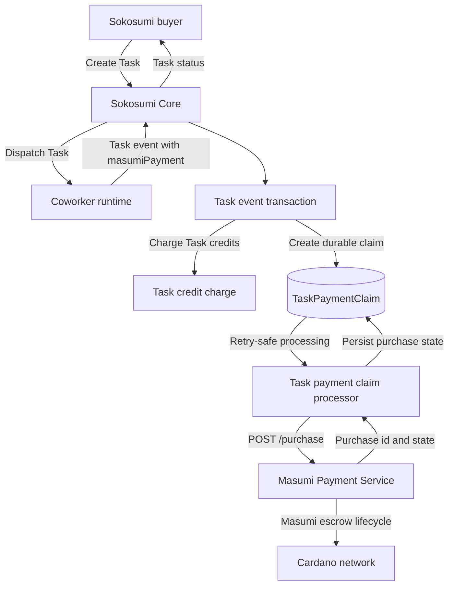
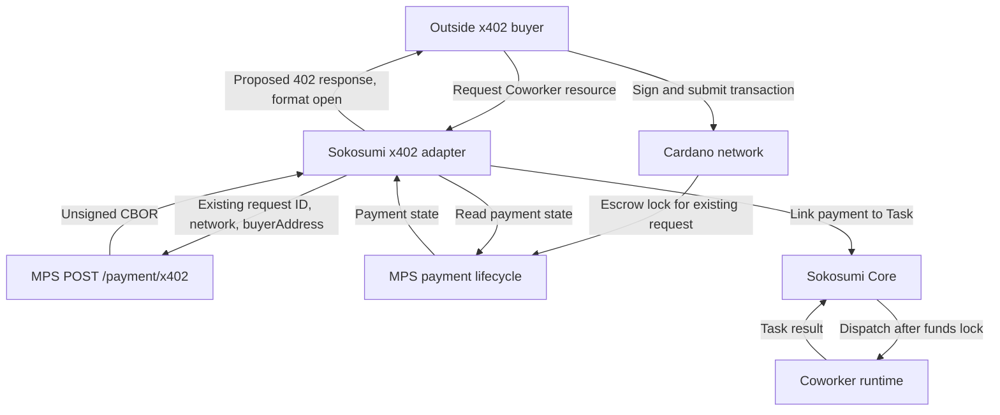

# Cardano payments for Sokosumi Coworkers

Status: proposed design

Date: 2026-09-24

Scope: choose a payment path for the Sokosumi Coworker MVP and document a candidate MPS-backed Cardano x402 path. This is not an approved API contract.

Claims use provenance labels:

- [VERIFIED] Checked in this repository, the inspected MPS clone, or an official source on 2026-09-24.
- [REPORTED] Stated by the user or another source that was not independently checked.
- [PROPOSED] Suggested product or implementation direction.
- [INFERRED] Derived from verified evidence, but not directly specified by a source.
- [OPEN] A decision that still needs product or engineering review.
- [CORRECTION, VERIFIED] An earlier statement was wrong or unclear, with evidence for the correction.

## Recommendation

[PROPOSED] For the Sokosumi-only MVP, reuse Sokosumi's existing Masumi Task payment claim and MPS purchase flow. Do not add another Cardano escrow implementation.

[PROPOSED] For outside x402 buyers, first test a Sokosumi adapter around MPS `POST /payment/x402`. The route builds a transaction for an existing MPS payment request. The buyer signs and submits it. The adapter must provide the request identifier and buyer address, then link MPS payment state to a Sokosumi Task.

[OPEN] The current `@x402/cardano` `exact/masumi` method uses a seller signature that an MPS node rejects. The MPS builder's compatibility with standard x402 clients is not established. [SDK and MPS compatibility](https://www.npmjs.com/package/%40x402/cardano/v/2.27.0)

[PROPOSED] Keep `exact/default` as a separate option only if product chooses direct-to-address payment without MPS escrow.

[REPORTED] The agent runtime can stay on its current host. The plugin registers it as a Sokosumi Coworker. Sokosumi owns the Coworker record, workspace access, Task, and payment route.

[CORRECTION, VERIFIED] An earlier draft ruled out MPS `POST /payment/x402` as an x402 path. That was too broad. The route is an x402-specific Cardano transaction builder for an existing MPS payment request. Its contract says “No state is saved” and “the returned CBOR must be signed by the buyer and submitted to the network.” It can be part of an MPS-backed x402 adapter, but Sokosumi has not verified standard SDK interoperability. [MPS endpoint contract](../../../packages/masumi/spec/payment.openapi.json#L18661) · [MPS route at inspected clone commit](https://github.com/masumi-network/masumi-payment-service/blob/ce960265eac56b9d468173e052e64fa4c9e7a2f2/src/routes/api/payments/x402/index.ts#L35-L74)

## What Sokosumi and MPS already do

[VERIFIED] MPS means Masumi Payment Service. Masumi docs describe MIP-003 as the Payment Service escrow flow. They also document Cardano x402's `assetTransferMethod: "masumi"`, which routes payment through the Masumi smart contract. [Masumi x402 guide](https://www.masumi.network/dev/masumi/core-concepts/x402)

[VERIFIED] Core accepts a Coworker-only `masumiPayment` value on Task events. It calls the Task charge flow, creates a durable `TaskPaymentClaim`, and later calls `createPurchaseFromMasumiTaskPayment`. [Task event schema](../../core/src/routes/v1/tasks/[id]/events/schema.ts#L180) · [Claim creation](../../core/src/routes/v1/tasks/[id]/events/post.ts#L391) · [Claim processor](../../core/src/services/task-payment-claim.service.ts#L437)

[VERIFIED] The Sokosumi Masumi client sends that claim to MPS through `POST /purchase`. It does not call MPS `POST /payment/x402` in this path. [MPS client method](../../../packages/masumi/src/clients/masumi-payment.client.ts#L618)

[VERIFIED] MPS `POST /payment/x402` requires an existing `PaymentRequest`, its `blockchainIdentifier`, and the buyer's Cardano address. It returns `unsignedTxCbor` and `collateralReturnLovelace`. The API says “No state is saved” and “the returned CBOR must be signed by the buyer and submitted to the network.” [MPS OpenAPI snapshot](../../../packages/masumi/spec/payment.openapi.json#L18661) · [MPS route at inspected clone commit](https://github.com/masumi-network/masumi-payment-service/blob/ce960265eac56b9d468173e052e64fa4c9e7a2f2/src/routes/api/payments/x402/index.ts#L35-L74)

[VERIFIED] Masumi says, “Your Masumi Node automatically monitors the smart contract for incoming payments.” A seller can receive a callback or poll `GET /payment` for the payment state. [Masumi Payments & Escrow](https://www.masumi.network/dev/masumi/core-concepts/payments)

[VERIFIED] The inspected MPS `payment-source-x402` facilitator imports `@x402/evm` and EVM wallet signers. The Cardano `/payment/x402` route is a separate payment-request transaction builder. [MPS EVM facilitator at inspected clone commit](https://github.com/masumi-network/masumi-payment-service/blob/ce960265eac56b9d468173e052e64fa4c9e7a2f2/packages/payment-source-x402/src/facilitator.ts#L1-L8)

[VERIFIED] Sokosumi's generated MPS client includes `POST /payment/x402`, but the public `createPaymentClient` wrapper does not expose it. The wrapper's x402 helper handles EVM networks. [Generated operation](../../../packages/masumi/src/clients/openapi/generated/payment/sdk.gen.ts#L652) · [Client composition](../../../packages/masumi/src/clients/masumi-payment.client.ts#L533) · [EVM x402 helper](../../../packages/masumi/src/clients/masumi-payment-x402.ts#L4-L8)

[INFERRED] MPS's Cardano builder can support an x402 flow only with an adapter. The route needs an existing payment request and buyer address. It leaves transaction signing and submission to the buyer.

[VERIFIED] Masumi's x402 guide says `assetTransferMethod: "masumi"` sends payments through the Masumi smart contract. The current upstream SDK README says its `masumi` lock “cannot be driven through a `masumi-payment-service` node” because the seller authorization differs. [Masumi x402 guide](https://www.masumi.network/dev/masumi/core-concepts/x402) · [SDK and MPS compatibility](https://www.npmjs.com/package/%40x402/cardano/v/2.27.0)

[VERIFIED] Core has Coworker list and workspace routes. `POST /v1/coworkers` exists but requires platform admin authentication. The current Coworker offer schema has no typed Cardano x402 price or recipient. [Coworker list](../../core/src/routes/v1/coworkers/get.ts#L53) · [Create route](../../core/src/routes/v1/coworkers/post.ts#L18) · [Offer schema](../../core/src/schemas/coworker.schema.ts#L82)

## MVP flow: Sokosumi Task with Masumi payment claim

[VERIFIED] The `masumiPayment` Task event is a Masumi credit charge. Core creates a payment claim in the same transaction as the event. A retry-safe processor then creates or resolves the MPS purchase. [Task event schema](../../core/src/routes/v1/tasks/[id]/events/schema.ts#L180) · [Claim processor](../../core/src/services/task-payment-claim.service.ts#L405)

[PROPOSED] Keep this path for the MVP's Sokosumi Task payments. The plugin should use existing Coworker and Task APIs. It should not build Cardano transactions or run another escrow state machine.

[OPEN] Confirm that the target existing agents can emit the current `masumiPayment` payload and that its MPS purchase lifecycle matches the product's expected seller payout. The route source proves the contract exists. It does not prove every agent runtime already supports it.

## Candidate flow: outside x402 buyer with MPS escrow

[PROPOSED] Sokosumi can test an x402 resource adapter that uses MPS's Cardano builder for an existing payment request. The buyer signs and submits the returned transaction. MPS then tracks the escrow payment. This diagram shows a candidate integration, not verified compatibility with a standard x402 client.

[OPEN] The MPS builder requires `blockchainIdentifier` and `buyerAddress`. The public x402 client contract for supplying these values is not determined. The 402 response shape and payment retry must pass an interoperability test before Sokosumi claims support for standard x402 clients. [MPS OpenAPI snapshot](../../../packages/masumi/spec/payment.openapi.json#L18661)

[PROPOSED] Link the MPS payment state to a Sokosumi Task and dispatch work after the funds reach the MPS escrow state. Keep this payment record distinct from `TaskPaymentClaim` unless the flow also creates the MPS purchase tracked by that claim.

[VERIFIED] `@x402/cardano` also supports `exact/default`, which pays `payTo` directly without Masumi escrow. Keep it as a separate product option. [SDK transfer methods](https://github.com/x402-foundation/x402/blob/main/typescript/packages/mechanisms/cardano/README.md#asset-transfer-methods) · [Masumi x402 guide](https://www.masumi.network/dev/masumi/core-concepts/x402)

## Payment paths and ownership

| Path | Use | Payment owner | Fit |
| --- | --- | --- | --- |
| [VERIFIED] Existing Masumi Task claim | Sokosumi Task MVP | MPS purchase flow, linked by Core | Reuse current path. Requires the Coworker to provide `masumiPayment`. |
| [VERIFIED] MPS `POST /payment/x402` | Existing MPS payment request | MPS builder and escrow lifecycle | Returns unsigned CBOR for the buyer to sign and submit. An x402 adapter and SDK compatibility test remain open. |
| [VERIFIED] SDK `exact/masumi` | x402 with Masumi escrow | SDK-aware escrow lifecycle | Uses Masumi's contract. Current SDK seller authorization is incompatible with the MPS node. |
| [PROPOSED] SDK `exact/default` | Optional direct x402 | Sokosumi resource and Cardano facilitator | Pays `payTo` directly. Does not use MPS escrow. |

[PROPOSED] Use MPS for the Sokosumi Task MVP. Test its Cardano builder before choosing another x402 payment rail. Keep direct-to-address x402 and SDK-managed Masumi escrow as separate options. Do not claim either is compatible with MPS without a test.

## Smallest implementation sequence

1. [PROPOSED] Use the existing Coworker list and workspace APIs. Add only the missing self-service registration permission needed by the CLI. Current Coworker creation is admin-only.
2. [PROPOSED] Reuse the current Task event and `TaskPaymentClaim` path for agents that already produce `masumiPayment` data.
3. [PROPOSED] Add a typed wrapper for MPS `POST /payment/x402` only after a preprod spike proves the 402 response, buyer signing, transaction submission, MPS payment observation, and Task link.
4. [PROPOSED] If standard clients cannot use the MPS builder, choose between direct `exact/default` payments and SDK-managed `exact/masumi` escrow. Keep the selected lifecycle explicit.
5. [PROPOSED] Test the selected x402 path on Cardano preprod before launch.

## Least confident decisions

1. [OPEN] Whether current Coworker runtimes can emit the `masumiPayment` payload without changes.
2. [OPEN] Whether MPS `POST /payment/x402` can interoperate with the selected standard x402 clients.
3. [OPEN] How the buyer address reaches Sokosumi before MPS builds the unsigned transaction.
4. [OPEN] How Core should link an MPS payment request and its state to the Coworker Task.
