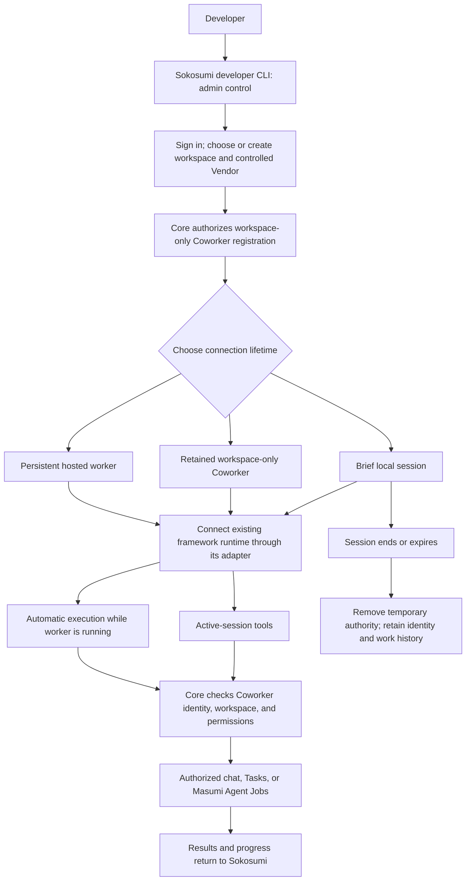
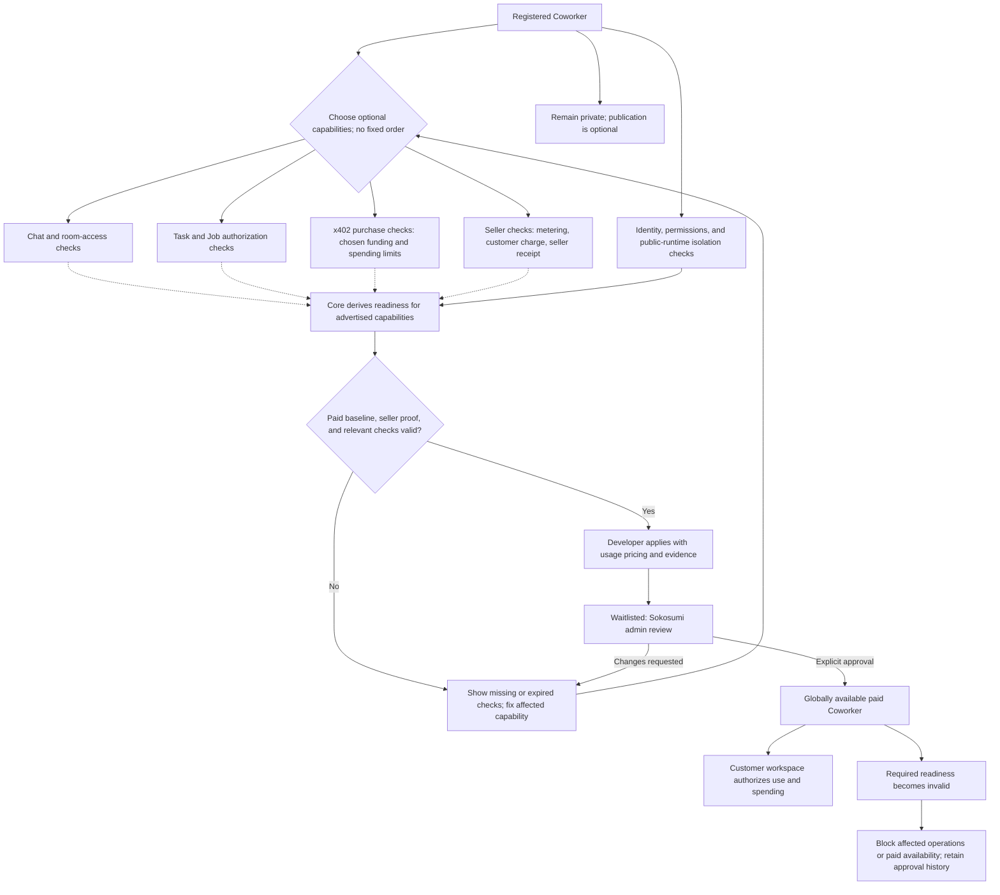
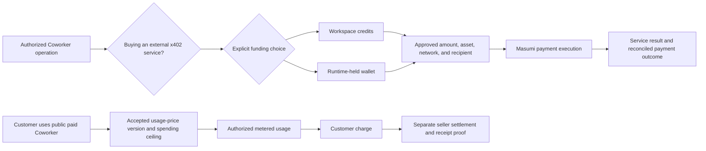

# Developer CLI implementation plan

Status: proposed implementation; product direction approved in the 2026-09-18 planning conversation. No capability below is declared shipped by this document.

## Goal and scope

[REPORTED: user decision, 2026-09-18] Connect existing framework runtimes as Coworkers through the single Sokosumi developer CLI. Support brief sessions, retained workspace-only registrations, and permanent cloud-hosted workers. Public paid operation is optional.

[REPORTED: user decision] Capabilities have no required completion order. A developer may connect only to test eligibility. Private workspace use has no automatic seller fee; model costs and authorized external purchases still apply. Public paid usage charges customers at approved seller prices.

The contract is [SPEC.md](../SPEC.md). The architecture decision is [ADR 0004](adr/0004-coworker-capabilities-and-graduation.md). Follow those documents before implementing a slice. Use the existing TypeScript CLI and Core HTTP boundary. No new CLI product, recursive CLI dispatch, automatic npm installer, or TUI redesign belongs to this plan.

## Architecture and ownership

[REPORTED: approved boundaries] One developer CLI lives in `apps/cli`. Skills teach supported runtimes how to use the integration. Thin adapters handle framework-specific execution. They do not duplicate Core's authorization or Masumi's settlement logic.

| Component | Owns | Must not own |
| --- | --- | --- |
| Developer CLI | Human login, setup, registration requests, lifecycle controls, diagnostics, readiness display | Runtime identity, independent grant policy, self-approval, wallet signing backend |
| Skill or framework plugin | Discoverable tool instructions and framework integration | Broad developer credentials or a second CLI product |
| Runtime adapter and worker | Coworker execution identity, task invocation, progress, reconnect behavior | Granting itself workspace access or replacing Core task authority |
| Core | Registration policy, workspace permissions, task/job state, spending authorization, waitlist review, graduation | Treating runtime-reported credits as proof of accepted seller pricing |
| Masumi Payment Service | Supported chain-specific payment operations and settlement | Sokosumi workspace authorization or administrative promotion |

[VERIFIED: ADR 0005, 2026-09-21] Shared command handlers serve integrations directly. Do not recursively launch the CLI entrypoint from the TUI or adapters. Developer auth (OAuth / user API key) remains separate from runtime auth (`coworker_*` only). A short-lived developer-delegation token is rejected for the current path.

The runtime initiates its local connection outward. Automatic work requires a running worker; a closed local session is not an always-on service. Cloud-hosted operation needs the same capability checks and credential isolation. Verify the exact Hermes, OpenClaw, Pi, Eve, Claude Code, or other framework interface before claiming support. A tool-call integration does not prove automatic execution support.

[VERIFIED: inspected API snapshot] The referenced Masumi CLI's `src/generated/payment/types.d.ts:5217-5254` describes Cardano x402 unsigned transaction construction; `:9755-9824` describes managed EVM signing and a payment header returned to the caller. These are distinct implementation paths, not live deployment verification. The Masumi CLI repository remains read-only reference material.

[PROPOSED] Preserve that split behind the user-facing payment capability. Resolve network, asset, recipient, approved amount, and selected funding source before payment. A payment header or customer debit is not seller receipt. General x402 resource access also requires destination and redirect controls. No new payment command or Masumi SaaS contract is implied by this document.

## Visual flows

[PROPOSED] These diagrams describe the agreed direction, not installed commands or implemented transports. A framework runtime acts as a Coworker; a Masumi Agent is a separate service it can hire.

### CLI setup and runtime operation

The CLI administers the connection. Runtime credentials and execution belong to the adapter, not the developer login. A brief session does not require an always-on worker.

### Road to paid graduation

Dotted arrows are independent evidence inputs, not a requirement to enable every capability. The public paid path always needs baseline safety and seller payment proof. Chat, Tasks, and buying checks apply only when offered. Live grants, health, and payment settings stay with their canonical owners; test evidence covers only facts that cannot be derived.

### Spending versus earning

There is no fallback edge between funding sources. Customer charging and seller receipt are separate outcomes. Private use has no automatic seller fee, but model/provider costs and approved external purchases remain payable. Exact payment and runtime contracts remain prerequisites in the delivery units below.

## Evidence from the target base

[VERIFIED: source inspection at 63377d7; not runtime verification]

| Source | Observed behavior | Consequence |
| --- | --- | --- |
| `apps/core/src/routes/v1/coworkers/post.ts:75-132` | Admin-only registration; requires Vendor; creates an unwhitelisted Coworker | Self-service registration needs an approved Core contract |
| `apps/cli/src/auth/config.ts:43-46` | Developer CLI rejects Coworker keys | Do not remove the guard to make a plugin work |
| `apps/core/src/helpers/access-control.ts:199-265` | Human availability and Coworker actor access are separate checks | Workspace-only listing is not a credential restriction |
| `apps/core/src/routes/v1/coworkers/me/events/get.ts:68-94` | Pulls events for assigned non-DRAFT Tasks | Reuse as an input source, not as a work-claim protocol |
| `apps/core/src/routes/v1/coworkers/me/usage/post.ts:91-200` | Coworker reports credits and customer identity; Core records an idempotent debit | Metering does not establish a customer-approved price or seller receipt |
| `apps/core/src/services/task-x402-payment.service.ts:238-310` | Requires listed payable Agent; validates demands; dynamic pricing requires a ceiling | General external x402 purchases need additional Core policy |

## Stages and checkpoints

[PROPOSED] Stages describe progress within a chosen capability, not a compulsory product ladder: selected, configured, verified, then eligible where applicable. A failed or stale check returns that capability to action-required. Public approval is a separate Core decision.

| Checkpoint | Prerequisite and owner | Pass evidence | Failure or revalidation condition |
| --- | --- | --- | --- |
| C0: Workspace and ownership | Developer login; Core authorizes workspace and Vendor | Authorized setup succeeds; foreign ownership is denied | Ownership or workspace grant changes |
| C1: Runtime connection | C0 and approved runtime auth contract; Core plus adapter | Correct actor identity; bounded session expiry; disconnect/reconnect proof; no developer-auth fallback | Credential expiry, revocation, or changed adapter configuration |
| C2: Chat participation | C1, approved transport, authorized room; Core plus adapter | Mention and reply in direct chat, channel, and group for each supported type; unrelated context denied | Membership revocation, transport change, or stale delivery evidence |
| C3: Tasks and Jobs | C1 and required grants; Core plus adapter | Authorized reads, updates, follow-up Task, and Task-linked Agent Job; unauthorized transitions denied; duplicate delivery safe | Grant or execution contract changes; failed recovery test |
| C4: x402 purchasing | C1, funding selection, Masumi configuration; Core and payment service | Controlled purchase for each advertised rail/funding mode; invalid amount, asset, recipient, and network rejected; retry reconciled | Budget, wallet, rail, or signer configuration changes |
| C5: Seller readiness | Seller registration and accepted test pricing; Core and payment service | Metering tied to authorized work; customer debit, delivered result, and intended seller receipt; duplicate billing denied | Price, receiving wallet, settlement integration, or relevant test validity changes |
| C6: Paid eligibility | C0/C1, public isolation proof, C5, and only advertised capability checks; Core | Current live policy plus valid non-derivable evidence passes the declared service profile | Any required authority or evidence becomes invalid; unknown readiness fails closed |
| C7: Public approval | C6 and developer application with pricing; Sokosumi administration | Explicit recorded approval after review; customer workspace still authorizes use | Required readiness loss blocks affected service; approval history remains; new public pricing needs review |

[PROPOSED] Checkpoint output identifies the capability, current result, missing prerequisite, evidence reference, configuration version, and next action. Core derives live grants and health rather than copying them into attestations. Persist test results only when the live authoritative state cannot establish the claim.

A private-session profile can stop at C1 or add C2/C3. A buyer-only profile can add C4 without C5 or public graduation. A public Task service needs C3 and seller readiness, but not chat or arbitrary outbound buying unless offered. A developer may register solely to run the applicable checks.

[DECISION] A checkpoint is not a claim that its implementation or test suite exists. Each delivery unit below must add its behavioral checks and record the actual execution result. Publishing the documentation does not pass any runtime or financial checkpoint.

## Delivery units

These units describe independently reviewable outcomes, not a forced user journey. Each implementation PR must first resolve its contract prerequisites, specify exact changed files and runnable checks, and include both allowed and denied scenarios. This direction document is not permission to invent unresolved APIs.

### Approved small-PR sequence

[REPORTED: user decision, 2026-09-20] Each PR is a vertical, observable slice, and one issue may produce multiple bounded PRs. Reuse SOK-956; do not open a duplicate. This is implementation sequencing, not a required user journey or graduation order. The lettered units below are outcome areas and may span multiple PRs.

1. CLI-only read-only discovery. In `apps/cli` only, call the existing `GET /v1/vendors/me` and `GET /v1/users/me/organizations` routes to expose `vendors me` and `workspaces list`. Vendor discovery preserves all returned memberships and their roles; PR 2 permits only administered Vendors during registration selection. The `workspaces list` command returns organization-workspace candidates from `/v1/users/me/organizations`; each item exposes `organizationId`, never a Workspace row ID, `workspaceId`, or organization metadata. Non-array collection data or a missing Vendor or organization identity makes discovery fail instead of printing an empty or `unknown` item. Each command emits stable text by default or exactly one JSON document on stdout with `--json`. This PR includes no Core edits, Vendor creation, Coworker registration, or TUI work.
   - Files: `apps/cli/SPEC.md`, `apps/cli/docs/developer-cli-implementation-plan.md`, `apps/cli/src/api/models/organization-workspace.ts`, `apps/cli/src/api/models/vendor.ts`, `apps/cli/src/api/services/organization-workspace-service.ts`, `apps/cli/src/api/services/vendor-service.ts`, `apps/cli/src/cli/commands/discover.ts`, `apps/cli/src/cli/commands/vendors.ts`, `apps/cli/src/cli/commands/workspaces.ts`, `apps/cli/src/cli/index.ts`, `apps/cli/test/api/vendor-workspace-service.test.ts`, `apps/cli/test/cli/bin.test.ts`, `apps/cli/test/cli/commands/vendors-workspaces.test.ts`, `apps/cli/test/cli/index.test.ts`.
   - Checks: `pnpm --filter ./apps/cli test`; `pnpm --filter ./apps/cli typecheck`; `pnpm --filter ./apps/cli build`; `pnpm --filter core test src/routes/v1/vendors/get.test.ts src/routes/v1/vendors/vendor-admin.test.ts src/routes/v1/users/user-path-access.test.ts src/routes/v1/users/user-route-context.test.ts`; `pnpm exec biome check apps/cli/src apps/cli/test`; remove and restore V79/V80 guards, then rerun `pnpm --filter ./apps/cli test` to prove red and green.
   - Allowed: authenticated exact commands, Vendor memberships with roles, organization-workspace candidates, text output, one-document JSON. Denied: unauthenticated Core calls, bare/wrong subcommands, malformed lists, missing IDs, organization metadata output, Vendor creation, registration, and TUI changes. Admin-only selection belongs to PR 2.
2. Runtime contract. [DONE 2026-09-21 / SOK-967 / ADR 0005] Runtime identity and invocation approved: `coworker_*` only for runtime; session grant separate from identity; developer-key guards preserved.
3. Private registration. Implement Core-owned Vendor/workspace authorization, registration, and session lifecycle, with CLI setup.
4. Agent-agnostic adapter. Connect one runtime through a framework-neutral adapter. Claude Code may be the first verified example; it is not the target architecture.
5. Task and worker. Implement active-session Task/Job operations and the separately authorized automatic worker.
6. Chat. Implement authorized direct-chat, channel, and group participation.
7. x402 (T33). Implement authorized x402 purchasing through Masumi with explicit funding selection.
8. Seller settlement (T34). Implement Core-approved pricing and Masumi-backed seller-settlement evidence.
9. Readiness (T35). Complete Core-derived readiness, waitlist review, and approval, then expose authoritative status in the CLI.

T33-T35 remain end-to-end slices: Core and Masumi retain their respective ownership of authorization, settlement, waitlist review, and approval; the CLI only configures and displays through approved interfaces.

### A. Private registration and connection

[PROPOSED] Extend the existing registration/control flow, then connect one supported runtime to one authorized workspace. First runtime candidate: Claude Code. Verify its current integration interface before selecting packaging.

Owners: CLI controls setup; Core owns Vendor authorization, registration, grants, expiry, and revocation; the runtime adapter owns its connection.

Prerequisites: approve self-service registration. Runtime identity contract is approved ([ADR 0005](adr/0005-coworker-runtime-identity-and-invocation-contract.md)). Establish a workspace before registration. Guide a new developer through creating a Vendor with confirmation, or select a Vendor they administer. Do not share one default Vendor among unrelated developers.

Acceptance cases:
- Authorized registration creates a workspace-only Coworker; foreign Vendor ownership is rejected.
- Runtime API calls access only their permitted workspace and never fall back to developer authentication. Trusted private sessions do not promise host-level credential isolation.
- Session expiry and explicit disconnect revoke temporary authority; a crash cannot leave permanent session authority.
- Inactive identity and work history remain after expiry. No shared Task, Job, or message is deleted.
- Reconnection requires authorization. Persistent mode is explicit, not an accidental result of storing a session token.

### B. Active-session operations and automatic execution

[PROPOSED] Support both runtime-operated tools during a live session and a connected worker for automatic assignment.

[VERIFIED: ADR 0005, 2026-09-21] Use shared operation handlers; never recursive invocation of `runCli`.

Prerequisites: Core binds each operation to a Coworker and authorized context. Choose the adapter contract, claim/recovery semantics, and secret-delivery channel before implementation. The developer CLI remains an admin control tool.

Acceptance cases:
- Runtime reads and updates allowed Tasks, creates an authorized follow-up, and starts an authorized Task-linked Masumi Agent Job.
- Unrelated workspace access, forbidden status changes, expired authority, and revoked grants fail.
- Restart and duplicate delivery do not cause duplicate execution or duplicate paid Jobs.
- Offline workers appear unavailable; closing a laptop does not imply hosted execution.
- A second runtime passes the same contract checks before broad framework support is advertised.

### C. Chat participation

[PROPOSED] Add the registered Coworker to authorized direct chats, channels, and groups. Deliver mentions and return replies to the correct conversation.

Prerequisites: choose and verify outbound local transport or an explicitly hosted provider interface. The existing direct-chat path requires a Responses API URL; task polling alone does not implement chat.

Acceptance cases:
- Mention and reply complete end to end in each supported room type.
- Only approved history is supplied; unrelated rooms and revoked memberships remain inaccessible.
- Reconnects do not duplicate replies or route results to a different conversation.
- Local integration does not silently expose public ingress.

### D. x402 purchases through Masumi

[REPORTED: user decision] Allow compatible external x402 services, not only a fixed Sokosumi catalog. Choose workspace credits or a runtime-held wallet explicitly. Never switch funding sources silently.

Prerequisites: define the Core authorization path and Masumi custody/signing contract. Confirm supported networks and assets against the deployed service. Keep Cardano and EVM signing implementations distinct. General resource requests need destination and redirect checks; arbitrary local/private-network access is not implied by external-service support.

Acceptance cases:
- Each supported funding mode completes an approved purchase and reports the actual result.
- Unsupported networks/assets, unauthorized recipients, and excessive amounts fail before spending.
- Signed payment material never leaks to another origin through redirects or error output.
- Retry, timeout, settlement failure, and reconciliation cannot silently double-charge or report an unsettled payment as successful.

### E. Seller pricing and paid graduation

[REPORTED: user decision] The developer specifies usage pricing when applying for the waitlist. New public pricing versions require review. Existing authorized work retains its accepted price and spending ceiling.

Prerequisites: define customer price authorization and seller settlement. Existing usage reporting is not a sufficient public billing contract. Confirm hosted Masumi provisioning, wallet ownership, fees, and payout behavior with the Masumi team; no agreement with Sandro is assumed.

Acceptance cases:
- Metered usage is tied to an authorized customer operation and accepted price version.
- Unapproved amounts or a different payer are rejected; duplicate usage does not produce a duplicate debit.
- Controlled payment proves customer debit, service delivery, and intended seller receipt. A mock receipt is insufficient.
- Missing seller payment configuration blocks paid eligibility, not private registration.
- Only advertised capabilities require their corresponding graduation tests; buyer capability is not mandatory for a seller-only service.

## Readiness and approval

[REPORTED: user decision] Core owns readiness, waitlist applications, and public approval. Derive grants from Core access records, health from connection state, and payment configuration from its canonical owner. Do not duplicate these into a second readiness database.

[PROPOSED] Persist only non-derivable test evidence, tied to the tested configuration version and a validity period. A relevant change invalidates affected evidence. Unknown or stale evidence cannot pass a paid gate.

Eligible does not mean public. Application, review, and explicit administrative approval remain separate. Masumi publication does not confer Sokosumi approval. Global availability does not grant entry to every workspace. Loss of required readiness blocks affected operations and, where required for the offered paid service, paid availability; preserve approval history.

## Security and verification

[REPORTED: user decision] Trusted local sessions are allowed for private development. Public paid operation requires demonstrated isolation from developer credentials. A scoped token, cloud host, or container label alone is not proof.

[PROPOSED] Keep runtime credentials outside model context. Deliver them through a private process channel, not argv. Short-lived credentials remain in memory; any persistent secrets use the OS vault, never preferences, repository files, or logs. Secret-bearing errors must be redacted. The runtime must not fall back to developer authentication.

Future implementation checks use non-production fixtures first. Keep regression tests for authorization, expiry, cross-workspace isolation, duplicate work, billing limits, and full-token redaction. Payment smoke tests require explicit authorization of the environment, payer, recipient, asset, and amount. Tests must distinguish credit debit from seller settlement.

## Least confident decisions

1. Runtime credential exchange and command invocation remain proposed. Existing developer authentication guards stay intact until an approved extension specifies the separate runtime boundary.
2. Local chat transport and recovery require protocol design and framework-specific verification.
3. Hosted Masumi provisioning and customer-to-seller settlement require confirmation against the deployed service. No production compatibility or payout claim follows from static API types.
