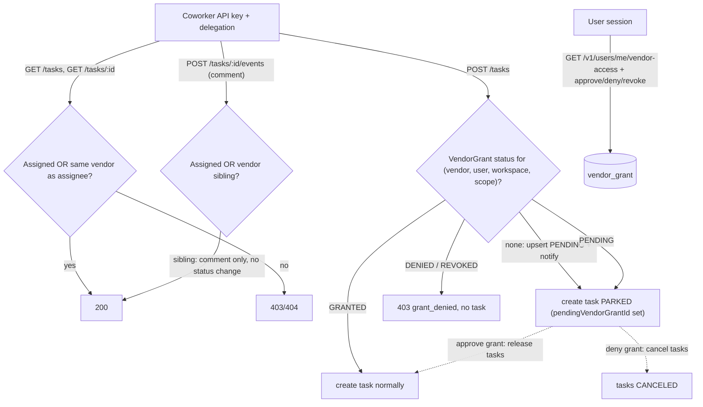

# Vendor-Based Coworker Permission System

> Implementation plan, approved 2026-07-08. Not yet built — see the checklist at
> the bottom for the work breakdown.

Built fresh from `main`. Coworkers (AI agents, `Coworker` model) get grouped under a new `Vendor` entity. Permissions split into two tiers:

- **Automatic (no approval)**: a coworker can view and comment on any task assigned to a coworker of the same vendor.
- **User-approved grants**: autonomous task creation, in two scopes — tasks assigned within the vendor, or any task in the workspace.

## Data flow

## 1. Schema (`packages/database/prisma/schema.prisma`)

- New `Vendor` model: `id`, `createdAt`, `updatedAt`, `name`, `slug @unique`, `logo?`, relations to `Coworker` and `VendorGrant`. The vendor is the single owner of company branding.
- `Coworker.vendorId String` + relation + index — **required**, every coworker belongs to exactly one vendor.
- **Remove** `Coworker.company` and `Coworker.companyLogo` — vendor `name`/`logo` replace them; no duplicate branding fields left behind.
- New `VendorGrant` model:
  - `scope`: enum `VendorGrantScope { VENDOR, WORKSPACE }` — the scope names the **autonomy boundary**, not a single action: `VENDOR` = the coworker may act autonomously on tasks assigned within its vendor; `WORKSPACE` = it may act autonomously on anything in the workspace. Task creation is the only gated action today; future autonomous capabilities check the same grant.
  - `status`: enum `VendorGrantStatus { PENDING, GRANTED, DENIED, REVOKED }`
  - `vendorId`, `userId`, `workspaceId` (required, `@db.Uuid`, relation to `Workspace`), `resolvedAt?`
  - `@@unique([vendorId, userId, workspaceId, scope])`, index on `[userId, status]`
- `Task.pendingVendorGrantId String?` + relation to `VendorGrant` (`onDelete: SetNull`) + index — non-null means the task is **parked**, waiting for the referenced grant to be approved. No separate boolean; the FK is the single source of truth for parked state and directly identifies which tasks to release or cancel when the grant resolves.
- One migration that also backfills data so `vendorId` can be `NOT NULL` from the start:
  1. Create `vendor` table and insert the two vendors: `Service Plan` (slug `service-plan`) and `utxo AG` (slug `utxo-ag`), with fixed ids generated in the migration SQL. Seed each vendor's `logo` from an existing `coworker.companyLogo` value in its group when one is present.
  2. Add `coworker.vendorId` as nullable, assign coworkers with slug in (`alex`, `hannah`, `elena`, `jamal`, `maya`) to Service Plan, all remaining coworkers to utxo AG (slugs are unique on `Coworker`; the same names exist in `packages/database/scripts/seed-coworker-profiles.ts`).
  3. Alter `vendorId` to `NOT NULL`, then drop `coworker.company` and `coworker.companyLogo`.
- New repositories `vendor.repository.ts`, `vendor-grant.repository.ts`; extend `coworker.repository.ts` to include `vendorId` and vendor lookups.
- Coworker creation (admin `POST /v1/coworkers`) requires a `vendorId` going forward.

Every grant is bound to one workspace. `workspaceId` is **required for both scopes** (not optional): a task is always created in exactly one workspace, so even the vendor-scoped grant only makes sense per workspace — the scope enum controls the assignee restriction (vendor siblings only vs. any task), while `workspaceId` controls where. This also keeps the unique constraint simple (a nullable column in a Postgres unique index would allow duplicate rows). `userId` stays on the grant as the approver — the delegation target whose behalf the coworker acts on. At request time the workspace is resolved from the delegated user's active context via `apps/core/src/middleware/workspace.ts`, and the grant lookup matches `(vendorId, userId, workspaceId, scope)`.

## 2. Core access control (`apps/core/src/helpers/access-control.ts`)

- Extend coworker task read (`requireTaskReadForRouteVars` and the coworker branch of `GET /v1/tasks` in `apps/core/src/routes/v1/tasks/get.ts`): allow when the task has an assigned coworker and `task.coworker.vendorId` equals the actor coworker's `vendorId`. Task listing for coworkers includes vendor-sibling tasks (still excluding `DRAFT`).
- Extend comment authorization in `apps/core/src/routes/v1/tasks/[id]/events/post.ts`: vendor siblings may create **comment-only** events. Status transitions and billing stay restricted to the assigned coworker (existing agent transition table in `apps/core/src/helpers/task.ts` untouched).

## 3. Grant-gated autonomous task creation (`apps/core/src/routes/v1/tasks/post.ts`)

Today any delegated coworker can create tasks (documented "temporary model"). Change for `actor: "coworker"` with delegation:

- Resolve the target workspace from the delegated user's context (workspace middleware), then determine the required scope based on the actor coworker's vendor:
  - assignee coworker in the same vendor → `VENDOR` scope for that workspace
  - any other assignee or no assignee → `WORKSPACE` scope for that workspace (a granted `WORKSPACE` scope also satisfies `VENDOR` in the same workspace)
- Decision table for the grant at `(vendorId, userId, workspaceId, scope)`:
  - **`GRANTED`** → create the task normally.
  - **No grant** → idempotently upsert a `PENDING` grant, create the task **parked** (`pendingVendorGrantId` set), notify the user once about the new access request. Respond `201` with the task flagged as awaiting approval.
  - **`PENDING`** → create the task parked, linked to the same grant. No additional notification per task; the approval UI shows the accumulated parked tasks.
  - **`DENIED` / `REVOKED`** → reject with `403` and a distinct `grant_denied` error kind (agents should not retry); the grant is not re-opened automatically.
- **Parked task semantics**: the task keeps its requested fields and status, but is excluded everywhere agents or execution could touch it — coworker task lists/reads (`GET /v1/tasks`, `requireTaskReadForRouteVars`), event and job creation, and the scheduler's `(status, nextRunAt)` pickup all filter on `pendingVendorGrantId IS NULL`. The owner sees parked tasks in their workspace flagged "awaiting your approval".
- Session-user task creation is unchanged.

## 4. Grant management API (`apps/core/src/routes/v1/users/me/vendor-access/`)

Follows the existing self-scoped `/v1/users/me/*` convention (like `notices`, `subscription`, `uploads`) and the action-route precedent from Hermes confirmations:

- `GET /v1/users/me/vendor-access` — session user only (`requireUserAuthContext`), lists own grants with vendor and workspace info (personal vs. which organization) plus the count of parked tasks per grant, filterable by status.
- `POST /v1/users/me/vendor-access/{id}/approve` — `PENDING`/`DENIED`/`REVOKED` → `GRANTED`, sets `resolvedAt`. In the same transaction, **releases all parked tasks** referencing the grant (clears `pendingVendorGrantId`); released tasks proceed with the status they carried.
- `POST /v1/users/me/vendor-access/{id}/deny` — `PENDING` → `DENIED`, sets `resolvedAt`. **Cancels all parked tasks** referencing the grant (`CANCELED` status + task event) so an audit trail of attempted tasks remains.
- `POST /v1/users/me/vendor-access/{id}/revoke` — `GRANTED` → `REVOKED`, sets `resolvedAt`. No parked tasks exist at this point (they were released on approval); it only blocks future creates.
- Zod/OpenAPI schemas under the route folder, following existing route conventions; mount within the users router (`apps/core/src/routes/v1/users/index.ts`).

## 5. Admin vendor management

- `POST/GET/PATCH /v1/vendors` — admin-only (`requireAdminAuthContext`) CRUD for vendors (`name`, `slug`, `logo`), following the pattern of `apps/core/src/routes/v1/coworkers/`.
- Update coworker schemas in `apps/core/src/routes/v1/coworkers/schema.ts` and `apps/core/src/schemas/coworker.schema.ts`:
  - `vendorId` **required** on create, updatable via patch.
  - Drop `company`/`companyLogo` from create/patch inputs and responses; responses instead embed a `vendor` object (`id`, `name`, `slug`, `logo`) so consumers get branding from the vendor.
  - Ripple through other Core surfaces that read `company` off coworkers (Hermes schema/client in `apps/core/src/schemas/hermes.schema.ts`, `apps/core/src/clients/hermes-orchestrator.client.ts`).

## 6. Web app

- Regenerate the Core client: `pnpm --filter web generate:core:snapshot`.
- Replace `coworker.company` usage with the embedded `vendor` object: the agents gallery grouping in `apps/web/src/components/agents/coworker-gallery-section.tsx` groups by vendor id/name instead of the free-text company string, and `apps/web/src/components/agents/company-mark.tsx` renders `vendor.logo` (falling back to `vendor.name`) instead of the hardcoded `COMPANY_LOGOS` lookup. Update `apps/web/src/lib/types/coworker.ts` and task coworker-options accordingly.
- Grant approval UI: a "Vendor access" section (under settings/connections area) listing pending and resolved grants — including how many parked tasks each pending grant holds — with approve / deny / revoke actions via web server actions calling Core.
- Parked tasks appear in the owner's task list with an "awaiting your approval" badge linking to the grant decision.
- Notification entry for new pending grant requests linking to that UI.

## 7. Tests

- Repository + route tests (Vitest, colocated `*.test.ts`): vendor-sibling read/comment allowed, cross-vendor denied, status change by sibling denied, create gated per scope, grant in workspace A does not authorize creation in workspace B, pending grant upsert idempotency, admin vendor CRUD.
- Parking lifecycle tests: no-grant create parks the task and opens a pending grant; pending-grant create parks without duplicate notifications; denied/revoked create rejects with `grant_denied` and no task; parked tasks invisible to coworker list/read, event/job creation, and scheduler pickup; approve releases all parked tasks; deny cancels them with a task event; approve from `DENIED`/`REVOKED` re-grants.

## Out of scope

- Held comments from the unmerged `claude/delegated-task-comments` branch — vendor-sibling comments post immediately (no approval needed), so there is no held-comment flow. Task parking, in contrast, is in scope (section 3).

## Work breakdown

- [ ] Schema: add `Vendor`, required `Coworker.vendorId`, `VendorGrant`, `Task.pendingVendorGrantId`; migration backfills vendors and drops `company`/`companyLogo`
- [ ] Core access control: extend task read/list and comment access for vendor siblings
- [ ] Create gate: gate delegated coworker task creation behind `VendorGrant` scopes; park tasks while pending, reject when denied/revoked
- [ ] Grant routes: add `/v1/users/me/vendor-access` list and approve/deny/revoke routes with parked-task release/cancel
- [ ] Admin vendors: add admin `/v1/vendors` CRUD and `vendorId` on coworker admin schemas
- [ ] Web: regenerate core client, migrate web `company` usage to vendor, add grant approval UI, parked-task badge, and notification
- [ ] Tests: repository and route tests for vendor access, grants, and the parking lifecycle
