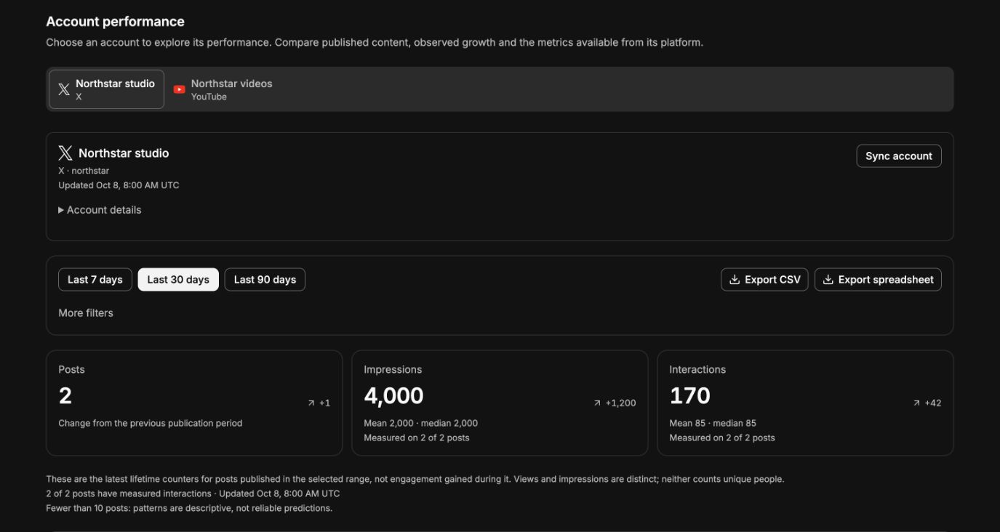

# Social performance provider capabilities

Verified on 2026-10-08. This records available APIs and the implementation's coverage. It does not assert which commercial plan, app products, or OAuth grants the production connected accounts currently have; those need an administrator to verify.

## Visual verification

Performance opens one connected account at a time. Account tabs keep the full authorized catalogue available; metrics, posts, research, exports and sync use the selected connection. Detailed filters and additional analysis are collapsed by default.

The actual React components were rendered with synthetic data for dark/light and mobile layout checks. This screenshot is layout evidence; no live connected account was queried for the fixture.

## Implemented provider collection

| Provider | Imported data | Coverage and prerequisites |
| --- | --- | --- |
| X | Authored posts, outgoing reply/quote/repost classification, media previews, public impressions/likes/replies/reposts/bookmarks/quotes; authorized recent private URL clicks, profile clicks and organic metrics; current follower/profile counters | User timeline pagination has a provider cap. Owner private counters require OAuth user context and posts younger than 30 days; expired private observations retain their actual collection time. Video views describe media across its uses and are not unique post impressions. [Metrics](https://docs.x.com/x-api/fundamentals/metrics), [timelines](https://docs.x.com/x-api/posts/timelines/introduction). |
| Instagram | Published media and carousel previews, views/likes/comments/shares/saves, separately labelled reach and interactions; profile counters and available rolling account insights | Professional-account insights and permission-dependent counters. Reach remains separate from repeat views. Missing or refused fields remain unavailable. [Current connector inputs and permissions](https://docs.composio.dev/toolkits/instagram). |
| Facebook | Page posts and attachment previews; reactions/comments/shares, available media views and unique media views; Page follower totals, follows/unfollows, actions and engagement | Read-only Page access plus insight permissions. Current connector metric names replace deprecated impression/click fields. Unique media views remain separate from repeat views. [Current connector inputs and permissions](https://docs.composio.dev/toolkits/facebook). |
| YouTube | Published channel videos and thumbnail previews; views/likes/comments; channel subscriber totals, subscribers gained/lost, watch minutes, average viewing duration and percentage, shares | Owner Analytics authorization is separate from public Data API counters. Watch and subscriber metrics are account report totals, not inferred for each video. [Channel reports](https://developers.google.com/youtube/analytics/channel_reports), [authorization](https://developers.google.com/youtube/analytics/guides/authorization). |
| TikTok | Own public video history and cover previews; views/likes/comments/shares; available profile followers/following/likes/video totals | Display API `video.list` and `user.info.stats`. This API family exposes own profile/video data, without a general competitor/audience analytics endpoint. Cover URLs expire and require refresh. [Display API](https://developers.tiktok.com/docs/en/display-api-overview), [scopes](https://developers.tiktok.com/docs/en/tiktok-api-scopes). |
| LinkedIn | Approved member authored history, impressions/reactions/comments/reshares/reach/saves/sends/link clicks/content-driven followers/profile views; permitted follower total; organization organic share metrics when connected with an organization URN | Member analytics require `r_member_postAnalytics`; follower count needs `r_member_profileAnalytics`; member history requires restricted `r_member_social`. Organization reads require `r_organization_social`, analytics `rw_organization_admin` and the permitted role. Organization statistics use a rolling 12-month window. Existing connection selection still chooses a member identity. [Member analytics](https://learn.microsoft.com/en-us/linkedin/marketing/community-management/members/post-statistics?view=li-lms-2026-06), [followers](https://learn.microsoft.com/en-us/linkedin/marketing/community-management/members/follower-statistics?view=li-lms-2026-07), [Posts API](https://learn.microsoft.com/en-us/linkedin/marketing/community-management/shares/posts-api?view=li-lms-2026-09), [organization analytics](https://learn.microsoft.com/en-us/linkedin/marketing/community-management/organizations/share-statistics?view=li-lms-2026-06). |

All providers feed shared cohort comparisons, ranking, format analysis and exports. Engagement calculations require measured components and use an explicit denominator. Daily collection records observations going forward; those observations do not turn lifetime counters into historical event-time activity.

Core workspace aggregation and Soko Bot reports use the active authorized workspace and preserve project/account attribution. The combined cohort deduplicates overlapping provider post IDs using the freshest measured copy before calculating totals, means and medians. Per-project and per-account comparisons remain scoped samples and can overlap, so they are not additive. Follower observations remain per connection rather than a deduplicated cross-network audience. The Performance UI and its CSV/XLSX links select one connection, including in the workspace view; exports retain project attribution and coverage.

## X audience and benchmarking

Scoped native reads return a page of followers, incoming mentions/replies/quotes, or the likers/reposters of an owned cached post. Per-post reads validate cached post ownership in the project and workspace before obtaining connected-account credentials. The analytics service does not build or persist an audience database. Browser samples remain in query memory; requested bot evidence follows the existing conversation/tool-result storage. Mentions counts describe a page of up to 100 from a timeline of up to 800 recent provider-visible mentions; likes and reposts describe one selected post. Public profile locations are self-reported, rather than inferred demographics. [Mentions](https://docs.x.com/x-api/users/get-mentions), [likers](https://docs.x.com/x-api/posts/get-liking-users), [reposters](https://docs.x.com/x-api/posts/get-reposted-by).

A public-handle benchmark reads up to 100 original/quote posts from 90 days. It excludes private click metrics and states when more posts exist. Its impressions/followers ratio uses current followers and lifetime repeat impressions, so it is not unique reach or growth. [User posts](https://docs.x.com/x-api/users/get-posts).

Recent public discovery reads a bounded page from the last seven days, with topic phrase, handle, language and media operators. Date validation excludes future and archival ranges. Follower-size and metric thresholds and recency/like/impression ranking apply only within the fetched page. Missing required counters are excluded and disclosed. Evidence includes public author metadata, original post text/media/counters and unique post identifiers; protected external content and private click counters are excluded. Incoming mention responses similarly preserve original evidence and per-post reply/quote/mention classification for deduplicating overlapping pages. [Recent search](https://docs.x.com/x-api/posts/search-recent-posts), [query operators](https://docs.x.com/x-api/posts/search/integrate/build-a-query).

Native requests use the current documented `post.fields`, `note_post`, `referenced_posts` and `repost_count`. Responses also accept older connector forms `note_tweet`, `referenced_tweets`, `retweet_count` and `includes.tweets`.

## Follow-ups and required actions

| Remaining feature | Constraint or missing slice | Next action |
| --- | --- | --- |
| Historical X event-time analytics and attribution | The timestamped post analytics product requires Enterprise access. Existing lifetime snapshots cannot reconstruct events before collection starts. | [SOK-1318](https://linear.app/masumi/issue/SOK-1318/enable-entitled-historical-x-engagement-analytics): verify the X app's access and cost, then integrate the entitled analytics endpoint with dated provenance and retention. [X post analytics](https://docs.x.com/x-api/posts/get-post-analytics), [connector analytics tool](https://docs.composio.dev/toolkits/twitter). |
| Full X archival content/mention backfill | User and mention timelines are bounded; recent search covers seven days. Full archive is an access/configuration-dependent API. This is not an inherent prohibition. | [SOK-1319](https://linear.app/masumi/issue/SOK-1319/add-access-verified-x-archive-backfill-and-search): verify eligible paid search access and connector authentication, add bounded backfill with cursor progress, cost controls and completeness metadata. [Search coverage](https://docs.x.com/x-api/posts/search/introduction). |
| Audience demographics and follower attribution across platforms | X's public relationship/profile APIs do not provide a general age/gender dataset or the date an individual followed. Other providers expose distinct authorized aggregate reports, rather than interchangeable contact lists. | [SOK-1322](https://linear.app/masumi/issue/SOK-1322/add-approved-audience-and-retention-reports-across-platforms): build each supported provider report behind its actual permissions/thresholds; report absence rather than estimate personal attributes. Start with authorized YouTube aggregate reports. [YouTube channel reports](https://developers.google.com/youtube/analytics/channel_reports). |
| LinkedIn organization connection selection and operational grants | The native analytics seam supports organization URNs, but current connect identity resolution creates member connections. Approved Community Management products/scopes cannot be enabled by a code change alone. | [SOK-1320](https://linear.app/masumi/issue/SOK-1320/connect-linkedin-organizations-and-verify-analytics-grants): obtain the app products and grants, reconnect test accounts, implement organization discovery/role validation/selection, then verify native calls against those accounts. [Access tiers](https://learn.microsoft.com/en-us/linkedin/marketing/increasing-access?view=li-lms-2025-04). |
| TikTok deeper retention/demographics and general public discovery | Current Display API is limited to own profile and public videos. Research Tools are restricted to qualifying not-for-profit research and must not be treated as generic commercial analytics access. | [SOK-1321](https://linear.app/masumi/issue/SOK-1321/enable-approved-tiktok-performance-and-deeper-creator-analytics): investigate an eligible commercial Business API integration for creator analytics and obtain approval; do not substitute Research credentials. [Display API](https://developers.tiktok.com/docs/en/display-api-overview), [Research eligibility](https://developers.tiktok.com/docs/en/research-api-codebook). |
| Richer Meta/YouTube report breakdowns | Native products have more aggregate insight/report dimensions than the current imported account/post DTO. Scope grants and privacy thresholds affect results. | [SOK-1322](https://linear.app/masumi/issue/SOK-1322/add-approved-audience-and-retention-reports-across-platforms): extend validated Core report schemas for dated/dimensioned data, using current permissions and documented semantics; verify against a permitted account before claiming full coverage. [Instagram tools](https://docs.composio.dev/toolkits/instagram), [Facebook tools](https://docs.composio.dev/toolkits/facebook), [YouTube reports](https://developers.google.com/youtube/analytics/channel_reports). |

Draft assistance can reuse the existing validated social-post draft creation flow. Model-generated ideas or quality scores need explicit evidence/context and must not be presented as measured provider performance or promised outcomes.

[SOK-1323](https://linear.app/masumi/issue/SOK-1323/validate-numeric-draft-performance-scoring) tracks validation before adding numeric draft scores. [SOK-1324](https://linear.app/masumi/issue/SOK-1324/verify-performance-with-live-authorized-provider-accounts) tracks verification with real authorized accounts and app grants; mocked response tests do not establish live provider entitlement.

The Composio native proxy injects the pinned connected account's credentials. Its v3.1 HTTP schema passes fixed custom headers through `parameters` with `type: "header"`; code must not send raw authorization credentials or accept arbitrary target URLs. [Proxy reference](https://docs.composio.dev/reference/api-reference/tools/postToolsExecuteProxy).
